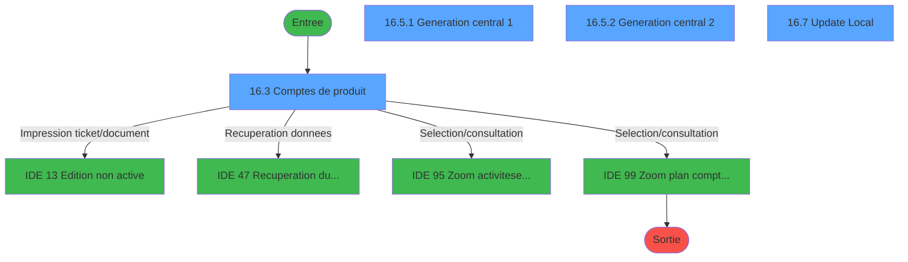
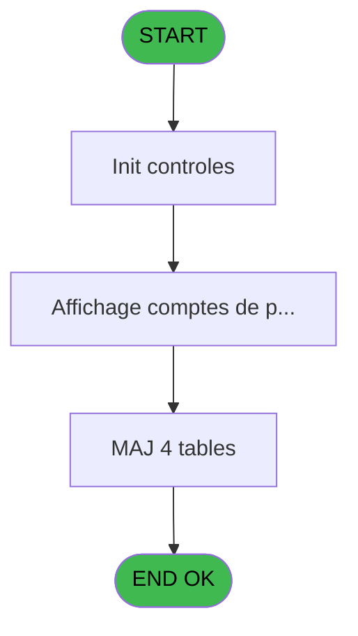
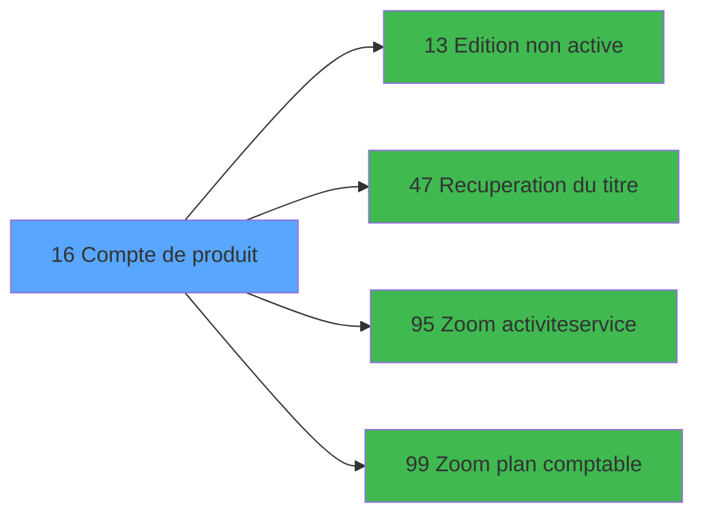

# MAI IDE 16 - Compte de produit

> **Analyse**: Phases 1-4 2026-02-03 14:47 -> 14:47 (10s) | Assemblage 14:47
> **Pipeline**: V7.2 Enrichi
> **Structure**: 4 onglets (Resume | Ecrans | Donnees | Connexions)

<!-- TAB:Resume -->

## 1. FICHE D'IDENTITE

| Attribut | Valeur |
|----------|--------|
| Projet | MAI |
| IDE Position | 16 |
| Nom Programme | Compte de produit |
| Fichier source | `Prg_16.xml` |
| Dossier IDE | Caisse |
| Taches | 30 (4 ecrans visibles) |
| Tables modifiees | 4 |
| Programmes appeles | 4 |

## 2. DESCRIPTION FONCTIONNELLE

**Compte de produit** assure la gestion complete de ce processus, accessible depuis [Menu parametrage caisse (IDE 37)](MAI-IDE-37.md), [MAJ plan comptable (IDE 35)](MAI-IDE-35.md).

Le flux de traitement s'organise en **5 blocs fonctionnels** :

- **Creation** (10 taches) : insertion d'enregistrements en base (mouvements, prestations)
- **Traitement** (9 taches) : traitements metier divers
- **Calcul** (8 taches) : calculs de montants, stocks ou compteurs
- **Initialisation** (2 taches) : reinitialisation d'etats et de variables de travail
- **Validation** (1 tache) : controles et verifications de coherence

**Donnees modifiees** : 4 tables en ecriture (comptes_recette__cre, articles_________art, comptes_produit_central, import_prestationimp).

Detail : phases du traitement

#### Phase 1 : Calcul (8 taches)

- **16** - Compte de produit **[[ECRAN]](#ecran-t1)**
- **16.3** - Comptes de produit **[[ECRAN]](#ecran-t4)**
- **16.5.1.1** - Comptes 7
- **16.5.1.2** - Comptes 6
- **16.5.1.3** - Comptes bilan 1
- **16.5.1.4** - Comptes bilan 2
- **16.5.2.1** - Comptes bilan 1
- **16.5.2.2** - Comptes bilan 2

Delegue a : [Zoom plan comptable (IDE 99)](MAI-IDE-99.md)

#### Phase 2 : Traitement (9 taches)

- **16.1** - Parametres caisse
- **16.3.1** - Abandon
- **16.3.3** - Action
- **16.5** - generation central **[[ECRAN]](#ecran-t11)**
- **16.5.1** - Generation central 1 **[[ECRAN]](#ecran-t12)**
- **16.5.2** - Generation central 2 **[[ECRAN]](#ecran-t21)**
- **16.7** - Update Local **[[ECRAN]](#ecran-t29)**
- **16.8** - sauve simpsup100
- **16.9** - reintegre simpsup100

Delegue a : [Recuperation du titre (IDE 47)](MAI-IDE-47.md)

#### Phase 3 : Creation (10 taches)

- **16.2** - Creation auto last minute
- **16.4** - Abandon creation
- **16.5.1.1.1** - Creation
- **16.5.1.2.1** - Creation
- **16.5.1.3.1** - Creation
- **16.5.1.4.1** - Creation
- **16.5.2.1.1** - Creation
- **16.5.2.2.1** - Creation
- **16.7.1** - creation
- **16.8.1** - creation tempo

#### Phase 4 : Validation (1 tache)

- **16.3.2** - Validation

#### Phase 5 : Initialisation (2 taches)

- **16.6** - Raz local
- **16.6.1** - RAZ

#### Tables impactees

| Table | Operations | Role metier |
|-------|-----------|-------------|
| comptes_produit_central | R/**W**/L (12 usages) | Comptes GM (generaux) |
| comptes_recette__cre | R/**W** (4 usages) | Comptes GM (generaux) |
| import_prestationimp | **W**/L (3 usages) | Prestations/services vendus |
| articles_________art | **W** (1 usages) | Articles et stock |

## 3. BLOCS FONCTIONNELS

### 3.1 Calcul (8 taches)

Calculs metier : montants, stocks, compteurs.

---

#### 16 - Compte de produit [[ECRAN]](#ecran-t1)

**Role** : Tache d'orchestration : point d'entree du programme (8 sous-taches). Coordonne l'enchainement des traitements.
**Ecran** : 439 x 256 DLU (MDI) | [Voir mockup](#ecran-t1)

7 sous-taches directes

| Tache | Nom | Bloc |
|-------|-----|------|
| [16.3](#t4) | Comptes de produit **[[ECRAN]](#ecran-t4)** | Calcul |
| [16.5.1.1](#t13) | Comptes 7 | Calcul |
| [16.5.1.2](#t15) | Comptes 6 | Calcul |
| [16.5.1.3](#t17) | Comptes bilan 1 | Calcul |
| [16.5.1.4](#t19) | Comptes bilan 2 | Calcul |
| [16.5.2.1](#t22) | Comptes bilan 1 | Calcul |
| [16.5.2.2](#t24) | Comptes bilan 2 | Calcul |

**Variables liees** : H (Compte bilan mini 1), I (Compte bilan maxi 1)
**Delegue a** : [Zoom plan comptable (IDE 99)](MAI-IDE-99.md)

---

#### 16.3 - Comptes de produit [[ECRAN]](#ecran-t4)

**Role** : Traitement : Comptes de produit.
**Ecran** : 1040 x 271 DLU (MDI) | [Voir mockup](#ecran-t4)
**Delegue a** : [Zoom plan comptable (IDE 99)](MAI-IDE-99.md)

---

#### 16.5.1.1 - Comptes 7

**Role** : Traitement : Comptes 7.
**Delegue a** : [Zoom plan comptable (IDE 99)](MAI-IDE-99.md)

---

#### 16.5.1.2 - Comptes 6

**Role** : Traitement : Comptes 6.
**Delegue a** : [Zoom plan comptable (IDE 99)](MAI-IDE-99.md)

---

#### 16.5.1.3 - Comptes bilan 1

**Role** : Traitement : Comptes bilan 1.
**Variables liees** : H (Compte bilan mini 1), I (Compte bilan maxi 1)
**Delegue a** : [Zoom plan comptable (IDE 99)](MAI-IDE-99.md)

---

#### 16.5.1.4 - Comptes bilan 2

**Role** : Traitement : Comptes bilan 2.
**Variables liees** : H (Compte bilan mini 1), I (Compte bilan maxi 1)
**Delegue a** : [Zoom plan comptable (IDE 99)](MAI-IDE-99.md)

---

#### 16.5.2.1 - Comptes bilan 1

**Role** : Traitement : Comptes bilan 1.
**Variables liees** : H (Compte bilan mini 1), I (Compte bilan maxi 1)
**Delegue a** : [Zoom plan comptable (IDE 99)](MAI-IDE-99.md)

---

#### 16.5.2.2 - Comptes bilan 2

**Role** : Traitement : Comptes bilan 2.
**Variables liees** : H (Compte bilan mini 1), I (Compte bilan maxi 1)
**Delegue a** : [Zoom plan comptable (IDE 99)](MAI-IDE-99.md)

### 3.2 Traitement (9 taches)

Traitements internes.

---

#### 16.1 - Parametres caisse

**Role** : Traitement : Parametres caisse.
**Delegue a** : [Recuperation du titre (IDE 47)](MAI-IDE-47.md)

---

#### 16.3.1 - Abandon

**Role** : Traitement : Abandon.
**Variables liees** : G (Abandon)
**Delegue a** : [Recuperation du titre (IDE 47)](MAI-IDE-47.md)

---

#### 16.3.3 - Action

**Role** : Traitement : Action.
**Variables liees** : F (Action)
**Delegue a** : [Recuperation du titre (IDE 47)](MAI-IDE-47.md)

---

#### 16.5 - generation central [[ECRAN]](#ecran-t11)

**Role** : Traitement : generation central.
**Ecran** : 480 x 80 DLU (MDI) | [Voir mockup](#ecran-t11)
**Delegue a** : [Recuperation du titre (IDE 47)](MAI-IDE-47.md)

---

#### 16.5.1 - Generation central 1 [[ECRAN]](#ecran-t12)

**Role** : Traitement : Generation central 1.
**Ecran** : 480 x 80 DLU (MDI) | [Voir mockup](#ecran-t12)
**Delegue a** : [Recuperation du titre (IDE 47)](MAI-IDE-47.md)

---

#### 16.5.2 - Generation central 2 [[ECRAN]](#ecran-t21)

**Role** : Traitement : Generation central 2.
**Ecran** : 480 x 80 DLU (MDI) | [Voir mockup](#ecran-t21)
**Delegue a** : [Recuperation du titre (IDE 47)](MAI-IDE-47.md)

---

#### 16.7 - Update Local [[ECRAN]](#ecran-t29)

**Role** : Traitement : Update Local.
**Ecran** : 480 x 80 DLU (MDI) | [Voir mockup](#ecran-t29)
**Variables liees** : C (Param devise locale)
**Delegue a** : [Recuperation du titre (IDE 47)](MAI-IDE-47.md)

---

#### 16.8 - sauve simpsup100

**Role** : Traitement : sauve simpsup100.
**Delegue a** : [Recuperation du titre (IDE 47)](MAI-IDE-47.md)

---

#### 16.9 - reintegre simpsup100

**Role** : Traitement : reintegre simpsup100.
**Delegue a** : [Recuperation du titre (IDE 47)](MAI-IDE-47.md)

### 3.3 Creation (10 taches)

Insertion de nouveaux enregistrements en base.

---

#### 16.2 - Creation auto last minute

**Role** : Creation d'enregistrement : Creation auto last minute.
**Variables liees** : A (Param Automatique)

---

#### 16.4 - Abandon creation

**Role** : Creation d'enregistrement : Abandon creation.
**Variables liees** : G (Abandon)

---

#### 16.5.1.1.1 - Creation

**Role** : Creation d'enregistrement : Creation.

---

#### 16.5.1.2.1 - Creation

**Role** : Creation d'enregistrement : Creation.

---

#### 16.5.1.3.1 - Creation

**Role** : Creation d'enregistrement : Creation.

---

#### 16.5.1.4.1 - Creation

**Role** : Creation d'enregistrement : Creation.

---

#### 16.5.2.1.1 - Creation

**Role** : Creation d'enregistrement : Creation.

---

#### 16.5.2.2.1 - Creation

**Role** : Creation d'enregistrement : Creation.

---

#### 16.7.1 - creation

**Role** : Creation d'enregistrement : creation.

---

#### 16.8.1 - creation tempo

**Role** : Creation d'enregistrement : creation tempo.

### 3.4 Validation (1 tache)

Controles de coherence : 1 tache verifie les donnees et conditions.

---

#### 16.3.2 - Validation

**Role** : Verification : Validation.

### 3.5 Initialisation (2 taches)

Reinitialisation d'etats et variables de travail.

---

#### 16.6 - Raz local

**Role** : Reinitialisation : Raz local.
**Variables liees** : C (Param devise locale)

---

#### 16.6.1 - RAZ

**Role** : Reinitialisation des variables de travail.

## 5. REGLES METIER

*(Aucune regle metier identifiee)*

## 6. CONTEXTE

- **Appele par**: [Menu parametrage caisse (IDE 37)](MAI-IDE-37.md), [MAJ plan comptable (IDE 35)](MAI-IDE-35.md)
- **Appelle**: 4 programmes | **Tables**: 10 (W:4 R:4 L:6) | **Taches**: 30 | **Expressions**: 14

<!-- TAB:Ecrans -->

## 8. ECRANS

### 8.1 Forms visibles (4 / 30)

| # | Position | Tache | Nom | Type | Largeur | Hauteur | Bloc |
|---|----------|-------|-----|------|---------|---------|------|
| 1 | 16.3 | 16.3 | Comptes de produit | MDI | 1040 | 271 | Calcul |
| 2 | 16.5.1 | 16.5.1 | Generation central 1 | MDI | 480 | 80 | Traitement |
| 3 | 16.5.2 | 16.5.2 | Generation central 2 | MDI | 480 | 80 | Traitement |
| 4 | 16.7 | 16.7 | Update Local | MDI | 480 | 80 | Traitement |

### 8.2 Mockups Ecrans

---

#### 16.3 - Comptes de produit
**Tache** : [16.3](#t4) | **Type** : MDI | **Dimensions** : 1040 x 271 DLU
**Bloc** : Calcul | **Titre IDE** : Comptes de produit

<!-- FORM-DATA:
{
    "width":  1040,
    "vFactor":  8,
    "type":  "MDI",
    "hFactor":  8,
    "controls":  [
                     {
                         "x":  0,
                         "type":  "label",
                         "var":  "",
                         "y":  0,
                         "w":  1040,
                         "fmt":  "",
                         "name":  "",
                         "h":  19,
                         "color":  "",
                         "text":  "",
                         "parent":  null
                     },
                     {
                         "x":  7,
                         "type":  "table",
                         "var":  "",
                         "name":  "",
                         "titleH":  12,
                         "color":  "110",
                         "w":  701,
                         "y":  27,
                         "fmt":  "",
                         "parent":  null,
                         "text":  "",
                         "rowH":  15,
                         "h":  215,
                         "cols":  [
                                      {
                                          "title":  "Service",
                                          "layer":  1,
                                          "w":  91
                                      },
                                      {
                                          "title":  "Imputation",
                                          "layer":  2,
                                          "w":  192
                                      },
                                      {
                                          "title":  "Sous-imputation",
                                          "layer":  3,
                                          "w":  146
                                      },
                                      {
                                          "title":  "Libellé",
                                          "layer":  4,
                                          "w":  229
                                      }
                                  ],
                         "rows":  4
                     },
                     {
                         "x":  735,
                         "type":  "label",
                         "var":  "",
                         "y":  147,
                         "w":  297,
                         "fmt":  "",
                         "name":  "",
                         "h":  97,
                         "color":  "",
                         "text":  "",
                         "parent":  null
                     },
                     {
                         "x":  740,
                         "type":  "label",
                         "var":  "",
                         "y":  150,
                         "w":  45,
                         "fmt":  "",
                         "name":  "",
                         "h":  78,
                         "color":  "",
                         "text":  "",
                         "parent":  null
                     },
                     {
                         "x":  799,
                         "type":  "label",
                         "var":  "",
                         "y":  156,
                         "w":  224,
                         "fmt":  "",
                         "name":  "",
                         "h":  9,
                         "color":  "7",
                         "text":  "Creation",
                         "parent":  null
                     },
                     {
                         "x":  799,
                         "type":  "label",
                         "var":  "",
                         "y":  171,
                         "w":  224,
                         "fmt":  "",
                         "name":  "",
                         "h":  8,
                         "color":  "7",
                         "text":  "Modification",
                         "parent":  null
                     },
                     {
                         "x":  799,
                         "type":  "label",
                         "var":  "",
                         "y":  185,
                         "w":  224,
                         "fmt":  "",
                         "name":  "",
                         "h":  8,
                         "color":  "7",
                         "text":  "Suppression",
                         "parent":  null
                     },
                     {
                         "x":  799,
                         "type":  "label",
                         "var":  "",
                         "y":  199,
                         "w":  224,
                         "fmt":  "",
                         "name":  "",
                         "h":  8,
                         "color":  "7",
                         "text":  "Annulation",
                         "parent":  null
                     },
                     {
                         "x":  799,
                         "type":  "label",
                         "var":  "",
                         "y":  213,
                         "w":  224,
                         "fmt":  "",
                         "name":  "",
                         "h":  8,
                         "color":  "7",
                         "text":  "Edition",
                         "parent":  null
                     },
                     {
                         "x":  798,
                         "type":  "label",
                         "var":  "",
                         "y":  233,
                         "w":  131,
                         "fmt":  "",
                         "name":  "",
                         "h":  10,
                         "color":  "",
                         "text":  "Votre choix",
                         "parent":  null
                     },
                     {
                         "x":  0,
                         "type":  "label",
                         "var":  "",
                         "y":  247,
                         "w":  1037,
                         "fmt":  "",
                         "name":  "",
                         "h":  24,
                         "color":  "",
                         "text":  "",
                         "parent":  null
                     },
                     {
                         "x":  173,
                         "type":  "label",
                         "var":  "",
                         "y":  256,
                         "w":  64,
                         "fmt":  "",
                         "name":  "",
                         "h":  8,
                         "color":  "144",
                         "text":  "vide",
                         "parent":  null
                     },
                     {
                         "x":  951,
                         "type":  "edit",
                         "var":  "",
                         "y":  233,
                         "w":  26,
                         "fmt":  "",
                         "name":  "v choix",
                         "h":  10,
                         "color":  "6",
                         "text":  "",
                         "parent":  null
                     },
                     {
                         "x":  13,
                         "type":  "edit",
                         "var":  "",
                         "y":  42,
                         "w":  82,
                         "fmt":  "",
                         "name":  "CRE service-village",
                         "h":  10,
                         "color":  "110",
                         "text":  "",
                         "parent":  4
                     },
                     {
                         "x":  104,
                         "type":  "edit",
                         "var":  "",
                         "y":  42,
                         "w":  183,
                         "fmt":  "",
                         "name":  "CRE imputation",
                         "h":  10,
                         "color":  "110",
                         "text":  "",
                         "parent":  4
                     },
                     {
                         "x":  294,
                         "type":  "edit",
                         "var":  "",
                         "y":  42,
                         "w":  137,
                         "fmt":  "",
                         "name":  "CRE sous-imputation",
                         "h":  10,
                         "color":  "110",
                         "text":  "",
                         "parent":  4
                     },
                     {
                         "x":  445,
                         "type":  "edit",
                         "var":  "",
                         "y":  42,
                         "w":  219,
                         "fmt":  "",
                         "name":  "CRE libelle",
                         "h":  10,
                         "color":  "110",
                         "text":  "",
                         "parent":  4
                     },
                     {
                         "x":  6,
                         "type":  "edit",
                         "var":  "",
                         "y":  5,
                         "w":  323,
                         "fmt":  "20",
                         "name":  "",
                         "h":  8,
                         "color":  "",
                         "text":  "",
                         "parent":  null
                     },
                     {
                         "x":  689,
                         "type":  "edit",
                         "var":  "",
                         "y":  5,
                         "w":  342,
                         "fmt":  "WWW DD MMM YYYYT",
                         "name":  "",
                         "h":  8,
                         "color":  "",
                         "text":  "",
                         "parent":  null
                     },
                     {
                         "x":  891,
                         "type":  "image",
                         "var":  "",
                         "y":  24,
                         "w":  141,
                         "fmt":  "",
                         "name":  "",
                         "h":  59,
                         "color":  "",
                         "text":  "",
                         "parent":  null
                     },
                     {
                         "x":  749,
                         "type":  "button",
                         "var":  "",
                         "y":  156,
                         "w":  26,
                         "fmt":  "1",
                         "name":  "1",
                         "h":  9,
                         "color":  "",
                         "text":  "",
                         "parent":  null
                     },
                     {
                         "x":  749,
                         "type":  "button",
                         "var":  "",
                         "y":  170,
                         "w":  26,
                         "fmt":  "2",
                         "name":  "2",
                         "h":  9,
                         "color":  "",
                         "text":  "",
                         "parent":  null
                     },
                     {
                         "x":  749,
                         "type":  "button",
                         "var":  "",
                         "y":  184,
                         "w":  26,
                         "fmt":  "3",
                         "name":  "3",
                         "h":  9,
                         "color":  "",
                         "text":  "",
                         "parent":  null
                     },
                     {
                         "x":  749,
                         "type":  "button",
                         "var":  "",
                         "y":  198,
                         "w":  26,
                         "fmt":  "4",
                         "name":  "4",
                         "h":  9,
                         "color":  "",
                         "text":  "",
                         "parent":  null
                     },
                     {
                         "x":  749,
                         "type":  "button",
                         "var":  "",
                         "y":  212,
                         "w":  26,
                         "fmt":  "5",
                         "name":  "5",
                         "h":  9,
                         "color":  "",
                         "text":  "",
                         "parent":  null
                     },
                     {
                         "x":  7,
                         "type":  "button",
                         "var":  "",
                         "y":  251,
                         "w":  154,
                         "fmt":  "\u0026Abandon",
                         "name":  "",
                         "h":  18,
                         "color":  "",
                         "text":  "",
                         "parent":  null
                     },
                     {
                         "x":  878,
                         "type":  "button",
                         "var":  "",
                         "y":  251,
                         "w":  154,
                         "fmt":  "\u0026Validation",
                         "name":  "",
                         "h":  18,
                         "color":  "",
                         "text":  "",
                         "parent":  null
                     },
                     {
                         "x":  249,
                         "type":  "edit",
                         "var":  "",
                         "y":  256,
                         "w":  621,
                         "fmt":  "128",
                         "name":  "",
                         "h":  8,
                         "color":  "",
                         "text":  "",
                         "parent":  null
                     }
                 ],
    "taskId":  "16.3",
    "height":  271
}
-->

<strong>Champs : 8 champs</strong>

| Pos (x,y) | Nom | Variable | Type |
|-----------|-----|----------|------|
| 951,233 | v choix | - | edit |
| 13,42 | CRE service-village | - | edit |
| 104,42 | CRE imputation | - | edit |
| 294,42 | CRE sous-imputation | - | edit |
| 445,42 | CRE libelle | - | edit |
| 6,5 | 20 | - | edit |
| 689,5 | WWW DD MMM YYYYT | - | edit |
| 249,256 | 128 | - | edit |

<strong>Boutons : 7 boutons</strong>

| Bouton | Pos (x,y) | Action |
|--------|-----------|--------|
| 1 | 749,156 | Bouton fonctionnel |
| 2 | 749,170 | Bouton fonctionnel |
| 3 | 749,184 | Bouton fonctionnel |
| 4 | 749,198 | Bouton fonctionnel |
| 5 | 749,212 | Bouton fonctionnel |
| Abandon | 7,251 | Annule et retour au menu |
| Validation | 878,251 | Valide la saisie et enregistre |

---

#### 16.5.1 - Generation central 1
**Tache** : [16.5.1](#t12) | **Type** : MDI | **Dimensions** : 480 x 80 DLU
**Bloc** : Traitement | **Titre IDE** : Generation central 1

<!-- FORM-DATA:
{
    "width":  480,
    "vFactor":  8,
    "type":  "MDI",
    "hFactor":  8,
    "controls":  [
                     {
                         "x":  220,
                         "type":  "label",
                         "var":  "",
                         "y":  54,
                         "w":  213,
                         "fmt":  "",
                         "name":  "",
                         "h":  14,
                         "color":  "",
                         "text":  "Veuillez patienter SVP",
                         "parent":  null
                     },
                     {
                         "x":  47,
                         "type":  "image",
                         "var":  "",
                         "y":  12,
                         "w":  141,
                         "fmt":  "",
                         "name":  "",
                         "h":  55,
                         "color":  "",
                         "text":  "",
                         "parent":  null
                     }
                 ],
    "taskId":  "16.5.1",
    "height":  80
}
-->

---

#### 16.5.2 - Generation central 2
**Tache** : [16.5.2](#t21) | **Type** : MDI | **Dimensions** : 480 x 80 DLU
**Bloc** : Traitement | **Titre IDE** : Generation central 2

<!-- FORM-DATA:
{
    "width":  480,
    "vFactor":  8,
    "type":  "MDI",
    "hFactor":  8,
    "controls":  [
                     {
                         "x":  220,
                         "type":  "label",
                         "var":  "",
                         "y":  54,
                         "w":  213,
                         "fmt":  "",
                         "name":  "",
                         "h":  14,
                         "color":  "",
                         "text":  "Veuillez patienter SVP",
                         "parent":  null
                     },
                     {
                         "x":  47,
                         "type":  "image",
                         "var":  "",
                         "y":  12,
                         "w":  141,
                         "fmt":  "",
                         "name":  "",
                         "h":  55,
                         "color":  "",
                         "text":  "",
                         "parent":  null
                     }
                 ],
    "taskId":  "16.5.2",
    "height":  80
}
-->

---

#### 16.7 - Update Local
**Tache** : [16.7](#t29) | **Type** : MDI | **Dimensions** : 480 x 80 DLU
**Bloc** : Traitement | **Titre IDE** : Update Local

<!-- FORM-DATA:
{
    "width":  480,
    "vFactor":  8,
    "type":  "MDI",
    "hFactor":  8,
    "controls":  [
                     {
                         "x":  220,
                         "type":  "label",
                         "var":  "",
                         "y":  54,
                         "w":  213,
                         "fmt":  "",
                         "name":  "",
                         "h":  14,
                         "color":  "",
                         "text":  "Veuillez patienter SVP",
                         "parent":  null
                     },
                     {
                         "x":  47,
                         "type":  "image",
                         "var":  "",
                         "y":  12,
                         "w":  141,
                         "fmt":  "",
                         "name":  "",
                         "h":  55,
                         "color":  "",
                         "text":  "",
                         "parent":  null
                     }
                 ],
    "taskId":  "16.7",
    "height":  80
}
-->

## 9. NAVIGATION

### 9.1 Enchainement des ecrans

**Detail par enchainement :**

| Depuis | Action | Vers | Retour |
|--------|--------|------|--------|
| Comptes de produit | Impression ticket/document | [Edition non active (IDE 13)](MAI-IDE-13.md) | Retour ecran |
| Comptes de produit | Recuperation donnees | [Recuperation du titre (IDE 47)](MAI-IDE-47.md) | Retour ecran |
| Comptes de produit | Selection/consultation | [Zoom activite/service (IDE 95)](MAI-IDE-95.md) | Retour ecran |
| Comptes de produit | Selection/consultation | [Zoom plan comptable (IDE 99)](MAI-IDE-99.md) | Retour ecran |

### 9.3 Structure hierarchique (30 taches)

| Position | Tache | Type | Dimensions | Bloc |
|----------|-------|------|------------|------|
| **16.1** | [**Compte de produit** (16)](#t1) [mockup](#ecran-t1) | MDI | 439x256 | Calcul |
| 16.1.1 | [Comptes de produit (16.3)](#t4) [mockup](#ecran-t4) | MDI | 1040x271 | |
| 16.1.2 | [Comptes 7 (16.5.1.1)](#t13) | MDI | - | |
| 16.1.3 | [Comptes 6 (16.5.1.2)](#t15) | MDI | - | |
| 16.1.4 | [Comptes bilan 1 (16.5.1.3)](#t17) | MDI | - | |
| 16.1.5 | [Comptes bilan 2 (16.5.1.4)](#t19) | MDI | - | |
| 16.1.6 | [Comptes bilan 1 (16.5.2.1)](#t22) | MDI | - | |
| 16.1.7 | [Comptes bilan 2 (16.5.2.2)](#t24) | MDI | - | |
| **16.2** | [**Parametres caisse** (16.1)](#t2) | MDI | - | Traitement |
| 16.2.1 | [Abandon (16.3.1)](#t5) | MDI | - | |
| 16.2.2 | [Action (16.3.3)](#t7) | MDI | - | |
| 16.2.3 | [generation central (16.5)](#t11) [mockup](#ecran-t11) | MDI | 480x80 | |
| 16.2.4 | [Generation central 1 (16.5.1)](#t12) [mockup](#ecran-t12) | MDI | 480x80 | |
| 16.2.5 | [Generation central 2 (16.5.2)](#t21) [mockup](#ecran-t21) | MDI | 480x80 | |
| 16.2.6 | [Update Local (16.7)](#t29) [mockup](#ecran-t29) | MDI | 480x80 | |
| 16.2.7 | [sauve simpsup100 (16.8)](#t31) | MDI | - | |
| 16.2.8 | [reintegre simpsup100 (16.9)](#t33) | MDI | - | |
| **16.3** | [**Creation auto last minute** (16.2)](#t3) | MDI | - | Creation |
| 16.3.1 | [Abandon creation (16.4)](#t9) | MDI | - | |
| 16.3.2 | [Creation (16.5.1.1.1)](#t14) | MDI | - | |
| 16.3.3 | [Creation (16.5.1.2.1)](#t16) | MDI | - | |
| 16.3.4 | [Creation (16.5.1.3.1)](#t18) | MDI | - | |
| 16.3.5 | [Creation (16.5.1.4.1)](#t20) | MDI | - | |
| 16.3.6 | [Creation (16.5.2.1.1)](#t23) | MDI | - | |
| 16.3.7 | [Creation (16.5.2.2.1)](#t25) | MDI | - | |
| 16.3.8 | [creation (16.7.1)](#t30) | MDI | - | |
| 16.3.9 | [creation tempo (16.8.1)](#t32) | MDI | - | |
| **16.4** | [**Validation** (16.3.2)](#t6) | MDI | - | Validation |
| **16.5** | [**Raz local** (16.6)](#t27) | MDI | - | Initialisation |
| 16.5.1 | [RAZ (16.6.1)](#t28) | MDI | - | |

### 9.4 Algorigramme

> **Legende**: Vert = START/END OK | Rouge = END KO | Bleu = Decisions
> *Algorigramme auto-genere. Utiliser `/algorigramme` pour une synthese metier detaillee.*

<!-- TAB:Donnees -->

## 10. TABLES

### Tables utilisees (10)

| ID | Nom | Description | Type | R | W | L | Usages |
|----|-----|-------------|------|---|---|---|--------|
| 65 | comptes_recette__cre | Comptes GM (generaux) | DB | R | **W** |   | 4 |
| 77 | articles_________art | Articles et stock | DB |   | **W** |   | 1 |
| 202 | activite_service_central | Services / filieres | DB |   |   | L | 3 |
| 207 | comptes_produit_central | Comptes GM (generaux) | DB | R | **W** | L | 12 |
| 209 | plan_comptable_central |  | DB | R |   |   | 9 |
| 212 | qualif_service_centralise | Services / filieres | DB |   |   | L | 2 |
| 555 | import_prestationimp | Prestations/services vendus | TMP |   | **W** | L | 3 |
| 697 | droits_applications | Droits operateur | DB | R |   |   | 1 |
| 702 | message_erreur |  | DB |   |   | L | 4 |
| 709 | poste |  | DB |   |   | L | 2 |

### Colonnes par table (3 / 6 tables avec colonnes identifiees)

Table 65 - comptes_recette__cre (R/**W**) - 4 usages

*Table utilisee uniquement en Link ou aucune colonne Real identifiee dans le DataView.*

Table 77 - articles_________art (**W**) - 1 usages

*Table utilisee uniquement en Link ou aucune colonne Real identifiee dans le DataView.*

Table 207 - comptes_produit_central (R/**W**/L) - 12 usages

*Table utilisee uniquement en Link ou aucune colonne Real identifiee dans le DataView.*

Table 209 - plan_comptable_central (R) - 9 usages

| Lettre | Variable | Acces | Type |
|--------|----------|-------|------|
| A | CURSEUR | R | Logical |
| B | v choix | R | Alpha |
| C | SERVICE EXISTE | R | Logical |
| D | COMPTE EXISTE | R | Logical |
| E | V Titre | R | Alpha |
| F | classe mini pour zoom | R | Numeric |
| G | classe maxi pour zoom | R | Numeric |
| H | compte pour zoom | R | Numeric |
| I | activite pour zoom | R | Numeric |

Table 555 - import_prestationimp (**W**/L) - 3 usages

*Table utilisee uniquement en Link ou aucune colonne Real identifiee dans le DataView.*

Table 697 - droits_applications (R) - 1 usages

*Table utilisee uniquement en Link ou aucune colonne Real identifiee dans le DataView.*

## 11. VARIABLES

### 11.1 Autres (9)

Variables diverses.

| Lettre | Nom | Type | Usage dans |
|--------|-----|------|-----------|
| A | Param Automatique | Logical | [16.1](#t2) |
| B | Param societe | Alpha | [16.1](#t2) |
| C | Param devise locale | Alpha | - |
| D | Param MAJ plan comptable | Logical | [16.1](#t2) |
| E | Fin | Logical | 1x refs |
| F | Action | Numeric | [16.3.3](#t7) |
| G | Abandon | Logical | [16.3.1](#t5), [16.4](#t9) |
| H | Compte bilan mini 1 | Numeric | - |
| I | Compte bilan maxi 1 | Numeric | - |

## 12. EXPRESSIONS

**14 / 14 expressions decodees (100%)**

### 12.1 Repartition par type

| Type | Expressions | Regles |
|------|-------------|--------|
| CONDITION | 4 | 0 |
| CALCULATION | 2 | 0 |
| CONSTANTE | 2 | 0 |
| OTHER | 3 | 0 |
| NEGATION | 2 | 0 |
| CAST_LOGIQUE | 1 | 0 |

### 12.2 Expressions cles par type

#### CONDITION (4 expressions)

| Type | IDE | Expression | Regle |
|------|-----|------------|-------|
| CONDITION | 7 | `Action [F]<>5` | - |
| CONDITION | 8 | `Action [F]=5` | - |
| CONDITION | 6 | `CallProg('{324,-1}'PROG,DbName('{207,2}'DSOURCE))=0` | - |
| CONDITION | 4 | `Param societe [B]=''` | - |

#### CALCULATION (2 expressions)

| Type | IDE | Expression | Regle |
|------|-----|------------|-------|
| CALCULATION | 14 | `CallProg('{323,-1}'PROG,DbName('{65,2}'DSOURCE))` | - |
| CALCULATION | 13 | `CallProg('{323,-1}'PROG,DbName('{207,2}'DSOURCE))` | - |

#### CONSTANTE (2 expressions)

| Type | IDE | Expression | Regle |
|------|-----|------------|-------|
| CONSTANTE | 9 | `0` | - |
| CONSTANTE | 3 | `'C'` | - |

#### OTHER (3 expressions)

| Type | IDE | Expression | Regle |
|------|-----|------------|-------|
| OTHER | 12 | `Param MAJ plan comptable [D]` | - |
| OTHER | 5 | `Fin [E]` | - |
| OTHER | 1 | `Param Automatique [A]` | - |

#### NEGATION (2 expressions)

| Type | IDE | Expression | Regle |
|------|-----|------------|-------|
| NEGATION | 10 | `NOT (Abandon [G])` | - |
| NEGATION | 2 | `NOT (Param Automatique [A])` | - |

#### CAST_LOGIQUE (1 expressions)

| Type | IDE | Expression | Regle |
|------|-----|------------|-------|
| CAST_LOGIQUE | 11 | `'TRUE'LOG` | - |

<!-- TAB:Connexions -->

## 13. GRAPHE D'APPELS

### 13.1 Chaine depuis Main (Callers)

Main -> ... -> [Menu parametrage caisse (IDE 37)](MAI-IDE-37.md) -> **Compte de produit (IDE 16)**

Main -> ... -> [MAJ plan comptable (IDE 35)](MAI-IDE-35.md) -> **Compte de produit (IDE 16)**

### 13.2 Callers

| IDE | Nom Programme | Nb Appels |
|-----|---------------|-----------|
| [37](MAI-IDE-37.md) | Menu parametrage caisse | 2 |
| [35](MAI-IDE-35.md) | MAJ plan comptable | 1 |

### 13.3 Callees (programmes appeles)

### 13.4 Detail Callees avec contexte

| IDE | Nom Programme | Appels | Contexte |
|-----|---------------|--------|----------|
| [13](MAI-IDE-13.md) | Edition non active | 1 | Impression ticket/document |
| [47](MAI-IDE-47.md) | Recuperation du titre | 1 | Recuperation donnees |
| [95](MAI-IDE-95.md) | Zoom activite/service | 1 | Selection/consultation |
| [99](MAI-IDE-99.md) | Zoom plan comptable | 1 | Selection/consultation |

## 14. RECOMMANDATIONS MIGRATION

### 14.1 Profil du programme

| Metrique | Valeur | Impact migration |
|----------|--------|-----------------|
| Lignes de logique | 415 | Taille moyenne |
| Expressions | 14 | Peu de logique |
| Tables WRITE | 4 | Impact modere |
| Sous-programmes | 4 | Peu de dependances |
| Ecrans visibles | 4 | Quelques ecrans |
| Code desactive | 0% (0 / 415) | Code sain |
| Regles metier | 0 | Pas de regle identifiee |

### 14.2 Plan de migration par bloc

#### Calcul (8 taches: 2 ecrans, 6 traitements)

- **Strategie** : Services de calcul purs (Domain Services).
- Migrer la logique de calcul (stock, compteurs, montants)

#### Traitement (9 taches: 4 ecrans, 5 traitements)

- **Strategie** : Orchestrateur avec 4 ecrans (Razor/React) et 5 traitements backend (services).
- Les ecrans deviennent des composants UI, les traitements invisibles deviennent des services injectables.
- 4 sous-programme(s) a migrer ou a reutiliser depuis les services existants.
- Decomposer les taches en services unitaires testables.

#### Creation (10 taches: 0 ecran, 10 traitements)

- **Strategie** : Repository pattern avec Entity Framework Core.
- Insertion via `IRepository<T>.CreateAsync()`

#### Validation (1 tache: 0 ecran, 1 traitement)

- **Strategie** : FluentValidation avec validators specifiques.
- Chaque tache de validation -> un validator injectable

#### Initialisation (2 taches: 0 ecran, 2 traitements)

- **Strategie** : Constructeur/methode `InitAsync()` dans l'orchestrateur.

### 14.3 Dependances critiques

| Dependance | Type | Appels | Impact |
|------------|------|--------|--------|
| comptes_recette__cre | Table WRITE (Database) | 3x | Schema + repository |
| articles_________art | Table WRITE (Database) | 1x | Schema + repository |
| comptes_produit_central | Table WRITE (Database) | 7x | Schema + repository |
| import_prestationimp | Table WRITE (Temp) | 1x | Schema + repository |
| [Zoom activite/service (IDE 95)](MAI-IDE-95.md) | Sous-programme | 1x | Normale - Selection/consultation |
| [Zoom plan comptable (IDE 99)](MAI-IDE-99.md) | Sous-programme | 1x | Normale - Selection/consultation |
| [Edition non active (IDE 13)](MAI-IDE-13.md) | Sous-programme | 1x | Normale - Impression ticket/document |
| [Recuperation du titre (IDE 47)](MAI-IDE-47.md) | Sous-programme | 1x | Normale - Recuperation donnees |

---
*Spec DETAILED generee par Pipeline V7.2 - 2026-02-03 14:47*
