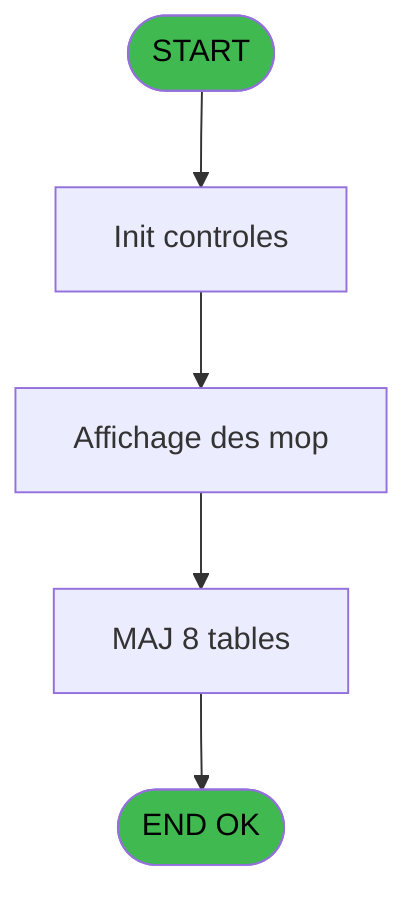
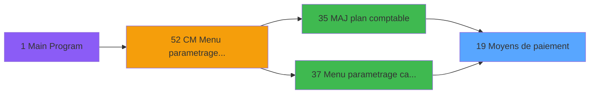
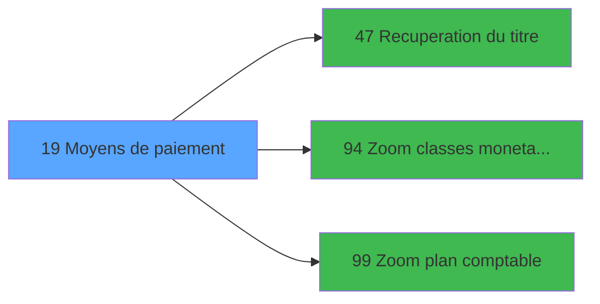

# MAI IDE 19 - Moyens de paiement

> **Analyse**: Phases 1-4 2026-02-03 14:48 -> 14:48 (10s) | Assemblage 14:48
> **Pipeline**: V7.2 Enrichi
> **Structure**: 4 onglets (Resume | Ecrans | Donnees | Connexions)

<!-- TAB:Resume -->

## 1. FICHE D'IDENTITE

| Attribut | Valeur |
|----------|--------|
| Projet | MAI |
| IDE Position | 19 |
| Nom Programme | Moyens de paiement |
| Fichier source | `Prg_19.xml` |
| Dossier IDE | Caisse |
| Taches | 34 (1 ecrans visibles) |
| Tables modifiees | 8 |
| Programmes appeles | 3 |

## 2. DESCRIPTION FONCTIONNELLE

**Moyens de paiement** assure la gestion complete de ce processus, accessible depuis [Menu parametrage caisse (IDE 37)](MAI-IDE-37.md), [MAJ plan comptable (IDE 35)](MAI-IDE-35.md).

Le flux de traitement s'organise en **6 blocs fonctionnels** :

- **Traitement** (25 taches) : traitements metier divers
- **Initialisation** (3 taches) : reinitialisation d'etats et de variables de travail
- **Saisie** (2 taches) : ecrans de saisie utilisateur (formulaires, champs, donnees)
- **Reglement** (2 taches) : gestion des moyens de paiement et reglements
- **Validation** (1 tache) : controles et verifications de coherence
- **Creation** (1 tache) : insertion d'enregistrements en base (mouvements, prestations)

**Donnees modifiees** : 8 tables en ecriture (moyens_reglement_mor, devises_caisse___ddk, moyen_paiement___mop, devises__________dev, moyens_reglement_mor, moyen_paiement___mop, devises__________dev, moyen_de_paiement_central).

Detail : phases du traitement

#### Phase 1 : Reglement (2 taches)

- **19** - Moyens de paiement **[[ECRAN]](#ecran-t1)**
- **19.1** - Affichage des mop **[[ECRAN]](#ecran-t2)**

#### Phase 2 : Traitement (25 taches)

- **19.1.1** - Quitter
- **19.1.3** - Action
- **19.3** - Supprime central
- **19.4** - Generation $CLAS pour societe
- **19.5** - Supprime local
- **19.5.1** - UNI
- **19.5.2** - BI
- **19.6** - Generation local
- **19.6.1** - Generation $CLAS pour societe
- **19.6.2** - Generation $CLAS pour societe
- **19.7** - Gener MOR
- **19.7.1.1** - UNI
- **19.7.1.2** - BI
- **19.7.2.1** - UNI
- **19.7.2.2** - BI
- **19.7.3.1** - UNI
- **19.7.3.2** - BI
- **19.7.3.3** - SUPP 35
- **19.7.4** - GENER SVW
- **19.7.4.1** - UNI
- **19.7.4.1.1** - versement
- **19.7.4.1.2** - solde
- **19.7.4.2** - BI
- **19.7.4.2.1** - versement
- **19.7.4.2.2** - solde

Delegue a : [Recuperation du titre (IDE 47)](MAI-IDE-47.md)

#### Phase 3 : Validation (1 tache)

- **19.1.2** - Validation

#### Phase 4 : Creation (1 tache)

- **19.2** - Abandon creation

#### Phase 5 : Initialisation (3 taches)

- **19.7.1** - RAZ MOR
- **19.7.2** - RAZ MOR MAJ
- **19.7.3** - RAZ DEVISES

#### Phase 6 : Saisie (2 taches)

- **19.7.4.1.3** - vente
- **19.7.4.2.3** - vente

#### Tables impactees

| Table | Operations | Role metier |
|-------|-----------|-------------|
| moyen_de_paiement_central | **W**/L (6 usages) |  |
| moyens_reglement_mor | **W** (5 usages) | Reglements / paiements |
| moyens_reglement_mor | **W** (5 usages) | Reglements / paiements |
| moyen_paiement___mop | R/**W** (3 usages) |  |
| moyen_paiement___mop | R/**W** (3 usages) |  |
| devises__________dev | **W** (1 usages) | Devises / taux de change |
| devises_caisse___ddk | **W** (1 usages) | Sessions de caisse |
| devises__________dev | **W** (1 usages) | Devises / taux de change |

## 3. BLOCS FONCTIONNELS

### 3.1 Reglement (2 taches)

Gestion des moyens de paiement : 2 taches de reglement.

---

#### 19 - Moyens de paiement [[ECRAN]](#ecran-t1)

**Role** : Gestion du reglement : Moyens de paiement.
**Ecran** : 439 x 256 DLU (MDI) | [Voir mockup](#ecran-t1)

---

#### 19.1 - Affichage des mop [[ECRAN]](#ecran-t2)

**Role** : Reinitialisation : Affichage des mop.
**Ecran** : 1200 x 271 DLU (MDI) | [Voir mockup](#ecran-t2)

### 3.2 Traitement (25 taches)

Traitements internes.

---

#### 19.1.1 - Quitter

**Role** : Traitement : Quitter.

---

#### 19.1.3 - Action

**Role** : Traitement : Action.
**Variables liees** : G (Action)

---

#### 19.3 - Supprime central

**Role** : Traitement : Supprime central.

---

#### 19.4 - Generation $CLAS pour societe

**Role** : Traitement : Generation $CLAS pour societe.
**Variables liees** : B (Param societe)

---

#### 19.5 - Supprime local

**Role** : Traitement : Supprime local.
**Variables liees** : C (Param devise locale)

---

#### 19.5.1 - UNI

**Role** : Traitement interne.

---

#### 19.5.2 - BI

**Role** : Traitement interne.

---

#### 19.6 - Generation local

**Role** : Traitement : Generation local.
**Variables liees** : C (Param devise locale)

---

#### 19.6.1 - Generation $CLAS pour societe

**Role** : Traitement : Generation $CLAS pour societe.
**Variables liees** : B (Param societe)

---

#### 19.6.2 - Generation $CLAS pour societe

**Role** : Traitement : Generation $CLAS pour societe.
**Variables liees** : B (Param societe)

---

#### 19.7 - Gener MOR

**Role** : Traitement : Gener MOR.

---

#### 19.7.1.1 - UNI

**Role** : Traitement interne.

---

#### 19.7.1.2 - BI

**Role** : Traitement interne.

---

#### 19.7.2.1 - UNI

**Role** : Traitement interne.

---

#### 19.7.2.2 - BI

**Role** : Traitement interne.

---

#### 19.7.3.1 - UNI

**Role** : Traitement interne.

---

#### 19.7.3.2 - BI

**Role** : Traitement interne.

---

#### 19.7.3.3 - SUPP 35

**Role** : Traitement : SUPP 35.

---

#### 19.7.4 - GENER SVW

**Role** : Traitement : GENER SVW.

---

#### 19.7.4.1 - UNI

**Role** : Traitement interne.

---

#### 19.7.4.1.1 - versement

**Role** : Traitement : versement.

---

#### 19.7.4.1.2 - solde

**Role** : Consultation/chargement : solde.

---

#### 19.7.4.2 - BI

**Role** : Traitement interne.

---

#### 19.7.4.2.1 - versement

**Role** : Traitement : versement.

---

#### 19.7.4.2.2 - solde

**Role** : Consultation/chargement : solde.

### 3.3 Validation (1 tache)

Controles de coherence : 1 tache verifie les donnees et conditions.

---

#### 19.1.2 - Validation

**Role** : Verification : Validation.

### 3.4 Creation (1 tache)

Insertion de nouveaux enregistrements en base.

---

#### 19.2 - Abandon creation

**Role** : Creation d'enregistrement : Abandon creation.
**Variables liees** : H (Abandon)

### 3.5 Initialisation (3 taches)

Reinitialisation d'etats et variables de travail.

---

#### 19.7.1 - RAZ MOR

**Role** : Reinitialisation : RAZ MOR.

---

#### 19.7.2 - RAZ MOR MAJ

**Role** : Reinitialisation : RAZ MOR MAJ.

---

#### 19.7.3 - RAZ DEVISES

**Role** : Reinitialisation : RAZ DEVISES.

### 3.6 Saisie (2 taches)

Ce bloc traite la saisie des donnees de la transaction.

---

#### 19.7.4.1.3 - vente

**Role** : Saisie des donnees : vente.

---

#### 19.7.4.2.3 - vente

**Role** : Saisie des donnees : vente.

## 5. REGLES METIER

*(Aucune regle metier identifiee)*

## 6. CONTEXTE

- **Appele par**: [Menu parametrage caisse (IDE 37)](MAI-IDE-37.md), [MAJ plan comptable (IDE 35)](MAI-IDE-35.md)
- **Appelle**: 3 programmes | **Tables**: 13 (W:8 R:3 L:5) | **Taches**: 34 | **Expressions**: 11

<!-- TAB:Ecrans -->

## 8. ECRANS

### 8.1 Forms visibles (1 / 34)

| # | Position | Tache | Nom | Type | Largeur | Hauteur | Bloc |
|---|----------|-------|-----|------|---------|---------|------|
| 1 | 19.1 | 19.1 | Affichage des mop | MDI | 1200 | 271 | Reglement |

### 8.2 Mockups Ecrans

---

#### 19.1 - Affichage des mop
**Tache** : [19.1](#t2) | **Type** : MDI | **Dimensions** : 1200 x 271 DLU
**Bloc** : Reglement | **Titre IDE** : Affichage des mop

<!-- FORM-DATA:
{
    "width":  1200,
    "vFactor":  8,
    "type":  "MDI",
    "hFactor":  8,
    "controls":  [
                     {
                         "x":  0,
                         "type":  "label",
                         "var":  "",
                         "y":  0,
                         "w":  1200,
                         "fmt":  "",
                         "name":  "",
                         "h":  19,
                         "color":  "",
                         "text":  "",
                         "parent":  null
                     },
                     {
                         "x":  159,
                         "type":  "table",
                         "var":  "",
                         "name":  "",
                         "titleH":  12,
                         "color":  "110",
                         "w":  717,
                         "y":  28,
                         "fmt":  "",
                         "parent":  null,
                         "text":  "",
                         "rowH":  15,
                         "h":  214,
                         "cols":  [
                                      {
                                          "title":  "Société",
                                          "layer":  1,
                                          "w":  68
                                      },
                                      {
                                          "title":  "Code",
                                          "layer":  2,
                                          "w":  86
                                      },
                                      {
                                          "title":  "Numéro",
                                          "layer":  3,
                                          "w":  95
                                      },
                                      {
                                          "title":  "Classe",
                                          "layer":  4,
                                          "w":  91
                                      },
                                      {
                                          "title":  "Libellé",
                                          "layer":  5,
                                          "w":  248
                                      },
                                      {
                                          "title":  "Compte",
                                          "layer":  6,
                                          "w":  91
                                      }
                                  ],
                         "rows":  6
                     },
                     {
                         "x":  895,
                         "type":  "label",
                         "var":  "",
                         "y":  147,
                         "w":  297,
                         "fmt":  "",
                         "name":  "",
                         "h":  97,
                         "color":  "",
                         "text":  "",
                         "parent":  null
                     },
                     {
                         "x":  900,
                         "type":  "label",
                         "var":  "",
                         "y":  150,
                         "w":  45,
                         "fmt":  "",
                         "name":  "",
                         "h":  78,
                         "color":  "",
                         "text":  "",
                         "parent":  null
                     },
                     {
                         "x":  959,
                         "type":  "label",
                         "var":  "",
                         "y":  156,
                         "w":  224,
                         "fmt":  "",
                         "name":  "",
                         "h":  9,
                         "color":  "7",
                         "text":  "Creation",
                         "parent":  null
                     },
                     {
                         "x":  959,
                         "type":  "label",
                         "var":  "",
                         "y":  171,
                         "w":  224,
                         "fmt":  "",
                         "name":  "",
                         "h":  8,
                         "color":  "7",
                         "text":  "Modification",
                         "parent":  null
                     },
                     {
                         "x":  959,
                         "type":  "label",
                         "var":  "",
                         "y":  185,
                         "w":  224,
                         "fmt":  "",
                         "name":  "",
                         "h":  8,
                         "color":  "7",
                         "text":  "Suppression",
                         "parent":  null
                     },
                     {
                         "x":  959,
                         "type":  "label",
                         "var":  "",
                         "y":  199,
                         "w":  224,
                         "fmt":  "",
                         "name":  "",
                         "h":  8,
                         "color":  "7",
                         "text":  "Annulation",
                         "parent":  null
                     },
                     {
                         "x":  959,
                         "type":  "label",
                         "var":  "",
                         "y":  213,
                         "w":  224,
                         "fmt":  "",
                         "name":  "",
                         "h":  8,
                         "color":  "7",
                         "text":  "Edition",
                         "parent":  null
                     },
                     {
                         "x":  958,
                         "type":  "label",
                         "var":  "",
                         "y":  233,
                         "w":  131,
                         "fmt":  "",
                         "name":  "",
                         "h":  10,
                         "color":  "",
                         "text":  "Votre choix",
                         "parent":  null
                     },
                     {
                         "x":  0,
                         "type":  "label",
                         "var":  "",
                         "y":  247,
                         "w":  1200,
                         "fmt":  "",
                         "name":  "",
                         "h":  24,
                         "color":  "",
                         "text":  "",
                         "parent":  null
                     },
                     {
                         "x":  173,
                         "type":  "label",
                         "var":  "",
                         "y":  257,
                         "w":  154,
                         "fmt":  "",
                         "name":  "",
                         "h":  8,
                         "color":  "144",
                         "text":  "vide",
                         "parent":  null
                     },
                     {
                         "x":  1111,
                         "type":  "edit",
                         "var":  "",
                         "y":  233,
                         "w":  26,
                         "fmt":  "",
                         "name":  "v choix",
                         "h":  10,
                         "color":  "6",
                         "text":  "",
                         "parent":  null
                     },
                     {
                         "x":  162,
                         "type":  "edit",
                         "var":  "",
                         "y":  44,
                         "w":  63,
                         "fmt":  "",
                         "name":  "Societe",
                         "h":  10,
                         "color":  "110",
                         "text":  "",
                         "parent":  4
                     },
                     {
                         "x":  234,
                         "type":  "edit",
                         "var":  "",
                         "y":  44,
                         "w":  77,
                         "fmt":  "",
                         "name":  "Code",
                         "h":  10,
                         "color":  "110",
                         "text":  "",
                         "parent":  4
                     },
                     {
                         "x":  322,
                         "type":  "edit",
                         "var":  "",
                         "y":  44,
                         "w":  80,
                         "fmt":  "",
                         "name":  "",
                         "h":  10,
                         "color":  "110",
                         "text":  "",
                         "parent":  4
                     },
                     {
                         "x":  418,
                         "type":  "edit",
                         "var":  "",
                         "y":  44,
                         "w":  80,
                         "fmt":  "",
                         "name":  "Classe",
                         "h":  10,
                         "color":  "110",
                         "text":  "",
                         "parent":  4
                     },
                     {
                         "x":  507,
                         "type":  "edit",
                         "var":  "",
                         "y":  44,
                         "w":  238,
                         "fmt":  "",
                         "name":  "Libelle",
                         "h":  10,
                         "color":  "110",
                         "text":  "",
                         "parent":  4
                     },
                     {
                         "x":  754,
                         "type":  "edit",
                         "var":  "",
                         "y":  44,
                         "w":  82,
                         "fmt":  "",
                         "name":  "Compte",
                         "h":  10,
                         "color":  "110",
                         "text":  "",
                         "parent":  4
                     },
                     {
                         "x":  6,
                         "type":  "edit",
                         "var":  "",
                         "y":  5,
                         "w":  323,
                         "fmt":  "20",
                         "name":  "",
                         "h":  8,
                         "color":  "",
                         "text":  "",
                         "parent":  null
                     },
                     {
                         "x":  848,
                         "type":  "edit",
                         "var":  "",
                         "y":  5,
                         "w":  342,
                         "fmt":  "WWW DD MMM YYYYT",
                         "name":  "",
                         "h":  8,
                         "color":  "",
                         "text":  "",
                         "parent":  null
                     },
                     {
                         "x":  1051,
                         "type":  "image",
                         "var":  "",
                         "y":  24,
                         "w":  141,
                         "fmt":  "",
                         "name":  "",
                         "h":  59,
                         "color":  "",
                         "text":  "",
                         "parent":  null
                     },
                     {
                         "x":  909,
                         "type":  "button",
                         "var":  "",
                         "y":  156,
                         "w":  26,
                         "fmt":  "1",
                         "name":  "1",
                         "h":  9,
                         "color":  "",
                         "text":  "",
                         "parent":  null
                     },
                     {
                         "x":  909,
                         "type":  "button",
                         "var":  "",
                         "y":  170,
                         "w":  26,
                         "fmt":  "2",
                         "name":  "2",
                         "h":  9,
                         "color":  "",
                         "text":  "",
                         "parent":  null
                     },
                     {
                         "x":  909,
                         "type":  "button",
                         "var":  "",
                         "y":  184,
                         "w":  26,
                         "fmt":  "3",
                         "name":  "3",
                         "h":  9,
                         "color":  "",
                         "text":  "",
                         "parent":  null
                     },
                     {
                         "x":  909,
                         "type":  "button",
                         "var":  "",
                         "y":  198,
                         "w":  26,
                         "fmt":  "4",
                         "name":  "4",
                         "h":  9,
                         "color":  "",
                         "text":  "",
                         "parent":  null
                     },
                     {
                         "x":  909,
                         "type":  "button",
                         "var":  "",
                         "y":  212,
                         "w":  26,
                         "fmt":  "5",
                         "name":  "5",
                         "h":  9,
                         "color":  "",
                         "text":  "",
                         "parent":  null
                     },
                     {
                         "x":  7,
                         "type":  "button",
                         "var":  "",
                         "y":  251,
                         "w":  154,
                         "fmt":  "\u0026Abandon",
                         "name":  "",
                         "h":  18,
                         "color":  "",
                         "text":  "",
                         "parent":  null
                     },
                     {
                         "x":  1036,
                         "type":  "button",
                         "var":  "",
                         "y":  251,
                         "w":  154,
                         "fmt":  "\u0026Validation",
                         "name":  "",
                         "h":  18,
                         "color":  "",
                         "text":  "",
                         "parent":  null
                     }
                 ],
    "taskId":  "19.1",
    "height":  271
}
-->

<strong>Champs : 9 champs</strong>

| Pos (x,y) | Nom | Variable | Type |
|-----------|-----|----------|------|
| 1111,233 | v choix | - | edit |
| 162,44 | Societe | - | edit |
| 234,44 | Code | - | edit |
| 322,44 | (sans nom) | - | edit |
| 418,44 | Classe | - | edit |
| 507,44 | Libelle | - | edit |
| 754,44 | Compte | - | edit |
| 6,5 | 20 | - | edit |
| 848,5 | WWW DD MMM YYYYT | - | edit |

<strong>Boutons : 7 boutons</strong>

| Bouton | Pos (x,y) | Action |
|--------|-----------|--------|
| 1 | 909,156 | Bouton fonctionnel |
| 2 | 909,170 | Bouton fonctionnel |
| 3 | 909,184 | Bouton fonctionnel |
| 4 | 909,198 | Bouton fonctionnel |
| 5 | 909,212 | Bouton fonctionnel |
| Abandon | 7,251 | Annule et retour au menu |
| Validation | 1036,251 | Valide la saisie et enregistre |

## 9. NAVIGATION

Ecran unique: **Affichage des mop**

### 9.3 Structure hierarchique (34 taches)

| Position | Tache | Type | Dimensions | Bloc |
|----------|-------|------|------------|------|
| **19.1** | [**Moyens de paiement** (19)](#t1) [mockup](#ecran-t1) | MDI | 439x256 | Reglement |
| 19.1.1 | [Affichage des mop (19.1)](#t2) [mockup](#ecran-t2) | MDI | 1200x271 | |
| **19.2** | [**Quitter** (19.1.1)](#t3) | MDI | - | Traitement |
| 19.2.1 | [Action (19.1.3)](#t5) | MDI | - | |
| 19.2.2 | [Supprime central (19.3)](#t8) | MDI | - | |
| 19.2.3 | [Generation $CLAS pour societe (19.4)](#t9) | MDI | - | |
| 19.2.4 | [Supprime local (19.5)](#t10) | MDI | - | |
| 19.2.5 | [UNI (19.5.1)](#t11) | MDI | - | |
| 19.2.6 | [BI (19.5.2)](#t12) | MDI | - | |
| 19.2.7 | [Generation local (19.6)](#t13) | MDI | - | |
| 19.2.8 | [Generation $CLAS pour societe (19.6.1)](#t14) | MDI | - | |
| 19.2.9 | [Generation $CLAS pour societe (19.6.2)](#t15) | MDI | - | |
| 19.2.10 | [Gener MOR (19.7)](#t16) | MDI | - | |
| 19.2.11 | [UNI (19.7.1.1)](#t18) | MDI | - | |
| 19.2.12 | [BI (19.7.1.2)](#t19) | MDI | - | |
| 19.2.13 | [UNI (19.7.2.1)](#t21) | MDI | - | |
| 19.2.14 | [BI (19.7.2.2)](#t22) | MDI | - | |
| 19.2.15 | [UNI (19.7.3.1)](#t24) | MDI | - | |
| 19.2.16 | [BI (19.7.3.2)](#t25) | MDI | - | |
| 19.2.17 | [SUPP 35 (19.7.3.3)](#t26) | MDI | - | |
| 19.2.18 | [GENER SVW (19.7.4)](#t27) | MDI | - | |
| 19.2.19 | [UNI (19.7.4.1)](#t28) | MDI | - | |
| 19.2.20 | [versement (19.7.4.1.1)](#t29) | MDI | - | |
| 19.2.21 | [solde (19.7.4.1.2)](#t30) | MDI | - | |
| 19.2.22 | [BI (19.7.4.2)](#t32) | MDI | - | |
| 19.2.23 | [versement (19.7.4.2.1)](#t33) | MDI | - | |
| 19.2.24 | [solde (19.7.4.2.2)](#t34) | MDI | - | |
| **19.3** | [**Validation** (19.1.2)](#t4) | MDI | - | Validation |
| **19.4** | [**Abandon creation** (19.2)](#t7) | MDI | - | Creation |
| **19.5** | [**RAZ MOR** (19.7.1)](#t17) | MDI | - | Initialisation |
| 19.5.1 | [RAZ MOR MAJ (19.7.2)](#t20) | MDI | - | |
| 19.5.2 | [RAZ DEVISES (19.7.3)](#t23) | MDI | - | |
| **19.6** | [**vente** (19.7.4.1.3)](#t31) | MDI | - | Saisie |
| 19.6.1 | [vente (19.7.4.2.3)](#t35) | MDI | - | |

### 9.4 Algorigramme

> **Legende**: Vert = START/END OK | Rouge = END KO | Bleu = Decisions
> *Algorigramme auto-genere. Utiliser `/algorigramme` pour une synthese metier detaillee.*

<!-- TAB:Donnees -->

## 10. TABLES

### Tables utilisees (13)

| ID | Nom | Description | Type | R | W | L | Usages |
|----|-----|-------------|------|---|---|---|--------|
| 50 | moyens_reglement_mor | Reglements / paiements | DB |   | **W** |   | 5 |
| 57 | devises_caisse___ddk | Sessions de caisse | DB |   | **W** |   | 1 |
| 89 | moyen_paiement___mop |  | DB | R | **W** |   | 3 |
| 90 | devises__________dev | Devises / taux de change | DB |   | **W** |   | 1 |
| 139 | moyens_reglement_mor | Reglements / paiements | DB |   | **W** |   | 5 |
| 140 | moyen_paiement___mop |  | DB | R | **W** |   | 3 |
| 141 | devises__________dev | Devises / taux de change | DB |   | **W** |   | 1 |
| 203 | classe_monetaire_central |  | DB |   |   | L | 1 |
| 206 | compte_financier_central | Comptes GM (generaux) | DB |   |   | L | 1 |
| 208 | moyen_de_paiement_central |  | DB |   | **W** | L | 6 |
| 209 | plan_comptable_central |  | DB | R |   |   | 1 |
| 700 | email_parametres |  | DB |   |   | L | 8 |
| 707 | parametre_generaux |  | DB |   |   | L | 1 |

### Colonnes par table (3 / 9 tables avec colonnes identifiees)

Table 50 - moyens_reglement_mor (**W**) - 5 usages

*Table utilisee uniquement en Link ou aucune colonne Real identifiee dans le DataView.*

Table 57 - devises_caisse___ddk (**W**) - 1 usages

*Table utilisee uniquement en Link ou aucune colonne Real identifiee dans le DataView.*

Table 89 - moyen_paiement___mop (R/**W**) - 3 usages

*Table utilisee uniquement en Link ou aucune colonne Real identifiee dans le DataView.*

Table 90 - devises__________dev (**W**) - 1 usages

*Table utilisee uniquement en Link ou aucune colonne Real identifiee dans le DataView.*

Table 139 - moyens_reglement_mor (**W**) - 5 usages

*Table utilisee uniquement en Link ou aucune colonne Real identifiee dans le DataView.*

Table 140 - moyen_paiement___mop (R/**W**) - 3 usages

*Table utilisee uniquement en Link ou aucune colonne Real identifiee dans le DataView.*

Table 141 - devises__________dev (**W**) - 1 usages

*Table utilisee uniquement en Link ou aucune colonne Real identifiee dans le DataView.*

Table 208 - moyen_de_paiement_central (**W**/L) - 6 usages

*Table utilisee uniquement en Link ou aucune colonne Real identifiee dans le DataView.*

Table 209 - plan_comptable_central (R) - 1 usages

| Lettre | Variable | Acces | Type |
|--------|----------|-------|------|
| A | CURSEUR | R | Logical |
| B | v choix | R | Alpha |
| C | CLASSE EXISTE | R | Logical |
| D | COMPTE EXISTE | R | Logical |
| E | V Titre | R | Alpha |

## 11. VARIABLES

### 11.1 Autres (8)

Variables diverses.

| Lettre | Nom | Type | Usage dans |
|--------|-----|------|-----------|
| A | Param Automatique | Logical | 2x refs |
| B | Param societe | Alpha | [19.4](#t9), [19.6.1](#t14), [19.6.2](#t15) |
| C | Param devise locale | Alpha | [19.7.3](#t23) |
| D | Param MAJ PLAN | Logical | - |
| E | Param uniBi | Alpha | - |
| F | Fin | Logical | 1x refs |
| G | Action | Numeric | [19.1.3](#t5) |
| H | Abandon | Logical | - |

## 12. EXPRESSIONS

**11 / 11 expressions decodees (100%)**

### 12.1 Repartition par type

| Type | Expressions | Regles |
|------|-------------|--------|
| CONDITION | 5 | 0 |
| CONSTANTE | 2 | 0 |
| OTHER | 2 | 0 |
| NEGATION | 1 | 0 |
| CAST_LOGIQUE | 1 | 0 |

### 12.2 Expressions cles par type

#### CONDITION (5 expressions)

| Type | IDE | Expression | Regle |
|------|-----|------------|-------|
| CONDITION | 9 | `Action [G]<>5` | - |
| CONDITION | 10 | `Action [G]=5` | - |
| CONDITION | 6 | `Param devise locale [C]=''` | - |
| CONDITION | 8 | `CallProg('{324,-1}'PROG,DbName('{208,2}'DSOURCE))=0` | - |
| CONDITION | 5 | `Param societe [B]=''` | - |

#### CONSTANTE (2 expressions)

| Type | IDE | Expression | Regle |
|------|-----|------------|-------|
| CONSTANTE | 4 | `'EUR'` | - |
| CONSTANTE | 3 | `'C'` | - |

#### OTHER (2 expressions)

| Type | IDE | Expression | Regle |
|------|-----|------------|-------|
| OTHER | 7 | `Fin [F]` | - |
| OTHER | 1 | `Param Automatique [A]` | - |

#### NEGATION (1 expressions)

| Type | IDE | Expression | Regle |
|------|-----|------------|-------|
| NEGATION | 2 | `NOT (Param Automatique [A])` | - |

#### CAST_LOGIQUE (1 expressions)

| Type | IDE | Expression | Regle |
|------|-----|------------|-------|
| CAST_LOGIQUE | 11 | `'TRUE'LOG` | - |

<!-- TAB:Connexions -->

## 13. GRAPHE D'APPELS

### 13.1 Chaine depuis Main (Callers)

Main -> ... -> [Menu parametrage caisse (IDE 37)](MAI-IDE-37.md) -> **Moyens de paiement (IDE 19)**

Main -> ... -> [MAJ plan comptable (IDE 35)](MAI-IDE-35.md) -> **Moyens de paiement (IDE 19)**

### 13.2 Callers

| IDE | Nom Programme | Nb Appels |
|-----|---------------|-----------|
| [37](MAI-IDE-37.md) | Menu parametrage caisse | 2 |
| [35](MAI-IDE-35.md) | MAJ plan comptable | 1 |

### 13.3 Callees (programmes appeles)

### 13.4 Detail Callees avec contexte

| IDE | Nom Programme | Appels | Contexte |
|-----|---------------|--------|----------|
| [47](MAI-IDE-47.md) | Recuperation du titre | 1 | Recuperation donnees |
| [94](MAI-IDE-94.md) | Zoom classes monetaires | 1 | Selection/consultation |
| [99](MAI-IDE-99.md) | Zoom plan comptable | 1 | Selection/consultation |

## 14. RECOMMANDATIONS MIGRATION

### 14.1 Profil du programme

| Metrique | Valeur | Impact migration |
|----------|--------|-----------------|
| Lignes de logique | 378 | Taille moyenne |
| Expressions | 11 | Peu de logique |
| Tables WRITE | 8 | Fort impact donnees |
| Sous-programmes | 3 | Peu de dependances |
| Ecrans visibles | 1 | Ecran unique ou traitement batch |
| Code desactive | 0% (0 / 378) | Code sain |
| Regles metier | 0 | Pas de regle identifiee |

### 14.2 Plan de migration par bloc

#### Reglement (2 taches: 2 ecrans, 0 traitement)

- **Strategie** : Service `IReglementService` avec pattern Strategy par mode de paiement.
- Integration TPE si applicable

#### Traitement (25 taches: 0 ecran, 25 traitements)

- **Strategie** : 25 service(s) backend injectable(s) (Domain Services).
- 3 sous-programme(s) a migrer ou a reutiliser depuis les services existants.
- Decomposer les taches en services unitaires testables.

#### Validation (1 tache: 0 ecran, 1 traitement)

- **Strategie** : FluentValidation avec validators specifiques.
- Chaque tache de validation -> un validator injectable

#### Creation (1 tache: 0 ecran, 1 traitement)

- **Strategie** : Repository pattern avec Entity Framework Core.
- Insertion via `IRepository<T>.CreateAsync()`

#### Initialisation (3 taches: 0 ecran, 3 traitements)

- **Strategie** : Constructeur/methode `InitAsync()` dans l'orchestrateur.

#### Saisie (2 taches: 0 ecran, 2 traitements)

- **Strategie** : Formulaire React/Blazor avec validation Zod/FluentValidation.
- Validation temps reel cote client + serveur

### 14.3 Dependances critiques

| Dependance | Type | Appels | Impact |
|------------|------|--------|--------|
| moyens_reglement_mor | Table WRITE (Database) | 5x | Schema + repository |
| devises_caisse___ddk | Table WRITE (Database) | 1x | Schema + repository |
| moyen_paiement___mop | Table WRITE (Database) | 2x | Schema + repository |
| devises__________dev | Table WRITE (Database) | 1x | Schema + repository |
| moyens_reglement_mor | Table WRITE (Database) | 5x | Schema + repository |
| moyen_paiement___mop | Table WRITE (Database) | 2x | Schema + repository |
| devises__________dev | Table WRITE (Database) | 1x | Schema + repository |
| moyen_de_paiement_central | Table WRITE (Database) | 3x | Schema + repository |
| [Zoom plan comptable (IDE 99)](MAI-IDE-99.md) | Sous-programme | 1x | Normale - Selection/consultation |
| [Zoom classes monetaires (IDE 94)](MAI-IDE-94.md) | Sous-programme | 1x | Normale - Selection/consultation |
| [Recuperation du titre (IDE 47)](MAI-IDE-47.md) | Sous-programme | 1x | Normale - Recuperation donnees |

---
*Spec DETAILED generee par Pipeline V7.2 - 2026-02-03 14:48*
