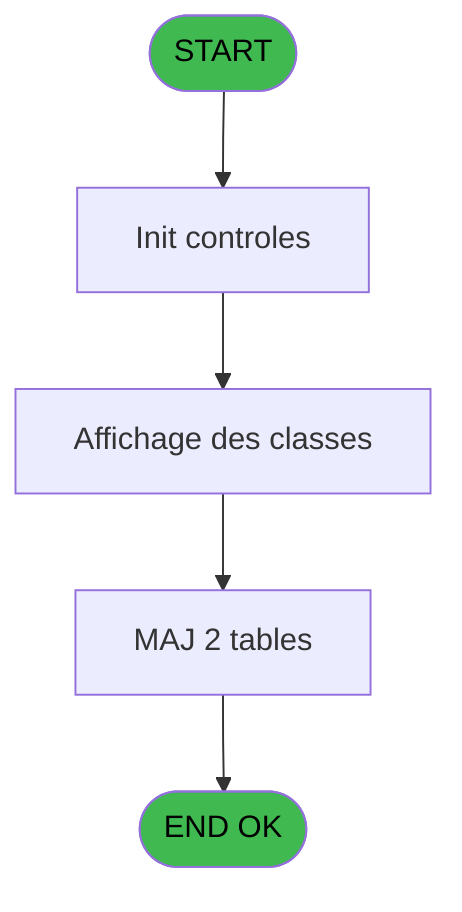
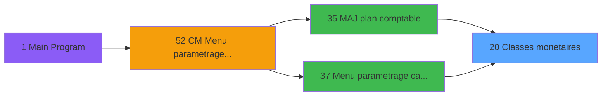
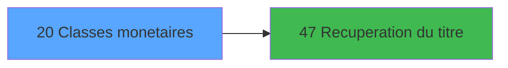

# MAI IDE 20 - Classes monetaires

> **Analyse**: Phases 1-4 2026-02-03 14:48 -> 14:48 (10s) | Assemblage 14:48
> **Pipeline**: V7.2 Enrichi
> **Structure**: 4 onglets (Resume | Ecrans | Donnees | Connexions)

<!-- TAB:Resume -->

## 1. FICHE D'IDENTITE

| Attribut | Valeur |
|----------|--------|
| Projet | MAI |
| IDE Position | 20 |
| Nom Programme | Classes monetaires |
| Fichier source | `Prg_20.xml` |
| Dossier IDE | Caisse |
| Taches | 10 (1 ecrans visibles) |
| Tables modifiees | 2 |
| Programmes appeles | 1 |

## 2. DESCRIPTION FONCTIONNELLE

**Classes monetaires** assure la gestion complete de ce processus, accessible depuis [Menu parametrage caisse (IDE 37)](MAI-IDE-37.md), [MAJ plan comptable (IDE 35)](MAI-IDE-35.md).

Le flux de traitement s'organise en **4 blocs fonctionnels** :

- **Traitement** (7 taches) : traitements metier divers
- **Creation** (1 tache) : insertion d'enregistrements en base (mouvements, prestations)
- **Validation** (1 tache) : controles et verifications de coherence
- **Consultation** (1 tache) : ecrans de recherche, selection et consultation

**Donnees modifiees** : 2 tables en ecriture (classe_monetaire_cla, classe_monetaire_central).

Detail : phases du traitement

#### Phase 1 : Traitement (7 taches)

- **20** - Classes monetaires **[[ECRAN]](#ecran-t1)**
- **20.1.1** - Abandon
- **20.1.3** - Action
- **20.3** - Supprime central
- **20.4** - Generation $CLAS pour societe
- **20.5** - Supprime local
- **20.6** - Generation $CLAS pour societe

Delegue a : [Recuperation du titre (IDE 47)](MAI-IDE-47.md)

#### Phase 2 : Consultation (1 tache)

- **20.1** - Affichage des classes **[[ECRAN]](#ecran-t2)**

Delegue a : [Recuperation du titre (IDE 47)](MAI-IDE-47.md)

#### Phase 3 : Validation (1 tache)

- **20.1.2** - Validation

#### Phase 4 : Creation (1 tache)

- **20.2** - Abandon creation

#### Tables impactees

| Table | Operations | Role metier |
|-------|-----------|-------------|
| classe_monetaire_central | **W**/L (5 usages) |  |
| classe_monetaire_cla | **W** (2 usages) |  |

## 3. BLOCS FONCTIONNELS

### 3.1 Traitement (7 taches)

Traitements internes.

---

#### 20 - Classes monetaires [[ECRAN]](#ecran-t1)

**Role** : Tache d'orchestration : point d'entree du programme (7 sous-taches). Coordonne l'enchainement des traitements.
**Ecran** : 439 x 256 DLU (MDI) | [Voir mockup](#ecran-t1)

6 sous-taches directes

| Tache | Nom | Bloc |
|-------|-----|------|
| [20.1.1](#t3) | Abandon | Traitement |
| [20.1.3](#t5) | Action | Traitement |
| [20.3](#t8) | Supprime central | Traitement |
| [20.4](#t9) | Generation $CLAS pour societe | Traitement |
| [20.5](#t10) | Supprime local | Traitement |
| [20.6](#t11) | Generation $CLAS pour societe | Traitement |

**Delegue a** : [Recuperation du titre (IDE 47)](MAI-IDE-47.md)

---

#### 20.1.1 - Abandon

**Role** : Traitement : Abandon.
**Variables liees** : E (Abandon)
**Delegue a** : [Recuperation du titre (IDE 47)](MAI-IDE-47.md)

---

#### 20.1.3 - Action

**Role** : Traitement : Action.
**Variables liees** : D (Action)
**Delegue a** : [Recuperation du titre (IDE 47)](MAI-IDE-47.md)

---

#### 20.3 - Supprime central

**Role** : Traitement : Supprime central.
**Delegue a** : [Recuperation du titre (IDE 47)](MAI-IDE-47.md)

---

#### 20.4 - Generation $CLAS pour societe

**Role** : Traitement : Generation $CLAS pour societe.
**Variables liees** : B (Param societe)
**Delegue a** : [Recuperation du titre (IDE 47)](MAI-IDE-47.md)

---

#### 20.5 - Supprime local

**Role** : Traitement : Supprime local.
**Delegue a** : [Recuperation du titre (IDE 47)](MAI-IDE-47.md)

---

#### 20.6 - Generation $CLAS pour societe

**Role** : Traitement : Generation $CLAS pour societe.
**Variables liees** : B (Param societe)
**Delegue a** : [Recuperation du titre (IDE 47)](MAI-IDE-47.md)

### 3.2 Consultation (1 tache)

Ecrans de recherche et consultation.

---

#### 20.1 - Affichage des classes [[ECRAN]](#ecran-t2)

**Role** : Reinitialisation : Affichage des classes.
**Ecran** : 1040 x 271 DLU (MDI) | [Voir mockup](#ecran-t2)

### 3.3 Validation (1 tache)

Controles de coherence : 1 tache verifie les donnees et conditions.

---

#### 20.1.2 - Validation

**Role** : Verification : Validation.

### 3.4 Creation (1 tache)

Insertion de nouveaux enregistrements en base.

---

#### 20.2 - Abandon creation

**Role** : Creation d'enregistrement : Abandon creation.
**Variables liees** : E (Abandon)

## 5. REGLES METIER

*(Aucune regle metier identifiee)*

## 6. CONTEXTE

- **Appele par**: [Menu parametrage caisse (IDE 37)](MAI-IDE-37.md), [MAJ plan comptable (IDE 35)](MAI-IDE-35.md)
- **Appelle**: 1 programmes | **Tables**: 3 (W:2 R:0 L:2) | **Taches**: 10 | **Expressions**: 10

<!-- TAB:Ecrans -->

## 8. ECRANS

### 8.1 Forms visibles (1 / 10)

| # | Position | Tache | Nom | Type | Largeur | Hauteur | Bloc |
|---|----------|-------|-----|------|---------|---------|------|
| 1 | 20.1 | 20.1 | Affichage des classes | MDI | 1040 | 271 | Consultation |

### 8.2 Mockups Ecrans

---

#### 20.1 - Affichage des classes
**Tache** : [20.1](#t2) | **Type** : MDI | **Dimensions** : 1040 x 271 DLU
**Bloc** : Consultation | **Titre IDE** : Affichage des classes

<!-- FORM-DATA:
{
    "width":  1040,
    "vFactor":  8,
    "type":  "MDI",
    "hFactor":  8,
    "controls":  [
                     {
                         "x":  0,
                         "type":  "label",
                         "var":  "",
                         "y":  0,
                         "w":  1040,
                         "fmt":  "",
                         "name":  "",
                         "h":  19,
                         "color":  "",
                         "text":  "",
                         "parent":  null
                     },
                     {
                         "x":  167,
                         "type":  "table",
                         "var":  "",
                         "name":  "",
                         "titleH":  12,
                         "color":  "110",
                         "w":  534,
                         "y":  24,
                         "fmt":  "",
                         "parent":  null,
                         "text":  "",
                         "rowH":  15,
                         "h":  219,
                         "cols":  [
                                      {
                                          "title":  "Société",
                                          "layer":  1,
                                          "w":  71
                                      },
                                      {
                                          "title":  "Numéro",
                                          "layer":  2,
                                          "w":  91
                                      },
                                      {
                                          "title":  "Classe",
                                          "layer":  3,
                                          "w":  90
                                      },
                                      {
                                          "title":  "Libellé",
                                          "layer":  4,
                                          "w":  248
                                      }
                                  ],
                         "rows":  4
                     },
                     {
                         "x":  735,
                         "type":  "label",
                         "var":  "",
                         "y":  147,
                         "w":  297,
                         "fmt":  "",
                         "name":  "",
                         "h":  97,
                         "color":  "",
                         "text":  "",
                         "parent":  null
                     },
                     {
                         "x":  740,
                         "type":  "label",
                         "var":  "",
                         "y":  150,
                         "w":  45,
                         "fmt":  "",
                         "name":  "",
                         "h":  78,
                         "color":  "",
                         "text":  "",
                         "parent":  null
                     },
                     {
                         "x":  799,
                         "type":  "label",
                         "var":  "",
                         "y":  156,
                         "w":  224,
                         "fmt":  "",
                         "name":  "",
                         "h":  9,
                         "color":  "7",
                         "text":  "Creation",
                         "parent":  null
                     },
                     {
                         "x":  799,
                         "type":  "label",
                         "var":  "",
                         "y":  171,
                         "w":  224,
                         "fmt":  "",
                         "name":  "",
                         "h":  8,
                         "color":  "7",
                         "text":  "Modification",
                         "parent":  null
                     },
                     {
                         "x":  799,
                         "type":  "label",
                         "var":  "",
                         "y":  185,
                         "w":  224,
                         "fmt":  "",
                         "name":  "",
                         "h":  8,
                         "color":  "7",
                         "text":  "Suppression",
                         "parent":  null
                     },
                     {
                         "x":  799,
                         "type":  "label",
                         "var":  "",
                         "y":  199,
                         "w":  224,
                         "fmt":  "",
                         "name":  "",
                         "h":  8,
                         "color":  "7",
                         "text":  "Annulation",
                         "parent":  null
                     },
                     {
                         "x":  799,
                         "type":  "label",
                         "var":  "",
                         "y":  213,
                         "w":  224,
                         "fmt":  "",
                         "name":  "",
                         "h":  8,
                         "color":  "7",
                         "text":  "Edition",
                         "parent":  null
                     },
                     {
                         "x":  798,
                         "type":  "label",
                         "var":  "",
                         "y":  233,
                         "w":  131,
                         "fmt":  "",
                         "name":  "",
                         "h":  10,
                         "color":  "",
                         "text":  "Votre choix",
                         "parent":  null
                     },
                     {
                         "x":  0,
                         "type":  "label",
                         "var":  "",
                         "y":  247,
                         "w":  1037,
                         "fmt":  "",
                         "name":  "",
                         "h":  24,
                         "color":  "",
                         "text":  "",
                         "parent":  null
                     },
                     {
                         "x":  173,
                         "type":  "label",
                         "var":  "",
                         "y":  257,
                         "w":  154,
                         "fmt":  "",
                         "name":  "",
                         "h":  8,
                         "color":  "144",
                         "text":  "vide",
                         "parent":  null
                     },
                     {
                         "x":  951,
                         "type":  "edit",
                         "var":  "",
                         "y":  233,
                         "w":  26,
                         "fmt":  "",
                         "name":  "v choix",
                         "h":  10,
                         "color":  "6",
                         "text":  "",
                         "parent":  null
                     },
                     {
                         "x":  173,
                         "type":  "edit",
                         "var":  "",
                         "y":  39,
                         "w":  63,
                         "fmt":  "",
                         "name":  "Societe",
                         "h":  10,
                         "color":  "110",
                         "text":  "",
                         "parent":  4
                     },
                     {
                         "x":  245,
                         "type":  "edit",
                         "var":  "",
                         "y":  39,
                         "w":  82,
                         "fmt":  "",
                         "name":  "Numero",
                         "h":  10,
                         "color":  "110",
                         "text":  "",
                         "parent":  4
                     },
                     {
                         "x":  334,
                         "type":  "edit",
                         "var":  "",
                         "y":  39,
                         "w":  82,
                         "fmt":  "",
                         "name":  "Classe",
                         "h":  10,
                         "color":  "110",
                         "text":  "",
                         "parent":  4
                     },
                     {
                         "x":  426,
                         "type":  "edit",
                         "var":  "",
                         "y":  39,
                         "w":  238,
                         "fmt":  "",
                         "name":  "Libelle",
                         "h":  10,
                         "color":  "110",
                         "text":  "",
                         "parent":  4
                     },
                     {
                         "x":  6,
                         "type":  "edit",
                         "var":  "",
                         "y":  5,
                         "w":  323,
                         "fmt":  "20",
                         "name":  "",
                         "h":  8,
                         "color":  "",
                         "text":  "",
                         "parent":  null
                     },
                     {
                         "x":  689,
                         "type":  "edit",
                         "var":  "",
                         "y":  5,
                         "w":  342,
                         "fmt":  "WWW DD MMM YYYYT",
                         "name":  "",
                         "h":  8,
                         "color":  "",
                         "text":  "",
                         "parent":  null
                     },
                     {
                         "x":  891,
                         "type":  "image",
                         "var":  "",
                         "y":  24,
                         "w":  141,
                         "fmt":  "",
                         "name":  "",
                         "h":  59,
                         "color":  "",
                         "text":  "",
                         "parent":  null
                     },
                     {
                         "x":  749,
                         "type":  "button",
                         "var":  "",
                         "y":  156,
                         "w":  26,
                         "fmt":  "1",
                         "name":  "1",
                         "h":  9,
                         "color":  "",
                         "text":  "",
                         "parent":  null
                     },
                     {
                         "x":  749,
                         "type":  "button",
                         "var":  "",
                         "y":  170,
                         "w":  26,
                         "fmt":  "2",
                         "name":  "2",
                         "h":  9,
                         "color":  "",
                         "text":  "",
                         "parent":  null
                     },
                     {
                         "x":  749,
                         "type":  "button",
                         "var":  "",
                         "y":  184,
                         "w":  26,
                         "fmt":  "3",
                         "name":  "3",
                         "h":  9,
                         "color":  "",
                         "text":  "",
                         "parent":  null
                     },
                     {
                         "x":  749,
                         "type":  "button",
                         "var":  "",
                         "y":  198,
                         "w":  26,
                         "fmt":  "4",
                         "name":  "4",
                         "h":  9,
                         "color":  "",
                         "text":  "",
                         "parent":  null
                     },
                     {
                         "x":  749,
                         "type":  "button",
                         "var":  "",
                         "y":  212,
                         "w":  26,
                         "fmt":  "5",
                         "name":  "5",
                         "h":  9,
                         "color":  "",
                         "text":  "",
                         "parent":  null
                     },
                     {
                         "x":  7,
                         "type":  "button",
                         "var":  "",
                         "y":  251,
                         "w":  154,
                         "fmt":  "\u0026Abandon",
                         "name":  "",
                         "h":  18,
                         "color":  "",
                         "text":  "",
                         "parent":  null
                     },
                     {
                         "x":  877,
                         "type":  "button",
                         "var":  "",
                         "y":  251,
                         "w":  154,
                         "fmt":  "\u0026Validation",
                         "name":  "",
                         "h":  18,
                         "color":  "",
                         "text":  "",
                         "parent":  null
                     }
                 ],
    "taskId":  "20.1",
    "height":  271
}
-->

<strong>Champs : 7 champs</strong>

| Pos (x,y) | Nom | Variable | Type |
|-----------|-----|----------|------|
| 951,233 | v choix | - | edit |
| 173,39 | Societe | - | edit |
| 245,39 | Numero | - | edit |
| 334,39 | Classe | - | edit |
| 426,39 | Libelle | - | edit |
| 6,5 | 20 | - | edit |
| 689,5 | WWW DD MMM YYYYT | - | edit |

<strong>Boutons : 7 boutons</strong>

| Bouton | Pos (x,y) | Action |
|--------|-----------|--------|
| 1 | 749,156 | Bouton fonctionnel |
| 2 | 749,170 | Bouton fonctionnel |
| 3 | 749,184 | Bouton fonctionnel |
| 4 | 749,198 | Bouton fonctionnel |
| 5 | 749,212 | Bouton fonctionnel |
| Abandon | 7,251 | Annule et retour au menu |
| Validation | 877,251 | Valide la saisie et enregistre |

## 9. NAVIGATION

Ecran unique: **Affichage des classes**

### 9.3 Structure hierarchique (10 taches)

| Position | Tache | Type | Dimensions | Bloc |
|----------|-------|------|------------|------|
| **20.1** | [**Classes monetaires** (20)](#t1) [mockup](#ecran-t1) | MDI | 439x256 | Traitement |
| 20.1.1 | [Abandon (20.1.1)](#t3) | MDI | - | |
| 20.1.2 | [Action (20.1.3)](#t5) | MDI | - | |
| 20.1.3 | [Supprime central (20.3)](#t8) | MDI | - | |
| 20.1.4 | [Generation $CLAS pour societe (20.4)](#t9) | MDI | - | |
| 20.1.5 | [Supprime local (20.5)](#t10) | MDI | - | |
| 20.1.6 | [Generation $CLAS pour societe (20.6)](#t11) | MDI | - | |
| **20.2** | [**Affichage des classes** (20.1)](#t2) [mockup](#ecran-t2) | MDI | 1040x271 | Consultation |
| **20.3** | [**Validation** (20.1.2)](#t4) | MDI | - | Validation |
| **20.4** | [**Abandon creation** (20.2)](#t7) | MDI | - | Creation |

### 9.4 Algorigramme

> **Legende**: Vert = START/END OK | Rouge = END KO | Bleu = Decisions
> *Algorigramme auto-genere. Utiliser `/algorigramme` pour une synthese metier detaillee.*

<!-- TAB:Donnees -->

## 10. TABLES

### Tables utilisees (3)

| ID | Nom | Description | Type | R | W | L | Usages |
|----|-----|-------------|------|---|---|---|--------|
| 101 | classe_monetaire_cla |  | DB |   | **W** |   | 2 |
| 203 | classe_monetaire_central |  | DB |   | **W** | L | 5 |
| 701 | ecran | Table temporaire ecran | DB |   |   | L | 1 |

### Colonnes par table (1 / 2 tables avec colonnes identifiees)

Table 101 - classe_monetaire_cla (**W**) - 2 usages

*Table utilisee uniquement en Link ou aucune colonne Real identifiee dans le DataView.*

Table 203 - classe_monetaire_central (**W**/L) - 5 usages

| Lettre | Variable | Acces | Type |
|--------|----------|-------|------|
| A | CURSEUR | W | Logical |
| B | v choix | W | Alpha |
| C | V Titre | W | Alpha |

## 11. VARIABLES

### 11.1 Autres (5)

Variables diverses.

| Lettre | Nom | Type | Usage dans |
|--------|-----|------|-----------|
| A | Param Automatique | Logical | 2x refs |
| B | Param societe | Alpha | [20.4](#t9), [20.6](#t11) |
| C | Fin | Logical | 1x refs |
| D | Action | Numeric | [20.1.3](#t5) |
| E | Abandon | Logical | [20.1.1](#t3), [20.2](#t7) |

## 12. EXPRESSIONS

**10 / 10 expressions decodees (100%)**

### 12.1 Repartition par type

| Type | Expressions | Regles |
|------|-------------|--------|
| CONDITION | 4 | 0 |
| CONSTANTE | 1 | 0 |
| OTHER | 2 | 0 |
| NEGATION | 2 | 0 |
| CAST_LOGIQUE | 1 | 0 |

### 12.2 Expressions cles par type

#### CONDITION (4 expressions)

| Type | IDE | Expression | Regle |
|------|-----|------------|-------|
| CONDITION | 7 | `Action [D]<>5` | - |
| CONDITION | 8 | `Action [D]=5` | - |
| CONDITION | 6 | `CallProg('{324,-1}'PROG,DbName('{203,2}'DSOURCE))=0` | - |
| CONDITION | 4 | `Param societe [B]=''` | - |

#### CONSTANTE (1 expressions)

| Type | IDE | Expression | Regle |
|------|-----|------------|-------|
| CONSTANTE | 3 | `'C'` | - |

#### OTHER (2 expressions)

| Type | IDE | Expression | Regle |
|------|-----|------------|-------|
| OTHER | 5 | `Fin [C]` | - |
| OTHER | 1 | `Param Automatique [A]` | - |

#### NEGATION (2 expressions)

| Type | IDE | Expression | Regle |
|------|-----|------------|-------|
| NEGATION | 9 | `NOT (Abandon [E])` | - |
| NEGATION | 2 | `NOT (Param Automatique [A])` | - |

#### CAST_LOGIQUE (1 expressions)

| Type | IDE | Expression | Regle |
|------|-----|------------|-------|
| CAST_LOGIQUE | 10 | `'TRUE'LOG` | - |

<!-- TAB:Connexions -->

## 13. GRAPHE D'APPELS

### 13.1 Chaine depuis Main (Callers)

Main -> ... -> [Menu parametrage caisse (IDE 37)](MAI-IDE-37.md) -> **Classes monetaires (IDE 20)**

Main -> ... -> [MAJ plan comptable (IDE 35)](MAI-IDE-35.md) -> **Classes monetaires (IDE 20)**

### 13.2 Callers

| IDE | Nom Programme | Nb Appels |
|-----|---------------|-----------|
| [37](MAI-IDE-37.md) | Menu parametrage caisse | 2 |
| [35](MAI-IDE-35.md) | MAJ plan comptable | 1 |

### 13.3 Callees (programmes appeles)

### 13.4 Detail Callees avec contexte

| IDE | Nom Programme | Appels | Contexte |
|-----|---------------|--------|----------|
| [47](MAI-IDE-47.md) | Recuperation du titre | 1 | Recuperation donnees |

## 14. RECOMMANDATIONS MIGRATION

### 14.1 Profil du programme

| Metrique | Valeur | Impact migration |
|----------|--------|-----------------|
| Lignes de logique | 129 | Programme compact |
| Expressions | 10 | Peu de logique |
| Tables WRITE | 2 | Impact faible |
| Sous-programmes | 1 | Peu de dependances |
| Ecrans visibles | 1 | Ecran unique ou traitement batch |
| Code desactive | 0% (0 / 129) | Code sain |
| Regles metier | 0 | Pas de regle identifiee |

### 14.2 Plan de migration par bloc

#### Traitement (7 taches: 1 ecran, 6 traitements)

- **Strategie** : Orchestrateur avec 1 ecrans (Razor/React) et 6 traitements backend (services).
- Les ecrans deviennent des composants UI, les traitements invisibles deviennent des services injectables.
- 1 sous-programme(s) a migrer ou a reutiliser depuis les services existants.
- Decomposer les taches en services unitaires testables.

#### Consultation (1 tache: 1 ecran, 0 traitement)

- **Strategie** : Composants de recherche/selection en modales.
- 1 ecran : Affichage des classes

#### Validation (1 tache: 0 ecran, 1 traitement)

- **Strategie** : FluentValidation avec validators specifiques.
- Chaque tache de validation -> un validator injectable

#### Creation (1 tache: 0 ecran, 1 traitement)

- **Strategie** : Repository pattern avec Entity Framework Core.
- Insertion via `IRepository<T>.CreateAsync()`

### 14.3 Dependances critiques

| Dependance | Type | Appels | Impact |
|------------|------|--------|--------|
| classe_monetaire_cla | Table WRITE (Database) | 2x | Schema + repository |
| classe_monetaire_central | Table WRITE (Database) | 4x | Schema + repository |
| [Recuperation du titre (IDE 47)](MAI-IDE-47.md) | Sous-programme | 1x | Normale - Recuperation donnees |

---
*Spec DETAILED generee par Pipeline V7.2 - 2026-02-03 14:48*
