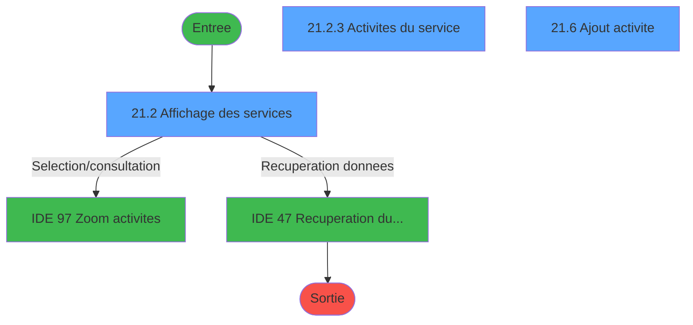
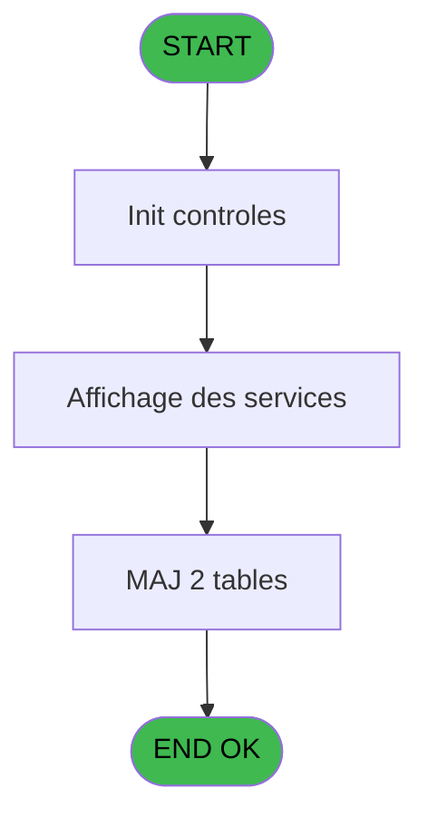
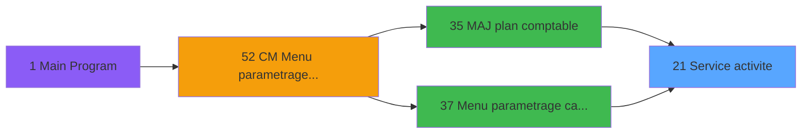
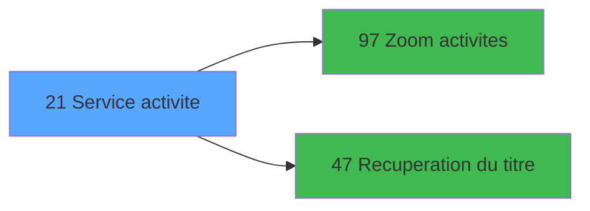

# MAI IDE 21 - Service activite

> **Analyse**: Phases 1-4 2026-02-03 14:49 -> 14:49 (9s) | Assemblage 14:49
> **Pipeline**: V7.2 Enrichi
> **Structure**: 4 onglets (Resume | Ecrans | Donnees | Connexions)

<!-- TAB:Resume -->

## 1. FICHE D'IDENTITE

| Attribut | Valeur |
|----------|--------|
| Projet | MAI |
| IDE Position | 21 |
| Nom Programme | Service activite |
| Fichier source | `Prg_21.xml` |
| Dossier IDE | Caisse |
| Taches | 17 (3 ecrans visibles) |
| Tables modifiees | 2 |
| Programmes appeles | 2 |

## 2. DESCRIPTION FONCTIONNELLE

**Service activite** assure la gestion complete de ce processus, accessible depuis [Menu parametrage caisse (IDE 37)](MAI-IDE-37.md), [MAJ plan comptable (IDE 35)](MAI-IDE-35.md).

Le flux de traitement s'organise en **6 blocs fonctionnels** :

- **Traitement** (12 taches) : traitements metier divers
- **Creation** (1 tache) : insertion d'enregistrements en base (mouvements, prestations)
- **Validation** (1 tache) : controles et verifications de coherence
- **Initialisation** (1 tache) : reinitialisation d'etats et de variables de travail
- **Consultation** (1 tache) : ecrans de recherche, selection et consultation
- **Impression** (1 tache) : generation de tickets et documents

**Donnees modifiees** : 2 tables en ecriture (activite_service_central, qualif_service_centralise).

Detail : phases du traitement

#### Phase 1 : Traitement (12 taches)

- **21** - Service activite **[[ECRAN]](#ecran-t1)**
- **21.1** - Gen service centralise
- **21.2.1** - Quitter
- **21.2.2** - Action
- **21.2.3** - Activites du service **[[ECRAN]](#ecran-t6)**
- **21.3.1** - Activite
- **21.3.2** - Activite ASCII
- **21.3.3** - Service
- **21.3.3.1** - Liste activite
- **21.3.4** - Service ASCII
- **21.5** - Generation
- **21.6.2** - Abandon

Delegue a : [Recuperation du titre (IDE 47)](MAI-IDE-47.md)

#### Phase 2 : Consultation (1 tache)

- **21.2** - Affichage des services **[[ECRAN]](#ecran-t3)**

Delegue a : [Zoom activites (IDE 97)](MAI-IDE-97.md), [Recuperation du titre (IDE 47)](MAI-IDE-47.md)

#### Phase 3 : Impression (1 tache)

- **21.3** - Edition

#### Phase 4 : Initialisation (1 tache)

- **21.4** - Raz

#### Phase 5 : Creation (1 tache)

- **21.6** - Ajout activite **[[ECRAN]](#ecran-t15)**

#### Phase 6 : Validation (1 tache)

- **21.6.1** - Validation

#### Tables impactees

| Table | Operations | Role metier |
|-------|-----------|-------------|
| activite_service_central | R/**W** (5 usages) | Services / filieres |
| qualif_service_centralise | **W** (2 usages) | Services / filieres |

## 3. BLOCS FONCTIONNELS

### 3.1 Traitement (12 taches)

Traitements internes.

---

#### 21 - Service activite [[ECRAN]](#ecran-t1)

**Role** : Tache d'orchestration : point d'entree du programme (12 sous-taches). Coordonne l'enchainement des traitements.
**Ecran** : 353 x 256 DLU (MDI) | [Voir mockup](#ecran-t1)

11 sous-taches directes

| Tache | Nom | Bloc |
|-------|-----|------|
| [21.1](#t2) | Gen service centralise | Traitement |
| [21.2.1](#t4) | Quitter | Traitement |
| [21.2.2](#t5) | Action | Traitement |
| [21.2.3](#t6) | Activites du service **[[ECRAN]](#ecran-t6)** | Traitement |
| [21.3.1](#t8) | Activite | Traitement |
| [21.3.2](#t9) | Activite ASCII | Traitement |
| [21.3.3](#t10) | Service | Traitement |
| [21.3.3.1](#t11) | Liste activite | Traitement |
| [21.3.4](#t12) | Service ASCII | Traitement |
| [21.5](#t14) | Generation | Traitement |
| [21.6.2](#t17) | Abandon | Traitement |

**Variables liees** : F (Locate Activite), G (Service pour ajout)

---

#### 21.1 - Gen service centralise

**Role** : Traitement : Gen service centralise.
**Variables liees** : G (Service pour ajout)

---

#### 21.2.1 - Quitter

**Role** : Traitement : Quitter.

---

#### 21.2.2 - Action

**Role** : Traitement : Action.
**Variables liees** : E (Action)

---

#### 21.2.3 - Activites du service [[ECRAN]](#ecran-t6)

**Role** : Traitement : Activites du service.
**Ecran** : 440 x 216 DLU (Modal) | [Voir mockup](#ecran-t6)
**Variables liees** : G (Service pour ajout)

---

#### 21.3.1 - Activite

**Role** : Traitement : Activite.
**Variables liees** : F (Locate Activite)

---

#### 21.3.2 - Activite ASCII

**Role** : Traitement : Activite ASCII.
**Variables liees** : F (Locate Activite)

---

#### 21.3.3 - Service

**Role** : Traitement : Service.
**Variables liees** : G (Service pour ajout)

---

#### 21.3.3.1 - Liste activite

**Role** : Traitement : Liste activite.
**Variables liees** : F (Locate Activite)

---

#### 21.3.4 - Service ASCII

**Role** : Traitement : Service ASCII.
**Variables liees** : G (Service pour ajout)

---

#### 21.5 - Generation

**Role** : Traitement : Generation.

---

#### 21.6.2 - Abandon

**Role** : Traitement : Abandon.

### 3.2 Consultation (1 tache)

Ecrans de recherche et consultation.

---

#### 21.2 - Affichage des services [[ECRAN]](#ecran-t3)

**Role** : Reinitialisation : Affichage des services.
**Ecran** : 1358 x 271 DLU (MDI) | [Voir mockup](#ecran-t3)
**Delegue a** : [Zoom activites (IDE 97)](MAI-IDE-97.md)

### 3.3 Impression (1 tache)

Generation des documents et tickets.

---

#### 21.3 - Edition

**Role** : Generation du document : Edition.

### 3.4 Initialisation (1 tache)

Reinitialisation d'etats et variables de travail.

---

#### 21.4 - Raz

**Role** : Reinitialisation des variables de travail.

### 3.5 Creation (1 tache)

Insertion de nouveaux enregistrements en base.

---

#### 21.6 - Ajout activite [[ECRAN]](#ecran-t15)

**Role** : Creation d'enregistrement : Ajout activite.
**Ecran** : 534 x 90 DLU (MDI) | [Voir mockup](#ecran-t15)
**Variables liees** : F (Locate Activite), G (Service pour ajout)

### 3.6 Validation (1 tache)

Controles de coherence : 1 tache verifie les donnees et conditions.

---

#### 21.6.1 - Validation

**Role** : Verification : Validation.

## 5. REGLES METIER

*(Aucune regle metier identifiee)*

## 6. CONTEXTE

- **Appele par**: [Menu parametrage caisse (IDE 37)](MAI-IDE-37.md), [MAJ plan comptable (IDE 35)](MAI-IDE-35.md)
- **Appelle**: 2 programmes | **Tables**: 6 (W:2 R:3 L:3) | **Taches**: 17 | **Expressions**: 10

<!-- TAB:Ecrans -->

## 8. ECRANS

### 8.1 Forms visibles (3 / 17)

| # | Position | Tache | Nom | Type | Largeur | Hauteur | Bloc |
|---|----------|-------|-----|------|---------|---------|------|
| 1 | 21.2 | 21.2 | Affichage des services | MDI | 1358 | 271 | Consultation |
| 2 | 21.2.3 | 21.2.3 | Activites du service | Modal | 440 | 216 | Traitement |
| 3 | 21.6 | 21.6 | Ajout activite | MDI | 534 | 90 | Creation |

### 8.2 Mockups Ecrans

---

#### 21.2 - Affichage des services
**Tache** : [21.2](#t3) | **Type** : MDI | **Dimensions** : 1358 x 271 DLU
**Bloc** : Consultation | **Titre IDE** : Affichage des services

<!-- FORM-DATA:
{
    "width":  1358,
    "vFactor":  8,
    "type":  "MDI",
    "hFactor":  8,
    "controls":  [
                     {
                         "x":  0,
                         "type":  "label",
                         "var":  "",
                         "y":  0,
                         "w":  1357,
                         "fmt":  "",
                         "name":  "",
                         "h":  19,
                         "color":  "",
                         "text":  "",
                         "parent":  null
                     },
                     {
                         "x":  0,
                         "type":  "table",
                         "var":  "",
                         "name":  "",
                         "titleH":  12,
                         "color":  "110",
                         "w":  538,
                         "y":  27,
                         "fmt":  "",
                         "parent":  null,
                         "text":  "",
                         "rowH":  12,
                         "h":  215,
                         "cols":  [
                                      {
                                          "title":  "Service",
                                          "layer":  1,
                                          "w":  82
                                      },
                                      {
                                          "title":  "Libellé service PMS",
                                          "layer":  2,
                                          "w":  262
                                      },
                                      {
                                          "title":  "Charge",
                                          "layer":  3,
                                          "w":  71
                                      },
                                      {
                                          "title":  "Bilan",
                                          "layer":  4,
                                          "w":  89
                                      }
                                  ],
                         "rows":  4
                     },
                     {
                         "x":  1037,
                         "type":  "label",
                         "var":  "",
                         "y":  147,
                         "w":  297,
                         "fmt":  "",
                         "name":  "",
                         "h":  97,
                         "color":  "",
                         "text":  "",
                         "parent":  null
                     },
                     {
                         "x":  1042,
                         "type":  "label",
                         "var":  "",
                         "y":  150,
                         "w":  45,
                         "fmt":  "",
                         "name":  "",
                         "h":  78,
                         "color":  "",
                         "text":  "",
                         "parent":  null
                     },
                     {
                         "x":  1101,
                         "type":  "label",
                         "var":  "",
                         "y":  156,
                         "w":  224,
                         "fmt":  "",
                         "name":  "",
                         "h":  9,
                         "color":  "7",
                         "text":  "Edition",
                         "parent":  null
                     },
                     {
                         "x":  1101,
                         "type":  "label",
                         "var":  "",
                         "y":  171,
                         "w":  224,
                         "fmt":  "",
                         "name":  "",
                         "h":  8,
                         "color":  "7",
                         "text":  "Generation",
                         "parent":  null
                     },
                     {
                         "x":  1101,
                         "type":  "label",
                         "var":  "",
                         "y":  185,
                         "w":  224,
                         "fmt":  "",
                         "name":  "",
                         "h":  8,
                         "color":  "7",
                         "text":  "Ajout activite",
                         "parent":  null
                     },
                     {
                         "x":  1101,
                         "type":  "label",
                         "var":  "",
                         "y":  199,
                         "w":  224,
                         "fmt":  "",
                         "name":  "",
                         "h":  8,
                         "color":  "7",
                         "text":  "",
                         "parent":  null
                     },
                     {
                         "x":  1101,
                         "type":  "label",
                         "var":  "",
                         "y":  213,
                         "w":  224,
                         "fmt":  "",
                         "name":  "",
                         "h":  8,
                         "color":  "7",
                         "text":  "",
                         "parent":  null
                     },
                     {
                         "x":  1100,
                         "type":  "label",
                         "var":  "",
                         "y":  233,
                         "w":  131,
                         "fmt":  "",
                         "name":  "",
                         "h":  10,
                         "color":  "",
                         "text":  "Votre choix",
                         "parent":  null
                     },
                     {
                         "x":  0,
                         "type":  "label",
                         "var":  "",
                         "y":  247,
                         "w":  1357,
                         "fmt":  "",
                         "name":  "",
                         "h":  24,
                         "color":  "",
                         "text":  "",
                         "parent":  null
                     },
                     {
                         "x":  176,
                         "type":  "label",
                         "var":  "",
                         "y":  255,
                         "w":  154,
                         "fmt":  "",
                         "name":  "",
                         "h":  8,
                         "color":  "144",
                         "text":  "vide",
                         "parent":  null
                     },
                     {
                         "x":  1253,
                         "type":  "edit",
                         "var":  "",
                         "y":  233,
                         "w":  26,
                         "fmt":  "",
                         "name":  "V Choix",
                         "h":  10,
                         "color":  "6",
                         "text":  "",
                         "parent":  null
                     },
                     {
                         "x":  5,
                         "type":  "edit",
                         "var":  "",
                         "y":  41,
                         "w":  75,
                         "fmt":  "U5",
                         "name":  "Service",
                         "h":  9,
                         "color":  "110",
                         "text":  "",
                         "parent":  5
                     },
                     {
                         "x":  88,
                         "type":  "edit",
                         "var":  "",
                         "y":  41,
                         "w":  248,
                         "fmt":  "",
                         "name":  "Libelle",
                         "h":  9,
                         "color":  "110",
                         "text":  "",
                         "parent":  5
                     },
                     {
                         "x":  371,
                         "type":  "checkbox",
                         "var":  "",
                         "y":  41,
                         "w":  24,
                         "fmt":  "",
                         "name":  "Compte de charge NotUsed",
                         "h":  9,
                         "color":  "110",
                         "text":  "Compte de charge",
                         "parent":  5
                     },
                     {
                         "x":  438,
                         "type":  "checkbox",
                         "var":  "",
                         "y":  41,
                         "w":  24,
                         "fmt":  "",
                         "name":  "Compte bilan",
                         "h":  9,
                         "color":  "110",
                         "text":  "Compte bilan",
                         "parent":  5
                     },
                     {
                         "x":  6,
                         "type":  "edit",
                         "var":  "",
                         "y":  5,
                         "w":  323,
                         "fmt":  "20",
                         "name":  "",
                         "h":  8,
                         "color":  "",
                         "text":  "",
                         "parent":  null
                     },
                     {
                         "x":  1011,
                         "type":  "edit",
                         "var":  "",
                         "y":  5,
                         "w":  342,
                         "fmt":  "WWW DD MMM YYYYT",
                         "name":  "",
                         "h":  8,
                         "color":  "",
                         "text":  "",
                         "parent":  null
                     },
                     {
                         "x":  1158,
                         "type":  "image",
                         "var":  "",
                         "y":  22,
                         "w":  141,
                         "fmt":  "",
                         "name":  "",
                         "h":  59,
                         "color":  "",
                         "text":  "",
                         "parent":  null
                     },
                     {
                         "x":  1051,
                         "type":  "button",
                         "var":  "",
                         "y":  156,
                         "w":  26,
                         "fmt":  "1",
                         "name":  "1",
                         "h":  9,
                         "color":  "",
                         "text":  "",
                         "parent":  null
                     },
                     {
                         "x":  1051,
                         "type":  "button",
                         "var":  "",
                         "y":  170,
                         "w":  26,
                         "fmt":  "2",
                         "name":  "2",
                         "h":  9,
                         "color":  "",
                         "text":  "",
                         "parent":  null
                     },
                     {
                         "x":  1051,
                         "type":  "button",
                         "var":  "",
                         "y":  184,
                         "w":  26,
                         "fmt":  "3",
                         "name":  "3",
                         "h":  9,
                         "color":  "",
                         "text":  "",
                         "parent":  null
                     },
                     {
                         "x":  1051,
                         "type":  "button",
                         "var":  "",
                         "y":  198,
                         "w":  26,
                         "fmt":  "4",
                         "name":  "4",
                         "h":  9,
                         "color":  "",
                         "text":  "",
                         "parent":  null
                     },
                     {
                         "x":  1051,
                         "type":  "button",
                         "var":  "",
                         "y":  212,
                         "w":  26,
                         "fmt":  "5",
                         "name":  "5",
                         "h":  9,
                         "color":  "",
                         "text":  "",
                         "parent":  null
                     },
                     {
                         "x":  7,
                         "type":  "button",
                         "var":  "",
                         "y":  251,
                         "w":  154,
                         "fmt":  "\u0026Quitter",
                         "name":  "",
                         "h":  18,
                         "color":  "",
                         "text":  "",
                         "parent":  null
                     }
                 ],
    "taskId":  "21.2",
    "height":  271
}
-->

<strong>Champs : 7 champs</strong>

| Pos (x,y) | Nom | Variable | Type |
|-----------|-----|----------|------|
| 1253,233 | V Choix | - | edit |
| 5,41 | Service | - | edit |
| 88,41 | Libelle | - | edit |
| 371,41 | Compte de charge NotUsed | - | checkbox |
| 438,41 | Compte bilan | - | checkbox |
| 6,5 | 20 | - | edit |
| 1011,5 | WWW DD MMM YYYYT | - | edit |

<strong>Boutons : 6 boutons</strong>

| Bouton | Pos (x,y) | Action |
|--------|-----------|--------|
| 1 | 1051,156 | Bouton fonctionnel |
| 2 | 1051,170 | Bouton fonctionnel |
| 3 | 1051,184 | Bouton fonctionnel |
| 4 | 1051,198 | Bouton fonctionnel |
| 5 | 1051,212 | Bouton fonctionnel |
| Quitter | 7,251 | Quitte le programme |

---

#### 21.2.3 - Activites du service
**Tache** : [21.2.3](#t6) | **Type** : Modal | **Dimensions** : 440 x 216 DLU
**Bloc** : Traitement | **Titre IDE** : Activites du service

<!-- FORM-DATA:
{
    "width":  440,
    "vFactor":  8,
    "type":  "Modal",
    "hFactor":  8,
    "controls":  [
                     {
                         "x":  3,
                         "type":  "table",
                         "var":  "",
                         "name":  "",
                         "titleH":  12,
                         "color":  "110",
                         "w":  438,
                         "y":  0,
                         "fmt":  "",
                         "parent":  null,
                         "text":  "",
                         "rowH":  12,
                         "h":  215,
                         "cols":  [
                                      {
                                          "title":  "Activité",
                                          "layer":  1,
                                          "w":  71
                                      },
                                      {
                                          "title":  "Libellé activité comptable",
                                          "layer":  2,
                                          "w":  330
                                      }
                                  ],
                         "rows":  2
                     },
                     {
                         "x":  10,
                         "type":  "edit",
                         "var":  "",
                         "y":  14,
                         "w":  61,
                         "fmt":  "",
                         "name":  "Activite du plan comptable",
                         "h":  9,
                         "color":  "110",
                         "text":  "",
                         "parent":  1
                     },
                     {
                         "x":  82,
                         "type":  "edit",
                         "var":  "",
                         "y":  14,
                         "w":  316,
                         "fmt":  "",
                         "name":  "",
                         "h":  9,
                         "color":  "110",
                         "text":  "",
                         "parent":  1
                     }
                 ],
    "taskId":  "21.2.3",
    "height":  216
}
-->

<strong>Champs : 2 champs</strong>

| Pos (x,y) | Nom | Variable | Type |
|-----------|-----|----------|------|
| 10,14 | Activite du plan comptable | - | edit |
| 82,14 | (sans nom) | - | edit |

---

#### 21.6 - Ajout activite
**Tache** : [21.6](#t15) | **Type** : MDI | **Dimensions** : 534 x 90 DLU
**Bloc** : Creation | **Titre IDE** : Ajout activite

<!-- FORM-DATA:
{
    "width":  534,
    "vFactor":  8,
    "type":  "MDI",
    "hFactor":  8,
    "controls":  [
                     {
                         "x":  2,
                         "type":  "label",
                         "var":  "",
                         "y":  0,
                         "w":  526,
                         "fmt":  "",
                         "name":  "",
                         "h":  19,
                         "color":  "",
                         "text":  "",
                         "parent":  null
                     },
                     {
                         "x":  6,
                         "type":  "label",
                         "var":  "",
                         "y":  27,
                         "w":  64,
                         "fmt":  "",
                         "name":  "",
                         "h":  10,
                         "color":  "",
                         "text":  "Activite",
                         "parent":  null
                     },
                     {
                         "x":  6,
                         "type":  "label",
                         "var":  "",
                         "y":  47,
                         "w":  64,
                         "fmt":  "",
                         "name":  "",
                         "h":  10,
                         "color":  "",
                         "text":  "Service",
                         "parent":  null
                     },
                     {
                         "x":  2,
                         "type":  "label",
                         "var":  "",
                         "y":  63,
                         "w":  526,
                         "fmt":  "",
                         "name":  "",
                         "h":  24,
                         "color":  "",
                         "text":  "",
                         "parent":  null
                     },
                     {
                         "x":  77,
                         "type":  "edit",
                         "var":  "",
                         "y":  27,
                         "w":  52,
                         "fmt":  "",
                         "name":  "Activite",
                         "h":  10,
                         "color":  "6",
                         "text":  "",
                         "parent":  null
                     },
                     {
                         "x":  135,
                         "type":  "edit",
                         "var":  "",
                         "y":  27,
                         "w":  379,
                         "fmt":  "",
                         "name":  "",
                         "h":  10,
                         "color":  "",
                         "text":  "",
                         "parent":  null
                     },
                     {
                         "x":  77,
                         "type":  "edit",
                         "var":  "",
                         "y":  47,
                         "w":  52,
                         "fmt":  "",
                         "name":  "Service PMS",
                         "h":  10,
                         "color":  "",
                         "text":  "",
                         "parent":  null
                     },
                     {
                         "x":  135,
                         "type":  "edit",
                         "var":  "",
                         "y":  47,
                         "w":  379,
                         "fmt":  "",
                         "name":  "",
                         "h":  10,
                         "color":  "",
                         "text":  "",
                         "parent":  null
                     },
                     {
                         "x":  8,
                         "type":  "edit",
                         "var":  "",
                         "y":  5,
                         "w":  209,
                         "fmt":  "30",
                         "name":  "",
                         "h":  8,
                         "color":  "",
                         "text":  "",
                         "parent":  null
                     },
                     {
                         "x":  275,
                         "type":  "edit",
                         "var":  "",
                         "y":  5,
                         "w":  244,
                         "fmt":  "WWW DD MMM YYYYT",
                         "name":  "",
                         "h":  8,
                         "color":  "",
                         "text":  "",
                         "parent":  null
                     },
                     {
                         "x":  9,
                         "type":  "button",
                         "var":  "",
                         "y":  67,
                         "w":  154,
                         "fmt":  "\u0026Abandon",
                         "name":  "",
                         "h":  18,
                         "color":  "",
                         "text":  "",
                         "parent":  null
                     },
                     {
                         "x":  365,
                         "type":  "button",
                         "var":  "",
                         "y":  67,
                         "w":  154,
                         "fmt":  "\u0026Validation",
                         "name":  "",
                         "h":  18,
                         "color":  "",
                         "text":  "",
                         "parent":  null
                     }
                 ],
    "taskId":  "21.6",
    "height":  90
}
-->

<strong>Champs : 6 champs</strong>

| Pos (x,y) | Nom | Variable | Type |
|-----------|-----|----------|------|
| 77,27 | Activite | - | edit |
| 135,27 | (sans nom) | - | edit |
| 77,47 | Service PMS | - | edit |
| 135,47 | (sans nom) | - | edit |
| 8,5 | 30 | - | edit |
| 275,5 | WWW DD MMM YYYYT | - | edit |

<strong>Boutons : 2 boutons</strong>

| Bouton | Pos (x,y) | Action |
|--------|-----------|--------|
| Abandon | 9,67 | Annule et retour au menu |
| Validation | 365,67 | Valide la saisie et enregistre |

## 9. NAVIGATION

### 9.1 Enchainement des ecrans

**Detail par enchainement :**

| Depuis | Action | Vers | Retour |
|--------|--------|------|--------|
| Affichage des services | Selection/consultation | [Zoom activites (IDE 97)](MAI-IDE-97.md) | Retour ecran |
| Affichage des services | Recuperation donnees | [Recuperation du titre (IDE 47)](MAI-IDE-47.md) | Retour ecran |

### 9.3 Structure hierarchique (17 taches)

| Position | Tache | Type | Dimensions | Bloc |
|----------|-------|------|------------|------|
| **21.1** | [**Service activite** (21)](#t1) [mockup](#ecran-t1) | MDI | 353x256 | Traitement |
| 21.1.1 | [Gen service centralise (21.1)](#t2) | MDI | - | |
| 21.1.2 | [Quitter (21.2.1)](#t4) | MDI | - | |
| 21.1.3 | [Action (21.2.2)](#t5) | MDI | - | |
| 21.1.4 | [Activites du service (21.2.3)](#t6) [mockup](#ecran-t6) | Modal | 440x216 | |
| 21.1.5 | [Activite (21.3.1)](#t8) | MDI | - | |
| 21.1.6 | [Activite ASCII (21.3.2)](#t9) | MDI | - | |
| 21.1.7 | [Service (21.3.3)](#t10) | MDI | - | |
| 21.1.8 | [Liste activite (21.3.3.1)](#t11) | MDI | - | |
| 21.1.9 | [Service ASCII (21.3.4)](#t12) | MDI | - | |
| 21.1.10 | [Generation (21.5)](#t14) | MDI | - | |
| 21.1.11 | [Abandon (21.6.2)](#t17) | MDI | - | |
| **21.2** | [**Affichage des services** (21.2)](#t3) [mockup](#ecran-t3) | MDI | 1358x271 | Consultation |
| **21.3** | [**Edition** (21.3)](#t7) | MDI | - | Impression |
| **21.4** | [**Raz** (21.4)](#t13) | MDI | - | Initialisation |
| **21.5** | [**Ajout activite** (21.6)](#t15) [mockup](#ecran-t15) | MDI | 534x90 | Creation |
| **21.6** | [**Validation** (21.6.1)](#t16) | MDI | - | Validation |

### 9.4 Algorigramme

> **Legende**: Vert = START/END OK | Rouge = END KO | Bleu = Decisions
> *Algorigramme auto-genere. Utiliser `/algorigramme` pour une synthese metier detaillee.*

<!-- TAB:Donnees -->

## 10. TABLES

### Tables utilisees (6)

| ID | Nom | Description | Type | R | W | L | Usages |
|----|-----|-------------|------|---|---|---|--------|
| 67 | tables___________tab |  | DB | R |   |   | 3 |
| 201 | activite_plan_comptable |  | DB | R |   | L | 5 |
| 202 | activite_service_central | Services / filieres | DB | R | **W** |   | 5 |
| 212 | qualif_service_centralise | Services / filieres | DB |   | **W** |   | 2 |
| 698 | droit_par_utilisateurs | Droits operateur | DB |   |   | L | 1 |
| 708 | param_retail |  | DB |   |   | L | 1 |

### Colonnes par table (5 / 4 tables avec colonnes identifiees)

Table 67 - tables___________tab (R) - 3 usages

| Lettre | Variable | Acces | Type |
|--------|----------|-------|------|
| A | nbre activite | R | Numeric |
| B | Service PMS | R | Alpha |

Table 201 - activite_plan_comptable (R/L) - 5 usages

| Lettre | Variable | Acces | Type |
|--------|----------|-------|------|
| A | nbre activite | R | Numeric |
| F | Locate Activite | R | Numeric |

Table 202 - activite_service_central (R/**W**) - 5 usages

| Lettre | Variable | Acces | Type |
|--------|----------|-------|------|
| A | nbre activite | W | Numeric |
| B | Service PMS | W | Alpha |
| F | Locate Activite | W | Numeric |
| G | Service pour ajout | W | Alpha |

Table 212 - qualif_service_centralise (**W**) - 2 usages

| Lettre | Variable | Acces | Type |
|--------|----------|-------|------|
| A | v compte pour zoom (NotUsed] | W | Numeric |
| B | CURSEUR | W | Logical |
| C | V Titre | W | Alpha |
| D | V Choix | W | Alpha |

## 11. VARIABLES

### 11.1 Autres (7)

Variables diverses.

| Lettre | Nom | Type | Usage dans |
|--------|-----|------|-----------|
| A | Param Automatique | Logical | 2x refs |
| B | Param societe | Alpha | 1x refs |
| C | Fin | Logical | 1x refs |
| D | Fichier existe | Logical | - |
| E | Action | Numeric | [21.2.2](#t5) |
| F | Locate Activite | Numeric | - |
| G | Service pour ajout | Alpha | - |

## 12. EXPRESSIONS

**10 / 10 expressions decodees (100%)**

### 12.1 Repartition par type

| Type | Expressions | Regles |
|------|-------------|--------|
| CONSTANTE | 1 | 0 |
| OTHER | 2 | 0 |
| NEGATION | 1 | 0 |
| CONDITION | 5 | 0 |
| CAST_LOGIQUE | 1 | 0 |

### 12.2 Expressions cles par type

#### CONSTANTE (1 expressions)

| Type | IDE | Expression | Regle |
|------|-----|------------|-------|
| CONSTANTE | 3 | `'C'` | - |

#### OTHER (2 expressions)

| Type | IDE | Expression | Regle |
|------|-----|------------|-------|
| OTHER | 5 | `Fin [C]` | - |
| OTHER | 1 | `Param Automatique [A]` | - |

#### NEGATION (1 expressions)

| Type | IDE | Expression | Regle |
|------|-----|------------|-------|
| NEGATION | 2 | `NOT (Param Automatique [A])` | - |

#### CONDITION (5 expressions)

| Type | IDE | Expression | Regle |
|------|-----|------------|-------|
| CONDITION | 8 | `Action [E]=2` | - |
| CONDITION | 9 | `Action [E]=3` | - |
| CONDITION | 7 | `Action [E]=1` | - |
| CONDITION | 4 | `Param societe [B]=''` | - |
| CONDITION | 6 | `Action [E]=0` | - |

#### CAST_LOGIQUE (1 expressions)

| Type | IDE | Expression | Regle |
|------|-----|------------|-------|
| CAST_LOGIQUE | 10 | `'TRUE'LOG` | - |

<!-- TAB:Connexions -->

## 13. GRAPHE D'APPELS

### 13.1 Chaine depuis Main (Callers)

Main -> ... -> [Menu parametrage caisse (IDE 37)](MAI-IDE-37.md) -> **Service activite (IDE 21)**

Main -> ... -> [MAJ plan comptable (IDE 35)](MAI-IDE-35.md) -> **Service activite (IDE 21)**

### 13.2 Callers

| IDE | Nom Programme | Nb Appels |
|-----|---------------|-----------|
| [37](MAI-IDE-37.md) | Menu parametrage caisse | 2 |
| [35](MAI-IDE-35.md) | MAJ plan comptable | 1 |

### 13.3 Callees (programmes appeles)

### 13.4 Detail Callees avec contexte

| IDE | Nom Programme | Appels | Contexte |
|-----|---------------|--------|----------|
| [97](MAI-IDE-97.md) | Zoom activites | 2 | Selection/consultation |
| [47](MAI-IDE-47.md) | Recuperation du titre | 1 | Recuperation donnees |

## 14. RECOMMANDATIONS MIGRATION

### 14.1 Profil du programme

| Metrique | Valeur | Impact migration |
|----------|--------|-----------------|
| Lignes de logique | 193 | Programme compact |
| Expressions | 10 | Peu de logique |
| Tables WRITE | 2 | Impact faible |
| Sous-programmes | 2 | Peu de dependances |
| Ecrans visibles | 3 | Quelques ecrans |
| Code desactive | 0% (0 / 193) | Code sain |
| Regles metier | 0 | Pas de regle identifiee |

### 14.2 Plan de migration par bloc

#### Traitement (12 taches: 2 ecrans, 10 traitements)

- **Strategie** : Orchestrateur avec 2 ecrans (Razor/React) et 10 traitements backend (services).
- Les ecrans deviennent des composants UI, les traitements invisibles deviennent des services injectables.
- 2 sous-programme(s) a migrer ou a reutiliser depuis les services existants.
- Decomposer les taches en services unitaires testables.

#### Consultation (1 tache: 1 ecran, 0 traitement)

- **Strategie** : Composants de recherche/selection en modales.
- 1 ecran : Affichage des services

#### Impression (1 tache: 0 ecran, 1 traitement)

- **Strategie** : Templates HTML -> PDF via wkhtmltopdf ou Puppeteer.
- `PrintService` injectable avec choix imprimante

#### Initialisation (1 tache: 0 ecran, 1 traitement)

- **Strategie** : Constructeur/methode `InitAsync()` dans l'orchestrateur.

#### Creation (1 tache: 1 ecran, 0 traitement)

- **Strategie** : Repository pattern avec Entity Framework Core.
- Insertion via `IRepository<T>.CreateAsync()`

#### Validation (1 tache: 0 ecran, 1 traitement)

- **Strategie** : FluentValidation avec validators specifiques.
- Chaque tache de validation -> un validator injectable

### 14.3 Dependances critiques

| Dependance | Type | Appels | Impact |
|------------|------|--------|--------|
| activite_service_central | Table WRITE (Database) | 4x | Schema + repository |
| qualif_service_centralise | Table WRITE (Database) | 2x | Schema + repository |
| [Zoom activites (IDE 97)](MAI-IDE-97.md) | Sous-programme | 2x | Haute - Selection/consultation |
| [Recuperation du titre (IDE 47)](MAI-IDE-47.md) | Sous-programme | 1x | Normale - Recuperation donnees |

---
*Spec DETAILED generee par Pipeline V7.2 - 2026-02-03 14:49*
