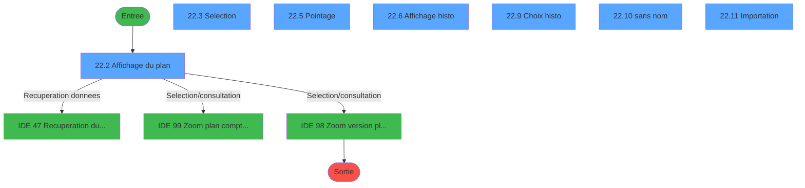
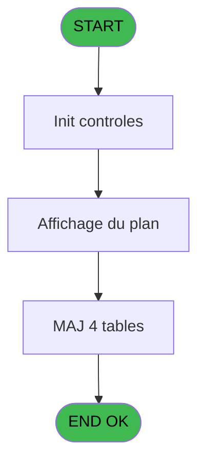
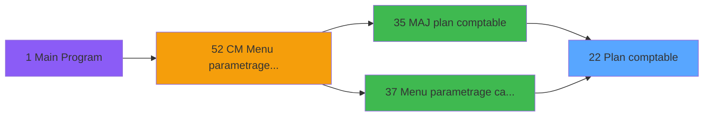
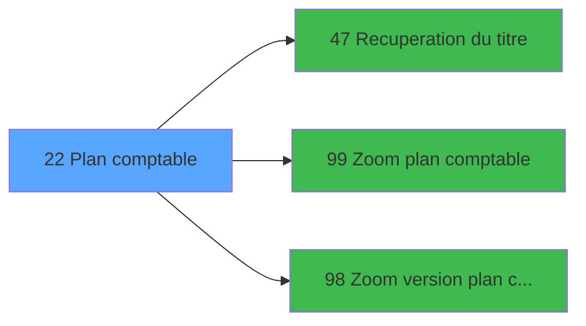

# MAI IDE 22 - Plan comptable

> **Analyse**: Phases 1-4 2026-02-03 14:49 -> 14:49 (10s) | Assemblage 14:49
> **Pipeline**: V7.2 Enrichi
> **Structure**: 4 onglets (Resume | Ecrans | Donnees | Connexions)

<!-- TAB:Resume -->

## 1. FICHE D'IDENTITE

| Attribut | Valeur |
|----------|--------|
| Projet | MAI |
| IDE Position | 22 |
| Nom Programme | Plan comptable |
| Fichier source | `Prg_22.xml` |
| Dossier IDE | Caisse |
| Taches | 49 (7 ecrans visibles) |
| Tables modifiees | 4 |
| Programmes appeles | 3 |

## 2. DESCRIPTION FONCTIONNELLE

**Plan comptable** assure la gestion complete de ce processus, accessible depuis [Menu parametrage caisse (IDE 37)](MAI-IDE-37.md), [MAJ plan comptable (IDE 35)](MAI-IDE-35.md).

Le flux de traitement s'organise en **5 blocs fonctionnels** :

- **Traitement** (35 taches) : traitements metier divers
- **Consultation** (5 taches) : ecrans de recherche, selection et consultation
- **Calcul** (4 taches) : calculs de montants, stocks ou compteurs
- **Creation** (3 taches) : insertion d'enregistrements en base (mouvements, prestations)
- **Initialisation** (2 taches) : reinitialisation d'etats et de variables de travail

**Donnees modifiees** : 4 tables en ecriture (activite_plan_comptable, activite_service_central, plan_comptable_central, plan_comptable_central_version).

Detail : phases du traitement

#### Phase 1 : Calcul (4 taches)

- **22** - Plan comptable
- **22.3.1** - Existence compte
- **22.5.1** - Existence compte
- **22.5.4** - Pointage compte

Delegue a : [Zoom plan comptable (IDE 99)](MAI-IDE-99.md), [Zoom version plan comptable (IDE 98)](MAI-IDE-98.md)

#### Phase 2 : Traitement (35 taches)

- **22.1** - Existence
- **22.1.1** - vide
- **22.1.2** - existe
- **22.1.2.1** - Delete record vide
- **22.2.1** - Version du plan
- **22.2.2** - Quitter
- **22.2.3** - Action
- **22.3.2** - Existence activite
- **22.3.3** - Abandon
- **22.5** - Pointage **[[ECRAN]](#ecran-t15)**
- **22.5.2** - Existence activite
- **22.5.3** - Abandon
- **22.5.5** - Pointage activite
- **22.6.1** - Quitter
- **22.6.2** - Action
- **22.7** - Existe pointage
- **22.8** - Existe pointage histo
- **22.9.1** - Quitter
- **22.10** - (sans nom) **[[ECRAN]](#ecran-t28)**
- **22.10.2** - activite
- **22.11** - Importation **[[ECRAN]](#ecran-t33)**
- **22.11.1** - Histo avant import **[[ECRAN]](#ecran-t40)**
- **22.11.1.1** - (sans nom) **[[ECRAN]](#ecran-t41)**
- **22.11.1.2** - (sans nom) **[[ECRAN]](#ecran-t42)**
- **22.11.1.3** - (sans nom) **[[ECRAN]](#ecran-t43)**
- **22.11.2** - (sans nom) **[[ECRAN]](#ecran-t44)**
- **22.11.2.1** - Classes 12345 **[[ECRAN]](#ecran-t45)**
- **22.11.2.2** - Classes 6 **[[ECRAN]](#ecran-t47)**
- **22.11.2.3** - Classes 7 **[[ECRAN]](#ecran-t49)**
- **22.11.3** - Existence
- **22.11.3.1** - vide
- **22.11.3.2** - existe
- **22.11.3.2.1** - Delete record vide
- **22.11.4** - (sans nom) **[[ECRAN]](#ecran-t55)**
- **22.11.4.2** - activite new

Delegue a : [Recuperation du titre (IDE 47)](MAI-IDE-47.md)

#### Phase 3 : Consultation (5 taches)

- **22.2** - Affichage du plan **[[ECRAN]](#ecran-t6)**
- **22.3** - Selection **[[ECRAN]](#ecran-t10)**
- **22.4** - Annule selection
- **22.6** - Affichage histo **[[ECRAN]](#ecran-t21)**
- **22.9** - Choix histo **[[ECRAN]](#ecran-t26)**

Delegue a : [Recuperation du titre (IDE 47)](MAI-IDE-47.md), [Zoom plan comptable (IDE 99)](MAI-IDE-99.md), [Zoom version plan comptable (IDE 98)](MAI-IDE-98.md)

#### Phase 4 : Initialisation (2 taches)

- **22.10.1** - RAZ
- **22.11.4.1** - RAZ

#### Phase 5 : Creation (3 taches)

- **22.11.2.1.1** - creation
- **22.11.2.2.1** - creation
- **22.11.2.3.1** - creation

#### Tables impactees

| Table | Operations | Role metier |
|-------|-----------|-------------|
| plan_comptable_central | R/**W** (25 usages) |  |
| activite_plan_comptable | **W**/L (4 usages) |  |
| activite_service_central | **W**/L (3 usages) | Services / filieres |
| plan_comptable_central_version | **W** (1 usages) |  |

## 3. BLOCS FONCTIONNELS

### 3.1 Calcul (4 taches)

Calculs metier : montants, stocks, compteurs.

---

#### 22 - Plan comptable

**Role** : Traitement : Plan comptable.

3 sous-taches directes

| Tache | Nom | Bloc |
|-------|-----|------|
| [22.3.1](#t11) | Existence compte | Calcul |
| [22.5.1](#t16) | Existence compte | Calcul |
| [22.5.4](#t19) | Pointage compte | Calcul |

**Variables liees** : E (Plan existe), F (Plan existe Produit), G (Plan existe Charge), H (Plan existe Financier), I (Plan existe Bilan)
**Delegue a** : [Zoom plan comptable (IDE 99)](MAI-IDE-99.md), [Zoom version plan comptable (IDE 98)](MAI-IDE-98.md)

---

#### 22.3.1 - Existence compte

**Role** : Traitement : Existence compte.
**Variables liees** : J (SEL Compte mini), K (SEL Compte maxi)
**Delegue a** : [Zoom plan comptable (IDE 99)](MAI-IDE-99.md), [Zoom version plan comptable (IDE 98)](MAI-IDE-98.md)

---

#### 22.5.1 - Existence compte

**Role** : Traitement : Existence compte.
**Variables liees** : J (SEL Compte mini), K (SEL Compte maxi)
**Delegue a** : [Zoom plan comptable (IDE 99)](MAI-IDE-99.md), [Zoom version plan comptable (IDE 98)](MAI-IDE-98.md)

---

#### 22.5.4 - Pointage compte

**Role** : Traitement : Pointage compte.
**Variables liees** : J (SEL Compte mini), K (SEL Compte maxi)
**Delegue a** : [Zoom plan comptable (IDE 99)](MAI-IDE-99.md), [Zoom version plan comptable (IDE 98)](MAI-IDE-98.md)

### 3.2 Traitement (35 taches)

Traitements internes.

---

#### 22.1 - Existence

**Role** : Traitement : Existence.

---

#### 22.1.1 - vide

**Role** : Traitement : vide.

---

#### 22.1.2 - existe

**Role** : Traitement : existe.
**Variables liees** : E (Plan existe), F (Plan existe Produit), G (Plan existe Charge), H (Plan existe Financier), I (Plan existe Bilan)

---

#### 22.1.2.1 - Delete record vide

**Role** : Traitement : Delete record vide.

---

#### 22.2.1 - Version du plan

**Role** : Traitement : Version du plan.
**Variables liees** : E (Plan existe), F (Plan existe Produit), G (Plan existe Charge), H (Plan existe Financier), I (Plan existe Bilan)

---

#### 22.2.2 - Quitter

**Role** : Traitement : Quitter.

---

#### 22.2.3 - Action

**Role** : Traitement : Action.
**Variables liees** : C (Action)

---

#### 22.3.2 - Existence activite

**Role** : Traitement : Existence activite.
**Variables liees** : L (SEL Activite)

---

#### 22.3.3 - Abandon

**Role** : Traitement : Abandon.

---

#### 22.5 - Pointage [[ECRAN]](#ecran-t15)

**Role** : Traitement : Pointage.
**Ecran** : 963 x 202 DLU (MDI) | [Voir mockup](#ecran-t15)

---

#### 22.5.2 - Existence activite

**Role** : Traitement : Existence activite.
**Variables liees** : L (SEL Activite)

---

#### 22.5.3 - Abandon

**Role** : Traitement : Abandon.

---

#### 22.5.5 - Pointage activite

**Role** : Traitement : Pointage activite.
**Variables liees** : L (SEL Activite)

---

#### 22.6.1 - Quitter

**Role** : Traitement : Quitter.

---

#### 22.6.2 - Action

**Role** : Traitement : Action.
**Variables liees** : C (Action)

---

#### 22.7 - Existe pointage

**Role** : Traitement : Existe pointage.
**Variables liees** : E (Plan existe), F (Plan existe Produit), G (Plan existe Charge), H (Plan existe Financier), I (Plan existe Bilan)

---

#### 22.8 - Existe pointage histo

**Role** : Traitement : Existe pointage histo.
**Variables liees** : E (Plan existe), F (Plan existe Produit), G (Plan existe Charge), H (Plan existe Financier), I (Plan existe Bilan)

---

#### 22.9.1 - Quitter

**Role** : Traitement : Quitter.

---

#### 22.10 - (sans nom) [[ECRAN]](#ecran-t28)

**Role** : Traitement interne.
**Ecran** : 480 x 64 DLU (MDI) | [Voir mockup](#ecran-t28)

---

#### 22.10.2 - activite

**Role** : Traitement : activite.
**Variables liees** : L (SEL Activite)

---

#### 22.11 - Importation [[ECRAN]](#ecran-t33)

**Role** : Traitement : Importation.
**Ecran** : 458 x 67 DLU (MDI) | [Voir mockup](#ecran-t33)

---

#### 22.11.1 - Histo avant import [[ECRAN]](#ecran-t40)

**Role** : Traitement : Histo avant import.
**Ecran** : 458 x 67 DLU (MDI) | [Voir mockup](#ecran-t40)
**Variables liees** : U (CON Demande import), V (COM Confirmation import)

---

#### 22.11.1.1 - (sans nom) [[ECRAN]](#ecran-t41)

**Role** : Traitement interne.
**Ecran** : 480 x 64 DLU (MDI) | [Voir mockup](#ecran-t41)

---

#### 22.11.1.2 - (sans nom) [[ECRAN]](#ecran-t42)

**Role** : Traitement interne.
**Ecran** : 480 x 64 DLU (MDI) | [Voir mockup](#ecran-t42)

---

#### 22.11.1.3 - (sans nom) [[ECRAN]](#ecran-t43)

**Role** : Traitement interne.
**Ecran** : 480 x 64 DLU (MDI) | [Voir mockup](#ecran-t43)

---

#### 22.11.2 - (sans nom) [[ECRAN]](#ecran-t44)

**Role** : Traitement interne.
**Ecran** : 480 x 64 DLU (MDI) | [Voir mockup](#ecran-t44)

---

#### 22.11.2.1 - Classes 12345 [[ECRAN]](#ecran-t45)

**Role** : Traitement : Classes 12345.
**Ecran** : 960 x 0 DLU (MDI) | [Voir mockup](#ecran-t45)

---

#### 22.11.2.2 - Classes 6 [[ECRAN]](#ecran-t47)

**Role** : Traitement : Classes 6.
**Ecran** : 960 x 0 DLU (MDI) | [Voir mockup](#ecran-t47)

---

#### 22.11.2.3 - Classes 7 [[ECRAN]](#ecran-t49)

**Role** : Traitement : Classes 7.
**Ecran** : 960 x 0 DLU (MDI) | [Voir mockup](#ecran-t49)

---

#### 22.11.3 - Existence

**Role** : Traitement : Existence.

---

#### 22.11.3.1 - vide

**Role** : Traitement : vide.

---

#### 22.11.3.2 - existe

**Role** : Traitement : existe.
**Variables liees** : E (Plan existe), F (Plan existe Produit), G (Plan existe Charge), H (Plan existe Financier), I (Plan existe Bilan)

---

#### 22.11.3.2.1 - Delete record vide

**Role** : Traitement : Delete record vide.

---

#### 22.11.4 - (sans nom) [[ECRAN]](#ecran-t55)

**Role** : Traitement interne.
**Ecran** : 480 x 64 DLU (MDI) | [Voir mockup](#ecran-t55)

---

#### 22.11.4.2 - activite new

**Role** : Traitement : activite new.
**Variables liees** : L (SEL Activite)

### 3.3 Consultation (5 taches)

Ecrans de recherche et consultation.

---

#### 22.2 - Affichage du plan [[ECRAN]](#ecran-t6)

**Role** : Reinitialisation : Affichage du plan.
**Ecran** : 1248 x 271 DLU (MDI) | [Voir mockup](#ecran-t6)
**Variables liees** : E (Plan existe), F (Plan existe Produit), G (Plan existe Charge), H (Plan existe Financier), I (Plan existe Bilan)

---

#### 22.3 - Selection [[ECRAN]](#ecran-t10)

**Role** : Selection par l'operateur : Selection.
**Ecran** : 966 x 202 DLU (MDI) | [Voir mockup](#ecran-t10)

---

#### 22.4 - Annule selection

**Role** : Selection par l'operateur : Annule selection.

---

#### 22.6 - Affichage histo [[ECRAN]](#ecran-t21)

**Role** : Reinitialisation : Affichage histo.
**Ecran** : 1253 x 273 DLU (MDI) | [Voir mockup](#ecran-t21)

---

#### 22.9 - Choix histo [[ECRAN]](#ecran-t26)

**Role** : Selection par l'operateur : Choix histo.
**Ecran** : 643 x 203 DLU (MDI) | [Voir mockup](#ecran-t26)

### 3.4 Initialisation (2 taches)

Reinitialisation d'etats et variables de travail.

---

#### 22.10.1 - RAZ

**Role** : Reinitialisation des variables de travail.

---

#### 22.11.4.1 - RAZ

**Role** : Reinitialisation des variables de travail.

### 3.5 Creation (3 taches)

Insertion de nouveaux enregistrements en base.

---

#### 22.11.2.1.1 - creation

**Role** : Creation d'enregistrement : creation.

---

#### 22.11.2.2.1 - creation

**Role** : Creation d'enregistrement : creation.

---

#### 22.11.2.3.1 - creation

**Role** : Creation d'enregistrement : creation.

## 5. REGLES METIER

*(Aucune regle metier identifiee)*

## 6. CONTEXTE

- **Appele par**: [Menu parametrage caisse (IDE 37)](MAI-IDE-37.md), [MAJ plan comptable (IDE 35)](MAI-IDE-35.md)
- **Appelle**: 3 programmes | **Tables**: 5 (W:4 R:2 L:3) | **Taches**: 49 | **Expressions**: 33

<!-- TAB:Ecrans -->

## 8. ECRANS

### 8.1 Forms visibles (7 / 49)

| # | Position | Tache | Nom | Type | Largeur | Hauteur | Bloc |
|---|----------|-------|-----|------|---------|---------|------|
| 1 | 22.2 | 22.2 | Affichage du plan | MDI | 1248 | 271 | Consultation |
| 2 | 22.3 | 22.3 | Selection | MDI | 966 | 202 | Consultation |
| 3 | 22.5 | 22.5 | Pointage | MDI | 963 | 202 | Traitement |
| 4 | 22.6 | 22.6 | Affichage histo | MDI | 1253 | 273 | Consultation |
| 5 | 22.9 | 22.9 | Choix histo | MDI | 643 | 203 | Consultation |
| 6 | 22.10 | 22.10 | (sans nom) | MDI | 480 | 64 | Traitement |
| 7 | 22.11 | 22.11 | Importation | MDI | 458 | 67 | Traitement |

### 8.2 Mockups Ecrans

---

#### 22.2 - Affichage du plan
**Tache** : [22.2](#t6) | **Type** : MDI | **Dimensions** : 1248 x 271 DLU
**Bloc** : Consultation | **Titre IDE** : Affichage du plan

<!-- FORM-DATA:
{
    "width":  1248,
    "vFactor":  8,
    "type":  "MDI",
    "hFactor":  8,
    "controls":  [
                     {
                         "x":  0,
                         "type":  "label",
                         "var":  "",
                         "y":  0,
                         "w":  1243,
                         "fmt":  "",
                         "name":  "",
                         "h":  19,
                         "color":  "",
                         "text":  "",
                         "parent":  null
                     },
                     {
                         "x":  5,
                         "type":  "table",
                         "var":  "",
                         "name":  "",
                         "titleH":  13,
                         "color":  "110",
                         "w":  904,
                         "y":  23,
                         "fmt":  "",
                         "parent":  null,
                         "text":  "",
                         "rowH":  14,
                         "h":  218,
                         "cols":  [
                                      {
                                          "title":  "Compte",
                                          "layer":  1,
                                          "w":  83
                                      },
                                      {
                                          "title":  "Activité",
                                          "layer":  2,
                                          "w":  79
                                      },
                                      {
                                          "title":  "Libellé",
                                          "layer":  3,
                                          "w":  417
                                      },
                                      {
                                          "title":  "Produit",
                                          "layer":  4,
                                          "w":  32
                                      },
                                      {
                                          "title":  "Charge",
                                          "layer":  5,
                                          "w":  32
                                      },
                                      {
                                          "title":  "Financier",
                                          "layer":  6,
                                          "w":  32
                                      },
                                      {
                                          "title":  "Bilan",
                                          "layer":  7,
                                          "w":  32
                                      },
                                      {
                                          "title":  "",
                                          "layer":  8,
                                          "w":  32
                                      },
                                      {
                                          "title":  "A partir du",
                                          "layer":  9,
                                          "w":  131
                                      }
                                  ],
                         "rows":  9
                     },
                     {
                         "x":  1127,
                         "type":  "label",
                         "var":  "",
                         "y":  25,
                         "w":  112,
                         "fmt":  "",
                         "name":  "",
                         "h":  11,
                         "color":  "",
                         "text":  "Produit",
                         "parent":  null
                     },
                     {
                         "x":  1127,
                         "type":  "label",
                         "var":  "",
                         "y":  37,
                         "w":  112,
                         "fmt":  "",
                         "name":  "",
                         "h":  11,
                         "color":  "",
                         "text":  "Charge",
                         "parent":  null
                     },
                     {
                         "x":  1127,
                         "type":  "label",
                         "var":  "",
                         "y":  49,
                         "w":  112,
                         "fmt":  "",
                         "name":  "",
                         "h":  11,
                         "color":  "",
                         "text":  "Financier",
                         "parent":  null
                     },
                     {
                         "x":  1127,
                         "type":  "label",
                         "var":  "",
                         "y":  61,
                         "w":  112,
                         "fmt":  "",
                         "name":  "",
                         "h":  11,
                         "color":  "",
                         "text":  "Bilan",
                         "parent":  null
                     },
                     {
                         "x":  1100,
                         "type":  "label",
                         "var":  "",
                         "y":  73,
                         "w":  24,
                         "fmt":  "",
                         "name":  "",
                         "h":  11,
                         "color":  "7",
                         "text":  "5",
                         "parent":  null
                     },
                     {
                         "x":  1127,
                         "type":  "label",
                         "var":  "",
                         "y":  73,
                         "w":  112,
                         "fmt":  "",
                         "name":  "",
                         "h":  11,
                         "color":  "",
                         "text":  "Pointage libre",
                         "parent":  null
                     },
                     {
                         "x":  943,
                         "type":  "label",
                         "var":  "",
                         "y":  90,
                         "w":  139,
                         "fmt":  "",
                         "name":  "",
                         "h":  8,
                         "color":  "166",
                         "text":  "Selection",
                         "parent":  null
                     },
                     {
                         "x":  943,
                         "type":  "label",
                         "var":  "",
                         "y":  103,
                         "w":  139,
                         "fmt":  "",
                         "name":  "",
                         "h":  8,
                         "color":  "166",
                         "text":  "Compte mini",
                         "parent":  null
                     },
                     {
                         "x":  943,
                         "type":  "label",
                         "var":  "",
                         "y":  103,
                         "w":  139,
                         "fmt":  "",
                         "name":  "",
                         "h":  8,
                         "color":  "166",
                         "text":  "Activite",
                         "parent":  null
                     },
                     {
                         "x":  943,
                         "type":  "label",
                         "var":  "",
                         "y":  103,
                         "w":  139,
                         "fmt":  "",
                         "name":  "",
                         "h":  8,
                         "color":  "166",
                         "text":  "Produit",
                         "parent":  null
                     },
                     {
                         "x":  943,
                         "type":  "label",
                         "var":  "",
                         "y":  103,
                         "w":  139,
                         "fmt":  "",
                         "name":  "",
                         "h":  8,
                         "color":  "166",
                         "text":  "Financier",
                         "parent":  null
                     },
                     {
                         "x":  943,
                         "type":  "label",
                         "var":  "",
                         "y":  103,
                         "w":  139,
                         "fmt":  "",
                         "name":  "",
                         "h":  8,
                         "color":  "166",
                         "text":  "Charge",
                         "parent":  null
                     },
                     {
                         "x":  943,
                         "type":  "label",
                         "var":  "",
                         "y":  103,
                         "w":  139,
                         "fmt":  "",
                         "name":  "",
                         "h":  8,
                         "color":  "166",
                         "text":  "Bilan",
                         "parent":  null
                     },
                     {
                         "x":  943,
                         "type":  "label",
                         "var":  "",
                         "y":  115,
                         "w":  139,
                         "fmt":  "",
                         "name":  "",
                         "h":  8,
                         "color":  "166",
                         "text":  "Compte maxi",
                         "parent":  null
                     },
                     {
                         "x":  943,
                         "type":  "label",
                         "var":  "",
                         "y":  139,
                         "w":  297,
                         "fmt":  "",
                         "name":  "",
                         "h":  97,
                         "color":  "",
                         "text":  "",
                         "parent":  null
                     },
                     {
                         "x":  948,
                         "type":  "label",
                         "var":  "",
                         "y":  142,
                         "w":  45,
                         "fmt":  "",
                         "name":  "",
                         "h":  78,
                         "color":  "",
                         "text":  "",
                         "parent":  null
                     },
                     {
                         "x":  1007,
                         "type":  "label",
                         "var":  "",
                         "y":  148,
                         "w":  224,
                         "fmt":  "",
                         "name":  "",
                         "h":  9,
                         "color":  "7",
                         "text":  "Importation",
                         "parent":  null
                     },
                     {
                         "x":  1007,
                         "type":  "label",
                         "var":  "",
                         "y":  163,
                         "w":  224,
                         "fmt":  "",
                         "name":  "",
                         "h":  8,
                         "color":  "7",
                         "text":  "Selection",
                         "parent":  null
                     },
                     {
                         "x":  1007,
                         "type":  "label",
                         "var":  "",
                         "y":  177,
                         "w":  224,
                         "fmt":  "",
                         "name":  "",
                         "h":  8,
                         "color":  "7",
                         "text":  "Annule selection",
                         "parent":  null
                     },
                     {
                         "x":  1007,
                         "type":  "label",
                         "var":  "",
                         "y":  191,
                         "w":  224,
                         "fmt":  "",
                         "name":  "",
                         "h":  8,
                         "color":  "7",
                         "text":  "Pointage avec selection",
                         "parent":  null
                     },
                     {
                         "x":  1007,
                         "type":  "label",
                         "var":  "",
                         "y":  205,
                         "w":  224,
                         "fmt":  "",
                         "name":  "",
                         "h":  8,
                         "color":  "7",
                         "text":  "Historique",
                         "parent":  null
                     },
                     {
                         "x":  1006,
                         "type":  "label",
                         "var":  "",
                         "y":  225,
                         "w":  131,
                         "fmt":  "",
                         "name":  "",
                         "h":  10,
                         "color":  "",
                         "text":  "Votre choix",
                         "parent":  null
                     },
                     {
                         "x":  0,
                         "type":  "label",
                         "var":  "",
                         "y":  246,
                         "w":  1243,
                         "fmt":  "",
                         "name":  "",
                         "h":  24,
                         "color":  "",
                         "text":  "",
                         "parent":  null
                     },
                     {
                         "x":  173,
                         "type":  "label",
                         "var":  "",
                         "y":  253,
                         "w":  200,
                         "fmt":  "",
                         "name":  "",
                         "h":  10,
                         "color":  "144",
                         "text":  "Plan vide",
                         "parent":  null
                     },
                     {
                         "x":  1159,
                         "type":  "edit",
                         "var":  "",
                         "y":  225,
                         "w":  26,
                         "fmt":  "",
                         "name":  "CHOIX",
                         "h":  10,
                         "color":  "6",
                         "text":  "",
                         "parent":  null
                     },
                     {
                         "x":  11,
                         "type":  "edit",
                         "var":  "",
                         "y":  39,
                         "w":  75,
                         "fmt":  "",
                         "name":  "Compte",
                         "h":  8,
                         "color":  "110",
                         "text":  "",
                         "parent":  4
                     },
                     {
                         "x":  94,
                         "type":  "edit",
                         "var":  "",
                         "y":  39,
                         "w":  72,
                         "fmt":  "3Z",
                         "name":  "Activite",
                         "h":  8,
                         "color":  "110",
                         "text":  "",
                         "parent":  4
                     },
                     {
                         "x":  173,
                         "type":  "edit",
                         "var":  "",
                         "y":  39,
                         "w":  400,
                         "fmt":  "",
                         "name":  "Libelle FRA",
                         "h":  8,
                         "color":  "110",
                         "text":  "",
                         "parent":  4
                     },
                     {
                         "x":  173,
                         "type":  "edit",
                         "var":  "",
                         "y":  39,
                         "w":  400,
                         "fmt":  "",
                         "name":  "Libelle ANG",
                         "h":  8,
                         "color":  "110",
                         "text":  "",
                         "parent":  4
                     },
                     {
                         "x":  590,
                         "type":  "checkbox",
                         "var":  "",
                         "y":  39,
                         "w":  24,
                         "fmt":  "",
                         "name":  "Compte produit",
                         "h":  8,
                         "color":  "110",
                         "text":  "Compte recette",
                         "parent":  4
                     },
                     {
                         "x":  622,
                         "type":  "checkbox",
                         "var":  "",
                         "y":  39,
                         "w":  24,
                         "fmt":  "",
                         "name":  "Compte charge",
                         "h":  8,
                         "color":  "110",
                         "text":  "Compte depense",
                         "parent":  4
                     },
                     {
                         "x":  658,
                         "type":  "checkbox",
                         "var":  "",
                         "y":  39,
                         "w":  24,
                         "fmt":  "",
                         "name":  "Compte financier",
                         "h":  8,
                         "color":  "110",
                         "text":  "Compte règlement",
                         "parent":  4
                     },
                     {
                         "x":  690,
                         "type":  "checkbox",
                         "var":  "",
                         "y":  39,
                         "w":  24,
                         "fmt":  "",
                         "name":  "Compte bilan",
                         "h":  8,
                         "color":  "110",
                         "text":  "Compte bilan",
                         "parent":  4
                     },
                     {
                         "x":  718,
                         "type":  "checkbox",
                         "var":  "",
                         "y":  39,
                         "w":  24,
                         "fmt":  "",
                         "name":  "Compte qualification libre",
                         "h":  8,
                         "color":  "110",
                         "text":  "Compte qualification libre 2",
                         "parent":  4
                     },
                     {
                         "x":  754,
                         "type":  "edit",
                         "var":  "",
                         "y":  39,
                         "w":  126,
                         "fmt":  "",
                         "name":  "A partir du",
                         "h":  8,
                         "color":  "110",
                         "text":  "",
                         "parent":  4
                     },
                     {
                         "x":  1100,
                         "type":  "edit",
                         "var":  "",
                         "y":  25,
                         "w":  24,
                         "fmt":  "",
                         "name":  "7",
                         "h":  11,
                         "color":  "7",
                         "text":  "",
                         "parent":  null
                     },
                     {
                         "x":  1100,
                         "type":  "edit",
                         "var":  "",
                         "y":  37,
                         "w":  24,
                         "fmt":  "",
                         "name":  "8",
                         "h":  11,
                         "color":  "7",
                         "text":  "",
                         "parent":  null
                     },
                     {
                         "x":  1100,
                         "type":  "edit",
                         "var":  "",
                         "y":  49,
                         "w":  24,
                         "fmt":  "",
                         "name":  "9",
                         "h":  11,
                         "color":  "7",
                         "text":  "",
                         "parent":  null
                     },
                     {
                         "x":  1100,
                         "type":  "edit",
                         "var":  "",
                         "y":  61,
                         "w":  24,
                         "fmt":  "",
                         "name":  "10",
                         "h":  11,
                         "color":  "7",
                         "text":  "",
                         "parent":  null
                     },
                     {
                         "x":  6,
                         "type":  "edit",
                         "var":  "",
                         "y":  5,
                         "w":  323,
                         "fmt":  "20",
                         "name":  "",
                         "h":  8,
                         "color":  "",
                         "text":  "",
                         "parent":  null
                     },
                     {
                         "x":  897,
                         "type":  "edit",
                         "var":  "",
                         "y":  5,
                         "w":  342,
                         "fmt":  "WWW DD MMM YYYYT",
                         "name":  "",
                         "h":  8,
                         "color":  "",
                         "text":  "",
                         "parent":  null
                     },
                     {
                         "x":  943,
                         "type":  "image",
                         "var":  "",
                         "y":  24,
                         "w":  139,
                         "fmt":  "",
                         "name":  "",
                         "h":  59,
                         "color":  "",
                         "text":  "",
                         "parent":  null
                     },
                     {
                         "x":  1086,
                         "type":  "edit",
                         "var":  "",
                         "y":  103,
                         "w":  82,
                         "fmt":  "6P0",
                         "name":  "",
                         "h":  10,
                         "color":  "6",
                         "text":  "",
                         "parent":  null
                     },
                     {
                         "x":  1086,
                         "type":  "edit",
                         "var":  "",
                         "y":  103,
                         "w":  82,
                         "fmt":  "3",
                         "name":  "",
                         "h":  10,
                         "color":  "6",
                         "text":  "",
                         "parent":  null
                     },
                     {
                         "x":  1086,
                         "type":  "edit",
                         "var":  "",
                         "y":  115,
                         "w":  82,
                         "fmt":  "6",
                         "name":  "",
                         "h":  10,
                         "color":  "6",
                         "text":  "",
                         "parent":  null
                     },
                     {
                         "x":  957,
                         "type":  "button",
                         "var":  "",
                         "y":  148,
                         "w":  26,
                         "fmt":  "1",
                         "name":  "1",
                         "h":  9,
                         "color":  "",
                         "text":  "",
                         "parent":  null
                     },
                     {
                         "x":  957,
                         "type":  "button",
                         "var":  "",
                         "y":  162,
                         "w":  26,
                         "fmt":  "2",
                         "name":  "2",
                         "h":  9,
                         "color":  "",
                         "text":  "",
                         "parent":  null
                     },
                     {
                         "x":  957,
                         "type":  "button",
                         "var":  "",
                         "y":  176,
                         "w":  26,
                         "fmt":  "3",
                         "name":  "3",
                         "h":  9,
                         "color":  "",
                         "text":  "",
                         "parent":  null
                     },
                     {
                         "x":  957,
                         "type":  "button",
                         "var":  "",
                         "y":  190,
                         "w":  26,
                         "fmt":  "4",
                         "name":  "4",
                         "h":  9,
                         "color":  "",
                         "text":  "",
                         "parent":  null
                     },
                     {
                         "x":  957,
                         "type":  "button",
                         "var":  "",
                         "y":  204,
                         "w":  26,
                         "fmt":  "5",
                         "name":  "5",
                         "h":  9,
                         "color":  "",
                         "text":  "",
                         "parent":  null
                     },
                     {
                         "x":  7,
                         "type":  "button",
                         "var":  "",
                         "y":  249,
                         "w":  154,
                         "fmt":  "\u0026Quitter",
                         "name":  "Q",
                         "h":  18,
                         "color":  "",
                         "text":  "",
                         "parent":  null
                     },
                     {
                         "x":  173,
                         "type":  "edit",
                         "var":  "",
                         "y":  253,
                         "w":  200,
                         "fmt":  "30",
                         "name":  "",
                         "h":  10,
                         "color":  "7",
                         "text":  "",
                         "parent":  null
                     },
                     {
                         "x":  1086,
                         "type":  "edit",
                         "var":  "",
                         "y":  253,
                         "w":  154,
                         "fmt":  "30",
                         "name":  "",
                         "h":  10,
                         "color":  "",
                         "text":  "",
                         "parent":  50
                     }
                 ],
    "taskId":  "22.2",
    "height":  271
}
-->

<strong>Champs : 22 champs</strong>

| Pos (x,y) | Nom | Variable | Type |
|-----------|-----|----------|------|
| 1159,225 | CHOIX | - | edit |
| 11,39 | Compte | - | edit |
| 94,39 | Activite | - | edit |
| 173,39 | Libelle FRA | - | edit |
| 173,39 | Libelle ANG | - | edit |
| 590,39 | Compte produit | - | checkbox |
| 622,39 | Compte charge | - | checkbox |
| 658,39 | Compte financier | - | checkbox |
| 690,39 | Compte bilan | - | checkbox |
| 718,39 | Compte qualification libre | - | checkbox |
| 754,39 | A partir du | - | edit |
| 1100,25 | 7 | - | edit |
| 1100,37 | 8 | - | edit |
| 1100,49 | 9 | - | edit |
| 1100,61 | 10 | - | edit |
| 6,5 | 20 | - | edit |
| 897,5 | WWW DD MMM YYYYT | - | edit |
| 1086,103 | 6P0 | - | edit |
| 1086,103 | 3 | - | edit |
| 1086,115 | 6 | - | edit |
| 173,253 | 30 | - | edit |
| 1086,253 | 30 | - | edit |

<strong>Boutons : 6 boutons</strong>

| Bouton | Pos (x,y) | Action |
|--------|-----------|--------|
| 1 | 957,148 | Bouton fonctionnel |
| 2 | 957,162 | Bouton fonctionnel |
| 3 | 957,176 | Bouton fonctionnel |
| 4 | 957,190 | Bouton fonctionnel |
| 5 | 957,204 | Bouton fonctionnel |
| Quitter | 7,249 | Quitte le programme |

---

#### 22.3 - Selection
**Tache** : [22.3](#t10) | **Type** : MDI | **Dimensions** : 966 x 202 DLU
**Bloc** : Consultation | **Titre IDE** : Selection

<!-- FORM-DATA:
{
    "width":  966,
    "vFactor":  8,
    "type":  "MDI",
    "hFactor":  8,
    "controls":  [
                     {
                         "x":  0,
                         "type":  "label",
                         "var":  "",
                         "y":  0,
                         "w":  958,
                         "fmt":  "",
                         "name":  "",
                         "h":  19,
                         "color":  "",
                         "text":  "",
                         "parent":  null
                     },
                     {
                         "x":  181,
                         "type":  "label",
                         "var":  "",
                         "y":  75,
                         "w":  629,
                         "fmt":  "",
                         "name":  "",
                         "h":  27,
                         "color":  "",
                         "text":  "",
                         "parent":  null
                     },
                     {
                         "x":  220,
                         "type":  "label",
                         "var":  "",
                         "y":  82,
                         "w":  109,
                         "fmt":  "",
                         "name":  "",
                         "h":  10,
                         "color":  "",
                         "text":  "Activite",
                         "parent":  null
                     },
                     {
                         "x":  181,
                         "type":  "label",
                         "var":  "",
                         "y":  111,
                         "w":  629,
                         "fmt":  "",
                         "name":  "",
                         "h":  59,
                         "color":  "",
                         "text":  "",
                         "parent":  null
                     },
                     {
                         "x":  220,
                         "type":  "label",
                         "var":  "",
                         "y":  125,
                         "w":  109,
                         "fmt":  "",
                         "name":  "",
                         "h":  10,
                         "color":  "",
                         "text":  "Compte mini",
                         "parent":  null
                     },
                     {
                         "x":  558,
                         "type":  "label",
                         "var":  "",
                         "y":  125,
                         "w":  84,
                         "fmt":  "",
                         "name":  "",
                         "h":  10,
                         "color":  "",
                         "text":  "Calcule",
                         "parent":  null
                     },
                     {
                         "x":  220,
                         "type":  "label",
                         "var":  "",
                         "y":  148,
                         "w":  109,
                         "fmt":  "",
                         "name":  "",
                         "h":  10,
                         "color":  "",
                         "text":  "Compte maxi",
                         "parent":  null
                     },
                     {
                         "x":  558,
                         "type":  "label",
                         "var":  "",
                         "y":  148,
                         "w":  84,
                         "fmt":  "",
                         "name":  "",
                         "h":  10,
                         "color":  "",
                         "text":  "Calcule",
                         "parent":  null
                     },
                     {
                         "x":  3,
                         "type":  "label",
                         "var":  "",
                         "y":  176,
                         "w":  957,
                         "fmt":  "",
                         "name":  "",
                         "h":  24,
                         "color":  "",
                         "text":  "",
                         "parent":  null
                     },
                     {
                         "x":  426,
                         "type":  "radio",
                         "var":  "",
                         "y":  32,
                         "w":  108,
                         "fmt":  "",
                         "name":  "Choix",
                         "h":  31,
                         "color":  "",
                         "text":  "",
                         "parent":  null
                     },
                     {
                         "x":  332,
                         "type":  "edit",
                         "var":  "",
                         "y":  125,
                         "w":  96,
                         "fmt":  "",
                         "name":  "Compte mini",
                         "h":  10,
                         "color":  "6",
                         "text":  "",
                         "parent":  null
                     },
                     {
                         "x":  332,
                         "type":  "edit",
                         "var":  "",
                         "y":  148,
                         "w":  96,
                         "fmt":  "",
                         "name":  "Compte maxi",
                         "h":  10,
                         "color":  "6",
                         "text":  "",
                         "parent":  null
                     },
                     {
                         "x":  332,
                         "type":  "edit",
                         "var":  "",
                         "y":  82,
                         "w":  48,
                         "fmt":  "",
                         "name":  "Activite",
                         "h":  10,
                         "color":  "6",
                         "text":  "",
                         "parent":  null
                     },
                     {
                         "x":  6,
                         "type":  "edit",
                         "var":  "",
                         "y":  5,
                         "w":  323,
                         "fmt":  "30",
                         "name":  "",
                         "h":  8,
                         "color":  "",
                         "text":  "",
                         "parent":  null
                     },
                     {
                         "x":  606,
                         "type":  "edit",
                         "var":  "",
                         "y":  5,
                         "w":  342,
                         "fmt":  "WWW DD MMM YYYYT",
                         "name":  "",
                         "h":  8,
                         "color":  "",
                         "text":  "",
                         "parent":  null
                     },
                     {
                         "x":  644,
                         "type":  "edit",
                         "var":  "",
                         "y":  125,
                         "w":  96,
                         "fmt":  "6P0",
                         "name":  "",
                         "h":  10,
                         "color":  "6",
                         "text":  "",
                         "parent":  null
                     },
                     {
                         "x":  644,
                         "type":  "edit",
                         "var":  "",
                         "y":  148,
                         "w":  96,
                         "fmt":  "6",
                         "name":  "",
                         "h":  10,
                         "color":  "6",
                         "text":  "",
                         "parent":  null
                     },
                     {
                         "x":  19,
                         "type":  "button",
                         "var":  "",
                         "y":  181,
                         "w":  154,
                         "fmt":  "Abandon",
                         "name":  "ABA",
                         "h":  14,
                         "color":  "",
                         "text":  "",
                         "parent":  null
                     },
                     {
                         "x":  795,
                         "type":  "button",
                         "var":  "",
                         "y":  182,
                         "w":  154,
                         "fmt":  "Validation",
                         "name":  "VAL",
                         "h":  14,
                         "color":  "",
                         "text":  "",
                         "parent":  null
                     }
                 ],
    "taskId":  "22.3",
    "height":  202
}
-->

<strong>Champs : 7 champs</strong>

| Pos (x,y) | Nom | Variable | Type |
|-----------|-----|----------|------|
| 332,125 | Compte mini | - | edit |
| 332,148 | Compte maxi | - | edit |
| 332,82 | Activite | - | edit |
| 6,5 | 30 | - | edit |
| 606,5 | WWW DD MMM YYYYT | - | edit |
| 644,125 | 6P0 | - | edit |
| 644,148 | 6 | - | edit |

<strong>Boutons : 2 boutons</strong>

| Bouton | Pos (x,y) | Action |
|--------|-----------|--------|
| Abandon | 19,181 | Annule et retour au menu |
| Validation | 795,182 | Valide la saisie et enregistre |

---

#### 22.5 - Pointage
**Tache** : [22.5](#t15) | **Type** : MDI | **Dimensions** : 963 x 202 DLU
**Bloc** : Traitement | **Titre IDE** : Pointage

<!-- FORM-DATA:
{
    "width":  963,
    "vFactor":  8,
    "type":  "MDI",
    "hFactor":  8,
    "controls":  [
                     {
                         "x":  1,
                         "type":  "label",
                         "var":  "",
                         "y":  0,
                         "w":  958,
                         "fmt":  "",
                         "name":  "",
                         "h":  19,
                         "color":  "",
                         "text":  "",
                         "parent":  null
                     },
                     {
                         "x":  198,
                         "type":  "label",
                         "var":  "",
                         "y":  57,
                         "w":  583,
                         "fmt":  "",
                         "name":  "",
                         "h":  18,
                         "color":  "",
                         "text":  "",
                         "parent":  null
                     },
                     {
                         "x":  220,
                         "type":  "label",
                         "var":  "",
                         "y":  61,
                         "w":  64,
                         "fmt":  "",
                         "name":  "",
                         "h":  10,
                         "color":  "",
                         "text":  "Activite",
                         "parent":  null
                     },
                     {
                         "x":  198,
                         "type":  "label",
                         "var":  "",
                         "y":  78,
                         "w":  583,
                         "fmt":  "",
                         "name":  "",
                         "h":  36,
                         "color":  "",
                         "text":  "",
                         "parent":  null
                     },
                     {
                         "x":  220,
                         "type":  "label",
                         "var":  "",
                         "y":  84,
                         "w":  106,
                         "fmt":  "",
                         "name":  "",
                         "h":  10,
                         "color":  "",
                         "text":  "Compte mini",
                         "parent":  null
                     },
                     {
                         "x":  558,
                         "type":  "label",
                         "var":  "",
                         "y":  84,
                         "w":  84,
                         "fmt":  "",
                         "name":  "",
                         "h":  10,
                         "color":  "",
                         "text":  "Calcule",
                         "parent":  null
                     },
                     {
                         "x":  220,
                         "type":  "label",
                         "var":  "",
                         "y":  100,
                         "w":  110,
                         "fmt":  "",
                         "name":  "",
                         "h":  10,
                         "color":  "",
                         "text":  "Compte maxi",
                         "parent":  null
                     },
                     {
                         "x":  558,
                         "type":  "label",
                         "var":  "",
                         "y":  100,
                         "w":  84,
                         "fmt":  "",
                         "name":  "",
                         "h":  10,
                         "color":  "",
                         "text":  "Calcule",
                         "parent":  null
                     },
                     {
                         "x":  2,
                         "type":  "label",
                         "var":  "",
                         "y":  176,
                         "w":  957,
                         "fmt":  "",
                         "name":  "",
                         "h":  24,
                         "color":  "",
                         "text":  "",
                         "parent":  null
                     },
                     {
                         "x":  407,
                         "type":  "radio",
                         "var":  "",
                         "y":  23,
                         "w":  147,
                         "fmt":  "",
                         "name":  "Choix",
                         "h":  31,
                         "color":  "",
                         "text":  "",
                         "parent":  null
                     },
                     {
                         "x":  332,
                         "type":  "edit",
                         "var":  "",
                         "y":  84,
                         "w":  96,
                         "fmt":  "",
                         "name":  "Compte mini",
                         "h":  10,
                         "color":  "6",
                         "text":  "",
                         "parent":  null
                     },
                     {
                         "x":  332,
                         "type":  "edit",
                         "var":  "",
                         "y":  100,
                         "w":  96,
                         "fmt":  "",
                         "name":  "Compte maxi",
                         "h":  10,
                         "color":  "6",
                         "text":  "",
                         "parent":  null
                     },
                     {
                         "x":  332,
                         "type":  "edit",
                         "var":  "",
                         "y":  61,
                         "w":  48,
                         "fmt":  "",
                         "name":  "Activite",
                         "h":  10,
                         "color":  "6",
                         "text":  "",
                         "parent":  null
                     },
                     {
                         "x":  407,
                         "type":  "radio",
                         "var":  "",
                         "y":  118,
                         "w":  147,
                         "fmt":  "",
                         "name":  "Pointage",
                         "h":  56,
                         "color":  "",
                         "text":  "Produit,Charge,Financier,Bilan",
                         "parent":  null
                     },
                     {
                         "x":  7,
                         "type":  "edit",
                         "var":  "",
                         "y":  5,
                         "w":  323,
                         "fmt":  "30",
                         "name":  "",
                         "h":  8,
                         "color":  "",
                         "text":  "",
                         "parent":  null
                     },
                     {
                         "x":  607,
                         "type":  "edit",
                         "var":  "",
                         "y":  5,
                         "w":  342,
                         "fmt":  "WWW DD MMM YYYYT",
                         "name":  "",
                         "h":  8,
                         "color":  "",
                         "text":  "",
                         "parent":  null
                     },
                     {
                         "x":  644,
                         "type":  "edit",
                         "var":  "",
                         "y":  84,
                         "w":  96,
                         "fmt":  "6P0",
                         "name":  "",
                         "h":  10,
                         "color":  "6",
                         "text":  "",
                         "parent":  null
                     },
                     {
                         "x":  644,
                         "type":  "edit",
                         "var":  "",
                         "y":  100,
                         "w":  96,
                         "fmt":  "6",
                         "name":  "",
                         "h":  10,
                         "color":  "6",
                         "text":  "",
                         "parent":  null
                     },
                     {
                         "x":  14,
                         "type":  "button",
                         "var":  "",
                         "y":  181,
                         "w":  154,
                         "fmt":  "Abandon",
                         "name":  "ABA",
                         "h":  14,
                         "color":  "",
                         "text":  "",
                         "parent":  null
                     },
                     {
                         "x":  400,
                         "type":  "button",
                         "var":  "",
                         "y":  181,
                         "w":  160,
                         "fmt":  "Efface pointage",
                         "name":  "EFF",
                         "h":  14,
                         "color":  "",
                         "text":  "",
                         "parent":  null
                     },
                     {
                         "x":  797,
                         "type":  "button",
                         "var":  "",
                         "y":  181,
                         "w":  154,
                         "fmt":  "Validation",
                         "name":  "VAL",
                         "h":  14,
                         "color":  "",
                         "text":  "",
                         "parent":  null
                     }
                 ],
    "taskId":  "22.5",
    "height":  202
}
-->

<strong>Champs : 7 champs</strong>

| Pos (x,y) | Nom | Variable | Type |
|-----------|-----|----------|------|
| 332,84 | Compte mini | - | edit |
| 332,100 | Compte maxi | - | edit |
| 332,61 | Activite | - | edit |
| 7,5 | 30 | - | edit |
| 607,5 | WWW DD MMM YYYYT | - | edit |
| 644,84 | 6P0 | - | edit |
| 644,100 | 6 | - | edit |

<strong>Boutons : 3 boutons</strong>

| Bouton | Pos (x,y) | Action |
|--------|-----------|--------|
| Abandon | 14,181 | Annule et retour au menu |
| Efface pointage | 400,181 | Supprime l'element selectionne |
| Validation | 797,181 | Valide la saisie et enregistre |

---

#### 22.6 - Affichage histo
**Tache** : [22.6](#t21) | **Type** : MDI | **Dimensions** : 1253 x 273 DLU
**Bloc** : Consultation | **Titre IDE** : Affichage histo

<!-- FORM-DATA:
{
    "width":  1253,
    "vFactor":  8,
    "type":  "MDI",
    "hFactor":  8,
    "controls":  [
                     {
                         "x":  0,
                         "type":  "label",
                         "var":  "",
                         "y":  0,
                         "w":  1243,
                         "fmt":  "",
                         "name":  "",
                         "h":  19,
                         "color":  "",
                         "text":  "",
                         "parent":  null
                     },
                     {
                         "x":  5,
                         "type":  "table",
                         "var":  "",
                         "name":  "",
                         "titleH":  13,
                         "color":  "110",
                         "w":  920,
                         "y":  24,
                         "fmt":  "",
                         "parent":  null,
                         "text":  "",
                         "rowH":  12,
                         "h":  213,
                         "cols":  [
                                      {
                                          "title":  "Compte",
                                          "layer":  1,
                                          "w":  83
                                      },
                                      {
                                          "title":  "Activité",
                                          "layer":  2,
                                          "w":  79
                                      },
                                      {
                                          "title":  "Libellé",
                                          "layer":  3,
                                          "w":  417
                                      },
                                      {
                                          "title":  "Produit",
                                          "layer":  4,
                                          "w":  35
                                      },
                                      {
                                          "title":  "Charge",
                                          "layer":  5,
                                          "w":  36
                                      },
                                      {
                                          "title":  "Financier",
                                          "layer":  6,
                                          "w":  36
                                      },
                                      {
                                          "title":  "Bilan",
                                          "layer":  7,
                                          "w":  36
                                      },
                                      {
                                          "title":  "",
                                          "layer":  8,
                                          "w":  34
                                      },
                                      {
                                          "title":  "A partir du ",
                                          "layer":  9,
                                          "w":  123
                                      }
                                  ],
                         "rows":  9
                     },
                     {
                         "x":  1127,
                         "type":  "label",
                         "var":  "",
                         "y":  25,
                         "w":  112,
                         "fmt":  "",
                         "name":  "",
                         "h":  11,
                         "color":  "",
                         "text":  "Produit",
                         "parent":  null
                     },
                     {
                         "x":  1127,
                         "type":  "label",
                         "var":  "",
                         "y":  37,
                         "w":  112,
                         "fmt":  "",
                         "name":  "",
                         "h":  11,
                         "color":  "",
                         "text":  "Charge",
                         "parent":  null
                     },
                     {
                         "x":  1127,
                         "type":  "label",
                         "var":  "",
                         "y":  49,
                         "w":  112,
                         "fmt":  "",
                         "name":  "",
                         "h":  11,
                         "color":  "",
                         "text":  "Financier",
                         "parent":  null
                     },
                     {
                         "x":  1127,
                         "type":  "label",
                         "var":  "",
                         "y":  61,
                         "w":  112,
                         "fmt":  "",
                         "name":  "",
                         "h":  11,
                         "color":  "",
                         "text":  "Bilan",
                         "parent":  null
                     },
                     {
                         "x":  1100,
                         "type":  "label",
                         "var":  "",
                         "y":  73,
                         "w":  24,
                         "fmt":  "",
                         "name":  "",
                         "h":  11,
                         "color":  "7",
                         "text":  "5",
                         "parent":  null
                     },
                     {
                         "x":  1127,
                         "type":  "label",
                         "var":  "",
                         "y":  73,
                         "w":  112,
                         "fmt":  "",
                         "name":  "",
                         "h":  11,
                         "color":  "",
                         "text":  "Pointage libre",
                         "parent":  null
                     },
                     {
                         "x":  943,
                         "type":  "label",
                         "var":  "",
                         "y":  90,
                         "w":  139,
                         "fmt":  "",
                         "name":  "",
                         "h":  8,
                         "color":  "166",
                         "text":  "Selection",
                         "parent":  null
                     },
                     {
                         "x":  943,
                         "type":  "label",
                         "var":  "",
                         "y":  103,
                         "w":  139,
                         "fmt":  "",
                         "name":  "",
                         "h":  8,
                         "color":  "166",
                         "text":  "Compte mini",
                         "parent":  null
                     },
                     {
                         "x":  943,
                         "type":  "label",
                         "var":  "",
                         "y":  103,
                         "w":  139,
                         "fmt":  "",
                         "name":  "",
                         "h":  8,
                         "color":  "166",
                         "text":  "Activite",
                         "parent":  null
                     },
                     {
                         "x":  943,
                         "type":  "label",
                         "var":  "",
                         "y":  103,
                         "w":  139,
                         "fmt":  "",
                         "name":  "",
                         "h":  8,
                         "color":  "166",
                         "text":  "Produit",
                         "parent":  null
                     },
                     {
                         "x":  943,
                         "type":  "label",
                         "var":  "",
                         "y":  103,
                         "w":  139,
                         "fmt":  "",
                         "name":  "",
                         "h":  8,
                         "color":  "166",
                         "text":  "Charge",
                         "parent":  null
                     },
                     {
                         "x":  943,
                         "type":  "label",
                         "var":  "",
                         "y":  103,
                         "w":  139,
                         "fmt":  "",
                         "name":  "",
                         "h":  8,
                         "color":  "166",
                         "text":  "Financier",
                         "parent":  null
                     },
                     {
                         "x":  943,
                         "type":  "label",
                         "var":  "",
                         "y":  103,
                         "w":  139,
                         "fmt":  "",
                         "name":  "",
                         "h":  8,
                         "color":  "166",
                         "text":  "Bilan",
                         "parent":  null
                     },
                     {
                         "x":  943,
                         "type":  "label",
                         "var":  "",
                         "y":  115,
                         "w":  139,
                         "fmt":  "",
                         "name":  "",
                         "h":  8,
                         "color":  "166",
                         "text":  "Compte maxi",
                         "parent":  null
                     },
                     {
                         "x":  943,
                         "type":  "label",
                         "var":  "",
                         "y":  139,
                         "w":  297,
                         "fmt":  "",
                         "name":  "",
                         "h":  97,
                         "color":  "",
                         "text":  "",
                         "parent":  null
                     },
                     {
                         "x":  948,
                         "type":  "label",
                         "var":  "",
                         "y":  142,
                         "w":  45,
                         "fmt":  "",
                         "name":  "",
                         "h":  78,
                         "color":  "",
                         "text":  "",
                         "parent":  null
                     },
                     {
                         "x":  1007,
                         "type":  "label",
                         "var":  "",
                         "y":  148,
                         "w":  224,
                         "fmt":  "",
                         "name":  "",
                         "h":  9,
                         "color":  "7",
                         "text":  "Importation",
                         "parent":  null
                     },
                     {
                         "x":  1007,
                         "type":  "label",
                         "var":  "",
                         "y":  163,
                         "w":  224,
                         "fmt":  "",
                         "name":  "",
                         "h":  8,
                         "color":  "7",
                         "text":  "Selection",
                         "parent":  null
                     },
                     {
                         "x":  1007,
                         "type":  "label",
                         "var":  "",
                         "y":  177,
                         "w":  224,
                         "fmt":  "",
                         "name":  "",
                         "h":  8,
                         "color":  "7",
                         "text":  "Annule selection",
                         "parent":  null
                     },
                     {
                         "x":  1007,
                         "type":  "label",
                         "var":  "",
                         "y":  191,
                         "w":  224,
                         "fmt":  "",
                         "name":  "",
                         "h":  8,
                         "color":  "7",
                         "text":  "Pointage avec selection",
                         "parent":  null
                     },
                     {
                         "x":  1007,
                         "type":  "label",
                         "var":  "",
                         "y":  205,
                         "w":  224,
                         "fmt":  "",
                         "name":  "",
                         "h":  8,
                         "color":  "7",
                         "text":  "Historique",
                         "parent":  null
                     },
                     {
                         "x":  1006,
                         "type":  "label",
                         "var":  "",
                         "y":  225,
                         "w":  131,
                         "fmt":  "",
                         "name":  "",
                         "h":  10,
                         "color":  "",
                         "text":  "Votre choix",
                         "parent":  null
                     },
                     {
                         "x":  0,
                         "type":  "label",
                         "var":  "",
                         "y":  246,
                         "w":  1243,
                         "fmt":  "",
                         "name":  "",
                         "h":  24,
                         "color":  "",
                         "text":  "",
                         "parent":  null
                     },
                     {
                         "x":  943,
                         "type":  "label",
                         "var":  "",
                         "y":  249,
                         "w":  297,
                         "fmt":  "",
                         "name":  "",
                         "h":  18,
                         "color":  "174",
                         "text":  "Historique",
                         "parent":  null
                     },
                     {
                         "x":  173,
                         "type":  "label",
                         "var":  "",
                         "y":  252,
                         "w":  200,
                         "fmt":  "",
                         "name":  "",
                         "h":  8,
                         "color":  "144",
                         "text":  "Plan vide",
                         "parent":  null
                     },
                     {
                         "x":  1159,
                         "type":  "edit",
                         "var":  "",
                         "y":  225,
                         "w":  26,
                         "fmt":  "",
                         "name":  "V Choix",
                         "h":  10,
                         "color":  "6",
                         "text":  "",
                         "parent":  null
                     },
                     {
                         "x":  11,
                         "type":  "edit",
                         "var":  "",
                         "y":  39,
                         "w":  75,
                         "fmt":  "",
                         "name":  "Compte",
                         "h":  8,
                         "color":  "110",
                         "text":  "",
                         "parent":  4
                     },
                     {
                         "x":  94,
                         "type":  "edit",
                         "var":  "",
                         "y":  39,
                         "w":  72,
                         "fmt":  "3Z",
                         "name":  "Activite",
                         "h":  8,
                         "color":  "110",
                         "text":  "",
                         "parent":  4
                     },
                     {
                         "x":  173,
                         "type":  "edit",
                         "var":  "",
                         "y":  39,
                         "w":  400,
                         "fmt":  "",
                         "name":  "Libelle FRA",
                         "h":  8,
                         "color":  "110",
                         "text":  "",
                         "parent":  4
                     },
                     {
                         "x":  173,
                         "type":  "edit",
                         "var":  "",
                         "y":  39,
                         "w":  400,
                         "fmt":  "",
                         "name":  "Libelle ANG",
                         "h":  8,
                         "color":  "110",
                         "text":  "",
                         "parent":  4
                     },
                     {
                         "x":  590,
                         "type":  "checkbox",
                         "var":  "",
                         "y":  39,
                         "w":  24,
                         "fmt":  "",
                         "name":  "Compte produit",
                         "h":  8,
                         "color":  "110",
                         "text":  "Compte recette",
                         "parent":  4
                     },
                     {
                         "x":  626,
                         "type":  "checkbox",
                         "var":  "",
                         "y":  39,
                         "w":  24,
                         "fmt":  "",
                         "name":  "Compte charge",
                         "h":  8,
                         "color":  "110",
                         "text":  "Compte depense",
                         "parent":  4
                     },
                     {
                         "x":  661,
                         "type":  "checkbox",
                         "var":  "",
                         "y":  39,
                         "w":  24,
                         "fmt":  "",
                         "name":  "Compte financier",
                         "h":  8,
                         "color":  "110",
                         "text":  "Compte règlement",
                         "parent":  4
                     },
                     {
                         "x":  698,
                         "type":  "checkbox",
                         "var":  "",
                         "y":  39,
                         "w":  24,
                         "fmt":  "",
                         "name":  "Compte bilan",
                         "h":  8,
                         "color":  "110",
                         "text":  "Compte bilan",
                         "parent":  4
                     },
                     {
                         "x":  734,
                         "type":  "checkbox",
                         "var":  "",
                         "y":  39,
                         "w":  24,
                         "fmt":  "",
                         "name":  "Compte qualification libre",
                         "h":  8,
                         "color":  "110",
                         "text":  "Compte qualification libre 2",
                         "parent":  4
                     },
                     {
                         "x":  770,
                         "type":  "edit",
                         "var":  "",
                         "y":  39,
                         "w":  126,
                         "fmt":  "",
                         "name":  "A partir du",
                         "h":  8,
                         "color":  "110",
                         "text":  "",
                         "parent":  4
                     },
                     {
                         "x":  1100,
                         "type":  "edit",
                         "var":  "",
                         "y":  25,
                         "w":  24,
                         "fmt":  "",
                         "name":  "17",
                         "h":  11,
                         "color":  "7",
                         "text":  "",
                         "parent":  null
                     },
                     {
                         "x":  1100,
                         "type":  "edit",
                         "var":  "",
                         "y":  37,
                         "w":  24,
                         "fmt":  "",
                         "name":  "18",
                         "h":  11,
                         "color":  "7",
                         "text":  "",
                         "parent":  null
                     },
                     {
                         "x":  1100,
                         "type":  "edit",
                         "var":  "",
                         "y":  49,
                         "w":  24,
                         "fmt":  "",
                         "name":  "19",
                         "h":  11,
                         "color":  "7",
                         "text":  "",
                         "parent":  null
                     },
                     {
                         "x":  1100,
                         "type":  "edit",
                         "var":  "",
                         "y":  61,
                         "w":  24,
                         "fmt":  "",
                         "name":  "20",
                         "h":  11,
                         "color":  "7",
                         "text":  "",
                         "parent":  null
                     },
                     {
                         "x":  6,
                         "type":  "edit",
                         "var":  "",
                         "y":  5,
                         "w":  323,
                         "fmt":  "20",
                         "name":  "",
                         "h":  8,
                         "color":  "",
                         "text":  "",
                         "parent":  null
                     },
                     {
                         "x":  897,
                         "type":  "edit",
                         "var":  "",
                         "y":  5,
                         "w":  342,
                         "fmt":  "WWW DD MMM YYYYT",
                         "name":  "",
                         "h":  8,
                         "color":  "",
                         "text":  "",
                         "parent":  null
                     },
                     {
                         "x":  943,
                         "type":  "image",
                         "var":  "",
                         "y":  24,
                         "w":  139,
                         "fmt":  "",
                         "name":  "",
                         "h":  59,
                         "color":  "",
                         "text":  "",
                         "parent":  null
                     },
                     {
                         "x":  1086,
                         "type":  "edit",
                         "var":  "",
                         "y":  103,
                         "w":  82,
                         "fmt":  "6P0",
                         "name":  "",
                         "h":  10,
                         "color":  "6",
                         "text":  "",
                         "parent":  null
                     },
                     {
                         "x":  1086,
                         "type":  "edit",
                         "var":  "",
                         "y":  103,
                         "w":  82,
                         "fmt":  "3",
                         "name":  "",
                         "h":  10,
                         "color":  "6",
                         "text":  "",
                         "parent":  null
                     },
                     {
                         "x":  1086,
                         "type":  "edit",
                         "var":  "",
                         "y":  115,
                         "w":  82,
                         "fmt":  "6",
                         "name":  "",
                         "h":  10,
                         "color":  "6",
                         "text":  "",
                         "parent":  null
                     },
                     {
                         "x":  957,
                         "type":  "button",
                         "var":  "",
                         "y":  148,
                         "w":  26,
                         "fmt":  "1",
                         "name":  "1",
                         "h":  9,
                         "color":  "",
                         "text":  "",
                         "parent":  null
                     },
                     {
                         "x":  957,
                         "type":  "button",
                         "var":  "",
                         "y":  162,
                         "w":  26,
                         "fmt":  "2",
                         "name":  "2",
                         "h":  9,
                         "color":  "",
                         "text":  "",
                         "parent":  null
                     },
                     {
                         "x":  957,
                         "type":  "button",
                         "var":  "",
                         "y":  176,
                         "w":  26,
                         "fmt":  "3",
                         "name":  "3",
                         "h":  9,
                         "color":  "",
                         "text":  "",
                         "parent":  null
                     },
                     {
                         "x":  957,
                         "type":  "button",
                         "var":  "",
                         "y":  190,
                         "w":  26,
                         "fmt":  "4",
                         "name":  "4",
                         "h":  9,
                         "color":  "",
                         "text":  "",
                         "parent":  null
                     },
                     {
                         "x":  957,
                         "type":  "button",
                         "var":  "",
                         "y":  204,
                         "w":  26,
                         "fmt":  "5",
                         "name":  "5",
                         "h":  9,
                         "color":  "",
                         "text":  "",
                         "parent":  null
                     },
                     {
                         "x":  7,
                         "type":  "button",
                         "var":  "",
                         "y":  249,
                         "w":  154,
                         "fmt":  "\u0026Quitter",
                         "name":  "Q",
                         "h":  18,
                         "color":  "",
                         "text":  "",
                         "parent":  null
                     },
                     {
                         "x":  173,
                         "type":  "edit",
                         "var":  "",
                         "y":  253,
                         "w":  200,
                         "fmt":  "30",
                         "name":  "",
                         "h":  10,
                         "color":  "174",
                         "text":  "",
                         "parent":  null
                     },
                     {
                         "x":  778,
                         "type":  "edit",
                         "var":  "",
                         "y":  253,
                         "w":  154,
                         "fmt":  "30",
                         "name":  "",
                         "h":  10,
                         "color":  "",
                         "text":  "",
                         "parent":  50
                     }
                 ],
    "taskId":  "22.6",
    "height":  273
}
-->

<strong>Champs : 22 champs</strong>

| Pos (x,y) | Nom | Variable | Type |
|-----------|-----|----------|------|
| 1159,225 | V Choix | - | edit |
| 11,39 | Compte | - | edit |
| 94,39 | Activite | - | edit |
| 173,39 | Libelle FRA | - | edit |
| 173,39 | Libelle ANG | - | edit |
| 590,39 | Compte produit | - | checkbox |
| 626,39 | Compte charge | - | checkbox |
| 661,39 | Compte financier | - | checkbox |
| 698,39 | Compte bilan | - | checkbox |
| 734,39 | Compte qualification libre | - | checkbox |
| 770,39 | A partir du | - | edit |
| 1100,25 | 17 | - | edit |
| 1100,37 | 18 | - | edit |
| 1100,49 | 19 | - | edit |
| 1100,61 | 20 | - | edit |
| 6,5 | 20 | - | edit |
| 897,5 | WWW DD MMM YYYYT | - | edit |
| 1086,103 | 6P0 | - | edit |
| 1086,103 | 3 | - | edit |
| 1086,115 | 6 | - | edit |
| 173,253 | 30 | - | edit |
| 778,253 | 30 | - | edit |

<strong>Boutons : 6 boutons</strong>

| Bouton | Pos (x,y) | Action |
|--------|-----------|--------|
| 1 | 957,148 | Bouton fonctionnel |
| 2 | 957,162 | Bouton fonctionnel |
| 3 | 957,176 | Bouton fonctionnel |
| 4 | 957,190 | Bouton fonctionnel |
| 5 | 957,204 | Bouton fonctionnel |
| Quitter | 7,249 | Quitte le programme |

---

#### 22.9 - Choix histo
**Tache** : [22.9](#t26) | **Type** : MDI | **Dimensions** : 643 x 203 DLU
**Bloc** : Consultation | **Titre IDE** : Choix histo

<!-- FORM-DATA:
{
    "width":  643,
    "vFactor":  8,
    "type":  "MDI",
    "hFactor":  8,
    "controls":  [
                     {
                         "x":  0,
                         "type":  "label",
                         "var":  "",
                         "y":  0,
                         "w":  640,
                         "fmt":  "",
                         "name":  "",
                         "h":  19,
                         "color":  "",
                         "text":  "",
                         "parent":  null
                     },
                     {
                         "x":  0,
                         "type":  "label",
                         "var":  "",
                         "y":  21,
                         "w":  640,
                         "fmt":  "",
                         "name":  "",
                         "h":  153,
                         "color":  "",
                         "text":  "",
                         "parent":  null
                     },
                     {
                         "x":  252,
                         "type":  "label",
                         "var":  "",
                         "y":  88,
                         "w":  77,
                         "fmt":  "",
                         "name":  "",
                         "h":  8,
                         "color":  "",
                         "text":  "Version",
                         "parent":  null
                     },
                     {
                         "x":  0,
                         "type":  "label",
                         "var":  "",
                         "y":  176,
                         "w":  640,
                         "fmt":  "",
                         "name":  "",
                         "h":  24,
                         "color":  "",
                         "text":  "",
                         "parent":  null
                     },
                     {
                         "x":  330,
                         "type":  "edit",
                         "var":  "",
                         "y":  88,
                         "w":  59,
                         "fmt":  "4",
                         "name":  "v version",
                         "h":  10,
                         "color":  "6",
                         "text":  "",
                         "parent":  null
                     },
                     {
                         "x":  480,
                         "type":  "button",
                         "var":  "",
                         "y":  179,
                         "w":  154,
                         "fmt":  "",
                         "name":  "bouton validation",
                         "h":  18,
                         "color":  "",
                         "text":  "",
                         "parent":  null
                     },
                     {
                         "x":  8,
                         "type":  "edit",
                         "var":  "",
                         "y":  5,
                         "w":  267,
                         "fmt":  "30",
                         "name":  "",
                         "h":  8,
                         "color":  "",
                         "text":  "",
                         "parent":  null
                     },
                     {
                         "x":  321,
                         "type":  "edit",
                         "var":  "",
                         "y":  5,
                         "w":  313,
                         "fmt":  "WWW DD MMM YYYYT",
                         "name":  "",
                         "h":  8,
                         "color":  "",
                         "text":  "",
                         "parent":  null
                     },
                     {
                         "x":  8,
                         "type":  "button",
                         "var":  "",
                         "y":  180,
                         "w":  154,
                         "fmt":  "Abandon",
                         "name":  "Q",
                         "h":  18,
                         "color":  "",
                         "text":  "",
                         "parent":  null
                     }
                 ],
    "taskId":  "22.9",
    "height":  203
}
-->

<strong>Champs : 3 champs</strong>

| Pos (x,y) | Nom | Variable | Type |
|-----------|-----|----------|------|
| 330,88 | v version | - | edit |
| 8,5 | 30 | - | edit |
| 321,5 | WWW DD MMM YYYYT | - | edit |

<strong>Boutons : 2 boutons</strong>

| Bouton | Pos (x,y) | Action |
|--------|-----------|--------|
| validation | 480,179 | Valide la saisie et enregistre |
| Abandon | 8,180 | Annule et retour au menu |

---

#### 22.10 - (sans nom)
**Tache** : [22.10](#t28) | **Type** : MDI | **Dimensions** : 480 x 64 DLU
**Bloc** : Traitement | **Titre IDE** : (sans nom)

<!-- FORM-DATA:
{
    "width":  480,
    "vFactor":  8,
    "type":  "MDI",
    "hFactor":  8,
    "controls":  [
                     {
                         "x":  27,
                         "type":  "image",
                         "var":  "",
                         "y":  15,
                         "w":  75,
                         "fmt":  "",
                         "name":  "",
                         "h":  33,
                         "color":  "",
                         "text":  "",
                         "parent":  null
                     },
                     {
                         "x":  114,
                         "type":  "edit",
                         "var":  "",
                         "y":  15,
                         "w":  350,
                         "fmt":  "100",
                         "name":  "",
                         "h":  33,
                         "color":  "",
                         "text":  "",
                         "parent":  null
                     }
                 ],
    "taskId":  "22.10",
    "height":  64
}
-->

<strong>Champs : 1 champs</strong>

| Pos (x,y) | Nom | Variable | Type |
|-----------|-----|----------|------|
| 114,15 | 100 | - | edit |

---

#### 22.11 - Importation
**Tache** : [22.11](#t33) | **Type** : MDI | **Dimensions** : 458 x 67 DLU
**Bloc** : Traitement | **Titre IDE** : Importation

<!-- FORM-DATA:
{
    "width":  458,
    "vFactor":  8,
    "type":  "MDI",
    "hFactor":  8,
    "controls":  [
                     {
                         "x":  6,
                         "type":  "image",
                         "var":  "",
                         "y":  2,
                         "w":  75,
                         "fmt":  "",
                         "name":  "",
                         "h":  33,
                         "color":  "",
                         "text":  "",
                         "parent":  null
                     },
                     {
                         "x":  109,
                         "type":  "edit",
                         "var":  "",
                         "y":  16,
                         "w":  335,
                         "fmt":  "100",
                         "name":  "",
                         "h":  33,
                         "color":  "",
                         "text":  "",
                         "parent":  null
                     }
                 ],
    "taskId":  "22.11",
    "height":  67
}
-->

<strong>Champs : 1 champs</strong>

| Pos (x,y) | Nom | Variable | Type |
|-----------|-----|----------|------|
| 109,16 | 100 | - | edit |

## 9. NAVIGATION

### 9.1 Enchainement des ecrans

**Detail par enchainement :**

| Depuis | Action | Vers | Retour |
|--------|--------|------|--------|
| Affichage du plan | Recuperation donnees | [Recuperation du titre (IDE 47)](MAI-IDE-47.md) | Retour ecran |
| Affichage du plan | Selection/consultation | [Zoom plan comptable (IDE 99)](MAI-IDE-99.md) | Retour ecran |
| Affichage du plan | Selection/consultation | [Zoom version plan comptable (IDE 98)](MAI-IDE-98.md) | Retour ecran |

### 9.3 Structure hierarchique (49 taches)

| Position | Tache | Type | Dimensions | Bloc |
|----------|-------|------|------------|------|
| **22.1** | [**Plan comptable** (22)](#t1) | MDI | - | Calcul |
| 22.1.1 | [Existence compte (22.3.1)](#t11) | MDI | - | |
| 22.1.2 | [Existence compte (22.5.1)](#t16) | MDI | - | |
| 22.1.3 | [Pointage compte (22.5.4)](#t19) | MDI | - | |
| **22.2** | [**Existence** (22.1)](#t2) | MDI | - | Traitement |
| 22.2.1 | [vide (22.1.1)](#t3) | MDI | - | |
| 22.2.2 | [existe (22.1.2)](#t4) | MDI | - | |
| 22.2.3 | [Delete record vide (22.1.2.1)](#t5) | MDI | - | |
| 22.2.4 | [Version du plan (22.2.1)](#t7) | MDI | - | |
| 22.2.5 | [Quitter (22.2.2)](#t8) | MDI | - | |
| 22.2.6 | [Action (22.2.3)](#t9) | MDI | - | |
| 22.2.7 | [Existence activite (22.3.2)](#t12) | MDI | - | |
| 22.2.8 | [Abandon (22.3.3)](#t13) | MDI | - | |
| 22.2.9 | [Pointage (22.5)](#t15) [mockup](#ecran-t15) | MDI | 963x202 | |
| 22.2.10 | [Existence activite (22.5.2)](#t17) | MDI | - | |
| 22.2.11 | [Abandon (22.5.3)](#t18) | MDI | - | |
| 22.2.12 | [Pointage activite (22.5.5)](#t20) | MDI | - | |
| 22.2.13 | [Quitter (22.6.1)](#t22) | MDI | - | |
| 22.2.14 | [Action (22.6.2)](#t23) | MDI | - | |
| 22.2.15 | [Existe pointage (22.7)](#t24) | MDI | - | |
| 22.2.16 | [Existe pointage histo (22.8)](#t25) | MDI | - | |
| 22.2.17 | [Quitter (22.9.1)](#t27) | MDI | - | |
| 22.2.18 | [(sans nom) (22.10)](#t28) [mockup](#ecran-t28) | MDI | 480x64 | |
| 22.2.19 | [activite (22.10.2)](#t32) | MDI | - | |
| 22.2.20 | [Importation (22.11)](#t33) [mockup](#ecran-t33) | MDI | 458x67 | |
| 22.2.21 | [Histo avant import (22.11.1)](#t40) [mockup](#ecran-t40) | MDI | 458x67 | |
| 22.2.22 | [(sans nom) (22.11.1.1)](#t41) [mockup](#ecran-t41) | MDI | 480x64 | |
| 22.2.23 | [(sans nom) (22.11.1.2)](#t42) [mockup](#ecran-t42) | MDI | 480x64 | |
| 22.2.24 | [(sans nom) (22.11.1.3)](#t43) [mockup](#ecran-t43) | MDI | 480x64 | |
| 22.2.25 | [(sans nom) (22.11.2)](#t44) [mockup](#ecran-t44) | MDI | 480x64 | |
| 22.2.26 | [Classes 12345 (22.11.2.1)](#t45) [mockup](#ecran-t45) | MDI | 960x0 | |
| 22.2.27 | [Classes 6 (22.11.2.2)](#t47) [mockup](#ecran-t47) | MDI | 960x0 | |
| 22.2.28 | [Classes 7 (22.11.2.3)](#t49) [mockup](#ecran-t49) | MDI | 960x0 | |
| 22.2.29 | [Existence (22.11.3)](#t51) | MDI | - | |
| 22.2.30 | [vide (22.11.3.1)](#t52) | MDI | - | |
| 22.2.31 | [existe (22.11.3.2)](#t53) | MDI | - | |
| 22.2.32 | [Delete record vide (22.11.3.2.1)](#t54) | MDI | - | |
| 22.2.33 | [(sans nom) (22.11.4)](#t55) [mockup](#ecran-t55) | MDI | 480x64 | |
| 22.2.34 | [activite new (22.11.4.2)](#t60) | MDI | - | |
| **22.3** | [**Affichage du plan** (22.2)](#t6) [mockup](#ecran-t6) | MDI | 1248x271 | Consultation |
| 22.3.1 | [Selection (22.3)](#t10) [mockup](#ecran-t10) | MDI | 966x202 | |
| 22.3.2 | [Annule selection (22.4)](#t14) | MDI | - | |
| 22.3.3 | [Affichage histo (22.6)](#t21) [mockup](#ecran-t21) | MDI | 1253x273 | |
| 22.3.4 | [Choix histo (22.9)](#t26) [mockup](#ecran-t26) | MDI | 643x203 | |
| **22.4** | [**RAZ** (22.10.1)](#t29) | MDI | - | Initialisation |
| 22.4.1 | [RAZ (22.11.4.1)](#t56) | MDI | - | |
| **22.5** | [**creation** (22.11.2.1.1)](#t46) | MDI | - | Creation |
| 22.5.1 | [creation (22.11.2.2.1)](#t48) | MDI | - | |
| 22.5.2 | [creation (22.11.2.3.1)](#t50) | MDI | - | |

### 9.4 Algorigramme

> **Legende**: Vert = START/END OK | Rouge = END KO | Bleu = Decisions
> *Algorigramme auto-genere. Utiliser `/algorigramme` pour une synthese metier detaillee.*

<!-- TAB:Donnees -->

## 10. TABLES

### Tables utilisees (5)

| ID | Nom | Description | Type | R | W | L | Usages |
|----|-----|-------------|------|---|---|---|--------|
| 201 | activite_plan_comptable |  | DB |   | **W** | L | 4 |
| 202 | activite_service_central | Services / filieres | DB |   | **W** | L | 3 |
| 209 | plan_comptable_central |  | DB | R | **W** |   | 25 |
| 210 | plan_comptable_central_histo | Historique / journal | DB | R |   | L | 5 |
| 211 | plan_comptable_central_version |  | DB |   | **W** |   | 1 |

### Colonnes par table (5 / 5 tables avec colonnes identifiees)

Table 201 - activite_plan_comptable (**W**/L) - 4 usages

| Lettre | Variable | Acces | Type |
|--------|----------|-------|------|
| BA | Plan existe Charge HIS | W | Logical |
| BB | Plan existe Financier HIS | W | Logical |
| BC | Plan existe Bilan HIS | W | Logical |
| C | V version du plan | W | Numeric |
| D | _activite | W | Numeric |
| E | Plan existe | W | Logical |
| F | Plan existe Produit | W | Logical |
| G | Plan existe Charge | W | Logical |
| H | Plan existe Financier | W | Logical |
| I | Plan existe Bilan | W | Logical |
| K | activite zoom | W | Numeric |
| L | SEL Activite | W | Numeric |
| Z | Plan existe Produit HIS | W | Logical |

Table 202 - activite_service_central (**W**/L) - 3 usages

| Lettre | Variable | Acces | Type |
|--------|----------|-------|------|
| D | _activite | W | Numeric |
| E | _libelle service | W | Alpha |
| F | Existe au moins une activite | W | Logical |
| G | Activite | W | Numeric |
| K | activite zoom | W | Numeric |
| L | SEL Activite | W | Numeric |

Table 209 - plan_comptable_central (R/**W**) - 25 usages

| Lettre | Variable | Acces | Type |
|--------|----------|-------|------|
| A | V Societe | W | Alpha |
| B | V Compte | W | Numeric |
| C | V version du plan | W | Numeric |
| D | V Titre | W | Alpha |
| E | V Choix | W | Alpha |
| F | _libelle fra | W | Alpha |
| G | _ libelle ang | W | Alpha |
| H | _compte produit | W | Logical |
| I | _compte charge | W | Logical |
| J | _compte financier | W | Logical |
| K | _compte bilan | W | Logical |
| L | _a partir du | W | Date |
| M | V Affiche Bscroll | W | Alpha |
| N | Column Name | W | Unicode |

Table 210 - plan_comptable_central_histo (R/L) - 5 usages

| Lettre | Variable | Acces | Type |
|--------|----------|-------|------|
| A | CURSEUR | R | Logical |
| B | ACTION SAISIE | R | Logical |
| C | V version du plan | R | Numeric |
| D | V Titre | R | Alpha |
| E | V Choix | R | Alpha |
| F | V Affiche P | R | Alpha |
| G | V Affiche C | R | Alpha |
| H | V Affiche F | R | Alpha |
| I | V Affiche B | R | Alpha |
| J | V Affiche Pscroll | R | Alpha |
| K | V Affiche Cscroll | R | Alpha |
| L | V Affiche Fscroll | R | Alpha |
| M | V Affiche Bscroll | R | Alpha |
| N | Column Name | R | Unicode |

Table 211 - plan_comptable_central_version (**W**) - 1 usages

| Lettre | Variable | Acces | Type |
|--------|----------|-------|------|
| B | v version | W | Numeric |
| BA | Plan existe Charge HIS | W | Logical |
| BB | Plan existe Financier HIS | W | Logical |
| BC | Plan existe Bilan HIS | W | Logical |
| C | V version du plan | W | Numeric |
| E | Plan existe | W | Logical |
| F | Plan existe Produit | W | Logical |
| G | Plan existe Charge | W | Logical |
| H | Plan existe Financier | W | Logical |
| I | Plan existe Bilan | W | Logical |
| Z | Plan existe Produit HIS | W | Logical |

## 11. VARIABLES

### 11.1 Variables de session (1)

Variables persistantes pendant toute la session.

| Lettre | Nom | Type | Usage dans |
|--------|-----|------|-----------|
| BL | V.Colonne click | Alpha | - |

### 11.2 Autres (37)

Variables diverses.

| Lettre | Nom | Type | Usage dans |
|--------|-----|------|-----------|
| A | Param Automatique | Logical | 2x refs |
| B | Param Societe | Alpha | 1x refs |
| C | Action | Numeric | [22.2.3](#t9), [22.6.2](#t23) |
| D | Fin | Logical | 2x refs |
| E | Plan existe | Logical | [22](#t1), [22.1](#t2), [22.1.2](#t4) |
| F | Plan existe Produit | Logical | [22](#t1), [22.1](#t2), [22.1.2](#t4) |
| G | Plan existe Charge | Logical | [22](#t1), [22.1](#t2), [22.1.2](#t4) |
| H | Plan existe Financier | Logical | [22](#t1), [22.1](#t2), [22.1.2](#t4) |
| I | Plan existe Bilan | Logical | [22](#t1), [22.1](#t2), [22.1.2](#t4) |
| J | SEL Compte mini | Numeric | - |
| K | SEL Compte maxi | Numeric | - |
| L | SEL Activite | Numeric | - |
| M | SEL Produit | Logical | - |
| N | SEL Charge | Logical | - |
| O | SEL Financier | Logical | - |
| P | SEL Bilan | Logical | - |
| Q | ERR Produit | Logical | - |
| R | ERR Charge | Logical | - |
| S | ERR Financier | Logical | - |
| T | ERR Bilan | Logical | - |
| U | CON Demande import | Logical | - |
| V | COM Confirmation import | Logical | - |
| W | IMP date | Date | - |
| X | IMP time | Time | - |
| Y | HIS chrono | Numeric | - |
| Z | Plan existe Produit HIS | Logical | [22](#t1), [22.1](#t2), [22.1.2](#t4) |
| BA | Plan existe Charge HIS | Logical | - |
| BB | Plan existe Financier HIS | Logical | - |
| BC | Plan existe Bilan HIS | Logical | - |
| BD | SEL HIS Produit | Logical | - |
| BE | SEL HIS Charge | Logical | - |
| BF | SEL HIS Financier | Logical | - |
| BG | SEL HIS Bilan | Logical | - |
| BH | ERR HIS Produit | Logical | - |
| BI | ERR HIS Charge | Logical | - |
| BJ | ERR HIS Financier | Logical | - |
| BK | ERR HIS Bilan | Logical | - |

Toutes les 38 variables (liste complete)

| Cat | Lettre | Nom Variable | Type |
|-----|--------|--------------|------|
| V. | **BL** | V.Colonne click | Alpha |
| Autre | **A** | Param Automatique | Logical |
| Autre | **B** | Param Societe | Alpha |
| Autre | **C** | Action | Numeric |
| Autre | **D** | Fin | Logical |
| Autre | **E** | Plan existe | Logical |
| Autre | **F** | Plan existe Produit | Logical |
| Autre | **G** | Plan existe Charge | Logical |
| Autre | **H** | Plan existe Financier | Logical |
| Autre | **I** | Plan existe Bilan | Logical |
| Autre | **J** | SEL Compte mini | Numeric |
| Autre | **K** | SEL Compte maxi | Numeric |
| Autre | **L** | SEL Activite | Numeric |
| Autre | **M** | SEL Produit | Logical |
| Autre | **N** | SEL Charge | Logical |
| Autre | **O** | SEL Financier | Logical |
| Autre | **P** | SEL Bilan | Logical |
| Autre | **Q** | ERR Produit | Logical |
| Autre | **R** | ERR Charge | Logical |
| Autre | **S** | ERR Financier | Logical |
| Autre | **T** | ERR Bilan | Logical |
| Autre | **U** | CON Demande import | Logical |
| Autre | **V** | COM Confirmation import | Logical |
| Autre | **W** | IMP date | Date |
| Autre | **X** | IMP time | Time |
| Autre | **Y** | HIS chrono | Numeric |
| Autre | **Z** | Plan existe Produit HIS | Logical |
| Autre | **BA** | Plan existe Charge HIS | Logical |
| Autre | **BB** | Plan existe Financier HIS | Logical |
| Autre | **BC** | Plan existe Bilan HIS | Logical |
| Autre | **BD** | SEL HIS Produit | Logical |
| Autre | **BE** | SEL HIS Charge | Logical |
| Autre | **BF** | SEL HIS Financier | Logical |
| Autre | **BG** | SEL HIS Bilan | Logical |
| Autre | **BH** | ERR HIS Produit | Logical |
| Autre | **BI** | ERR HIS Charge | Logical |
| Autre | **BJ** | ERR HIS Financier | Logical |
| Autre | **BK** | ERR HIS Bilan | Logical |

## 12. EXPRESSIONS

**33 / 33 expressions decodees (100%)**

### 12.1 Repartition par type

| Type | Expressions | Regles |
|------|-------------|--------|
| CONSTANTE | 3 | 0 |
| OTHER | 2 | 0 |
| NEGATION | 9 | 0 |
| CONDITION | 17 | 0 |
| CAST_LOGIQUE | 2 | 0 |

### 12.2 Expressions cles par type

#### CONSTANTE (3 expressions)

| Type | IDE | Expression | Regle |
|------|-----|------------|-------|
| CONSTANTE | 23 | `15` | - |
| CONSTANTE | 22 | `0` | - |
| CONSTANTE | 3 | `'C'` | - |

#### OTHER (2 expressions)

| Type | IDE | Expression | Regle |
|------|-----|------------|-------|
| OTHER | 21 | `Fin [D]` | - |
| OTHER | 1 | `Param Automatique [A]` | - |

#### NEGATION (9 expressions)

| Type | IDE | Expression | Regle |
|------|-----|------------|-------|
| NEGATION | 31 | `NOT ([AA])` | - |
| NEGATION | 30 | `NOT (Plan existe Produit HIS [Z])` | - |
| NEGATION | 33 | `NOT ([AC])` | - |
| NEGATION | 32 | `NOT ([AB])` | - |
| NEGATION | 29 | `NOT (Plan existe Bilan [I])` | - |
| ... | | *+4 autres* | |

#### CONDITION (17 expressions)

| Type | IDE | Expression | Regle |
|------|-----|------------|-------|
| CONDITION | 15 | `Action [C]=13` | - |
| CONDITION | 16 | `Action [C]=15` | - |
| CONDITION | 13 | `Action [C]=9` | - |
| CONDITION | 14 | `Action [C]=10` | - |
| CONDITION | 19 | `Action [C]=19` | - |
| ... | | *+12 autres* | |

#### CAST_LOGIQUE (2 expressions)

| Type | IDE | Expression | Regle |
|------|-----|------------|-------|
| CAST_LOGIQUE | 25 | `'TRUE'LOG` | - |
| CAST_LOGIQUE | 24 | `'FALSE'LOG` | - |

### 12.3 Toutes les expressions (33)

Voir les 33 expressions

#### CONSTANTE (3)

| IDE | Expression Decodee |
|-----|-------------------|
| 3 | `'C'` |
| 22 | `0` |
| 23 | `15` |

#### OTHER (2)

| IDE | Expression Decodee |
|-----|-------------------|
| 1 | `Param Automatique [A]` |
| 21 | `Fin [D]` |

#### NEGATION (9)

| IDE | Expression Decodee |
|-----|-------------------|
| 2 | `NOT (Param Automatique [A])` |
| 26 | `NOT (Plan existe Produit [F])` |
| 27 | `NOT (Plan existe Charge [G])` |
| 28 | `NOT (Plan existe Financier [H])` |
| 29 | `NOT (Plan existe Bilan [I])` |
| 30 | `NOT (Plan existe Produit HIS [Z])` |
| 31 | `NOT ([AA])` |
| 32 | `NOT ([AB])` |
| 33 | `NOT ([AC])` |

#### CONDITION (17)

| IDE | Expression Decodee |
|-----|-------------------|
| 4 | `Param Societe [B]=''` |
| 5 | `Action [C]=0` |
| 6 | `Action [C]=1` |
| 7 | `Action [C]=2` |
| 8 | `Action [C]=3` |
| 9 | `Action [C]=4` |
| 10 | `Action [C]=5` |
| 11 | `Action [C]=7` |
| 12 | `Action [C]=8` |
| 13 | `Action [C]=9` |
| 14 | `Action [C]=10` |
| 15 | `Action [C]=13` |
| 16 | `Action [C]=15` |
| 17 | `Action [C]=17` |
| 18 | `Action [C]=18` |
| 19 | `Action [C]=19` |
| 20 | `Action [C]=20` |

#### CAST_LOGIQUE (2)

| IDE | Expression Decodee |
|-----|-------------------|
| 24 | `'FALSE'LOG` |
| 25 | `'TRUE'LOG` |

<!-- TAB:Connexions -->

## 13. GRAPHE D'APPELS

### 13.1 Chaine depuis Main (Callers)

Main -> ... -> [Menu parametrage caisse (IDE 37)](MAI-IDE-37.md) -> **Plan comptable (IDE 22)**

Main -> ... -> [MAJ plan comptable (IDE 35)](MAI-IDE-35.md) -> **Plan comptable (IDE 22)**

### 13.2 Callers

| IDE | Nom Programme | Nb Appels |
|-----|---------------|-----------|
| [37](MAI-IDE-37.md) | Menu parametrage caisse | 2 |
| [35](MAI-IDE-35.md) | MAJ plan comptable | 1 |

### 13.3 Callees (programmes appeles)

### 13.4 Detail Callees avec contexte

| IDE | Nom Programme | Appels | Contexte |
|-----|---------------|--------|----------|
| [47](MAI-IDE-47.md) | Recuperation du titre | 8 | Recuperation donnees |
| [99](MAI-IDE-99.md) | Zoom plan comptable | 6 | Selection/consultation |
| [98](MAI-IDE-98.md) | Zoom version plan comptable | 1 | Selection/consultation |

## 14. RECOMMANDATIONS MIGRATION

### 14.1 Profil du programme

| Metrique | Valeur | Impact migration |
|----------|--------|-----------------|
| Lignes de logique | 1035 | Programme volumineux |
| Expressions | 33 | Peu de logique |
| Tables WRITE | 4 | Impact modere |
| Sous-programmes | 3 | Peu de dependances |
| Ecrans visibles | 7 | Interface complexe multi-ecrans |
| Code desactive | 0% (0 / 1035) | Code sain |
| Regles metier | 0 | Pas de regle identifiee |

### 14.2 Plan de migration par bloc

#### Calcul (4 taches: 0 ecran, 4 traitements)

- **Strategie** : Services de calcul purs (Domain Services).
- Migrer la logique de calcul (stock, compteurs, montants)

#### Traitement (35 taches: 12 ecrans, 23 traitements)

- **Strategie** : Orchestrateur avec 12 ecrans (Razor/React) et 23 traitements backend (services).
- Les ecrans deviennent des composants UI, les traitements invisibles deviennent des services injectables.
- 3 sous-programme(s) a migrer ou a reutiliser depuis les services existants.
- Decomposer les taches en services unitaires testables.

#### Consultation (5 taches: 4 ecrans, 1 traitement)

- **Strategie** : Composants de recherche/selection en modales.
- 4 ecrans : Affichage du plan, Selection, Affichage histo, Choix histo

#### Initialisation (2 taches: 0 ecran, 2 traitements)

- **Strategie** : Constructeur/methode `InitAsync()` dans l'orchestrateur.

#### Creation (3 taches: 0 ecran, 3 traitements)

- **Strategie** : Repository pattern avec Entity Framework Core.
- Insertion via `IRepository<T>.CreateAsync()`

### 14.3 Dependances critiques

| Dependance | Type | Appels | Impact |
|------------|------|--------|--------|
| activite_plan_comptable | Table WRITE (Database) | 1x | Schema + repository |
| activite_service_central | Table WRITE (Database) | 1x | Schema + repository |
| plan_comptable_central | Table WRITE (Database) | 17x | Schema + repository |
| plan_comptable_central_version | Table WRITE (Database) | 1x | Schema + repository |
| [Recuperation du titre (IDE 47)](MAI-IDE-47.md) | Sous-programme | 8x | **CRITIQUE** - Recuperation donnees |
| [Zoom plan comptable (IDE 99)](MAI-IDE-99.md) | Sous-programme | 6x | **CRITIQUE** - Selection/consultation |
| [Zoom version plan comptable (IDE 98)](MAI-IDE-98.md) | Sous-programme | 1x | Normale - Selection/consultation |

---
*Spec DETAILED generee par Pipeline V7.2 - 2026-02-03 14:49*
