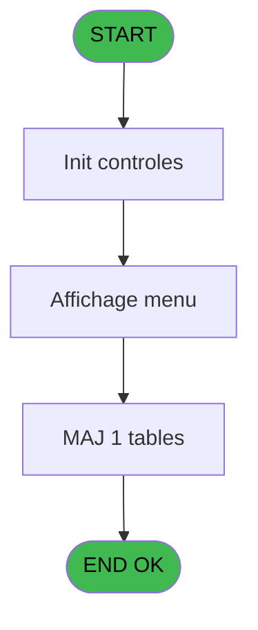
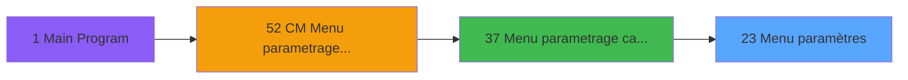
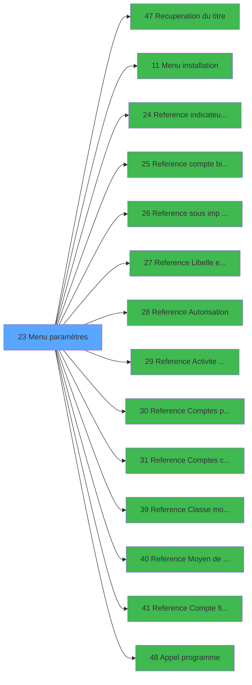

# MAI IDE 23 - Menu paramètres

> **Analyse**: Phases 1-4 2026-02-03 14:49 -> 14:49 (10s) | Assemblage 14:49
> **Pipeline**: V7.2 Enrichi
> **Structure**: 4 onglets (Resume | Ecrans | Donnees | Connexions)

<!-- TAB:Resume -->

## 1. FICHE D'IDENTITE

| Attribut | Valeur |
|----------|--------|
| Projet | MAI |
| IDE Position | 23 |
| Nom Programme | Menu paramètres |
| Fichier source | `Prg_23.xml` |
| Dossier IDE | Caisse |
| Taches | 16 (6 ecrans visibles) |
| Tables modifiees | 1 |
| Programmes appeles | 14 |

## 2. DESCRIPTION FONCTIONNELLE

**Menu paramètres** assure la gestion complete de ce processus, accessible depuis [Menu parametrage caisse (IDE 37)](MAI-IDE-37.md).

Le flux de traitement s'organise en **4 blocs fonctionnels** :

- **Traitement** (8 taches) : traitements metier divers
- **Validation** (4 taches) : controles et verifications de coherence
- **Calcul** (2 taches) : calculs de montants, stocks ou compteurs
- **Consultation** (2 taches) : ecrans de recherche, selection et consultation

**Donnees modifiees** : 1 tables en ecriture (droits_applications).

Detail : phases du traitement

#### Phase 1 : Traitement (8 taches)

- **23** - CV  Menu parametrage cam **[[ECRAN]](#ecran-t1)**
- **23.2** - Identification Club Med Pass **[[ECRAN]](#ecran-t3)**
- **23.2.1** - Abandon
- **23.3.1** - Abandon
- **23.4** - Supp fichiers centralises **[[ECRAN]](#ecran-t9)**
- **23.4.1** - Abandon
- **23.5** - Tables de reference **[[ECRAN]](#ecran-t12)**
- **23.6.1** - Abandon

Delegue a : [Recuperation du titre (IDE 47)](MAI-IDE-47.md), [Menu installation (IDE 11)](MAI-IDE-11.md), [Reference indicateurs/service (IDE 24)](MAI-IDE-24.md), [Reference sous imp par service (IDE 26)](MAI-IDE-26.md), [Reference Libelle ecart (IDE 27)](MAI-IDE-27.md), [Reference Autorisation (IDE 28)](MAI-IDE-28.md), [Reference Activite service (IDE 29)](MAI-IDE-29.md), [Reference Classe monetaire (IDE 39)](MAI-IDE-39.md), [Appel programme (IDE 48)](MAI-IDE-48.md)

#### Phase 2 : Consultation (2 taches)

- **23.1** - Affichage menu **[[ECRAN]](#ecran-t2)**
- **23.5.1** - Choix

Delegue a : [Recuperation du titre (IDE 47)](MAI-IDE-47.md)

#### Phase 3 : Validation (4 taches)

- **23.2.2** - Validation
- **23.3.2** - Validation
- **23.4.2** - Validation
- **23.6.2** - Validation

#### Phase 4 : Calcul (2 taches)

- **23.3** - Comptes des ecarts **[[ECRAN]](#ecran-t6)**
- **23.6** - Comptes bilan **[[ECRAN]](#ecran-t14)**

Delegue a : [Reference compte bilan/service (IDE 25)](MAI-IDE-25.md), [Reference Comptes produit (IDE 30)](MAI-IDE-30.md), [Reference Comptes charge (IDE 31)](MAI-IDE-31.md), [Reference Compte financier (IDE 41)](MAI-IDE-41.md)

#### Tables impactees

| Table | Operations | Role metier |
|-------|-----------|-------------|
| droits_applications | **W** (4 usages) | Droits operateur |

## 3. BLOCS FONCTIONNELS

### 3.1 Traitement (8 taches)

Traitements internes.

---

#### 23 - CV  Menu parametrage cam [[ECRAN]](#ecran-t1)

**Role** : Tache d'orchestration : point d'entree du programme (8 sous-taches). Coordonne l'enchainement des traitements.
**Ecran** : 640 x 9 DLU (MDI) | [Voir mockup](#ecran-t1)

7 sous-taches directes

| Tache | Nom | Bloc |
|-------|-----|------|
| [23.2](#t3) | Identification Club Med Pass **[[ECRAN]](#ecran-t3)** | Traitement |
| [23.2.1](#t4) | Abandon | Traitement |
| [23.3.1](#t7) | Abandon | Traitement |
| [23.4](#t9) | Supp fichiers centralises **[[ECRAN]](#ecran-t9)** | Traitement |
| [23.4.1](#t10) | Abandon | Traitement |
| [23.5](#t12) | Tables de reference **[[ECRAN]](#ecran-t12)** | Traitement |
| [23.6.1](#t15) | Abandon | Traitement |

**Delegue a** : [Recuperation du titre (IDE 47)](MAI-IDE-47.md), [Menu installation (IDE 11)](MAI-IDE-11.md), [Reference indicateurs/service (IDE 24)](MAI-IDE-24.md)

---

#### 23.2 - Identification Club Med Pass [[ECRAN]](#ecran-t3)

**Role** : Traitement : Identification Club Med Pass.
**Ecran** : 642 x 202 DLU (MDI) | [Voir mockup](#ecran-t3)
**Delegue a** : [Recuperation du titre (IDE 47)](MAI-IDE-47.md), [Menu installation (IDE 11)](MAI-IDE-11.md), [Reference indicateurs/service (IDE 24)](MAI-IDE-24.md)

---

#### 23.2.1 - Abandon

**Role** : Traitement : Abandon.
**Delegue a** : [Recuperation du titre (IDE 47)](MAI-IDE-47.md), [Menu installation (IDE 11)](MAI-IDE-11.md), [Reference indicateurs/service (IDE 24)](MAI-IDE-24.md)

---

#### 23.3.1 - Abandon

**Role** : Traitement : Abandon.
**Delegue a** : [Recuperation du titre (IDE 47)](MAI-IDE-47.md), [Menu installation (IDE 11)](MAI-IDE-11.md), [Reference indicateurs/service (IDE 24)](MAI-IDE-24.md)

---

#### 23.4 - Supp fichiers centralises [[ECRAN]](#ecran-t9)

**Role** : Traitement : Supp fichiers centralises.
**Ecran** : 645 x 204 DLU (MDI) | [Voir mockup](#ecran-t9)
**Delegue a** : [Recuperation du titre (IDE 47)](MAI-IDE-47.md), [Menu installation (IDE 11)](MAI-IDE-11.md), [Reference indicateurs/service (IDE 24)](MAI-IDE-24.md)

---

#### 23.4.1 - Abandon

**Role** : Traitement : Abandon.
**Delegue a** : [Recuperation du titre (IDE 47)](MAI-IDE-47.md), [Menu installation (IDE 11)](MAI-IDE-11.md), [Reference indicateurs/service (IDE 24)](MAI-IDE-24.md)

---

#### 23.5 - Tables de reference [[ECRAN]](#ecran-t12)

**Role** : Traitement : Tables de reference.
**Ecran** : 848 x 242 DLU (MDI) | [Voir mockup](#ecran-t12)
**Delegue a** : [Recuperation du titre (IDE 47)](MAI-IDE-47.md), [Menu installation (IDE 11)](MAI-IDE-11.md), [Reference indicateurs/service (IDE 24)](MAI-IDE-24.md)

---

#### 23.6.1 - Abandon

**Role** : Traitement : Abandon.
**Delegue a** : [Recuperation du titre (IDE 47)](MAI-IDE-47.md), [Menu installation (IDE 11)](MAI-IDE-11.md), [Reference indicateurs/service (IDE 24)](MAI-IDE-24.md)

### 3.2 Consultation (2 taches)

Ecrans de recherche et consultation.

---

#### 23.1 - Affichage menu [[ECRAN]](#ecran-t2)

**Role** : Reinitialisation : Affichage menu.
**Ecran** : 850 x 243 DLU (MDI) | [Voir mockup](#ecran-t2)

---

#### 23.5.1 - Choix

**Role** : Selection par l'operateur : Choix.
**Variables liees** : C (W0 choix action)

### 3.3 Validation (4 taches)

Controles de coherence : 4 taches verifient les donnees et conditions.

---

#### 23.2.2 - Validation

**Role** : Verification : Validation.

---

#### 23.3.2 - Validation

**Role** : Verification : Validation.

---

#### 23.4.2 - Validation

**Role** : Verification : Validation.

---

#### 23.6.2 - Validation

**Role** : Verification : Validation.

### 3.4 Calcul (2 taches)

Calculs metier : montants, stocks, compteurs.

---

#### 23.3 - Comptes des ecarts [[ECRAN]](#ecran-t6)

**Role** : Traitement : Comptes des ecarts.
**Ecran** : 643 x 204 DLU (MDI) | [Voir mockup](#ecran-t6)
**Delegue a** : [Reference compte bilan/service (IDE 25)](MAI-IDE-25.md), [Reference Comptes produit (IDE 30)](MAI-IDE-30.md), [Reference Comptes charge (IDE 31)](MAI-IDE-31.md)

---

#### 23.6 - Comptes bilan [[ECRAN]](#ecran-t14)

**Role** : Traitement : Comptes bilan.
**Ecran** : 646 x 204 DLU (MDI) | [Voir mockup](#ecran-t14)
**Delegue a** : [Reference compte bilan/service (IDE 25)](MAI-IDE-25.md), [Reference Comptes produit (IDE 30)](MAI-IDE-30.md), [Reference Comptes charge (IDE 31)](MAI-IDE-31.md)

## 5. REGLES METIER

*(Aucune regle metier identifiee)*

## 6. CONTEXTE

- **Appele par**: [Menu parametrage caisse (IDE 37)](MAI-IDE-37.md)
- **Appelle**: 14 programmes | **Tables**: 1 (W:1 R:0 L:0) | **Taches**: 16 | **Expressions**: 9

<!-- TAB:Ecrans -->

## 8. ECRANS

### 8.1 Forms visibles (6 / 16)

| # | Position | Tache | Nom | Type | Largeur | Hauteur | Bloc |
|---|----------|-------|-----|------|---------|---------|------|
| 1 | 23.1 | 23.1 | Affichage menu | MDI | 850 | 243 | Consultation |
| 2 | 23.2 | 23.2 | Identification Club Med Pass | MDI | 642 | 202 | Traitement |
| 3 | 23.3 | 23.3 | Comptes des ecarts | MDI | 643 | 204 | Calcul |
| 4 | 23.4 | 23.4 | Supp fichiers centralises | MDI | 645 | 204 | Traitement |
| 5 | 23.5 | 23.5 | Tables de reference | MDI | 848 | 242 | Traitement |
| 6 | 23.6 | 23.6 | Comptes bilan | MDI | 646 | 204 | Calcul |

### 8.2 Mockups Ecrans

---

#### 23.1 - Affichage menu
**Tache** : [23.1](#t2) | **Type** : MDI | **Dimensions** : 850 x 243 DLU
**Bloc** : Consultation | **Titre IDE** : Affichage menu

<!-- FORM-DATA:
{
    "width":  850,
    "vFactor":  8,
    "type":  "MDI",
    "hFactor":  8,
    "controls":  [
                     {
                         "x":  0,
                         "type":  "label",
                         "var":  "",
                         "y":  0,
                         "w":  842,
                         "fmt":  "",
                         "name":  "",
                         "h":  18,
                         "color":  "",
                         "text":  "",
                         "parent":  null
                     },
                     {
                         "x":  25,
                         "type":  "label",
                         "var":  "",
                         "y":  33,
                         "w":  791,
                         "fmt":  "",
                         "name":  "",
                         "h":  168,
                         "color":  "",
                         "text":  "",
                         "parent":  null
                     },
                     {
                         "x":  271,
                         "type":  "label",
                         "var":  "",
                         "y":  47,
                         "w":  512,
                         "fmt":  "",
                         "name":  "",
                         "h":  131,
                         "color":  "",
                         "text":  "",
                         "parent":  4
                     },
                     {
                         "x":  274,
                         "type":  "label",
                         "var":  "",
                         "y":  48,
                         "w":  48,
                         "fmt":  "",
                         "name":  "",
                         "h":  129,
                         "color":  "",
                         "text":  "",
                         "parent":  4
                     },
                     {
                         "x":  335,
                         "type":  "label",
                         "var":  "",
                         "y":  52,
                         "w":  421,
                         "fmt":  "",
                         "name":  "",
                         "h":  8,
                         "color":  "7",
                         "text":  "Identification Club Med Pass",
                         "parent":  4
                     },
                     {
                         "x":  335,
                         "type":  "label",
                         "var":  "",
                         "y":  66,
                         "w":  421,
                         "fmt":  "",
                         "name":  "",
                         "h":  8,
                         "color":  "7",
                         "text":  "Tranche des comptes de bilan",
                         "parent":  4
                     },
                     {
                         "x":  335,
                         "type":  "label",
                         "var":  "",
                         "y":  80,
                         "w":  421,
                         "fmt":  "",
                         "name":  "",
                         "h":  8,
                         "color":  "7",
                         "text":  "",
                         "parent":  4
                     },
                     {
                         "x":  335,
                         "type":  "label",
                         "var":  "",
                         "y":  94,
                         "w":  421,
                         "fmt":  "",
                         "name":  "",
                         "h":  8,
                         "color":  "7",
                         "text":  "",
                         "parent":  4
                     },
                     {
                         "x":  335,
                         "type":  "label",
                         "var":  "",
                         "y":  108,
                         "w":  421,
                         "fmt":  "",
                         "name":  "",
                         "h":  8,
                         "color":  "7",
                         "text":  "",
                         "parent":  4
                     },
                     {
                         "x":  335,
                         "type":  "label",
                         "var":  "",
                         "y":  122,
                         "w":  421,
                         "fmt":  "",
                         "name":  "",
                         "h":  8,
                         "color":  "7",
                         "text":  "",
                         "parent":  4
                     },
                     {
                         "x":  335,
                         "type":  "label",
                         "var":  "",
                         "y":  136,
                         "w":  421,
                         "fmt":  "",
                         "name":  "",
                         "h":  8,
                         "color":  "7",
                         "text":  "",
                         "parent":  4
                     },
                     {
                         "x":  335,
                         "type":  "label",
                         "var":  "",
                         "y":  150,
                         "w":  421,
                         "fmt":  "",
                         "name":  "",
                         "h":  8,
                         "color":  "7",
                         "text":  "Installations pendant pilote",
                         "parent":  4
                     },
                     {
                         "x":  335,
                         "type":  "label",
                         "var":  "",
                         "y":  165,
                         "w":  421,
                         "fmt":  "",
                         "name":  "",
                         "h":  8,
                         "color":  "7",
                         "text":  "Tables de reference",
                         "parent":  4
                     },
                     {
                         "x":  441,
                         "type":  "label",
                         "var":  "",
                         "y":  184,
                         "w":  123,
                         "fmt":  "",
                         "name":  "",
                         "h":  10,
                         "color":  "",
                         "text":  "Votre choix",
                         "parent":  4
                     },
                     {
                         "x":  0,
                         "type":  "label",
                         "var":  "",
                         "y":  215,
                         "w":  841,
                         "fmt":  "",
                         "name":  "",
                         "h":  24,
                         "color":  "",
                         "text":  "",
                         "parent":  null
                     },
                     {
                         "x":  575,
                         "type":  "edit",
                         "var":  "",
                         "y":  184,
                         "w":  26,
                         "fmt":  "",
                         "name":  "",
                         "h":  10,
                         "color":  "6",
                         "text":  "",
                         "parent":  4
                     },
                     {
                         "x":  6,
                         "type":  "edit",
                         "var":  "",
                         "y":  4,
                         "w":  267,
                         "fmt":  "20",
                         "name":  "",
                         "h":  8,
                         "color":  "",
                         "text":  "",
                         "parent":  null
                     },
                     {
                         "x":  563,
                         "type":  "edit",
                         "var":  "",
                         "y":  5,
                         "w":  268,
                         "fmt":  "WWW DD MMM YYYYT",
                         "name":  "",
                         "h":  8,
                         "color":  "",
                         "text":  "",
                         "parent":  null
                     },
                     {
                         "x":  65,
                         "type":  "image",
                         "var":  "",
                         "y":  83,
                         "w":  147,
                         "fmt":  "",
                         "name":  "",
                         "h":  62,
                         "color":  "",
                         "text":  "",
                         "parent":  null
                     },
                     {
                         "x":  285,
                         "type":  "button",
                         "var":  "",
                         "y":  51,
                         "w":  26,
                         "fmt":  "1",
                         "name":  "1",
                         "h":  8,
                         "color":  "",
                         "text":  "",
                         "parent":  null
                     },
                     {
                         "x":  285,
                         "type":  "button",
                         "var":  "",
                         "y":  66,
                         "w":  26,
                         "fmt":  "2",
                         "name":  "2",
                         "h":  8,
                         "color":  "",
                         "text":  "",
                         "parent":  null
                     },
                     {
                         "x":  285,
                         "type":  "button",
                         "var":  "",
                         "y":  80,
                         "w":  26,
                         "fmt":  "3",
                         "name":  "3",
                         "h":  8,
                         "color":  "",
                         "text":  "",
                         "parent":  null
                     },
                     {
                         "x":  285,
                         "type":  "button",
                         "var":  "",
                         "y":  94,
                         "w":  26,
                         "fmt":  "4",
                         "name":  "4",
                         "h":  8,
                         "color":  "",
                         "text":  "",
                         "parent":  null
                     },
                     {
                         "x":  285,
                         "type":  "button",
                         "var":  "",
                         "y":  108,
                         "w":  26,
                         "fmt":  "5",
                         "name":  "5",
                         "h":  8,
                         "color":  "",
                         "text":  "",
                         "parent":  null
                     },
                     {
                         "x":  285,
                         "type":  "button",
                         "var":  "",
                         "y":  122,
                         "w":  26,
                         "fmt":  "6",
                         "name":  "6",
                         "h":  8,
                         "color":  "",
                         "text":  "",
                         "parent":  null
                     },
                     {
                         "x":  285,
                         "type":  "button",
                         "var":  "",
                         "y":  136,
                         "w":  26,
                         "fmt":  "7",
                         "name":  "7",
                         "h":  8,
                         "color":  "",
                         "text":  "",
                         "parent":  null
                     },
                     {
                         "x":  285,
                         "type":  "button",
                         "var":  "",
                         "y":  150,
                         "w":  26,
                         "fmt":  "8",
                         "name":  "8",
                         "h":  8,
                         "color":  "",
                         "text":  "",
                         "parent":  null
                     },
                     {
                         "x":  285,
                         "type":  "button",
                         "var":  "",
                         "y":  165,
                         "w":  26,
                         "fmt":  "9",
                         "name":  "9",
                         "h":  8,
                         "color":  "",
                         "text":  "",
                         "parent":  null
                     },
                     {
                         "x":  7,
                         "type":  "button",
                         "var":  "",
                         "y":  218,
                         "w":  168,
                         "fmt":  "\u0026Quitter",
                         "name":  "",
                         "h":  18,
                         "color":  "",
                         "text":  "",
                         "parent":  null
                     }
                 ],
    "taskId":  "23.1",
    "height":  243
}
-->

<strong>Champs : 3 champs</strong>

| Pos (x,y) | Nom | Variable | Type |
|-----------|-----|----------|------|
| 575,184 | (sans nom) | - | edit |
| 6,4 | 20 | - | edit |
| 563,5 | WWW DD MMM YYYYT | - | edit |

<strong>Boutons : 10 boutons</strong>

| Bouton | Pos (x,y) | Action |
|--------|-----------|--------|
| 1 | 285,51 | Bouton fonctionnel |
| 2 | 285,66 | Bouton fonctionnel |
| 3 | 285,80 | Bouton fonctionnel |
| 4 | 285,94 | Bouton fonctionnel |
| 5 | 285,108 | Bouton fonctionnel |
| 6 | 285,122 | Bouton fonctionnel |
| 7 | 285,136 | Bouton fonctionnel |
| 8 | 285,150 | Bouton fonctionnel |
| 9 | 285,165 | Bouton fonctionnel |
| Quitter | 7,218 | Quitte le programme |

---

#### 23.2 - Identification Club Med Pass
**Tache** : [23.2](#t3) | **Type** : MDI | **Dimensions** : 642 x 202 DLU
**Bloc** : Traitement | **Titre IDE** : Identification Club Med Pass

<!-- FORM-DATA:
{
    "width":  642,
    "vFactor":  8,
    "type":  "MDI",
    "hFactor":  8,
    "controls":  [
                     {
                         "x":  0,
                         "type":  "label",
                         "var":  "",
                         "y":  0,
                         "w":  639,
                         "fmt":  "",
                         "name":  "",
                         "h":  18,
                         "color":  "",
                         "text":  "",
                         "parent":  null
                     },
                     {
                         "x":  230,
                         "type":  "label",
                         "var":  "",
                         "y":  78,
                         "w":  349,
                         "fmt":  "",
                         "name":  "",
                         "h":  49,
                         "color":  "",
                         "text":  "",
                         "parent":  null
                     },
                     {
                         "x":  259,
                         "type":  "label",
                         "var":  "",
                         "y":  86,
                         "w":  229,
                         "fmt":  "",
                         "name":  "",
                         "h":  10,
                         "color":  "",
                         "text":  "MOP Club Med Pass",
                         "parent":  null
                     },
                     {
                         "x":  259,
                         "type":  "label",
                         "var":  "",
                         "y":  105,
                         "w":  229,
                         "fmt":  "",
                         "name":  "",
                         "h":  10,
                         "color":  "",
                         "text":  "Classe Club Med Pass",
                         "parent":  null
                     },
                     {
                         "x":  0,
                         "type":  "label",
                         "var":  "",
                         "y":  176,
                         "w":  639,
                         "fmt":  "",
                         "name":  "",
                         "h":  24,
                         "color":  "",
                         "text":  "",
                         "parent":  null
                     },
                     {
                         "x":  499,
                         "type":  "edit",
                         "var":  "",
                         "y":  86,
                         "w":  48,
                         "fmt":  "",
                         "name":  "",
                         "h":  10,
                         "color":  "6",
                         "text":  "",
                         "parent":  null
                     },
                     {
                         "x":  499,
                         "type":  "edit",
                         "var":  "",
                         "y":  105,
                         "w":  48,
                         "fmt":  "",
                         "name":  "",
                         "h":  10,
                         "color":  "6",
                         "text":  "",
                         "parent":  null
                     },
                     {
                         "x":  374,
                         "type":  "edit",
                         "var":  "",
                         "y":  5,
                         "w":  256,
                         "fmt":  "WWW DD MMM YYYYT",
                         "name":  "",
                         "h":  8,
                         "color":  "",
                         "text":  "",
                         "parent":  null
                     },
                     {
                         "x":  18,
                         "type":  "image",
                         "var":  "",
                         "y":  69,
                         "w":  147,
                         "fmt":  "",
                         "name":  "",
                         "h":  62,
                         "color":  "",
                         "text":  "",
                         "parent":  null
                     },
                     {
                         "x":  6,
                         "type":  "button",
                         "var":  "",
                         "y":  179,
                         "w":  168,
                         "fmt":  "\u0026Abandon",
                         "name":  "",
                         "h":  18,
                         "color":  "",
                         "text":  "",
                         "parent":  null
                     },
                     {
                         "x":  462,
                         "type":  "button",
                         "var":  "",
                         "y":  179,
                         "w":  168,
                         "fmt":  "\u0026Validation",
                         "name":  "",
                         "h":  18,
                         "color":  "",
                         "text":  "",
                         "parent":  null
                     },
                     {
                         "x":  6,
                         "type":  "edit",
                         "var":  "",
                         "y":  4,
                         "w":  256,
                         "fmt":  "30",
                         "name":  "",
                         "h":  8,
                         "color":  "",
                         "text":  "",
                         "parent":  null
                     }
                 ],
    "taskId":  "23.2",
    "height":  202
}
-->

<strong>Champs : 4 champs</strong>

| Pos (x,y) | Nom | Variable | Type |
|-----------|-----|----------|------|
| 499,86 | (sans nom) | - | edit |
| 499,105 | (sans nom) | - | edit |
| 374,5 | WWW DD MMM YYYYT | - | edit |
| 6,4 | 30 | - | edit |

<strong>Boutons : 2 boutons</strong>

| Bouton | Pos (x,y) | Action |
|--------|-----------|--------|
| Abandon | 6,179 | Annule et retour au menu |
| Validation | 462,179 | Valide la saisie et enregistre |

---

#### 23.3 - Comptes des ecarts
**Tache** : [23.3](#t6) | **Type** : MDI | **Dimensions** : 643 x 204 DLU
**Bloc** : Calcul | **Titre IDE** : Comptes des ecarts

<!-- FORM-DATA:
{
    "width":  643,
    "vFactor":  8,
    "type":  "MDI",
    "hFactor":  8,
    "controls":  [
                     {
                         "x":  0,
                         "type":  "label",
                         "var":  "",
                         "y":  0,
                         "w":  639,
                         "fmt":  "",
                         "name":  "",
                         "h":  18,
                         "color":  "",
                         "text":  "",
                         "parent":  null
                     },
                     {
                         "x":  230,
                         "type":  "label",
                         "var":  "",
                         "y":  78,
                         "w":  349,
                         "fmt":  "",
                         "name":  "",
                         "h":  49,
                         "color":  "",
                         "text":  "",
                         "parent":  null
                     },
                     {
                         "x":  259,
                         "type":  "label",
                         "var":  "",
                         "y":  86,
                         "w":  138,
                         "fmt":  "",
                         "name":  "",
                         "h":  10,
                         "color":  "",
                         "text":  "Compte gain",
                         "parent":  null
                     },
                     {
                         "x":  259,
                         "type":  "label",
                         "var":  "",
                         "y":  105,
                         "w":  138,
                         "fmt":  "",
                         "name":  "",
                         "h":  10,
                         "color":  "",
                         "text":  "Compte perte",
                         "parent":  null
                     },
                     {
                         "x":  0,
                         "type":  "label",
                         "var":  "",
                         "y":  176,
                         "w":  639,
                         "fmt":  "",
                         "name":  "",
                         "h":  24,
                         "color":  "",
                         "text":  "",
                         "parent":  null
                     },
                     {
                         "x":  412,
                         "type":  "edit",
                         "var":  "",
                         "y":  86,
                         "w":  135,
                         "fmt":  "### ### ###",
                         "name":  "",
                         "h":  10,
                         "color":  "6",
                         "text":  "",
                         "parent":  null
                     },
                     {
                         "x":  412,
                         "type":  "edit",
                         "var":  "",
                         "y":  105,
                         "w":  135,
                         "fmt":  "### ### ###",
                         "name":  "",
                         "h":  10,
                         "color":  "6",
                         "text":  "",
                         "parent":  null
                     },
                     {
                         "x":  374,
                         "type":  "edit",
                         "var":  "",
                         "y":  5,
                         "w":  256,
                         "fmt":  "WWW DD MMM YYYYT",
                         "name":  "",
                         "h":  8,
                         "color":  "",
                         "text":  "",
                         "parent":  null
                     },
                     {
                         "x":  18,
                         "type":  "image",
                         "var":  "",
                         "y":  69,
                         "w":  147,
                         "fmt":  "",
                         "name":  "",
                         "h":  62,
                         "color":  "",
                         "text":  "",
                         "parent":  null
                     },
                     {
                         "x":  6,
                         "type":  "button",
                         "var":  "",
                         "y":  179,
                         "w":  168,
                         "fmt":  "\u0026Abandon",
                         "name":  "",
                         "h":  18,
                         "color":  "",
                         "text":  "",
                         "parent":  null
                     },
                     {
                         "x":  462,
                         "type":  "button",
                         "var":  "",
                         "y":  179,
                         "w":  168,
                         "fmt":  "\u0026Validation",
                         "name":  "",
                         "h":  18,
                         "color":  "",
                         "text":  "",
                         "parent":  null
                     },
                     {
                         "x":  6,
                         "type":  "edit",
                         "var":  "",
                         "y":  4,
                         "w":  256,
                         "fmt":  "30",
                         "name":  "",
                         "h":  8,
                         "color":  "",
                         "text":  "",
                         "parent":  null
                     }
                 ],
    "taskId":  "23.3",
    "height":  204
}
-->

<strong>Champs : 4 champs</strong>

| Pos (x,y) | Nom | Variable | Type |
|-----------|-----|----------|------|
| 412,86 | ### ### ### | - | edit |
| 412,105 | ### ### ### | - | edit |
| 374,5 | WWW DD MMM YYYYT | - | edit |
| 6,4 | 30 | - | edit |

<strong>Boutons : 2 boutons</strong>

| Bouton | Pos (x,y) | Action |
|--------|-----------|--------|
| Abandon | 6,179 | Annule et retour au menu |
| Validation | 462,179 | Valide la saisie et enregistre |

---

#### 23.4 - Supp fichiers centralises
**Tache** : [23.4](#t9) | **Type** : MDI | **Dimensions** : 645 x 204 DLU
**Bloc** : Traitement | **Titre IDE** : Supp fichiers centralises

<!-- FORM-DATA:
{
    "width":  645,
    "vFactor":  8,
    "type":  "MDI",
    "hFactor":  8,
    "controls":  [
                     {
                         "x":  0,
                         "type":  "label",
                         "var":  "",
                         "y":  0,
                         "w":  639,
                         "fmt":  "",
                         "name":  "",
                         "h":  18,
                         "color":  "",
                         "text":  "",
                         "parent":  null
                     },
                     {
                         "x":  198,
                         "type":  "label",
                         "var":  "",
                         "y":  50,
                         "w":  410,
                         "fmt":  "",
                         "name":  "",
                         "h":  12,
                         "color":  "142",
                         "text":  "Suppression fichiers centralises",
                         "parent":  null
                     },
                     {
                         "x":  198,
                         "type":  "label",
                         "var":  "",
                         "y":  69,
                         "w":  410,
                         "fmt":  "",
                         "name":  "",
                         "h":  62,
                         "color":  "",
                         "text":  "",
                         "parent":  null
                     },
                     {
                         "x":  198,
                         "type":  "label",
                         "var":  "",
                         "y":  136,
                         "w":  410,
                         "fmt":  "",
                         "name":  "",
                         "h":  31,
                         "color":  "143",
                         "text":  "Attention : en cas de suppression, les comptes financiers et les moyens de paiement doivent être regeneres",
                         "parent":  null
                     },
                     {
                         "x":  0,
                         "type":  "label",
                         "var":  "",
                         "y":  176,
                         "w":  639,
                         "fmt":  "",
                         "name":  "",
                         "h":  24,
                         "color":  "",
                         "text":  "",
                         "parent":  null
                     },
                     {
                         "x":  224,
                         "type":  "checkbox",
                         "var":  "",
                         "y":  80,
                         "w":  363,
                         "fmt":  "",
                         "name":  "",
                         "h":  12,
                         "color":  "",
                         "text":  " Fichier comptes financiers centralise",
                         "parent":  null
                     },
                     {
                         "x":  224,
                         "type":  "checkbox",
                         "var":  "",
                         "y":  107,
                         "w":  363,
                         "fmt":  "",
                         "name":  "",
                         "h":  12,
                         "color":  "",
                         "text":  " Fichier Moyens de paiement centralise",
                         "parent":  null
                     },
                     {
                         "x":  374,
                         "type":  "edit",
                         "var":  "",
                         "y":  5,
                         "w":  256,
                         "fmt":  "WWW DD MMM YYYYT",
                         "name":  "",
                         "h":  8,
                         "color":  "",
                         "text":  "",
                         "parent":  null
                     },
                     {
                         "x":  18,
                         "type":  "image",
                         "var":  "",
                         "y":  69,
                         "w":  147,
                         "fmt":  "",
                         "name":  "",
                         "h":  62,
                         "color":  "",
                         "text":  "",
                         "parent":  null
                     },
                     {
                         "x":  6,
                         "type":  "button",
                         "var":  "",
                         "y":  179,
                         "w":  168,
                         "fmt":  "\u0026Abandon",
                         "name":  "",
                         "h":  18,
                         "color":  "",
                         "text":  "",
                         "parent":  null
                     },
                     {
                         "x":  462,
                         "type":  "button",
                         "var":  "",
                         "y":  179,
                         "w":  168,
                         "fmt":  "\u0026Validation",
                         "name":  "",
                         "h":  18,
                         "color":  "",
                         "text":  "",
                         "parent":  null
                     },
                     {
                         "x":  6,
                         "type":  "edit",
                         "var":  "",
                         "y":  4,
                         "w":  256,
                         "fmt":  "30",
                         "name":  "",
                         "h":  8,
                         "color":  "",
                         "text":  "",
                         "parent":  null
                     }
                 ],
    "taskId":  "23.4",
    "height":  204
}
-->

<strong>Champs : 4 champs</strong>

| Pos (x,y) | Nom | Variable | Type |
|-----------|-----|----------|------|
| 224,80 |  Fichier comptes financiers centralise | - | checkbox |
| 224,107 |  Fichier Moyens de paiement centralise | - | checkbox |
| 374,5 | WWW DD MMM YYYYT | - | edit |
| 6,4 | 30 | - | edit |

<strong>Boutons : 2 boutons</strong>

| Bouton | Pos (x,y) | Action |
|--------|-----------|--------|
| Abandon | 6,179 | Annule et retour au menu |
| Validation | 462,179 | Valide la saisie et enregistre |

---

#### 23.5 - Tables de reference
**Tache** : [23.5](#t12) | **Type** : MDI | **Dimensions** : 848 x 242 DLU
**Bloc** : Traitement | **Titre IDE** : Tables de reference

<!-- FORM-DATA:
{
    "width":  848,
    "vFactor":  8,
    "type":  "MDI",
    "hFactor":  8,
    "controls":  [
                     {
                         "x":  0,
                         "type":  "label",
                         "var":  "",
                         "y":  0,
                         "w":  842,
                         "fmt":  "",
                         "name":  "",
                         "h":  18,
                         "color":  "",
                         "text":  "",
                         "parent":  null
                     },
                     {
                         "x":  17,
                         "type":  "label",
                         "var":  "",
                         "y":  25,
                         "w":  60,
                         "fmt":  "",
                         "name":  "",
                         "h":  184,
                         "color":  "",
                         "text":  "",
                         "parent":  null
                     },
                     {
                         "x":  271,
                         "type":  "label",
                         "var":  "",
                         "y":  33,
                         "w":  512,
                         "fmt":  "",
                         "name":  "",
                         "h":  149,
                         "color":  "",
                         "text":  "",
                         "parent":  null
                     },
                     {
                         "x":  274,
                         "type":  "label",
                         "var":  "",
                         "y":  34,
                         "w":  48,
                         "fmt":  "",
                         "name":  "",
                         "h":  149,
                         "color":  "",
                         "text":  "",
                         "parent":  null
                     },
                     {
                         "x":  335,
                         "type":  "label",
                         "var":  "",
                         "y":  38,
                         "w":  421,
                         "fmt":  "",
                         "name":  "",
                         "h":  8,
                         "color":  "7",
                         "text":  "Activites / Services",
                         "parent":  null
                     },
                     {
                         "x":  335,
                         "type":  "label",
                         "var":  "",
                         "y":  50,
                         "w":  421,
                         "fmt":  "",
                         "name":  "",
                         "h":  8,
                         "color":  "7",
                         "text":  "Classes monetaires",
                         "parent":  null
                     },
                     {
                         "x":  335,
                         "type":  "label",
                         "var":  "",
                         "y":  62,
                         "w":  421,
                         "fmt":  "",
                         "name":  "",
                         "h":  8,
                         "color":  "7",
                         "text":  "Comptes financiers",
                         "parent":  null
                     },
                     {
                         "x":  335,
                         "type":  "label",
                         "var":  "",
                         "y":  74,
                         "w":  421,
                         "fmt":  "",
                         "name":  "",
                         "h":  8,
                         "color":  "7",
                         "text":  "Moyens de paiement",
                         "parent":  null
                     },
                     {
                         "x":  335,
                         "type":  "label",
                         "var":  "",
                         "y":  86,
                         "w":  421,
                         "fmt":  "",
                         "name":  "",
                         "h":  8,
                         "color":  "7",
                         "text":  "Comptes de charge",
                         "parent":  null
                     },
                     {
                         "x":  335,
                         "type":  "label",
                         "var":  "",
                         "y":  98,
                         "w":  421,
                         "fmt":  "",
                         "name":  "",
                         "h":  8,
                         "color":  "7",
                         "text":  "Comptes de produit",
                         "parent":  null
                     },
                     {
                         "x":  335,
                         "type":  "label",
                         "var":  "",
                         "y":  110,
                         "w":  421,
                         "fmt":  "",
                         "name":  "",
                         "h":  8,
                         "color":  "7",
                         "text":  "Autorisations",
                         "parent":  null
                     },
                     {
                         "x":  335,
                         "type":  "label",
                         "var":  "",
                         "y":  122,
                         "w":  421,
                         "fmt":  "",
                         "name":  "",
                         "h":  8,
                         "color":  "7",
                         "text":  "Libelles des ecarts",
                         "parent":  null
                     },
                     {
                         "x":  335,
                         "type":  "label",
                         "var":  "",
                         "y":  134,
                         "w":  421,
                         "fmt":  "",
                         "name":  "",
                         "h":  8,
                         "color":  "7",
                         "text":  "Sous imputations par service",
                         "parent":  null
                     },
                     {
                         "x":  335,
                         "type":  "label",
                         "var":  "",
                         "y":  146,
                         "w":  421,
                         "fmt":  "",
                         "name":  "",
                         "h":  8,
                         "color":  "7",
                         "text":  "Comptes de bilan par service",
                         "parent":  null
                     },
                     {
                         "x":  335,
                         "type":  "label",
                         "var":  "",
                         "y":  158,
                         "w":  421,
                         "fmt":  "",
                         "name":  "",
                         "h":  8,
                         "color":  "7",
                         "text":  "Indicateurs charge et bilan par service",
                         "parent":  null
                     },
                     {
                         "x":  335,
                         "type":  "label",
                         "var":  "",
                         "y":  170,
                         "w":  421,
                         "fmt":  "",
                         "name":  "",
                         "h":  8,
                         "color":  "7",
                         "text":  "",
                         "parent":  null
                     },
                     {
                         "x":  441,
                         "type":  "label",
                         "var":  "",
                         "y":  196,
                         "w":  123,
                         "fmt":  "",
                         "name":  "",
                         "h":  10,
                         "color":  "",
                         "text":  "Votre choix",
                         "parent":  null
                     },
                     {
                         "x":  0,
                         "type":  "label",
                         "var":  "",
                         "y":  215,
                         "w":  841,
                         "fmt":  "",
                         "name":  "",
                         "h":  24,
                         "color":  "",
                         "text":  "",
                         "parent":  null
                     },
                     {
                         "x":  575,
                         "type":  "edit",
                         "var":  "",
                         "y":  196,
                         "w":  26,
                         "fmt":  "",
                         "name":  "CHOIX",
                         "h":  10,
                         "color":  "6",
                         "text":  "",
                         "parent":  null
                     },
                     {
                         "x":  6,
                         "type":  "edit",
                         "var":  "",
                         "y":  4,
                         "w":  267,
                         "fmt":  "20",
                         "name":  "",
                         "h":  8,
                         "color":  "",
                         "text":  "",
                         "parent":  null
                     },
                     {
                         "x":  563,
                         "type":  "edit",
                         "var":  "",
                         "y":  5,
                         "w":  268,
                         "fmt":  "WWW DD MMM YYYYT",
                         "name":  "",
                         "h":  8,
                         "color":  "",
                         "text":  "",
                         "parent":  null
                     },
                     {
                         "x":  65,
                         "type":  "image",
                         "var":  "",
                         "y":  83,
                         "w":  147,
                         "fmt":  "",
                         "name":  "",
                         "h":  62,
                         "color":  "",
                         "text":  "",
                         "parent":  null
                     },
                     {
                         "x":  285,
                         "type":  "button",
                         "var":  "",
                         "y":  37,
                         "w":  26,
                         "fmt":  "A",
                         "name":  "A",
                         "h":  8,
                         "color":  "",
                         "text":  "",
                         "parent":  null
                     },
                     {
                         "x":  285,
                         "type":  "button",
                         "var":  "",
                         "y":  49,
                         "w":  26,
                         "fmt":  "B",
                         "name":  "B",
                         "h":  8,
                         "color":  "",
                         "text":  "",
                         "parent":  null
                     },
                     {
                         "x":  285,
                         "type":  "button",
                         "var":  "",
                         "y":  61,
                         "w":  26,
                         "fmt":  "C",
                         "name":  "C",
                         "h":  8,
                         "color":  "",
                         "text":  "",
                         "parent":  null
                     },
                     {
                         "x":  285,
                         "type":  "button",
                         "var":  "",
                         "y":  73,
                         "w":  26,
                         "fmt":  "D",
                         "name":  "D",
                         "h":  8,
                         "color":  "",
                         "text":  "",
                         "parent":  null
                     },
                     {
                         "x":  285,
                         "type":  "button",
                         "var":  "",
                         "y":  85,
                         "w":  26,
                         "fmt":  "E",
                         "name":  "E",
                         "h":  8,
                         "color":  "",
                         "text":  "",
                         "parent":  null
                     },
                     {
                         "x":  285,
                         "type":  "button",
                         "var":  "",
                         "y":  97,
                         "w":  26,
                         "fmt":  "F",
                         "name":  "F",
                         "h":  8,
                         "color":  "",
                         "text":  "",
                         "parent":  null
                     },
                     {
                         "x":  285,
                         "type":  "button",
                         "var":  "",
                         "y":  109,
                         "w":  26,
                         "fmt":  "G",
                         "name":  "G",
                         "h":  8,
                         "color":  "",
                         "text":  "",
                         "parent":  null
                     },
                     {
                         "x":  285,
                         "type":  "button",
                         "var":  "",
                         "y":  121,
                         "w":  26,
                         "fmt":  "H",
                         "name":  "H",
                         "h":  8,
                         "color":  "",
                         "text":  "",
                         "parent":  null
                     },
                     {
                         "x":  285,
                         "type":  "button",
                         "var":  "",
                         "y":  133,
                         "w":  26,
                         "fmt":  "I",
                         "name":  "I",
                         "h":  8,
                         "color":  "",
                         "text":  "",
                         "parent":  null
                     },
                     {
                         "x":  285,
                         "type":  "button",
                         "var":  "",
                         "y":  145,
                         "w":  26,
                         "fmt":  "J",
                         "name":  "J",
                         "h":  8,
                         "color":  "",
                         "text":  "",
                         "parent":  null
                     },
                     {
                         "x":  285,
                         "type":  "button",
                         "var":  "",
                         "y":  157,
                         "w":  26,
                         "fmt":  "K",
                         "name":  "K",
                         "h":  8,
                         "color":  "",
                         "text":  "",
                         "parent":  null
                     },
                     {
                         "x":  285,
                         "type":  "button",
                         "var":  "",
                         "y":  169,
                         "w":  26,
                         "fmt":  "L",
                         "name":  "L",
                         "h":  8,
                         "color":  "",
                         "text":  "",
                         "parent":  null
                     },
                     {
                         "x":  7,
                         "type":  "button",
                         "var":  "",
                         "y":  218,
                         "w":  168,
                         "fmt":  "\u0026Quitter",
                         "name":  "",
                         "h":  18,
                         "color":  "",
                         "text":  "",
                         "parent":  null
                     }
                 ],
    "taskId":  "23.5",
    "height":  242
}
-->

<strong>Champs : 3 champs</strong>

| Pos (x,y) | Nom | Variable | Type |
|-----------|-----|----------|------|
| 575,196 | CHOIX | - | edit |
| 6,4 | 20 | - | edit |
| 563,5 | WWW DD MMM YYYYT | - | edit |

<strong>Boutons : 13 boutons</strong>

| Bouton | Pos (x,y) | Action |
|--------|-----------|--------|
| A | 285,37 | Bouton fonctionnel |
| B | 285,49 | Bouton fonctionnel |
| C | 285,61 | Bouton fonctionnel |
| D | 285,73 | Bouton fonctionnel |
| E | 285,85 | Bouton fonctionnel |
| F | 285,97 | Bouton fonctionnel |
| G | 285,109 | Bouton fonctionnel |
| H | 285,121 | Bouton fonctionnel |
| I | 285,133 | Bouton fonctionnel |
| J | 285,145 | Bouton fonctionnel |
| K | 285,157 | Bouton fonctionnel |
| L | 285,169 | Bouton fonctionnel |
| Quitter | 7,218 | Quitte le programme |

---

#### 23.6 - Comptes bilan
**Tache** : [23.6](#t14) | **Type** : MDI | **Dimensions** : 646 x 204 DLU
**Bloc** : Calcul | **Titre IDE** : Comptes bilan

<!-- FORM-DATA:
{
    "width":  646,
    "vFactor":  8,
    "type":  "MDI",
    "hFactor":  8,
    "controls":  [
                     {
                         "x":  0,
                         "type":  "label",
                         "var":  "",
                         "y":  0,
                         "w":  639,
                         "fmt":  "",
                         "name":  "",
                         "h":  18,
                         "color":  "",
                         "text":  "",
                         "parent":  null
                     },
                     {
                         "x":  230,
                         "type":  "label",
                         "var":  "",
                         "y":  30,
                         "w":  349,
                         "fmt":  "",
                         "name":  "",
                         "h":  34,
                         "color":  "7",
                         "text":  "Tranche des comptes de bilan à generer dans la table des comptes de recette PMS, pour les services qualifies avec l\u0027indicateur BILAN",
                         "parent":  null
                     },
                     {
                         "x":  230,
                         "type":  "label",
                         "var":  "",
                         "y":  78,
                         "w":  349,
                         "fmt":  "",
                         "name":  "",
                         "h":  49,
                         "color":  "",
                         "text":  "",
                         "parent":  null
                     },
                     {
                         "x":  241,
                         "type":  "label",
                         "var":  "",
                         "y":  86,
                         "w":  175,
                         "fmt":  "",
                         "name":  "",
                         "h":  10,
                         "color":  "",
                         "text":  "Compte bilan mini",
                         "parent":  null
                     },
                     {
                         "x":  241,
                         "type":  "label",
                         "var":  "",
                         "y":  105,
                         "w":  175,
                         "fmt":  "",
                         "name":  "",
                         "h":  10,
                         "color":  "",
                         "text":  "Compte bilan maxi",
                         "parent":  null
                     },
                     {
                         "x":  0,
                         "type":  "label",
                         "var":  "",
                         "y":  176,
                         "w":  639,
                         "fmt":  "",
                         "name":  "",
                         "h":  24,
                         "color":  "",
                         "text":  "",
                         "parent":  null
                     },
                     {
                         "x":  425,
                         "type":  "edit",
                         "var":  "",
                         "y":  86,
                         "w":  144,
                         "fmt":  "### ### ###",
                         "name":  "",
                         "h":  10,
                         "color":  "6",
                         "text":  "",
                         "parent":  null
                     },
                     {
                         "x":  425,
                         "type":  "edit",
                         "var":  "",
                         "y":  105,
                         "w":  144,
                         "fmt":  "### ### ###",
                         "name":  "",
                         "h":  10,
                         "color":  "6",
                         "text":  "",
                         "parent":  null
                     },
                     {
                         "x":  374,
                         "type":  "edit",
                         "var":  "",
                         "y":  5,
                         "w":  256,
                         "fmt":  "WWW DD MMM YYYYT",
                         "name":  "",
                         "h":  8,
                         "color":  "",
                         "text":  "",
                         "parent":  null
                     },
                     {
                         "x":  18,
                         "type":  "image",
                         "var":  "",
                         "y":  69,
                         "w":  147,
                         "fmt":  "",
                         "name":  "",
                         "h":  62,
                         "color":  "",
                         "text":  "",
                         "parent":  null
                     },
                     {
                         "x":  6,
                         "type":  "button",
                         "var":  "",
                         "y":  179,
                         "w":  168,
                         "fmt":  "\u0026Abandon",
                         "name":  "",
                         "h":  18,
                         "color":  "",
                         "text":  "",
                         "parent":  null
                     },
                     {
                         "x":  462,
                         "type":  "button",
                         "var":  "",
                         "y":  179,
                         "w":  168,
                         "fmt":  "\u0026Validation",
                         "name":  "",
                         "h":  18,
                         "color":  "",
                         "text":  "",
                         "parent":  null
                     },
                     {
                         "x":  6,
                         "type":  "edit",
                         "var":  "",
                         "y":  4,
                         "w":  256,
                         "fmt":  "30",
                         "name":  "",
                         "h":  8,
                         "color":  "",
                         "text":  "",
                         "parent":  null
                     }
                 ],
    "taskId":  "23.6",
    "height":  204
}
-->

<strong>Champs : 4 champs</strong>

| Pos (x,y) | Nom | Variable | Type |
|-----------|-----|----------|------|
| 425,86 | ### ### ### | - | edit |
| 425,105 | ### ### ### | - | edit |
| 374,5 | WWW DD MMM YYYYT | - | edit |
| 6,4 | 30 | - | edit |

<strong>Boutons : 2 boutons</strong>

| Bouton | Pos (x,y) | Action |
|--------|-----------|--------|
| Abandon | 6,179 | Annule et retour au menu |
| Validation | 462,179 | Valide la saisie et enregistre |

## 9. NAVIGATION

### 9.1 Enchainement des ecrans

```mermaid
flowchart TD
    START([Entree])
    style START fill:#3fb950
    VF2[23.1 Affichage menu]
    style VF2 fill:#58a6ff
    VF3[23.2 Identification Club...]
    style VF3 fill:#58a6ff
    VF6[23.3 Comptes des ecarts]
    style VF6 fill:#58a6ff
    VF9[23.4 Supp fichiers centr...]
    style VF9 fill:#58a6ff
    VF12[23.5 Tables de reference]
    style VF12 fill:#58a6ff
    VF14[23.6 Comptes bilan]
    style VF14 fill:#58a6ff
    EXT47[IDE 47 Recuperation du...]
    style EXT47 fill:#3fb950
    EXT11[IDE 11 Menu installation]
    style EXT11 fill:#3fb950
    EXT24[IDE 24 Reference indic...]
    style EXT24 fill:#3fb950
    EXT25[IDE 25 Reference compt...]
    style EXT25 fill:#3fb950
    EXT26[IDE 26 Reference sous ...]
    style EXT26 fill:#3fb950
    EXT27[IDE 27 Reference Libel...]
    style EXT27 fill:#3fb950
    EXT28[IDE 28 Reference Autor...]
    style EXT28 fill:#3fb950
    EXT29[IDE 29 Reference Activ...]
    style EXT29 fill:#3fb950
    EXT30[IDE 30 Reference Compt...]
    style EXT30 fill:#3fb950
    EXT31[IDE 31 Reference Compt...]
    style EXT31 fill:#3fb950
    EXT39[IDE 39 Reference Class...]
    style EXT39 fill:#3fb950
    EXT40[IDE 40 Reference Moyen...]
    style EXT40 fill:#3fb950
    EXT41[IDE 41 Reference Compt...]
    style EXT41 fill:#3fb950
    EXT48[IDE 48 Appel programme]
    style EXT48 fill:#3fb950
    FIN([Sortie])
    style FIN fill:#f85149
    START --> VF2
    VF2 -->|Recuperation donnees| EXT47
    VF2 -->|Navigation menu| EXT11
    VF2 -->|Sous-programme| EXT24
    VF2 -->|Sous-programme| EXT25
    VF2 -->|Sous-programme| EXT26
    VF2 -->|Sous-programme| EXT27
    VF2 -->|Sous-programme| EXT28
    VF2 -->|Sous-programme| EXT29
    EXT48 --> FIN
```

**Detail par enchainement :**

| Depuis | Action | Vers | Retour |
|--------|--------|------|--------|
| Affichage menu | Recuperation donnees | [Recuperation du titre (IDE 47)](MAI-IDE-47.md) | Retour ecran |
| Affichage menu | Navigation menu | [Menu installation (IDE 11)](MAI-IDE-11.md) | Retour ecran |
| Affichage menu | Sous-programme | [Reference indicateurs/service (IDE 24)](MAI-IDE-24.md) | Retour ecran |
| Affichage menu | Sous-programme | [Reference compte bilan/service (IDE 25)](MAI-IDE-25.md) | Retour ecran |
| Affichage menu | Sous-programme | [Reference sous imp par service (IDE 26)](MAI-IDE-26.md) | Retour ecran |
| Affichage menu | Sous-programme | [Reference Libelle ecart (IDE 27)](MAI-IDE-27.md) | Retour ecran |
| Affichage menu | Sous-programme | [Reference Autorisation (IDE 28)](MAI-IDE-28.md) | Retour ecran |
| Affichage menu | Sous-programme | [Reference Activite service (IDE 29)](MAI-IDE-29.md) | Retour ecran |
| Affichage menu | Sous-programme | [Reference Comptes produit (IDE 30)](MAI-IDE-30.md) | Retour ecran |
| Affichage menu | Sous-programme | [Reference Comptes charge (IDE 31)](MAI-IDE-31.md) | Retour ecran |
| Affichage menu | Sous-programme | [Reference Classe monetaire (IDE 39)](MAI-IDE-39.md) | Retour ecran |
| Affichage menu | Sous-programme | [Reference Moyen de paiement (IDE 40)](MAI-IDE-40.md) | Retour ecran |
| Affichage menu | Sous-programme | [Reference Compte financier (IDE 41)](MAI-IDE-41.md) | Retour ecran |
| Affichage menu | Sous-programme | [Appel programme (IDE 48)](MAI-IDE-48.md) | Retour ecran |

### 9.3 Structure hierarchique (16 taches)

| Position | Tache | Type | Dimensions | Bloc |
|----------|-------|------|------------|------|
| **23.1** | [**CV  Menu parametrage cam** (23)](#t1) [mockup](#ecran-t1) | MDI | 640x9 | Traitement |
| 23.1.1 | [Identification Club Med Pass (23.2)](#t3) [mockup](#ecran-t3) | MDI | 642x202 | |
| 23.1.2 | [Abandon (23.2.1)](#t4) | MDI | - | |
| 23.1.3 | [Abandon (23.3.1)](#t7) | MDI | - | |
| 23.1.4 | [Supp fichiers centralises (23.4)](#t9) [mockup](#ecran-t9) | MDI | 645x204 | |
| 23.1.5 | [Abandon (23.4.1)](#t10) | MDI | - | |
| 23.1.6 | [Tables de reference (23.5)](#t12) [mockup](#ecran-t12) | MDI | 848x242 | |
| 23.1.7 | [Abandon (23.6.1)](#t15) | MDI | - | |
| **23.2** | [**Affichage menu** (23.1)](#t2) [mockup](#ecran-t2) | MDI | 850x243 | Consultation |
| 23.2.1 | [Choix (23.5.1)](#t13) | MDI | - | |
| **23.3** | [**Validation** (23.2.2)](#t5) | MDI | - | Validation |
| 23.3.1 | [Validation (23.3.2)](#t8) | MDI | - | |
| 23.3.2 | [Validation (23.4.2)](#t11) | MDI | - | |
| 23.3.3 | [Validation (23.6.2)](#t16) | MDI | - | |
| **23.4** | [**Comptes des ecarts** (23.3)](#t6) [mockup](#ecran-t6) | MDI | 643x204 | Calcul |
| 23.4.1 | [Comptes bilan (23.6)](#t14) [mockup](#ecran-t14) | MDI | 646x204 | |

### 9.4 Algorigramme

> **Legende**: Vert = START/END OK | Rouge = END KO | Bleu = Decisions
> *Algorigramme auto-genere. Utiliser `/algorigramme` pour une synthese metier detaillee.*

<!-- TAB:Donnees -->

## 10. TABLES

### Tables utilisees (1)

| ID | Nom | Description | Type | R | W | L | Usages |
|----|-----|-------------|------|---|---|---|--------|
| 697 | droits_applications | Droits operateur | DB |   | **W** |   | 4 |

### Colonnes par table (0 / 1 tables avec colonnes identifiees)

Table 697 - droits_applications (**W**) - 4 usages

*Table utilisee uniquement en Link ou aucune colonne Real identifiee dans le DataView.*

## 11. VARIABLES

### 11.1 Parametres entrants (2)

Variables recues du programme appelant ([Menu parametrage caisse (IDE 37)](MAI-IDE-37.md)).

| Lettre | Nom | Type | Usage dans |
|--------|-----|------|-----------|
| A | P0 societe | Alpha | 1x parametre entrant |
| B | P0 devise locale | Alpha | 1x parametre entrant |

### 11.2 Variables de travail (1)

Variables internes au programme.

| Lettre | Nom | Type | Usage dans |
|--------|-----|------|-----------|
| C | W0 choix action | Alpha | [23.5.1](#t13) |

## 12. EXPRESSIONS

**9 / 9 expressions decodees (100%)**

### 12.1 Repartition par type

| Type | Expressions | Regles |
|------|-------------|--------|
| CONSTANTE | 2 | 0 |
| CONDITION | 7 | 0 |

### 12.2 Expressions cles par type

#### CONSTANTE (2 expressions)

| Type | IDE | Expression | Regle |
|------|-----|------------|-------|
| CONSTANTE | 4 | `'EUR'` | - |
| CONSTANTE | 3 | `'C'` | - |

#### CONDITION (7 expressions)

| Type | IDE | Expression | Regle |
|------|-----|------------|-------|
| CONDITION | 7 | `W0 choix action [C]='2'` | - |
| CONDITION | 8 | `W0 choix action [C]='8'` | - |
| CONDITION | 9 | `W0 choix action [C]='9'` | - |
| CONDITION | 6 | `W0 choix action [C]='1'` | - |
| CONDITION | 1 | `P0 societe [A]=''` | - |
| ... | | *+2 autres* | |

<!-- TAB:Connexions -->

## 13. GRAPHE D'APPELS

### 13.1 Chaine depuis Main (Callers)

Main -> ... -> [Menu parametrage caisse (IDE 37)](MAI-IDE-37.md) -> **Menu paramètres (IDE 23)**

### 13.2 Callers

| IDE | Nom Programme | Nb Appels |
|-----|---------------|-----------|
| [37](MAI-IDE-37.md) | Menu parametrage caisse | 2 |

### 13.3 Callees (programmes appeles)

### 13.4 Detail Callees avec contexte

| IDE | Nom Programme | Appels | Contexte |
|-----|---------------|--------|----------|
| [47](MAI-IDE-47.md) | Recuperation du titre | 6 | Recuperation donnees |
| [11](MAI-IDE-11.md) | Menu installation | 1 | Navigation menu |
| [24](MAI-IDE-24.md) | Reference indicateurs/service | 1 | Sous-programme |
| [25](MAI-IDE-25.md) | Reference compte bilan/service | 1 | Sous-programme |
| [26](MAI-IDE-26.md) | Reference sous imp par service | 1 | Sous-programme |
| [27](MAI-IDE-27.md) | Reference Libelle ecart | 1 | Sous-programme |
| [28](MAI-IDE-28.md) | Reference Autorisation | 1 | Sous-programme |
| [29](MAI-IDE-29.md) | Reference Activite service | 1 | Sous-programme |
| [30](MAI-IDE-30.md) | Reference Comptes produit | 1 | Sous-programme |
| [31](MAI-IDE-31.md) | Reference Comptes charge | 1 | Sous-programme |
| [39](MAI-IDE-39.md) | Reference Classe monetaire | 1 | Sous-programme |
| [40](MAI-IDE-40.md) | Reference Moyen de paiement | 1 | Sous-programme |
| [41](MAI-IDE-41.md) | Reference Compte financier | 1 | Sous-programme |
| [48](MAI-IDE-48.md) | Appel programme | 1 | Sous-programme |

## 14. RECOMMANDATIONS MIGRATION

### 14.1 Profil du programme

| Metrique | Valeur | Impact migration |
|----------|--------|-----------------|
| Lignes de logique | 114 | Programme compact |
| Expressions | 9 | Peu de logique |
| Tables WRITE | 1 | Impact faible |
| Sous-programmes | 14 | Forte dependance |
| Ecrans visibles | 6 | Interface complexe multi-ecrans |
| Code desactive | 0% (0 / 114) | Code sain |
| Regles metier | 0 | Pas de regle identifiee |

### 14.2 Plan de migration par bloc

#### Traitement (8 taches: 4 ecrans, 4 traitements)

- **Strategie** : Orchestrateur avec 4 ecrans (Razor/React) et 4 traitements backend (services).
- Les ecrans deviennent des composants UI, les traitements invisibles deviennent des services injectables.
- 14 sous-programme(s) a migrer ou a reutiliser depuis les services existants.
- Decomposer les taches en services unitaires testables.

#### Consultation (2 taches: 1 ecran, 1 traitement)

- **Strategie** : Composants de recherche/selection en modales.
- 1 ecran : Affichage menu

#### Validation (4 taches: 0 ecran, 4 traitements)

- **Strategie** : FluentValidation avec validators specifiques.
- Chaque tache de validation -> un validator injectable

#### Calcul (2 taches: 2 ecrans, 0 traitement)

- **Strategie** : Services de calcul purs (Domain Services).
- Migrer la logique de calcul (stock, compteurs, montants)

### 14.3 Dependances critiques

| Dependance | Type | Appels | Impact |
|------------|------|--------|--------|
| droits_applications | Table WRITE (Database) | 4x | Schema + repository |
| [Recuperation du titre (IDE 47)](MAI-IDE-47.md) | Sous-programme | 6x | **CRITIQUE** - Recuperation donnees |
| [Reference Classe monetaire (IDE 39)](MAI-IDE-39.md) | Sous-programme | 1x | Normale - Sous-programme |
| [Reference Comptes charge (IDE 31)](MAI-IDE-31.md) | Sous-programme | 1x | Normale - Sous-programme |
| [Reference Comptes produit (IDE 30)](MAI-IDE-30.md) | Sous-programme | 1x | Normale - Sous-programme |
| [Appel programme (IDE 48)](MAI-IDE-48.md) | Sous-programme | 1x | Normale - Sous-programme |
| [Reference Compte financier (IDE 41)](MAI-IDE-41.md) | Sous-programme | 1x | Normale - Sous-programme |
| [Reference Moyen de paiement (IDE 40)](MAI-IDE-40.md) | Sous-programme | 1x | Normale - Sous-programme |
| [Reference Activite service (IDE 29)](MAI-IDE-29.md) | Sous-programme | 1x | Normale - Sous-programme |
| [Reference compte bilan/service (IDE 25)](MAI-IDE-25.md) | Sous-programme | 1x | Normale - Sous-programme |
| [Reference indicateurs/service (IDE 24)](MAI-IDE-24.md) | Sous-programme | 1x | Normale - Sous-programme |

---
*Spec DETAILED generee par Pipeline V7.2 - 2026-02-03 14:49*
