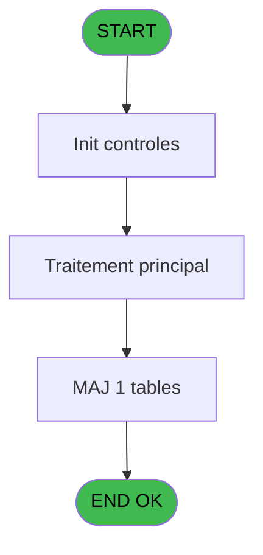

# MAI IDE 25 - Reference compte bilan/service

> **Analyse**: Phases 1-4 2026-02-03 14:49 -> 14:50 (10s) | Assemblage 14:50
> **Pipeline**: V7.2 Enrichi
> **Structure**: 4 onglets (Resume | Ecrans | Donnees | Connexions)

<!-- TAB:Resume -->

## 1. FICHE D'IDENTITE

| Attribut | Valeur |
|----------|--------|
| Projet | MAI |
| IDE Position | 25 |
| Nom Programme | Reference compte bilan/service |
| Fichier source | `Prg_25.xml` |
| Dossier IDE | Caisse |
| Taches | 1 (1 ecrans visibles) |
| Tables modifiees | 1 |
| Programmes appeles | 0 |

## 2. DESCRIPTION FONCTIONNELLE

**Reference compte bilan/service** assure la gestion complete de ce processus, accessible depuis [Menu paramètres (IDE 23)](MAI-IDE-23.md).

Le flux de traitement s'organise en **1 blocs fonctionnels** :

- **Calcul** (1 tache) : calculs de montants, stocks ou compteurs

**Donnees modifiees** : 1 tables en ecriture (message_erreur).

## 3. BLOCS FONCTIONNELS

### 3.1 Calcul (1 tache)

Calculs metier : montants, stocks, compteurs.

---

#### 25 - Reference compte bilan/service [[ECRAN]](#ecran-t1)

**Role** : Traitement : Reference compte bilan/service.
**Ecran** : 800 x 0 DLU (MDI) | [Voir mockup](#ecran-t1)

## 5. REGLES METIER

*(Aucune regle metier identifiee)*

## 6. CONTEXTE

- **Appele par**: [Menu paramètres (IDE 23)](MAI-IDE-23.md)
- **Appelle**: 0 programmes | **Tables**: 1 (W:1 R:0 L:0) | **Taches**: 1 | **Expressions**: 2

<!-- TAB:Ecrans -->

## 8. ECRANS

### 8.1 Forms visibles (1 / 1)

| # | Position | Tache | Nom | Type | Largeur | Hauteur | Bloc |
|---|----------|-------|-----|------|---------|---------|------|
| 1 | 25 | 25 | Reference compte bilan/service | MDI | 800 | 0 | Calcul |

### 8.2 Mockups Ecrans

---

#### 25 - Reference compte bilan/service
**Tache** : [25](#t1) | **Type** : MDI | **Dimensions** : 800 x 0 DLU
**Bloc** : Calcul | **Titre IDE** : Reference compte bilan/service

<!-- FORM-DATA:
{
    "width":  800,
    "vFactor":  8,
    "type":  "MDI",
    "hFactor":  8,
    "controls":  [
                     {
                         "x":  255,
                         "type":  "table",
                         "var":  "",
                         "name":  "",
                         "titleH":  11,
                         "color":  "110",
                         "w":  291,
                         "y":  6,
                         "fmt":  "",
                         "parent":  null,
                         "text":  "",
                         "rowH":  12,
                         "h":  158,
                         "cols":  [
                                      {
                                          "title":  "Service",
                                          "layer":  1,
                                          "w":  64
                                      },
                                      {
                                          "title":  "Sous-imputation",
                                          "layer":  2,
                                          "w":  190
                                      }
                                  ],
                         "rows":  2
                     },
                     {
                         "x":  262,
                         "type":  "edit",
                         "var":  "",
                         "y":  19,
                         "w":  48,
                         "fmt":  "",
                         "name":  "",
                         "h":  8,
                         "color":  "110",
                         "text":  "",
                         "parent":  1
                     },
                     {
                         "x":  347,
                         "type":  "edit",
                         "var":  "",
                         "y":  19,
                         "w":  131,
                         "fmt":  "### ### ###",
                         "name":  "",
                         "h":  8,
                         "color":  "110",
                         "text":  "",
                         "parent":  1
                     },
                     {
                         "x":  8,
                         "type":  "button",
                         "var":  "",
                         "y":  175,
                         "w":  154,
                         "fmt":  "Quitter",
                         "name":  "",
                         "h":  14,
                         "color":  "",
                         "text":  "",
                         "parent":  null
                     }
                 ],
    "taskId":  "25",
    "height":  0
}
-->

<strong>Champs : 2 champs</strong>

| Pos (x,y) | Nom | Variable | Type |
|-----------|-----|----------|------|
| 262,19 | (sans nom) | - | edit |
| 347,19 | ### ### ### | - | edit |

<strong>Boutons : 1 boutons</strong>

| Bouton | Pos (x,y) | Action |
|--------|-----------|--------|
| Quitter | 8,175 | Quitte le programme |

## 9. NAVIGATION

Ecran unique: **Reference compte bilan/service**

### 9.3 Structure hierarchique (1 tache)

| Position | Tache | Type | Dimensions | Bloc |
|----------|-------|------|------------|------|
| **25.1** | [**Reference compte bilan/service** (25)](#t1) [mockup](#ecran-t1) | MDI | 800x0 | Calcul |

### 9.4 Algorigramme

> **Legende**: Vert = START/END OK | Rouge = END KO | Bleu = Decisions
> *Algorigramme auto-genere. Utiliser `/algorigramme` pour une synthese metier detaillee.*

<!-- TAB:Donnees -->

## 10. TABLES

### Tables utilisees (1)

| ID | Nom | Description | Type | R | W | L | Usages |
|----|-----|-------------|------|---|---|---|--------|
| 702 | message_erreur |  | DB |   | **W** |   | 1 |

### Colonnes par table (0 / 1 tables avec colonnes identifiees)

Table 702 - message_erreur (**W**) - 1 usages

*Table utilisee uniquement en Link ou aucune colonne Real identifiee dans le DataView.*

## 11. VARIABLES

*(Programme sans variables locales mappees)*

## 12. EXPRESSIONS

**2 / 2 expressions decodees (100%)**

### 12.1 Repartition par type

| Type | Expressions | Regles |
|------|-------------|--------|
| CAST_LOGIQUE | 2 | 0 |

### 12.2 Expressions cles par type

#### CAST_LOGIQUE (2 expressions)

| Type | IDE | Expression | Regle |
|------|-----|------------|-------|
| CAST_LOGIQUE | 2 | `'FALSE'LOG` | - |
| CAST_LOGIQUE | 1 | `'TRUE'LOG` | - |

<!-- TAB:Connexions -->

## 13. GRAPHE D'APPELS

### 13.1 Chaine depuis Main (Callers)

Main -> ... -> [Menu paramètres (IDE 23)](MAI-IDE-23.md) -> **Reference compte bilan/service (IDE 25)**

### 13.2 Callers

| IDE | Nom Programme | Nb Appels |
|-----|---------------|-----------|
| [23](MAI-IDE-23.md) | Menu paramètres | 1 |

### 13.3 Callees (programmes appeles)

### 13.4 Detail Callees avec contexte

| IDE | Nom Programme | Appels | Contexte |
|-----|---------------|--------|----------|
| - | (aucun) | - | - |

## 14. RECOMMANDATIONS MIGRATION

### 14.1 Profil du programme

| Metrique | Valeur | Impact migration |
|----------|--------|-----------------|
| Lignes de logique | 7 | Programme compact |
| Expressions | 2 | Peu de logique |
| Tables WRITE | 1 | Impact faible |
| Sous-programmes | 0 | Peu de dependances |
| Ecrans visibles | 1 | Ecran unique ou traitement batch |
| Code desactive | 0% (0 / 7) | Code sain |
| Regles metier | 0 | Pas de regle identifiee |

### 14.2 Plan de migration par bloc

#### Calcul (1 tache: 1 ecran, 0 traitement)

- **Strategie** : Services de calcul purs (Domain Services).
- Migrer la logique de calcul (stock, compteurs, montants)

### 14.3 Dependances critiques

| Dependance | Type | Appels | Impact |
|------------|------|--------|--------|
| message_erreur | Table WRITE (Database) | 1x | Schema + repository |

---
*Spec DETAILED generee par Pipeline V7.2 - 2026-02-03 14:50*
