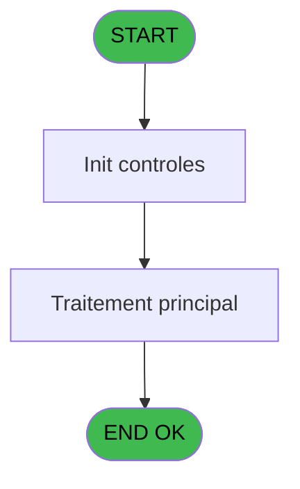

# MAI IDE 29 - Reference Activite service

> **Analyse**: Phases 1-4 2026-02-03 14:50 -> 14:51 (11s) | Assemblage 14:51
> **Pipeline**: V7.2 Enrichi
> **Structure**: 4 onglets (Resume | Ecrans | Donnees | Connexions)

<!-- TAB:Resume -->

## 1. FICHE D'IDENTITE

| Attribut | Valeur |
|----------|--------|
| Projet | MAI |
| IDE Position | 29 |
| Nom Programme | Reference Activite service |
| Fichier source | `Prg_29.xml` |
| Dossier IDE | Caisse |
| Taches | 1 (1 ecrans visibles) |
| Tables modifiees | 0 |
| Programmes appeles | 0 |

## 2. DESCRIPTION FONCTIONNELLE

**Reference Activite service** assure la gestion complete de ce processus, accessible depuis [Menu paramètres (IDE 23)](MAI-IDE-23.md).

Le flux de traitement s'organise en **1 blocs fonctionnels** :

- **Traitement** (1 tache) : traitements metier divers

## 3. BLOCS FONCTIONNELS

### 3.1 Traitement (1 tache)

Traitements internes.

---

#### 29 - Reference Activite service [[ECRAN]](#ecran-t1)

**Role** : Traitement : Reference Activite service.
**Ecran** : 800 x 0 DLU (MDI) | [Voir mockup](#ecran-t1)

## 5. REGLES METIER

*(Aucune regle metier identifiee)*

## 6. CONTEXTE

- **Appele par**: [Menu paramètres (IDE 23)](MAI-IDE-23.md)
- **Appelle**: 0 programmes | **Tables**: 3 (W:0 R:1 L:2) | **Taches**: 1 | **Expressions**: 5

<!-- TAB:Ecrans -->

## 8. ECRANS

### 8.1 Forms visibles (1 / 1)

| # | Position | Tache | Nom | Type | Largeur | Hauteur | Bloc |
|---|----------|-------|-----|------|---------|---------|------|
| 1 | 29 | 29 | Reference Activite service | MDI | 800 | 0 | Traitement |

### 8.2 Mockups Ecrans

---

#### 29 - Reference Activite service
**Tache** : [29](#t1) | **Type** : MDI | **Dimensions** : 800 x 0 DLU
**Bloc** : Traitement | **Titre IDE** : Reference Activite service

<!-- FORM-DATA:
{
    "width":  800,
    "vFactor":  8,
    "type":  "MDI",
    "hFactor":  8,
    "controls":  [
                     {
                         "x":  152,
                         "type":  "table",
                         "var":  "",
                         "name":  "",
                         "titleH":  11,
                         "color":  "110",
                         "w":  498,
                         "y":  9,
                         "fmt":  "",
                         "parent":  null,
                         "text":  "",
                         "rowH":  11,
                         "h":  163,
                         "cols":  [
                                      {
                                          "title":  "Société",
                                          "layer":  1,
                                          "w":  82
                                      },
                                      {
                                          "title":  "Activité du plan comptable",
                                          "layer":  2,
                                          "w":  224
                                      },
                                      {
                                          "title":  "Service de PMS",
                                          "layer":  3,
                                          "w":  157
                                      }
                                  ],
                         "rows":  3
                     },
                     {
                         "x":  160,
                         "type":  "edit",
                         "var":  "",
                         "y":  22,
                         "w":  66,
                         "fmt":  "",
                         "name":  "",
                         "h":  8,
                         "color":  "110",
                         "text":  "",
                         "parent":  1
                     },
                     {
                         "x":  242,
                         "type":  "edit",
                         "var":  "",
                         "y":  22,
                         "w":  208,
                         "fmt":  "",
                         "name":  "",
                         "h":  8,
                         "color":  "110",
                         "text":  "",
                         "parent":  1
                     },
                     {
                         "x":  466,
                         "type":  "edit",
                         "var":  "",
                         "y":  22,
                         "w":  132,
                         "fmt":  "",
                         "name":  "",
                         "h":  8,
                         "color":  "110",
                         "text":  "",
                         "parent":  1
                     },
                     {
                         "x":  155,
                         "type":  "edit",
                         "var":  "",
                         "y":  178,
                         "w":  560,
                         "fmt":  "",
                         "name":  "",
                         "h":  10,
                         "color":  "6",
                         "text":  "",
                         "parent":  null
                     },
                     {
                         "x":  155,
                         "type":  "edit",
                         "var":  "",
                         "y":  189,
                         "w":  560,
                         "fmt":  "",
                         "name":  "",
                         "h":  10,
                         "color":  "6",
                         "text":  "",
                         "parent":  null
                     },
                     {
                         "x":  8,
                         "type":  "button",
                         "var":  "",
                         "y":  183,
                         "w":  122,
                         "fmt":  "Quitter",
                         "name":  "",
                         "h":  14,
                         "color":  "",
                         "text":  "",
                         "parent":  null
                     }
                 ],
    "taskId":  "29",
    "height":  0
}
-->

<strong>Champs : 5 champs</strong>

| Pos (x,y) | Nom | Variable | Type |
|-----------|-----|----------|------|
| 160,22 | (sans nom) | - | edit |
| 242,22 | (sans nom) | - | edit |
| 466,22 | (sans nom) | - | edit |
| 155,178 | (sans nom) | - | edit |
| 155,189 | (sans nom) | - | edit |

<strong>Boutons : 1 boutons</strong>

| Bouton | Pos (x,y) | Action |
|--------|-----------|--------|
| Quitter | 8,183 | Quitte le programme |

## 9. NAVIGATION

Ecran unique: **Reference Activite service**

### 9.3 Structure hierarchique (1 tache)

| Position | Tache | Type | Dimensions | Bloc |
|----------|-------|------|------------|------|
| **29.1** | [**Reference Activite service** (29)](#t1) [mockup](#ecran-t1) | MDI | 800x0 | Traitement |

### 9.4 Algorigramme

> **Legende**: Vert = START/END OK | Rouge = END KO | Bleu = Decisions
> *Algorigramme auto-genere. Utiliser `/algorigramme` pour une synthese metier detaillee.*

<!-- TAB:Donnees -->

## 10. TABLES

### Tables utilisees (3)

| ID | Nom | Description | Type | R | W | L | Usages |
|----|-----|-------------|------|---|---|---|--------|
| 67 | tables___________tab |  | DB | R |   |   | 1 |
| 201 | activite_plan_comptable |  | DB |   |   | L | 1 |
| 698 | droit_par_utilisateurs | Droits operateur | DB |   |   | L | 1 |

### Colonnes par table (0 / 1 tables avec colonnes identifiees)

Table 67 - tables___________tab (R) - 1 usages

*Table utilisee uniquement en Link ou aucune colonne Real identifiee dans le DataView.*

## 11. VARIABLES

*(Programme sans variables locales mappees)*

## 12. EXPRESSIONS

**5 / 5 expressions decodees (100%)**

### 12.1 Repartition par type

| Type | Expressions | Regles |
|------|-------------|--------|
| CONSTANTE | 1 | 0 |
| CAST_LOGIQUE | 2 | 0 |
| OTHER | 2 | 0 |

### 12.2 Expressions cles par type

#### CONSTANTE (1 expressions)

| Type | IDE | Expression | Regle |
|------|-----|------------|-------|
| CONSTANTE | 4 | `'VSERV'` | - |

#### CAST_LOGIQUE (2 expressions)

| Type | IDE | Expression | Regle |
|------|-----|------------|-------|
| CAST_LOGIQUE | 2 | `'FALSE'LOG` | - |
| CAST_LOGIQUE | 1 | `'TRUE'LOG` | - |

#### OTHER (2 expressions)

| Type | IDE | Expression | Regle |
|------|-----|------------|-------|
| OTHER | 5 | `[D]` | - |
| OTHER | 3 | `[C]` | - |

<!-- TAB:Connexions -->

## 13. GRAPHE D'APPELS

### 13.1 Chaine depuis Main (Callers)

Main -> ... -> [Menu paramètres (IDE 23)](MAI-IDE-23.md) -> **Reference Activite service (IDE 29)**

### 13.2 Callers

| IDE | Nom Programme | Nb Appels |
|-----|---------------|-----------|
| [23](MAI-IDE-23.md) | Menu paramètres | 1 |

### 13.3 Callees (programmes appeles)

### 13.4 Detail Callees avec contexte

| IDE | Nom Programme | Appels | Contexte |
|-----|---------------|--------|----------|
| - | (aucun) | - | - |

## 14. RECOMMANDATIONS MIGRATION

### 14.1 Profil du programme

| Metrique | Valeur | Impact migration |
|----------|--------|-----------------|
| Lignes de logique | 22 | Programme compact |
| Expressions | 5 | Peu de logique |
| Tables WRITE | 0 | Impact faible |
| Sous-programmes | 0 | Peu de dependances |
| Ecrans visibles | 1 | Ecran unique ou traitement batch |
| Code desactive | 0% (0 / 22) | Code sain |
| Regles metier | 0 | Pas de regle identifiee |

### 14.2 Plan de migration par bloc

#### Traitement (1 tache: 1 ecran, 0 traitement)

- **Strategie** : 1 composant(s) UI (Razor/React) avec formulaires et validation.
- Decomposer les taches en services unitaires testables.

### 14.3 Dependances critiques

| Dependance | Type | Appels | Impact |
|------------|------|--------|--------|

---
*Spec DETAILED generee par Pipeline V7.2 - 2026-02-03 14:51*
