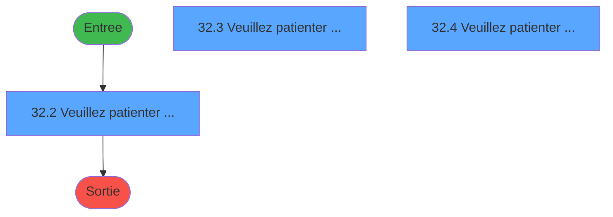
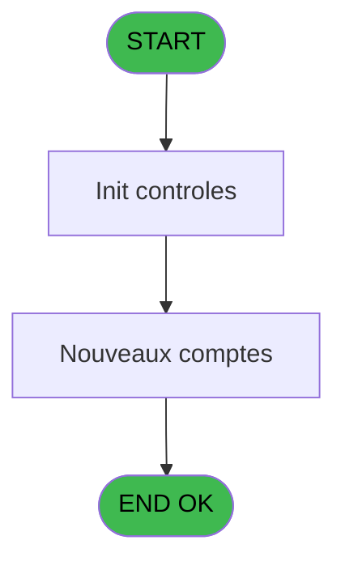

# MAI IDE 32 - Impression maj plan comptable

> **Analyse**: Phases 1-4 2026-02-03 14:51 -> 14:51 (10s) | Assemblage 14:51
> **Pipeline**: V7.2 Enrichi
> **Structure**: 4 onglets (Resume | Ecrans | Donnees | Connexions)

<!-- TAB:Resume -->

## 1. FICHE D'IDENTITE

| Attribut | Valeur |
|----------|--------|
| Projet | MAI |
| IDE Position | 32 |
| Nom Programme | Impression maj plan comptable |
| Fichier source | `Prg_32.xml` |
| Dossier IDE | Caisse |
| Taches | 5 (3 ecrans visibles) |
| Tables modifiees | 0 |
| Programmes appeles | 0 |

## 2. DESCRIPTION FONCTIONNELLE

**Impression maj plan comptable** assure la gestion complete de ce processus, accessible depuis [MAJ plan comptable (IDE 35)](MAI-IDE-35.md).

Le flux de traitement s'organise en **2 blocs fonctionnels** :

- **Traitement** (4 taches) : traitements metier divers
- **Calcul** (1 tache) : calculs de montants, stocks ou compteurs

Detail : phases du traitement

#### Phase 1 : Calcul (1 tache)

- **32** - Impression maj plan comptable **[[ECRAN]](#ecran-t1)**

#### Phase 2 : Traitement (4 taches)

- **32.1** - Dernier chrono
- **32.2** - Veuillez patienter ..... **[[ECRAN]](#ecran-t3)**
- **32.3** - Veuillez patienter ..... **[[ECRAN]](#ecran-t4)**
- **32.4** - Veuillez patienter ..... **[[ECRAN]](#ecran-t5)**

## 3. BLOCS FONCTIONNELS

### 3.1 Calcul (1 tache)

Calculs metier : montants, stocks, compteurs.

---

#### 32 - Impression maj plan comptable [[ECRAN]](#ecran-t1)

**Role** : Generation du document : Impression maj plan comptable.
**Ecran** : 422 x 56 DLU (MDI) | [Voir mockup](#ecran-t1)
**Variables liees** : B (P date comptable)

### 3.2 Traitement (4 taches)

Traitements internes.

---

#### 32.1 - Dernier chrono

**Role** : Traitement : Dernier chrono.
**Variables liees** : D (Dernier chrono)

---

#### 32.2 - Veuillez patienter ..... [[ECRAN]](#ecran-t3)

**Role** : Traitement : Veuillez patienter ......
**Ecran** : 426 x 58 DLU (MDI) | [Voir mockup](#ecran-t3)

---

#### 32.3 - Veuillez patienter ..... [[ECRAN]](#ecran-t4)

**Role** : Traitement : Veuillez patienter ......
**Ecran** : 427 x 60 DLU (MDI) | [Voir mockup](#ecran-t4)

---

#### 32.4 - Veuillez patienter ..... [[ECRAN]](#ecran-t5)

**Role** : Traitement : Veuillez patienter ......
**Ecran** : 427 x 59 DLU (MDI) | [Voir mockup](#ecran-t5)

## 5. REGLES METIER

*(Aucune regle metier identifiee)*

## 6. CONTEXTE

- **Appele par**: [MAJ plan comptable (IDE 35)](MAI-IDE-35.md)
- **Appelle**: 0 programmes | **Tables**: 2 (W:0 R:2 L:1) | **Taches**: 5 | **Expressions**: 5

<!-- TAB:Ecrans -->

## 8. ECRANS

### 8.1 Forms visibles (3 / 5)

| # | Position | Tache | Nom | Type | Largeur | Hauteur | Bloc |
|---|----------|-------|-----|------|---------|---------|------|
| 1 | 32.2 | 32.2 | Veuillez patienter ..... | MDI | 426 | 58 | Traitement |
| 2 | 32.3 | 32.3 | Veuillez patienter ..... | MDI | 427 | 60 | Traitement |
| 3 | 32.4 | 32.4 | Veuillez patienter ..... | MDI | 427 | 59 | Traitement |

### 8.2 Mockups Ecrans

---

#### 32.2 - Veuillez patienter .....
**Tache** : [32.2](#t3) | **Type** : MDI | **Dimensions** : 426 x 58 DLU
**Bloc** : Traitement | **Titre IDE** : Veuillez patienter .....

<!-- FORM-DATA:
{
    "width":  426,
    "vFactor":  8,
    "type":  "MDI",
    "hFactor":  8,
    "controls":  [
                     {
                         "x":  0,
                         "type":  "label",
                         "var":  "",
                         "y":  0,
                         "w":  423,
                         "fmt":  "",
                         "name":  "",
                         "h":  29,
                         "color":  "",
                         "text":  "",
                         "parent":  null
                     },
                     {
                         "x":  117,
                         "type":  "label",
                         "var":  "",
                         "y":  10,
                         "w":  275,
                         "fmt":  "",
                         "name":  "",
                         "h":  8,
                         "color":  "7",
                         "text":  "Impression en cours",
                         "parent":  null
                     },
                     {
                         "x":  0,
                         "type":  "label",
                         "var":  "",
                         "y":  29,
                         "w":  423,
                         "fmt":  "",
                         "name":  "",
                         "h":  27,
                         "color":  "",
                         "text":  "",
                         "parent":  null
                     },
                     {
                         "x":  70,
                         "type":  "label",
                         "var":  "",
                         "y":  39,
                         "w":  282,
                         "fmt":  "",
                         "name":  "",
                         "h":  8,
                         "color":  "",
                         "text":  "Impression listing comptable",
                         "parent":  null
                     },
                     {
                         "x":  1,
                         "type":  "image",
                         "var":  "",
                         "y":  2,
                         "w":  72,
                         "fmt":  "",
                         "name":  "",
                         "h":  25,
                         "color":  "",
                         "text":  "",
                         "parent":  null
                     }
                 ],
    "taskId":  "32.2",
    "height":  58
}
-->

---

#### 32.3 - Veuillez patienter .....
**Tache** : [32.3](#t4) | **Type** : MDI | **Dimensions** : 427 x 60 DLU
**Bloc** : Traitement | **Titre IDE** : Veuillez patienter .....

<!-- FORM-DATA:
{
    "width":  427,
    "vFactor":  8,
    "type":  "MDI",
    "hFactor":  8,
    "controls":  [
                     {
                         "x":  0,
                         "type":  "label",
                         "var":  "",
                         "y":  0,
                         "w":  423,
                         "fmt":  "",
                         "name":  "",
                         "h":  29,
                         "color":  "",
                         "text":  "",
                         "parent":  null
                     },
                     {
                         "x":  117,
                         "type":  "label",
                         "var":  "",
                         "y":  10,
                         "w":  275,
                         "fmt":  "",
                         "name":  "",
                         "h":  8,
                         "color":  "7",
                         "text":  "Impression en cours",
                         "parent":  null
                     },
                     {
                         "x":  0,
                         "type":  "label",
                         "var":  "",
                         "y":  29,
                         "w":  423,
                         "fmt":  "",
                         "name":  "",
                         "h":  27,
                         "color":  "",
                         "text":  "",
                         "parent":  null
                     },
                     {
                         "x":  70,
                         "type":  "label",
                         "var":  "",
                         "y":  39,
                         "w":  282,
                         "fmt":  "",
                         "name":  "",
                         "h":  8,
                         "color":  "",
                         "text":  "Impression listing comptable",
                         "parent":  null
                     },
                     {
                         "x":  1,
                         "type":  "image",
                         "var":  "",
                         "y":  2,
                         "w":  72,
                         "fmt":  "",
                         "name":  "",
                         "h":  25,
                         "color":  "",
                         "text":  "",
                         "parent":  null
                     }
                 ],
    "taskId":  "32.3",
    "height":  60
}
-->

---

#### 32.4 - Veuillez patienter .....
**Tache** : [32.4](#t5) | **Type** : MDI | **Dimensions** : 427 x 59 DLU
**Bloc** : Traitement | **Titre IDE** : Veuillez patienter .....

<!-- FORM-DATA:
{
    "width":  427,
    "vFactor":  8,
    "type":  "MDI",
    "hFactor":  8,
    "controls":  [
                     {
                         "x":  0,
                         "type":  "label",
                         "var":  "",
                         "y":  0,
                         "w":  423,
                         "fmt":  "",
                         "name":  "",
                         "h":  29,
                         "color":  "",
                         "text":  "",
                         "parent":  null
                     },
                     {
                         "x":  117,
                         "type":  "label",
                         "var":  "",
                         "y":  10,
                         "w":  275,
                         "fmt":  "",
                         "name":  "",
                         "h":  8,
                         "color":  "7",
                         "text":  "Impression en cours",
                         "parent":  null
                     },
                     {
                         "x":  0,
                         "type":  "label",
                         "var":  "",
                         "y":  29,
                         "w":  423,
                         "fmt":  "",
                         "name":  "",
                         "h":  27,
                         "color":  "",
                         "text":  "",
                         "parent":  null
                     },
                     {
                         "x":  70,
                         "type":  "label",
                         "var":  "",
                         "y":  39,
                         "w":  282,
                         "fmt":  "",
                         "name":  "",
                         "h":  8,
                         "color":  "",
                         "text":  "Impression listing comptable",
                         "parent":  null
                     },
                     {
                         "x":  1,
                         "type":  "image",
                         "var":  "",
                         "y":  2,
                         "w":  72,
                         "fmt":  "",
                         "name":  "",
                         "h":  25,
                         "color":  "",
                         "text":  "",
                         "parent":  null
                     }
                 ],
    "taskId":  "32.4",
    "height":  59
}
-->

## 9. NAVIGATION

### 9.1 Enchainement des ecrans

**Detail par enchainement :**

| Depuis | Action | Vers | Retour |
|--------|--------|------|--------|

### 9.3 Structure hierarchique (5 taches)

| Position | Tache | Type | Dimensions | Bloc |
|----------|-------|------|------------|------|
| **32.1** | [**Impression maj plan comptable** (32)](#t1) [mockup](#ecran-t1) | MDI | 422x56 | Calcul |
| **32.2** | [**Dernier chrono** (32.1)](#t2) | MDI | - | Traitement |
| 32.2.1 | [Veuillez patienter ..... (32.2)](#t3) [mockup](#ecran-t3) | MDI | 426x58 | |
| 32.2.2 | [Veuillez patienter ..... (32.3)](#t4) [mockup](#ecran-t4) | MDI | 427x60 | |
| 32.2.3 | [Veuillez patienter ..... (32.4)](#t5) [mockup](#ecran-t5) | MDI | 427x59 | |

### 9.4 Algorigramme

> **Legende**: Vert = START/END OK | Rouge = END KO | Bleu = Decisions
> *Algorigramme auto-genere. Utiliser `/algorigramme` pour une synthese metier detaillee.*

<!-- TAB:Donnees -->

## 10. TABLES

### Tables utilisees (2)

| ID | Nom | Description | Type | R | W | L | Usages |
|----|-----|-------------|------|---|---|---|--------|
| 209 | plan_comptable_central |  | DB | R |   |   | 3 |
| 210 | plan_comptable_central_histo | Historique / journal | DB | R |   | L | 4 |

### Colonnes par table (2 / 2 tables avec colonnes identifiees)

Table 209 - plan_comptable_central (R) - 3 usages

| Lettre | Variable | Acces | Type |
|--------|----------|-------|------|
| B | P date comptable | R | Date |

Table 210 - plan_comptable_central_histo (R/L) - 4 usages

| Lettre | Variable | Acces | Type |
|--------|----------|-------|------|
| B | P date comptable | R | Date |

## 11. VARIABLES

### 11.1 Parametres entrants (3)

Variables recues du programme appelant ([MAJ plan comptable (IDE 35)](MAI-IDE-35.md)).

| Lettre | Nom | Type | Usage dans |
|--------|-----|------|-----------|
| A | P societe | Alpha | - |
| B | P date comptable | Date | - |
| C | P nom village | Alpha | - |

### 11.2 Autres (1)

Variables diverses.

| Lettre | Nom | Type | Usage dans |
|--------|-----|------|-----------|
| D | Dernier chrono | Numeric | - |

## 12. EXPRESSIONS

**5 / 5 expressions decodees (100%)**

### 12.1 Repartition par type

| Type | Expressions | Regles |
|------|-------------|--------|
| CONCATENATION | 2 | 0 |
| CONDITION | 1 | 0 |
| OTHER | 2 | 0 |

### 12.2 Expressions cles par type

#### CONCATENATION (2 expressions)

| Type | IDE | Expression | Regle |
|------|-----|------------|-------|
| CONCATENATION | 3 | `DStr (Date (),'DD/MM/YYYY')&' - '&TStr (Time (),'HH:MM:SS')` | - |
| CONCATENATION | 2 | `'- '&Str (Page (0,1),'3P0Z0')&' -'` | - |

#### CONDITION (1 expressions)

| Type | IDE | Expression | Regle |
|------|-----|------------|-------|
| CONDITION | 1 | `INIGet ('[MAGIC_LOGICAL_NAMES]preview')='O'` | - |

#### OTHER (2 expressions)

| Type | IDE | Expression | Regle |
|------|-----|------------|-------|
| OTHER | 5 | `SetCrsr (1)` | - |
| OTHER | 4 | `SetCrsr (2)` | - |

<!-- TAB:Connexions -->

## 13. GRAPHE D'APPELS

### 13.1 Chaine depuis Main (Callers)

Main -> ... -> [MAJ plan comptable (IDE 35)](MAI-IDE-35.md) -> **Impression maj plan comptable (IDE 32)**

### 13.2 Callers

| IDE | Nom Programme | Nb Appels |
|-----|---------------|-----------|
| [35](MAI-IDE-35.md) | MAJ plan comptable | 1 |

### 13.3 Callees (programmes appeles)

### 13.4 Detail Callees avec contexte

| IDE | Nom Programme | Appels | Contexte |
|-----|---------------|--------|----------|
| - | (aucun) | - | - |

## 14. RECOMMANDATIONS MIGRATION

### 14.1 Profil du programme

| Metrique | Valeur | Impact migration |
|----------|--------|-----------------|
| Lignes de logique | 79 | Programme compact |
| Expressions | 5 | Peu de logique |
| Tables WRITE | 0 | Impact faible |
| Sous-programmes | 0 | Peu de dependances |
| Ecrans visibles | 3 | Quelques ecrans |
| Code desactive | 0% (0 / 79) | Code sain |
| Regles metier | 0 | Pas de regle identifiee |

### 14.2 Plan de migration par bloc

#### Calcul (1 tache: 1 ecran, 0 traitement)

- **Strategie** : Services de calcul purs (Domain Services).
- Migrer la logique de calcul (stock, compteurs, montants)

#### Traitement (4 taches: 3 ecrans, 1 traitement)

- **Strategie** : Orchestrateur avec 3 ecrans (Razor/React) et 1 traitements backend (services).
- Les ecrans deviennent des composants UI, les traitements invisibles deviennent des services injectables.
- Decomposer les taches en services unitaires testables.

### 14.3 Dependances critiques

| Dependance | Type | Appels | Impact |
|------------|------|--------|--------|

---
*Spec DETAILED generee par Pipeline V7.2 - 2026-02-03 14:51*
