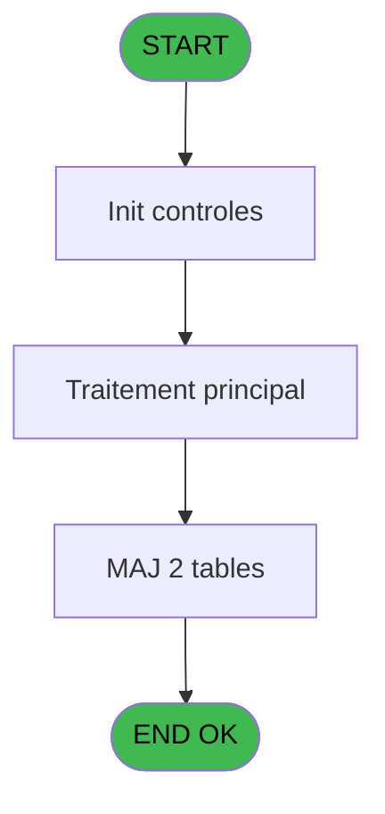

# MAI IDE 33 - Chargement temporaire du plan

> **Analyse**: Phases 1-4 2026-02-03 14:51 -> 14:52 (10s) | Assemblage 14:52
> **Pipeline**: V7.2 Enrichi
> **Structure**: 4 onglets (Resume | Ecrans | Donnees | Connexions)

<!-- TAB:Resume -->

## 1. FICHE D'IDENTITE

| Attribut | Valeur |
|----------|--------|
| Projet | MAI |
| IDE Position | 33 |
| Nom Programme | Chargement temporaire du plan |
| Fichier source | `Prg_33.xml` |
| Dossier IDE | Caisse |
| Taches | 9 (1 ecrans visibles) |
| Tables modifiees | 2 |
| Programmes appeles | 1 |

## 2. DESCRIPTION FONCTIONNELLE

**Chargement temporaire du plan** assure la gestion complete de ce processus, accessible depuis [Menu parametrage caisse (IDE 37)](MAI-IDE-37.md).

Le flux de traitement s'organise en **2 blocs fonctionnels** :

- **Traitement** (5 taches) : traitements metier divers
- **Creation** (4 taches) : insertion d'enregistrements en base (mouvements, prestations)

**Donnees modifiees** : 2 tables en ecriture (recap_mop_transaction, etiquettes_cab).

Detail : phases du traitement

#### Phase 1 : Traitement (5 taches)

- **33** - (sans nom) **[[ECRAN]](#ecran-t1)**
- **33.1** - Classes 12345 **[[ECRAN]](#ecran-t2)**
- **33.2** - Classes 6 **[[ECRAN]](#ecran-t4)**
- **33.3** - Classes 7 **[[ECRAN]](#ecran-t6)**
- **33.4** - Activite tempo

Delegue a : [Recuperation du titre (IDE 47)](MAI-IDE-47.md)

#### Phase 2 : Creation (4 taches)

- **33.1.1** - creation
- **33.2.1** - creation
- **33.3.1** - creation
- **33.4.1** - Create

#### Tables impactees

| Table | Operations | Role metier |
|-------|-----------|-------------|
| etiquettes_cab | R/**W** (7 usages) |  |
| recap_mop_transaction | **W**/L (2 usages) |  |

## 3. BLOCS FONCTIONNELS

### 3.1 Traitement (5 taches)

Traitements internes.

---

#### 33 - (sans nom) [[ECRAN]](#ecran-t1)

**Role** : Traitement interne.
**Ecran** : 480 x 64 DLU (MDI) | [Voir mockup](#ecran-t1)

4 sous-taches directes

| Tache | Nom | Bloc |
|-------|-----|------|
| [33.1](#t2) | Classes 12345 **[[ECRAN]](#ecran-t2)** | Traitement |
| [33.2](#t4) | Classes 6 **[[ECRAN]](#ecran-t4)** | Traitement |
| [33.3](#t6) | Classes 7 **[[ECRAN]](#ecran-t6)** | Traitement |
| [33.4](#t8) | Activite tempo | Traitement |

**Delegue a** : [Recuperation du titre (IDE 47)](MAI-IDE-47.md)

---

#### 33.1 - Classes 12345 [[ECRAN]](#ecran-t2)

**Role** : Traitement : Classes 12345.
**Ecran** : 973 x 204 DLU (MDI) | [Voir mockup](#ecran-t2)
**Delegue a** : [Recuperation du titre (IDE 47)](MAI-IDE-47.md)

---

#### 33.2 - Classes 6 [[ECRAN]](#ecran-t4)

**Role** : Traitement : Classes 6.
**Ecran** : 963 x 202 DLU (MDI) | [Voir mockup](#ecran-t4)
**Delegue a** : [Recuperation du titre (IDE 47)](MAI-IDE-47.md)

---

#### 33.3 - Classes 7 [[ECRAN]](#ecran-t6)

**Role** : Traitement : Classes 7.
**Ecran** : 966 x 201 DLU (MDI) | [Voir mockup](#ecran-t6)
**Delegue a** : [Recuperation du titre (IDE 47)](MAI-IDE-47.md)

---

#### 33.4 - Activite tempo

**Role** : Traitement : Activite tempo.
**Variables liees** : D (_activite)
**Delegue a** : [Recuperation du titre (IDE 47)](MAI-IDE-47.md)

### 3.2 Creation (4 taches)

Insertion de nouveaux enregistrements en base.

---

#### 33.1.1 - creation

**Role** : Creation d'enregistrement : creation.

---

#### 33.2.1 - creation

**Role** : Creation d'enregistrement : creation.

---

#### 33.3.1 - creation

**Role** : Creation d'enregistrement : creation.

---

#### 33.4.1 - Create

**Role** : Traitement : Create.

## 5. REGLES METIER

*(Aucune regle metier identifiee)*

## 6. CONTEXTE

- **Appele par**: [Menu parametrage caisse (IDE 37)](MAI-IDE-37.md)
- **Appelle**: 1 programmes | **Tables**: 2 (W:2 R:1 L:1) | **Taches**: 9 | **Expressions**: 2

<!-- TAB:Ecrans -->

## 8. ECRANS

### 8.1 Forms visibles (1 / 9)

| # | Position | Tache | Nom | Type | Largeur | Hauteur | Bloc |
|---|----------|-------|-----|------|---------|---------|------|
| 1 | 33 | 33 | (sans nom) | MDI | 480 | 64 | Traitement |

### 8.2 Mockups Ecrans

---

#### 33 - (sans nom)
**Tache** : [33](#t1) | **Type** : MDI | **Dimensions** : 480 x 64 DLU
**Bloc** : Traitement | **Titre IDE** : (sans nom)

<!-- FORM-DATA:
{
    "width":  480,
    "vFactor":  8,
    "type":  "MDI",
    "hFactor":  8,
    "controls":  [
                     {
                         "x":  22,
                         "type":  "image",
                         "var":  "",
                         "y":  16,
                         "w":  75,
                         "fmt":  "",
                         "name":  "",
                         "h":  33,
                         "color":  "",
                         "text":  "",
                         "parent":  null
                     },
                     {
                         "x":  109,
                         "type":  "edit",
                         "var":  "",
                         "y":  16,
                         "w":  350,
                         "fmt":  "100",
                         "name":  "",
                         "h":  33,
                         "color":  "",
                         "text":  "",
                         "parent":  null
                     }
                 ],
    "taskId":  "33",
    "height":  64
}
-->

<strong>Champs : 1 champs</strong>

| Pos (x,y) | Nom | Variable | Type |
|-----------|-----|----------|------|
| 109,16 | 100 | - | edit |

## 9. NAVIGATION

Ecran unique: ****

### 9.3 Structure hierarchique (9 taches)

| Position | Tache | Type | Dimensions | Bloc |
|----------|-------|------|------------|------|
| **33.1** | [**(sans nom)** (33)](#t1) [mockup](#ecran-t1) | MDI | 480x64 | Traitement |
| 33.1.1 | [Classes 12345 (33.1)](#t2) [mockup](#ecran-t2) | MDI | 973x204 | |
| 33.1.2 | [Classes 6 (33.2)](#t4) [mockup](#ecran-t4) | MDI | 963x202 | |
| 33.1.3 | [Classes 7 (33.3)](#t6) [mockup](#ecran-t6) | MDI | 966x201 | |
| 33.1.4 | [Activite tempo (33.4)](#t8) | MDI | - | |
| **33.2** | [**creation** (33.1.1)](#t3) | MDI | - | Creation |
| 33.2.1 | [creation (33.2.1)](#t5) | MDI | - | |
| 33.2.2 | [creation (33.3.1)](#t7) | MDI | - | |
| 33.2.3 | [Create (33.4.1)](#t9) | MDI | - | |

### 9.4 Algorigramme

> **Legende**: Vert = START/END OK | Rouge = END KO | Bleu = Decisions
> *Algorigramme auto-genere. Utiliser `/algorigramme` pour une synthese metier detaillee.*

<!-- TAB:Donnees -->

## 10. TABLES

### Tables utilisees (2)

| ID | Nom | Description | Type | R | W | L | Usages |
|----|-----|-------------|------|---|---|---|--------|
| 486 | recap_mop_transaction |  | TMP |   | **W** | L | 2 |
| 502 | etiquettes_cab |  | TMP | R | **W** |   | 7 |

### Colonnes par table (1 / 2 tables avec colonnes identifiees)

Table 486 - recap_mop_transaction (**W**/L) - 2 usages

*Table utilisee uniquement en Link ou aucune colonne Real identifiee dans le DataView.*

Table 502 - etiquettes_cab (R/**W**) - 7 usages

| Lettre | Variable | Acces | Type |
|--------|----------|-------|------|
| A | v titre | W | Alpha |
| B | _societe | W | Alpha |
| C | _compte | W | Numeric |
| D | _activite | W | Numeric |
| E | _libelle service | W | Alpha |
| F | _libelle fra | W | Alpha |
| G | _ libelle ang | W | Alpha |
| H | _compte produit | W | Logical |
| I | _compte charge | W | Logical |
| J | _compte financier | W | Logical |
| K | _compte bilan | W | Logical |
| L | _a partir du | W | Date |

## 11. VARIABLES

### 11.1 Variables de session (1)

Variables persistantes pendant toute la session.

| Lettre | Nom | Type | Usage dans |
|--------|-----|------|-----------|
| A | v titre | Alpha | - |

### 11.2 Autres (11)

Variables diverses.

| Lettre | Nom | Type | Usage dans |
|--------|-----|------|-----------|
| B | _societe | Alpha | - |
| C | _compte | Numeric | - |
| D | _activite | Numeric | - |
| E | _libelle service | Alpha | - |
| F | _libelle fra | Alpha | - |
| G | _ libelle ang | Alpha | - |
| H | _compte produit | Logical | - |
| I | _compte charge | Logical | - |
| J | _compte financier | Logical | - |
| K | _compte bilan | Logical | - |
| L | _a partir du | Date | - |

## 12. EXPRESSIONS

**2 / 2 expressions decodees (100%)**

### 12.1 Repartition par type

| Type | Expressions | Regles |
|------|-------------|--------|
| OTHER | 2 | 0 |

### 12.2 Expressions cles par type

#### OTHER (2 expressions)

| Type | IDE | Expression | Regle |
|------|-----|------------|-------|
| OTHER | 2 | `MlsTrans ('Veuillez patienter pendant l''importation du plan comptable')` | - |
| OTHER | 1 | `Delay (1)` | - |

<!-- TAB:Connexions -->

## 13. GRAPHE D'APPELS

### 13.1 Chaine depuis Main (Callers)

Main -> ... -> [Menu parametrage caisse (IDE 37)](MAI-IDE-37.md) -> **Chargement temporaire du plan (IDE 33)**

### 13.2 Callers

| IDE | Nom Programme | Nb Appels |
|-----|---------------|-----------|
| [37](MAI-IDE-37.md) | Menu parametrage caisse | 1 |

### 13.3 Callees (programmes appeles)

### 13.4 Detail Callees avec contexte

| IDE | Nom Programme | Appels | Contexte |
|-----|---------------|--------|----------|
| [47](MAI-IDE-47.md) | Recuperation du titre | 3 | Recuperation donnees |

## 14. RECOMMANDATIONS MIGRATION

### 14.1 Profil du programme

| Metrique | Valeur | Impact migration |
|----------|--------|-----------------|
| Lignes de logique | 174 | Programme compact |
| Expressions | 2 | Peu de logique |
| Tables WRITE | 2 | Impact faible |
| Sous-programmes | 1 | Peu de dependances |
| Ecrans visibles | 1 | Ecran unique ou traitement batch |
| Code desactive | 0% (0 / 174) | Code sain |
| Regles metier | 0 | Pas de regle identifiee |

### 14.2 Plan de migration par bloc

#### Traitement (5 taches: 4 ecrans, 1 traitement)

- **Strategie** : Orchestrateur avec 4 ecrans (Razor/React) et 1 traitements backend (services).
- Les ecrans deviennent des composants UI, les traitements invisibles deviennent des services injectables.
- 1 sous-programme(s) a migrer ou a reutiliser depuis les services existants.
- Decomposer les taches en services unitaires testables.

#### Creation (4 taches: 0 ecran, 4 traitements)

- **Strategie** : Repository pattern avec Entity Framework Core.
- Insertion via `IRepository<T>.CreateAsync()`

### 14.3 Dependances critiques

| Dependance | Type | Appels | Impact |
|------------|------|--------|--------|
| recap_mop_transaction | Table WRITE (Temp) | 1x | Schema + repository |
| etiquettes_cab | Table WRITE (Temp) | 6x | Schema + repository |
| [Recuperation du titre (IDE 47)](MAI-IDE-47.md) | Sous-programme | 3x | **CRITIQUE** - Recuperation donnees |

---
*Spec DETAILED generee par Pipeline V7.2 - 2026-02-03 14:52*
