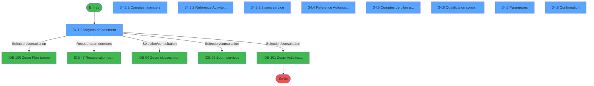
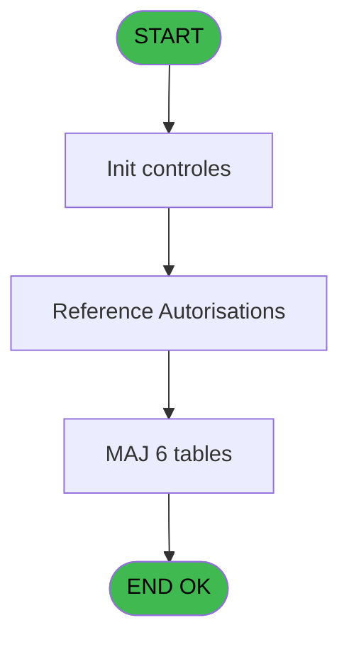
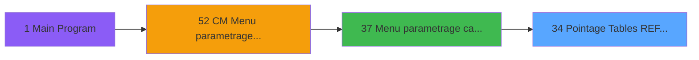
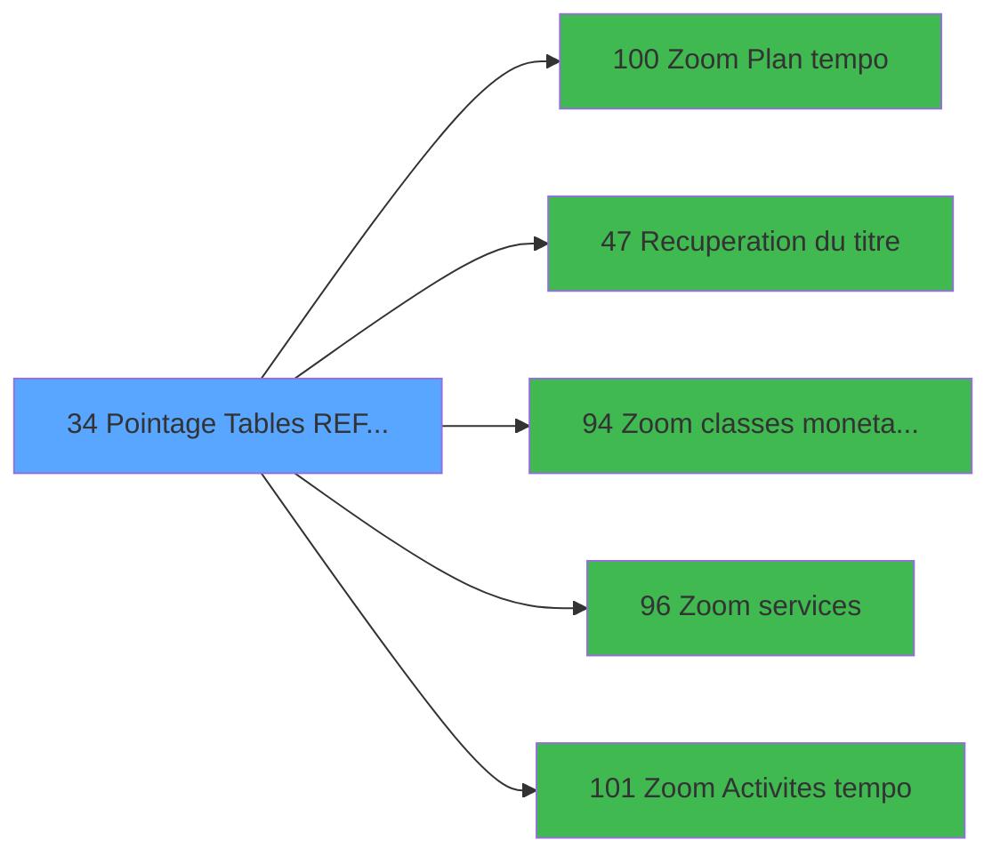

# MAI IDE 34 - Pointage Tables REF et Params

> **Analyse**: Phases 1-4 2026-02-03 14:52 -> 14:52 (10s) | Assemblage 14:52
> **Pipeline**: V7.2 Enrichi
> **Structure**: 4 onglets (Resume | Ecrans | Donnees | Connexions)

<!-- TAB:Resume -->

## 1. FICHE D'IDENTITE

| Attribut | Valeur |
|----------|--------|
| Projet | MAI |
| IDE Position | 34 |
| Nom Programme | Pointage Tables REF et Params |
| Fichier source | `Prg_34.xml` |
| Dossier IDE | Caisse |
| Taches | 48 (9 ecrans visibles) |
| Tables modifiees | 6 |
| Programmes appeles | 5 |

## 2. DESCRIPTION FONCTIONNELLE

**Pointage Tables REF et Params** assure la gestion complete de ce processus, accessible depuis [Menu parametrage caisse (IDE 37)](MAI-IDE-37.md).

Le flux de traitement s'organise en **4 blocs fonctionnels** :

- **Traitement** (27 taches) : traitements metier divers
- **Reglement** (10 taches) : gestion des moyens de paiement et reglements
- **Validation** (8 taches) : controles et verifications de coherence
- **Calcul** (3 taches) : calculs de montants, stocks ou compteurs

**Donnees modifiees** : 6 tables en ecriture (droits_applications, droit_par_utilisateurs, email_parametres, message_erreur, parametre_generaux, param_retail).

**Logique metier** : 1 regles identifiees couvrant valeurs par defaut.

Detail : phases du traitement

#### Phase 1 : Traitement (27 taches)

- **34** - Pointage Tables REF et Params **[[ECRAN]](#ecran-t1)**
- **34.1.1** - Del void records
- **34.1.2.1** - Abandon
- **34.1.3** - control
- **34.2** - FIN **[[ECRAN]](#ecran-t12)**
- **34.2.1** - Del void records
- **34.2.2.1** - Abandon
- **34.2.3** - control
- **34.3** - ACT
- **34.3.1** - Del void records
- **34.3.1.1** - Supp SER vides
- **34.3.1.2** - Supp ACT vides
- **34.3.2** - Reference Activite service **[[ECRAN]](#ecran-t26)**
- **34.3.2.1** - Abandon
- **34.3.2.3** - sans service **[[ECRAN]](#ecran-t29)**
- **34.3.2.4** - sans service batch **[[ECRAN]](#ecran-t30)**
- **34.3.3** - control
- **34.4** - Reference Autorisations **[[ECRAN]](#ecran-t32)**
- **34.4.1** - Quitter
- **34.5.1** - Quitter
- **34.6.1** - Quitter
- **34.7** - Paramètres **[[ECRAN]](#ecran-t41)**
- **34.7.1** - Load params
- **34.7.2** - Quitter
- **34.8** - Confirmation **[[ECRAN]](#ecran-t45)**
- **34.8.1** - Quitter
- **34.8.3** - Abandon

Delegue a : [Recuperation du titre (IDE 47)](MAI-IDE-47.md)

#### Phase 2 : Reglement (10 taches)

- **34.1** - MOP **[[ECRAN]](#ecran-t2)**
- **34.1.1.1** - MOP code blanc
- **34.1.1.2** - MOP class blanc
- **34.1.1.3** - MOP lib blanc
- **34.1.1.4** - MOP cpte blanc
- **34.1.2** - Moyens de paiement **[[ECRAN]](#ecran-t8)**
- **34.2.1.1** - MOP code blanc
- **34.2.1.2** - MOP class blanc
- **34.2.1.3** - MOP lib blanc
- **34.2.1.4** - MOP cpte blanc

#### Phase 3 : Validation (8 taches)

- **34.1.2.2** - Valider
- **34.2.2.2** - Valider
- **34.3.2.2** - Valider
- **34.4.2** - Valider
- **34.5.2** - Valider
- **34.6.2** - Valider
- **34.7.3** - Valider
- **34.8.2** - Valider

#### Phase 4 : Calcul (3 taches)

- **34.2.2** - Comptes financiers **[[ECRAN]](#ecran-t18)**
- **34.5** - Comptes de bilan par service **[[ECRAN]](#ecran-t35)**
- **34.6** - Qualification comptes de bilan **[[ECRAN]](#ecran-t38)**

#### Tables impactees

| Table | Operations | Role metier |
|-------|-----------|-------------|
| parametre_generaux | R/**W**/L (6 usages) |  |
| message_erreur | R/**W**/L (6 usages) |  |
| droit_par_utilisateurs | R/**W**/L (6 usages) | Droits operateur |
| droits_applications | R/**W** (2 usages) | Droits operateur |
| email_parametres | **W** (1 usages) |  |
| param_retail | **W** (1 usages) |  |

## 3. BLOCS FONCTIONNELS

### 3.1 Traitement (27 taches)

Traitements internes.

---

#### 34 - Pointage Tables REF et Params [[ECRAN]](#ecran-t1)

**Role** : Tache d'orchestration : point d'entree du programme (27 sous-taches). Coordonne l'enchainement des traitements.
**Ecran** : 640 x 0 DLU (MDI) | [Voir mockup](#ecran-t1)

26 sous-taches directes

| Tache | Nom | Bloc |
|-------|-----|------|
| [34.1.1](#t3) | Del void records | Traitement |
| [34.1.2.1](#t9) | Abandon | Traitement |
| [34.1.3](#t11) | control | Traitement |
| [34.2](#t12) | FIN **[[ECRAN]](#ecran-t12)** | Traitement |
| [34.2.1](#t13) | Del void records | Traitement |
| [34.2.2.1](#t19) | Abandon | Traitement |
| [34.2.3](#t21) | control | Traitement |
| [34.3](#t22) | ACT | Traitement |
| [34.3.1](#t23) | Del void records | Traitement |
| [34.3.1.1](#t24) | Supp SER vides | Traitement |
| [34.3.1.2](#t25) | Supp ACT vides | Traitement |
| [34.3.2](#t26) | Reference Activite service **[[ECRAN]](#ecran-t26)** | Traitement |
| [34.3.2.1](#t27) | Abandon | Traitement |
| [34.3.2.3](#t29) | sans service **[[ECRAN]](#ecran-t29)** | Traitement |
| [34.3.2.4](#t30) | sans service batch **[[ECRAN]](#ecran-t30)** | Traitement |
| [34.3.3](#t31) | control | Traitement |
| [34.4](#t32) | Reference Autorisations **[[ECRAN]](#ecran-t32)** | Traitement |
| [34.4.1](#t33) | Quitter | Traitement |
| [34.5.1](#t36) | Quitter | Traitement |
| [34.6.1](#t39) | Quitter | Traitement |
| [34.7](#t41) | Paramètres **[[ECRAN]](#ecran-t41)** | Traitement |
| [34.7.1](#t42) | Load params | Traitement |
| [34.7.2](#t43) | Quitter | Traitement |
| [34.8](#t45) | Confirmation **[[ECRAN]](#ecran-t45)** | Traitement |
| [34.8.1](#t46) | Quitter | Traitement |
| [34.8.3](#t48) | Abandon | Traitement |

---

#### 34.1.1 - Del void records

**Role** : Traitement : Del void records.

---

#### 34.1.2.1 - Abandon

**Role** : Traitement : Abandon.
**Variables liees** : B (Param Abandon), D (abandon MOP), E (abandon FINANCIER), F (abandon ACT/SER), G (abandon AUT)

---

#### 34.1.3 - control

**Role** : Traitement : control.

---

#### 34.2 - FIN [[ECRAN]](#ecran-t12)

**Role** : Traitement interne.
**Ecran** : 800 x 0 DLU (MDI) | [Voir mockup](#ecran-t12)

---

#### 34.2.1 - Del void records

**Role** : Traitement : Del void records.

---

#### 34.2.2.1 - Abandon

**Role** : Traitement : Abandon.
**Variables liees** : B (Param Abandon), D (abandon MOP), E (abandon FINANCIER), F (abandon ACT/SER), G (abandon AUT)

---

#### 34.2.3 - control

**Role** : Traitement : control.

---

#### 34.3 - ACT

**Role** : Traitement interne.

---

#### 34.3.1 - Del void records

**Role** : Traitement : Del void records.

---

#### 34.3.1.1 - Supp SER vides

**Role** : Traitement : Supp SER vides.

---

#### 34.3.1.2 - Supp ACT vides

**Role** : Traitement : Supp ACT vides.

---

#### 34.3.2 - Reference Activite service [[ECRAN]](#ecran-t26)

**Role** : Traitement : Reference Activite service.
**Ecran** : 805 x 202 DLU (MDI) | [Voir mockup](#ecran-t26)

---

#### 34.3.2.1 - Abandon

**Role** : Traitement : Abandon.
**Variables liees** : B (Param Abandon), D (abandon MOP), E (abandon FINANCIER), F (abandon ACT/SER), G (abandon AUT)

---

#### 34.3.2.3 - sans service [[ECRAN]](#ecran-t29)

**Role** : Traitement : sans service.
**Ecran** : 400 x 0 DLU (MDI) | [Voir mockup](#ecran-t29)

---

#### 34.3.2.4 - sans service batch [[ECRAN]](#ecran-t30)

**Role** : Traitement : sans service batch.
**Ecran** : 400 x 0 DLU (MDI) | [Voir mockup](#ecran-t30)

---

#### 34.3.3 - control

**Role** : Traitement : control.

---

#### 34.4 - Reference Autorisations [[ECRAN]](#ecran-t32)

**Role** : Traitement : Reference Autorisations.
**Ecran** : 806 x 203 DLU (MDI) | [Voir mockup](#ecran-t32)

---

#### 34.4.1 - Quitter

**Role** : Traitement : Quitter.

---

#### 34.5.1 - Quitter

**Role** : Traitement : Quitter.

---

#### 34.6.1 - Quitter

**Role** : Traitement : Quitter.

---

#### 34.7 - Paramètres [[ECRAN]](#ecran-t41)

**Role** : Traitement : Paramètres.
**Ecran** : 806 x 204 DLU (MDI) | [Voir mockup](#ecran-t41)

---

#### 34.7.1 - Load params

**Role** : Traitement : Load params.

---

#### 34.7.2 - Quitter

**Role** : Traitement : Quitter.

---

#### 34.8 - Confirmation [[ECRAN]](#ecran-t45)

**Role** : Traitement : Confirmation.
**Ecran** : 803 x 202 DLU (MDI) | [Voir mockup](#ecran-t45)

---

#### 34.8.1 - Quitter

**Role** : Traitement : Quitter.

---

#### 34.8.3 - Abandon

**Role** : Traitement : Abandon.
**Variables liees** : B (Param Abandon), D (abandon MOP), E (abandon FINANCIER), F (abandon ACT/SER), G (abandon AUT)

### 3.2 Reglement (10 taches)

Gestion des moyens de paiement : 10 taches de reglement.

---

#### 34.1 - MOP [[ECRAN]](#ecran-t2)

**Role** : Gestion du reglement et moyens de paiement.
**Ecran** : 800 x 0 DLU (MDI) | [Voir mockup](#ecran-t2)

---

#### 34.1.1.1 - MOP code blanc

**Role** : Traitement : MOP code blanc.

---

#### 34.1.1.2 - MOP class blanc

**Role** : Traitement : MOP class blanc.

---

#### 34.1.1.3 - MOP lib blanc

**Role** : Traitement : MOP lib blanc.

---

#### 34.1.1.4 - MOP cpte blanc

**Role** : Traitement : MOP cpte blanc.
**Variables liees** : I (abandon QUA/CPTE BILANN), P (validation QUA/CPTE BILANN)

---

#### 34.1.2 - Moyens de paiement [[ECRAN]](#ecran-t8)

**Role** : Gestion du reglement : Moyens de paiement.
**Ecran** : 806 x 204 DLU (MDI) | [Voir mockup](#ecran-t8)

---

#### 34.2.1.1 - MOP code blanc

**Role** : Traitement : MOP code blanc.

---

#### 34.2.1.2 - MOP class blanc

**Role** : Traitement : MOP class blanc.

---

#### 34.2.1.3 - MOP lib blanc

**Role** : Traitement : MOP lib blanc.

---

#### 34.2.1.4 - MOP cpte blanc

**Role** : Traitement : MOP cpte blanc.
**Variables liees** : I (abandon QUA/CPTE BILANN), P (validation QUA/CPTE BILANN)

### 3.3 Validation (8 taches)

Controles de coherence : 8 taches verifient les donnees et conditions.

---

#### 34.1.2.2 - Valider

**Role** : Verification : Valider.

---

#### 34.2.2.2 - Valider

**Role** : Verification : Valider.

---

#### 34.3.2.2 - Valider

**Role** : Verification : Valider.

---

#### 34.4.2 - Valider

**Role** : Verification : Valider.

---

#### 34.5.2 - Valider

**Role** : Verification : Valider.

---

#### 34.6.2 - Valider

**Role** : Verification : Valider.

---

#### 34.7.3 - Valider

**Role** : Verification : Valider.

---

#### 34.8.2 - Valider

**Role** : Verification : Valider.

### 3.4 Calcul (3 taches)

Calculs metier : montants, stocks, compteurs.

---

#### 34.2.2 - Comptes financiers [[ECRAN]](#ecran-t18)

**Role** : Traitement : Comptes financiers.
**Ecran** : 808 x 204 DLU (MDI) | [Voir mockup](#ecran-t18)

---

#### 34.5 - Comptes de bilan par service [[ECRAN]](#ecran-t35)

**Role** : Traitement : Comptes de bilan par service.
**Ecran** : 805 x 202 DLU (MDI) | [Voir mockup](#ecran-t35)
**Variables liees** : I (abandon QUA/CPTE BILANN), P (validation QUA/CPTE BILANN)

---

#### 34.6 - Qualification comptes de bilan [[ECRAN]](#ecran-t38)

**Role** : Traitement : Qualification comptes de bilan.
**Ecran** : 805 x 202 DLU (MDI) | [Voir mockup](#ecran-t38)
**Variables liees** : I (abandon QUA/CPTE BILANN), P (validation QUA/CPTE BILANN)

## 5. REGLES METIER

1 regles identifiees:

### Autres (1 regles)

#### [RM-001] Valeur par defaut si Param societe [A] est vide

| Element | Detail |
|---------|--------|
| **Condition** | `Param societe [A]=''` |
| **Si vrai** | 'C' |
| **Si faux** | Param societe [A]) |
| **Variables** | A (Param societe) |
| **Expression source** | Expression 1 : `IF (Param societe [A]='','C',Param societe [A])` |
| **Exemple** | Si Param societe [A]='' → 'C'. Sinon → Param societe [A]) |

## 6. CONTEXTE

- **Appele par**: [Menu parametrage caisse (IDE 37)](MAI-IDE-37.md)
- **Appelle**: 5 programmes | **Tables**: 11 (W:6 R:7 L:6) | **Taches**: 48 | **Expressions**: 2

<!-- TAB:Ecrans -->

## 8. ECRANS

### 8.1 Forms visibles (9 / 48)

| # | Position | Tache | Nom | Type | Largeur | Hauteur | Bloc |
|---|----------|-------|-----|------|---------|---------|------|
| 1 | 34.1.2 | 34.1.2 | Moyens de paiement | MDI | 806 | 204 | Reglement |
| 2 | 34.2.2 | 34.2.2 | Comptes financiers | MDI | 808 | 204 | Calcul |
| 3 | 34.3.2 | 34.3.2 | Reference Activite service | MDI | 805 | 202 | Traitement |
| 4 | 34.3.2.3 | 34.3.2.3 | sans service | MDI | 400 | 0 | Traitement |
| 5 | 34.4 | 34.4 | Reference Autorisations | MDI | 806 | 203 | Traitement |
| 6 | 34.5 | 34.5 | Comptes de bilan par service | MDI | 805 | 202 | Calcul |
| 7 | 34.6 | 34.6 | Qualification comptes de bilan | MDI | 805 | 202 | Calcul |
| 8 | 34.7 | 34.7 | Paramètres | MDI | 806 | 204 | Traitement |
| 9 | 34.8 | 34.8 | Confirmation | MDI | 803 | 202 | Traitement |

### 8.2 Mockups Ecrans

---

#### 34.1.2 - Moyens de paiement
**Tache** : [34.1.2](#t8) | **Type** : MDI | **Dimensions** : 806 x 204 DLU
**Bloc** : Reglement | **Titre IDE** : Moyens de paiement

<!-- FORM-DATA:
{
    "width":  806,
    "vFactor":  8,
    "type":  "MDI",
    "hFactor":  8,
    "controls":  [
                     {
                         "x":  0,
                         "type":  "label",
                         "var":  "",
                         "y":  0,
                         "w":  800,
                         "fmt":  "",
                         "name":  "",
                         "h":  19,
                         "color":  "",
                         "text":  "",
                         "parent":  null
                     },
                     {
                         "x":  377,
                         "type":  "label",
                         "var":  "",
                         "y":  1,
                         "w":  47,
                         "fmt":  "",
                         "name":  "",
                         "h":  17,
                         "color":  "",
                         "text":  "1",
                         "parent":  null
                     },
                     {
                         "x":  2,
                         "type":  "table",
                         "var":  "",
                         "name":  "",
                         "titleH":  11,
                         "color":  "110",
                         "w":  797,
                         "y":  37,
                         "fmt":  "",
                         "parent":  null,
                         "text":  "",
                         "rowH":  11,
                         "h":  121,
                         "cols":  [
                                      {
                                          "title":  "Table",
                                          "layer":  1,
                                          "w":  91
                                      },
                                      {
                                          "title":  "Code",
                                          "layer":  2,
                                          "w":  109
                                      },
                                      {
                                          "title":  "Numéro",
                                          "layer":  3,
                                          "w":  132
                                      },
                                      {
                                          "title":  "Classe",
                                          "layer":  4,
                                          "w":  89
                                      },
                                      {
                                          "title":  "Libellé",
                                          "layer":  5,
                                          "w":  240
                                      },
                                      {
                                          "title":  "Compte",
                                          "layer":  6,
                                          "w":  101
                                      }
                                  ],
                         "rows":  6
                     },
                     {
                         "x":  0,
                         "type":  "label",
                         "var":  "",
                         "y":  181,
                         "w":  800,
                         "fmt":  "",
                         "name":  "",
                         "h":  19,
                         "color":  "",
                         "text":  "",
                         "parent":  null
                     },
                     {
                         "x":  142,
                         "type":  "button",
                         "var":  "",
                         "y":  184,
                         "w":  250,
                         "fmt":  "",
                         "name":  "Bouton stopCreation",
                         "h":  14,
                         "color":  "",
                         "text":  "",
                         "parent":  null
                     },
                     {
                         "x":  10,
                         "type":  "edit",
                         "var":  "",
                         "y":  50,
                         "w":  82,
                         "fmt":  "",
                         "name":  "",
                         "h":  8,
                         "color":  "110",
                         "text":  "",
                         "parent":  5
                     },
                     {
                         "x":  101,
                         "type":  "edit",
                         "var":  "",
                         "y":  50,
                         "w":  100,
                         "fmt":  "",
                         "name":  "TAB code alpha5",
                         "h":  8,
                         "color":  "110",
                         "text":  "",
                         "parent":  5
                     },
                     {
                         "x":  211,
                         "type":  "edit",
                         "var":  "",
                         "y":  50,
                         "w":  116,
                         "fmt":  "",
                         "name":  "",
                         "h":  8,
                         "color":  "110",
                         "text":  "",
                         "parent":  5
                     },
                     {
                         "x":  341,
                         "type":  "edit",
                         "var":  "",
                         "y":  50,
                         "w":  78,
                         "fmt":  "",
                         "name":  "TAB classe",
                         "h":  8,
                         "color":  "110",
                         "text":  "",
                         "parent":  5
                     },
                     {
                         "x":  426,
                         "type":  "edit",
                         "var":  "",
                         "y":  50,
                         "w":  234,
                         "fmt":  "",
                         "name":  "TAB libelle20",
                         "h":  8,
                         "color":  "110",
                         "text":  "",
                         "parent":  5
                     },
                     {
                         "x":  670,
                         "type":  "edit",
                         "var":  "",
                         "y":  50,
                         "w":  86,
                         "fmt":  "",
                         "name":  "TAB compte",
                         "h":  8,
                         "color":  "110",
                         "text":  "",
                         "parent":  5
                     },
                     {
                         "x":  2,
                         "type":  "edit",
                         "var":  "",
                         "y":  5,
                         "w":  240,
                         "fmt":  "30",
                         "name":  "",
                         "h":  8,
                         "color":  "",
                         "text":  "",
                         "parent":  null
                     },
                     {
                         "x":  551,
                         "type":  "edit",
                         "var":  "",
                         "y":  5,
                         "w":  240,
                         "fmt":  "WWW DD MMM YYYYT",
                         "name":  "",
                         "h":  8,
                         "color":  "",
                         "text":  "",
                         "parent":  null
                     },
                     {
                         "x":  2,
                         "type":  "button",
                         "var":  "",
                         "y":  184,
                         "w":  128,
                         "fmt":  "Abandon",
                         "name":  "A1",
                         "h":  14,
                         "color":  "",
                         "text":  "",
                         "parent":  null
                     },
                     {
                         "x":  273,
                         "type":  "button",
                         "var":  "",
                         "y":  184,
                         "w":  122,
                         "fmt":  "Creation",
                         "name":  "",
                         "h":  14,
                         "color":  "",
                         "text":  "",
                         "parent":  null
                     },
                     {
                         "x":  404,
                         "type":  "button",
                         "var":  "",
                         "y":  184,
                         "w":  122,
                         "fmt":  "Modification",
                         "name":  "",
                         "h":  14,
                         "color":  "",
                         "text":  "",
                         "parent":  null
                     },
                     {
                         "x":  536,
                         "type":  "button",
                         "var":  "",
                         "y":  184,
                         "w":  122,
                         "fmt":  "Suppression",
                         "name":  "",
                         "h":  14,
                         "color":  "",
                         "text":  "",
                         "parent":  null
                     },
                     {
                         "x":  663,
                         "type":  "button",
                         "var":  "",
                         "y":  184,
                         "w":  128,
                         "fmt":  "Validation",
                         "name":  "V1",
                         "h":  14,
                         "color":  "",
                         "text":  "",
                         "parent":  null
                     }
                 ],
    "taskId":  "34.1.2",
    "height":  204
}
-->

<strong>Champs : 8 champs</strong>

| Pos (x,y) | Nom | Variable | Type |
|-----------|-----|----------|------|
| 10,50 | (sans nom) | - | edit |
| 101,50 | TAB code alpha5 | - | edit |
| 211,50 | (sans nom) | - | edit |
| 341,50 | TAB classe | - | edit |
| 426,50 | TAB libelle20 | - | edit |
| 670,50 | TAB compte | - | edit |
| 2,5 | 30 | - | edit |
| 551,5 | WWW DD MMM YYYYT | - | edit |

<strong>Boutons : 6 boutons</strong>

| Bouton | Pos (x,y) | Action |
|--------|-----------|--------|
| stopCreation | 142,184 | Bouton fonctionnel |
| Abandon | 2,184 | Annule et retour au menu |
| Creation | 273,184 | Bouton fonctionnel |
| Modification | 404,184 | Modifie l'element |
| Suppression | 536,184 | Supprime l'element selectionne |
| Validation | 663,184 | Valide la saisie et enregistre |

---

#### 34.2.2 - Comptes financiers
**Tache** : [34.2.2](#t18) | **Type** : MDI | **Dimensions** : 808 x 204 DLU
**Bloc** : Calcul | **Titre IDE** : Comptes financiers

<!-- FORM-DATA:
{
    "width":  808,
    "vFactor":  8,
    "type":  "MDI",
    "hFactor":  8,
    "controls":  [
                     {
                         "x":  0,
                         "type":  "label",
                         "var":  "",
                         "y":  0,
                         "w":  800,
                         "fmt":  "",
                         "name":  "",
                         "h":  19,
                         "color":  "",
                         "text":  "",
                         "parent":  null
                     },
                     {
                         "x":  377,
                         "type":  "label",
                         "var":  "",
                         "y":  1,
                         "w":  47,
                         "fmt":  "",
                         "name":  "",
                         "h":  17,
                         "color":  "",
                         "text":  "2",
                         "parent":  null
                     },
                     {
                         "x":  2,
                         "type":  "table",
                         "var":  "",
                         "name":  "",
                         "titleH":  11,
                         "color":  "110",
                         "w":  797,
                         "y":  26,
                         "fmt":  "",
                         "parent":  null,
                         "text":  "",
                         "rowH":  11,
                         "h":  151,
                         "cols":  [
                                      {
                                          "title":  "Table",
                                          "layer":  1,
                                          "w":  91
                                      },
                                      {
                                          "title":  "Code",
                                          "layer":  2,
                                          "w":  112
                                      },
                                      {
                                          "title":  "Numéro",
                                          "layer":  3,
                                          "w":  129
                                      },
                                      {
                                          "title":  "Classe",
                                          "layer":  4,
                                          "w":  89
                                      },
                                      {
                                          "title":  "Libellé",
                                          "layer":  5,
                                          "w":  240
                                      },
                                      {
                                          "title":  "Compte",
                                          "layer":  6,
                                          "w":  101
                                      }
                                  ],
                         "rows":  6
                     },
                     {
                         "x":  0,
                         "type":  "label",
                         "var":  "",
                         "y":  181,
                         "w":  800,
                         "fmt":  "",
                         "name":  "",
                         "h":  19,
                         "color":  "",
                         "text":  "",
                         "parent":  null
                     },
                     {
                         "x":  142,
                         "type":  "button",
                         "var":  "",
                         "y":  184,
                         "w":  250,
                         "fmt":  "",
                         "name":  "Bouton stopCreation",
                         "h":  14,
                         "color":  "",
                         "text":  "",
                         "parent":  null
                     },
                     {
                         "x":  10,
                         "type":  "edit",
                         "var":  "",
                         "y":  40,
                         "w":  82,
                         "fmt":  "",
                         "name":  "",
                         "h":  8,
                         "color":  "110",
                         "text":  "",
                         "parent":  5
                     },
                     {
                         "x":  101,
                         "type":  "edit",
                         "var":  "",
                         "y":  40,
                         "w":  100,
                         "fmt":  "",
                         "name":  "TAB code alpha5",
                         "h":  8,
                         "color":  "110",
                         "text":  "",
                         "parent":  5
                     },
                     {
                         "x":  211,
                         "type":  "edit",
                         "var":  "",
                         "y":  40,
                         "w":  116,
                         "fmt":  "",
                         "name":  "",
                         "h":  8,
                         "color":  "110",
                         "text":  "",
                         "parent":  5
                     },
                     {
                         "x":  341,
                         "type":  "edit",
                         "var":  "",
                         "y":  40,
                         "w":  78,
                         "fmt":  "",
                         "name":  "TAB classe",
                         "h":  8,
                         "color":  "110",
                         "text":  "",
                         "parent":  5
                     },
                     {
                         "x":  426,
                         "type":  "edit",
                         "var":  "",
                         "y":  40,
                         "w":  234,
                         "fmt":  "UX19",
                         "name":  "TAB libelle20",
                         "h":  8,
                         "color":  "110",
                         "text":  "",
                         "parent":  5
                     },
                     {
                         "x":  670,
                         "type":  "edit",
                         "var":  "",
                         "y":  40,
                         "w":  86,
                         "fmt":  "",
                         "name":  "TAB compte",
                         "h":  8,
                         "color":  "110",
                         "text":  "",
                         "parent":  5
                     },
                     {
                         "x":  2,
                         "type":  "edit",
                         "var":  "",
                         "y":  5,
                         "w":  240,
                         "fmt":  "30",
                         "name":  "",
                         "h":  8,
                         "color":  "",
                         "text":  "",
                         "parent":  null
                     },
                     {
                         "x":  551,
                         "type":  "edit",
                         "var":  "",
                         "y":  5,
                         "w":  240,
                         "fmt":  "WWW DD MMM YYYYT",
                         "name":  "",
                         "h":  8,
                         "color":  "",
                         "text":  "",
                         "parent":  null
                     },
                     {
                         "x":  2,
                         "type":  "button",
                         "var":  "",
                         "y":  184,
                         "w":  128,
                         "fmt":  "Abandon",
                         "name":  "A1",
                         "h":  14,
                         "color":  "",
                         "text":  "",
                         "parent":  null
                     },
                     {
                         "x":  273,
                         "type":  "button",
                         "var":  "",
                         "y":  184,
                         "w":  122,
                         "fmt":  "Creation",
                         "name":  "",
                         "h":  14,
                         "color":  "",
                         "text":  "",
                         "parent":  null
                     },
                     {
                         "x":  404,
                         "type":  "button",
                         "var":  "",
                         "y":  184,
                         "w":  122,
                         "fmt":  "Modification",
                         "name":  "",
                         "h":  14,
                         "color":  "",
                         "text":  "",
                         "parent":  null
                     },
                     {
                         "x":  536,
                         "type":  "button",
                         "var":  "",
                         "y":  184,
                         "w":  122,
                         "fmt":  "Suppression",
                         "name":  "",
                         "h":  14,
                         "color":  "",
                         "text":  "",
                         "parent":  null
                     },
                     {
                         "x":  663,
                         "type":  "button",
                         "var":  "",
                         "y":  184,
                         "w":  128,
                         "fmt":  "Validation",
                         "name":  "V1",
                         "h":  14,
                         "color":  "",
                         "text":  "",
                         "parent":  null
                     }
                 ],
    "taskId":  "34.2.2",
    "height":  204
}
-->

<strong>Champs : 8 champs</strong>

| Pos (x,y) | Nom | Variable | Type |
|-----------|-----|----------|------|
| 10,40 | (sans nom) | - | edit |
| 101,40 | TAB code alpha5 | - | edit |
| 211,40 | (sans nom) | - | edit |
| 341,40 | TAB classe | - | edit |
| 426,40 | TAB libelle20 | - | edit |
| 670,40 | TAB compte | - | edit |
| 2,5 | 30 | - | edit |
| 551,5 | WWW DD MMM YYYYT | - | edit |

<strong>Boutons : 6 boutons</strong>

| Bouton | Pos (x,y) | Action |
|--------|-----------|--------|
| stopCreation | 142,184 | Bouton fonctionnel |
| Abandon | 2,184 | Annule et retour au menu |
| Creation | 273,184 | Bouton fonctionnel |
| Modification | 404,184 | Modifie l'element |
| Suppression | 536,184 | Supprime l'element selectionne |
| Validation | 663,184 | Valide la saisie et enregistre |

---

#### 34.3.2 - Reference Activite service
**Tache** : [34.3.2](#t26) | **Type** : MDI | **Dimensions** : 805 x 202 DLU
**Bloc** : Traitement | **Titre IDE** : Reference Activite service

<!-- FORM-DATA:
{
    "width":  805,
    "vFactor":  8,
    "type":  "MDI",
    "hFactor":  8,
    "controls":  [
                     {
                         "x":  0,
                         "type":  "label",
                         "var":  "",
                         "y":  0,
                         "w":  800,
                         "fmt":  "",
                         "name":  "",
                         "h":  19,
                         "color":  "",
                         "text":  "",
                         "parent":  null
                     },
                     {
                         "x":  377,
                         "type":  "label",
                         "var":  "",
                         "y":  1,
                         "w":  47,
                         "fmt":  "",
                         "name":  "",
                         "h":  17,
                         "color":  "",
                         "text":  "3",
                         "parent":  null
                     },
                     {
                         "x":  156,
                         "type":  "table",
                         "var":  "",
                         "name":  "",
                         "titleH":  11,
                         "color":  "110",
                         "w":  486,
                         "y":  26,
                         "fmt":  "",
                         "parent":  null,
                         "text":  "",
                         "rowH":  11,
                         "h":  128,
                         "cols":  [
                                      {
                                          "title":  "Société",
                                          "layer":  1,
                                          "w":  82
                                      },
                                      {
                                          "title":  "Activité du plan comptable",
                                          "layer":  2,
                                          "w":  224
                                      },
                                      {
                                          "title":  "Service de PMS",
                                          "layer":  3,
                                          "w":  142
                                      }
                                  ],
                         "rows":  3
                     },
                     {
                         "x":  0,
                         "type":  "label",
                         "var":  "",
                         "y":  181,
                         "w":  800,
                         "fmt":  "",
                         "name":  "",
                         "h":  19,
                         "color":  "",
                         "text":  "",
                         "parent":  null
                     },
                     {
                         "x":  143,
                         "type":  "button",
                         "var":  "",
                         "y":  184,
                         "w":  250,
                         "fmt":  "",
                         "name":  "Bouton stopCreation",
                         "h":  14,
                         "color":  "",
                         "text":  "",
                         "parent":  null
                     },
                     {
                         "x":  165,
                         "type":  "edit",
                         "var":  "",
                         "y":  39,
                         "w":  66,
                         "fmt":  "",
                         "name":  "",
                         "h":  8,
                         "color":  "110",
                         "text":  "",
                         "parent":  5
                     },
                     {
                         "x":  246,
                         "type":  "edit",
                         "var":  "",
                         "y":  39,
                         "w":  208,
                         "fmt":  "",
                         "name":  "Activite du plan comptable",
                         "h":  8,
                         "color":  "110",
                         "text":  "",
                         "parent":  5
                     },
                     {
                         "x":  155,
                         "type":  "edit",
                         "var":  "",
                         "y":  158,
                         "w":  486,
                         "fmt":  "",
                         "name":  "",
                         "h":  10,
                         "color":  "6",
                         "text":  "",
                         "parent":  null
                     },
                     {
                         "x":  470,
                         "type":  "edit",
                         "var":  "",
                         "y":  39,
                         "w":  132,
                         "fmt":  "",
                         "name":  "Service de PMS",
                         "h":  8,
                         "color":  "110",
                         "text":  "",
                         "parent":  5
                     },
                     {
                         "x":  155,
                         "type":  "edit",
                         "var":  "",
                         "y":  169,
                         "w":  486,
                         "fmt":  "",
                         "name":  "",
                         "h":  10,
                         "color":  "6",
                         "text":  "",
                         "parent":  null
                     },
                     {
                         "x":  6,
                         "type":  "edit",
                         "var":  "",
                         "y":  5,
                         "w":  240,
                         "fmt":  "30",
                         "name":  "",
                         "h":  8,
                         "color":  "",
                         "text":  "",
                         "parent":  null
                     },
                     {
                         "x":  551,
                         "type":  "edit",
                         "var":  "",
                         "y":  5,
                         "w":  240,
                         "fmt":  "WWW DD MMM YYYYT",
                         "name":  "",
                         "h":  8,
                         "color":  "",
                         "text":  "",
                         "parent":  null
                     },
                     {
                         "x":  645,
                         "type":  "button",
                         "var":  "",
                         "y":  141,
                         "w":  153,
                         "fmt":  "sans service",
                         "name":  "",
                         "h":  14,
                         "color":  "",
                         "text":  "",
                         "parent":  null
                     },
                     {
                         "x":  6,
                         "type":  "button",
                         "var":  "",
                         "y":  184,
                         "w":  122,
                         "fmt":  "Abandon",
                         "name":  "A3",
                         "h":  14,
                         "color":  "",
                         "text":  "",
                         "parent":  null
                     },
                     {
                         "x":  274,
                         "type":  "button",
                         "var":  "",
                         "y":  184,
                         "w":  122,
                         "fmt":  "Creation",
                         "name":  "",
                         "h":  14,
                         "color":  "",
                         "text":  "",
                         "parent":  null
                     },
                     {
                         "x":  405,
                         "type":  "button",
                         "var":  "",
                         "y":  184,
                         "w":  122,
                         "fmt":  "Modification",
                         "name":  "",
                         "h":  14,
                         "color":  "",
                         "text":  "",
                         "parent":  null
                     },
                     {
                         "x":  536,
                         "type":  "button",
                         "var":  "",
                         "y":  184,
                         "w":  122,
                         "fmt":  "Suppression",
                         "name":  "",
                         "h":  14,
                         "color":  "",
                         "text":  "",
                         "parent":  null
                     },
                     {
                         "x":  669,
                         "type":  "button",
                         "var":  "",
                         "y":  184,
                         "w":  122,
                         "fmt":  "Validation",
                         "name":  "V3",
                         "h":  14,
                         "color":  "",
                         "text":  "",
                         "parent":  null
                     }
                 ],
    "taskId":  "34.3.2",
    "height":  202
}
-->

<strong>Champs : 7 champs</strong>

| Pos (x,y) | Nom | Variable | Type |
|-----------|-----|----------|------|
| 165,39 | (sans nom) | - | edit |
| 246,39 | Activite du plan comptable | - | edit |
| 155,158 | (sans nom) | - | edit |
| 470,39 | Service de PMS | - | edit |
| 155,169 | (sans nom) | - | edit |
| 6,5 | 30 | - | edit |
| 551,5 | WWW DD MMM YYYYT | - | edit |

<strong>Boutons : 7 boutons</strong>

| Bouton | Pos (x,y) | Action |
|--------|-----------|--------|
| stopCreation | 143,184 | Bouton fonctionnel |
| sans service | 645,141 | Bouton fonctionnel |
| Abandon | 6,184 | Annule et retour au menu |
| Creation | 274,184 | Bouton fonctionnel |
| Modification | 405,184 | Modifie l'element |
| Suppression | 536,184 | Supprime l'element selectionne |
| Validation | 669,184 | Valide la saisie et enregistre |

---

#### 34.3.2.3 - sans service
**Tache** : [34.3.2.3](#t29) | **Type** : MDI | **Dimensions** : 400 x 0 DLU
**Bloc** : Traitement | **Titre IDE** : sans service

<!-- FORM-DATA:
{
    "width":  400,
    "vFactor":  8,
    "type":  "MDI",
    "hFactor":  4,
    "controls":  [
                     {
                         "x":  26,
                         "type":  "table",
                         "var":  "",
                         "name":  "",
                         "titleH":  11,
                         "color":  "110",
                         "w":  349,
                         "y":  8,
                         "fmt":  "",
                         "parent":  null,
                         "text":  "",
                         "rowH":  12,
                         "h":  181,
                         "cols":  [
                                      {
                                          "title":  "Code",
                                          "layer":  1,
                                          "w":  32
                                      },
                                      {
                                          "title":  "Libellé",
                                          "layer":  2,
                                          "w":  220
                                      },
                                      {
                                          "title":  "Service de PMS",
                                          "layer":  3,
                                          "w":  79
                                      }
                                  ],
                         "rows":  3
                     },
                     {
                         "x":  30,
                         "type":  "edit",
                         "var":  "",
                         "y":  21,
                         "w":  21,
                         "fmt":  "",
                         "name":  "",
                         "h":  8,
                         "color":  "110",
                         "text":  "",
                         "parent":  1
                     },
                     {
                         "x":  62,
                         "type":  "edit",
                         "var":  "",
                         "y":  21,
                         "w":  212,
                         "fmt":  "",
                         "name":  "",
                         "h":  8,
                         "color":  "110",
                         "text":  "",
                         "parent":  1
                     },
                     {
                         "x":  285,
                         "type":  "edit",
                         "var":  "",
                         "y":  21,
                         "w":  66,
                         "fmt":  "",
                         "name":  "",
                         "h":  8,
                         "color":  "110",
                         "text":  "",
                         "parent":  1
                     }
                 ],
    "taskId":  "34.3.2.3",
    "height":  0
}
-->

<strong>Champs : 3 champs</strong>

| Pos (x,y) | Nom | Variable | Type |
|-----------|-----|----------|------|
| 30,21 | (sans nom) | - | edit |
| 62,21 | (sans nom) | - | edit |
| 285,21 | (sans nom) | - | edit |

---

#### 34.4 - Reference Autorisations
**Tache** : [34.4](#t32) | **Type** : MDI | **Dimensions** : 806 x 203 DLU
**Bloc** : Traitement | **Titre IDE** : Reference Autorisations

<!-- FORM-DATA:
{
    "width":  806,
    "vFactor":  8,
    "type":  "MDI",
    "hFactor":  8,
    "controls":  [
                     {
                         "x":  0,
                         "type":  "label",
                         "var":  "",
                         "y":  0,
                         "w":  800,
                         "fmt":  "",
                         "name":  "",
                         "h":  19,
                         "color":  "",
                         "text":  "",
                         "parent":  null
                     },
                     {
                         "x":  377,
                         "type":  "label",
                         "var":  "",
                         "y":  1,
                         "w":  47,
                         "fmt":  "",
                         "name":  "",
                         "h":  17,
                         "color":  "",
                         "text":  "4",
                         "parent":  null
                     },
                     {
                         "x":  158,
                         "type":  "table",
                         "var":  "",
                         "name":  "",
                         "titleH":  11,
                         "color":  "110",
                         "w":  485,
                         "y":  25,
                         "fmt":  "",
                         "parent":  null,
                         "text":  "",
                         "rowH":  12,
                         "h":  148,
                         "cols":  [
                                      {
                                          "title":  "MOP",
                                          "layer":  1,
                                          "w":  82
                                      },
                                      {
                                          "title":  "Versement",
                                          "layer":  2,
                                          "w":  125
                                      },
                                      {
                                          "title":  "Solde",
                                          "layer":  3,
                                          "w":  113
                                      },
                                      {
                                          "title":  "Ventes",
                                          "layer":  4,
                                          "w":  127
                                      }
                                  ],
                         "rows":  4
                     },
                     {
                         "x":  0,
                         "type":  "label",
                         "var":  "",
                         "y":  181,
                         "w":  800,
                         "fmt":  "",
                         "name":  "",
                         "h":  19,
                         "color":  "",
                         "text":  "",
                         "parent":  null
                     },
                     {
                         "x":  166,
                         "type":  "edit",
                         "var":  "",
                         "y":  38,
                         "w":  66,
                         "fmt":  "",
                         "name":  "",
                         "h":  10,
                         "color":  "110",
                         "text":  "",
                         "parent":  5
                     },
                     {
                         "x":  248,
                         "type":  "edit",
                         "var":  "",
                         "y":  38,
                         "w":  112,
                         "fmt":  "",
                         "name":  "",
                         "h":  10,
                         "color":  "110",
                         "text":  "",
                         "parent":  5
                     },
                     {
                         "x":  371,
                         "type":  "edit",
                         "var":  "",
                         "y":  38,
                         "w":  101,
                         "fmt":  "",
                         "name":  "",
                         "h":  10,
                         "color":  "110",
                         "text":  "",
                         "parent":  5
                     },
                     {
                         "x":  483,
                         "type":  "edit",
                         "var":  "",
                         "y":  38,
                         "w":  118,
                         "fmt":  "",
                         "name":  "",
                         "h":  10,
                         "color":  "110",
                         "text":  "",
                         "parent":  5
                     },
                     {
                         "x":  551,
                         "type":  "edit",
                         "var":  "",
                         "y":  5,
                         "w":  240,
                         "fmt":  "WWW DD MMM YYYYT",
                         "name":  "",
                         "h":  8,
                         "color":  "",
                         "text":  "",
                         "parent":  null
                     },
                     {
                         "x":  6,
                         "type":  "button",
                         "var":  "",
                         "y":  184,
                         "w":  122,
                         "fmt":  "Abandon",
                         "name":  "",
                         "h":  14,
                         "color":  "",
                         "text":  "",
                         "parent":  null
                     },
                     {
                         "x":  669,
                         "type":  "button",
                         "var":  "",
                         "y":  184,
                         "w":  122,
                         "fmt":  "Validation",
                         "name":  "",
                         "h":  14,
                         "color":  "",
                         "text":  "",
                         "parent":  null
                     },
                     {
                         "x":  6,
                         "type":  "edit",
                         "var":  "",
                         "y":  5,
                         "w":  240,
                         "fmt":  "30",
                         "name":  "",
                         "h":  8,
                         "color":  "",
                         "text":  "",
                         "parent":  null
                     }
                 ],
    "taskId":  "34.4",
    "height":  203
}
-->

<strong>Champs : 6 champs</strong>

| Pos (x,y) | Nom | Variable | Type |
|-----------|-----|----------|------|
| 166,38 | (sans nom) | - | edit |
| 248,38 | (sans nom) | - | edit |
| 371,38 | (sans nom) | - | edit |
| 483,38 | (sans nom) | - | edit |
| 551,5 | WWW DD MMM YYYYT | - | edit |
| 6,5 | 30 | - | edit |

<strong>Boutons : 2 boutons</strong>

| Bouton | Pos (x,y) | Action |
|--------|-----------|--------|
| Abandon | 6,184 | Annule et retour au menu |
| Validation | 669,184 | Valide la saisie et enregistre |

---

#### 34.5 - Comptes de bilan par service
**Tache** : [34.5](#t35) | **Type** : MDI | **Dimensions** : 805 x 202 DLU
**Bloc** : Calcul | **Titre IDE** : Comptes de bilan par service

<!-- FORM-DATA:
{
    "width":  805,
    "vFactor":  8,
    "type":  "MDI",
    "hFactor":  8,
    "controls":  [
                     {
                         "x":  0,
                         "type":  "label",
                         "var":  "",
                         "y":  0,
                         "w":  800,
                         "fmt":  "",
                         "name":  "",
                         "h":  19,
                         "color":  "",
                         "text":  "",
                         "parent":  null
                     },
                     {
                         "x":  377,
                         "type":  "label",
                         "var":  "",
                         "y":  1,
                         "w":  47,
                         "fmt":  "",
                         "name":  "",
                         "h":  17,
                         "color":  "",
                         "text":  "5",
                         "parent":  null
                     },
                     {
                         "x":  142,
                         "type":  "table",
                         "var":  "",
                         "name":  "",
                         "titleH":  12,
                         "color":  "110",
                         "w":  517,
                         "y":  21,
                         "fmt":  "",
                         "parent":  null,
                         "text":  "",
                         "rowH":  13,
                         "h":  144,
                         "cols":  [
                                      {
                                          "title":  "Service",
                                          "layer":  1,
                                          "w":  82
                                      },
                                      {
                                          "title":  "Libellé service",
                                          "layer":  2,
                                          "w":  284
                                      },
                                      {
                                          "title":  "Compte bilan",
                                          "layer":  3,
                                          "w":  119
                                      }
                                  ],
                         "rows":  3
                     },
                     {
                         "x":  0,
                         "type":  "label",
                         "var":  "",
                         "y":  181,
                         "w":  800,
                         "fmt":  "",
                         "name":  "",
                         "h":  19,
                         "color":  "",
                         "text":  "",
                         "parent":  null
                     },
                     {
                         "x":  147,
                         "type":  "edit",
                         "var":  "",
                         "y":  34,
                         "w":  72,
                         "fmt":  "",
                         "name":  "service Village",
                         "h":  10,
                         "color":  "110",
                         "text":  "",
                         "parent":  5
                     },
                     {
                         "x":  229,
                         "type":  "edit",
                         "var":  "",
                         "y":  34,
                         "w":  277,
                         "fmt":  "",
                         "name":  "",
                         "h":  10,
                         "color":  "110",
                         "text":  "",
                         "parent":  5
                     },
                     {
                         "x":  514,
                         "type":  "edit",
                         "var":  "",
                         "y":  34,
                         "w":  109,
                         "fmt":  "### ###",
                         "name":  "compte bilan",
                         "h":  10,
                         "color":  "110",
                         "text":  "",
                         "parent":  5
                     },
                     {
                         "x":  144,
                         "type":  "edit",
                         "var":  "",
                         "y":  168,
                         "w":  512,
                         "fmt":  "",
                         "name":  "",
                         "h":  10,
                         "color":  "6",
                         "text":  "",
                         "parent":  null
                     },
                     {
                         "x":  144,
                         "type":  "edit",
                         "var":  "",
                         "y":  168,
                         "w":  512,
                         "fmt":  "",
                         "name":  "",
                         "h":  10,
                         "color":  "6",
                         "text":  "",
                         "parent":  null
                     },
                     {
                         "x":  6,
                         "type":  "edit",
                         "var":  "",
                         "y":  5,
                         "w":  240,
                         "fmt":  "30",
                         "name":  "",
                         "h":  8,
                         "color":  "",
                         "text":  "",
                         "parent":  null
                     },
                     {
                         "x":  551,
                         "type":  "edit",
                         "var":  "",
                         "y":  5,
                         "w":  240,
                         "fmt":  "WWW DD MMM YYYYT",
                         "name":  "",
                         "h":  8,
                         "color":  "",
                         "text":  "",
                         "parent":  null
                     },
                     {
                         "x":  6,
                         "type":  "button",
                         "var":  "",
                         "y":  184,
                         "w":  122,
                         "fmt":  "Abandon",
                         "name":  "",
                         "h":  14,
                         "color":  "",
                         "text":  "",
                         "parent":  null
                     },
                     {
                         "x":  669,
                         "type":  "button",
                         "var":  "",
                         "y":  184,
                         "w":  122,
                         "fmt":  "Validation",
                         "name":  "",
                         "h":  14,
                         "color":  "",
                         "text":  "",
                         "parent":  null
                     }
                 ],
    "taskId":  "34.5",
    "height":  202
}
-->

<strong>Champs : 7 champs</strong>

| Pos (x,y) | Nom | Variable | Type |
|-----------|-----|----------|------|
| 147,34 | service Village | - | edit |
| 229,34 | (sans nom) | - | edit |
| 514,34 | compte bilan | - | edit |
| 144,168 | (sans nom) | - | edit |
| 144,168 | (sans nom) | - | edit |
| 6,5 | 30 | - | edit |
| 551,5 | WWW DD MMM YYYYT | - | edit |

<strong>Boutons : 2 boutons</strong>

| Bouton | Pos (x,y) | Action |
|--------|-----------|--------|
| Abandon | 6,184 | Annule et retour au menu |
| Validation | 669,184 | Valide la saisie et enregistre |

---

#### 34.6 - Qualification comptes de bilan
**Tache** : [34.6](#t38) | **Type** : MDI | **Dimensions** : 805 x 202 DLU
**Bloc** : Calcul | **Titre IDE** : Qualification comptes de bilan

<!-- FORM-DATA:
{
    "width":  805,
    "vFactor":  8,
    "type":  "MDI",
    "hFactor":  8,
    "controls":  [
                     {
                         "x":  0,
                         "type":  "label",
                         "var":  "",
                         "y":  0,
                         "w":  800,
                         "fmt":  "",
                         "name":  "",
                         "h":  19,
                         "color":  "",
                         "text":  "",
                         "parent":  null
                     },
                     {
                         "x":  377,
                         "type":  "label",
                         "var":  "",
                         "y":  1,
                         "w":  47,
                         "fmt":  "",
                         "name":  "",
                         "h":  17,
                         "color":  "",
                         "text":  "6",
                         "parent":  null
                     },
                     {
                         "x":  136,
                         "type":  "table",
                         "var":  "",
                         "name":  "",
                         "titleH":  12,
                         "color":  "110",
                         "w":  526,
                         "y":  27,
                         "fmt":  "",
                         "parent":  null,
                         "text":  "",
                         "rowH":  13,
                         "h":  146,
                         "cols":  [
                                      {
                                          "title":  "Service",
                                          "layer":  1,
                                          "w":  82
                                      },
                                      {
                                          "title":  "Libellé service",
                                          "layer":  2,
                                          "w":  284
                                      },
                                      {
                                          "title":  "Comptes de bilan",
                                          "layer":  3,
                                          "w":  128
                                      }
                                  ],
                         "rows":  3
                     },
                     {
                         "x":  0,
                         "type":  "label",
                         "var":  "",
                         "y":  181,
                         "w":  800,
                         "fmt":  "",
                         "name":  "",
                         "h":  19,
                         "color":  "",
                         "text":  "",
                         "parent":  null
                     },
                     {
                         "x":  141,
                         "type":  "edit",
                         "var":  "",
                         "y":  41,
                         "w":  73,
                         "fmt":  "",
                         "name":  "",
                         "h":  10,
                         "color":  "110",
                         "text":  "",
                         "parent":  5
                     },
                     {
                         "x":  224,
                         "type":  "edit",
                         "var":  "",
                         "y":  41,
                         "w":  276,
                         "fmt":  "",
                         "name":  "",
                         "h":  10,
                         "color":  "110",
                         "text":  "",
                         "parent":  5
                     },
                     {
                         "x":  550,
                         "type":  "checkbox",
                         "var":  "",
                         "y":  41,
                         "w":  27,
                         "fmt":  "",
                         "name":  "",
                         "h":  10,
                         "color":  "110",
                         "text":  "Compte bilan",
                         "parent":  5
                     },
                     {
                         "x":  551,
                         "type":  "edit",
                         "var":  "",
                         "y":  5,
                         "w":  240,
                         "fmt":  "WWW DD MMM YYYYT",
                         "name":  "",
                         "h":  8,
                         "color":  "",
                         "text":  "",
                         "parent":  null
                     },
                     {
                         "x":  6,
                         "type":  "button",
                         "var":  "",
                         "y":  184,
                         "w":  122,
                         "fmt":  "Abandon",
                         "name":  "",
                         "h":  14,
                         "color":  "",
                         "text":  "",
                         "parent":  null
                     },
                     {
                         "x":  669,
                         "type":  "button",
                         "var":  "",
                         "y":  184,
                         "w":  122,
                         "fmt":  "Validation",
                         "name":  "",
                         "h":  14,
                         "color":  "",
                         "text":  "",
                         "parent":  null
                     },
                     {
                         "x":  6,
                         "type":  "edit",
                         "var":  "",
                         "y":  5,
                         "w":  240,
                         "fmt":  "30",
                         "name":  "",
                         "h":  8,
                         "color":  "",
                         "text":  "",
                         "parent":  null
                     }
                 ],
    "taskId":  "34.6",
    "height":  202
}
-->

<strong>Champs : 5 champs</strong>

| Pos (x,y) | Nom | Variable | Type |
|-----------|-----|----------|------|
| 141,41 | (sans nom) | - | edit |
| 224,41 | (sans nom) | - | edit |
| 550,41 | Compte bilan | - | checkbox |
| 551,5 | WWW DD MMM YYYYT | - | edit |
| 6,5 | 30 | - | edit |

<strong>Boutons : 2 boutons</strong>

| Bouton | Pos (x,y) | Action |
|--------|-----------|--------|
| Abandon | 6,184 | Annule et retour au menu |
| Validation | 669,184 | Valide la saisie et enregistre |

---

#### 34.7 - Paramètres
**Tache** : [34.7](#t41) | **Type** : MDI | **Dimensions** : 806 x 204 DLU
**Bloc** : Traitement | **Titre IDE** : Paramètres

<!-- FORM-DATA:
{
    "width":  806,
    "vFactor":  8,
    "type":  "MDI",
    "hFactor":  8,
    "controls":  [
                     {
                         "x":  0,
                         "type":  "label",
                         "var":  "",
                         "y":  0,
                         "w":  800,
                         "fmt":  "",
                         "name":  "",
                         "h":  19,
                         "color":  "",
                         "text":  "",
                         "parent":  null
                     },
                     {
                         "x":  377,
                         "type":  "label",
                         "var":  "",
                         "y":  1,
                         "w":  47,
                         "fmt":  "",
                         "name":  "",
                         "h":  17,
                         "color":  "",
                         "text":  "7",
                         "parent":  null
                     },
                     {
                         "x":  8,
                         "type":  "label",
                         "var":  "",
                         "y":  26,
                         "w":  240,
                         "fmt":  "",
                         "name":  "",
                         "h":  16,
                         "color":  "",
                         "text":  "Compte ecart gain",
                         "parent":  null
                     },
                     {
                         "x":  8,
                         "type":  "label",
                         "var":  "",
                         "y":  48,
                         "w":  240,
                         "fmt":  "",
                         "name":  "",
                         "h":  16,
                         "color":  "",
                         "text":  "Compte ecart perte",
                         "parent":  null
                     },
                     {
                         "x":  8,
                         "type":  "label",
                         "var":  "",
                         "y":  70,
                         "w":  240,
                         "fmt":  "",
                         "name":  "",
                         "h":  16,
                         "color":  "",
                         "text":  "Compte fond de roulement",
                         "parent":  null
                     },
                     {
                         "x":  8,
                         "type":  "label",
                         "var":  "",
                         "y":  92,
                         "w":  240,
                         "fmt":  "",
                         "name":  "",
                         "h":  16,
                         "color":  "",
                         "text":  "Compte des versements et des retraits CASH",
                         "parent":  null
                     },
                     {
                         "x":  8,
                         "type":  "label",
                         "var":  "",
                         "y":  114,
                         "w":  240,
                         "fmt":  "",
                         "name":  "",
                         "h":  16,
                         "color":  "",
                         "text":  "Compte des versements et des retraits NON CASH",
                         "parent":  null
                     },
                     {
                         "x":  8,
                         "type":  "label",
                         "var":  "",
                         "y":  136,
                         "w":  240,
                         "fmt":  "",
                         "name":  "",
                         "h":  16,
                         "color":  "",
                         "text":  "Compte bilan mini",
                         "parent":  null
                     },
                     {
                         "x":  8,
                         "type":  "label",
                         "var":  "",
                         "y":  158,
                         "w":  240,
                         "fmt":  "",
                         "name":  "",
                         "h":  16,
                         "color":  "",
                         "text":  "Compte bilan maxi",
                         "parent":  null
                     },
                     {
                         "x":  0,
                         "type":  "label",
                         "var":  "",
                         "y":  181,
                         "w":  800,
                         "fmt":  "",
                         "name":  "",
                         "h":  19,
                         "color":  "",
                         "text":  "",
                         "parent":  null
                     },
                     {
                         "x":  257,
                         "type":  "edit",
                         "var":  "",
                         "y":  26,
                         "w":  128,
                         "fmt":  "",
                         "name":  "compteEcartGain",
                         "h":  16,
                         "color":  "6",
                         "text":  "",
                         "parent":  null
                     },
                     {
                         "x":  392,
                         "type":  "edit",
                         "var":  "",
                         "y":  26,
                         "w":  400,
                         "fmt":  "",
                         "name":  "",
                         "h":  16,
                         "color":  "7",
                         "text":  "",
                         "parent":  null
                     },
                     {
                         "x":  392,
                         "type":  "edit",
                         "var":  "",
                         "y":  26,
                         "w":  400,
                         "fmt":  "",
                         "name":  "",
                         "h":  16,
                         "color":  "7",
                         "text":  "",
                         "parent":  null
                     },
                     {
                         "x":  257,
                         "type":  "edit",
                         "var":  "",
                         "y":  48,
                         "w":  128,
                         "fmt":  "",
                         "name":  "compteEcartPerte",
                         "h":  16,
                         "color":  "6",
                         "text":  "",
                         "parent":  null
                     },
                     {
                         "x":  392,
                         "type":  "edit",
                         "var":  "",
                         "y":  48,
                         "w":  400,
                         "fmt":  "",
                         "name":  "",
                         "h":  16,
                         "color":  "7",
                         "text":  "",
                         "parent":  null
                     },
                     {
                         "x":  392,
                         "type":  "edit",
                         "var":  "",
                         "y":  48,
                         "w":  400,
                         "fmt":  "",
                         "name":  "",
                         "h":  16,
                         "color":  "7",
                         "text":  "",
                         "parent":  null
                     },
                     {
                         "x":  257,
                         "type":  "edit",
                         "var":  "",
                         "y":  70,
                         "w":  128,
                         "fmt":  "",
                         "name":  "compteFondDeRoulement",
                         "h":  16,
                         "color":  "6",
                         "text":  "",
                         "parent":  null
                     },
                     {
                         "x":  392,
                         "type":  "edit",
                         "var":  "",
                         "y":  70,
                         "w":  400,
                         "fmt":  "",
                         "name":  "",
                         "h":  16,
                         "color":  "7",
                         "text":  "",
                         "parent":  null
                     },
                     {
                         "x":  392,
                         "type":  "edit",
                         "var":  "",
                         "y":  70,
                         "w":  400,
                         "fmt":  "",
                         "name":  "",
                         "h":  16,
                         "color":  "7",
                         "text":  "",
                         "parent":  null
                     },
                     {
                         "x":  257,
                         "type":  "edit",
                         "var":  "",
                         "y":  92,
                         "w":  128,
                         "fmt":  "",
                         "name":  "compteVerRetNonCash",
                         "h":  16,
                         "color":  "6",
                         "text":  "",
                         "parent":  null
                     },
                     {
                         "x":  392,
                         "type":  "edit",
                         "var":  "",
                         "y":  92,
                         "w":  400,
                         "fmt":  "",
                         "name":  "",
                         "h":  16,
                         "color":  "7",
                         "text":  "",
                         "parent":  null
                     },
                     {
                         "x":  392,
                         "type":  "edit",
                         "var":  "",
                         "y":  92,
                         "w":  400,
                         "fmt":  "",
                         "name":  "",
                         "h":  16,
                         "color":  "7",
                         "text":  "",
                         "parent":  null
                     },
                     {
                         "x":  257,
                         "type":  "edit",
                         "var":  "",
                         "y":  114,
                         "w":  128,
                         "fmt":  "",
                         "name":  "compteVerRetCash",
                         "h":  16,
                         "color":  "6",
                         "text":  "",
                         "parent":  null
                     },
                     {
                         "x":  392,
                         "type":  "edit",
                         "var":  "",
                         "y":  114,
                         "w":  400,
                         "fmt":  "",
                         "name":  "",
                         "h":  16,
                         "color":  "7",
                         "text":  "",
                         "parent":  null
                     },
                     {
                         "x":  392,
                         "type":  "edit",
                         "var":  "",
                         "y":  114,
                         "w":  400,
                         "fmt":  "",
                         "name":  "",
                         "h":  16,
                         "color":  "7",
                         "text":  "",
                         "parent":  null
                     },
                     {
                         "x":  257,
                         "type":  "edit",
                         "var":  "",
                         "y":  136,
                         "w":  128,
                         "fmt":  "",
                         "name":  "compteBilanMini",
                         "h":  16,
                         "color":  "6",
                         "text":  "",
                         "parent":  null
                     },
                     {
                         "x":  392,
                         "type":  "edit",
                         "var":  "",
                         "y":  136,
                         "w":  400,
                         "fmt":  "",
                         "name":  "",
                         "h":  16,
                         "color":  "7",
                         "text":  "",
                         "parent":  null
                     },
                     {
                         "x":  392,
                         "type":  "edit",
                         "var":  "",
                         "y":  136,
                         "w":  400,
                         "fmt":  "",
                         "name":  "",
                         "h":  16,
                         "color":  "7",
                         "text":  "",
                         "parent":  null
                     },
                     {
                         "x":  257,
                         "type":  "edit",
                         "var":  "",
                         "y":  158,
                         "w":  128,
                         "fmt":  "",
                         "name":  "compteBilanMaxi",
                         "h":  16,
                         "color":  "6",
                         "text":  "",
                         "parent":  null
                     },
                     {
                         "x":  392,
                         "type":  "edit",
                         "var":  "",
                         "y":  158,
                         "w":  400,
                         "fmt":  "",
                         "name":  "",
                         "h":  16,
                         "color":  "7",
                         "text":  "",
                         "parent":  null
                     },
                     {
                         "x":  392,
                         "type":  "edit",
                         "var":  "",
                         "y":  158,
                         "w":  400,
                         "fmt":  "",
                         "name":  "",
                         "h":  16,
                         "color":  "7",
                         "text":  "",
                         "parent":  null
                     },
                     {
                         "x":  6,
                         "type":  "edit",
                         "var":  "",
                         "y":  5,
                         "w":  240,
                         "fmt":  "30",
                         "name":  "",
                         "h":  8,
                         "color":  "",
                         "text":  "",
                         "parent":  null
                     },
                     {
                         "x":  551,
                         "type":  "edit",
                         "var":  "",
                         "y":  5,
                         "w":  240,
                         "fmt":  "WWW DD MMM YYYYT",
                         "name":  "",
                         "h":  8,
                         "color":  "",
                         "text":  "",
                         "parent":  null
                     },
                     {
                         "x":  6,
                         "type":  "button",
                         "var":  "",
                         "y":  184,
                         "w":  122,
                         "fmt":  "Abandon",
                         "name":  "ABA",
                         "h":  14,
                         "color":  "",
                         "text":  "",
                         "parent":  null
                     },
                     {
                         "x":  669,
                         "type":  "button",
                         "var":  "",
                         "y":  184,
                         "w":  122,
                         "fmt":  "Validation",
                         "name":  "VAL",
                         "h":  14,
                         "color":  "",
                         "text":  "",
                         "parent":  null
                     }
                 ],
    "taskId":  "34.7",
    "height":  204
}
-->

<strong>Champs : 23 champs</strong>

| Pos (x,y) | Nom | Variable | Type |
|-----------|-----|----------|------|
| 257,26 | compteEcartGain | - | edit |
| 392,26 | (sans nom) | - | edit |
| 392,26 | (sans nom) | - | edit |
| 257,48 | compteEcartPerte | - | edit |
| 392,48 | (sans nom) | - | edit |
| 392,48 | (sans nom) | - | edit |
| 257,70 | compteFondDeRoulement | - | edit |
| 392,70 | (sans nom) | - | edit |
| 392,70 | (sans nom) | - | edit |
| 257,92 | compteVerRetNonCash | - | edit |
| 392,92 | (sans nom) | - | edit |
| 392,92 | (sans nom) | - | edit |
| 257,114 | compteVerRetCash | - | edit |
| 392,114 | (sans nom) | - | edit |
| 392,114 | (sans nom) | - | edit |
| 257,136 | compteBilanMini | - | edit |
| 392,136 | (sans nom) | - | edit |
| 392,136 | (sans nom) | - | edit |
| 257,158 | compteBilanMaxi | - | edit |
| 392,158 | (sans nom) | - | edit |
| 392,158 | (sans nom) | - | edit |
| 6,5 | 30 | - | edit |
| 551,5 | WWW DD MMM YYYYT | - | edit |

<strong>Boutons : 2 boutons</strong>

| Bouton | Pos (x,y) | Action |
|--------|-----------|--------|
| Abandon | 6,184 | Annule et retour au menu |
| Validation | 669,184 | Valide la saisie et enregistre |

---

#### 34.8 - Confirmation
**Tache** : [34.8](#t45) | **Type** : MDI | **Dimensions** : 803 x 202 DLU
**Bloc** : Traitement | **Titre IDE** : Confirmation

<!-- FORM-DATA:
{
    "width":  803,
    "vFactor":  8,
    "type":  "MDI",
    "hFactor":  8,
    "controls":  [
                     {
                         "x":  0,
                         "type":  "label",
                         "var":  "",
                         "y":  0,
                         "w":  800,
                         "fmt":  "",
                         "name":  "",
                         "h":  19,
                         "color":  "",
                         "text":  "",
                         "parent":  null
                     },
                     {
                         "x":  55,
                         "type":  "label",
                         "var":  "",
                         "y":  35,
                         "w":  690,
                         "fmt":  "",
                         "name":  "",
                         "h":  131,
                         "color":  "",
                         "text":  "",
                         "parent":  null
                     },
                     {
                         "x":  435,
                         "type":  "label",
                         "var":  "",
                         "y":  42,
                         "w":  128,
                         "fmt":  "",
                         "name":  "",
                         "h":  12,
                         "color":  "",
                         "text":  "Abandon",
                         "parent":  null
                     },
                     {
                         "x":  581,
                         "type":  "label",
                         "var":  "",
                         "y":  42,
                         "w":  128,
                         "fmt":  "",
                         "name":  "",
                         "h":  12,
                         "color":  "",
                         "text":  "Validation",
                         "parent":  null
                     },
                     {
                         "x":  95,
                         "type":  "label",
                         "var":  "",
                         "y":  60,
                         "w":  320,
                         "fmt":  "",
                         "name":  "",
                         "h":  12,
                         "color":  "7",
                         "text":  "Moyens de paiement",
                         "parent":  null
                     },
                     {
                         "x":  95,
                         "type":  "label",
                         "var":  "",
                         "y":  74,
                         "w":  320,
                         "fmt":  "",
                         "name":  "",
                         "h":  12,
                         "color":  "7",
                         "text":  "Comptes financiers",
                         "parent":  null
                     },
                     {
                         "x":  95,
                         "type":  "label",
                         "var":  "",
                         "y":  88,
                         "w":  320,
                         "fmt":  "",
                         "name":  "",
                         "h":  12,
                         "color":  "7",
                         "text":  "Activite/service",
                         "parent":  null
                     },
                     {
                         "x":  95,
                         "type":  "label",
                         "var":  "",
                         "y":  102,
                         "w":  320,
                         "fmt":  "",
                         "name":  "",
                         "h":  12,
                         "color":  "7",
                         "text":  "Autorisations",
                         "parent":  null
                     },
                     {
                         "x":  95,
                         "type":  "label",
                         "var":  "",
                         "y":  116,
                         "w":  320,
                         "fmt":  "",
                         "name":  "",
                         "h":  12,
                         "color":  "7",
                         "text":  "Comptes bilan par service",
                         "parent":  null
                     },
                     {
                         "x":  95,
                         "type":  "label",
                         "var":  "",
                         "y":  130,
                         "w":  320,
                         "fmt":  "",
                         "name":  "",
                         "h":  12,
                         "color":  "7",
                         "text":  "Qualification comptes de bilan",
                         "parent":  null
                     },
                     {
                         "x":  95,
                         "type":  "label",
                         "var":  "",
                         "y":  144,
                         "w":  320,
                         "fmt":  "",
                         "name":  "",
                         "h":  12,
                         "color":  "7",
                         "text":  "Paramètres",
                         "parent":  null
                     },
                     {
                         "x":  0,
                         "type":  "label",
                         "var":  "",
                         "y":  181,
                         "w":  800,
                         "fmt":  "",
                         "name":  "",
                         "h":  19,
                         "color":  "",
                         "text":  "",
                         "parent":  null
                     },
                     {
                         "x":  435,
                         "type":  "button",
                         "var":  "",
                         "y":  184,
                         "w":  128,
                         "fmt":  "Quitter",
                         "name":  "",
                         "h":  14,
                         "color":  "",
                         "text":  "",
                         "parent":  null
                     },
                     {
                         "x":  581,
                         "type":  "button",
                         "var":  "",
                         "y":  184,
                         "w":  128,
                         "fmt":  "Validation",
                         "name":  "",
                         "h":  14,
                         "color":  "",
                         "text":  "",
                         "parent":  null
                     },
                     {
                         "x":  6,
                         "type":  "edit",
                         "var":  "",
                         "y":  5,
                         "w":  240,
                         "fmt":  "30",
                         "name":  "",
                         "h":  8,
                         "color":  "",
                         "text":  "",
                         "parent":  null
                     },
                     {
                         "x":  551,
                         "type":  "edit",
                         "var":  "",
                         "y":  5,
                         "w":  240,
                         "fmt":  "WWW DD MMM YYYYT",
                         "name":  "",
                         "h":  8,
                         "color":  "",
                         "text":  "",
                         "parent":  null
                     },
                     {
                         "x":  483,
                         "type":  "checkbox",
                         "var":  "",
                         "y":  60,
                         "w":  32,
                         "fmt":  "",
                         "name":  "",
                         "h":  12,
                         "color":  "",
                         "text":  " MOP",
                         "parent":  null
                     },
                     {
                         "x":  629,
                         "type":  "checkbox",
                         "var":  "",
                         "y":  60,
                         "w":  32,
                         "fmt":  "",
                         "name":  "",
                         "h":  12,
                         "color":  "",
                         "text":  " MOP",
                         "parent":  null
                     },
                     {
                         "x":  483,
                         "type":  "checkbox",
                         "var":  "",
                         "y":  74,
                         "w":  32,
                         "fmt":  "",
                         "name":  "",
                         "h":  12,
                         "color":  "",
                         "text":  " FIN",
                         "parent":  null
                     },
                     {
                         "x":  629,
                         "type":  "checkbox",
                         "var":  "",
                         "y":  74,
                         "w":  32,
                         "fmt":  "",
                         "name":  "",
                         "h":  12,
                         "color":  "",
                         "text":  " FIN",
                         "parent":  null
                     },
                     {
                         "x":  483,
                         "type":  "checkbox",
                         "var":  "",
                         "y":  88,
                         "w":  32,
                         "fmt":  "",
                         "name":  "",
                         "h":  12,
                         "color":  "",
                         "text":  " ACT/SER",
                         "parent":  null
                     },
                     {
                         "x":  629,
                         "type":  "checkbox",
                         "var":  "",
                         "y":  88,
                         "w":  32,
                         "fmt":  "",
                         "name":  "",
                         "h":  12,
                         "color":  "",
                         "text":  " ACT/SER",
                         "parent":  null
                     },
                     {
                         "x":  483,
                         "type":  "checkbox",
                         "var":  "",
                         "y":  102,
                         "w":  32,
                         "fmt":  "",
                         "name":  "",
                         "h":  12,
                         "color":  "",
                         "text":  " AUT",
                         "parent":  null
                     },
                     {
                         "x":  629,
                         "type":  "checkbox",
                         "var":  "",
                         "y":  102,
                         "w":  32,
                         "fmt":  "",
                         "name":  "",
                         "h":  12,
                         "color":  "",
                         "text":  " AUT",
                         "parent":  null
                     },
                     {
                         "x":  483,
                         "type":  "checkbox",
                         "var":  "",
                         "y":  116,
                         "w":  32,
                         "fmt":  "",
                         "name":  "",
                         "h":  12,
                         "color":  "",
                         "text":  " BIL/SER",
                         "parent":  null
                     },
                     {
                         "x":  629,
                         "type":  "checkbox",
                         "var":  "",
                         "y":  116,
                         "w":  32,
                         "fmt":  "",
                         "name":  "",
                         "h":  12,
                         "color":  "",
                         "text":  " BIL/SER",
                         "parent":  null
                     },
                     {
                         "x":  483,
                         "type":  "checkbox",
                         "var":  "",
                         "y":  130,
                         "w":  32,
                         "fmt":  "",
                         "name":  "",
                         "h":  12,
                         "color":  "",
                         "text":  " QUA/CPTE BILAN",
                         "parent":  null
                     },
                     {
                         "x":  629,
                         "type":  "checkbox",
                         "var":  "",
                         "y":  130,
                         "w":  32,
                         "fmt":  "",
                         "name":  "",
                         "h":  12,
                         "color":  "",
                         "text":  " QUA/CPTE BILAN",
                         "parent":  null
                     },
                     {
                         "x":  483,
                         "type":  "checkbox",
                         "var":  "",
                         "y":  144,
                         "w":  32,
                         "fmt":  "",
                         "name":  "",
                         "h":  12,
                         "color":  "",
                         "text":  " PAR",
                         "parent":  null
                     },
                     {
                         "x":  629,
                         "type":  "checkbox",
                         "var":  "",
                         "y":  144,
                         "w":  32,
                         "fmt":  "",
                         "name":  "",
                         "h":  12,
                         "color":  "",
                         "text":  " PAR",
                         "parent":  null
                     },
                     {
                         "x":  10,
                         "type":  "button",
                         "var":  "",
                         "y":  184,
                         "w":  128,
                         "fmt":  "Abandon",
                         "name":  "",
                         "h":  14,
                         "color":  "",
                         "text":  "",
                         "parent":  null
                     }
                 ],
    "taskId":  "34.8",
    "height":  202
}
-->

<strong>Champs : 16 champs</strong>

| Pos (x,y) | Nom | Variable | Type |
|-----------|-----|----------|------|
| 6,5 | 30 | - | edit |
| 551,5 | WWW DD MMM YYYYT | - | edit |
| 483,60 |  MOP | - | checkbox |
| 629,60 |  MOP | - | checkbox |
| 483,74 |  FIN | - | checkbox |
| 629,74 |  FIN | - | checkbox |
| 483,88 |  ACT/SER | - | checkbox |
| 629,88 |  ACT/SER | - | checkbox |
| 483,102 |  AUT | - | checkbox |
| 629,102 |  AUT | - | checkbox |
| 483,116 |  BIL/SER | - | checkbox |
| 629,116 |  BIL/SER | - | checkbox |
| 483,130 |  QUA/CPTE BILAN | - | checkbox |
| 629,130 |  QUA/CPTE BILAN | - | checkbox |
| 483,144 |  PAR | - | checkbox |
| 629,144 |  PAR | - | checkbox |

<strong>Boutons : 3 boutons</strong>

| Bouton | Pos (x,y) | Action |
|--------|-----------|--------|
| Quitter | 435,184 | Quitte le programme |
| Validation | 581,184 | Valide la saisie et enregistre |
| Abandon | 10,184 | Annule et retour au menu |

## 9. NAVIGATION

### 9.1 Enchainement des ecrans

**Detail par enchainement :**

| Depuis | Action | Vers | Retour |
|--------|--------|------|--------|
| Moyens de paiement | Selection/consultation | [Zoom Plan tempo (IDE 100)](MAI-IDE-100.md) | Retour ecran |
| Moyens de paiement | Recuperation donnees | [Recuperation du titre (IDE 47)](MAI-IDE-47.md) | Retour ecran |
| Moyens de paiement | Selection/consultation | [Zoom classes monetaires (IDE 94)](MAI-IDE-94.md) | Retour ecran |
| Moyens de paiement | Selection/consultation | [Zoom services (IDE 96)](MAI-IDE-96.md) | Retour ecran |
| Moyens de paiement | Selection/consultation | [Zoom Activites tempo (IDE 101)](MAI-IDE-101.md) | Retour ecran |

### 9.3 Structure hierarchique (48 taches)

| Position | Tache | Type | Dimensions | Bloc |
|----------|-------|------|------------|------|
| **34.1** | [**Pointage Tables REF et Params** (34)](#t1) [mockup](#ecran-t1) | MDI | 640x0 | Traitement |
| 34.1.1 | [Del void records (34.1.1)](#t3) | MDI | - | |
| 34.1.2 | [Abandon (34.1.2.1)](#t9) | MDI | - | |
| 34.1.3 | [control (34.1.3)](#t11) | MDI | - | |
| 34.1.4 | [FIN (34.2)](#t12) [mockup](#ecran-t12) | MDI | 800x0 | |
| 34.1.5 | [Del void records (34.2.1)](#t13) | MDI | - | |
| 34.1.6 | [Abandon (34.2.2.1)](#t19) | MDI | - | |
| 34.1.7 | [control (34.2.3)](#t21) | MDI | - | |
| 34.1.8 | [ACT (34.3)](#t22) | MDI | - | |
| 34.1.9 | [Del void records (34.3.1)](#t23) | MDI | - | |
| 34.1.10 | [Supp SER vides (34.3.1.1)](#t24) | MDI | - | |
| 34.1.11 | [Supp ACT vides (34.3.1.2)](#t25) | MDI | - | |
| 34.1.12 | [Reference Activite service (34.3.2)](#t26) [mockup](#ecran-t26) | MDI | 805x202 | |
| 34.1.13 | [Abandon (34.3.2.1)](#t27) | MDI | - | |
| 34.1.14 | [sans service (34.3.2.3)](#t29) [mockup](#ecran-t29) | MDI | 400x0 | |
| 34.1.15 | [sans service batch (34.3.2.4)](#t30) [mockup](#ecran-t30) | MDI | 400x0 | |
| 34.1.16 | [control (34.3.3)](#t31) | MDI | - | |
| 34.1.17 | [Reference Autorisations (34.4)](#t32) [mockup](#ecran-t32) | MDI | 806x203 | |
| 34.1.18 | [Quitter (34.4.1)](#t33) | MDI | - | |
| 34.1.19 | [Quitter (34.5.1)](#t36) | MDI | - | |
| 34.1.20 | [Quitter (34.6.1)](#t39) | MDI | - | |
| 34.1.21 | [Paramètres (34.7)](#t41) [mockup](#ecran-t41) | MDI | 806x204 | |
| 34.1.22 | [Load params (34.7.1)](#t42) | MDI | - | |
| 34.1.23 | [Quitter (34.7.2)](#t43) | MDI | - | |
| 34.1.24 | [Confirmation (34.8)](#t45) [mockup](#ecran-t45) | MDI | 803x202 | |
| 34.1.25 | [Quitter (34.8.1)](#t46) | MDI | - | |
| 34.1.26 | [Abandon (34.8.3)](#t48) | MDI | - | |
| **34.2** | [**MOP** (34.1)](#t2) [mockup](#ecran-t2) | MDI | 800x0 | Reglement |
| 34.2.1 | [MOP code blanc (34.1.1.1)](#t4) | MDI | - | |
| 34.2.2 | [MOP class blanc (34.1.1.2)](#t5) | MDI | - | |
| 34.2.3 | [MOP lib blanc (34.1.1.3)](#t6) | MDI | - | |
| 34.2.4 | [MOP cpte blanc (34.1.1.4)](#t7) | MDI | - | |
| 34.2.5 | [Moyens de paiement (34.1.2)](#t8) [mockup](#ecran-t8) | MDI | 806x204 | |
| 34.2.6 | [MOP code blanc (34.2.1.1)](#t14) | MDI | - | |
| 34.2.7 | [MOP class blanc (34.2.1.2)](#t15) | MDI | - | |
| 34.2.8 | [MOP lib blanc (34.2.1.3)](#t16) | MDI | - | |
| 34.2.9 | [MOP cpte blanc (34.2.1.4)](#t17) | MDI | - | |
| **34.3** | [**Valider** (34.1.2.2)](#t10) | MDI | - | Validation |
| 34.3.1 | [Valider (34.2.2.2)](#t20) | MDI | - | |
| 34.3.2 | [Valider (34.3.2.2)](#t28) | MDI | - | |
| 34.3.3 | [Valider (34.4.2)](#t34) | MDI | - | |
| 34.3.4 | [Valider (34.5.2)](#t37) | MDI | - | |
| 34.3.5 | [Valider (34.6.2)](#t40) | MDI | - | |
| 34.3.6 | [Valider (34.7.3)](#t44) | MDI | - | |
| 34.3.7 | [Valider (34.8.2)](#t47) | MDI | - | |
| **34.4** | [**Comptes financiers** (34.2.2)](#t18) [mockup](#ecran-t18) | MDI | 808x204 | Calcul |
| 34.4.1 | [Comptes de bilan par service (34.5)](#t35) [mockup](#ecran-t35) | MDI | 805x202 | |
| 34.4.2 | [Qualification comptes de bilan (34.6)](#t38) [mockup](#ecran-t38) | MDI | 805x202 | |

### 9.4 Algorigramme

> **Legende**: Vert = START/END OK | Rouge = END KO | Bleu = Decisions
> *Algorigramme auto-genere. Utiliser `/algorigramme` pour une synthese metier detaillee.*

<!-- TAB:Donnees -->

## 10. TABLES

### Tables utilisees (11)

| ID | Nom | Description | Type | R | W | L | Usages |
|----|-----|-------------|------|---|---|---|--------|
| 67 | tables___________tab |  | DB | R |   |   | 2 |
| 486 | recap_mop_transaction |  | TMP |   |   | L | 4 |
| 502 | etiquettes_cab |  | TMP | R |   | L | 6 |
| 697 | droits_applications | Droits operateur | DB | R | **W** |   | 2 |
| 698 | droit_par_utilisateurs | Droits operateur | DB | R | **W** | L | 6 |
| 700 | email_parametres |  | DB |   | **W** |   | 1 |
| 701 | ecran | Table temporaire ecran | DB | R |   |   | 2 |
| 702 | message_erreur |  | DB |   |   | L | 1 |
| 704 | message_erreur |  | DB | R | **W** | L | 6 |
| 707 | parametre_generaux |  | DB | R | **W** | L | 6 |
| 708 | param_retail |  | DB |   | **W** |   | 1 |

### Colonnes par table (5 / 9 tables avec colonnes identifiees)

Table 67 - tables___________tab (R) - 2 usages

| Lettre | Variable | Acces | Type |
|--------|----------|-------|------|
| A | Bouton stopCreation | R | Alpha |
| B | curseur | R | Logical |
| C | abandonCreation | R | Logical |
| D | activiteSansService | R | Logical |
| E | existeActivite | R | Logical |
| F | existeService | R | Logical |
| G | titre | R | Alpha |

Table 502 - etiquettes_cab (R/L) - 6 usages

| Lettre | Variable | Acces | Type |
|--------|----------|-------|------|
| A | curseur | R | Logical |
| B | reperage | R | Numeric |
| C | compteEcartGain | R | Numeric |
| D | Existe_compteEcartGain | R | Logical |
| E | compteEcartPerte | R | Numeric |
| F | Existe_compteEcartPerte | R | Logical |
| G | compteFondDeRoulement | R | Numeric |
| H | Existe_compteFondDeRoulement | R | Logical |
| I | compteVerRetNonCash | R | Numeric |
| J | Existe_compteVerRetNonCash | R | Logical |
| K | compteVerRetCash | R | Numeric |
| L | Existe_compteVerRetCash | R | Logical |
| M | compteBilanMini | R | Numeric |
| N | Existe_compteBilanMini | R | Logical |
| O | compteBilanMaxi | R | Numeric |
| P | Existe_compteBilanMaxi | R | Logical |
| Q | titre | R | Alpha |

Table 697 - droits_applications (R/**W**) - 2 usages

*Table utilisee uniquement en Link ou aucune colonne Real identifiee dans le DataView.*

Table 698 - droit_par_utilisateurs (R/**W**/L) - 6 usages

*Table utilisee uniquement en Link ou aucune colonne Real identifiee dans le DataView.*

Table 700 - email_parametres (**W**) - 1 usages

| Lettre | Variable | Acces | Type |
|--------|----------|-------|------|
| A | curseur | W | Logical |
| B | titre | W | Alpha |

Table 701 - ecran (R) - 2 usages

| Lettre | Variable | Acces | Type |
|--------|----------|-------|------|
| A | Bouton stopCreation | R | Alpha |
| B | curseur | R | Logical |
| C | AbandonCreation | R | Logical |
| D | classeExiste | R | Logical |
| E | compte existe | R | Logical |
| F | titre | R | Alpha |

Table 704 - message_erreur (R/**W**/L) - 6 usages

*Table utilisee uniquement en Link ou aucune colonne Real identifiee dans le DataView.*

Table 707 - parametre_generaux (R/**W**/L) - 6 usages

*Table utilisee uniquement en Link ou aucune colonne Real identifiee dans le DataView.*

Table 708 - param_retail (**W**) - 1 usages

| Lettre | Variable | Acces | Type |
|--------|----------|-------|------|
| A | curseur | W | Logical |
| B | titre | W | Alpha |

## 11. VARIABLES

### 11.1 Autres (17)

Variables diverses.

| Lettre | Nom | Type | Usage dans |
|--------|-----|------|-----------|
| A | Param societe | Alpha | [34](#t1), [34.7](#t41), [34.7.1](#t42) |
| B | Param Abandon | Logical | [34](#t1), [34.1.2.1](#t9), [34.2.2.1](#t19) |
| C | Param Validation | Logical | - |
| D | abandon MOP | Logical | - |
| E | abandon FINANCIER | Logical | - |
| F | abandon ACT/SER | Logical | - |
| G | abandon AUT | Logical | - |
| H | abandon BIL/SER | Logical | - |
| I | abandon QUA/CPTE BILANN | Logical | - |
| J | abandon PAR | Logical | - |
| K | validation MOP | Logical | - |
| L | validation FINANCIER | Logical | - |
| M | validation ACT/SER | Logical | - |
| N | validation AUT | Logical | - |
| O | validation BIL/SER | Logical | - |
| P | validation QUA/CPTE BILANN | Logical | - |
| Q | validation PAR | Logical | - |

Toutes les 17 variables (liste complete)

| Cat | Lettre | Nom Variable | Type |
|-----|--------|--------------|------|
| Autre | **A** | Param societe | Alpha |
| Autre | **B** | Param Abandon | Logical |
| Autre | **C** | Param Validation | Logical |
| Autre | **D** | abandon MOP | Logical |
| Autre | **E** | abandon FINANCIER | Logical |
| Autre | **F** | abandon ACT/SER | Logical |
| Autre | **G** | abandon AUT | Logical |
| Autre | **H** | abandon BIL/SER | Logical |
| Autre | **I** | abandon QUA/CPTE BILANN | Logical |
| Autre | **J** | abandon PAR | Logical |
| Autre | **K** | validation MOP | Logical |
| Autre | **L** | validation FINANCIER | Logical |
| Autre | **M** | validation ACT/SER | Logical |
| Autre | **N** | validation AUT | Logical |
| Autre | **O** | validation BIL/SER | Logical |
| Autre | **P** | validation QUA/CPTE BILANN | Logical |
| Autre | **Q** | validation PAR | Logical |

## 12. EXPRESSIONS

**2 / 2 expressions decodees (100%)**

### 12.1 Repartition par type

| Type | Expressions | Regles |
|------|-------------|--------|
| CONDITION | 1 | 5 |
| NEGATION | 1 | 0 |

### 12.2 Expressions cles par type

#### CONDITION (1 expressions)

| Type | IDE | Expression | Regle |
|------|-----|------------|-------|
| CONDITION | 1 | `IF (Param societe [A]='','C',Param societe [A])` | [RM-001](#rm-RM-001) |

#### NEGATION (1 expressions)

| Type | IDE | Expression | Regle |
|------|-----|------------|-------|
| NEGATION | 2 | `NOT (Param Abandon [B])` | - |

<!-- TAB:Connexions -->

## 13. GRAPHE D'APPELS

### 13.1 Chaine depuis Main (Callers)

Main -> ... -> [Menu parametrage caisse (IDE 37)](MAI-IDE-37.md) -> **Pointage Tables REF et Params (IDE 34)**

### 13.2 Callers

| IDE | Nom Programme | Nb Appels |
|-----|---------------|-----------|
| [37](MAI-IDE-37.md) | Menu parametrage caisse | 1 |

### 13.3 Callees (programmes appeles)

### 13.4 Detail Callees avec contexte

| IDE | Nom Programme | Appels | Contexte |
|-----|---------------|--------|----------|
| [100](MAI-IDE-100.md) | Zoom Plan tempo | 10 | Selection/consultation |
| [47](MAI-IDE-47.md) | Recuperation du titre | 8 | Recuperation donnees |
| [94](MAI-IDE-94.md) | Zoom classes monetaires | 2 | Selection/consultation |
| [96](MAI-IDE-96.md) | Zoom services | 2 | Selection/consultation |
| [101](MAI-IDE-101.md) | Zoom Activites tempo | 1 | Selection/consultation |

## 14. RECOMMANDATIONS MIGRATION

### 14.1 Profil du programme

| Metrique | Valeur | Impact migration |
|----------|--------|-----------------|
| Lignes de logique | 751 | Programme volumineux |
| Expressions | 2 | Peu de logique |
| Tables WRITE | 6 | Fort impact donnees |
| Sous-programmes | 5 | Peu de dependances |
| Ecrans visibles | 9 | Interface complexe multi-ecrans |
| Code desactive | 0% (0 / 751) | Code sain |
| Regles metier | 1 | Quelques regles a preserver |

### 14.2 Plan de migration par bloc

#### Traitement (27 taches: 8 ecrans, 19 traitements)

- **Strategie** : Orchestrateur avec 8 ecrans (Razor/React) et 19 traitements backend (services).
- Les ecrans deviennent des composants UI, les traitements invisibles deviennent des services injectables.
- 5 sous-programme(s) a migrer ou a reutiliser depuis les services existants.
- Decomposer les taches en services unitaires testables.

#### Reglement (10 taches: 2 ecrans, 8 traitements)

- **Strategie** : Service `IReglementService` avec pattern Strategy par mode de paiement.
- Integration TPE si applicable

#### Validation (8 taches: 0 ecran, 8 traitements)

- **Strategie** : FluentValidation avec validators specifiques.
- Chaque tache de validation -> un validator injectable

#### Calcul (3 taches: 3 ecrans, 0 traitement)

- **Strategie** : Services de calcul purs (Domain Services).
- Migrer la logique de calcul (stock, compteurs, montants)

### 14.3 Dependances critiques

| Dependance | Type | Appels | Impact |
|------------|------|--------|--------|
| droits_applications | Table WRITE (Database) | 1x | Schema + repository |
| droit_par_utilisateurs | Table WRITE (Database) | 2x | Schema + repository |
| email_parametres | Table WRITE (Database) | 1x | Schema + repository |
| message_erreur | Table WRITE (Database) | 4x | Schema + repository |
| parametre_generaux | Table WRITE (Database) | 4x | Schema + repository |
| param_retail | Table WRITE (Database) | 1x | Schema + repository |
| [Zoom Plan tempo (IDE 100)](MAI-IDE-100.md) | Sous-programme | 10x | **CRITIQUE** - Selection/consultation |
| [Recuperation du titre (IDE 47)](MAI-IDE-47.md) | Sous-programme | 8x | **CRITIQUE** - Recuperation donnees |
| [Zoom services (IDE 96)](MAI-IDE-96.md) | Sous-programme | 2x | Haute - Selection/consultation |
| [Zoom classes monetaires (IDE 94)](MAI-IDE-94.md) | Sous-programme | 2x | Haute - Selection/consultation |
| [Zoom Activites tempo (IDE 101)](MAI-IDE-101.md) | Sous-programme | 1x | Normale - Selection/consultation |

---
*Spec DETAILED generee par Pipeline V7.2 - 2026-02-03 14:52*
