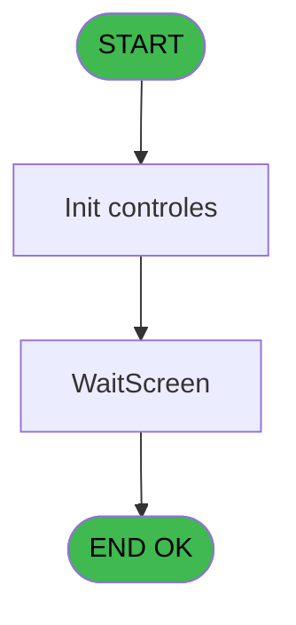
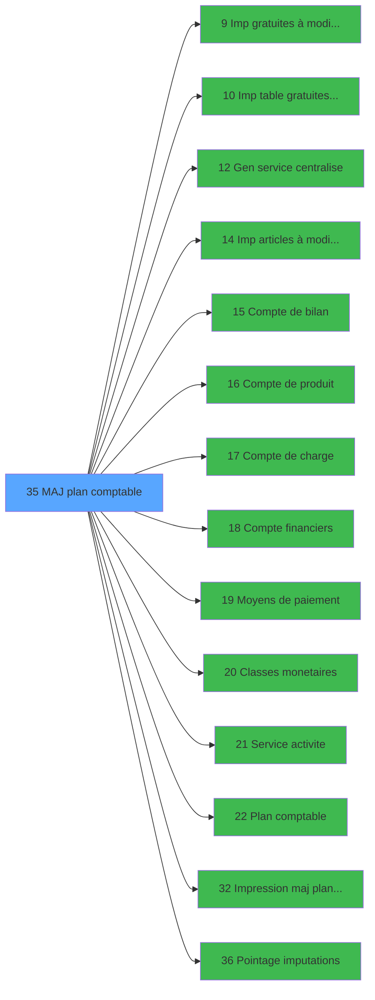

# MAI IDE 35 - MAJ plan comptable

> **Analyse**: Phases 1-4 2026-02-03 14:52 -> 14:52 (10s) | Assemblage 14:52
> **Pipeline**: V7.2 Enrichi
> **Structure**: 4 onglets (Resume | Ecrans | Donnees | Connexions)

<!-- TAB:Resume -->

## 1. FICHE D'IDENTITE

| Attribut | Valeur |
|----------|--------|
| Projet | MAI |
| IDE Position | 35 |
| Nom Programme | MAJ plan comptable |
| Fichier source | `Prg_35.xml` |
| Dossier IDE | Caisse |
| Taches | 2 (1 ecrans visibles) |
| Tables modifiees | 0 |
| Programmes appeles | 14 |

## 2. DESCRIPTION FONCTIONNELLE

**MAJ plan comptable** assure la gestion complete de ce processus, accessible depuis [Menu parametrage caisse (IDE 37)](MAI-IDE-37.md).

Le flux de traitement s'organise en **2 blocs fonctionnels** :

- **Traitement** (1 tache) : traitements metier divers
- **Calcul** (1 tache) : calculs de montants, stocks ou compteurs

Detail : phases du traitement

#### Phase 1 : Calcul (1 tache)

- **35** - MAJ plan comptable

Delegue a : [Compte de bilan (IDE 15)](MAI-IDE-15.md), [Compte de produit (IDE 16)](MAI-IDE-16.md), [Compte de charge (IDE 17)](MAI-IDE-17.md), [Compte financiers (IDE 18)](MAI-IDE-18.md), [Plan comptable (IDE 22)](MAI-IDE-22.md), [Impression maj plan comptable (IDE 32)](MAI-IDE-32.md)

#### Phase 2 : Traitement (1 tache)

- **35.1** - (sans nom) **[[ECRAN]](#ecran-t2)**

Delegue a : [Imp gratuites à modifier (IDE 9)](MAI-IDE-9.md), [Imp table gratuites à modifier (IDE 10)](MAI-IDE-10.md), [Gen service centralise (IDE 12)](MAI-IDE-12.md), [Imp articles à modifier WS (IDE 14)](MAI-IDE-14.md), [Classes monetaires (IDE 20)](MAI-IDE-20.md), [Service activite (IDE 21)](MAI-IDE-21.md), [Pointage imputations (IDE 36)](MAI-IDE-36.md)

## 3. BLOCS FONCTIONNELS

### 3.1 Calcul (1 tache)

Calculs metier : montants, stocks, compteurs.

---

#### 35 - MAJ plan comptable

**Role** : Traitement : MAJ plan comptable.
**Variables liees** : C (Param date comptable)
**Delegue a** : [Compte de bilan (IDE 15)](MAI-IDE-15.md), [Compte de produit (IDE 16)](MAI-IDE-16.md), [Compte de charge (IDE 17)](MAI-IDE-17.md)

### 3.2 Traitement (1 tache)

Traitements internes.

---

#### 35.1 - (sans nom) [[ECRAN]](#ecran-t2)

**Role** : Traitement interne.
**Ecran** : 1040 x 271 DLU (MDI) | [Voir mockup](#ecran-t2)
**Delegue a** : [Imp gratuites à modifier (IDE 9)](MAI-IDE-9.md), [Imp table gratuites à modifier (IDE 10)](MAI-IDE-10.md), [Gen service centralise (IDE 12)](MAI-IDE-12.md)

## 5. REGLES METIER

*(Aucune regle metier identifiee)*

## 6. CONTEXTE

- **Appele par**: [Menu parametrage caisse (IDE 37)](MAI-IDE-37.md)
- **Appelle**: 14 programmes | **Tables**: 0 (W:0 R:0 L:0) | **Taches**: 2 | **Expressions**: 8

<!-- TAB:Ecrans -->

## 8. ECRANS

### 8.1 Forms visibles (1 / 2)

| # | Position | Tache | Nom | Type | Largeur | Hauteur | Bloc |
|---|----------|-------|-----|------|---------|---------|------|
| 1 | 35.1 | 35.1 | (sans nom) | MDI | 1040 | 271 | Traitement |

### 8.2 Mockups Ecrans

---

#### 35.1 - (sans nom)
**Tache** : [35.1](#t2) | **Type** : MDI | **Dimensions** : 1040 x 271 DLU
**Bloc** : Traitement | **Titre IDE** : (sans nom)

<!-- FORM-DATA:
{
    "width":  1040,
    "vFactor":  8,
    "type":  "MDI",
    "hFactor":  8,
    "controls":  [
                     {
                         "x":  40,
                         "type":  "label",
                         "var":  "",
                         "y":  0,
                         "w":  960,
                         "fmt":  "",
                         "name":  "",
                         "h":  24,
                         "color":  "",
                         "text":  "Mise à jour du plan comptable",
                         "parent":  null
                     },
                     {
                         "x":  40,
                         "type":  "label",
                         "var":  "",
                         "y":  247,
                         "w":  960,
                         "fmt":  "",
                         "name":  "",
                         "h":  24,
                         "color":  "",
                         "text":  "Veuillez patienter S.V.P.",
                         "parent":  null
                     },
                     {
                         "x":  8,
                         "type":  "edit",
                         "var":  "",
                         "y":  131,
                         "w":  8,
                         "fmt":  "",
                         "name":  "",
                         "h":  8,
                         "color":  "",
                         "text":  "",
                         "parent":  null
                     },
                     {
                         "x":  877,
                         "type":  "image",
                         "var":  "",
                         "y":  100,
                         "w":  141,
                         "fmt":  "",
                         "name":  "",
                         "h":  55,
                         "color":  "",
                         "text":  "",
                         "parent":  null
                     }
                 ],
    "taskId":  "35.1",
    "height":  271
}
-->

<strong>Champs : 1 champs</strong>

| Pos (x,y) | Nom | Variable | Type |
|-----------|-----|----------|------|
| 8,131 | (sans nom) | - | edit |

## 9. NAVIGATION

Ecran unique: ****

### 9.3 Structure hierarchique (2 taches)

| Position | Tache | Type | Dimensions | Bloc |
|----------|-------|------|------------|------|
| **35.1** | [**MAJ plan comptable** (35)](#t1) | MDI | - | Calcul |
| **35.2** | [**(sans nom)** (35.1)](#t2) [mockup](#ecran-t2) | MDI | 1040x271 | Traitement |

### 9.4 Algorigramme

> **Legende**: Vert = START/END OK | Rouge = END KO | Bleu = Decisions
> *Algorigramme auto-genere. Utiliser `/algorigramme` pour une synthese metier detaillee.*

<!-- TAB:Donnees -->

## 10. TABLES

### Tables utilisees (0)

| ID | Nom | Description | Type | R | W | L | Usages |
|----|-----|-------------|------|---|---|---|--------|

### Colonnes par table (0 / 0 tables avec colonnes identifiees)

## 11. VARIABLES

### 11.1 Autres (5)

Variables diverses.

| Lettre | Nom | Type | Usage dans |
|--------|-----|------|-----------|
| A | Param societe | Alpha | - |
| B | Param devise | Alpha | - |
| C | Param date comptable | Date | - |
| D | Param nom village | Alpha | - |
| E | Param uniBi | Alpha | - |

## 12. EXPRESSIONS

**8 / 8 expressions decodees (100%)**

### 12.1 Repartition par type

| Type | Expressions | Regles |
|------|-------------|--------|
| CALCULATION | 6 | 0 |
| OTHER | 1 | 0 |
| CAST_LOGIQUE | 1 | 0 |

### 12.2 Expressions cles par type

#### CALCULATION (6 expressions)

| Type | IDE | Expression | Regle |
|------|-----|------------|-------|
| CALCULATION | 4 | `CallProg('{323,-1}'PROG,DbName('{207,2}'DSOURCE))` | - |
| CALCULATION | 5 | `CallProg('{323,-1}'PROG,DbName('{204,2}'DSOURCE))` | - |
| CALCULATION | 6 | `CallProg('{323,-1}'PROG,DbName('{212,2}'DSOURCE))` | - |
| CALCULATION | 1 | `CallProg('{323,-1}'PROG,DbName('{208,2}'DSOURCE))` | - |
| CALCULATION | 2 | `CallProg('{323,-1}'PROG,DbName('{206,2}'DSOURCE))` | - |
| ... | | *+1 autres* | |

#### OTHER (1 expressions)

| Type | IDE | Expression | Regle |
|------|-----|------------|-------|
| OTHER | 7 | `DbDel ('{555,2}'DSOURCE,'')` | - |

#### CAST_LOGIQUE (1 expressions)

| Type | IDE | Expression | Regle |
|------|-----|------------|-------|
| CAST_LOGIQUE | 8 | `'TRUE'LOG` | - |

<!-- TAB:Connexions -->

## 13. GRAPHE D'APPELS

### 13.1 Chaine depuis Main (Callers)

Main -> ... -> [Menu parametrage caisse (IDE 37)](MAI-IDE-37.md) -> **MAJ plan comptable (IDE 35)**

### 13.2 Callers

| IDE | Nom Programme | Nb Appels |
|-----|---------------|-----------|
| [37](MAI-IDE-37.md) | Menu parametrage caisse | 1 |

### 13.3 Callees (programmes appeles)

### 13.4 Detail Callees avec contexte

| IDE | Nom Programme | Appels | Contexte |
|-----|---------------|--------|----------|
| [9](MAI-IDE-9.md) | Imp gratuites à modifier | 1 | Sous-programme |
| [10](MAI-IDE-10.md) | Imp table gratuites à modifier | 1 | Sous-programme |
| [12](MAI-IDE-12.md) | Gen service centralise | 1 | Sous-programme |
| [14](MAI-IDE-14.md) | Imp articles à modifier WS | 1 | Sous-programme |
| [15](MAI-IDE-15.md) | Compte de bilan | 1 | Sous-programme |
| [16](MAI-IDE-16.md) | Compte de produit | 1 | Sous-programme |
| [17](MAI-IDE-17.md) | Compte de charge | 1 | Sous-programme |
| [18](MAI-IDE-18.md) | Compte financiers | 1 | Sous-programme |
| [19](MAI-IDE-19.md) | Moyens de paiement | 1 | Sous-programme |
| [20](MAI-IDE-20.md) | Classes monetaires | 1 | Sous-programme |
| [21](MAI-IDE-21.md) | Service activite | 1 | Sous-programme |
| [22](MAI-IDE-22.md) | Plan comptable | 1 | Sous-programme |
| [32](MAI-IDE-32.md) | Impression maj plan comptable | 1 | Mise a jour donnees |
| [36](MAI-IDE-36.md) | Pointage imputations | 1 | Sous-programme |

## 14. RECOMMANDATIONS MIGRATION

### 14.1 Profil du programme

| Metrique | Valeur | Impact migration |
|----------|--------|-----------------|
| Lignes de logique | 40 | Programme compact |
| Expressions | 8 | Peu de logique |
| Tables WRITE | 0 | Impact faible |
| Sous-programmes | 14 | Forte dependance |
| Ecrans visibles | 1 | Ecran unique ou traitement batch |
| Code desactive | 0% (0 / 40) | Code sain |
| Regles metier | 0 | Pas de regle identifiee |

### 14.2 Plan de migration par bloc

#### Calcul (1 tache: 0 ecran, 1 traitement)

- **Strategie** : Services de calcul purs (Domain Services).
- Migrer la logique de calcul (stock, compteurs, montants)

#### Traitement (1 tache: 1 ecran, 0 traitement)

- **Strategie** : 1 composant(s) UI (Razor/React) avec formulaires et validation.
- 14 sous-programme(s) a migrer ou a reutiliser depuis les services existants.
- Decomposer les taches en services unitaires testables.

### 14.3 Dependances critiques

| Dependance | Type | Appels | Impact |
|------------|------|--------|--------|
| [Classes monetaires (IDE 20)](MAI-IDE-20.md) | Sous-programme | 1x | Normale - Sous-programme |
| [Moyens de paiement (IDE 19)](MAI-IDE-19.md) | Sous-programme | 1x | Normale - Sous-programme |
| [Compte financiers (IDE 18)](MAI-IDE-18.md) | Sous-programme | 1x | Normale - Sous-programme |
| [Service activite (IDE 21)](MAI-IDE-21.md) | Sous-programme | 1x | Normale - Sous-programme |
| [Pointage imputations (IDE 36)](MAI-IDE-36.md) | Sous-programme | 1x | Normale - Sous-programme |
| [Impression maj plan comptable (IDE 32)](MAI-IDE-32.md) | Sous-programme | 1x | Normale - Mise a jour donnees |
| [Plan comptable (IDE 22)](MAI-IDE-22.md) | Sous-programme | 1x | Normale - Sous-programme |
| [Gen service centralise (IDE 12)](MAI-IDE-12.md) | Sous-programme | 1x | Normale - Sous-programme |
| [Imp table gratuites à modifier (IDE 10)](MAI-IDE-10.md) | Sous-programme | 1x | Normale - Sous-programme |
| [Imp gratuites à modifier (IDE 9)](MAI-IDE-9.md) | Sous-programme | 1x | Normale - Sous-programme |

---
*Spec DETAILED generee par Pipeline V7.2 - 2026-02-03 14:52*
