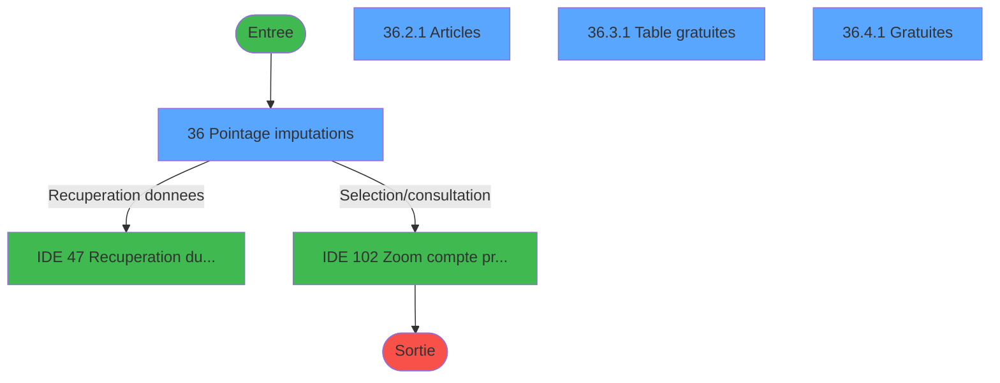
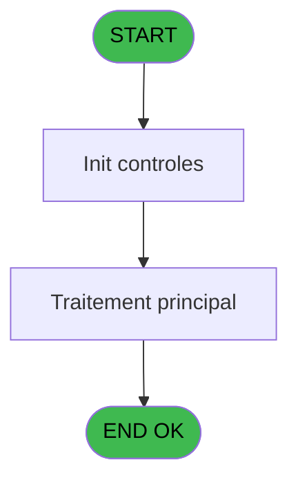
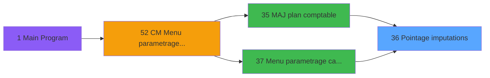
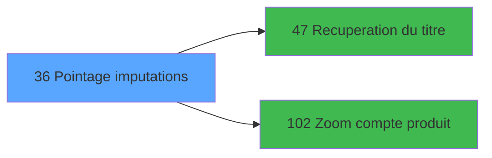

# MAI IDE 36 - Pointage imputations

> **Analyse**: Phases 1-4 2026-02-03 14:52 -> 14:52 (9s) | Assemblage 14:52
> **Pipeline**: V7.2 Enrichi
> **Structure**: 4 onglets (Resume | Ecrans | Donnees | Connexions)

<!-- TAB:Resume -->

## 1. FICHE D'IDENTITE

| Attribut | Valeur |
|----------|--------|
| Projet | MAI |
| IDE Position | 36 |
| Nom Programme | Pointage imputations |
| Fichier source | `Prg_36.xml` |
| Dossier IDE | Caisse |
| Taches | 26 (4 ecrans visibles) |
| Tables modifiees | 0 |
| Programmes appeles | 2 |

## 2. DESCRIPTION FONCTIONNELLE

**Pointage imputations** assure la gestion complete de ce processus, accessible depuis [MAJ plan comptable (IDE 35)](MAI-IDE-35.md), [Menu parametrage caisse (IDE 37)](MAI-IDE-37.md).

Le flux de traitement s'organise en **3 blocs fonctionnels** :

- **Traitement** (22 taches) : traitements metier divers
- **Validation** (3 taches) : controles et verifications de coherence
- **Calcul** (1 tache) : calculs de montants, stocks ou compteurs

Detail : phases du traitement

#### Phase 1 : Traitement (22 taches)

- **36** - Pointage imputations **[[ECRAN]](#ecran-t1)**
- **36.1.1** - articles
- **36.1.2** - tab grat
- **36.1.3** - gratuites
- **36.2** - Sel articles **[[ECRAN]](#ecran-t6)**
- **36.2.1** - Articles **[[ECRAN]](#ecran-t7)**
- **36.2.1.1** - Abandon
- **36.2.1.2** - TOUS
- **36.2.1.3** - ACHANGER
- **36.2.1.4** - OK
- **36.3** - Sel tab grat **[[ECRAN]](#ecran-t13)**
- **36.3.1** - Table gratuites **[[ECRAN]](#ecran-t14)**
- **36.3.1.1** - Abandon
- **36.3.1.2** - TOUS
- **36.3.1.3** - ACHANGER
- **36.3.1.4** - OK
- **36.4** - Sel grat **[[ECRAN]](#ecran-t20)**
- **36.4.1** - Gratuites **[[ECRAN]](#ecran-t21)**
- **36.4.1.1** - Abandon
- **36.4.1.2** - TOUS
- **36.4.1.3** - ACHANGER
- **36.4.1.4** - OK

Delegue a : [Recuperation du titre (IDE 47)](MAI-IDE-47.md)

#### Phase 2 : Calcul (1 tache)

- **36.1** - Calcul nbre

Delegue a : [Zoom compte produit (IDE 102)](MAI-IDE-102.md)

#### Phase 3 : Validation (3 taches)

- **36.2.1.5** - Valider
- **36.3.1.5** - Valider
- **36.4.1.5** - Valider

## 3. BLOCS FONCTIONNELS

### 3.1 Traitement (22 taches)

Traitements internes.

---

#### 36 - Pointage imputations [[ECRAN]](#ecran-t1)

**Role** : Tache d'orchestration : point d'entree du programme (22 sous-taches). Coordonne l'enchainement des traitements.
**Ecran** : 963 x 203 DLU (MDI) | [Voir mockup](#ecran-t1)

21 sous-taches directes

| Tache | Nom | Bloc |
|-------|-----|------|
| [36.1.1](#t3) | articles | Traitement |
| [36.1.2](#t4) | tab grat | Traitement |
| [36.1.3](#t5) | gratuites | Traitement |
| [36.2](#t6) | Sel articles **[[ECRAN]](#ecran-t6)** | Traitement |
| [36.2.1](#t7) | Articles **[[ECRAN]](#ecran-t7)** | Traitement |
| [36.2.1.1](#t8) | Abandon | Traitement |
| [36.2.1.2](#t9) | TOUS | Traitement |
| [36.2.1.3](#t10) | ACHANGER | Traitement |
| [36.2.1.4](#t11) | OK | Traitement |
| [36.3](#t13) | Sel tab grat **[[ECRAN]](#ecran-t13)** | Traitement |
| [36.3.1](#t14) | Table gratuites **[[ECRAN]](#ecran-t14)** | Traitement |
| [36.3.1.1](#t15) | Abandon | Traitement |
| [36.3.1.2](#t16) | TOUS | Traitement |
| [36.3.1.3](#t17) | ACHANGER | Traitement |
| [36.3.1.4](#t18) | OK | Traitement |
| [36.4](#t20) | Sel grat **[[ECRAN]](#ecran-t20)** | Traitement |
| [36.4.1](#t21) | Gratuites **[[ECRAN]](#ecran-t21)** | Traitement |
| [36.4.1.1](#t22) | Abandon | Traitement |
| [36.4.1.2](#t23) | TOUS | Traitement |
| [36.4.1.3](#t24) | ACHANGER | Traitement |
| [36.4.1.4](#t25) | OK | Traitement |

---

#### 36.1.1 - articles

**Role** : Traitement : articles.
**Variables liees** : B (Articles)

---

#### 36.1.2 - tab grat

**Role** : Traitement : tab grat.
**Variables liees** : C (Table gratuites), D (Gratuites)

---

#### 36.1.3 - gratuites

**Role** : Traitement : gratuites.
**Variables liees** : C (Table gratuites), D (Gratuites)

---

#### 36.2 - Sel articles [[ECRAN]](#ecran-t6)

**Role** : Traitement : Sel articles.
**Ecran** : 960 x 0 DLU (MDI) | [Voir mockup](#ecran-t6)
**Variables liees** : B (Articles)

---

#### 36.2.1 - Articles [[ECRAN]](#ecran-t7)

**Role** : Traitement : Articles.
**Ecran** : 963 x 204 DLU (MDI) | [Voir mockup](#ecran-t7)
**Variables liees** : B (Articles)

---

#### 36.2.1.1 - Abandon

**Role** : Traitement : Abandon.

---

#### 36.2.1.2 - TOUS

**Role** : Traitement : TOUS.

---

#### 36.2.1.3 - ACHANGER

**Role** : Traitement : ACHANGER.

---

#### 36.2.1.4 - OK

**Role** : Traitement interne.

---

#### 36.3 - Sel tab grat [[ECRAN]](#ecran-t13)

**Role** : Traitement : Sel tab grat.
**Ecran** : 960 x 0 DLU (MDI) | [Voir mockup](#ecran-t13)
**Variables liees** : C (Table gratuites), D (Gratuites)

---

#### 36.3.1 - Table gratuites [[ECRAN]](#ecran-t14)

**Role** : Traitement : Table gratuites.
**Ecran** : 963 x 202 DLU (MDI) | [Voir mockup](#ecran-t14)
**Variables liees** : C (Table gratuites), D (Gratuites)

---

#### 36.3.1.1 - Abandon

**Role** : Traitement : Abandon.

---

#### 36.3.1.2 - TOUS

**Role** : Traitement : TOUS.

---

#### 36.3.1.3 - ACHANGER

**Role** : Traitement : ACHANGER.

---

#### 36.3.1.4 - OK

**Role** : Traitement interne.

---

#### 36.4 - Sel grat [[ECRAN]](#ecran-t20)

**Role** : Traitement : Sel grat.
**Ecran** : 960 x 0 DLU (MDI) | [Voir mockup](#ecran-t20)
**Variables liees** : C (Table gratuites), D (Gratuites)

---

#### 36.4.1 - Gratuites [[ECRAN]](#ecran-t21)

**Role** : Traitement : Gratuites.
**Ecran** : 963 x 203 DLU (MDI) | [Voir mockup](#ecran-t21)
**Variables liees** : C (Table gratuites), D (Gratuites)

---

#### 36.4.1.1 - Abandon

**Role** : Traitement : Abandon.

---

#### 36.4.1.2 - TOUS

**Role** : Traitement : TOUS.

---

#### 36.4.1.3 - ACHANGER

**Role** : Traitement : ACHANGER.

---

#### 36.4.1.4 - OK

**Role** : Traitement interne.

### 3.2 Calcul (1 tache)

Calculs metier : montants, stocks, compteurs.

---

#### 36.1 - Calcul nbre

**Role** : Calcul : Calcul nbre.
**Delegue a** : [Zoom compte produit (IDE 102)](MAI-IDE-102.md)

### 3.3 Validation (3 taches)

Controles de coherence : 3 taches verifient les donnees et conditions.

---

#### 36.2.1.5 - Valider

**Role** : Verification : Valider.

---

#### 36.3.1.5 - Valider

**Role** : Verification : Valider.

---

#### 36.4.1.5 - Valider

**Role** : Verification : Valider.

## 5. REGLES METIER

*(Aucune regle metier identifiee)*

## 6. CONTEXTE

- **Appele par**: [MAJ plan comptable (IDE 35)](MAI-IDE-35.md), [Menu parametrage caisse (IDE 37)](MAI-IDE-37.md)
- **Appelle**: 2 programmes | **Tables**: 4 (W:0 R:1 L:3) | **Taches**: 26 | **Expressions**: 4

<!-- TAB:Ecrans -->

## 8. ECRANS

### 8.1 Forms visibles (4 / 26)

| # | Position | Tache | Nom | Type | Largeur | Hauteur | Bloc |
|---|----------|-------|-----|------|---------|---------|------|
| 1 | 36 | 36 | Pointage imputations | MDI | 963 | 203 | Traitement |
| 2 | 36.2.1 | 36.2.1 | Articles | MDI | 963 | 204 | Traitement |
| 3 | 36.3.1 | 36.3.1 | Table gratuites | MDI | 963 | 202 | Traitement |
| 4 | 36.4.1 | 36.4.1 | Gratuites | MDI | 963 | 203 | Traitement |

### 8.2 Mockups Ecrans

---

#### 36 - Pointage imputations
**Tache** : [36](#t1) | **Type** : MDI | **Dimensions** : 963 x 203 DLU
**Bloc** : Traitement | **Titre IDE** : Pointage imputations

<!-- FORM-DATA:
{
    "width":  963,
    "vFactor":  8,
    "type":  "MDI",
    "hFactor":  8,
    "controls":  [
                     {
                         "x":  0,
                         "type":  "label",
                         "var":  "",
                         "y":  0,
                         "w":  960,
                         "fmt":  "",
                         "name":  "",
                         "h":  19,
                         "color":  "",
                         "text":  "",
                         "parent":  null
                     },
                     {
                         "x":  262,
                         "type":  "label",
                         "var":  "",
                         "y":  68,
                         "w":  120,
                         "fmt":  "",
                         "name":  "",
                         "h":  8,
                         "color":  "",
                         "text":  "Articles",
                         "parent":  null
                     },
                     {
                         "x":  262,
                         "type":  "label",
                         "var":  "",
                         "y":  87,
                         "w":  120,
                         "fmt":  "",
                         "name":  "",
                         "h":  8,
                         "color":  "",
                         "text":  "Table gratuites",
                         "parent":  null
                     },
                     {
                         "x":  262,
                         "type":  "label",
                         "var":  "",
                         "y":  106,
                         "w":  120,
                         "fmt":  "",
                         "name":  "",
                         "h":  8,
                         "color":  "",
                         "text":  "Gratuites",
                         "parent":  null
                     },
                     {
                         "x":  0,
                         "type":  "label",
                         "var":  "",
                         "y":  181,
                         "w":  960,
                         "fmt":  "",
                         "name":  "",
                         "h":  19,
                         "color":  "",
                         "text":  "",
                         "parent":  null
                     },
                     {
                         "x":  430,
                         "type":  "edit",
                         "var":  "",
                         "y":  68,
                         "w":  70,
                         "fmt":  "",
                         "name":  "",
                         "h":  10,
                         "color":  "6",
                         "text":  "",
                         "parent":  null
                     },
                     {
                         "x":  430,
                         "type":  "edit",
                         "var":  "",
                         "y":  87,
                         "w":  70,
                         "fmt":  "",
                         "name":  "",
                         "h":  10,
                         "color":  "6",
                         "text":  "",
                         "parent":  null
                     },
                     {
                         "x":  430,
                         "type":  "edit",
                         "var":  "",
                         "y":  106,
                         "w":  70,
                         "fmt":  "",
                         "name":  "",
                         "h":  10,
                         "color":  "6",
                         "text":  "",
                         "parent":  null
                     },
                     {
                         "x":  695,
                         "type":  "edit",
                         "var":  "",
                         "y":  6,
                         "w":  240,
                         "fmt":  "WWW DD MMM YYYYT",
                         "name":  "",
                         "h":  8,
                         "color":  "",
                         "text":  "",
                         "parent":  null
                     },
                     {
                         "x":  544,
                         "type":  "button",
                         "var":  "",
                         "y":  65,
                         "w":  240,
                         "fmt":  "Articles",
                         "name":  "",
                         "h":  14,
                         "color":  "",
                         "text":  "",
                         "parent":  null
                     },
                     {
                         "x":  544,
                         "type":  "button",
                         "var":  "",
                         "y":  84,
                         "w":  240,
                         "fmt":  "Table gratuites",
                         "name":  "",
                         "h":  14,
                         "color":  "",
                         "text":  "",
                         "parent":  null
                     },
                     {
                         "x":  544,
                         "type":  "button",
                         "var":  "",
                         "y":  103,
                         "w":  240,
                         "fmt":  "Gratuites",
                         "name":  "",
                         "h":  14,
                         "color":  "",
                         "text":  "",
                         "parent":  null
                     },
                     {
                         "x":  27,
                         "type":  "button",
                         "var":  "",
                         "y":  184,
                         "w":  122,
                         "fmt":  "Abandon",
                         "name":  "",
                         "h":  14,
                         "color":  "",
                         "text":  "",
                         "parent":  null
                     },
                     {
                         "x":  813,
                         "type":  "button",
                         "var":  "",
                         "y":  184,
                         "w":  122,
                         "fmt":  "Validation",
                         "name":  "",
                         "h":  14,
                         "color":  "",
                         "text":  "",
                         "parent":  null
                     },
                     {
                         "x":  27,
                         "type":  "edit",
                         "var":  "",
                         "y":  6,
                         "w":  240,
                         "fmt":  "30",
                         "name":  "",
                         "h":  8,
                         "color":  "",
                         "text":  "",
                         "parent":  null
                     }
                 ],
    "taskId":  "36",
    "height":  203
}
-->

<strong>Champs : 5 champs</strong>

| Pos (x,y) | Nom | Variable | Type |
|-----------|-----|----------|------|
| 430,68 | (sans nom) | - | edit |
| 430,87 | (sans nom) | - | edit |
| 430,106 | (sans nom) | - | edit |
| 695,6 | WWW DD MMM YYYYT | - | edit |
| 27,6 | 30 | - | edit |

<strong>Boutons : 5 boutons</strong>

| Bouton | Pos (x,y) | Action |
|--------|-----------|--------|
| Articles | 544,65 | Bouton fonctionnel |
| Table gratuites | 544,84 | Bouton fonctionnel |
| Gratuites | 544,103 | Bouton fonctionnel |
| Abandon | 27,184 | Annule et retour au menu |
| Validation | 813,184 | Valide la saisie et enregistre |

---

#### 36.2.1 - Articles
**Tache** : [36.2.1](#t7) | **Type** : MDI | **Dimensions** : 963 x 204 DLU
**Bloc** : Traitement | **Titre IDE** : Articles

<!-- FORM-DATA:
{
    "width":  963,
    "vFactor":  8,
    "type":  "MDI",
    "hFactor":  8,
    "controls":  [
                     {
                         "x":  0,
                         "type":  "label",
                         "var":  "",
                         "y":  0,
                         "w":  960,
                         "fmt":  "",
                         "name":  "",
                         "h":  19,
                         "color":  "",
                         "text":  "",
                         "parent":  null
                     },
                     {
                         "x":  13,
                         "type":  "table",
                         "var":  "",
                         "name":  "",
                         "titleH":  11,
                         "color":  "110",
                         "w":  938,
                         "y":  24,
                         "fmt":  "",
                         "parent":  null,
                         "text":  "",
                         "rowH":  11,
                         "h":  152,
                         "cols":  [
                                      {
                                          "title":  "Code",
                                          "layer":  1,
                                          "w":  90
                                      },
                                      {
                                          "title":  "Libellé",
                                          "layer":  2,
                                          "w":  150
                                      },
                                      {
                                          "title":  "Libellé imputation",
                                          "layer":  3,
                                          "w":  188
                                      },
                                      {
                                          "title":  "Service",
                                          "layer":  4,
                                          "w":  74
                                      },
                                      {
                                          "title":  "Imputation",
                                          "layer":  5,
                                          "w":  136
                                      },
                                      {
                                          "title":  "Sous-imputation",
                                          "layer":  6,
                                          "w":  114
                                      },
                                      {
                                          "title":  "Prix",
                                          "layer":  7,
                                          "w":  150
                                      }
                                  ],
                         "rows":  7
                     },
                     {
                         "x":  0,
                         "type":  "label",
                         "var":  "",
                         "y":  181,
                         "w":  960,
                         "fmt":  "",
                         "name":  "",
                         "h":  19,
                         "color":  "",
                         "text":  "",
                         "parent":  null
                     },
                     {
                         "x":  18,
                         "type":  "edit",
                         "var":  "",
                         "y":  37,
                         "w":  79,
                         "fmt":  "",
                         "name":  "ART code article",
                         "h":  9,
                         "color":  "110",
                         "text":  "",
                         "parent":  5
                     },
                     {
                         "x":  109,
                         "type":  "edit",
                         "var":  "",
                         "y":  37,
                         "w":  142,
                         "fmt":  "",
                         "name":  "ART libelle article",
                         "h":  9,
                         "color":  "110",
                         "text":  "",
                         "parent":  5
                     },
                     {
                         "x":  261,
                         "type":  "edit",
                         "var":  "",
                         "y":  37,
                         "w":  176,
                         "fmt":  "",
                         "name":  "ART libelle imputat.",
                         "h":  9,
                         "color":  "110",
                         "text":  "",
                         "parent":  5
                     },
                     {
                         "x":  451,
                         "type":  "edit",
                         "var":  "",
                         "y":  37,
                         "w":  60,
                         "fmt":  "",
                         "name":  "ART service Village",
                         "h":  9,
                         "color":  "110",
                         "text":  "",
                         "parent":  5
                     },
                     {
                         "x":  528,
                         "type":  "edit",
                         "var":  "",
                         "y":  37,
                         "w":  120,
                         "fmt":  "",
                         "name":  "ART imputation",
                         "h":  9,
                         "color":  "110",
                         "text":  "",
                         "parent":  5
                     },
                     {
                         "x":  659,
                         "type":  "edit",
                         "var":  "",
                         "y":  37,
                         "w":  100,
                         "fmt":  "",
                         "name":  "ART sous-imputation",
                         "h":  9,
                         "color":  "110",
                         "text":  "",
                         "parent":  5
                     },
                     {
                         "x":  773,
                         "type":  "edit",
                         "var":  "",
                         "y":  37,
                         "w":  114,
                         "fmt":  "",
                         "name":  "ART prix",
                         "h":  9,
                         "color":  "110",
                         "text":  "",
                         "parent":  5
                     },
                     {
                         "x":  317,
                         "type":  "edit",
                         "var":  "",
                         "y":  4,
                         "w":  327,
                         "fmt":  "30",
                         "name":  "",
                         "h":  13,
                         "color":  "142",
                         "text":  "",
                         "parent":  1
                     },
                     {
                         "x":  27,
                         "type":  "edit",
                         "var":  "",
                         "y":  6,
                         "w":  240,
                         "fmt":  "30",
                         "name":  "",
                         "h":  8,
                         "color":  "",
                         "text":  "",
                         "parent":  null
                     },
                     {
                         "x":  695,
                         "type":  "edit",
                         "var":  "",
                         "y":  6,
                         "w":  240,
                         "fmt":  "WWW DD MMM YYYYT",
                         "name":  "",
                         "h":  8,
                         "color":  "",
                         "text":  "",
                         "parent":  null
                     },
                     {
                         "x":  27,
                         "type":  "button",
                         "var":  "",
                         "y":  184,
                         "w":  122,
                         "fmt":  "Abandon",
                         "name":  "",
                         "h":  14,
                         "color":  "",
                         "text":  "",
                         "parent":  null
                     },
                     {
                         "x":  240,
                         "type":  "button",
                         "var":  "",
                         "y":  184,
                         "w":  122,
                         "fmt":  "Tous",
                         "name":  "TO",
                         "h":  14,
                         "color":  "",
                         "text":  "",
                         "parent":  null
                     },
                     {
                         "x":  414,
                         "type":  "button",
                         "var":  "",
                         "y":  184,
                         "w":  122,
                         "fmt":  "A changer",
                         "name":  "AC",
                         "h":  14,
                         "color":  "",
                         "text":  "",
                         "parent":  null
                     },
                     {
                         "x":  587,
                         "type":  "button",
                         "var":  "",
                         "y":  184,
                         "w":  122,
                         "fmt":  "OK",
                         "name":  "OK",
                         "h":  14,
                         "color":  "",
                         "text":  "",
                         "parent":  null
                     },
                     {
                         "x":  813,
                         "type":  "button",
                         "var":  "",
                         "y":  184,
                         "w":  122,
                         "fmt":  "Validation",
                         "name":  "",
                         "h":  14,
                         "color":  "",
                         "text":  "",
                         "parent":  null
                     }
                 ],
    "taskId":  "36.2.1",
    "height":  204
}
-->

<strong>Champs : 10 champs</strong>

| Pos (x,y) | Nom | Variable | Type |
|-----------|-----|----------|------|
| 18,37 | ART code article | - | edit |
| 109,37 | ART libelle article | - | edit |
| 261,37 | ART libelle imputat. | - | edit |
| 451,37 | ART service Village | - | edit |
| 528,37 | ART imputation | - | edit |
| 659,37 | ART sous-imputation | - | edit |
| 773,37 | ART prix | - | edit |
| 317,4 | 30 | - | edit |
| 27,6 | 30 | - | edit |
| 695,6 | WWW DD MMM YYYYT | - | edit |

<strong>Boutons : 5 boutons</strong>

| Bouton | Pos (x,y) | Action |
|--------|-----------|--------|
| Abandon | 27,184 | Annule et retour au menu |
| Tous | 240,184 | Bouton fonctionnel |
| A changer | 414,184 | Modifie l'element |
| OK | 587,184 | Valide la saisie et enregistre |
| Validation | 813,184 | Valide la saisie et enregistre |

---

#### 36.3.1 - Table gratuites
**Tache** : [36.3.1](#t14) | **Type** : MDI | **Dimensions** : 963 x 202 DLU
**Bloc** : Traitement | **Titre IDE** : Table gratuites

<!-- FORM-DATA:
{
    "width":  963,
    "vFactor":  8,
    "type":  "MDI",
    "hFactor":  8,
    "controls":  [
                     {
                         "x":  0,
                         "type":  "label",
                         "var":  "",
                         "y":  0,
                         "w":  960,
                         "fmt":  "",
                         "name":  "",
                         "h":  19,
                         "color":  "",
                         "text":  "",
                         "parent":  null
                     },
                     {
                         "x":  67,
                         "type":  "table",
                         "var":  "",
                         "name":  "",
                         "titleH":  11,
                         "color":  "110",
                         "w":  829,
                         "y":  26,
                         "fmt":  "",
                         "parent":  null,
                         "text":  "",
                         "rowH":  11,
                         "h":  149,
                         "cols":  [
                                      {
                                          "title":  "Société",
                                          "layer":  1,
                                          "w":  90
                                      },
                                      {
                                          "title":  "Point de vente",
                                          "layer":  2,
                                          "w":  150
                                      },
                                      {
                                          "title":  "Imputation",
                                          "layer":  3,
                                          "w":  188
                                      },
                                      {
                                          "title":  "Sous imputation",
                                          "layer":  4,
                                          "w":  150
                                      },
                                      {
                                          "title":  "Libellé",
                                          "layer":  5,
                                          "w":  217
                                      }
                                  ],
                         "rows":  5
                     },
                     {
                         "x":  0,
                         "type":  "label",
                         "var":  "",
                         "y":  181,
                         "w":  960,
                         "fmt":  "",
                         "name":  "",
                         "h":  19,
                         "color":  "",
                         "text":  "",
                         "parent":  null
                     },
                     {
                         "x":  72,
                         "type":  "edit",
                         "var":  "",
                         "y":  39,
                         "w":  79,
                         "fmt":  "",
                         "name":  "TGR societe",
                         "h":  8,
                         "color":  "110",
                         "text":  "",
                         "parent":  5
                     },
                     {
                         "x":  163,
                         "type":  "edit",
                         "var":  "",
                         "y":  39,
                         "w":  142,
                         "fmt":  "",
                         "name":  "TGR point de vente",
                         "h":  8,
                         "color":  "110",
                         "text":  "",
                         "parent":  5
                     },
                     {
                         "x":  315,
                         "type":  "edit",
                         "var":  "",
                         "y":  39,
                         "w":  176,
                         "fmt":  "",
                         "name":  "TGR imputation",
                         "h":  8,
                         "color":  "110",
                         "text":  "",
                         "parent":  5
                     },
                     {
                         "x":  501,
                         "type":  "edit",
                         "var":  "",
                         "y":  39,
                         "w":  138,
                         "fmt":  "",
                         "name":  "TGR sous imputation",
                         "h":  8,
                         "color":  "110",
                         "text":  "",
                         "parent":  5
                     },
                     {
                         "x":  651,
                         "type":  "edit",
                         "var":  "",
                         "y":  39,
                         "w":  203,
                         "fmt":  "",
                         "name":  "TGR libelle",
                         "h":  8,
                         "color":  "110",
                         "text":  "",
                         "parent":  5
                     },
                     {
                         "x":  317,
                         "type":  "edit",
                         "var":  "",
                         "y":  4,
                         "w":  327,
                         "fmt":  "30",
                         "name":  "",
                         "h":  13,
                         "color":  "142",
                         "text":  "",
                         "parent":  1
                     },
                     {
                         "x":  27,
                         "type":  "edit",
                         "var":  "",
                         "y":  6,
                         "w":  240,
                         "fmt":  "30",
                         "name":  "",
                         "h":  8,
                         "color":  "",
                         "text":  "",
                         "parent":  null
                     },
                     {
                         "x":  695,
                         "type":  "edit",
                         "var":  "",
                         "y":  6,
                         "w":  240,
                         "fmt":  "WWW DD MMM YYYYT",
                         "name":  "",
                         "h":  8,
                         "color":  "",
                         "text":  "",
                         "parent":  null
                     },
                     {
                         "x":  27,
                         "type":  "button",
                         "var":  "",
                         "y":  184,
                         "w":  122,
                         "fmt":  "Abandon",
                         "name":  "",
                         "h":  14,
                         "color":  "",
                         "text":  "",
                         "parent":  null
                     },
                     {
                         "x":  240,
                         "type":  "button",
                         "var":  "",
                         "y":  184,
                         "w":  122,
                         "fmt":  "Tous",
                         "name":  "TO",
                         "h":  14,
                         "color":  "",
                         "text":  "",
                         "parent":  null
                     },
                     {
                         "x":  414,
                         "type":  "button",
                         "var":  "",
                         "y":  184,
                         "w":  122,
                         "fmt":  "A changer",
                         "name":  "AC",
                         "h":  14,
                         "color":  "",
                         "text":  "",
                         "parent":  null
                     },
                     {
                         "x":  587,
                         "type":  "button",
                         "var":  "",
                         "y":  184,
                         "w":  122,
                         "fmt":  "Ok",
                         "name":  "OK",
                         "h":  14,
                         "color":  "",
                         "text":  "",
                         "parent":  null
                     },
                     {
                         "x":  813,
                         "type":  "button",
                         "var":  "",
                         "y":  184,
                         "w":  122,
                         "fmt":  "Validation",
                         "name":  "",
                         "h":  14,
                         "color":  "",
                         "text":  "",
                         "parent":  null
                     }
                 ],
    "taskId":  "36.3.1",
    "height":  202
}
-->

<strong>Champs : 8 champs</strong>

| Pos (x,y) | Nom | Variable | Type |
|-----------|-----|----------|------|
| 72,39 | TGR societe | - | edit |
| 163,39 | TGR point de vente | - | edit |
| 315,39 | TGR imputation | - | edit |
| 501,39 | TGR sous imputation | - | edit |
| 651,39 | TGR libelle | - | edit |
| 317,4 | 30 | - | edit |
| 27,6 | 30 | - | edit |
| 695,6 | WWW DD MMM YYYYT | - | edit |

<strong>Boutons : 5 boutons</strong>

| Bouton | Pos (x,y) | Action |
|--------|-----------|--------|
| Abandon | 27,184 | Annule et retour au menu |
| Tous | 240,184 | Bouton fonctionnel |
| A changer | 414,184 | Modifie l'element |
| Ok | 587,184 | Valide la saisie et enregistre |
| Validation | 813,184 | Valide la saisie et enregistre |

---

#### 36.4.1 - Gratuites
**Tache** : [36.4.1](#t21) | **Type** : MDI | **Dimensions** : 963 x 203 DLU
**Bloc** : Traitement | **Titre IDE** : Gratuites

<!-- FORM-DATA:
{
    "width":  963,
    "vFactor":  8,
    "type":  "MDI",
    "hFactor":  8,
    "controls":  [
                     {
                         "x":  0,
                         "type":  "label",
                         "var":  "",
                         "y":  0,
                         "w":  960,
                         "fmt":  "",
                         "name":  "",
                         "h":  19,
                         "color":  "",
                         "text":  "",
                         "parent":  null
                     },
                     {
                         "x":  3,
                         "type":  "table",
                         "var":  "",
                         "name":  "",
                         "titleH":  12,
                         "color":  "110",
                         "w":  934,
                         "y":  26,
                         "fmt":  "",
                         "parent":  null,
                         "text":  "",
                         "rowH":  12,
                         "h":  149,
                         "cols":  [
                                      {
                                          "title":  "Société",
                                          "layer":  1,
                                          "w":  90
                                      },
                                      {
                                          "title":  "Compte village",
                                          "layer":  2,
                                          "w":  150
                                      },
                                      {
                                          "title":  "Filiation",
                                          "layer":  3,
                                          "w":  112
                                      },
                                      {
                                          "title":  "Imputation",
                                          "layer":  4,
                                          "w":  188
                                      },
                                      {
                                          "title":  "Sous imputation",
                                          "layer":  5,
                                          "w":  150
                                      },
                                      {
                                          "title":  "Libellé",
                                          "layer":  6,
                                          "w":  201
                                      }
                                  ],
                         "rows":  6
                     },
                     {
                         "x":  0,
                         "type":  "label",
                         "var":  "",
                         "y":  181,
                         "w":  960,
                         "fmt":  "",
                         "name":  "",
                         "h":  19,
                         "color":  "",
                         "text":  "",
                         "parent":  null
                     },
                     {
                         "x":  8,
                         "type":  "edit",
                         "var":  "",
                         "y":  40,
                         "w":  79,
                         "fmt":  "",
                         "name":  "GRA societe",
                         "h":  8,
                         "color":  "110",
                         "text":  "",
                         "parent":  5
                     },
                     {
                         "x":  99,
                         "type":  "edit",
                         "var":  "",
                         "y":  40,
                         "w":  142,
                         "fmt":  "",
                         "name":  "GRA code",
                         "h":  8,
                         "color":  "110",
                         "text":  "",
                         "parent":  5
                     },
                     {
                         "x":  250,
                         "type":  "edit",
                         "var":  "",
                         "y":  40,
                         "w":  98,
                         "fmt":  "",
                         "name":  "GRA filiation",
                         "h":  8,
                         "color":  "110",
                         "text":  "",
                         "parent":  5
                     },
                     {
                         "x":  363,
                         "type":  "edit",
                         "var":  "",
                         "y":  40,
                         "w":  176,
                         "fmt":  "",
                         "name":  "GRA imputation",
                         "h":  8,
                         "color":  "110",
                         "text":  "",
                         "parent":  5
                     },
                     {
                         "x":  549,
                         "type":  "edit",
                         "var":  "",
                         "y":  40,
                         "w":  138,
                         "fmt":  "",
                         "name":  "GRA sous-imputation",
                         "h":  8,
                         "color":  "110",
                         "text":  "",
                         "parent":  5
                     },
                     {
                         "x":  699,
                         "type":  "edit",
                         "var":  "",
                         "y":  40,
                         "w":  185,
                         "fmt":  "",
                         "name":  "GRA libelle",
                         "h":  8,
                         "color":  "110",
                         "text":  "",
                         "parent":  5
                     },
                     {
                         "x":  317,
                         "type":  "edit",
                         "var":  "",
                         "y":  4,
                         "w":  327,
                         "fmt":  "30",
                         "name":  "",
                         "h":  13,
                         "color":  "142",
                         "text":  "",
                         "parent":  1
                     },
                     {
                         "x":  27,
                         "type":  "edit",
                         "var":  "",
                         "y":  6,
                         "w":  240,
                         "fmt":  "30",
                         "name":  "",
                         "h":  8,
                         "color":  "",
                         "text":  "",
                         "parent":  null
                     },
                     {
                         "x":  695,
                         "type":  "edit",
                         "var":  "",
                         "y":  6,
                         "w":  240,
                         "fmt":  "WWW DD MMM YYYYT",
                         "name":  "",
                         "h":  8,
                         "color":  "",
                         "text":  "",
                         "parent":  null
                     },
                     {
                         "x":  27,
                         "type":  "button",
                         "var":  "",
                         "y":  184,
                         "w":  122,
                         "fmt":  "Abandon",
                         "name":  "",
                         "h":  14,
                         "color":  "",
                         "text":  "",
                         "parent":  null
                     },
                     {
                         "x":  240,
                         "type":  "button",
                         "var":  "",
                         "y":  184,
                         "w":  122,
                         "fmt":  "Tous",
                         "name":  "TO",
                         "h":  14,
                         "color":  "",
                         "text":  "",
                         "parent":  null
                     },
                     {
                         "x":  414,
                         "type":  "button",
                         "var":  "",
                         "y":  184,
                         "w":  122,
                         "fmt":  "A changer",
                         "name":  "AC",
                         "h":  14,
                         "color":  "",
                         "text":  "",
                         "parent":  null
                     },
                     {
                         "x":  587,
                         "type":  "button",
                         "var":  "",
                         "y":  184,
                         "w":  122,
                         "fmt":  "Ok",
                         "name":  "OK",
                         "h":  14,
                         "color":  "",
                         "text":  "",
                         "parent":  null
                     },
                     {
                         "x":  813,
                         "type":  "button",
                         "var":  "",
                         "y":  184,
                         "w":  122,
                         "fmt":  "Validation",
                         "name":  "",
                         "h":  14,
                         "color":  "",
                         "text":  "",
                         "parent":  null
                     }
                 ],
    "taskId":  "36.4.1",
    "height":  203
}
-->

<strong>Champs : 9 champs</strong>

| Pos (x,y) | Nom | Variable | Type |
|-----------|-----|----------|------|
| 8,40 | GRA societe | - | edit |
| 99,40 | GRA code | - | edit |
| 250,40 | GRA filiation | - | edit |
| 363,40 | GRA imputation | - | edit |
| 549,40 | GRA sous-imputation | - | edit |
| 699,40 | GRA libelle | - | edit |
| 317,4 | 30 | - | edit |
| 27,6 | 30 | - | edit |
| 695,6 | WWW DD MMM YYYYT | - | edit |

<strong>Boutons : 5 boutons</strong>

| Bouton | Pos (x,y) | Action |
|--------|-----------|--------|
| Abandon | 27,184 | Annule et retour au menu |
| Tous | 240,184 | Bouton fonctionnel |
| A changer | 414,184 | Modifie l'element |
| Ok | 587,184 | Valide la saisie et enregistre |
| Validation | 813,184 | Valide la saisie et enregistre |

## 9. NAVIGATION

### 9.1 Enchainement des ecrans

**Detail par enchainement :**

| Depuis | Action | Vers | Retour |
|--------|--------|------|--------|
| Pointage imputations | Recuperation donnees | [Recuperation du titre (IDE 47)](MAI-IDE-47.md) | Retour ecran |
| Pointage imputations | Selection/consultation | [Zoom compte produit (IDE 102)](MAI-IDE-102.md) | Retour ecran |

### 9.3 Structure hierarchique (26 taches)

| Position | Tache | Type | Dimensions | Bloc |
|----------|-------|------|------------|------|
| **36.1** | [**Pointage imputations** (36)](#t1) [mockup](#ecran-t1) | MDI | 963x203 | Traitement |
| 36.1.1 | [articles (36.1.1)](#t3) | MDI | - | |
| 36.1.2 | [tab grat (36.1.2)](#t4) | MDI | - | |
| 36.1.3 | [gratuites (36.1.3)](#t5) | MDI | - | |
| 36.1.4 | [Sel articles (36.2)](#t6) [mockup](#ecran-t6) | MDI | 960x0 | |
| 36.1.5 | [Articles (36.2.1)](#t7) [mockup](#ecran-t7) | MDI | 963x204 | |
| 36.1.6 | [Abandon (36.2.1.1)](#t8) | MDI | - | |
| 36.1.7 | [TOUS (36.2.1.2)](#t9) | MDI | - | |
| 36.1.8 | [ACHANGER (36.2.1.3)](#t10) | MDI | - | |
| 36.1.9 | [OK (36.2.1.4)](#t11) | MDI | - | |
| 36.1.10 | [Sel tab grat (36.3)](#t13) [mockup](#ecran-t13) | MDI | 960x0 | |
| 36.1.11 | [Table gratuites (36.3.1)](#t14) [mockup](#ecran-t14) | MDI | 963x202 | |
| 36.1.12 | [Abandon (36.3.1.1)](#t15) | MDI | - | |
| 36.1.13 | [TOUS (36.3.1.2)](#t16) | MDI | - | |
| 36.1.14 | [ACHANGER (36.3.1.3)](#t17) | MDI | - | |
| 36.1.15 | [OK (36.3.1.4)](#t18) | MDI | - | |
| 36.1.16 | [Sel grat (36.4)](#t20) [mockup](#ecran-t20) | MDI | 960x0 | |
| 36.1.17 | [Gratuites (36.4.1)](#t21) [mockup](#ecran-t21) | MDI | 963x203 | |
| 36.1.18 | [Abandon (36.4.1.1)](#t22) | MDI | - | |
| 36.1.19 | [TOUS (36.4.1.2)](#t23) | MDI | - | |
| 36.1.20 | [ACHANGER (36.4.1.3)](#t24) | MDI | - | |
| 36.1.21 | [OK (36.4.1.4)](#t25) | MDI | - | |
| **36.2** | [**Calcul nbre** (36.1)](#t2) | MDI | - | Calcul |
| **36.3** | [**Valider** (36.2.1.5)](#t12) | MDI | - | Validation |
| 36.3.1 | [Valider (36.3.1.5)](#t19) | MDI | - | |
| 36.3.2 | [Valider (36.4.1.5)](#t26) | MDI | - | |

### 9.4 Algorigramme

> **Legende**: Vert = START/END OK | Rouge = END KO | Bleu = Decisions
> *Algorigramme auto-genere. Utiliser `/algorigramme` pour une synthese metier detaillee.*

<!-- TAB:Donnees -->

## 10. TABLES

### Tables utilisees (4)

| ID | Nom | Description | Type | R | W | L | Usages |
|----|-----|-------------|------|---|---|---|--------|
| 65 | comptes_recette__cre | Comptes GM (generaux) | DB | R |   |   | 6 |
| 77 | articles_________art | Articles et stock | DB |   |   | L | 2 |
| 79 | gratuites________gra |  | DB |   |   | L | 2 |
| 95 | tables_gratuites_tgr |  | DB |   |   | L | 2 |

### Colonnes par table (4 / 1 tables avec colonnes identifiees)

Table 65 - comptes_recette__cre (R) - 6 usages

| Lettre | Variable | Acces | Type |
|--------|----------|-------|------|
| A | existe | R | Logical |
| B | titre | R | Alpha |

## 11. VARIABLES

### 11.1 Autres (5)

Variables diverses.

| Lettre | Nom | Type | Usage dans |
|--------|-----|------|-----------|
| A | Param societe | Alpha | - |
| B | Articles | Numeric | - |
| C | Table gratuites | Numeric | - |
| D | Gratuites | Numeric | - |
| E | titre | Alpha | 1x refs |

## 12. EXPRESSIONS

**4 / 4 expressions decodees (100%)**

### 12.1 Repartition par type

| Type | Expressions | Regles |
|------|-------------|--------|
| CONSTANTE | 1 | 0 |
| DATE | 1 | 0 |
| REFERENCE_VG | 1 | 0 |
| STRING | 1 | 0 |

### 12.2 Expressions cles par type

#### CONSTANTE (1 expressions)

| Type | IDE | Expression | Regle |
|------|-----|------------|-------|
| CONSTANTE | 3 | `72` | - |

#### DATE (1 expressions)

| Type | IDE | Expression | Regle |
|------|-----|------------|-------|
| DATE | 2 | `Date ()` | - |

#### REFERENCE_VG (1 expressions)

| Type | IDE | Expression | Regle |
|------|-----|------------|-------|
| REFERENCE_VG | 1 | `VG1` | - |

#### STRING (1 expressions)

| Type | IDE | Expression | Regle |
|------|-----|------------|-------|
| STRING | 4 | `Trim (titre [E])` | - |

<!-- TAB:Connexions -->

## 13. GRAPHE D'APPELS

### 13.1 Chaine depuis Main (Callers)

Main -> ... -> [MAJ plan comptable (IDE 35)](MAI-IDE-35.md) -> **Pointage imputations (IDE 36)**

Main -> ... -> [Menu parametrage caisse (IDE 37)](MAI-IDE-37.md) -> **Pointage imputations (IDE 36)**

### 13.2 Callers

| IDE | Nom Programme | Nb Appels |
|-----|---------------|-----------|
| [35](MAI-IDE-35.md) | MAJ plan comptable | 1 |
| [37](MAI-IDE-37.md) | Menu parametrage caisse | 1 |

### 13.3 Callees (programmes appeles)

### 13.4 Detail Callees avec contexte

| IDE | Nom Programme | Appels | Contexte |
|-----|---------------|--------|----------|
| [47](MAI-IDE-47.md) | Recuperation du titre | 4 | Recuperation donnees |
| [102](MAI-IDE-102.md) | Zoom compte produit | 3 | Selection/consultation |

## 14. RECOMMANDATIONS MIGRATION

### 14.1 Profil du programme

| Metrique | Valeur | Impact migration |
|----------|--------|-----------------|
| Lignes de logique | 207 | Taille moyenne |
| Expressions | 4 | Peu de logique |
| Tables WRITE | 0 | Impact faible |
| Sous-programmes | 2 | Peu de dependances |
| Ecrans visibles | 4 | Quelques ecrans |
| Code desactive | 0% (0 / 207) | Code sain |
| Regles metier | 0 | Pas de regle identifiee |

### 14.2 Plan de migration par bloc

#### Traitement (22 taches: 7 ecrans, 15 traitements)

- **Strategie** : Orchestrateur avec 7 ecrans (Razor/React) et 15 traitements backend (services).
- Les ecrans deviennent des composants UI, les traitements invisibles deviennent des services injectables.
- 2 sous-programme(s) a migrer ou a reutiliser depuis les services existants.
- Decomposer les taches en services unitaires testables.

#### Calcul (1 tache: 0 ecran, 1 traitement)

- **Strategie** : Services de calcul purs (Domain Services).
- Migrer la logique de calcul (stock, compteurs, montants)

#### Validation (3 taches: 0 ecran, 3 traitements)

- **Strategie** : FluentValidation avec validators specifiques.
- Chaque tache de validation -> un validator injectable

### 14.3 Dependances critiques

| Dependance | Type | Appels | Impact |
|------------|------|--------|--------|
| [Recuperation du titre (IDE 47)](MAI-IDE-47.md) | Sous-programme | 4x | **CRITIQUE** - Recuperation donnees |
| [Zoom compte produit (IDE 102)](MAI-IDE-102.md) | Sous-programme | 3x | **CRITIQUE** - Selection/consultation |

---
*Spec DETAILED generee par Pipeline V7.2 - 2026-02-03 14:52*
