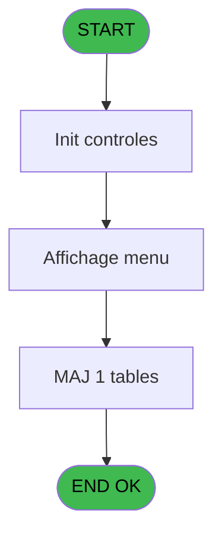
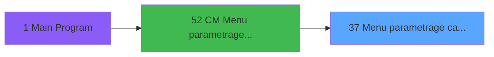
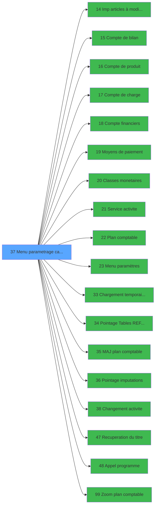

# MAI IDE 37 - Menu parametrage caisse

> **Analyse**: Phases 1-4 2026-02-03 14:52 -> 14:53 (10s) | Assemblage 14:53
> **Pipeline**: V7.2 Enrichi
> **Structure**: 4 onglets (Resume | Ecrans | Donnees | Connexions)

<!-- TAB:Resume -->

## 1. FICHE D'IDENTITE

| Attribut | Valeur |
|----------|--------|
| Projet | MAI |
| IDE Position | 37 |
| Nom Programme | Menu parametrage caisse |
| Fichier source | `Prg_37.xml` |
| Dossier IDE | Caisse |
| Taches | 11 (4 ecrans visibles) |
| Tables modifiees | 1 |
| Programmes appeles | 18 |

## 2. DESCRIPTION FONCTIONNELLE

**Menu parametrage caisse** assure la gestion complete de ce processus, accessible depuis [CM  Menu parametrage caisse (IDE 52)](MAI-IDE-52.md).

Le flux de traitement s'organise en **4 blocs fonctionnels** :

- **Traitement** (7 taches) : traitements metier divers
- **Consultation** (2 taches) : ecrans de recherche, selection et consultation
- **Validation** (1 tache) : controles et verifications de coherence
- **Calcul** (1 tache) : calculs de montants, stocks ou compteurs

**Donnees modifiees** : 1 tables en ecriture (services_ims_par_pc).

Detail : phases du traitement

#### Phase 1 : Traitement (7 taches)

- **37** - CV  Menu parametrage cam **[[ECRAN]](#ecran-t1)**
- **37.1.1** - Aiguillage
- **37.3** - Nom village
- **37.4** - paramètre auto
- **37.5** - (sans nom) **[[ECRAN]](#ecran-t9)**
- **37.6.1** - Abandon
- **37.7** - Utilisateurs connectes **[[ECRAN]](#ecran-t14)**

Delegue a : [Imp articles à modifier WS (IDE 14)](MAI-IDE-14.md), [Classes monetaires (IDE 20)](MAI-IDE-20.md), [Service activite (IDE 21)](MAI-IDE-21.md), [Menu paramètres (IDE 23)](MAI-IDE-23.md), [Chargement temporaire du plan (IDE 33)](MAI-IDE-33.md), [Pointage Tables REF et Params (IDE 34)](MAI-IDE-34.md), [Pointage imputations (IDE 36)](MAI-IDE-36.md), [Changement activite (IDE 38)](MAI-IDE-38.md), [Recuperation du titre (IDE 47)](MAI-IDE-47.md), [Appel programme (IDE 48)](MAI-IDE-48.md)

#### Phase 2 : Consultation (2 taches)

- **37.1** - Affichage menu **[[ECRAN]](#ecran-t2)**
- **37.6** - Choix activite **[[ECRAN]](#ecran-t11)**

Delegue a : [Recuperation du titre (IDE 47)](MAI-IDE-47.md), [Zoom plan comptable (IDE 99)](MAI-IDE-99.md)

#### Phase 3 : Calcul (1 tache)

- **37.2** - Date comptable

Delegue a : [Compte de bilan (IDE 15)](MAI-IDE-15.md), [Compte de produit (IDE 16)](MAI-IDE-16.md), [Compte de charge (IDE 17)](MAI-IDE-17.md), [Compte financiers (IDE 18)](MAI-IDE-18.md), [Plan comptable (IDE 22)](MAI-IDE-22.md), [MAJ plan comptable (IDE 35)](MAI-IDE-35.md), [Zoom plan comptable (IDE 99)](MAI-IDE-99.md)

#### Phase 4 : Validation (1 tache)

- **37.6.2** - Validation

#### Tables impactees

| Table | Operations | Role metier |
|-------|-----------|-------------|
| services_ims_par_pc | **W** (1 usages) | Services / filieres |

## 3. BLOCS FONCTIONNELS

### 3.1 Traitement (7 taches)

Traitements internes.

---

#### 37 - CV  Menu parametrage cam [[ECRAN]](#ecran-t1)

**Role** : Tache d'orchestration : point d'entree du programme (7 sous-taches). Coordonne l'enchainement des traitements.
**Ecran** : 640 x 9 DLU (MDI) | [Voir mockup](#ecran-t1)

6 sous-taches directes

| Tache | Nom | Bloc |
|-------|-----|------|
| [37.1.1](#t3) | Aiguillage | Traitement |
| [37.3](#t5) | Nom village | Traitement |
| [37.4](#t8) | paramètre auto | Traitement |
| [37.5](#t9) | (sans nom) **[[ECRAN]](#ecran-t9)** | Traitement |
| [37.6.1](#t12) | Abandon | Traitement |
| [37.7](#t14) | Utilisateurs connectes **[[ECRAN]](#ecran-t14)** | Traitement |

**Delegue a** : [Imp articles à modifier WS (IDE 14)](MAI-IDE-14.md), [Classes monetaires (IDE 20)](MAI-IDE-20.md), [Service activite (IDE 21)](MAI-IDE-21.md)

---

#### 37.1.1 - Aiguillage

**Role** : Traitement : Aiguillage.
**Delegue a** : [Imp articles à modifier WS (IDE 14)](MAI-IDE-14.md), [Classes monetaires (IDE 20)](MAI-IDE-20.md), [Service activite (IDE 21)](MAI-IDE-21.md)

---

#### 37.3 - Nom village

**Role** : Traitement : Nom village.
**Variables liees** : F (W0 Nom village)
**Delegue a** : [Imp articles à modifier WS (IDE 14)](MAI-IDE-14.md), [Classes monetaires (IDE 20)](MAI-IDE-20.md), [Service activite (IDE 21)](MAI-IDE-21.md)

---

#### 37.4 - paramètre auto

**Role** : Traitement : paramètre auto.
**Variables liees** : G (W0 Param Mode auto), H (W0 init auto demandee), I (W0 init auto confirmee), K (W0 MAJ plan autorisation)
**Delegue a** : [Imp articles à modifier WS (IDE 14)](MAI-IDE-14.md), [Classes monetaires (IDE 20)](MAI-IDE-20.md), [Service activite (IDE 21)](MAI-IDE-21.md)

---

#### 37.5 - (sans nom) [[ECRAN]](#ecran-t9)

**Role** : Traitement interne.
**Ecran** : 1040 x 271 DLU (MDI) | [Voir mockup](#ecran-t9)
**Delegue a** : [Imp articles à modifier WS (IDE 14)](MAI-IDE-14.md), [Classes monetaires (IDE 20)](MAI-IDE-20.md), [Service activite (IDE 21)](MAI-IDE-21.md)

---

#### 37.6.1 - Abandon

**Role** : Traitement : Abandon.
**Variables liees** : N (W0 MAJ plan abandon)
**Delegue a** : [Imp articles à modifier WS (IDE 14)](MAI-IDE-14.md), [Classes monetaires (IDE 20)](MAI-IDE-20.md), [Service activite (IDE 21)](MAI-IDE-21.md)

---

#### 37.7 - Utilisateurs connectes [[ECRAN]](#ecran-t14)

**Role** : Traitement : Utilisateurs connectes.
**Ecran** : 885 x 233 DLU (MDI) | [Voir mockup](#ecran-t14)
**Delegue a** : [Imp articles à modifier WS (IDE 14)](MAI-IDE-14.md), [Classes monetaires (IDE 20)](MAI-IDE-20.md), [Service activite (IDE 21)](MAI-IDE-21.md)

### 3.2 Consultation (2 taches)

Ecrans de recherche et consultation.

---

#### 37.1 - Affichage menu [[ECRAN]](#ecran-t2)

**Role** : Reinitialisation : Affichage menu.
**Ecran** : 848 x 242 DLU (MDI) | [Voir mockup](#ecran-t2)

---

#### 37.6 - Choix activite [[ECRAN]](#ecran-t11)

**Role** : Selection par l'operateur : Choix activite.
**Ecran** : 646 x 202 DLU (MDI) | [Voir mockup](#ecran-t11)
**Variables liees** : D (W0 choix action), J (W0 changement activite demande)

### 3.3 Calcul (1 tache)

Calculs metier : montants, stocks, compteurs.

---

#### 37.2 - Date comptable

**Role** : Traitement : Date comptable.
**Variables liees** : E (W0 Date comptable)
**Delegue a** : [Compte de bilan (IDE 15)](MAI-IDE-15.md), [Compte de produit (IDE 16)](MAI-IDE-16.md), [Compte de charge (IDE 17)](MAI-IDE-17.md)

### 3.4 Validation (1 tache)

Controles de coherence : 1 tache verifie les donnees et conditions.

---

#### 37.6.2 - Validation

**Role** : Verification : Validation.
**Variables liees** : O (W0 MAJ plan validation)

## 5. REGLES METIER

*(Aucune regle metier identifiee)*

## 6. CONTEXTE

- **Appele par**: [CM  Menu parametrage caisse (IDE 52)](MAI-IDE-52.md)
- **Appelle**: 18 programmes | **Tables**: 5 (W:1 R:4 L:0) | **Taches**: 11 | **Expressions**: 30

<!-- TAB:Ecrans -->

## 8. ECRANS

### 8.1 Forms visibles (4 / 11)

| # | Position | Tache | Nom | Type | Largeur | Hauteur | Bloc |
|---|----------|-------|-----|------|---------|---------|------|
| 1 | 37.1 | 37.1 | Affichage menu | MDI | 848 | 242 | Consultation |
| 2 | 37.5 | 37.5 | (sans nom) | MDI | 1040 | 271 | Traitement |
| 3 | 37.6 | 37.6 | Choix activite | MDI | 646 | 202 | Consultation |
| 4 | 37.7 | 37.7 | Utilisateurs connectes | MDI | 885 | 233 | Traitement |

### 8.2 Mockups Ecrans

---

#### 37.1 - Affichage menu
**Tache** : [37.1](#t2) | **Type** : MDI | **Dimensions** : 848 x 242 DLU
**Bloc** : Consultation | **Titre IDE** : Affichage menu

<!-- FORM-DATA:
{
    "width":  848,
    "vFactor":  8,
    "type":  "MDI",
    "hFactor":  8,
    "controls":  [
                     {
                         "x":  0,
                         "type":  "label",
                         "var":  "",
                         "y":  0,
                         "w":  842,
                         "fmt":  "",
                         "name":  "",
                         "h":  18,
                         "color":  "",
                         "text":  "",
                         "parent":  null
                     },
                     {
                         "x":  0,
                         "type":  "label",
                         "var":  "",
                         "y":  23,
                         "w":  841,
                         "fmt":  "",
                         "name":  "",
                         "h":  186,
                         "color":  "",
                         "text":  "",
                         "parent":  null
                     },
                     {
                         "x":  306,
                         "type":  "label",
                         "var":  "",
                         "y":  47,
                         "w":  512,
                         "fmt":  "",
                         "name":  "",
                         "h":  131,
                         "color":  "",
                         "text":  "",
                         "parent":  4
                     },
                     {
                         "x":  309,
                         "type":  "label",
                         "var":  "",
                         "y":  48,
                         "w":  48,
                         "fmt":  "",
                         "name":  "",
                         "h":  129,
                         "color":  "",
                         "text":  "",
                         "parent":  4
                     },
                     {
                         "x":  370,
                         "type":  "label",
                         "var":  "",
                         "y":  52,
                         "w":  421,
                         "fmt":  "",
                         "name":  "",
                         "h":  8,
                         "color":  "7",
                         "text":  "Plan comptable",
                         "parent":  4
                     },
                     {
                         "x":  370,
                         "type":  "label",
                         "var":  "",
                         "y":  66,
                         "w":  421,
                         "fmt":  "",
                         "name":  "",
                         "h":  8,
                         "color":  "7",
                         "text":  "Services / Activites",
                         "parent":  4
                     },
                     {
                         "x":  370,
                         "type":  "label",
                         "var":  "",
                         "y":  80,
                         "w":  421,
                         "fmt":  "",
                         "name":  "",
                         "h":  8,
                         "color":  "7",
                         "text":  "Classes monetaires",
                         "parent":  4
                     },
                     {
                         "x":  370,
                         "type":  "label",
                         "var":  "",
                         "y":  94,
                         "w":  421,
                         "fmt":  "",
                         "name":  "",
                         "h":  8,
                         "color":  "7",
                         "text":  "Comptes financiers",
                         "parent":  4
                     },
                     {
                         "x":  370,
                         "type":  "label",
                         "var":  "",
                         "y":  108,
                         "w":  421,
                         "fmt":  "",
                         "name":  "",
                         "h":  8,
                         "color":  "7",
                         "text":  "Moyens de paiement",
                         "parent":  4
                     },
                     {
                         "x":  370,
                         "type":  "label",
                         "var":  "",
                         "y":  122,
                         "w":  421,
                         "fmt":  "",
                         "name":  "",
                         "h":  8,
                         "color":  "7",
                         "text":  "Comptes de charge",
                         "parent":  4
                     },
                     {
                         "x":  370,
                         "type":  "label",
                         "var":  "",
                         "y":  136,
                         "w":  421,
                         "fmt":  "",
                         "name":  "",
                         "h":  8,
                         "color":  "7",
                         "text":  "Comptes de produit",
                         "parent":  4
                     },
                     {
                         "x":  370,
                         "type":  "label",
                         "var":  "",
                         "y":  150,
                         "w":  421,
                         "fmt":  "",
                         "name":  "",
                         "h":  8,
                         "color":  "7",
                         "text":  "Comptes de bilan",
                         "parent":  4
                     },
                     {
                         "x":  370,
                         "type":  "label",
                         "var":  "",
                         "y":  165,
                         "w":  421,
                         "fmt":  "",
                         "name":  "",
                         "h":  8,
                         "color":  "7",
                         "text":  "Paramètres",
                         "parent":  4
                     },
                     {
                         "x":  476,
                         "type":  "label",
                         "var":  "",
                         "y":  184,
                         "w":  123,
                         "fmt":  "",
                         "name":  "",
                         "h":  10,
                         "color":  "",
                         "text":  "Votre choix",
                         "parent":  4
                     },
                     {
                         "x":  0,
                         "type":  "label",
                         "var":  "",
                         "y":  215,
                         "w":  841,
                         "fmt":  "",
                         "name":  "",
                         "h":  24,
                         "color":  "",
                         "text":  "",
                         "parent":  null
                     },
                     {
                         "x":  14,
                         "type":  "button",
                         "var":  "",
                         "y":  129,
                         "w":  272,
                         "fmt":  "",
                         "name":  "CHGACT",
                         "h":  18,
                         "color":  "",
                         "text":  "",
                         "parent":  null
                     },
                     {
                         "x":  14,
                         "type":  "button",
                         "var":  "",
                         "y":  158,
                         "w":  272,
                         "fmt":  "",
                         "name":  "MAJPLA",
                         "h":  18,
                         "color":  "",
                         "text":  "",
                         "parent":  null
                     },
                     {
                         "x":  14,
                         "type":  "button",
                         "var":  "",
                         "y":  187,
                         "w":  272,
                         "fmt":  "",
                         "name":  "POINTAGE",
                         "h":  18,
                         "color":  "",
                         "text":  "",
                         "parent":  null
                     },
                     {
                         "x":  335,
                         "type":  "button",
                         "var":  "",
                         "y":  218,
                         "w":  320,
                         "fmt":  "",
                         "name":  "INIAUT",
                         "h":  18,
                         "color":  "",
                         "text":  "",
                         "parent":  null
                     },
                     {
                         "x":  610,
                         "type":  "edit",
                         "var":  "",
                         "y":  184,
                         "w":  26,
                         "fmt":  "",
                         "name":  "",
                         "h":  10,
                         "color":  "6",
                         "text":  "",
                         "parent":  4
                     },
                     {
                         "x":  6,
                         "type":  "edit",
                         "var":  "",
                         "y":  4,
                         "w":  267,
                         "fmt":  "20",
                         "name":  "",
                         "h":  8,
                         "color":  "",
                         "text":  "",
                         "parent":  null
                     },
                     {
                         "x":  563,
                         "type":  "edit",
                         "var":  "",
                         "y":  5,
                         "w":  268,
                         "fmt":  "WWW DD MMM YYYYT",
                         "name":  "",
                         "h":  8,
                         "color":  "",
                         "text":  "",
                         "parent":  null
                     },
                     {
                         "x":  77,
                         "type":  "image",
                         "var":  "",
                         "y":  47,
                         "w":  147,
                         "fmt":  "",
                         "name":  "",
                         "h":  62,
                         "color":  "",
                         "text":  "",
                         "parent":  null
                     },
                     {
                         "x":  320,
                         "type":  "button",
                         "var":  "",
                         "y":  51,
                         "w":  26,
                         "fmt":  "1",
                         "name":  "1",
                         "h":  8,
                         "color":  "",
                         "text":  "",
                         "parent":  null
                     },
                     {
                         "x":  320,
                         "type":  "button",
                         "var":  "",
                         "y":  66,
                         "w":  26,
                         "fmt":  "2",
                         "name":  "2",
                         "h":  8,
                         "color":  "",
                         "text":  "",
                         "parent":  null
                     },
                     {
                         "x":  320,
                         "type":  "button",
                         "var":  "",
                         "y":  80,
                         "w":  26,
                         "fmt":  "3",
                         "name":  "3",
                         "h":  8,
                         "color":  "",
                         "text":  "",
                         "parent":  null
                     },
                     {
                         "x":  320,
                         "type":  "button",
                         "var":  "",
                         "y":  94,
                         "w":  26,
                         "fmt":  "4",
                         "name":  "4",
                         "h":  8,
                         "color":  "",
                         "text":  "",
                         "parent":  null
                     },
                     {
                         "x":  320,
                         "type":  "button",
                         "var":  "",
                         "y":  108,
                         "w":  26,
                         "fmt":  "5",
                         "name":  "5",
                         "h":  8,
                         "color":  "",
                         "text":  "",
                         "parent":  null
                     },
                     {
                         "x":  320,
                         "type":  "button",
                         "var":  "",
                         "y":  122,
                         "w":  26,
                         "fmt":  "6",
                         "name":  "6",
                         "h":  8,
                         "color":  "",
                         "text":  "",
                         "parent":  null
                     },
                     {
                         "x":  320,
                         "type":  "button",
                         "var":  "",
                         "y":  136,
                         "w":  26,
                         "fmt":  "7",
                         "name":  "7",
                         "h":  8,
                         "color":  "",
                         "text":  "",
                         "parent":  null
                     },
                     {
                         "x":  320,
                         "type":  "button",
                         "var":  "",
                         "y":  150,
                         "w":  26,
                         "fmt":  "8",
                         "name":  "8",
                         "h":  8,
                         "color":  "",
                         "text":  "",
                         "parent":  null
                     },
                     {
                         "x":  320,
                         "type":  "button",
                         "var":  "",
                         "y":  165,
                         "w":  26,
                         "fmt":  "9",
                         "name":  "9",
                         "h":  8,
                         "color":  "",
                         "text":  "",
                         "parent":  null
                     },
                     {
                         "x":  7,
                         "type":  "button",
                         "var":  "",
                         "y":  218,
                         "w":  168,
                         "fmt":  "\u0026Quitter",
                         "name":  "",
                         "h":  18,
                         "color":  "",
                         "text":  "",
                         "parent":  null
                     }
                 ],
    "taskId":  "37.1",
    "height":  242
}
-->

<strong>Champs : 3 champs</strong>

| Pos (x,y) | Nom | Variable | Type |
|-----------|-----|----------|------|
| 610,184 | (sans nom) | - | edit |
| 6,4 | 20 | - | edit |
| 563,5 | WWW DD MMM YYYYT | - | edit |

<strong>Boutons : 14 boutons</strong>

| Bouton | Pos (x,y) | Action |
|--------|-----------|--------|
| CHGACT | 14,129 | Bouton fonctionnel |
| MAJPLA | 14,158 | Bouton fonctionnel |
| POINTAGE | 14,187 | Appel [Pointage Tables REF et Params (IDE 34)](MAI-IDE-34.md) |
| INIAUT | 335,218 | Bouton fonctionnel |
| 1 | 320,51 | Bouton fonctionnel |
| 2 | 320,66 | Bouton fonctionnel |
| 3 | 320,80 | Bouton fonctionnel |
| 4 | 320,94 | Bouton fonctionnel |
| 5 | 320,108 | Bouton fonctionnel |
| 6 | 320,122 | Bouton fonctionnel |
| 7 | 320,136 | Bouton fonctionnel |
| 8 | 320,150 | Bouton fonctionnel |
| 9 | 320,165 | Bouton fonctionnel |
| Quitter | 7,218 | Quitte le programme |

---

#### 37.5 - (sans nom)
**Tache** : [37.5](#t9) | **Type** : MDI | **Dimensions** : 1040 x 271 DLU
**Bloc** : Traitement | **Titre IDE** : (sans nom)

<!-- FORM-DATA:
{
    "width":  1040,
    "vFactor":  8,
    "type":  "MDI",
    "hFactor":  8,
    "controls":  [
                     {
                         "x":  40,
                         "type":  "label",
                         "var":  "",
                         "y":  0,
                         "w":  960,
                         "fmt":  "",
                         "name":  "",
                         "h":  24,
                         "color":  "",
                         "text":  "Initialisation automatique de la caisse",
                         "parent":  null
                     },
                     {
                         "x":  40,
                         "type":  "label",
                         "var":  "",
                         "y":  247,
                         "w":  960,
                         "fmt":  "",
                         "name":  "",
                         "h":  24,
                         "color":  "",
                         "text":  "Veuillez patienter S.V.P.",
                         "parent":  null
                     },
                     {
                         "x":  8,
                         "type":  "edit",
                         "var":  "",
                         "y":  131,
                         "w":  8,
                         "fmt":  "",
                         "name":  "",
                         "h":  8,
                         "color":  "",
                         "text":  "",
                         "parent":  null
                     },
                     {
                         "x":  877,
                         "type":  "image",
                         "var":  "",
                         "y":  100,
                         "w":  141,
                         "fmt":  "",
                         "name":  "",
                         "h":  55,
                         "color":  "",
                         "text":  "",
                         "parent":  null
                     }
                 ],
    "taskId":  "37.5",
    "height":  271
}
-->

<strong>Champs : 1 champs</strong>

| Pos (x,y) | Nom | Variable | Type |
|-----------|-----|----------|------|
| 8,131 | (sans nom) | - | edit |

---

#### 37.6 - Choix activite
**Tache** : [37.6](#t11) | **Type** : MDI | **Dimensions** : 646 x 202 DLU
**Bloc** : Consultation | **Titre IDE** : Choix activite

<!-- FORM-DATA:
{
    "width":  646,
    "vFactor":  8,
    "type":  "MDI",
    "hFactor":  8,
    "controls":  [
                     {
                         "x":  0,
                         "type":  "label",
                         "var":  "",
                         "y":  0,
                         "w":  640,
                         "fmt":  "",
                         "name":  "",
                         "h":  19,
                         "color":  "",
                         "text":  "",
                         "parent":  null
                     },
                     {
                         "x":  0,
                         "type":  "label",
                         "var":  "",
                         "y":  21,
                         "w":  640,
                         "fmt":  "",
                         "name":  "",
                         "h":  71,
                         "color":  "",
                         "text":  "",
                         "parent":  null
                     },
                     {
                         "x":  26,
                         "type":  "label",
                         "var":  "",
                         "y":  26,
                         "w":  240,
                         "fmt":  "",
                         "name":  "",
                         "h":  8,
                         "color":  "",
                         "text":  "Ancien code activite",
                         "parent":  null
                     },
                     {
                         "x":  26,
                         "type":  "label",
                         "var":  "",
                         "y":  41,
                         "w":  107,
                         "fmt":  "",
                         "name":  "",
                         "h":  10,
                         "color":  "",
                         "text":  "Code",
                         "parent":  null
                     },
                     {
                         "x":  26,
                         "type":  "label",
                         "var":  "",
                         "y":  60,
                         "w":  107,
                         "fmt":  "",
                         "name":  "",
                         "h":  10,
                         "color":  "",
                         "text":  "Libelle",
                         "parent":  null
                     },
                     {
                         "x":  0,
                         "type":  "label",
                         "var":  "",
                         "y":  102,
                         "w":  640,
                         "fmt":  "",
                         "name":  "",
                         "h":  71,
                         "color":  "",
                         "text":  "",
                         "parent":  null
                     },
                     {
                         "x":  26,
                         "type":  "label",
                         "var":  "",
                         "y":  106,
                         "w":  240,
                         "fmt":  "",
                         "name":  "",
                         "h":  8,
                         "color":  "",
                         "text":  "Nouveau code activite",
                         "parent":  null
                     },
                     {
                         "x":  26,
                         "type":  "label",
                         "var":  "",
                         "y":  123,
                         "w":  107,
                         "fmt":  "",
                         "name":  "",
                         "h":  10,
                         "color":  "",
                         "text":  "Code",
                         "parent":  null
                     },
                     {
                         "x":  26,
                         "type":  "label",
                         "var":  "",
                         "y":  142,
                         "w":  107,
                         "fmt":  "",
                         "name":  "",
                         "h":  10,
                         "color":  "",
                         "text":  "Libelle",
                         "parent":  null
                     },
                     {
                         "x":  0,
                         "type":  "label",
                         "var":  "",
                         "y":  176,
                         "w":  640,
                         "fmt":  "",
                         "name":  "",
                         "h":  24,
                         "color":  "",
                         "text":  "",
                         "parent":  null
                     },
                     {
                         "x":  125,
                         "type":  "edit",
                         "var":  "",
                         "y":  41,
                         "w":  48,
                         "fmt":  "3Z",
                         "name":  "Code activite old",
                         "h":  10,
                         "color":  "6",
                         "text":  "",
                         "parent":  null
                     },
                     {
                         "x":  125,
                         "type":  "edit",
                         "var":  "",
                         "y":  60,
                         "w":  480,
                         "fmt":  "",
                         "name":  "",
                         "h":  10,
                         "color":  "",
                         "text":  "",
                         "parent":  null
                     },
                     {
                         "x":  125,
                         "type":  "edit",
                         "var":  "",
                         "y":  123,
                         "w":  48,
                         "fmt":  "3Z",
                         "name":  "Code activite new",
                         "h":  10,
                         "color":  "6",
                         "text":  "",
                         "parent":  null
                     },
                     {
                         "x":  125,
                         "type":  "edit",
                         "var":  "",
                         "y":  142,
                         "w":  480,
                         "fmt":  "",
                         "name":  "Libelle activite new",
                         "h":  10,
                         "color":  "6",
                         "text":  "",
                         "parent":  null
                     },
                     {
                         "x":  8,
                         "type":  "edit",
                         "var":  "",
                         "y":  5,
                         "w":  267,
                         "fmt":  "30",
                         "name":  "",
                         "h":  8,
                         "color":  "",
                         "text":  "",
                         "parent":  null
                     },
                     {
                         "x":  321,
                         "type":  "edit",
                         "var":  "",
                         "y":  5,
                         "w":  313,
                         "fmt":  "WWW DD MMM YYYYT",
                         "name":  "",
                         "h":  8,
                         "color":  "",
                         "text":  "",
                         "parent":  null
                     },
                     {
                         "x":  480,
                         "type":  "button",
                         "var":  "",
                         "y":  179,
                         "w":  154,
                         "fmt":  "Validation",
                         "name":  "",
                         "h":  18,
                         "color":  "",
                         "text":  "",
                         "parent":  null
                     },
                     {
                         "x":  8,
                         "type":  "button",
                         "var":  "",
                         "y":  180,
                         "w":  154,
                         "fmt":  "Abandon",
                         "name":  "",
                         "h":  18,
                         "color":  "",
                         "text":  "",
                         "parent":  null
                     }
                 ],
    "taskId":  "37.6",
    "height":  202
}
-->

<strong>Champs : 6 champs</strong>

| Pos (x,y) | Nom | Variable | Type |
|-----------|-----|----------|------|
| 125,41 | Code activite old | - | edit |
| 125,60 | (sans nom) | - | edit |
| 125,123 | Code activite new | - | edit |
| 125,142 | Libelle activite new | - | edit |
| 8,5 | 30 | - | edit |
| 321,5 | WWW DD MMM YYYYT | - | edit |

<strong>Boutons : 2 boutons</strong>

| Bouton | Pos (x,y) | Action |
|--------|-----------|--------|
| Validation | 480,179 | Valide la saisie et enregistre |
| Abandon | 8,180 | Annule et retour au menu |

---

#### 37.7 - Utilisateurs connectes
**Tache** : [37.7](#t14) | **Type** : MDI | **Dimensions** : 885 x 233 DLU
**Bloc** : Traitement | **Titre IDE** : Utilisateurs connectes

<!-- FORM-DATA:
{
    "width":  885,
    "vFactor":  8,
    "type":  "MDI",
    "hFactor":  8,
    "controls":  [
                     {
                         "x":  2,
                         "type":  "label",
                         "var":  "",
                         "y":  3,
                         "w":  875,
                         "fmt":  "",
                         "name":  "",
                         "h":  19,
                         "color":  "",
                         "text":  "",
                         "parent":  null
                     },
                     {
                         "x":  47,
                         "type":  "table",
                         "var":  "",
                         "name":  "",
                         "titleH":  12,
                         "color":  "110",
                         "w":  790,
                         "y":  31,
                         "fmt":  "",
                         "parent":  null,
                         "text":  "",
                         "rowH":  12,
                         "h":  147,
                         "cols":  [
                                      {
                                          "title":  "Applciation",
                                          "layer":  1,
                                          "w":  246
                                      },
                                      {
                                          "title":  "Utilisateur",
                                          "layer":  2,
                                          "w":  247
                                      },
                                      {
                                          "title":  "Date et heure de connection",
                                          "layer":  3,
                                          "w":  261
                                      }
                                  ],
                         "rows":  3
                     },
                     {
                         "x":  50,
                         "type":  "label",
                         "var":  "",
                         "y":  182,
                         "w":  781,
                         "fmt":  "",
                         "name":  "",
                         "h":  8,
                         "color":  "",
                         "text":  "Pour verifier que tous les Utilisateurs sont deconnectes",
                         "parent":  null
                     },
                     {
                         "x":  4,
                         "type":  "label",
                         "var":  "",
                         "y":  205,
                         "w":  875,
                         "fmt":  "",
                         "name":  "",
                         "h":  24,
                         "color":  "",
                         "text":  "",
                         "parent":  null
                     },
                     {
                         "x":  59,
                         "type":  "edit",
                         "var":  "",
                         "y":  46,
                         "w":  232,
                         "fmt":  "",
                         "name":  "",
                         "h":  8,
                         "color":  "146",
                         "text":  "",
                         "parent":  4
                     },
                     {
                         "x":  302,
                         "type":  "edit",
                         "var":  "",
                         "y":  46,
                         "w":  232,
                         "fmt":  "",
                         "name":  "",
                         "h":  8,
                         "color":  "110",
                         "text":  "",
                         "parent":  4
                     },
                     {
                         "x":  554,
                         "type":  "edit",
                         "var":  "",
                         "y":  46,
                         "w":  120,
                         "fmt":  "",
                         "name":  "",
                         "h":  8,
                         "color":  "110",
                         "text":  "",
                         "parent":  4
                     },
                     {
                         "x":  690,
                         "type":  "edit",
                         "var":  "",
                         "y":  46,
                         "w":  98,
                         "fmt":  "",
                         "name":  "",
                         "h":  8,
                         "color":  "110",
                         "text":  "",
                         "parent":  4
                     },
                     {
                         "x":  504,
                         "type":  "edit",
                         "var":  "",
                         "y":  8,
                         "w":  365,
                         "fmt":  "WWW DD MMM YYYYT",
                         "name":  "",
                         "h":  8,
                         "color":  "",
                         "text":  "",
                         "parent":  1
                     },
                     {
                         "x":  10,
                         "type":  "button",
                         "var":  "",
                         "y":  208,
                         "w":  154,
                         "fmt":  "\u0026Quitter",
                         "name":  "",
                         "h":  18,
                         "color":  "",
                         "text":  "",
                         "parent":  13
                     },
                     {
                         "x":  12,
                         "type":  "edit",
                         "var":  "",
                         "y":  8,
                         "w":  267,
                         "fmt":  "30",
                         "name":  "",
                         "h":  8,
                         "color":  "",
                         "text":  "",
                         "parent":  1
                     }
                 ],
    "taskId":  "37.7",
    "height":  233
}
-->

<strong>Champs : 6 champs</strong>

| Pos (x,y) | Nom | Variable | Type |
|-----------|-----|----------|------|
| 59,46 | (sans nom) | - | edit |
| 302,46 | (sans nom) | - | edit |
| 554,46 | (sans nom) | - | edit |
| 690,46 | (sans nom) | - | edit |
| 504,8 | WWW DD MMM YYYYT | - | edit |
| 12,8 | 30 | - | edit |

<strong>Boutons : 1 boutons</strong>

| Bouton | Pos (x,y) | Action |
|--------|-----------|--------|
| Quitter | 10,208 | Quitte le programme |

## 9. NAVIGATION

### 9.1 Enchainement des ecrans

```mermaid
flowchart TD
    START([Entree])
    style START fill:#3fb950
    VF2[37.1 Affichage menu]
    style VF2 fill:#58a6ff
    VF9[37.5 sans nom]
    style VF9 fill:#58a6ff
    VF11[37.6 Choix activite]
    style VF11 fill:#58a6ff
    VF14[37.7 Utilisateurs conne...]
    style VF14 fill:#58a6ff
    EXT14[IDE 14 Imp articles à ...]
    style EXT14 fill:#3fb950
    EXT15[IDE 15 Compte de bilan]
    style EXT15 fill:#3fb950
    EXT16[IDE 16 Compte de produit]
    style EXT16 fill:#3fb950
    EXT17[IDE 17 Compte de charge]
    style EXT17 fill:#3fb950
    EXT18[IDE 18 Compte financiers]
    style EXT18 fill:#3fb950
    EXT19[IDE 19 Moyens de paiement]
    style EXT19 fill:#3fb950
    EXT20[IDE 20 Classes monetaires]
    style EXT20 fill:#3fb950
    EXT21[IDE 21 Service activite]
    style EXT21 fill:#3fb950
    EXT22[IDE 22 Plan comptable]
    style EXT22 fill:#3fb950
    EXT23[IDE 23 Menu paramètres]
    style EXT23 fill:#3fb950
    EXT33[IDE 33 Chargement temp...]
    style EXT33 fill:#3fb950
    EXT34[IDE 34 Pointage Tables...]
    style EXT34 fill:#3fb950
    EXT35[IDE 35 MAJ plan comptable]
    style EXT35 fill:#3fb950
    EXT36[IDE 36 Pointage imputa...]
    style EXT36 fill:#3fb950
    EXT38[IDE 38 Changement acti...]
    style EXT38 fill:#3fb950
    EXT47[IDE 47 Recuperation du...]
    style EXT47 fill:#3fb950
    EXT48[IDE 48 Appel programme]
    style EXT48 fill:#3fb950
    EXT99[IDE 99 Zoom plan compt...]
    style EXT99 fill:#3fb950
    FIN([Sortie])
    style FIN fill:#f85149
    START --> VF2
    VF2 -->|Sous-programme| EXT14
    VF2 -->|Sous-programme| EXT15
    VF2 -->|Sous-programme| EXT16
    VF2 -->|Sous-programme| EXT17
    VF2 -->|Sous-programme| EXT18
    VF2 -->|Sous-programme| EXT19
    VF2 -->|Sous-programme| EXT20
    VF2 -->|Sous-programme| EXT21
    EXT99 --> FIN
```

**Detail par enchainement :**

| Depuis | Action | Vers | Retour |
|--------|--------|------|--------|
| Affichage menu | Sous-programme | [Imp articles à modifier WS (IDE 14)](MAI-IDE-14.md) | Retour ecran |
| Affichage menu | Sous-programme | [Compte de bilan (IDE 15)](MAI-IDE-15.md) | Retour ecran |
| Affichage menu | Sous-programme | [Compte de produit (IDE 16)](MAI-IDE-16.md) | Retour ecran |
| Affichage menu | Sous-programme | [Compte de charge (IDE 17)](MAI-IDE-17.md) | Retour ecran |
| Affichage menu | Sous-programme | [Compte financiers (IDE 18)](MAI-IDE-18.md) | Retour ecran |
| Affichage menu | Sous-programme | [Moyens de paiement (IDE 19)](MAI-IDE-19.md) | Retour ecran |
| Affichage menu | Sous-programme | [Classes monetaires (IDE 20)](MAI-IDE-20.md) | Retour ecran |
| Affichage menu | Sous-programme | [Service activite (IDE 21)](MAI-IDE-21.md) | Retour ecran |
| Affichage menu | Sous-programme | [Plan comptable (IDE 22)](MAI-IDE-22.md) | Retour ecran |
| Affichage menu | Navigation menu | [Menu paramètres (IDE 23)](MAI-IDE-23.md) | Retour ecran |
| Affichage menu | Sous-programme | [Chargement temporaire du plan (IDE 33)](MAI-IDE-33.md) | Retour ecran |
| Affichage menu | Sous-programme | [Pointage Tables REF et Params (IDE 34)](MAI-IDE-34.md) | Retour ecran |
| Affichage menu | Mise a jour donnees | [MAJ plan comptable (IDE 35)](MAI-IDE-35.md) | Retour ecran |
| Affichage menu | Sous-programme | [Pointage imputations (IDE 36)](MAI-IDE-36.md) | Retour ecran |
| Affichage menu | Sous-programme | [Changement activite (IDE 38)](MAI-IDE-38.md) | Retour ecran |
| Affichage menu | Recuperation donnees | [Recuperation du titre (IDE 47)](MAI-IDE-47.md) | Retour ecran |
| Affichage menu | Sous-programme | [Appel programme (IDE 48)](MAI-IDE-48.md) | Retour ecran |
| Affichage menu | Selection/consultation | [Zoom plan comptable (IDE 99)](MAI-IDE-99.md) | Retour ecran |

### 9.3 Structure hierarchique (11 taches)

| Position | Tache | Type | Dimensions | Bloc |
|----------|-------|------|------------|------|
| **37.1** | [**CV  Menu parametrage cam** (37)](#t1) [mockup](#ecran-t1) | MDI | 640x9 | Traitement |
| 37.1.1 | [Aiguillage (37.1.1)](#t3) | MDI | - | |
| 37.1.2 | [Nom village (37.3)](#t5) | MDI | - | |
| 37.1.3 | [paramètre auto (37.4)](#t8) | MDI | - | |
| 37.1.4 | [(sans nom) (37.5)](#t9) [mockup](#ecran-t9) | MDI | 1040x271 | |
| 37.1.5 | [Abandon (37.6.1)](#t12) | MDI | - | |
| 37.1.6 | [Utilisateurs connectes (37.7)](#t14) [mockup](#ecran-t14) | MDI | 885x233 | |
| **37.2** | [**Affichage menu** (37.1)](#t2) [mockup](#ecran-t2) | MDI | 848x242 | Consultation |
| 37.2.1 | [Choix activite (37.6)](#t11) [mockup](#ecran-t11) | MDI | 646x202 | |
| **37.3** | [**Date comptable** (37.2)](#t4) | MDI | - | Calcul |
| **37.4** | [**Validation** (37.6.2)](#t13) | MDI | - | Validation |

### 9.4 Algorigramme

> **Legende**: Vert = START/END OK | Rouge = END KO | Bleu = Decisions
> *Algorigramme auto-genere. Utiliser `/algorigramme` pour une synthese metier detaillee.*

<!-- TAB:Donnees -->

## 10. TABLES

### Tables utilisees (5)

| ID | Nom | Description | Type | R | W | L | Usages |
|----|-----|-------------|------|---|---|---|--------|
| 69 | initialisation___ini |  | DB | R |   |   | 1 |
| 70 | date_comptable___dat |  | DB | R |   |   | 1 |
| 209 | plan_comptable_central |  | DB | R |   |   | 1 |
| 697 | droits_applications | Droits operateur | DB | R |   |   | 1 |
| 712 | services_ims_par_pc | Services / filieres | DB |   | **W** |   | 1 |

### Colonnes par table (3 / 5 tables avec colonnes identifiees)

Table 69 - initialisation___ini (R) - 1 usages

| Lettre | Variable | Acces | Type |
|--------|----------|-------|------|
| D | Initialisation auto | R | Alpha |

Table 70 - date_comptable___dat (R) - 1 usages

| Lettre | Variable | Acces | Type |
|--------|----------|-------|------|
| E | W0 Date comptable | R | Date |

Table 209 - plan_comptable_central (R) - 1 usages

| Lettre | Variable | Acces | Type |
|--------|----------|-------|------|
| A | Code activite old | R | Numeric |
| B | Code activite new | R | Numeric |
| C | Libelle activite new | R | Alpha |

Table 697 - droits_applications (R) - 1 usages

*Table utilisee uniquement en Link ou aucune colonne Real identifiee dans le DataView.*

Table 712 - services_ims_par_pc (**W**) - 1 usages

*Table utilisee uniquement en Link ou aucune colonne Real identifiee dans le DataView.*

## 11. VARIABLES

### 11.1 Parametres entrants (3)

Variables recues du programme appelant ([CM  Menu parametrage caisse (IDE 52)](MAI-IDE-52.md)).

| Lettre | Nom | Type | Usage dans |
|--------|-----|------|-----------|
| A | P0 societe | Alpha | 1x parametre entrant |
| B | P0 devise locale | Alpha | 1x parametre entrant |
| C | P0 uniBi | Alpha | - |

### 11.2 Variables de travail (13)

Variables internes au programme.

| Lettre | Nom | Type | Usage dans |
|--------|-----|------|-----------|
| D | W0 choix action | Alpha | [37.6](#t11) |
| E | W0 Date comptable | Date | - |
| F | W0 Nom village | Alpha | - |
| G | W0 Param Mode auto | Logical | [37](#t1), [37.4](#t8) |
| H | W0 init auto demandee | Logical | [37.4](#t8) |
| I | W0 init auto confirmee | Numeric | [37.4](#t8) |
| J | W0 changement activite demande | Logical | - |
| K | W0 MAJ plan autorisation | Logical | - |
| L | W0 MAJ plan demandee | Logical | 1x calcul interne |
| M | W0 MAJ plan lancee | Numeric | 1x calcul interne |
| N | W0 MAJ plan abandon | Logical | - |
| O | W0 MAJ plan validation | Logical | [37.6.2](#t13) |
| P | W0 Pointage imputations | Logical | 1x calcul interne |

Toutes les 16 variables (liste complete)

| Cat | Lettre | Nom Variable | Type |
|-----|--------|--------------|------|
| P0 | **A** | P0 societe | Alpha |
| P0 | **B** | P0 devise locale | Alpha |
| P0 | **C** | P0 uniBi | Alpha |
| W0 | **D** | W0 choix action | Alpha |
| W0 | **E** | W0 Date comptable | Date |
| W0 | **F** | W0 Nom village | Alpha |
| W0 | **G** | W0 Param Mode auto | Logical |
| W0 | **H** | W0 init auto demandee | Logical |
| W0 | **I** | W0 init auto confirmee | Numeric |
| W0 | **J** | W0 changement activite demande | Logical |
| W0 | **K** | W0 MAJ plan autorisation | Logical |
| W0 | **L** | W0 MAJ plan demandee | Logical |
| W0 | **M** | W0 MAJ plan lancee | Numeric |
| W0 | **N** | W0 MAJ plan abandon | Logical |
| W0 | **O** | W0 MAJ plan validation | Logical |
| W0 | **P** | W0 Pointage imputations | Logical |

## 12. EXPRESSIONS

**30 / 30 expressions decodees (100%)**

### 12.1 Repartition par type

| Type | Expressions | Regles |
|------|-------------|--------|
| CALCULATION | 1 | 0 |
| CONSTANTE | 3 | 0 |
| CONDITION | 15 | 0 |
| NEGATION | 1 | 0 |
| OTHER | 7 | 0 |
| CAST_LOGIQUE | 3 | 0 |

### 12.2 Expressions cles par type

#### CALCULATION (1 expressions)

| Type | IDE | Expression | Regle |
|------|-----|------------|-------|
| CALCULATION | 15 | `CallProg('{323,-1}'PROG,DbName('{77,2}'DSOURCE))` | - |

#### CONSTANTE (3 expressions)

| Type | IDE | Expression | Regle |
|------|-----|------------|-------|
| CONSTANTE | 29 | `0` | - |
| CONSTANTE | 4 | `'EUR'` | - |
| CONSTANTE | 3 | `'C'` | - |

#### CONDITION (15 expressions)

| Type | IDE | Expression | Regle |
|------|-----|------------|-------|
| CONDITION | 13 | `W0 choix action [D]='9'` | - |
| CONDITION | 12 | `W0 choix action [D]='8'` | - |
| CONDITION | 11 | `W0 choix action [D]='7'` | - |
| CONDITION | 14 | `W0 choix action [D]='F'` | - |
| CONDITION | 24 | `W0 MAJ plan lancee [M]=6` | - |
| ... | | *+10 autres* | |

#### NEGATION (1 expressions)

| Type | IDE | Expression | Regle |
|------|-----|------------|-------|
| NEGATION | 16 | `NOT (W0 Param Mode auto [G])` | - |

#### OTHER (7 expressions)

| Type | IDE | Expression | Regle |
|------|-----|------------|-------|
| OTHER | 25 | `W0 MAJ plan validation [O]` | - |
| OTHER | 26 | `DbDel ('{502,2}'DSOURCE,'')` | - |
| OTHER | 27 | `DbDel ('{486,2}'DSOURCE,'')` | - |
| OTHER | 23 | `W0 MAJ plan demandee [L]` | - |
| OTHER | 17 | `W0 Param Mode auto [G] AND W0 init auto demandee [H]` | - |
| ... | | *+2 autres* | |

#### CAST_LOGIQUE (3 expressions)

| Type | IDE | Expression | Regle |
|------|-----|------------|-------|
| CAST_LOGIQUE | 30 | `'TRUE'LOG` | - |
| CAST_LOGIQUE | 28 | `'FALSE'LOG` | - |
| CAST_LOGIQUE | 18 | `'FALSE'LOG` | - |

### 12.3 Toutes les expressions (30)

Voir les 30 expressions

#### CALCULATION (1)

| IDE | Expression Decodee |
|-----|-------------------|
| 15 | `CallProg('{323,-1}'PROG,DbName('{77,2}'DSOURCE))` |

#### CONSTANTE (3)

| IDE | Expression Decodee |
|-----|-------------------|
| 3 | `'C'` |
| 4 | `'EUR'` |
| 29 | `0` |

#### CONDITION (15)

| IDE | Expression Decodee |
|-----|-------------------|
| 1 | `P0 societe [A]=''` |
| 2 | `P0 devise locale [B]=''` |
| 5 | `W0 choix action [D]='1'` |
| 6 | `W0 choix action [D]='2'` |
| 7 | `W0 choix action [D]='3'` |
| 8 | `W0 choix action [D]='4'` |
| 9 | `W0 choix action [D]='5'` |
| 10 | `W0 choix action [D]='6'` |
| 11 | `W0 choix action [D]='7'` |
| 12 | `W0 choix action [D]='8'` |
| 13 | `W0 choix action [D]='9'` |
| 14 | `W0 choix action [D]='F'` |
| 19 | `W0 init auto confirmee [I]<>6` |
| 20 | `W0 init auto confirmee [I]=6` |
| 24 | `W0 MAJ plan lancee [M]=6` |

#### NEGATION (1)

| IDE | Expression Decodee |
|-----|-------------------|
| 16 | `NOT (W0 Param Mode auto [G])` |

#### OTHER (7)

| IDE | Expression Decodee |
|-----|-------------------|
| 17 | `W0 Param Mode auto [G] AND W0 init auto demandee [H]` |
| 21 | `W0 changement activite... [J]` |
| 22 | `W0 Pointage imputations [P]` |
| 23 | `W0 MAJ plan demandee [L]` |
| 25 | `W0 MAJ plan validation [O]` |
| 26 | `DbDel ('{502,2}'DSOURCE,'')` |
| 27 | `DbDel ('{486,2}'DSOURCE,'')` |

#### CAST_LOGIQUE (3)

| IDE | Expression Decodee |
|-----|-------------------|
| 18 | `'FALSE'LOG` |
| 28 | `'FALSE'LOG` |
| 30 | `'TRUE'LOG` |

<!-- TAB:Connexions -->

## 13. GRAPHE D'APPELS

### 13.1 Chaine depuis Main (Callers)

Main -> ... -> [CM  Menu parametrage caisse (IDE 52)](MAI-IDE-52.md) -> **Menu parametrage caisse (IDE 37)**

### 13.2 Callers

| IDE | Nom Programme | Nb Appels |
|-----|---------------|-----------|
| [52](MAI-IDE-52.md) | CM  Menu parametrage caisse | 1 |

### 13.3 Callees (programmes appeles)

### 13.4 Detail Callees avec contexte

| IDE | Nom Programme | Appels | Contexte |
|-----|---------------|--------|----------|
| [14](MAI-IDE-14.md) | Imp articles à modifier WS | 2 | Sous-programme |
| [15](MAI-IDE-15.md) | Compte de bilan | 2 | Sous-programme |
| [16](MAI-IDE-16.md) | Compte de produit | 2 | Sous-programme |
| [17](MAI-IDE-17.md) | Compte de charge | 2 | Sous-programme |
| [18](MAI-IDE-18.md) | Compte financiers | 2 | Sous-programme |
| [19](MAI-IDE-19.md) | Moyens de paiement | 2 | Sous-programme |
| [20](MAI-IDE-20.md) | Classes monetaires | 2 | Sous-programme |
| [21](MAI-IDE-21.md) | Service activite | 2 | Sous-programme |
| [22](MAI-IDE-22.md) | Plan comptable | 2 | Sous-programme |
| [23](MAI-IDE-23.md) | Menu paramètres | 2 | Navigation menu |
| [33](MAI-IDE-33.md) | Chargement temporaire du plan | 1 | Sous-programme |
| [34](MAI-IDE-34.md) | Pointage Tables REF et Params | 1 | Sous-programme |
| [35](MAI-IDE-35.md) | MAJ plan comptable | 1 | Mise a jour donnees |
| [36](MAI-IDE-36.md) | Pointage imputations | 1 | Sous-programme |
| [38](MAI-IDE-38.md) | Changement activite | 1 | Sous-programme |
| [47](MAI-IDE-47.md) | Recuperation du titre | 1 | Recuperation donnees |
| [48](MAI-IDE-48.md) | Appel programme | 1 | Sous-programme |
| [99](MAI-IDE-99.md) | Zoom plan comptable | 1 | Selection/consultation |

## 14. RECOMMANDATIONS MIGRATION

### 14.1 Profil du programme

| Metrique | Valeur | Impact migration |
|----------|--------|-----------------|
| Lignes de logique | 186 | Programme compact |
| Expressions | 30 | Peu de logique |
| Tables WRITE | 1 | Impact faible |
| Sous-programmes | 18 | Forte dependance |
| Ecrans visibles | 4 | Quelques ecrans |
| Code desactive | 0% (0 / 186) | Code sain |
| Regles metier | 0 | Pas de regle identifiee |

### 14.2 Plan de migration par bloc

#### Traitement (7 taches: 3 ecrans, 4 traitements)

- **Strategie** : Orchestrateur avec 3 ecrans (Razor/React) et 4 traitements backend (services).
- Les ecrans deviennent des composants UI, les traitements invisibles deviennent des services injectables.
- 18 sous-programme(s) a migrer ou a reutiliser depuis les services existants.
- Decomposer les taches en services unitaires testables.

#### Consultation (2 taches: 2 ecrans, 0 traitement)

- **Strategie** : Composants de recherche/selection en modales.
- 2 ecrans : Affichage menu, Choix activite

#### Calcul (1 tache: 0 ecran, 1 traitement)

- **Strategie** : Services de calcul purs (Domain Services).
- Migrer la logique de calcul (stock, compteurs, montants)

#### Validation (1 tache: 0 ecran, 1 traitement)

- **Strategie** : FluentValidation avec validators specifiques.
- Chaque tache de validation -> un validator injectable

### 14.3 Dependances critiques

| Dependance | Type | Appels | Impact |
|------------|------|--------|--------|
| services_ims_par_pc | Table WRITE (Database) | 1x | Schema + repository |
| [Classes monetaires (IDE 20)](MAI-IDE-20.md) | Sous-programme | 2x | Haute - Sous-programme |
| [Moyens de paiement (IDE 19)](MAI-IDE-19.md) | Sous-programme | 2x | Haute - Sous-programme |
| [Service activite (IDE 21)](MAI-IDE-21.md) | Sous-programme | 2x | Haute - Sous-programme |
| [Menu paramètres (IDE 23)](MAI-IDE-23.md) | Sous-programme | 2x | Haute - Navigation menu |
| [Plan comptable (IDE 22)](MAI-IDE-22.md) | Sous-programme | 2x | Haute - Sous-programme |
| [Compte de bilan (IDE 15)](MAI-IDE-15.md) | Sous-programme | 2x | Haute - Sous-programme |
| [Imp articles à modifier WS (IDE 14)](MAI-IDE-14.md) | Sous-programme | 2x | Haute - Sous-programme |
| [Compte de produit (IDE 16)](MAI-IDE-16.md) | Sous-programme | 2x | Haute - Sous-programme |
| [Compte financiers (IDE 18)](MAI-IDE-18.md) | Sous-programme | 2x | Haute - Sous-programme |
| [Compte de charge (IDE 17)](MAI-IDE-17.md) | Sous-programme | 2x | Haute - Sous-programme |

---
*Spec DETAILED generee par Pipeline V7.2 - 2026-02-03 14:53*
