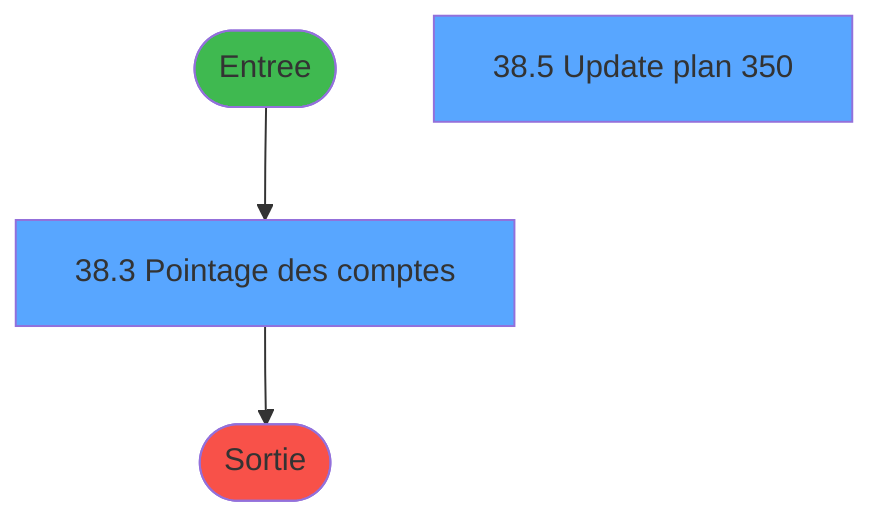
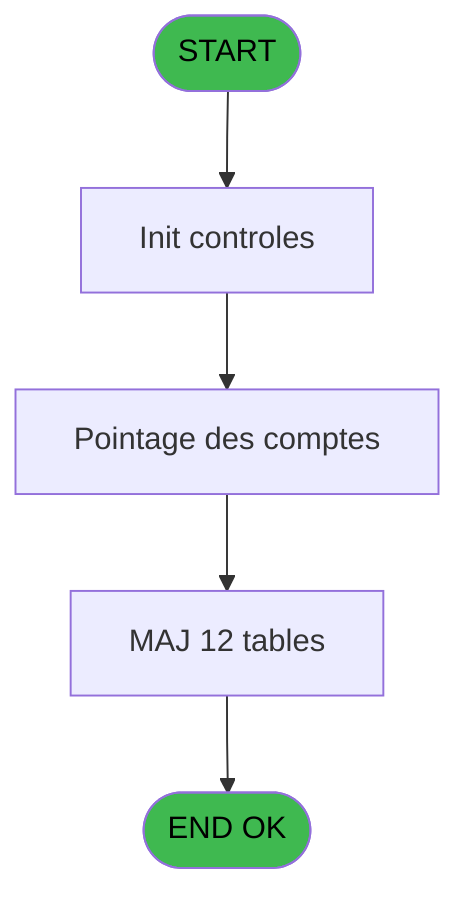

# MAI IDE 38 - Changement activite

> **Analyse**: Phases 1-4 2026-02-03 14:53 -> 14:53 (10s) | Assemblage 14:53
> **Pipeline**: V7.2 Enrichi
> **Structure**: 4 onglets (Resume | Ecrans | Donnees | Connexions)

<!-- TAB:Resume -->

## 1. FICHE D'IDENTITE

| Attribut | Valeur |
|----------|--------|
| Projet | MAI |
| IDE Position | 38 |
| Nom Programme | Changement activite |
| Fichier source | `Prg_38.xml` |
| Dossier IDE | Caisse |
| Taches | 32 (2 ecrans visibles) |
| Tables modifiees | 12 |
| Programmes appeles | 0 |

## 2. DESCRIPTION FONCTIONNELLE

**Changement activite** assure la gestion complete de ce processus, accessible depuis [Menu parametrage caisse (IDE 37)](MAI-IDE-37.md).

Le flux de traitement s'organise en **4 blocs fonctionnels** :

- **Traitement** (21 taches) : traitements metier divers
- **Calcul** (7 taches) : calculs de montants, stocks ou compteurs
- **Creation** (3 taches) : insertion d'enregistrements en base (mouvements, prestations)
- **Validation** (1 tache) : controles et verifications de coherence

**Donnees modifiees** : 12 tables en ecriture (comptes_recette__cre, articles_________art, gratuites________gra, tables_gratuites_tgr, activite_plan_comptable, activite_service_central, comptes_charge_central, comptes_produit_central, plan_comptable_central, comptes_charge, edition_ticket_article, droit_par_utilisateurs).

Detail : phases du traitement

#### Phase 1 : Traitement (21 taches)

- **38** - Changement activite
- **38.3.1** - Abandon
- **38.3.3** - Pointage
- **38.4** - Pointage auto
- **38.5** - Update plan 350 **[[ECRAN]](#ecran-t9)**
- **38.5.1** - 43
- **38.5.2** - 55
- **38.5.3** - 57
- **38.5.4** - 73
- **38.5.5** - 350
- **38.5.6** - 353
- **38.5.6.2** - 353 remplace
- **38.5.6.3** - 353 delete
- **38.5.7** - 357
- **38.5.8** - 358
- **38.5.9** - 365
- **38.5.9.2** - 365 remplace
- **38.5.10** - 366
- **38.5.11** - 368
- **38.5.11.2** - 368 remplace
- **38.5.11.3** - 368 delete

#### Phase 2 : Calcul (7 taches)

- **38.1** - Generation comptes
- **38.2** - Existe compte pointe
- **38.3** - Pointage des comptes **[[ECRAN]](#ecran-t4)**
- **38.5.6.1** - Recherche compte
- **38.5.9.1** - Recherche compte
- **38.5.11.1** - Recherche compte
- **38.6** - PAS DE COMPTE

#### Phase 3 : Validation (1 tache)

- **38.3.2** - Validation

#### Phase 4 : Creation (3 taches)

- **38.5.6.4** - 353 ajoute
- **38.5.9.3** - 365 ajoute
- **38.5.11.4** - 368 ajoute

#### Tables impactees

| Table | Operations | Role metier |
|-------|-----------|-------------|
| plan_comptable_central | R/**W** (6 usages) |  |
| edition_ticket_article | R/**W**/L (5 usages) | Articles et stock |
| activite_service_central | **W** (3 usages) | Services / filieres |
| droit_par_utilisateurs | **W** (3 usages) | Droits operateur |
| activite_plan_comptable | **W** (2 usages) |  |
| articles_________art | **W** (1 usages) | Articles et stock |
| comptes_recette__cre | **W** (1 usages) | Comptes GM (generaux) |
| gratuites________gra | **W** (1 usages) |  |
| comptes_charge | **W** (1 usages) | Comptes GM (generaux) |
| comptes_produit_central | **W** (1 usages) | Comptes GM (generaux) |
| tables_gratuites_tgr | **W** (1 usages) |  |
| comptes_charge_central | **W** (1 usages) | Comptes GM (generaux) |

## 3. BLOCS FONCTIONNELS

### 3.1 Traitement (21 taches)

Traitements internes.

---

#### 38 - Changement activite

**Role** : Tache d'orchestration : point d'entree du programme (21 sous-taches). Coordonne l'enchainement des traitements.

20 sous-taches directes

| Tache | Nom | Bloc |
|-------|-----|------|
| [38.3.1](#t5) | Abandon | Traitement |
| [38.3.3](#t7) | Pointage | Traitement |
| [38.4](#t8) | Pointage auto | Traitement |
| [38.5](#t9) | Update plan 350 **[[ECRAN]](#ecran-t9)** | Traitement |
| [38.5.1](#t10) | 43 | Traitement |
| [38.5.2](#t11) | 55 | Traitement |
| [38.5.3](#t12) | 57 | Traitement |
| [38.5.4](#t13) | 73 | Traitement |
| [38.5.5](#t14) | 350 | Traitement |
| [38.5.6](#t15) | 353 | Traitement |
| [38.5.6.2](#t17) | 353 remplace | Traitement |
| [38.5.6.3](#t18) | 353 delete | Traitement |
| [38.5.7](#t20) | 357 | Traitement |
| [38.5.8](#t21) | 358 | Traitement |
| [38.5.9](#t22) | 365 | Traitement |
| [38.5.9.2](#t24) | 365 remplace | Traitement |
| [38.5.10](#t27) | 366 | Traitement |
| [38.5.11](#t28) | 368 | Traitement |
| [38.5.11.2](#t30) | 368 remplace | Traitement |
| [38.5.11.3](#t31) | 368 delete | Traitement |

**Variables liees** : B (Param activite old), C (Param activite new), D (Param activite new Libelle), E (Fin changement activite)

---

#### 38.3.1 - Abandon

**Role** : Traitement : Abandon.
**Variables liees** : G (Abandon pointage)

---

#### 38.3.3 - Pointage

**Role** : Traitement : Pointage.
**Variables liees** : G (Abandon pointage), H (Pointage auto)

---

#### 38.4 - Pointage auto

**Role** : Traitement : Pointage auto.
**Variables liees** : G (Abandon pointage), H (Pointage auto)

---

#### 38.5 - Update plan 350 [[ECRAN]](#ecran-t9)

**Role** : Traitement : Update plan 350.
**Ecran** : 480 x 224 DLU (MDI) | [Voir mockup](#ecran-t9)

---

#### 38.5.1 - 43

**Role** : Traitement interne.

---

#### 38.5.2 - 55

**Role** : Traitement interne.

---

#### 38.5.3 - 57

**Role** : Traitement interne.

---

#### 38.5.4 - 73

**Role** : Traitement interne.

---

#### 38.5.5 - 350

**Role** : Traitement interne.

---

#### 38.5.6 - 353

**Role** : Traitement interne.

---

#### 38.5.6.2 - 353 remplace

**Role** : Traitement : 353 remplace.

---

#### 38.5.6.3 - 353 delete

**Role** : Traitement : 353 delete.

---

#### 38.5.7 - 357

**Role** : Traitement interne.

---

#### 38.5.8 - 358

**Role** : Traitement interne.

---

#### 38.5.9 - 365

**Role** : Traitement interne.

---

#### 38.5.9.2 - 365 remplace

**Role** : Traitement : 365 remplace.

---

#### 38.5.10 - 366

**Role** : Traitement interne.

---

#### 38.5.11 - 368

**Role** : Traitement interne.

---

#### 38.5.11.2 - 368 remplace

**Role** : Traitement : 368 remplace.

---

#### 38.5.11.3 - 368 delete

**Role** : Traitement : 368 delete.

### 3.2 Calcul (7 taches)

Calculs metier : montants, stocks, compteurs.

---

#### 38.1 - Generation comptes

**Role** : Traitement : Generation comptes.

---

#### 38.2 - Existe compte pointe

**Role** : Traitement : Existe compte pointe.
**Variables liees** : I (Existe compte pointe)

---

#### 38.3 - Pointage des comptes [[ECRAN]](#ecran-t4)

**Role** : Traitement : Pointage des comptes.
**Ecran** : 965 x 226 DLU (MDI) | [Voir mockup](#ecran-t4)
**Variables liees** : G (Abandon pointage), H (Pointage auto)

---

#### 38.5.6.1 - Recherche compte

**Role** : Traitement : Recherche compte.
**Variables liees** : I (Existe compte pointe)

---

#### 38.5.9.1 - Recherche compte

**Role** : Traitement : Recherche compte.
**Variables liees** : I (Existe compte pointe)

---

#### 38.5.11.1 - Recherche compte

**Role** : Traitement : Recherche compte.
**Variables liees** : I (Existe compte pointe)

---

#### 38.6 - PAS DE COMPTE

**Role** : Traitement : PAS DE COMPTE.
**Variables liees** : I (Existe compte pointe)

### 3.3 Validation (1 tache)

Controles de coherence : 1 tache verifie les donnees et conditions.

---

#### 38.3.2 - Validation

**Role** : Verification : Validation.
**Variables liees** : F (Validation demandee)

### 3.4 Creation (3 taches)

Insertion de nouveaux enregistrements en base.

---

#### 38.5.6.4 - 353 ajoute

**Role** : Creation d'enregistrement : 353 ajoute.

---

#### 38.5.9.3 - 365 ajoute

**Role** : Creation d'enregistrement : 365 ajoute.

---

#### 38.5.11.4 - 368 ajoute

**Role** : Creation d'enregistrement : 368 ajoute.

## 5. REGLES METIER

*(Aucune regle metier identifiee)*

## 6. CONTEXTE

- **Appele par**: [Menu parametrage caisse (IDE 37)](MAI-IDE-37.md)
- **Appelle**: 0 programmes | **Tables**: 12 (W:12 R:2 L:1) | **Taches**: 32 | **Expressions**: 7

<!-- TAB:Ecrans -->

## 8. ECRANS

### 8.1 Forms visibles (2 / 32)

| # | Position | Tache | Nom | Type | Largeur | Hauteur | Bloc |
|---|----------|-------|-----|------|---------|---------|------|
| 1 | 38.3 | 38.3 | Pointage des comptes | MDI | 965 | 226 | Calcul |
| 2 | 38.5 | 38.5 | Update plan 350 | MDI | 480 | 224 | Traitement |

### 8.2 Mockups Ecrans

---

#### 38.3 - Pointage des comptes
**Tache** : [38.3](#t4) | **Type** : MDI | **Dimensions** : 965 x 226 DLU
**Bloc** : Calcul | **Titre IDE** : Pointage des comptes

<!-- FORM-DATA:
{
    "width":  965,
    "vFactor":  8,
    "type":  "MDI",
    "hFactor":  8,
    "controls":  [
                     {
                         "x":  2,
                         "type":  "label",
                         "var":  "",
                         "y":  2,
                         "w":  957,
                         "fmt":  "",
                         "name":  "",
                         "h":  19,
                         "color":  "",
                         "text":  "",
                         "parent":  null
                     },
                     {
                         "x":  4,
                         "type":  "table",
                         "var":  "",
                         "name":  "",
                         "titleH":  12,
                         "color":  "110",
                         "w":  954,
                         "y":  24,
                         "fmt":  "",
                         "parent":  null,
                         "text":  "",
                         "rowH":  11,
                         "h":  147,
                         "cols":  [
                                      {
                                          "title":  "Compte",
                                          "layer":  1,
                                          "w":  119
                                      },
                                      {
                                          "title":  "Activité",
                                          "layer":  2,
                                          "w":  66
                                      },
                                      {
                                          "title":  "Libellé",
                                          "layer":  3,
                                          "w":  673
                                      },
                                      {
                                          "title":  "Pointage",
                                          "layer":  4,
                                          "w":  60
                                      }
                                  ],
                         "rows":  4
                     },
                     {
                         "x":  2,
                         "type":  "label",
                         "var":  "",
                         "y":  199,
                         "w":  957,
                         "fmt":  "",
                         "name":  "",
                         "h":  24,
                         "color":  "",
                         "text":  "",
                         "parent":  null
                     },
                     {
                         "x":  164,
                         "type":  "label",
                         "var":  "",
                         "y":  206,
                         "w":  139,
                         "fmt":  "",
                         "name":  "",
                         "h":  10,
                         "color":  "142",
                         "text":  "Nouvelle activite",
                         "parent":  null
                     },
                     {
                         "x":  885,
                         "type":  "checkbox",
                         "var":  "",
                         "y":  38,
                         "w":  24,
                         "fmt":  "",
                         "name":  "",
                         "h":  8,
                         "color":  "110",
                         "text":  "Pointage",
                         "parent":  4
                     },
                     {
                         "x":  10,
                         "type":  "edit",
                         "var":  "",
                         "y":  38,
                         "w":  111,
                         "fmt":  "",
                         "name":  "",
                         "h":  8,
                         "color":  "110",
                         "text":  "",
                         "parent":  4
                     },
                     {
                         "x":  130,
                         "type":  "edit",
                         "var":  "",
                         "y":  38,
                         "w":  59,
                         "fmt":  "",
                         "name":  "",
                         "h":  8,
                         "color":  "110",
                         "text":  "",
                         "parent":  4
                     },
                     {
                         "x":  195,
                         "type":  "edit",
                         "var":  "",
                         "y":  38,
                         "w":  666,
                         "fmt":  "",
                         "name":  "",
                         "h":  8,
                         "color":  "110",
                         "text":  "",
                         "parent":  4
                     },
                     {
                         "x":  195,
                         "type":  "edit",
                         "var":  "",
                         "y":  38,
                         "w":  666,
                         "fmt":  "",
                         "name":  "",
                         "h":  8,
                         "color":  "110",
                         "text":  "",
                         "parent":  4
                     },
                     {
                         "x":  16,
                         "type":  "edit",
                         "var":  "",
                         "y":  7,
                         "w":  267,
                         "fmt":  "30",
                         "name":  "",
                         "h":  8,
                         "color":  "",
                         "text":  "",
                         "parent":  null
                     },
                     {
                         "x":  633,
                         "type":  "edit",
                         "var":  "",
                         "y":  7,
                         "w":  313,
                         "fmt":  "WWW DD MMM YYYYT",
                         "name":  "",
                         "h":  8,
                         "color":  "",
                         "text":  "",
                         "parent":  null
                     },
                     {
                         "x":  307,
                         "type":  "edit",
                         "var":  "",
                         "y":  206,
                         "w":  59,
                         "fmt":  "",
                         "name":  "",
                         "h":  10,
                         "color":  "",
                         "text":  "",
                         "parent":  null
                     },
                     {
                         "x":  372,
                         "type":  "edit",
                         "var":  "",
                         "y":  206,
                         "w":  336,
                         "fmt":  "",
                         "name":  "",
                         "h":  10,
                         "color":  "",
                         "text":  "",
                         "parent":  null
                     },
                     {
                         "x":  16,
                         "type":  "button",
                         "var":  "",
                         "y":  176,
                         "w":  128,
                         "fmt":  "Aucun",
                         "name":  "AUC",
                         "h":  18,
                         "color":  "",
                         "text":  "",
                         "parent":  null
                     },
                     {
                         "x":  164,
                         "type":  "button",
                         "var":  "",
                         "y":  176,
                         "w":  128,
                         "fmt":  "Tous",
                         "name":  "TOU",
                         "h":  18,
                         "color":  "",
                         "text":  "",
                         "parent":  null
                     },
                     {
                         "x":  312,
                         "type":  "button",
                         "var":  "",
                         "y":  176,
                         "w":  200,
                         "fmt":  "Comptes de charge",
                         "name":  "CHA",
                         "h":  18,
                         "color":  "",
                         "text":  "",
                         "parent":  null
                     },
                     {
                         "x":  534,
                         "type":  "button",
                         "var":  "",
                         "y":  176,
                         "w":  200,
                         "fmt":  "Comptes de produit",
                         "name":  "PRO",
                         "h":  18,
                         "color":  "",
                         "text":  "",
                         "parent":  null
                     },
                     {
                         "x":  16,
                         "type":  "button",
                         "var":  "",
                         "y":  202,
                         "w":  128,
                         "fmt":  "Abandon",
                         "name":  "",
                         "h":  18,
                         "color":  "",
                         "text":  "",
                         "parent":  null
                     },
                     {
                         "x":  826,
                         "type":  "button",
                         "var":  "",
                         "y":  202,
                         "w":  128,
                         "fmt":  "Validation",
                         "name":  "",
                         "h":  18,
                         "color":  "",
                         "text":  "",
                         "parent":  null
                     }
                 ],
    "taskId":  "38.3",
    "height":  226
}
-->

<strong>Champs : 9 champs</strong>

| Pos (x,y) | Nom | Variable | Type |
|-----------|-----|----------|------|
| 885,38 | Pointage | - | checkbox |
| 10,38 | (sans nom) | - | edit |
| 130,38 | (sans nom) | - | edit |
| 195,38 | (sans nom) | - | edit |
| 195,38 | (sans nom) | - | edit |
| 16,7 | 30 | - | edit |
| 633,7 | WWW DD MMM YYYYT | - | edit |
| 307,206 | (sans nom) | - | edit |
| 372,206 | (sans nom) | - | edit |

<strong>Boutons : 6 boutons</strong>

| Bouton | Pos (x,y) | Action |
|--------|-----------|--------|
| Aucun | 16,176 | Bouton fonctionnel |
| Tous | 164,176 | Bouton fonctionnel |
| Comptes de charge | 312,176 | Bouton fonctionnel |
| Comptes de produit | 534,176 | Bouton fonctionnel |
| Abandon | 16,202 | Annule et retour au menu |
| Validation | 826,202 | Valide la saisie et enregistre |

---

#### 38.5 - Update plan 350
**Tache** : [38.5](#t9) | **Type** : MDI | **Dimensions** : 480 x 224 DLU
**Bloc** : Traitement | **Titre IDE** : Update plan 350

<!-- FORM-DATA:
{
    "width":  480,
    "vFactor":  8,
    "type":  "MDI",
    "hFactor":  4,
    "controls":  [
                     {
                         "x":  196,
                         "type":  "label",
                         "var":  "",
                         "y":  108,
                         "w":  88,
                         "fmt":  "",
                         "name":  "",
                         "h":  8,
                         "color":  "",
                         "text":  "Traitement en cours ...",
                         "parent":  null
                     }
                 ],
    "taskId":  "38.5",
    "height":  224
}
-->

## 9. NAVIGATION

### 9.1 Enchainement des ecrans

**Detail par enchainement :**

| Depuis | Action | Vers | Retour |
|--------|--------|------|--------|

### 9.3 Structure hierarchique (32 taches)

| Position | Tache | Type | Dimensions | Bloc |
|----------|-------|------|------------|------|
| **38.1** | [**Changement activite** (38)](#t1) | MDI | - | Traitement |
| 38.1.1 | [Abandon (38.3.1)](#t5) | MDI | - | |
| 38.1.2 | [Pointage (38.3.3)](#t7) | MDI | - | |
| 38.1.3 | [Pointage auto (38.4)](#t8) | MDI | - | |
| 38.1.4 | [Update plan 350 (38.5)](#t9) [mockup](#ecran-t9) | MDI | 480x224 | |
| 38.1.5 | [43 (38.5.1)](#t10) | MDI | - | |
| 38.1.6 | [55 (38.5.2)](#t11) | MDI | - | |
| 38.1.7 | [57 (38.5.3)](#t12) | MDI | - | |
| 38.1.8 | [73 (38.5.4)](#t13) | MDI | - | |
| 38.1.9 | [350 (38.5.5)](#t14) | MDI | - | |
| 38.1.10 | [353 (38.5.6)](#t15) | MDI | - | |
| 38.1.11 | [353 remplace (38.5.6.2)](#t17) | MDI | - | |
| 38.1.12 | [353 delete (38.5.6.3)](#t18) | MDI | - | |
| 38.1.13 | [357 (38.5.7)](#t20) | MDI | - | |
| 38.1.14 | [358 (38.5.8)](#t21) | MDI | - | |
| 38.1.15 | [365 (38.5.9)](#t22) | MDI | - | |
| 38.1.16 | [365 remplace (38.5.9.2)](#t24) | MDI | - | |
| 38.1.17 | [366 (38.5.10)](#t27) | MDI | - | |
| 38.1.18 | [368 (38.5.11)](#t28) | MDI | - | |
| 38.1.19 | [368 remplace (38.5.11.2)](#t30) | MDI | - | |
| 38.1.20 | [368 delete (38.5.11.3)](#t31) | MDI | - | |
| **38.2** | [**Generation comptes** (38.1)](#t2) | MDI | - | Calcul |
| 38.2.1 | [Existe compte pointe (38.2)](#t3) | MDI | - | |
| 38.2.2 | [Pointage des comptes (38.3)](#t4) [mockup](#ecran-t4) | MDI | 965x226 | |
| 38.2.3 | [Recherche compte (38.5.6.1)](#t16) | MDI | - | |
| 38.2.4 | [Recherche compte (38.5.9.1)](#t23) | MDI | - | |
| 38.2.5 | [Recherche compte (38.5.11.1)](#t29) | MDI | - | |
| 38.2.6 | [PAS DE COMPTE (38.6)](#t33) | MDI | - | |
| **38.3** | [**Validation** (38.3.2)](#t6) | MDI | - | Validation |
| **38.4** | [**353 ajoute** (38.5.6.4)](#t19) | MDI | - | Creation |
| 38.4.1 | [365 ajoute (38.5.9.3)](#t25) | MDI | - | |
| 38.4.2 | [368 ajoute (38.5.11.4)](#t32) | MDI | - | |

### 9.4 Algorigramme

> **Legende**: Vert = START/END OK | Rouge = END KO | Bleu = Decisions
> *Algorigramme auto-genere. Utiliser `/algorigramme` pour une synthese metier detaillee.*

<!-- TAB:Donnees -->

## 10. TABLES

### Tables utilisees (12)

| ID | Nom | Description | Type | R | W | L | Usages |
|----|-----|-------------|------|---|---|---|--------|
| 65 | comptes_recette__cre | Comptes GM (generaux) | DB |   | **W** |   | 1 |
| 77 | articles_________art | Articles et stock | DB |   | **W** |   | 1 |
| 79 | gratuites________gra |  | DB |   | **W** |   | 1 |
| 95 | tables_gratuites_tgr |  | DB |   | **W** |   | 1 |
| 201 | activite_plan_comptable |  | DB |   | **W** |   | 2 |
| 202 | activite_service_central | Services / filieres | DB |   | **W** |   | 3 |
| 205 | comptes_charge_central | Comptes GM (generaux) | DB |   | **W** |   | 1 |
| 207 | comptes_produit_central | Comptes GM (generaux) | DB |   | **W** |   | 1 |
| 209 | plan_comptable_central |  | DB | R | **W** |   | 6 |
| 226 | comptes_charge | Comptes GM (generaux) | DB |   | **W** |   | 1 |
| 494 | edition_ticket_article | Articles et stock | TMP | R | **W** | L | 5 |
| 698 | droit_par_utilisateurs | Droits operateur | DB |   | **W** |   | 3 |

### Colonnes par table (6 / 12 tables avec colonnes identifiees)

Table 65 - comptes_recette__cre (**W**) - 1 usages

*Table utilisee uniquement en Link ou aucune colonne Real identifiee dans le DataView.*

Table 77 - articles_________art (**W**) - 1 usages

*Table utilisee uniquement en Link ou aucune colonne Real identifiee dans le DataView.*

Table 79 - gratuites________gra (**W**) - 1 usages

*Table utilisee uniquement en Link ou aucune colonne Real identifiee dans le DataView.*

Table 95 - tables_gratuites_tgr (**W**) - 1 usages

*Table utilisee uniquement en Link ou aucune colonne Real identifiee dans le DataView.*

Table 201 - activite_plan_comptable (**W**) - 2 usages

| Lettre | Variable | Acces | Type |
|--------|----------|-------|------|
| B | Param activite old | W | Numeric |
| C | Param activite new | W | Numeric |
| D | Param activite new Libelle | W | Alpha |
| E | Fin changement activite | W | Logical |

Table 202 - activite_service_central (**W**) - 3 usages

| Lettre | Variable | Acces | Type |
|--------|----------|-------|------|
| B | Param activite old | W | Numeric |
| C | Param activite new | W | Numeric |
| D | Param activite new Libelle | W | Alpha |
| E | Fin changement activite | W | Logical |

Table 205 - comptes_charge_central (**W**) - 1 usages

| Lettre | Variable | Acces | Type |
|--------|----------|-------|------|
| A | Existe compte charge old act | W | Logical |
| C | Existe compte charge new act | W | Logical |

Table 207 - comptes_produit_central (**W**) - 1 usages

| Lettre | Variable | Acces | Type |
|--------|----------|-------|------|
| B | Existe compte produit old act | W | Logical |
| D | Existe compte produit new act | W | Logical |

Table 209 - plan_comptable_central (R/**W**) - 6 usages

| Lettre | Variable | Acces | Type |
|--------|----------|-------|------|
| A | curseur | W | Logical |
| B | ExisteUnComptePointe | W | Logical |

Table 226 - comptes_charge (**W**) - 1 usages

| Lettre | Variable | Acces | Type |
|--------|----------|-------|------|
| A | Existe compte charge old act | W | Logical |
| C | Existe compte charge new act | W | Logical |

Table 494 - edition_ticket_article (R/**W**/L) - 5 usages

*Table utilisee uniquement en Link ou aucune colonne Real identifiee dans le DataView.*

Table 698 - droit_par_utilisateurs (**W**) - 3 usages

*Table utilisee uniquement en Link ou aucune colonne Real identifiee dans le DataView.*

## 11. VARIABLES

### 11.1 Autres (9)

Variables diverses.

| Lettre | Nom | Type | Usage dans |
|--------|-----|------|-----------|
| A | Param societe | Alpha | - |
| B | Param activite old | Numeric | - |
| C | Param activite new | Numeric | - |
| D | Param activite new Libelle | Alpha | - |
| E | Fin changement activite | Logical | [38](#t1) |
| F | Validation demandee | Logical | [38.3.2](#t6) |
| G | Abandon pointage | Logical | [38.3](#t4), [38.3.1](#t5), [38.3.3](#t7) |
| H | Pointage auto | Logical | [38.3](#t4), [38.3.3](#t7), [38.4](#t8) |
| I | Existe compte pointe | Logical | - |

## 12. EXPRESSIONS

**7 / 7 expressions decodees (100%)**

### 12.1 Repartition par type

| Type | Expressions | Regles |
|------|-------------|--------|
| CONDITION | 2 | 0 |
| OTHER | 2 | 0 |
| NEGATION | 1 | 0 |
| CAST_LOGIQUE | 2 | 0 |

### 12.2 Expressions cles par type

#### CONDITION (2 expressions)

| Type | IDE | Expression | Regle |
|------|-----|------------|-------|
| CONDITION | 7 | `CallProg('{324,-1}'PROG,DbName('{494,2}'DSOURCE))>0` | - |
| CONDITION | 6 | `CallProg('{324,-1}'PROG,DbName('{494,2}'DSOURCE))=0` | - |

#### OTHER (2 expressions)

| Type | IDE | Expression | Regle |
|------|-----|------------|-------|
| OTHER | 2 | `Fin changement activite [E]` | - |
| OTHER | 1 | `Pointage auto [H]` | - |

#### NEGATION (1 expressions)

| Type | IDE | Expression | Regle |
|------|-----|------------|-------|
| NEGATION | 3 | `NOT (Abandon pointage [G]) AND Validation demandee [F]` | - |

#### CAST_LOGIQUE (2 expressions)

| Type | IDE | Expression | Regle |
|------|-----|------------|-------|
| CAST_LOGIQUE | 5 | `'TRUE'LOG` | - |
| CAST_LOGIQUE | 4 | `'FALSE'LOG` | - |

<!-- TAB:Connexions -->

## 13. GRAPHE D'APPELS

### 13.1 Chaine depuis Main (Callers)

Main -> ... -> [Menu parametrage caisse (IDE 37)](MAI-IDE-37.md) -> **Changement activite (IDE 38)**

### 13.2 Callers

| IDE | Nom Programme | Nb Appels |
|-----|---------------|-----------|
| [37](MAI-IDE-37.md) | Menu parametrage caisse | 1 |

### 13.3 Callees (programmes appeles)

### 13.4 Detail Callees avec contexte

| IDE | Nom Programme | Appels | Contexte |
|-----|---------------|--------|----------|
| - | (aucun) | - | - |

## 14. RECOMMANDATIONS MIGRATION

### 14.1 Profil du programme

| Metrique | Valeur | Impact migration |
|----------|--------|-----------------|
| Lignes de logique | 300 | Taille moyenne |
| Expressions | 7 | Peu de logique |
| Tables WRITE | 12 | Fort impact donnees |
| Sous-programmes | 0 | Peu de dependances |
| Ecrans visibles | 2 | Quelques ecrans |
| Code desactive | 0% (0 / 300) | Code sain |
| Regles metier | 0 | Pas de regle identifiee |

### 14.2 Plan de migration par bloc

#### Traitement (21 taches: 1 ecran, 20 traitements)

- **Strategie** : Orchestrateur avec 1 ecrans (Razor/React) et 20 traitements backend (services).
- Les ecrans deviennent des composants UI, les traitements invisibles deviennent des services injectables.
- Decomposer les taches en services unitaires testables.

#### Calcul (7 taches: 1 ecran, 6 traitements)

- **Strategie** : Services de calcul purs (Domain Services).
- Migrer la logique de calcul (stock, compteurs, montants)

#### Validation (1 tache: 0 ecran, 1 traitement)

- **Strategie** : FluentValidation avec validators specifiques.
- Chaque tache de validation -> un validator injectable

#### Creation (3 taches: 0 ecran, 3 traitements)

- **Strategie** : Repository pattern avec Entity Framework Core.
- Insertion via `IRepository<T>.CreateAsync()`

### 14.3 Dependances critiques

| Dependance | Type | Appels | Impact |
|------------|------|--------|--------|
| comptes_recette__cre | Table WRITE (Database) | 1x | Schema + repository |
| articles_________art | Table WRITE (Database) | 1x | Schema + repository |
| gratuites________gra | Table WRITE (Database) | 1x | Schema + repository |
| tables_gratuites_tgr | Table WRITE (Database) | 1x | Schema + repository |
| activite_plan_comptable | Table WRITE (Database) | 2x | Schema + repository |
| activite_service_central | Table WRITE (Database) | 3x | Schema + repository |
| comptes_charge_central | Table WRITE (Database) | 1x | Schema + repository |
| comptes_produit_central | Table WRITE (Database) | 1x | Schema + repository |
| plan_comptable_central | Table WRITE (Database) | 1x | Schema + repository |
| comptes_charge | Table WRITE (Database) | 1x | Schema + repository |
| edition_ticket_article | Table WRITE (Temp) | 1x | Schema + repository |
| droit_par_utilisateurs | Table WRITE (Database) | 3x | Schema + repository |

---
*Spec DETAILED generee par Pipeline V7.2 - 2026-02-03 14:53*
