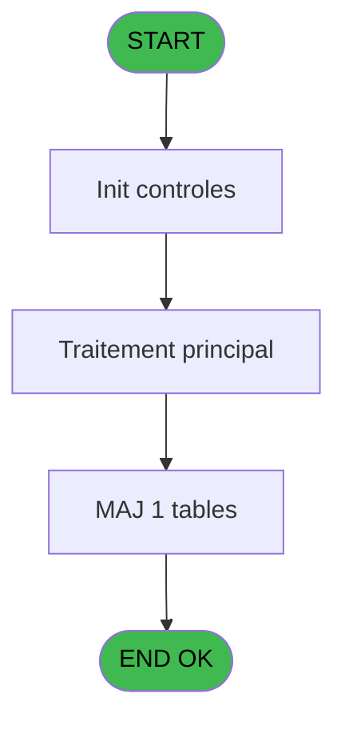

# MAI IDE 40 - Reference Moyen de paiement

> **Analyse**: Phases 1-4 2026-02-03 14:53 -> 14:53 (9s) | Assemblage 14:53
> **Pipeline**: V7.2 Enrichi
> **Structure**: 4 onglets (Resume | Ecrans | Donnees | Connexions)

<!-- TAB:Resume -->

## 1. FICHE D'IDENTITE

| Attribut | Valeur |
|----------|--------|
| Projet | MAI |
| IDE Position | 40 |
| Nom Programme | Reference Moyen de paiement |
| Fichier source | `Prg_40.xml` |
| Dossier IDE | Caisse |
| Taches | 1 (1 ecrans visibles) |
| Tables modifiees | 1 |
| Programmes appeles | 0 |

## 2. DESCRIPTION FONCTIONNELLE

**Reference Moyen de paiement** assure la gestion complete de ce processus, accessible depuis [Menu paramètres (IDE 23)](MAI-IDE-23.md).

Le flux de traitement s'organise en **1 blocs fonctionnels** :

- **Reglement** (1 tache) : gestion des moyens de paiement et reglements

**Donnees modifiees** : 1 tables en ecriture (parametre_generaux).

## 3. BLOCS FONCTIONNELS

### 3.1 Reglement (1 tache)

Gestion des moyens de paiement : 1 tache de reglement.

---

#### 40 - Reference Moyen de paiement [[ECRAN]](#ecran-t1)

**Role** : Gestion du reglement : Reference Moyen de paiement.
**Ecran** : 1440 x 0 DLU (MDI) | [Voir mockup](#ecran-t1)

## 5. REGLES METIER

*(Aucune regle metier identifiee)*

## 6. CONTEXTE

- **Appele par**: [Menu paramètres (IDE 23)](MAI-IDE-23.md)
- **Appelle**: 0 programmes | **Tables**: 1 (W:1 R:0 L:0) | **Taches**: 1 | **Expressions**: 2

<!-- TAB:Ecrans -->

## 8. ECRANS

### 8.1 Forms visibles (1 / 1)

| # | Position | Tache | Nom | Type | Largeur | Hauteur | Bloc |
|---|----------|-------|-----|------|---------|---------|------|
| 1 | 40 | 40 | Reference Moyen de paiement | MDI | 1440 | 0 | Reglement |

### 8.2 Mockups Ecrans

---

#### 40 - Reference Moyen de paiement
**Tache** : [40](#t1) | **Type** : MDI | **Dimensions** : 1440 x 0 DLU
**Bloc** : Reglement | **Titre IDE** : Reference Moyen de paiement

<!-- FORM-DATA:
{
    "width":  1440,
    "vFactor":  8,
    "type":  "MDI",
    "hFactor":  8,
    "controls":  [
                     {
                         "x":  14,
                         "type":  "table",
                         "var":  "",
                         "name":  "",
                         "titleH":  11,
                         "color":  "110",
                         "w":  1413,
                         "y":  7,
                         "fmt":  "",
                         "parent":  null,
                         "text":  "",
                         "rowH":  10,
                         "h":  169,
                         "cols":  [
                                      {
                                          "title":  "Nom table",
                                          "layer":  1,
                                          "w":  93
                                      },
                                      {
                                          "title":  "Nom interne code",
                                          "layer":  2,
                                          "w":  147
                                      },
                                      {
                                          "title":  "Code alpha5",
                                          "layer":  3,
                                          "w":  112
                                      },
                                      {
                                          "title":  "Code numeric6",
                                          "layer":  4,
                                          "w":  129
                                      },
                                      {
                                          "title":  "Classe",
                                          "layer":  5,
                                          "w":  89
                                      },
                                      {
                                          "title":  "Valeur numerique",
                                          "layer":  6,
                                          "w":  197
                                      },
                                      {
                                          "title":  "Libelle20",
                                          "layer":  7,
                                          "w":  240
                                      },
                                      {
                                          "title":  "Libelle10-upper",
                                          "layer":  8,
                                          "w":  134
                                      },
                                      {
                                          "title":  "Code droit modif",
                                          "layer":  9,
                                          "w":  135
                                      },
                                      {
                                          "title":  "Compte",
                                          "layer":  10,
                                          "w":  101
                                      }
                                  ],
                         "rows":  10
                     },
                     {
                         "x":  27,
                         "type":  "edit",
                         "var":  "",
                         "y":  20,
                         "w":  82,
                         "fmt":  "",
                         "name":  "",
                         "h":  8,
                         "color":  "110",
                         "text":  "",
                         "parent":  1
                     },
                     {
                         "x":  118,
                         "type":  "edit",
                         "var":  "",
                         "y":  20,
                         "w":  138,
                         "fmt":  "",
                         "name":  "",
                         "h":  8,
                         "color":  "110",
                         "text":  "",
                         "parent":  1
                     },
                     {
                         "x":  267,
                         "type":  "edit",
                         "var":  "",
                         "y":  20,
                         "w":  100,
                         "fmt":  "",
                         "name":  "",
                         "h":  8,
                         "color":  "110",
                         "text":  "",
                         "parent":  1
                     },
                     {
                         "x":  378,
                         "type":  "edit",
                         "var":  "",
                         "y":  20,
                         "w":  116,
                         "fmt":  "",
                         "name":  "",
                         "h":  8,
                         "color":  "110",
                         "text":  "",
                         "parent":  1
                     },
                     {
                         "x":  507,
                         "type":  "edit",
                         "var":  "",
                         "y":  20,
                         "w":  78,
                         "fmt":  "",
                         "name":  "",
                         "h":  8,
                         "color":  "110",
                         "text":  "",
                         "parent":  1
                     },
                     {
                         "x":  595,
                         "type":  "edit",
                         "var":  "",
                         "y":  20,
                         "w":  184,
                         "fmt":  "",
                         "name":  "",
                         "h":  8,
                         "color":  "110",
                         "text":  "",
                         "parent":  1
                     },
                     {
                         "x":  790,
                         "type":  "edit",
                         "var":  "",
                         "y":  20,
                         "w":  234,
                         "fmt":  "",
                         "name":  "",
                         "h":  8,
                         "color":  "110",
                         "text":  "",
                         "parent":  1
                     },
                     {
                         "x":  1030,
                         "type":  "edit",
                         "var":  "",
                         "y":  20,
                         "w":  122,
                         "fmt":  "",
                         "name":  "",
                         "h":  8,
                         "color":  "110",
                         "text":  "",
                         "parent":  1
                     },
                     {
                         "x":  1163,
                         "type":  "edit",
                         "var":  "",
                         "y":  20,
                         "w":  126,
                         "fmt":  "",
                         "name":  "",
                         "h":  8,
                         "color":  "110",
                         "text":  "",
                         "parent":  1
                     },
                     {
                         "x":  1298,
                         "type":  "edit",
                         "var":  "",
                         "y":  20,
                         "w":  86,
                         "fmt":  "",
                         "name":  "",
                         "h":  8,
                         "color":  "110",
                         "text":  "",
                         "parent":  1
                     },
                     {
                         "x":  2,
                         "type":  "button",
                         "var":  "",
                         "y":  179,
                         "w":  154,
                         "fmt":  "Quitter",
                         "name":  "",
                         "h":  14,
                         "color":  "",
                         "text":  "",
                         "parent":  null
                     }
                 ],
    "taskId":  "40",
    "height":  0
}
-->

<strong>Champs : 10 champs</strong>

| Pos (x,y) | Nom | Variable | Type |
|-----------|-----|----------|------|
| 27,20 | (sans nom) | - | edit |
| 118,20 | (sans nom) | - | edit |
| 267,20 | (sans nom) | - | edit |
| 378,20 | (sans nom) | - | edit |
| 507,20 | (sans nom) | - | edit |
| 595,20 | (sans nom) | - | edit |
| 790,20 | (sans nom) | - | edit |
| 1030,20 | (sans nom) | - | edit |
| 1163,20 | (sans nom) | - | edit |
| 1298,20 | (sans nom) | - | edit |

<strong>Boutons : 1 boutons</strong>

| Bouton | Pos (x,y) | Action |
|--------|-----------|--------|
| Quitter | 2,179 | Quitte le programme |

## 9. NAVIGATION

Ecran unique: **Reference Moyen de paiement**

### 9.3 Structure hierarchique (1 tache)

| Position | Tache | Type | Dimensions | Bloc |
|----------|-------|------|------------|------|
| **40.1** | [**Reference Moyen de paiement** (40)](#t1) [mockup](#ecran-t1) | MDI | 1440x0 | Reglement |

### 9.4 Algorigramme

> **Legende**: Vert = START/END OK | Rouge = END KO | Bleu = Decisions
> *Algorigramme auto-genere. Utiliser `/algorigramme` pour une synthese metier detaillee.*

<!-- TAB:Donnees -->

## 10. TABLES

### Tables utilisees (1)

| ID | Nom | Description | Type | R | W | L | Usages |
|----|-----|-------------|------|---|---|---|--------|
| 707 | parametre_generaux |  | DB |   | **W** |   | 1 |

### Colonnes par table (0 / 1 tables avec colonnes identifiees)

Table 707 - parametre_generaux (**W**) - 1 usages

*Table utilisee uniquement en Link ou aucune colonne Real identifiee dans le DataView.*

## 11. VARIABLES

*(Programme sans variables locales mappees)*

## 12. EXPRESSIONS

**2 / 2 expressions decodees (100%)**

### 12.1 Repartition par type

| Type | Expressions | Regles |
|------|-------------|--------|
| CAST_LOGIQUE | 2 | 0 |

### 12.2 Expressions cles par type

#### CAST_LOGIQUE (2 expressions)

| Type | IDE | Expression | Regle |
|------|-----|------------|-------|
| CAST_LOGIQUE | 2 | `'FALSE'LOG` | - |
| CAST_LOGIQUE | 1 | `'TRUE'LOG` | - |

<!-- TAB:Connexions -->

## 13. GRAPHE D'APPELS

### 13.1 Chaine depuis Main (Callers)

Main -> ... -> [Menu paramètres (IDE 23)](MAI-IDE-23.md) -> **Reference Moyen de paiement (IDE 40)**

### 13.2 Callers

| IDE | Nom Programme | Nb Appels |
|-----|---------------|-----------|
| [23](MAI-IDE-23.md) | Menu paramètres | 1 |

### 13.3 Callees (programmes appeles)

### 13.4 Detail Callees avec contexte

| IDE | Nom Programme | Appels | Contexte |
|-----|---------------|--------|----------|
| - | (aucun) | - | - |

## 14. RECOMMANDATIONS MIGRATION

### 14.1 Profil du programme

| Metrique | Valeur | Impact migration |
|----------|--------|-----------------|
| Lignes de logique | 15 | Programme compact |
| Expressions | 2 | Peu de logique |
| Tables WRITE | 1 | Impact faible |
| Sous-programmes | 0 | Peu de dependances |
| Ecrans visibles | 1 | Ecran unique ou traitement batch |
| Code desactive | 0% (0 / 15) | Code sain |
| Regles metier | 0 | Pas de regle identifiee |

### 14.2 Plan de migration par bloc

#### Reglement (1 tache: 1 ecran, 0 traitement)

- **Strategie** : Service `IReglementService` avec pattern Strategy par mode de paiement.
- Integration TPE si applicable

### 14.3 Dependances critiques

| Dependance | Type | Appels | Impact |
|------------|------|--------|--------|
| parametre_generaux | Table WRITE (Database) | 1x | Schema + repository |

---
*Spec DETAILED generee par Pipeline V7.2 - 2026-02-03 14:53*
