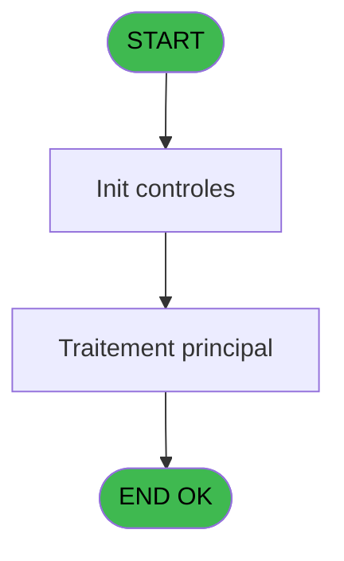
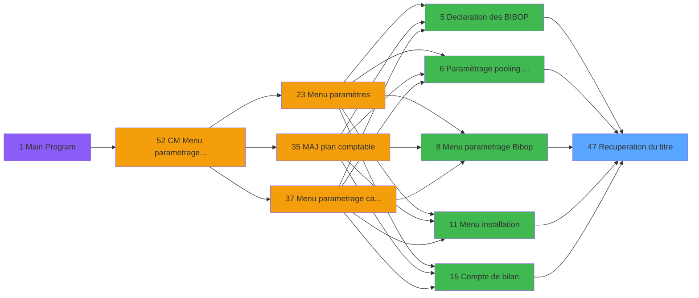

# MAI IDE 47 - Recuperation du titre

> **Analyse**: Phases 1-4 2026-02-03 14:55 -> 14:55 (10s) | Assemblage 14:55
> **Pipeline**: V7.2 Enrichi
> **Structure**: 4 onglets (Resume | Ecrans | Donnees | Connexions)

<!-- TAB:Resume -->

## 1. FICHE D'IDENTITE

| Attribut | Valeur |
|----------|--------|
| Projet | MAI |
| IDE Position | 47 |
| Nom Programme | Recuperation du titre |
| Fichier source | `Prg_47.xml` |
| Dossier IDE | Divers |
| Taches | 1 (0 ecrans visibles) |
| Tables modifiees | 0 |
| Programmes appeles | 0 |

## 2. DESCRIPTION FONCTIONNELLE

**Recuperation du titre** assure la gestion complete de ce processus, accessible depuis [Plan comptable (IDE 22)](MAI-IDE-22.md), [Pointage Tables REF et Params (IDE 34)](MAI-IDE-34.md), [Menu paramètres (IDE 23)](MAI-IDE-23.md), [Acces au 53 et 58 et 114 (IDE 62)](MAI-IDE-62.md), [Pointage imputations (IDE 36)](MAI-IDE-36.md), [Chargement temporaire du plan (IDE 33)](MAI-IDE-33.md), [Declaration des BIBOP (IDE 5)](MAI-IDE-5.md), [Declaration des groupes (IDE 56)](MAI-IDE-56.md), [Declaration des terminaux (IDE 57)](MAI-IDE-57.md), [Table des Salles semimaire (IDE 78)](MAI-IDE-78.md), [Table des codes d'acces (IDE 79)](MAI-IDE-79.md), [Paramètrage pooling BIBOP (IDE 6)](MAI-IDE-6.md), [Menu parametrage Bibop (IDE 8)](MAI-IDE-8.md), [Menu installation (IDE 11)](MAI-IDE-11.md), [Compte de bilan (IDE 15)](MAI-IDE-15.md), [Compte de produit (IDE 16)](MAI-IDE-16.md), [Compte de charge (IDE 17)](MAI-IDE-17.md), [Compte financiers (IDE 18)](MAI-IDE-18.md), [Moyens de paiement (IDE 19)](MAI-IDE-19.md), [Classes monetaires (IDE 20)](MAI-IDE-20.md).

Le flux de traitement s'organise en **1 blocs fonctionnels** :

- **Traitement** (1 tache) : traitements metier divers

## 3. BLOCS FONCTIONNELS

### 3.1 Traitement (1 tache)

Traitements internes.

---

#### 47 - Recuperation du titre

**Role** : Consultation/chargement : Recuperation du titre.

## 5. REGLES METIER

*(Aucune regle metier identifiee)*

## 6. CONTEXTE

- **Appele par**: [Plan comptable (IDE 22)](MAI-IDE-22.md), [Pointage Tables REF et Params (IDE 34)](MAI-IDE-34.md), [Menu paramètres (IDE 23)](MAI-IDE-23.md), [Acces au 53 et 58 et 114 (IDE 62)](MAI-IDE-62.md), [Pointage imputations (IDE 36)](MAI-IDE-36.md), [Chargement temporaire du plan (IDE 33)](MAI-IDE-33.md), [Declaration des BIBOP (IDE 5)](MAI-IDE-5.md), [Declaration des groupes (IDE 56)](MAI-IDE-56.md), [Declaration des terminaux (IDE 57)](MAI-IDE-57.md), [Table des Salles semimaire (IDE 78)](MAI-IDE-78.md), [Table des codes d'acces (IDE 79)](MAI-IDE-79.md), [Paramètrage pooling BIBOP (IDE 6)](MAI-IDE-6.md), [Menu parametrage Bibop (IDE 8)](MAI-IDE-8.md), [Menu installation (IDE 11)](MAI-IDE-11.md), [Compte de bilan (IDE 15)](MAI-IDE-15.md), [Compte de produit (IDE 16)](MAI-IDE-16.md), [Compte de charge (IDE 17)](MAI-IDE-17.md), [Compte financiers (IDE 18)](MAI-IDE-18.md), [Moyens de paiement (IDE 19)](MAI-IDE-19.md), [Classes monetaires (IDE 20)](MAI-IDE-20.md)
- **Appelle**: 0 programmes | **Tables**: 1 (W:0 R:1 L:0) | **Taches**: 1 | **Expressions**: 4

<!-- TAB:Ecrans -->

## 8. ECRANS

*(Programme sans ecran visible)*

## 9. NAVIGATION

### 9.3 Structure hierarchique (1 tache)

| Position | Tache | Type | Dimensions | Bloc |
|----------|-------|------|------------|------|
| **47.1** | [**Recuperation du titre** (47)](#t1) | MDI | - | Traitement |

### 9.4 Algorigramme

> **Legende**: Vert = START/END OK | Rouge = END KO | Bleu = Decisions
> *Algorigramme auto-genere. Utiliser `/algorigramme` pour une synthese metier detaillee.*

<!-- TAB:Donnees -->

## 10. TABLES

### Tables utilisees (1)

| ID | Nom | Description | Type | R | W | L | Usages |
|----|-----|-------------|------|---|---|---|--------|
| 719 | arc_transac_detail_bar |  | DB | R |   |   | 1 |

### Colonnes par table (1 / 1 tables avec colonnes identifiees)

Table 719 - arc_transac_detail_bar (R) - 1 usages

| Lettre | Variable | Acces | Type |
|--------|----------|-------|------|
| A | > code ecran | R | Numeric |
| B | < nom ecran | R | Alpha |

## 11. VARIABLES

### 11.1 Autres (2)

Variables diverses.

| Lettre | Nom | Type | Usage dans |
|--------|-----|------|-----------|
| A | > code ecran | Numeric | 1x refs |
| B | < nom ecran | Alpha | - |

## 12. EXPRESSIONS

**4 / 4 expressions decodees (100%)**

### 12.1 Repartition par type

| Type | Expressions | Regles |
|------|-------------|--------|
| CONCATENATION | 1 | 0 |
| CONSTANTE | 1 | 0 |
| OTHER | 1 | 0 |
| CONDITION | 1 | 0 |

### 12.2 Expressions cles par type

#### CONCATENATION (1 expressions)

| Type | IDE | Expression | Regle |
|------|-----|------------|-------|
| CONCATENATION | 4 | `Trim ([F])&' - '&Trim ([G])` | - |

#### CONSTANTE (1 expressions)

| Type | IDE | Expression | Regle |
|------|-----|------------|-------|
| CONSTANTE | 3 | `'CM'` | - |

#### OTHER (1 expressions)

| Type | IDE | Expression | Regle |
|------|-----|------------|-------|
| OTHER | 1 | `GetParam ('CODELANGUE')` | - |

#### CONDITION (1 expressions)

| Type | IDE | Expression | Regle |
|------|-----|------------|-------|
| CONDITION | 2 | `> code ecran [A]` | - |

<!-- TAB:Connexions -->

## 13. GRAPHE D'APPELS

### 13.1 Chaine depuis Main (Callers)

Main -> ... -> [Plan comptable (IDE 22)](MAI-IDE-22.md) -> **Recuperation du titre (IDE 47)**

Main -> ... -> [Pointage Tables REF et Params (IDE 34)](MAI-IDE-34.md) -> **Recuperation du titre (IDE 47)**

Main -> ... -> [Menu paramètres (IDE 23)](MAI-IDE-23.md) -> **Recuperation du titre (IDE 47)**

Main -> ... -> [Acces au 53 et 58 et 114 (IDE 62)](MAI-IDE-62.md) -> **Recuperation du titre (IDE 47)**

Main -> ... -> [Pointage imputations (IDE 36)](MAI-IDE-36.md) -> **Recuperation du titre (IDE 47)**

Main -> ... -> [Chargement temporaire du plan (IDE 33)](MAI-IDE-33.md) -> **Recuperation du titre (IDE 47)**

Main -> ... -> [Declaration des BIBOP (IDE 5)](MAI-IDE-5.md) -> **Recuperation du titre (IDE 47)**

Main -> ... -> [Declaration des groupes (IDE 56)](MAI-IDE-56.md) -> **Recuperation du titre (IDE 47)**

Main -> ... -> [Declaration des terminaux (IDE 57)](MAI-IDE-57.md) -> **Recuperation du titre (IDE 47)**

Main -> ... -> [Table des Salles semimaire (IDE 78)](MAI-IDE-78.md) -> **Recuperation du titre (IDE 47)**

Main -> ... -> [Table des codes d'acces (IDE 79)](MAI-IDE-79.md) -> **Recuperation du titre (IDE 47)**

Main -> ... -> [Paramètrage pooling BIBOP (IDE 6)](MAI-IDE-6.md) -> **Recuperation du titre (IDE 47)**

Main -> ... -> [Menu parametrage Bibop (IDE 8)](MAI-IDE-8.md) -> **Recuperation du titre (IDE 47)**

Main -> ... -> [Menu installation (IDE 11)](MAI-IDE-11.md) -> **Recuperation du titre (IDE 47)**

Main -> ... -> [Compte de bilan (IDE 15)](MAI-IDE-15.md) -> **Recuperation du titre (IDE 47)**

Main -> ... -> [Compte de produit (IDE 16)](MAI-IDE-16.md) -> **Recuperation du titre (IDE 47)**

Main -> ... -> [Compte de charge (IDE 17)](MAI-IDE-17.md) -> **Recuperation du titre (IDE 47)**

Main -> ... -> [Compte financiers (IDE 18)](MAI-IDE-18.md) -> **Recuperation du titre (IDE 47)**

Main -> ... -> [Moyens de paiement (IDE 19)](MAI-IDE-19.md) -> **Recuperation du titre (IDE 47)**

Main -> ... -> [Classes monetaires (IDE 20)](MAI-IDE-20.md) -> **Recuperation du titre (IDE 47)**

### 13.2 Callers

| IDE | Nom Programme | Nb Appels |
|-----|---------------|-----------|
| [22](MAI-IDE-22.md) | Plan comptable | 8 |
| [34](MAI-IDE-34.md) | Pointage Tables REF et Params | 8 |
| [23](MAI-IDE-23.md) | Menu paramètres | 6 |
| [62](MAI-IDE-62.md) | Acces au 53 et 58 et 114 | 5 |
| [36](MAI-IDE-36.md) | Pointage imputations | 4 |
| [33](MAI-IDE-33.md) | Chargement temporaire du plan | 3 |
| [5](MAI-IDE-5.md) | Declaration des BIBOP | 2 |
| [56](MAI-IDE-56.md) | Declaration des groupes | 2 |
| [57](MAI-IDE-57.md) | Declaration des terminaux | 2 |
| [78](MAI-IDE-78.md) | Table des Salles semimaire | 2 |
| [79](MAI-IDE-79.md) | Table des codes d'acces | 2 |
| [6](MAI-IDE-6.md) | Paramètrage pooling BIBOP | 1 |
| [8](MAI-IDE-8.md) | Menu parametrage Bibop | 1 |
| [11](MAI-IDE-11.md) | Menu installation | 1 |
| [15](MAI-IDE-15.md) | Compte de bilan | 1 |
| [16](MAI-IDE-16.md) | Compte de produit | 1 |
| [17](MAI-IDE-17.md) | Compte de charge | 1 |
| [18](MAI-IDE-18.md) | Compte financiers | 1 |
| [19](MAI-IDE-19.md) | Moyens de paiement | 1 |
| [20](MAI-IDE-20.md) | Classes monetaires | 1 |

### 13.3 Callees (programmes appeles)

### 13.4 Detail Callees avec contexte

| IDE | Nom Programme | Appels | Contexte |
|-----|---------------|--------|----------|
| - | (aucun) | - | - |

## 14. RECOMMANDATIONS MIGRATION

### 14.1 Profil du programme

| Metrique | Valeur | Impact migration |
|----------|--------|-----------------|
| Lignes de logique | 12 | Programme compact |
| Expressions | 4 | Peu de logique |
| Tables WRITE | 0 | Impact faible |
| Sous-programmes | 0 | Peu de dependances |
| Ecrans visibles | 0 | Ecran unique ou traitement batch |
| Code desactive | 0% (0 / 12) | Code sain |
| Regles metier | 0 | Pas de regle identifiee |

### 14.2 Plan de migration par bloc

#### Traitement (1 tache: 0 ecran, 1 traitement)

- **Strategie** : 1 service(s) backend injectable(s) (Domain Services).
- Decomposer les taches en services unitaires testables.

### 14.3 Dependances critiques

| Dependance | Type | Appels | Impact |
|------------|------|--------|--------|

---
*Spec DETAILED generee par Pipeline V7.2 - 2026-02-03 14:55*
