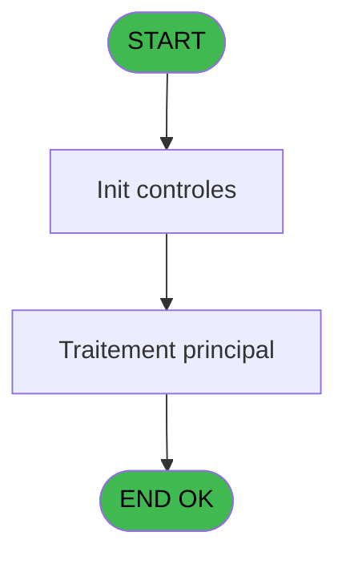
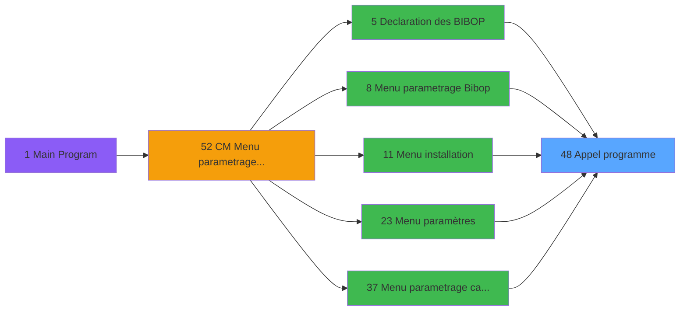

# MAI IDE 48 - Appel programme

> **Analyse**: Phases 1-4 2026-02-03 14:55 -> 14:55 (10s) | Assemblage 14:55
> **Pipeline**: V7.2 Enrichi
> **Structure**: 4 onglets (Resume | Ecrans | Donnees | Connexions)

<!-- TAB:Resume -->

## 1. FICHE D'IDENTITE

| Attribut | Valeur |
|----------|--------|
| Projet | MAI |
| IDE Position | 48 |
| Nom Programme | Appel programme |
| Fichier source | `Prg_48.xml` |
| Dossier IDE | Divers |
| Taches | 1 (0 ecrans visibles) |
| Tables modifiees | 0 |
| Programmes appeles | 0 |

## 2. DESCRIPTION FONCTIONNELLE

**Appel programme** assure la gestion complete de ce processus, accessible depuis [Declaration des BIBOP (IDE 5)](MAI-IDE-5.md), [Menu parametrage Bibop (IDE 8)](MAI-IDE-8.md), [Menu installation (IDE 11)](MAI-IDE-11.md), [Menu paramètres (IDE 23)](MAI-IDE-23.md), [Menu parametrage caisse (IDE 37)](MAI-IDE-37.md), [CM  Menu parametrage caisse (IDE 52)](MAI-IDE-52.md), [Declaration des groupes (IDE 56)](MAI-IDE-56.md), [Declaration des terminaux (IDE 57)](MAI-IDE-57.md), [Acces au 53 et 58 et 114 (IDE 62)](MAI-IDE-62.md), [Menu parametrage PME (IDE 64)](MAI-IDE-64.md), [Printers for Users v1 (IDE 68)](MAI-IDE-68.md), [Table des S.D.A (IDE 77)](MAI-IDE-77.md), [Table des Salles semimaire (IDE 78)](MAI-IDE-78.md), [Table des codes d'acces (IDE 79)](MAI-IDE-79.md), [Menu Telephone (IDE 85)](MAI-IDE-85.md).

Le flux de traitement s'organise en **1 blocs fonctionnels** :

- **Traitement** (1 tache) : traitements metier divers

## 3. BLOCS FONCTIONNELS

### 3.1 Traitement (1 tache)

Traitements internes.

---

#### 48 - Appel programme

**Role** : Traitement : Appel programme.

## 5. REGLES METIER

*(Aucune regle metier identifiee)*

## 6. CONTEXTE

- **Appele par**: [Declaration des BIBOP (IDE 5)](MAI-IDE-5.md), [Menu parametrage Bibop (IDE 8)](MAI-IDE-8.md), [Menu installation (IDE 11)](MAI-IDE-11.md), [Menu paramètres (IDE 23)](MAI-IDE-23.md), [Menu parametrage caisse (IDE 37)](MAI-IDE-37.md), [CM  Menu parametrage caisse (IDE 52)](MAI-IDE-52.md), [Declaration des groupes (IDE 56)](MAI-IDE-56.md), [Declaration des terminaux (IDE 57)](MAI-IDE-57.md), [Acces au 53 et 58 et 114 (IDE 62)](MAI-IDE-62.md), [Menu parametrage PME (IDE 64)](MAI-IDE-64.md), [Printers for Users v1 (IDE 68)](MAI-IDE-68.md), [Table des S.D.A (IDE 77)](MAI-IDE-77.md), [Table des Salles semimaire (IDE 78)](MAI-IDE-78.md), [Table des codes d'acces (IDE 79)](MAI-IDE-79.md), [Menu Telephone (IDE 85)](MAI-IDE-85.md)
- **Appelle**: 0 programmes | **Tables**: 0 (W:0 R:0 L:0) | **Taches**: 1 | **Expressions**: 1

<!-- TAB:Ecrans -->

## 8. ECRANS

*(Programme sans ecran visible)*

## 9. NAVIGATION

### 9.3 Structure hierarchique (1 tache)

| Position | Tache | Type | Dimensions | Bloc |
|----------|-------|------|------------|------|
| **48.1** | [**Appel programme** (48)](#t1) | MDI | - | Traitement |

### 9.4 Algorigramme

> **Legende**: Vert = START/END OK | Rouge = END KO | Bleu = Decisions
> *Algorigramme auto-genere. Utiliser `/algorigramme` pour une synthese metier detaillee.*

<!-- TAB:Donnees -->

## 10. TABLES

### Tables utilisees (0)

| ID | Nom | Description | Type | R | W | L | Usages |
|----|-----|-------------|------|---|---|---|--------|

### Colonnes par table (0 / 0 tables avec colonnes identifiees)

## 11. VARIABLES

*(Programme sans variables locales mappees)*

## 12. EXPRESSIONS

**1 / 1 expressions decodees (100%)**

### 12.1 Repartition par type

| Type | Expressions | Regles |
|------|-------------|--------|
| OTHER | 1 | 0 |

### 12.2 Expressions cles par type

#### OTHER (1 expressions)

| Type | IDE | Expression | Regle |
|------|-----|------------|-------|
| OTHER | 1 | `LastClicked ()` | - |

<!-- TAB:Connexions -->

## 13. GRAPHE D'APPELS

### 13.1 Chaine depuis Main (Callers)

Main -> ... -> [Declaration des BIBOP (IDE 5)](MAI-IDE-5.md) -> **Appel programme (IDE 48)**

Main -> ... -> [Menu parametrage Bibop (IDE 8)](MAI-IDE-8.md) -> **Appel programme (IDE 48)**

Main -> ... -> [Menu installation (IDE 11)](MAI-IDE-11.md) -> **Appel programme (IDE 48)**

Main -> ... -> [Menu paramètres (IDE 23)](MAI-IDE-23.md) -> **Appel programme (IDE 48)**

Main -> ... -> [Menu parametrage caisse (IDE 37)](MAI-IDE-37.md) -> **Appel programme (IDE 48)**

Main -> ... -> [CM  Menu parametrage caisse (IDE 52)](MAI-IDE-52.md) -> **Appel programme (IDE 48)**

Main -> ... -> [Declaration des groupes (IDE 56)](MAI-IDE-56.md) -> **Appel programme (IDE 48)**

Main -> ... -> [Declaration des terminaux (IDE 57)](MAI-IDE-57.md) -> **Appel programme (IDE 48)**

Main -> ... -> [Acces au 53 et 58 et 114 (IDE 62)](MAI-IDE-62.md) -> **Appel programme (IDE 48)**

Main -> ... -> [Menu parametrage PME (IDE 64)](MAI-IDE-64.md) -> **Appel programme (IDE 48)**

Main -> ... -> [Printers for Users v1 (IDE 68)](MAI-IDE-68.md) -> **Appel programme (IDE 48)**

Main -> ... -> [Table des S.D.A (IDE 77)](MAI-IDE-77.md) -> **Appel programme (IDE 48)**

Main -> ... -> [Table des Salles semimaire (IDE 78)](MAI-IDE-78.md) -> **Appel programme (IDE 48)**

Main -> ... -> [Table des codes d'acces (IDE 79)](MAI-IDE-79.md) -> **Appel programme (IDE 48)**

Main -> ... -> [Menu Telephone (IDE 85)](MAI-IDE-85.md) -> **Appel programme (IDE 48)**

### 13.2 Callers

| IDE | Nom Programme | Nb Appels |
|-----|---------------|-----------|
| [5](MAI-IDE-5.md) | Declaration des BIBOP | 1 |
| [8](MAI-IDE-8.md) | Menu parametrage Bibop | 1 |
| [11](MAI-IDE-11.md) | Menu installation | 1 |
| [23](MAI-IDE-23.md) | Menu paramètres | 1 |
| [37](MAI-IDE-37.md) | Menu parametrage caisse | 1 |
| [52](MAI-IDE-52.md) | CM  Menu parametrage caisse | 1 |
| [56](MAI-IDE-56.md) | Declaration des groupes | 1 |
| [57](MAI-IDE-57.md) | Declaration des terminaux | 1 |
| [62](MAI-IDE-62.md) | Acces au 53 et 58 et 114 | 1 |
| [64](MAI-IDE-64.md) | Menu parametrage PME | 1 |
| [68](MAI-IDE-68.md) | Printers for Users v1 | 1 |
| [77](MAI-IDE-77.md) | Table des S.D.A | 1 |
| [78](MAI-IDE-78.md) | Table des Salles semimaire | 1 |
| [79](MAI-IDE-79.md) | Table des codes d'acces | 1 |
| [85](MAI-IDE-85.md) | Menu Telephone | 1 |

### 13.3 Callees (programmes appeles)

### 13.4 Detail Callees avec contexte

| IDE | Nom Programme | Appels | Contexte |
|-----|---------------|--------|----------|
| - | (aucun) | - | - |

## 14. RECOMMANDATIONS MIGRATION

### 14.1 Profil du programme

| Metrique | Valeur | Impact migration |
|----------|--------|-----------------|
| Lignes de logique | 4 | Programme compact |
| Expressions | 1 | Peu de logique |
| Tables WRITE | 0 | Impact faible |
| Sous-programmes | 0 | Peu de dependances |
| Ecrans visibles | 0 | Ecran unique ou traitement batch |
| Code desactive | 0% (0 / 4) | Code sain |
| Regles metier | 0 | Pas de regle identifiee |

### 14.2 Plan de migration par bloc

#### Traitement (1 tache: 0 ecran, 1 traitement)

- **Strategie** : 1 service(s) backend injectable(s) (Domain Services).
- Decomposer les taches en services unitaires testables.

### 14.3 Dependances critiques

| Dependance | Type | Appels | Impact |
|------------|------|--------|--------|

---
*Spec DETAILED generee par Pipeline V7.2 - 2026-02-03 14:55*
