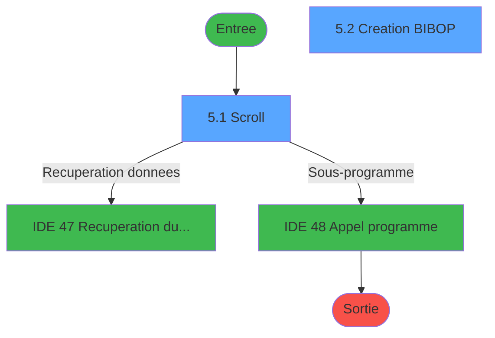
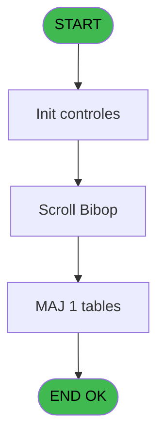
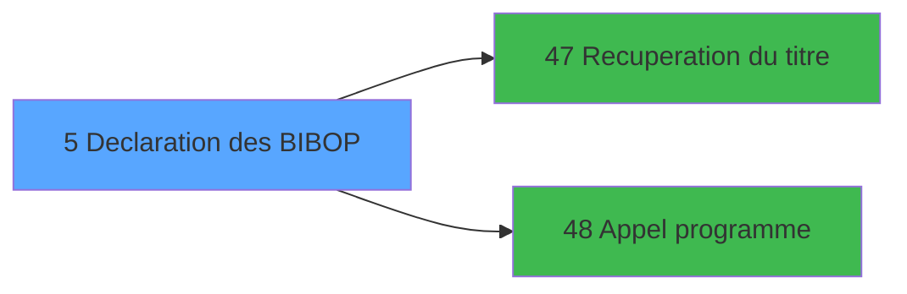

# MAI IDE 5 - Declaration des BIBOP

> **Analyse**: Phases 1-4 2026-02-03 14:45 -> 14:45 (10s) | Assemblage 14:45
> **Pipeline**: V7.2 Enrichi
> **Structure**: 4 onglets (Resume | Ecrans | Donnees | Connexions)

<!-- TAB:Resume -->

## 1. FICHE D'IDENTITE

| Attribut | Valeur |
|----------|--------|
| Projet | MAI |
| IDE Position | 5 |
| Nom Programme | Declaration des BIBOP |
| Fichier source | `Prg_5.xml` |
| Dossier IDE | Bibop |
| Taches | 7 (2 ecrans visibles) |
| Tables modifiees | 1 |
| Programmes appeles | 2 |

## 2. DESCRIPTION FONCTIONNELLE

**Declaration des BIBOP** assure la gestion complete de ce processus, accessible depuis [Menu parametrage Bibop (IDE 8)](MAI-IDE-8.md).

Le flux de traitement s'organise en **3 blocs fonctionnels** :

- **Creation** (3 taches) : insertion d'enregistrements en base (mouvements, prestations)
- **Traitement** (3 taches) : traitements metier divers
- **Saisie** (1 tache) : ecrans de saisie utilisateur (formulaires, champs, donnees)

**Donnees modifiees** : 1 tables en ecriture (table_bibop______tbp).

Detail : phases du traitement

#### Phase 1 : Traitement (3 taches)

- **5** - CM  Table gratuites **[[ECRAN]](#ecran-t1)**
- **5.1** - Scroll **[[ECRAN]](#ecran-t2)**
- **5.3** - Confirmation suppression **[[ECRAN]](#ecran-t6)**

Delegue a : [Recuperation du titre (IDE 47)](MAI-IDE-47.md), [Appel programme (IDE 48)](MAI-IDE-48.md)

#### Phase 2 : Creation (3 taches)

- **5.2** - Creation BIBOP **[[ECRAN]](#ecran-t3)**
- **5.2.2** - Creation gratuite
- **5.3.1** - Creation gratuite

#### Phase 3 : Saisie (1 tache)

- **5.2.1** - Contrôle saisie n° serie

#### Tables impactees

| Table | Operations | Role metier |
|-------|-----------|-------------|
| table_bibop______tbp | R/**W** (4 usages) |  |

## 3. BLOCS FONCTIONNELS

### 3.1 Traitement (3 taches)

Traitements internes.

---

#### 5 - CM  Table gratuites [[ECRAN]](#ecran-t1)

**Role** : Traitement : CM  Table gratuites.
**Ecran** : 640 x 184 DLU (MDI) | [Voir mockup](#ecran-t1)
**Delegue a** : [Recuperation du titre (IDE 47)](MAI-IDE-47.md), [Appel programme (IDE 48)](MAI-IDE-48.md)

---

#### 5.1 - Scroll [[ECRAN]](#ecran-t2)

**Role** : Traitement : Scroll.
**Ecran** : 682 x 249 DLU (MDI) | [Voir mockup](#ecran-t2)
**Variables liees** : C (W0 scroll vide)
**Delegue a** : [Recuperation du titre (IDE 47)](MAI-IDE-47.md), [Appel programme (IDE 48)](MAI-IDE-48.md)

---

#### 5.3 - Confirmation suppression [[ECRAN]](#ecran-t6)

**Role** : Traitement : Confirmation suppression.
**Ecran** : 180 x 48 DLU (MDI) | [Voir mockup](#ecran-t6)
**Delegue a** : [Recuperation du titre (IDE 47)](MAI-IDE-47.md), [Appel programme (IDE 48)](MAI-IDE-48.md)

### 3.2 Creation (3 taches)

Insertion de nouveaux enregistrements en base.

---

#### 5.2 - Creation BIBOP [[ECRAN]](#ecran-t3)

**Role** : Creation d'enregistrement : Creation BIBOP.
**Ecran** : 483 x 104 DLU (MDI) | [Voir mockup](#ecran-t3)
**Variables liees** : D (W0 code Bibop)

---

#### 5.2.2 - Creation gratuite

**Role** : Creation d'enregistrement : Creation gratuite.

---

#### 5.3.1 - Creation gratuite

**Role** : Creation d'enregistrement : Creation gratuite.

### 3.3 Saisie (1 tache)

Ce bloc traite la saisie des donnees de la transaction.

---

#### 5.2.1 - Contrôle saisie n° serie

**Role** : Saisie des donnees : Contrôle saisie n° serie.
**Variables liees** : E (W0 serie), F (W1 ret lien serie), H (W1 saisie OK)

## 5. REGLES METIER

*(Aucune regle metier identifiee)*

## 6. CONTEXTE

- **Appele par**: [Menu parametrage Bibop (IDE 8)](MAI-IDE-8.md)
- **Appelle**: 2 programmes | **Tables**: 2 (W:1 R:1 L:1) | **Taches**: 7 | **Expressions**: 3

<!-- TAB:Ecrans -->

## 8. ECRANS

### 8.1 Forms visibles (2 / 7)

| # | Position | Tache | Nom | Type | Largeur | Hauteur | Bloc |
|---|----------|-------|-----|------|---------|---------|------|
| 1 | 5.1 | 5.1 | Scroll | MDI | 682 | 249 | Traitement |
| 2 | 5.2 | 5.2 | Creation BIBOP | MDI | 483 | 104 | Creation |

### 8.2 Mockups Ecrans

---

#### 5.1 - Scroll
**Tache** : [5.1](#t2) | **Type** : MDI | **Dimensions** : 682 x 249 DLU
**Bloc** : Traitement | **Titre IDE** : Scroll

<!-- FORM-DATA:
{
    "width":  682,
    "vFactor":  8,
    "type":  "MDI",
    "hFactor":  8,
    "controls":  [
                     {
                         "x":  0,
                         "type":  "label",
                         "var":  "",
                         "y":  2,
                         "w":  682,
                         "fmt":  "",
                         "name":  "",
                         "h":  19,
                         "color":  "",
                         "text":  "",
                         "parent":  null
                     },
                     {
                         "x":  22,
                         "type":  "label",
                         "var":  "",
                         "y":  26,
                         "w":  637,
                         "fmt":  "",
                         "name":  "",
                         "h":  189,
                         "color":  "",
                         "text":  "",
                         "parent":  null
                     },
                     {
                         "x":  57,
                         "type":  "table",
                         "var":  "",
                         "name":  "",
                         "titleH":  12,
                         "color":  "110",
                         "w":  566,
                         "y":  35,
                         "fmt":  "",
                         "parent":  null,
                         "text":  "",
                         "rowH":  14,
                         "h":  100,
                         "cols":  [
                                      {
                                          "title":  "Code",
                                          "layer":  1,
                                          "w":  160
                                      },
                                      {
                                          "title":  "N° série",
                                          "layer":  2,
                                          "w":  126
                                      },
                                      {
                                          "title":  "Libellé",
                                          "layer":  3,
                                          "w":  244
                                      }
                                  ],
                         "rows":  3
                     },
                     {
                         "x":  140,
                         "type":  "label",
                         "var":  "",
                         "y":  143,
                         "w":  401,
                         "fmt":  "",
                         "name":  "",
                         "h":  60,
                         "color":  "",
                         "text":  "",
                         "parent":  null
                     },
                     {
                         "x":  143,
                         "type":  "label",
                         "var":  "",
                         "y":  144,
                         "w":  397,
                         "fmt":  "",
                         "name":  "",
                         "h":  58,
                         "color":  "",
                         "text":  "",
                         "parent":  null
                     },
                     {
                         "x":  311,
                         "type":  "label",
                         "var":  "",
                         "y":  152,
                         "w":  202,
                         "fmt":  "",
                         "name":  "",
                         "h":  32,
                         "color":  "",
                         "text":  "",
                         "parent":  null
                     },
                     {
                         "x":  313,
                         "type":  "label",
                         "var":  "",
                         "y":  153,
                         "w":  45,
                         "fmt":  "",
                         "name":  "",
                         "h":  30,
                         "color":  "",
                         "text":  "",
                         "parent":  null
                     },
                     {
                         "x":  372,
                         "type":  "label",
                         "var":  "",
                         "y":  157,
                         "w":  99,
                         "fmt":  "",
                         "name":  "",
                         "h":  9,
                         "color":  "7",
                         "text":  "Creation",
                         "parent":  null
                     },
                     {
                         "x":  372,
                         "type":  "label",
                         "var":  "",
                         "y":  172,
                         "w":  131,
                         "fmt":  "",
                         "name":  "",
                         "h":  8,
                         "color":  "7",
                         "text":  "Suppression",
                         "parent":  null
                     },
                     {
                         "x":  331,
                         "type":  "label",
                         "var":  "",
                         "y":  189,
                         "w":  123,
                         "fmt":  "",
                         "name":  "",
                         "h":  10,
                         "color":  "",
                         "text":  "Votre choix",
                         "parent":  null
                     },
                     {
                         "x":  0,
                         "type":  "label",
                         "var":  "",
                         "y":  221,
                         "w":  675,
                         "fmt":  "",
                         "name":  "",
                         "h":  24,
                         "color":  "",
                         "text":  "",
                         "parent":  null
                     },
                     {
                         "x":  62,
                         "type":  "edit",
                         "var":  "",
                         "y":  50,
                         "w":  42,
                         "fmt":  "",
                         "name":  "",
                         "h":  8,
                         "color":  "110",
                         "text":  "",
                         "parent":  5
                     },
                     {
                         "x":  222,
                         "type":  "edit",
                         "var":  "",
                         "y":  50,
                         "w":  98,
                         "fmt":  "",
                         "name":  "",
                         "h":  8,
                         "color":  "110",
                         "text":  "",
                         "parent":  5
                     },
                     {
                         "x":  349,
                         "type":  "edit",
                         "var":  "",
                         "y":  50,
                         "w":  232,
                         "fmt":  "",
                         "name":  "",
                         "h":  8,
                         "color":  "110",
                         "text":  "",
                         "parent":  5
                     },
                     {
                         "x":  450,
                         "type":  "edit",
                         "var":  "",
                         "y":  189,
                         "w":  26,
                         "fmt":  "",
                         "name":  "",
                         "h":  10,
                         "color":  "6",
                         "text":  "",
                         "parent":  null
                     },
                     {
                         "x":  441,
                         "type":  "edit",
                         "var":  "",
                         "y":  7,
                         "w":  237,
                         "fmt":  "WWW DD MMM YYYYT",
                         "name":  "",
                         "h":  8,
                         "color":  "",
                         "text":  "",
                         "parent":  null
                     },
                     {
                         "x":  156,
                         "type":  "image",
                         "var":  "",
                         "y":  148,
                         "w":  141,
                         "fmt":  "",
                         "name":  "",
                         "h":  49,
                         "color":  "",
                         "text":  "",
                         "parent":  null
                     },
                     {
                         "x":  322,
                         "type":  "button",
                         "var":  "",
                         "y":  157,
                         "w":  26,
                         "fmt":  "C",
                         "name":  "C",
                         "h":  9,
                         "color":  "",
                         "text":  "",
                         "parent":  null
                     },
                     {
                         "x":  322,
                         "type":  "button",
                         "var":  "",
                         "y":  171,
                         "w":  26,
                         "fmt":  "S",
                         "name":  "S",
                         "h":  9,
                         "color":  "",
                         "text":  "",
                         "parent":  null
                     },
                     {
                         "x":  6,
                         "type":  "button",
                         "var":  "",
                         "y":  225,
                         "w":  154,
                         "fmt":  "\u0026Quitter",
                         "name":  "",
                         "h":  18,
                         "color":  "",
                         "text":  "",
                         "parent":  null
                     },
                     {
                         "x":  6,
                         "type":  "edit",
                         "var":  "",
                         "y":  6,
                         "w":  267,
                         "fmt":  "20",
                         "name":  "",
                         "h":  8,
                         "color":  "",
                         "text":  "",
                         "parent":  null
                     }
                 ],
    "taskId":  "5.1",
    "height":  249
}
-->

<strong>Champs : 6 champs</strong>

| Pos (x,y) | Nom | Variable | Type |
|-----------|-----|----------|------|
| 62,50 | (sans nom) | - | edit |
| 222,50 | (sans nom) | - | edit |
| 349,50 | (sans nom) | - | edit |
| 450,189 | (sans nom) | - | edit |
| 441,7 | WWW DD MMM YYYYT | - | edit |
| 6,6 | 20 | - | edit |

<strong>Boutons : 3 boutons</strong>

| Bouton | Pos (x,y) | Action |
|--------|-----------|--------|
| C | 322,157 | Bouton fonctionnel |
| S | 322,171 | Bouton fonctionnel |
| Quitter | 6,225 | Quitte le programme |

---

#### 5.2 - Creation BIBOP
**Tache** : [5.2](#t3) | **Type** : MDI | **Dimensions** : 483 x 104 DLU
**Bloc** : Creation | **Titre IDE** : Creation BIBOP

<!-- FORM-DATA:
{
    "width":  483,
    "vFactor":  8,
    "type":  "MDI",
    "hFactor":  8,
    "controls":  [
                     {
                         "x":  0,
                         "type":  "label",
                         "var":  "",
                         "y":  0,
                         "w":  482,
                         "fmt":  "",
                         "name":  "",
                         "h":  75,
                         "color":  "",
                         "text":  "",
                         "parent":  null
                     },
                     {
                         "x":  36,
                         "type":  "label",
                         "var":  "",
                         "y":  11,
                         "w":  48,
                         "fmt":  "",
                         "name":  "",
                         "h":  8,
                         "color":  "",
                         "text":  "Code",
                         "parent":  null
                     },
                     {
                         "x":  237,
                         "type":  "label",
                         "var":  "",
                         "y":  11,
                         "w":  64,
                         "fmt":  "",
                         "name":  "",
                         "h":  8,
                         "color":  "",
                         "text":  "N° Serie",
                         "parent":  null
                     },
                     {
                         "x":  36,
                         "type":  "label",
                         "var":  "",
                         "y":  31,
                         "w":  56,
                         "fmt":  "",
                         "name":  "",
                         "h":  8,
                         "color":  "",
                         "text":  "Libelle",
                         "parent":  null
                     },
                     {
                         "x":  102,
                         "type":  "label",
                         "var":  "",
                         "y":  57,
                         "w":  338,
                         "fmt":  "",
                         "name":  "",
                         "h":  8,
                         "color":  "143",
                         "text":  "Le numero de serie n\u0027est pas valide",
                         "parent":  null
                     },
                     {
                         "x":  0,
                         "type":  "label",
                         "var":  "",
                         "y":  82,
                         "w":  483,
                         "fmt":  "",
                         "name":  "",
                         "h":  22,
                         "color":  "",
                         "text":  "",
                         "parent":  null
                     },
                     {
                         "x":  104,
                         "type":  "edit",
                         "var":  "",
                         "y":  9,
                         "w":  48,
                         "fmt":  "3P0A",
                         "name":  "W1 n° code club",
                         "h":  10,
                         "color":  "6",
                         "text":  "",
                         "parent":  null
                     },
                     {
                         "x":  333,
                         "type":  "edit",
                         "var":  "",
                         "y":  9,
                         "w":  104,
                         "fmt":  "U8A",
                         "name":  "W1 n° serie",
                         "h":  10,
                         "color":  "6",
                         "text":  "",
                         "parent":  null
                     },
                     {
                         "x":  104,
                         "type":  "edit",
                         "var":  "",
                         "y":  29,
                         "w":  238,
                         "fmt":  "",
                         "name":  "W1 libelle",
                         "h":  10,
                         "color":  "6",
                         "text":  "",
                         "parent":  null
                     },
                     {
                         "x":  8,
                         "type":  "button",
                         "var":  "",
                         "y":  85,
                         "w":  154,
                         "fmt":  "\u0026Ok",
                         "name":  "Bouton Ok",
                         "h":  17,
                         "color":  "",
                         "text":  "",
                         "parent":  null
                     },
                     {
                         "x":  12,
                         "type":  "image",
                         "var":  "",
                         "y":  45,
                         "w":  83,
                         "fmt":  "",
                         "name":  "",
                         "h":  27,
                         "color":  "",
                         "text":  "",
                         "parent":  null
                     },
                     {
                         "x":  168,
                         "type":  "button",
                         "var":  "",
                         "y":  85,
                         "w":  154,
                         "fmt":  "A\u0026bandonner",
                         "name":  "",
                         "h":  17,
                         "color":  "",
                         "text":  "",
                         "parent":  null
                     }
                 ],
    "taskId":  "5.2",
    "height":  104
}
-->

<strong>Champs : 3 champs</strong>

| Pos (x,y) | Nom | Variable | Type |
|-----------|-----|----------|------|
| 104,9 | W1 n° code club | - | edit |
| 333,9 | W1 n° serie | - | edit |
| 104,29 | W1 libelle | - | edit |

<strong>Boutons : 2 boutons</strong>

| Bouton | Pos (x,y) | Action |
|--------|-----------|--------|
| Ok | 8,85 | Valide la saisie et enregistre |
| Abandonner | 168,85 | Annule et retour au menu |

## 9. NAVIGATION

### 9.1 Enchainement des ecrans

**Detail par enchainement :**

| Depuis | Action | Vers | Retour |
|--------|--------|------|--------|
| Scroll | Recuperation donnees | [Recuperation du titre (IDE 47)](MAI-IDE-47.md) | Retour ecran |
| Scroll | Sous-programme | [Appel programme (IDE 48)](MAI-IDE-48.md) | Retour ecran |

### 9.3 Structure hierarchique (7 taches)

| Position | Tache | Type | Dimensions | Bloc |
|----------|-------|------|------------|------|
| **5.1** | [**CM  Table gratuites** (5)](#t1) [mockup](#ecran-t1) | MDI | 640x184 | Traitement |
| 5.1.1 | [Scroll (5.1)](#t2) [mockup](#ecran-t2) | MDI | 682x249 | |
| 5.1.2 | [Confirmation suppression (5.3)](#t6) [mockup](#ecran-t6) | MDI | 180x48 | |
| **5.2** | [**Creation BIBOP** (5.2)](#t3) [mockup](#ecran-t3) | MDI | 483x104 | Creation |
| 5.2.1 | [Creation gratuite (5.2.2)](#t5) | MDI | - | |
| 5.2.2 | [Creation gratuite (5.3.1)](#t7) | MDI | - | |
| **5.3** | [**Contrôle saisie n° serie** (5.2.1)](#t4) | MDI | - | Saisie |

### 9.4 Algorigramme

> **Legende**: Vert = START/END OK | Rouge = END KO | Bleu = Decisions
> *Algorigramme auto-genere. Utiliser `/algorigramme` pour une synthese metier detaillee.*

<!-- TAB:Donnees -->

## 10. TABLES

### Tables utilisees (2)

| ID | Nom | Description | Type | R | W | L | Usages |
|----|-----|-------------|------|---|---|---|--------|
| 158 | table_bibop______tbp |  | DB | R | **W** |   | 4 |
| 160 | bibop____________bib |  | DB |   |   | L | 1 |

### Colonnes par table (2 / 1 tables avec colonnes identifiees)

Table 158 - table_bibop______tbp (R/**W**) - 4 usages

| Lettre | Variable | Acces | Type |
|--------|----------|-------|------|
| A | v. passage prefixe | W | Logical |
| B | v. fin tache | W | Logical |
| C | W1 ret.lien bibop | W | Numeric |
| D | W1 choix action | W | Alpha |
| E | v. titre ecran | W | Alpha |
| F | W1 ret lien serie | W | Numeric |
| G | W1 ret lien code | W | Numeric |
| H | W1 saisie OK | W | Alpha |
| I | Bouton Ok | W | Alpha |
| J | v. titre ecran | W | Alpha |

## 11. VARIABLES

### 11.1 Parametres entrants (1)

Variables recues du programme appelant ([Menu parametrage Bibop (IDE 8)](MAI-IDE-8.md)).

| Lettre | Nom | Type | Usage dans |
|--------|-----|------|-----------|
| A | P0 societe | Alpha | - |

### 11.2 Variables de session (1)

Variables persistantes pendant toute la session.

| Lettre | Nom | Type | Usage dans |
|--------|-----|------|-----------|
| J | v. titre ecran | Alpha | - |

### 11.3 Variables de travail (4)

Variables internes au programme.

| Lettre | Nom | Type | Usage dans |
|--------|-----|------|-----------|
| B | W0 choix action | Alpha | 3x calcul interne |
| C | W0 scroll vide | Alpha | - |
| D | W0 code Bibop | Numeric | - |
| E | W0 serie | Alpha | - |

### 11.4 Autres (4)

Variables diverses.

| Lettre | Nom | Type | Usage dans |
|--------|-----|------|-----------|
| F | W1 ret lien serie | Numeric | - |
| G | W1 ret lien code | Numeric | - |
| H | W1 saisie OK | Alpha | - |
| I | Bouton Ok | Alpha | - |

## 12. EXPRESSIONS

**3 / 3 expressions decodees (100%)**

### 12.1 Repartition par type

| Type | Expressions | Regles |
|------|-------------|--------|
| CONDITION | 3 | 0 |

### 12.2 Expressions cles par type

#### CONDITION (3 expressions)

| Type | IDE | Expression | Regle |
|------|-----|------------|-------|
| CONDITION | 3 | `W0 choix action [B]='F'` | - |
| CONDITION | 2 | `W0 choix action [B]='S'` | - |
| CONDITION | 1 | `W0 choix action [B]='C'` | - |

<!-- TAB:Connexions -->

## 13. GRAPHE D'APPELS

### 13.1 Chaine depuis Main (Callers)

Main -> ... -> [Menu parametrage Bibop (IDE 8)](MAI-IDE-8.md) -> **Declaration des BIBOP (IDE 5)**

### 13.2 Callers

| IDE | Nom Programme | Nb Appels |
|-----|---------------|-----------|
| [8](MAI-IDE-8.md) | Menu parametrage Bibop | 1 |

### 13.3 Callees (programmes appeles)

### 13.4 Detail Callees avec contexte

| IDE | Nom Programme | Appels | Contexte |
|-----|---------------|--------|----------|
| [47](MAI-IDE-47.md) | Recuperation du titre | 2 | Recuperation donnees |
| [48](MAI-IDE-48.md) | Appel programme | 1 | Sous-programme |

## 14. RECOMMANDATIONS MIGRATION

### 14.1 Profil du programme

| Metrique | Valeur | Impact migration |
|----------|--------|-----------------|
| Lignes de logique | 108 | Programme compact |
| Expressions | 3 | Peu de logique |
| Tables WRITE | 1 | Impact faible |
| Sous-programmes | 2 | Peu de dependances |
| Ecrans visibles | 2 | Quelques ecrans |
| Code desactive | 0% (0 / 108) | Code sain |
| Regles metier | 0 | Pas de regle identifiee |

### 14.2 Plan de migration par bloc

#### Traitement (3 taches: 3 ecrans, 0 traitement)

- **Strategie** : 3 composant(s) UI (Razor/React) avec formulaires et validation.
- 2 sous-programme(s) a migrer ou a reutiliser depuis les services existants.
- Decomposer les taches en services unitaires testables.

#### Creation (3 taches: 1 ecran, 2 traitements)

- **Strategie** : Repository pattern avec Entity Framework Core.
- Insertion via `IRepository<T>.CreateAsync()`

#### Saisie (1 tache: 0 ecran, 1 traitement)

- **Strategie** : Formulaire React/Blazor avec validation Zod/FluentValidation.
- Validation temps reel cote client + serveur

### 14.3 Dependances critiques

| Dependance | Type | Appels | Impact |
|------------|------|--------|--------|
| table_bibop______tbp | Table WRITE (Database) | 3x | Schema + repository |
| [Recuperation du titre (IDE 47)](MAI-IDE-47.md) | Sous-programme | 2x | Haute - Recuperation donnees |
| [Appel programme (IDE 48)](MAI-IDE-48.md) | Sous-programme | 1x | Normale - Sous-programme |

---
*Spec DETAILED generee par Pipeline V7.2 - 2026-02-03 14:45*
