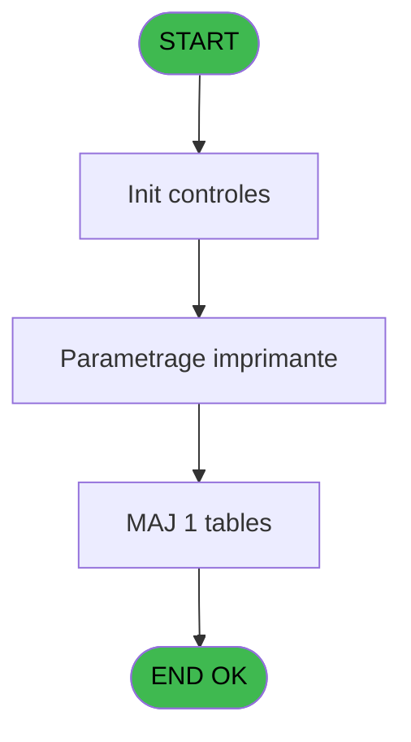
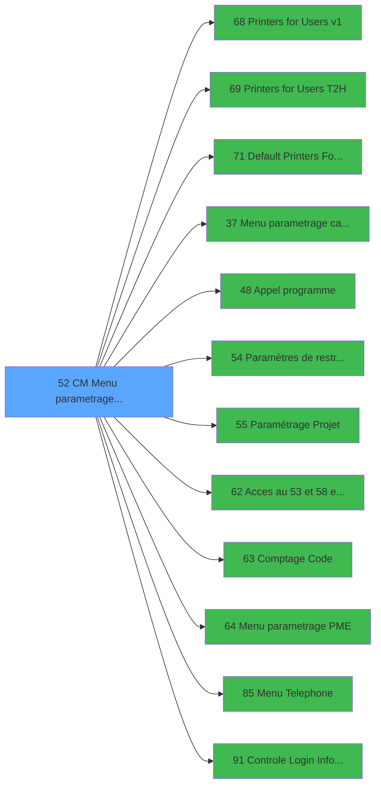

# MAI IDE 52 - CM  Menu parametrage caisse

> **Analyse**: Phases 1-4 2026-02-03 14:56 -> 14:56 (10s) | Assemblage 14:56
> **Pipeline**: V7.2 Enrichi
> **Structure**: 4 onglets (Resume | Ecrans | Donnees | Connexions)

<!-- TAB:Resume -->

## 1. FICHE D'IDENTITE

| Attribut | Valeur |
|----------|--------|
| Projet | MAI |
| IDE Position | 52 |
| Nom Programme | CM  Menu parametrage caisse |
| Fichier source | `Prg_52.xml` |
| Dossier IDE | Parametre |
| Taches | 8 (2 ecrans visibles) |
| Tables modifiees | 1 |
| Programmes appeles | 12 |

## 2. DESCRIPTION FONCTIONNELLE

**CM  Menu parametrage caisse** assure la gestion complete de ce processus, accessible depuis [Main Program (IDE 1)](MAI-IDE-1.md).

Le flux de traitement s'organise en **4 blocs fonctionnels** :

- **Traitement** (5 taches) : traitements metier divers
- **Impression** (1 tache) : generation de tickets et documents
- **Consultation** (1 tache) : ecrans de recherche, selection et consultation
- **Initialisation** (1 tache) : reinitialisation d'etats et de variables de travail

**Donnees modifiees** : 1 tables en ecriture (reseau_cloture___rec).

**Logique metier** : 3 regles identifiees couvrant conditions metier.

Detail : phases du traitement

#### Phase 1 : Traitement (5 taches)

- **52** - Menu **[[ECRAN]](#ecran-t1)**
- **52.1** - Station eteinte erreur v1
- **52.3** - Lecture paramètres PAR
- **52.6** - Lecture uni/bi
- **52.7** - Station eteinte erreur v1

Delegue a : [Menu parametrage caisse (IDE 37)](MAI-IDE-37.md), [Appel programme (IDE 48)](MAI-IDE-48.md), [Paramètres de restructuration (IDE 54)](MAI-IDE-54.md), [Paramétrage Projet (IDE 55)](MAI-IDE-55.md), [Acces au 53 et 58 et 114 (IDE 62)](MAI-IDE-62.md), [Menu parametrage PME (IDE 64)](MAI-IDE-64.md), [Menu Telephone (IDE 85)](MAI-IDE-85.md)

#### Phase 2 : Initialisation (1 tache)

- **52.2** - Initialisation

#### Phase 3 : Consultation (1 tache)

- **52.4** - Affich message impossibilite **[[ECRAN]](#ecran-t5)**

#### Phase 4 : Impression (1 tache)

- **52.5** - Paramètre imprimante **[[ECRAN]](#ecran-t6)**

Delegue a : [Printers for Users v1 (IDE 68)](MAI-IDE-68.md), [Printers for Users T2H (IDE 69)](MAI-IDE-69.md), [Default Printers For Admin (IDE 71)](MAI-IDE-71.md)

#### Tables impactees

| Table | Operations | Role metier |
|-------|-----------|-------------|
| reseau_cloture___rec | **W** (2 usages) | Donnees reseau/cloture |

## 3. BLOCS FONCTIONNELS

### 3.1 Traitement (5 taches)

Traitements internes.

---

#### 52 - Menu [[ECRAN]](#ecran-t1)

**Role** : Traitement : Menu.
**Ecran** : 880 x 213 DLU (MDI) | [Voir mockup](#ecran-t1)

4 sous-taches directes

| Tache | Nom | Bloc |
|-------|-----|------|
| [52.1](#t2) | Station eteinte erreur v1 | Traitement |
| [52.3](#t4) | Lecture paramètres PAR | Traitement |
| [52.6](#t7) | Lecture uni/bi | Traitement |
| [52.7](#t10) | Station eteinte erreur v1 | Traitement |

**Delegue a** : [Menu parametrage caisse (IDE 37)](MAI-IDE-37.md), [Appel programme (IDE 48)](MAI-IDE-48.md), [Paramètres de restructuration (IDE 54)](MAI-IDE-54.md)

---

#### 52.1 - Station eteinte erreur v1

**Role** : Traitement : Station eteinte erreur v1.
**Delegue a** : [Menu parametrage caisse (IDE 37)](MAI-IDE-37.md), [Appel programme (IDE 48)](MAI-IDE-48.md), [Paramètres de restructuration (IDE 54)](MAI-IDE-54.md)

---

#### 52.3 - Lecture paramètres PAR

**Role** : Traitement : Lecture paramètres PAR.
**Delegue a** : [Menu parametrage caisse (IDE 37)](MAI-IDE-37.md), [Appel programme (IDE 48)](MAI-IDE-48.md), [Paramètres de restructuration (IDE 54)](MAI-IDE-54.md)

---

#### 52.6 - Lecture uni/bi

**Role** : Traitement : Lecture uni/bi.
**Delegue a** : [Menu parametrage caisse (IDE 37)](MAI-IDE-37.md), [Appel programme (IDE 48)](MAI-IDE-48.md), [Paramètres de restructuration (IDE 54)](MAI-IDE-54.md)

---

#### 52.7 - Station eteinte erreur v1

**Role** : Traitement : Station eteinte erreur v1.
**Delegue a** : [Menu parametrage caisse (IDE 37)](MAI-IDE-37.md), [Appel programme (IDE 48)](MAI-IDE-48.md), [Paramètres de restructuration (IDE 54)](MAI-IDE-54.md)

### 3.2 Initialisation (1 tache)

Reinitialisation d'etats et variables de travail.

---

#### 52.2 - Initialisation

**Role** : Reinitialisation : Initialisation.

### 3.3 Consultation (1 tache)

Ecrans de recherche et consultation.

---

#### 52.4 - Affich message impossibilite [[ECRAN]](#ecran-t5)

**Role** : Reinitialisation : Affich message impossibilite.
**Ecran** : 160 x 64 DLU (Modal) | [Voir mockup](#ecran-t5)

### 3.4 Impression (1 tache)

Generation des documents et tickets.

---

#### 52.5 - Paramètre imprimante [[ECRAN]](#ecran-t6)

**Role** : Configuration/parametrage : Paramètre imprimante.
**Ecran** : 563 x 132 DLU (MDI) | [Voir mockup](#ecran-t6)
**Delegue a** : [Printers for Users v1 (IDE 68)](MAI-IDE-68.md), [Printers for Users T2H (IDE 69)](MAI-IDE-69.md), [Default Printers For Admin (IDE 71)](MAI-IDE-71.md)

## 5. REGLES METIER

3 regles identifiees:

### Autres (3 regles)

#### [RM-001] Si W0 village CAM [B]='O' alors 'C' sinon '.')

| Element | Detail |
|---------|--------|
| **Condition** | `W0 village CAM [B]='O'` |
| **Si vrai** | 'C' |
| **Si faux** | '.') |
| **Variables** | B (W0 village CAM) |
| **Expression source** | Expression 3 : `IF (W0 village CAM [B]='O','C','.')` |
| **Exemple** | Si W0 village CAM [B]='O' → 'C'. Sinon → '.') |

#### [RM-002] Si W0 village TEL [C]='O' alors 'D' sinon '.')

| Element | Detail |
|---------|--------|
| **Condition** | `W0 village TEL [C]='O'` |
| **Si vrai** | 'D' |
| **Si faux** | '.') |
| **Variables** | C (W0 village TEL) |
| **Expression source** | Expression 4 : `IF (W0 village TEL [C]='O','D','.')` |
| **Exemple** | Si W0 village TEL [C]='O' → 'D'. Sinon → '.') |

#### [RM-003] Si W0 village nouvelle ca... [M]='O' alors 'F' sinon '.')

| Element | Detail |
|---------|--------|
| **Condition** | `W0 village nouvelle ca... [M]='O'` |
| **Si vrai** | 'F' |
| **Si faux** | '.') |
| **Expression source** | Expression 8 : `IF (W0 village nouvelle ca... [M]='O','F','.')` |
| **Exemple** | Si W0 village nouvelle ca... [M]='O' → 'F'. Sinon → '.') |

## 6. CONTEXTE

- **Appele par**: [Main Program (IDE 1)](MAI-IDE-1.md)
- **Appelle**: 12 programmes | **Tables**: 4 (W:1 R:3 L:0) | **Taches**: 8 | **Expressions**: 31

<!-- TAB:Ecrans -->

## 8. ECRANS

### 8.1 Forms visibles (2 / 8)

| # | Position | Tache | Nom | Type | Largeur | Hauteur | Bloc |
|---|----------|-------|-----|------|---------|---------|------|
| 1 | 52 | 52 | Menu | MDI | 880 | 213 | Traitement |
| 2 | 52.6 | 52.5 | Paramètre imprimante | MDI | 563 | 132 | Impression |

### 8.2 Mockups Ecrans

---

#### 52 - Menu
**Tache** : [52](#t1) | **Type** : MDI | **Dimensions** : 880 x 213 DLU
**Bloc** : Traitement | **Titre IDE** : Menu

<!-- FORM-DATA:
{
    "width":  880,
    "vFactor":  8,
    "type":  "MDI",
    "hFactor":  8,
    "controls":  [
                     {
                         "x":  0,
                         "type":  "label",
                         "var":  "",
                         "y":  0,
                         "w":  873,
                         "fmt":  "",
                         "name":  "",
                         "h":  21,
                         "color":  "",
                         "text":  "",
                         "parent":  null
                     },
                     {
                         "x":  253,
                         "type":  "label",
                         "var":  "",
                         "y":  51,
                         "w":  534,
                         "fmt":  "",
                         "name":  "",
                         "h":  120,
                         "color":  "",
                         "text":  "",
                         "parent":  null
                     },
                     {
                         "x":  270,
                         "type":  "label",
                         "var":  "",
                         "y":  58,
                         "w":  497,
                         "fmt":  "",
                         "name":  "",
                         "h":  91,
                         "color":  "",
                         "text":  "",
                         "parent":  6
                     },
                     {
                         "x":  318,
                         "type":  "label",
                         "var":  "",
                         "y":  58,
                         "w":  447,
                         "fmt":  "",
                         "name":  "",
                         "h":  90,
                         "color":  "6",
                         "text":  "",
                         "parent":  6
                     },
                     {
                         "x":  273,
                         "type":  "label",
                         "var":  "",
                         "y":  59,
                         "w":  45,
                         "fmt":  "",
                         "name":  "",
                         "h":  89,
                         "color":  "",
                         "text":  "",
                         "parent":  6
                     },
                     {
                         "x":  334,
                         "type":  "label",
                         "var":  "",
                         "y":  62,
                         "w":  373,
                         "fmt":  "",
                         "name":  "",
                         "h":  8,
                         "color":  "146",
                         "text":  "Parametrage exploitation",
                         "parent":  6
                     },
                     {
                         "x":  334,
                         "type":  "label",
                         "var":  "",
                         "y":  76,
                         "w":  373,
                         "fmt":  "",
                         "name":  "",
                         "h":  8,
                         "color":  "146",
                         "text":  "Parametrage imprimante",
                         "parent":  6
                     },
                     {
                         "x":  334,
                         "type":  "label",
                         "var":  "",
                         "y":  90,
                         "w":  373,
                         "fmt":  "",
                         "name":  "",
                         "h":  8,
                         "color":  "146",
                         "text":  "Parametrage caisse",
                         "parent":  6
                     },
                     {
                         "x":  442,
                         "type":  "label",
                         "var":  "",
                         "y":  155,
                         "w":  123,
                         "fmt":  "",
                         "name":  "",
                         "h":  10,
                         "color":  "",
                         "text":  "Votre choix",
                         "parent":  6
                     },
                     {
                         "x":  0,
                         "type":  "label",
                         "var":  "",
                         "y":  185,
                         "w":  873,
                         "fmt":  "",
                         "name":  "",
                         "h":  24,
                         "color":  "",
                         "text":  "",
                         "parent":  null
                     },
                     {
                         "x":  595,
                         "type":  "edit",
                         "var":  "",
                         "y":  155,
                         "w":  26,
                         "fmt":  "",
                         "name":  "W0 choix action",
                         "h":  10,
                         "color":  "6",
                         "text":  "",
                         "parent":  6
                     },
                     {
                         "x":  3,
                         "type":  "image",
                         "var":  "",
                         "y":  2,
                         "w":  59,
                         "fmt":  "",
                         "name":  "",
                         "h":  18,
                         "color":  "",
                         "text":  "",
                         "parent":  null
                     },
                     {
                         "x":  77,
                         "type":  "edit",
                         "var":  "",
                         "y":  6,
                         "w":  480,
                         "fmt":  "40",
                         "name":  "",
                         "h":  8,
                         "color":  "",
                         "text":  "",
                         "parent":  null
                     },
                     {
                         "x":  596,
                         "type":  "edit",
                         "var":  "",
                         "y":  6,
                         "w":  268,
                         "fmt":  "WWW DD MMM YYYYT",
                         "name":  "",
                         "h":  8,
                         "color":  "",
                         "text":  "",
                         "parent":  null
                     },
                     {
                         "x":  0,
                         "type":  "image",
                         "var":  "",
                         "y":  22,
                         "w":  86,
                         "fmt":  "",
                         "name":  "",
                         "h":  34,
                         "color":  "",
                         "text":  "",
                         "parent":  null
                     },
                     {
                         "x":  282,
                         "type":  "button",
                         "var":  "",
                         "y":  62,
                         "w":  26,
                         "fmt":  "A",
                         "name":  "A",
                         "h":  8,
                         "color":  "",
                         "text":  "",
                         "parent":  null
                     },
                     {
                         "x":  282,
                         "type":  "button",
                         "var":  "",
                         "y":  76,
                         "w":  26,
                         "fmt":  "B",
                         "name":  "B",
                         "h":  8,
                         "color":  "",
                         "text":  "",
                         "parent":  null
                     },
                     {
                         "x":  282,
                         "type":  "button",
                         "var":  "",
                         "y":  90,
                         "w":  26,
                         "fmt":  "C",
                         "name":  "C",
                         "h":  8,
                         "color":  "",
                         "text":  "",
                         "parent":  null
                     },
                     {
                         "x":  13,
                         "type":  "image",
                         "var":  "",
                         "y":  97,
                         "w":  192,
                         "fmt":  "",
                         "name":  "",
                         "h":  51,
                         "color":  "",
                         "text":  "",
                         "parent":  null
                     },
                     {
                         "x":  282,
                         "type":  "button",
                         "var":  "",
                         "y":  104,
                         "w":  26,
                         "fmt":  "D",
                         "name":  "D",
                         "h":  8,
                         "color":  "",
                         "text":  "",
                         "parent":  null
                     },
                     {
                         "x":  334,
                         "type":  "edit",
                         "var":  "",
                         "y":  104,
                         "w":  405,
                         "fmt":  "30",
                         "name":  "",
                         "h":  8,
                         "color":  "146",
                         "text":  "",
                         "parent":  6
                     },
                     {
                         "x":  282,
                         "type":  "button",
                         "var":  "",
                         "y":  118,
                         "w":  26,
                         "fmt":  "E",
                         "name":  "E",
                         "h":  9,
                         "color":  "",
                         "text":  "",
                         "parent":  null
                     },
                     {
                         "x":  334,
                         "type":  "edit",
                         "var":  "",
                         "y":  118,
                         "w":  405,
                         "fmt":  "30",
                         "name":  "",
                         "h":  8,
                         "color":  "146",
                         "text":  "",
                         "parent":  6
                     },
                     {
                         "x":  282,
                         "type":  "button",
                         "var":  "",
                         "y":  133,
                         "w":  26,
                         "fmt":  "F",
                         "name":  "F",
                         "h":  8,
                         "color":  "",
                         "text":  "",
                         "parent":  null
                     },
                     {
                         "x":  334,
                         "type":  "edit",
                         "var":  "",
                         "y":  133,
                         "w":  405,
                         "fmt":  "30",
                         "name":  "",
                         "h":  8,
                         "color":  "146",
                         "text":  "",
                         "parent":  6
                     },
                     {
                         "x":  6,
                         "type":  "button",
                         "var":  "",
                         "y":  189,
                         "w":  154,
                         "fmt":  "\u0026Quitter",
                         "name":  "\u0026Quitter",
                         "h":  18,
                         "color":  "",
                         "text":  "",
                         "parent":  null
                     }
                 ],
    "taskId":  "52",
    "height":  213
}
-->

<strong>Champs : 6 champs</strong>

| Pos (x,y) | Nom | Variable | Type |
|-----------|-----|----------|------|
| 595,155 | W0 choix action | - | edit |
| 77,6 | 40 | - | edit |
| 596,6 | WWW DD MMM YYYYT | - | edit |
| 334,104 | 30 | - | edit |
| 334,118 | 30 | - | edit |
| 334,133 | 30 | - | edit |

<strong>Boutons : 7 boutons</strong>

| Bouton | Pos (x,y) | Action |
|--------|-----------|--------|
| A | 282,62 | Bouton fonctionnel |
| B | 282,76 | Bouton fonctionnel |
| C | 282,90 | Bouton fonctionnel |
| D | 282,104 | Bouton fonctionnel |
| E | 282,118 | Bouton fonctionnel |
| F | 282,133 | Bouton fonctionnel |
| Quitter | 6,189 | Quitte le programme |

---

#### 52.6 - Paramètre imprimante
**Tache** : [52.5](#t6) | **Type** : MDI | **Dimensions** : 563 x 132 DLU
**Bloc** : Impression | **Titre IDE** : Paramètre imprimante

<!-- FORM-DATA:
{
    "width":  563,
    "vFactor":  8,
    "type":  "MDI",
    "hFactor":  8,
    "controls":  [
                     {
                         "x":  3,
                         "type":  "label",
                         "var":  "",
                         "y":  2,
                         "w":  556,
                         "fmt":  "",
                         "name":  "",
                         "h":  21,
                         "color":  "",
                         "text":  "",
                         "parent":  null
                     },
                     {
                         "x":  3,
                         "type":  "label",
                         "var":  "",
                         "y":  26,
                         "w":  556,
                         "fmt":  "",
                         "name":  "",
                         "h":  72,
                         "color":  "",
                         "text":  "",
                         "parent":  null
                     },
                     {
                         "x":  13,
                         "type":  "label",
                         "var":  "",
                         "y":  29,
                         "w":  536,
                         "fmt":  "",
                         "name":  "",
                         "h":  65,
                         "color":  "",
                         "text":  "",
                         "parent":  null
                     },
                     {
                         "x":  241,
                         "type":  "label",
                         "var":  "",
                         "y":  32,
                         "w":  293,
                         "fmt":  "",
                         "name":  "",
                         "h":  44,
                         "color":  "",
                         "text":  "",
                         "parent":  null
                     },
                     {
                         "x":  247,
                         "type":  "label",
                         "var":  "",
                         "y":  35,
                         "w":  45,
                         "fmt":  "",
                         "name":  "",
                         "h":  37,
                         "color":  "",
                         "text":  "",
                         "parent":  null
                     },
                     {
                         "x":  294,
                         "type":  "label",
                         "var":  "",
                         "y":  39,
                         "w":  208,
                         "fmt":  "",
                         "name":  "",
                         "h":  8,
                         "color":  "7",
                         "text":  "Admin parameters",
                         "parent":  null
                     },
                     {
                         "x":  294,
                         "type":  "label",
                         "var":  "",
                         "y":  57,
                         "w":  208,
                         "fmt":  "",
                         "name":  "",
                         "h":  8,
                         "color":  "7",
                         "text":  "User parameters",
                         "parent":  null
                     },
                     {
                         "x":  267,
                         "type":  "label",
                         "var":  "",
                         "y":  80,
                         "w":  141,
                         "fmt":  "",
                         "name":  "",
                         "h":  10,
                         "color":  "",
                         "text":  "Votre choix",
                         "parent":  null
                     },
                     {
                         "x":  3,
                         "type":  "label",
                         "var":  "",
                         "y":  103,
                         "w":  556,
                         "fmt":  "",
                         "name":  "",
                         "h":  24,
                         "color":  "",
                         "text":  "",
                         "parent":  null
                     },
                     {
                         "x":  430,
                         "type":  "edit",
                         "var":  "",
                         "y":  80,
                         "w":  45,
                         "fmt":  "",
                         "name":  "W Choix",
                         "h":  10,
                         "color":  "6",
                         "text":  "",
                         "parent":  null
                     },
                     {
                         "x":  6,
                         "type":  "image",
                         "var":  "",
                         "y":  3,
                         "w":  59,
                         "fmt":  "",
                         "name":  "",
                         "h":  18,
                         "color":  "",
                         "text":  "",
                         "parent":  null
                     },
                     {
                         "x":  82,
                         "type":  "edit",
                         "var":  "",
                         "y":  7,
                         "w":  413,
                         "fmt":  "40",
                         "name":  "",
                         "h":  10,
                         "color":  "",
                         "text":  "",
                         "parent":  null
                     },
                     {
                         "x":  45,
                         "type":  "image",
                         "var":  "",
                         "y":  34,
                         "w":  175,
                         "fmt":  "",
                         "name":  "",
                         "h":  56,
                         "color":  "",
                         "text":  "",
                         "parent":  null
                     },
                     {
                         "x":  256,
                         "type":  "button",
                         "var":  "",
                         "y":  39,
                         "w":  26,
                         "fmt":  "1",
                         "name":  "1",
                         "h":  8,
                         "color":  "",
                         "text":  "",
                         "parent":  null
                     },
                     {
                         "x":  256,
                         "type":  "button",
                         "var":  "",
                         "y":  57,
                         "w":  26,
                         "fmt":  "2",
                         "name":  "2",
                         "h":  8,
                         "color":  "",
                         "text":  "",
                         "parent":  null
                     },
                     {
                         "x":  14,
                         "type":  "button",
                         "var":  "",
                         "y":  106,
                         "w":  154,
                         "fmt":  "\u0026Quitter",
                         "name":  "",
                         "h":  18,
                         "color":  "",
                         "text":  "",
                         "parent":  null
                     }
                 ],
    "taskId":  "52.6",
    "height":  132
}
-->

<strong>Champs : 2 champs</strong>

| Pos (x,y) | Nom | Variable | Type |
|-----------|-----|----------|------|
| 430,80 | W Choix | - | edit |
| 82,7 | 40 | - | edit |

<strong>Boutons : 3 boutons</strong>

| Bouton | Pos (x,y) | Action |
|--------|-----------|--------|
| 1 | 256,39 | Bouton fonctionnel |
| 2 | 256,57 | Bouton fonctionnel |
| Quitter | 14,106 | Quitte le programme |

## 9. NAVIGATION

### 9.1 Enchainement des ecrans

```mermaid
flowchart TD
    START([Entree])
    style START fill:#3fb950
    VF1[52 Menu]
    style VF1 fill:#58a6ff
    VF6[52.5 Paramètre imprimante]
    style VF6 fill:#58a6ff
    EXT68[IDE 68 Printers for Us...]
    style EXT68 fill:#3fb950
    EXT69[IDE 69 Printers for Us...]
    style EXT69 fill:#3fb950
    EXT71[IDE 71 Default Printer...]
    style EXT71 fill:#3fb950
    EXT37[IDE 37 Menu parametrag...]
    style EXT37 fill:#3fb950
    EXT48[IDE 48 Appel programme]
    style EXT48 fill:#3fb950
    EXT54[IDE 54 Paramètres de r...]
    style EXT54 fill:#3fb950
    EXT55[IDE 55 Paramétrage Projet]
    style EXT55 fill:#3fb950
    EXT62[IDE 62 Acces au 53 et ...]
    style EXT62 fill:#3fb950
    EXT63[IDE 63 Comptage Code]
    style EXT63 fill:#3fb950
    EXT64[IDE 64 Menu parametrag...]
    style EXT64 fill:#3fb950
    EXT85[IDE 85 Menu Telephone]
    style EXT85 fill:#3fb950
    EXT91[IDE 91 Controle Login ...]
    style EXT91 fill:#3fb950
    FIN([Sortie])
    style FIN fill:#f85149
    START --> VF1
    VF1 -->|Impression ticket/document| EXT68
    VF1 -->|Impression ticket/document| EXT69
    VF1 -->|Impression ticket/document| EXT71
    VF1 -->|Navigation menu| EXT37
    VF1 -->|Sous-programme| EXT48
    VF1 -->|Sous-programme| EXT54
    VF1 -->|Sous-programme| EXT55
    VF1 -->|Sous-programme| EXT62
    EXT91 --> FIN
```

**Detail par enchainement :**

| Depuis | Action | Vers | Retour |
|--------|--------|------|--------|
| Menu | Impression ticket/document | [Printers for Users v1 (IDE 68)](MAI-IDE-68.md) | Retour ecran |
| Menu | Impression ticket/document | [Printers for Users T2H (IDE 69)](MAI-IDE-69.md) | Retour ecran |
| Menu | Impression ticket/document | [Default Printers For Admin (IDE 71)](MAI-IDE-71.md) | Retour ecran |
| Menu | Navigation menu | [Menu parametrage caisse (IDE 37)](MAI-IDE-37.md) | Retour ecran |
| Menu | Sous-programme | [Appel programme (IDE 48)](MAI-IDE-48.md) | Retour ecran |
| Menu | Sous-programme | [Paramètres de restructuration (IDE 54)](MAI-IDE-54.md) | Retour ecran |
| Menu | Sous-programme | [Paramétrage Projet (IDE 55)](MAI-IDE-55.md) | Retour ecran |
| Menu | Sous-programme | [Acces au 53 et 58 et 114 (IDE 62)](MAI-IDE-62.md) | Retour ecran |
| Menu | Sous-programme | [Comptage Code (IDE 63)](MAI-IDE-63.md) | Retour ecran |
| Menu | Navigation menu | [Menu parametrage PME (IDE 64)](MAI-IDE-64.md) | Retour ecran |
| Menu | Navigation menu | [Menu Telephone (IDE 85)](MAI-IDE-85.md) | Retour ecran |
| Menu | Controle/validation | [Controle Login Informaticien (IDE 91)](MAI-IDE-91.md) | Retour ecran |

### 9.3 Structure hierarchique (8 taches)

| Position | Tache | Type | Dimensions | Bloc |
|----------|-------|------|------------|------|
| **52.1** | [**Menu** (52)](#t1) [mockup](#ecran-t1) | MDI | 880x213 | Traitement |
| 52.1.1 | [Station eteinte erreur v1 (52.1)](#t2) | MDI | - | |
| 52.1.2 | [Lecture paramètres PAR (52.3)](#t4) | MDI | - | |
| 52.1.3 | [Lecture uni/bi (52.6)](#t7) | MDI | - | |
| 52.1.4 | [Station eteinte erreur v1 (52.7)](#t10) | MDI | - | |
| **52.2** | [**Initialisation** (52.2)](#t3) | MDI | - | Initialisation |
| **52.3** | [**Affich message impossibilite** (52.4)](#t5) [mockup](#ecran-t5) | Modal | 160x64 | Consultation |
| **52.4** | [**Paramètre imprimante** (52.5)](#t6) [mockup](#ecran-t6) | MDI | 563x132 | Impression |

### 9.4 Algorigramme

> **Legende**: Vert = START/END OK | Rouge = END KO | Bleu = Decisions
> *Algorigramme auto-genere. Utiliser `/algorigramme` pour une synthese metier detaillee.*

<!-- TAB:Donnees -->

## 10. TABLES

### Tables utilisees (4)

| ID | Nom | Description | Type | R | W | L | Usages |
|----|-----|-------------|------|---|---|---|--------|
| 23 | reseau_cloture___rec | Donnees reseau/cloture | DB |   | **W** |   | 2 |
| 63 | parametres___par |  | DB | R |   |   | 1 |
| 69 | initialisation___ini |  | DB | R |   |   | 1 |
| 122 | unilateral_bilateral |  | DB | R |   |   | 1 |

### Colonnes par table (0 / 4 tables avec colonnes identifiees)

Table 23 - reseau_cloture___rec (**W**) - 2 usages

*Table utilisee uniquement en Link ou aucune colonne Real identifiee dans le DataView.*

Table 63 - parametres___par (R) - 1 usages

*Table utilisee uniquement en Link ou aucune colonne Real identifiee dans le DataView.*

Table 69 - initialisation___ini (R) - 1 usages

*Table utilisee uniquement en Link ou aucune colonne Real identifiee dans le DataView.*

Table 122 - unilateral_bilateral (R) - 1 usages

*Table utilisee uniquement en Link ou aucune colonne Real identifiee dans le DataView.*

## 11. VARIABLES

### 11.1 Parametres entrants (1)

Variables recues du programme appelant ([Main Program (IDE 1)](MAI-IDE-1.md)).

| Lettre | Nom | Type | Usage dans |
|--------|-----|------|-----------|
| A | P0 societe | Alpha | - |

### 11.2 Variables de travail (15)

Variables internes au programme.

| Lettre | Nom | Type | Usage dans |
|--------|-----|------|-----------|
| B | W0 village CAM | Alpha | 1x calcul interne |
| C | W0 village TEL | Alpha | 6x calcul interne |
| D | W0 nb decimales | Numeric | - |
| E | W0 devise locale | Alpha | - |
| F | W0 code village | Alpha | - |
| G | W0 nom village | Alpha | - |
| H | W0 masque montant | Alpha | - |
| I | W0 choix action | Alpha | - |
| J | W0 utilisation caiss | Alpha | 8x calcul interne |
| K | W0 utilisation bouti | Alpha | 2x calcul interne |
| L | W0 village PME | Alpha | - |
| M | W0 village nouvelle caisse | Alpha | - |
| N | W0 fin tache | Alpha | 2x calcul interne |
| O | W0 autorisation parametre caiss | Logical | - |
| P | W0 uniBi | Alpha | 2x calcul interne |

Toutes les 16 variables (liste complete)

| Cat | Lettre | Nom Variable | Type |
|-----|--------|--------------|------|
| P0 | **A** | P0 societe | Alpha |
| W0 | **B** | W0 village CAM | Alpha |
| W0 | **C** | W0 village TEL | Alpha |
| W0 | **D** | W0 nb decimales | Numeric |
| W0 | **E** | W0 devise locale | Alpha |
| W0 | **F** | W0 code village | Alpha |
| W0 | **G** | W0 nom village | Alpha |
| W0 | **H** | W0 masque montant | Alpha |
| W0 | **I** | W0 choix action | Alpha |
| W0 | **J** | W0 utilisation caiss | Alpha |
| W0 | **K** | W0 utilisation bouti | Alpha |
| W0 | **L** | W0 village PME | Alpha |
| W0 | **M** | W0 village nouvelle caisse | Alpha |
| W0 | **N** | W0 fin tache | Alpha |
| W0 | **O** | W0 autorisation parametre caiss | Logical |
| W0 | **P** | W0 uniBi | Alpha |

## 12. EXPRESSIONS

**31 / 31 expressions decodees (100%)**

### 12.1 Repartition par type

| Type | Expressions | Regles |
|------|-------------|--------|
| CONDITION | 20 | 3 |
| CONSTANTE | 3 | 0 |
| DATE | 1 | 0 |
| OTHER | 2 | 0 |
| NEGATION | 2 | 0 |
| REFERENCE_VG | 2 | 0 |
| FORMAT | 1 | 0 |

### 12.2 Expressions cles par type

#### CONDITION (20 expressions)

| Type | IDE | Expression | Regle |
|------|-----|------------|-------|
| CONDITION | 8 | `IF (W0 village nouvelle ca... [M]='O','F','.')` | [RM-003](#rm-RM-003) |
| CONDITION | 4 | `IF (W0 village TEL [C]='O','D','.')` | [RM-002](#rm-RM-002) |
| CONDITION | 3 | `IF (W0 village CAM [B]='O','C','.')` | [RM-001](#rm-RM-001) |
| CONDITION | 19 | `W0 utilisation caiss [J]='Þ' AND W0 village TEL [C]='O'` | - |
| CONDITION | 21 | `W0 utilisation bouti [K]='O'` | - |
| ... | | *+15 autres* | |

#### CONSTANTE (3 expressions)

| Type | IDE | Expression | Regle |
|------|-----|------------|-------|
| CONSTANTE | 23 | `'F'` | - |
| CONSTANTE | 20 | `''` | - |
| CONSTANTE | 10 | `'C'` | - |

#### DATE (1 expressions)

| Type | IDE | Expression | Regle |
|------|-----|------------|-------|
| DATE | 1 | `Date ()` | - |

#### OTHER (2 expressions)

| Type | IDE | Expression | Regle |
|------|-----|------------|-------|
| OTHER | 28 | `W0 uniBi [P]` | - |
| OTHER | 7 | `MlsTrans('Paramétrage Projet')` | - |

#### NEGATION (2 expressions)

| Type | IDE | Expression | Regle |
|------|-----|------------|-------|
| NEGATION | 29 | `NOT VG9` | - |
| NEGATION | 27 | `NOT (W0 uniBi [P])` | - |

#### REFERENCE_VG (2 expressions)

| Type | IDE | Expression | Regle |
|------|-----|------------|-------|
| REFERENCE_VG | 31 | `VG11` | - |
| REFERENCE_VG | 30 | `VG9` | - |

#### FORMAT (1 expressions)

| Type | IDE | Expression | Regle |
|------|-----|------------|-------|
| FORMAT | 2 | `VG2&' '&'('&Trim(Str(VG10,'3'))&') '` | - |

### 12.3 Toutes les expressions (31)

Voir les 31 expressions

#### CONDITION (20)

| IDE | Expression Decodee |
|-----|-------------------|
| 3 | `IF (W0 village CAM [B]='O','C','.')` |
| 4 | `IF (W0 village TEL [C]='O','D','.')` |
| 6 | `IF (W0 village TEL [C]='O',MlsTrans ('Paramètrage telephone'),Fill ('.',27))` |
| 8 | `IF (W0 village nouvelle ca... [M]='O','F','.')` |
| 9 | `IF (W0 village nouvelle ca... [M]='O',MlsTrans ('Paramètrage PME  '),Fill ('.',27))` |
| 5 | `W0 village TEL [C]='O'` |
| 11 | `W0 autorisation parame... [O]='F'` |
| 12 | `W0 utilisation caiss [J]='A'` |
| 13 | `W0 utilisation caiss [J]='B'` |
| 14 | `W0 utilisation caiss [J]='C' AND W0 fin tache [N]='O'` |
| 15 | `W0 utilisation caiss [J]='D' AND W0 village TEL [C]='O'` |
| 16 | `W0 utilisation caiss [J]='E' AND VG11` |
| 17 | `W0 utilisation caiss [J]='F' AND W0 village nouvelle ca... [M]='O'` |
| 18 | `W0 utilisation caiss [J]='û' AND W0 village TEL [C]='O'` |
| 19 | `W0 utilisation caiss [J]='Þ' AND W0 village TEL [C]='O'` |
| 21 | `W0 utilisation bouti [K]='O'` |
| 22 | `W0 utilisation bouti [K]<>'O'` |
| 24 | `W0 village nouvelle ca... [M]='O'` |
| 25 | `W0 fin tache [N]='O'` |
| 26 | `GetParam ('NGC')='O'` |

#### CONSTANTE (3)

| IDE | Expression Decodee |
|-----|-------------------|
| 10 | `'C'` |
| 20 | `''` |
| 23 | `'F'` |

#### DATE (1)

| IDE | Expression Decodee |
|-----|-------------------|
| 1 | `Date ()` |

#### OTHER (2)

| IDE | Expression Decodee |
|-----|-------------------|
| 7 | `MlsTrans('Paramétrage Projet')` |
| 28 | `W0 uniBi [P]` |

#### NEGATION (2)

| IDE | Expression Decodee |
|-----|-------------------|
| 27 | `NOT (W0 uniBi [P])` |
| 29 | `NOT VG9` |

#### REFERENCE_VG (2)

| IDE | Expression Decodee |
|-----|-------------------|
| 30 | `VG9` |
| 31 | `VG11` |

#### FORMAT (1)

| IDE | Expression Decodee |
|-----|-------------------|
| 2 | `VG2&' '&'('&Trim(Str(VG10,'3'))&') '` |

<!-- TAB:Connexions -->

## 13. GRAPHE D'APPELS

### 13.1 Chaine depuis Main (Callers)

Main -> ... -> [Main Program (IDE 1)](MAI-IDE-1.md) -> **CM  Menu parametrage caisse (IDE 52)**

### 13.2 Callers

| IDE | Nom Programme | Nb Appels |
|-----|---------------|-----------|
| [1](MAI-IDE-1.md) | Main Program | 1 |

### 13.3 Callees (programmes appeles)

### 13.4 Detail Callees avec contexte

| IDE | Nom Programme | Appels | Contexte |
|-----|---------------|--------|----------|
| [68](MAI-IDE-68.md) | Printers for Users v1 | 2 | Impression ticket/document |
| [69](MAI-IDE-69.md) | Printers for Users T2H | 2 | Impression ticket/document |
| [71](MAI-IDE-71.md) | Default Printers For Admin | 2 | Impression ticket/document |
| [37](MAI-IDE-37.md) | Menu parametrage caisse | 1 | Navigation menu |
| [48](MAI-IDE-48.md) | Appel programme | 1 | Sous-programme |
| [54](MAI-IDE-54.md) | Paramètres de restructuration | 1 | Sous-programme |
| [55](MAI-IDE-55.md) | Paramétrage Projet | 1 | Sous-programme |
| [62](MAI-IDE-62.md) | Acces au 53 et 58 et 114 | 1 | Sous-programme |
| [63](MAI-IDE-63.md) | Comptage Code | 1 | Sous-programme |
| [64](MAI-IDE-64.md) | Menu parametrage PME | 1 | Navigation menu |
| [85](MAI-IDE-85.md) | Menu Telephone | 1 | Navigation menu |
| [91](MAI-IDE-91.md) | Controle Login Informaticien | 1 | Controle/validation |

## 14. RECOMMANDATIONS MIGRATION

### 14.1 Profil du programme

| Metrique | Valeur | Impact migration |
|----------|--------|-----------------|
| Lignes de logique | 156 | Programme compact |
| Expressions | 31 | Peu de logique |
| Tables WRITE | 1 | Impact faible |
| Sous-programmes | 12 | Forte dependance |
| Ecrans visibles | 2 | Quelques ecrans |
| Code desactive | 0% (0 / 156) | Code sain |
| Regles metier | 3 | Quelques regles a preserver |

### 14.2 Plan de migration par bloc

#### Traitement (5 taches: 1 ecran, 4 traitements)

- **Strategie** : Orchestrateur avec 1 ecrans (Razor/React) et 4 traitements backend (services).
- Les ecrans deviennent des composants UI, les traitements invisibles deviennent des services injectables.
- 12 sous-programme(s) a migrer ou a reutiliser depuis les services existants.
- Decomposer les taches en services unitaires testables.

#### Initialisation (1 tache: 0 ecran, 1 traitement)

- **Strategie** : Constructeur/methode `InitAsync()` dans l'orchestrateur.

#### Consultation (1 tache: 1 ecran, 0 traitement)

- **Strategie** : Composants de recherche/selection en modales.
- 1 ecran : Affich message impossibilite

#### Impression (1 tache: 1 ecran, 0 traitement)

- **Strategie** : Templates HTML -> PDF via wkhtmltopdf ou Puppeteer.
- `PrintService` injectable avec choix imprimante

### 14.3 Dependances critiques

| Dependance | Type | Appels | Impact |
|------------|------|--------|--------|
| reseau_cloture___rec | Table WRITE (Database) | 2x | Schema + repository |
| [Default Printers For Admin (IDE 71)](MAI-IDE-71.md) | Sous-programme | 2x | Haute - Impression ticket/document |
| [Printers for Users T2H (IDE 69)](MAI-IDE-69.md) | Sous-programme | 2x | Haute - Impression ticket/document |
| [Printers for Users v1 (IDE 68)](MAI-IDE-68.md) | Sous-programme | 2x | Haute - Impression ticket/document |
| [Menu parametrage PME (IDE 64)](MAI-IDE-64.md) | Sous-programme | 1x | Normale - Navigation menu |
| [Comptage Code (IDE 63)](MAI-IDE-63.md) | Sous-programme | 1x | Normale - Sous-programme |
| [Controle Login Informaticien (IDE 91)](MAI-IDE-91.md) | Sous-programme | 1x | Normale - Controle/validation |
| [Menu Telephone (IDE 85)](MAI-IDE-85.md) | Sous-programme | 1x | Normale - Navigation menu |
| [Acces au 53 et 58 et 114 (IDE 62)](MAI-IDE-62.md) | Sous-programme | 1x | Normale - Sous-programme |
| [Appel programme (IDE 48)](MAI-IDE-48.md) | Sous-programme | 1x | Normale - Sous-programme |
| [Menu parametrage caisse (IDE 37)](MAI-IDE-37.md) | Sous-programme | 1x | Normale - Navigation menu |

---
*Spec DETAILED generee par Pipeline V7.2 - 2026-02-03 14:56*
