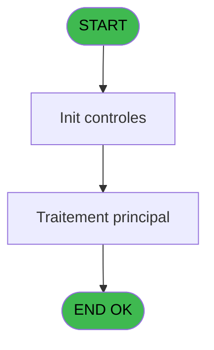
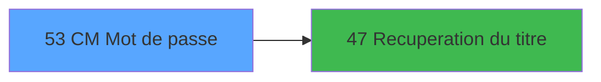

# MAI IDE 53 - CM  Mot de passe

> **Analyse**: Phases 1-4 2026-02-03 14:56 -> 14:56 (10s) | Assemblage 14:56
> **Pipeline**: V7.2 Enrichi
> **Structure**: 4 onglets (Resume | Ecrans | Donnees | Connexions)

<!-- TAB:Resume -->

## 1. FICHE D'IDENTITE

| Attribut | Valeur |
|----------|--------|
| Projet | MAI |
| IDE Position | 53 |
| Nom Programme | CM  Mot de passe |
| Fichier source | `Prg_53.xml` |
| Dossier IDE | Parametre |
| Taches | 1 (1 ecrans visibles) |
| Tables modifiees | 0 |
| Programmes appeles | 1 |

## 2. DESCRIPTION FONCTIONNELLE

**CM  Mot de passe** assure la gestion complete de ce processus, accessible depuis [Menu parametrage PME (IDE 64)](MAI-IDE-64.md).

Le flux de traitement s'organise en **1 blocs fonctionnels** :

- **Traitement** (1 tache) : traitements metier divers

**Logique metier** : 1 regles identifiees couvrant conditions metier.

## 3. BLOCS FONCTIONNELS

### 3.1 Traitement (1 tache)

Traitements internes.

---

#### 53 - CM Mot de passe [[ECRAN]](#ecran-t1)

**Role** : Traitement : CM Mot de passe.
**Ecran** : 541 x 106 DLU (MDI) | [Voir mockup](#ecran-t1)
**Delegue a** : [Recuperation du titre (IDE 47)](MAI-IDE-47.md)

## 5. REGLES METIER

1 regles identifiees:

### Autres (1 regles)

#### [RM-001] Si W0 Code secret [O]=W0 Clef [P] alors 'O' sinon '')

| Element | Detail |
|---------|--------|
| **Condition** | `W0 Code secret [O]=W0 Clef [P]` |
| **Si vrai** | 'O' |
| **Si faux** | '') |
| **Variables** | O (W0 Code secret), P (W0 Clef) |
| **Expression source** | Expression 22 : `IF (W0 Code secret [O]=W0 Clef [P],'O','')` |
| **Exemple** | Si W0 Code secret [O]=W0 Clef [P] → 'O'. Sinon → '') |

## 6. CONTEXTE

- **Appele par**: [Menu parametrage PME (IDE 64)](MAI-IDE-64.md)
- **Appelle**: 1 programmes | **Tables**: 0 (W:0 R:0 L:0) | **Taches**: 1 | **Expressions**: 22

<!-- TAB:Ecrans -->

## 8. ECRANS

### 8.1 Forms visibles (1 / 1)

| # | Position | Tache | Nom | Type | Largeur | Hauteur | Bloc |
|---|----------|-------|-----|------|---------|---------|------|
| 1 | 53 | 53 | CM Mot de passe | MDI | 541 | 106 | Traitement |

### 8.2 Mockups Ecrans

---

#### 53 - CM Mot de passe
**Tache** : [53](#t1) | **Type** : MDI | **Dimensions** : 541 x 106 DLU
**Bloc** : Traitement | **Titre IDE** : CM Mot de passe

<!-- FORM-DATA:
{
    "width":  541,
    "vFactor":  8,
    "type":  "MDI",
    "hFactor":  8,
    "controls":  [
                     {
                         "x":  0,
                         "type":  "label",
                         "var":  "",
                         "y":  0,
                         "w":  541,
                         "fmt":  "",
                         "name":  "",
                         "h":  18,
                         "color":  "",
                         "text":  "",
                         "parent":  null
                     },
                     {
                         "x":  0,
                         "type":  "label",
                         "var":  "",
                         "y":  23,
                         "w":  538,
                         "fmt":  "",
                         "name":  "",
                         "h":  41,
                         "color":  "",
                         "text":  "",
                         "parent":  null
                     },
                     {
                         "x":  186,
                         "type":  "label",
                         "var":  "",
                         "y":  31,
                         "w":  67,
                         "fmt":  "",
                         "name":  "",
                         "h":  8,
                         "color":  "7",
                         "text":  "Code",
                         "parent":  null
                     },
                     {
                         "x":  186,
                         "type":  "label",
                         "var":  "",
                         "y":  47,
                         "w":  56,
                         "fmt":  "",
                         "name":  "",
                         "h":  8,
                         "color":  "7",
                         "text":  "Clef",
                         "parent":  null
                     },
                     {
                         "x":  2,
                         "type":  "label",
                         "var":  "",
                         "y":  81,
                         "w":  537,
                         "fmt":  "",
                         "name":  "",
                         "h":  24,
                         "color":  "",
                         "text":  "",
                         "parent":  null
                     },
                     {
                         "x":  272,
                         "type":  "edit",
                         "var":  "",
                         "y":  29,
                         "w":  82,
                         "fmt":  "",
                         "name":  "",
                         "h":  10,
                         "color":  "",
                         "text":  "",
                         "parent":  4
                     },
                     {
                         "x":  75,
                         "type":  "edit",
                         "var":  "",
                         "y":  68,
                         "w":  82,
                         "fmt":  "",
                         "name":  "W0 Code secret",
                         "h":  10,
                         "color":  "6",
                         "text":  "",
                         "parent":  null
                     },
                     {
                         "x":  272,
                         "type":  "edit",
                         "var":  "",
                         "y":  47,
                         "w":  78,
                         "fmt":  "",
                         "name":  "W0 Clef",
                         "h":  9,
                         "color":  "6",
                         "text":  "",
                         "parent":  null
                     },
                     {
                         "x":  6,
                         "type":  "edit",
                         "var":  "",
                         "y":  4,
                         "w":  267,
                         "fmt":  "20",
                         "name":  "",
                         "h":  8,
                         "color":  "",
                         "text":  "",
                         "parent":  1
                     },
                     {
                         "x":  316,
                         "type":  "edit",
                         "var":  "",
                         "y":  4,
                         "w":  216,
                         "fmt":  "WWW DD MMM YYYYT",
                         "name":  "",
                         "h":  8,
                         "color":  "",
                         "text":  "",
                         "parent":  1
                     },
                     {
                         "x":  17,
                         "type":  "image",
                         "var":  "",
                         "y":  28,
                         "w":  80,
                         "fmt":  "",
                         "name":  "",
                         "h":  31,
                         "color":  "",
                         "text":  "",
                         "parent":  4
                     },
                     {
                         "x":  440,
                         "type":  "image",
                         "var":  "",
                         "y":  28,
                         "w":  80,
                         "fmt":  "",
                         "name":  "",
                         "h":  31,
                         "color":  "",
                         "text":  "",
                         "parent":  null
                     },
                     {
                         "x":  10,
                         "type":  "button",
                         "var":  "",
                         "y":  84,
                         "w":  168,
                         "fmt":  "\u0026Ok",
                         "name":  "",
                         "h":  18,
                         "color":  "",
                         "text":  "",
                         "parent":  null
                     }
                 ],
    "taskId":  "53",
    "height":  106
}
-->

<strong>Champs : 5 champs</strong>

| Pos (x,y) | Nom | Variable | Type |
|-----------|-----|----------|------|
| 272,29 | (sans nom) | - | edit |
| 75,68 | W0 Code secret | - | edit |
| 272,47 | W0 Clef | - | edit |
| 6,4 | 20 | - | edit |
| 316,4 | WWW DD MMM YYYYT | - | edit |

<strong>Boutons : 1 boutons</strong>

| Bouton | Pos (x,y) | Action |
|--------|-----------|--------|
| Ok | 10,84 | Valide la saisie et enregistre |

## 9. NAVIGATION

Ecran unique: **CM Mot de passe**

### 9.3 Structure hierarchique (1 tache)

| Position | Tache | Type | Dimensions | Bloc |
|----------|-------|------|------------|------|
| **53.1** | [**CM Mot de passe** (53)](#t1) [mockup](#ecran-t1) | MDI | 541x106 | Traitement |

### 9.4 Algorigramme

> **Legende**: Vert = START/END OK | Rouge = END KO | Bleu = Decisions
> *Algorigramme auto-genere. Utiliser `/algorigramme` pour une synthese metier detaillee.*

<!-- TAB:Donnees -->

## 10. TABLES

### Tables utilisees (0)

| ID | Nom | Description | Type | R | W | L | Usages |
|----|-----|-------------|------|---|---|---|--------|

### Colonnes par table (0 / 0 tables avec colonnes identifiees)

## 11. VARIABLES

### 11.1 Parametres entrants (1)

Variables recues du programme appelant ([Menu parametrage PME (IDE 64)](MAI-IDE-64.md)).

| Lettre | Nom | Type | Usage dans |
|--------|-----|------|-----------|
| A | P0 Acces OK ? | Alpha | - |

### 11.2 Variables de session (2)

Variables persistantes pendant toute la session.

| Lettre | Nom | Type | Usage dans |
|--------|-----|------|-----------|
| B | v. identifiant | Numeric | - |
| Q | v. titre ecran | Alpha | 1x session |

### 11.3 Variables de travail (14)

Variables internes au programme.

| Lettre | Nom | Type | Usage dans |
|--------|-----|------|-----------|
| C | W0 fin tache | Alpha | 1x calcul interne |
| D | W0 Secondes | Numeric | 3x calcul interne |
| E | W0 Heures | Numeric | 3x calcul interne |
| F | W0 Jour | Numeric | 3x calcul interne |
| G | W0 Mois | Numeric | 3x calcul interne |
| H | W0 Annee | Numeric | 2x calcul interne |
| I | W0 Code1 | Alpha | 1x calcul interne |
| J | W0 Code2 | Alpha | 1x calcul interne |
| K | W0 Code3 | Alpha | 1x calcul interne |
| L | W0 Decodage1 | Alpha | 1x calcul interne |
| M | W0 Decodage2 | Alpha | 1x calcul interne |
| N | W0 Decodage3 | Alpha | 1x calcul interne |
| O | W0 Code secret | Alpha | 1x calcul interne |
| P | W0 Clef | Alpha | 1x calcul interne |

Toutes les 17 variables (liste complete)

| Cat | Lettre | Nom Variable | Type |
|-----|--------|--------------|------|
| P0 | **A** | P0 Acces OK ? | Alpha |
| W0 | **C** | W0 fin tache | Alpha |
| W0 | **D** | W0 Secondes | Numeric |
| W0 | **E** | W0 Heures | Numeric |
| W0 | **F** | W0 Jour | Numeric |
| W0 | **G** | W0 Mois | Numeric |
| W0 | **H** | W0 Annee | Numeric |
| W0 | **I** | W0 Code1 | Alpha |
| W0 | **J** | W0 Code2 | Alpha |
| W0 | **K** | W0 Code3 | Alpha |
| W0 | **L** | W0 Decodage1 | Alpha |
| W0 | **M** | W0 Decodage2 | Alpha |
| W0 | **N** | W0 Decodage3 | Alpha |
| W0 | **O** | W0 Code secret | Alpha |
| W0 | **P** | W0 Clef | Alpha |
| V. | **B** | v. identifiant | Numeric |
| V. | **Q** | v. titre ecran | Alpha |

## 12. EXPRESSIONS

**22 / 22 expressions decodees (100%)**

### 12.1 Repartition par type

| Type | Expressions | Regles |
|------|-------------|--------|
| CALCULATION | 7 | 0 |
| CONDITION | 2 | 5 |
| CONSTANTE | 3 | 0 |
| DATE | 4 | 0 |
| REFERENCE_VG | 2 | 0 |
| OTHER | 2 | 0 |
| CONCATENATION | 1 | 0 |
| STRING | 1 | 0 |

### 12.2 Expressions cles par type

#### CALCULATION (7 expressions)

| Type | IDE | Expression | Regle |
|------|-----|------------|-------|
| CALCULATION | 16 | `Str (W0 Annee [H]-W0 Heures [E]-W0 Jour [F],'##P0')` | - |
| CALCULATION | 17 | `Str (W0 Jour [F]+W0 Mois [G]*2,'##P0')` | - |
| CALCULATION | 19 | `Val (W0 Code1 [I],'##')*10000+Val (W0 Code2 [J],'##')*100+Val (W0 Code3 [K],'##')` | - |
| CALCULATION | 15 | `Str (W0 Mois [G]+W0 Secondes [D]+W0 Heures [E],'##P0')` | - |
| CALCULATION | 12 | `Str (W0 Mois [G]+W0 Secondes [D],'##P0')` | - |
| ... | | *+2 autres* | |

#### CONDITION (2 expressions)

| Type | IDE | Expression | Regle |
|------|-----|------------|-------|
| CONDITION | 22 | `IF (W0 Code secret [O]=W0 Clef [P],'O','')` | [RM-001](#rm-RM-001) |
| CONDITION | 21 | `W0 fin tache [C]='F'` | - |

#### CONSTANTE (3 expressions)

| Type | IDE | Expression | Regle |
|------|-----|------------|-------|
| CONSTANTE | 20 | `'F'` | - |
| CONSTANTE | 6 | `''` | - |
| CONSTANTE | 3 | `1` | - |

#### DATE (4 expressions)

| Type | IDE | Expression | Regle |
|------|-----|------------|-------|
| DATE | 10 | `Month (Date ())` | - |
| DATE | 11 | `Year (Date ())-1900` | - |
| DATE | 4 | `Date ()` | - |
| DATE | 9 | `Day (Date ())` | - |

#### REFERENCE_VG (2 expressions)

| Type | IDE | Expression | Regle |
|------|-----|------------|-------|
| REFERENCE_VG | 5 | `VG2` | - |
| REFERENCE_VG | 1 | `VG3` | - |

#### OTHER (2 expressions)

| Type | IDE | Expression | Regle |
|------|-----|------------|-------|
| OTHER | 8 | `Hour (Time ())` | - |
| OTHER | 7 | `Second (Time ())` | - |

#### CONCATENATION (1 expressions)

| Type | IDE | Expression | Regle |
|------|-----|------------|-------|
| CONCATENATION | 18 | `W0 Decodage1 [L]&W0 Decodage2 [M]&W0 Decodage3 [N]` | - |

#### STRING (1 expressions)

| Type | IDE | Expression | Regle |
|------|-----|------------|-------|
| STRING | 2 | `Trim (v. titre ecran [Q])` | - |

### 12.3 Toutes les expressions (22)

Voir les 22 expressions

#### CALCULATION (7)

| IDE | Expression Decodee |
|-----|-------------------|
| 12 | `Str (W0 Mois [G]+W0 Secondes [D],'##P0')` |
| 13 | `Str (W0 Annee [H]-W0 Heures [E],'##P0')` |
| 14 | `Str (W0 Secondes [D]+W0 Jour [F],'##P0')` |
| 15 | `Str (W0 Mois [G]+W0 Secondes [D]+W0 Heures [E],'##P0')` |
| 16 | `Str (W0 Annee [H]-W0 Heures [E]-W0 Jour [F],'##P0')` |
| 17 | `Str (W0 Jour [F]+W0 Mois [G]*2,'##P0')` |
| 19 | `Val (W0 Code1 [I],'##')*10000+Val (W0 Code2 [J],'##')*100+Val (W0 Code3 [K],'##')` |

#### CONDITION (2)

| IDE | Expression Decodee |
|-----|-------------------|
| 22 | `IF (W0 Code secret [O]=W0 Clef [P],'O','')` |
| 21 | `W0 fin tache [C]='F'` |

#### CONSTANTE (3)

| IDE | Expression Decodee |
|-----|-------------------|
| 3 | `1` |
| 6 | `''` |
| 20 | `'F'` |

#### DATE (4)

| IDE | Expression Decodee |
|-----|-------------------|
| 4 | `Date ()` |
| 9 | `Day (Date ())` |
| 10 | `Month (Date ())` |
| 11 | `Year (Date ())-1900` |

#### REFERENCE_VG (2)

| IDE | Expression Decodee |
|-----|-------------------|
| 1 | `VG3` |
| 5 | `VG2` |

#### OTHER (2)

| IDE | Expression Decodee |
|-----|-------------------|
| 7 | `Second (Time ())` |
| 8 | `Hour (Time ())` |

#### CONCATENATION (1)

| IDE | Expression Decodee |
|-----|-------------------|
| 18 | `W0 Decodage1 [L]&W0 Decodage2 [M]&W0 Decodage3 [N]` |

#### STRING (1)

| IDE | Expression Decodee |
|-----|-------------------|
| 2 | `Trim (v. titre ecran [Q])` |

<!-- TAB:Connexions -->

## 13. GRAPHE D'APPELS

### 13.1 Chaine depuis Main (Callers)

Main -> ... -> [Menu parametrage PME (IDE 64)](MAI-IDE-64.md) -> **CM  Mot de passe (IDE 53)**

### 13.2 Callers

| IDE | Nom Programme | Nb Appels |
|-----|---------------|-----------|
| [64](MAI-IDE-64.md) | Menu parametrage PME | 1 |

### 13.3 Callees (programmes appeles)

### 13.4 Detail Callees avec contexte

| IDE | Nom Programme | Appels | Contexte |
|-----|---------------|--------|----------|
| [47](MAI-IDE-47.md) | Recuperation du titre | 1 | Recuperation donnees |

## 14. RECOMMANDATIONS MIGRATION

### 14.1 Profil du programme

| Metrique | Valeur | Impact migration |
|----------|--------|-----------------|
| Lignes de logique | 46 | Programme compact |
| Expressions | 22 | Peu de logique |
| Tables WRITE | 0 | Impact faible |
| Sous-programmes | 1 | Peu de dependances |
| Ecrans visibles | 1 | Ecran unique ou traitement batch |
| Code desactive | 0% (0 / 46) | Code sain |
| Regles metier | 1 | Quelques regles a preserver |

### 14.2 Plan de migration par bloc

#### Traitement (1 tache: 1 ecran, 0 traitement)

- **Strategie** : 1 composant(s) UI (Razor/React) avec formulaires et validation.
- 1 sous-programme(s) a migrer ou a reutiliser depuis les services existants.
- Decomposer les taches en services unitaires testables.

### 14.3 Dependances critiques

| Dependance | Type | Appels | Impact |
|------------|------|--------|--------|
| [Recuperation du titre (IDE 47)](MAI-IDE-47.md) | Sous-programme | 1x | Normale - Recuperation donnees |

---
*Spec DETAILED generee par Pipeline V7.2 - 2026-02-03 14:56*
