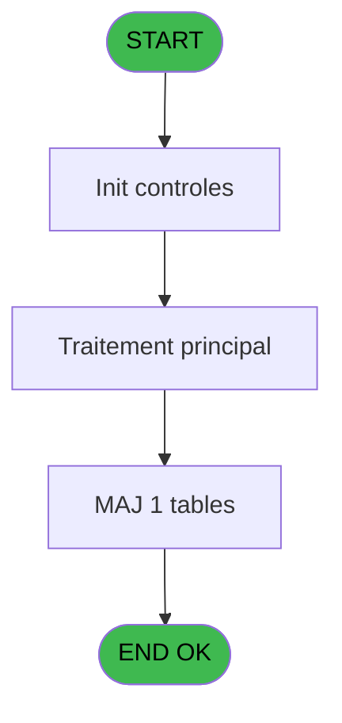

# MAI IDE 54 - Paramètres de restructuration

> **Analyse**: Phases 1-4 2026-02-03 14:56 -> 14:57 (10s) | Assemblage 14:57
> **Pipeline**: V7.2 Enrichi
> **Structure**: 4 onglets (Resume | Ecrans | Donnees | Connexions)

<!-- TAB:Resume -->

## 1. FICHE D'IDENTITE

| Attribut | Valeur |
|----------|--------|
| Projet | MAI |
| IDE Position | 54 |
| Nom Programme | Paramètres de restructuration |
| Fichier source | `Prg_54.xml` |
| Dossier IDE | Parametre |
| Taches | 3 (1 ecrans visibles) |
| Tables modifiees | 1 |
| Programmes appeles | 1 |

## 2. DESCRIPTION FONCTIONNELLE

**Paramètres de restructuration** assure la gestion complete de ce processus, accessible depuis [CM  Menu parametrage caisse (IDE 52)](MAI-IDE-52.md).

Le flux de traitement s'organise en **1 blocs fonctionnels** :

- **Traitement** (3 taches) : traitements metier divers

**Donnees modifiees** : 1 tables en ecriture (param_restruct___pre).

## 3. BLOCS FONCTIONNELS

### 3.1 Traitement (3 taches)

Traitements internes.

---

#### 54 - Paramètres de restructuration [[ECRAN]](#ecran-t1)

**Role** : Traitement : Paramètres de restructuration.
**Ecran** : 554 x 92 DLU (MDI) | [Voir mockup](#ecran-t1)
**Delegue a** : [Recuperation du titre (IDE 47)](MAI-IDE-47.md)

---

#### 54.1 - Affectation des Virtuelles

**Role** : Traitement : Affectation des Virtuelles.
**Delegue a** : [Recuperation du titre (IDE 47)](MAI-IDE-47.md)

---

#### 54.2 - Mise à Jour

**Role** : Traitement : Mise à Jour.
**Variables liees** : B (W1 Nb jour)
**Delegue a** : [Recuperation du titre (IDE 47)](MAI-IDE-47.md)

## 5. REGLES METIER

*(Aucune regle metier identifiee)*

## 6. CONTEXTE

- **Appele par**: [CM  Menu parametrage caisse (IDE 52)](MAI-IDE-52.md)
- **Appelle**: 1 programmes | **Tables**: 1 (W:1 R:1 L:0) | **Taches**: 3 | **Expressions**: 5

<!-- TAB:Ecrans -->

## 8. ECRANS

### 8.1 Forms visibles (1 / 3)

| # | Position | Tache | Nom | Type | Largeur | Hauteur | Bloc |
|---|----------|-------|-----|------|---------|---------|------|
| 1 | 54 | 54 | Paramètres de restructuration | MDI | 554 | 92 | Traitement |

### 8.2 Mockups Ecrans

---

#### 54 - Paramètres de restructuration
**Tache** : [54](#t1) | **Type** : MDI | **Dimensions** : 554 x 92 DLU
**Bloc** : Traitement | **Titre IDE** : Paramètres de restructuration

<!-- FORM-DATA:
{
    "width":  554,
    "vFactor":  8,
    "type":  "MDI",
    "hFactor":  8,
    "controls":  [
                     {
                         "x":  0,
                         "type":  "label",
                         "var":  "",
                         "y":  1,
                         "w":  551,
                         "fmt":  "",
                         "name":  "",
                         "h":  18,
                         "color":  "",
                         "text":  "",
                         "parent":  null
                     },
                     {
                         "x":  0,
                         "type":  "label",
                         "var":  "",
                         "y":  21,
                         "w":  551,
                         "fmt":  "",
                         "name":  "",
                         "h":  39,
                         "color":  "",
                         "text":  "",
                         "parent":  null
                     },
                     {
                         "x":  165,
                         "type":  "label",
                         "var":  "",
                         "y":  34,
                         "w":  229,
                         "fmt":  "",
                         "name":  "",
                         "h":  10,
                         "color":  "",
                         "text":  "Restauration Fichiers tous les",
                         "parent":  null
                     },
                     {
                         "x":  467,
                         "type":  "label",
                         "var":  "",
                         "y":  35,
                         "w":  43,
                         "fmt":  "",
                         "name":  "",
                         "h":  10,
                         "color":  "",
                         "text":  "jours",
                         "parent":  null
                     },
                     {
                         "x":  2,
                         "type":  "label",
                         "var":  "",
                         "y":  68,
                         "w":  550,
                         "fmt":  "",
                         "name":  "",
                         "h":  24,
                         "color":  "",
                         "text":  "",
                         "parent":  null
                     },
                     {
                         "x":  403,
                         "type":  "edit",
                         "var":  "",
                         "y":  35,
                         "w":  48,
                         "fmt":  "",
                         "name":  "W1 Nb jour",
                         "h":  10,
                         "color":  "6",
                         "text":  "",
                         "parent":  null
                     },
                     {
                         "x":  10,
                         "type":  "button",
                         "var":  "",
                         "y":  71,
                         "w":  168,
                         "fmt":  "\u0026Ok",
                         "name":  "Bouton Ok",
                         "h":  18,
                         "color":  "",
                         "text":  "",
                         "parent":  null
                     },
                     {
                         "x":  278,
                         "type":  "edit",
                         "var":  "",
                         "y":  4,
                         "w":  268,
                         "fmt":  "WWW DD MMM YYYYT",
                         "name":  "",
                         "h":  8,
                         "color":  "",
                         "text":  "",
                         "parent":  1
                     },
                     {
                         "x":  6,
                         "type":  "edit",
                         "var":  "",
                         "y":  5,
                         "w":  267,
                         "fmt":  "20",
                         "name":  "",
                         "h":  8,
                         "color":  "",
                         "text":  "",
                         "parent":  1
                     },
                     {
                         "x":  28,
                         "type":  "image",
                         "var":  "",
                         "y":  22,
                         "w":  101,
                         "fmt":  "",
                         "name":  "",
                         "h":  35,
                         "color":  "",
                         "text":  "",
                         "parent":  null
                     },
                     {
                         "x":  187,
                         "type":  "button",
                         "var":  "",
                         "y":  71,
                         "w":  168,
                         "fmt":  "A\u0026bandonner",
                         "name":  "",
                         "h":  18,
                         "color":  "",
                         "text":  "",
                         "parent":  null
                     }
                 ],
    "taskId":  "54",
    "height":  92
}
-->

<strong>Champs : 3 champs</strong>

| Pos (x,y) | Nom | Variable | Type |
|-----------|-----|----------|------|
| 403,35 | W1 Nb jour | - | edit |
| 278,4 | WWW DD MMM YYYYT | - | edit |
| 6,5 | 20 | - | edit |

<strong>Boutons : 2 boutons</strong>

| Bouton | Pos (x,y) | Action |
|--------|-----------|--------|
| Ok | 10,71 | Valide la saisie et enregistre |
| Abandonner | 187,71 | Annule et retour au menu |

## 9. NAVIGATION

Ecran unique: **Paramètres de restructuration**

### 9.3 Structure hierarchique (3 taches)

| Position | Tache | Type | Dimensions | Bloc |
|----------|-------|------|------------|------|
| **54.1** | [**Paramètres de restructuration** (54)](#t1) [mockup](#ecran-t1) | MDI | 554x92 | Traitement |
| 54.1.1 | [Affectation des Virtuelles (54.1)](#t2) | MDI | - | |
| 54.1.2 | [Mise à Jour (54.2)](#t4) | MDI | - | |

### 9.4 Algorigramme

> **Legende**: Vert = START/END OK | Rouge = END KO | Bleu = Decisions
> *Algorigramme auto-genere. Utiliser `/algorigramme` pour une synthese metier detaillee.*

<!-- TAB:Donnees -->

## 10. TABLES

### Tables utilisees (1)

| ID | Nom | Description | Type | R | W | L | Usages |
|----|-----|-------------|------|---|---|---|--------|
| 83 | param_restruct___pre |  | DB | R | **W** |   | 2 |

### Colonnes par table (0 / 1 tables avec colonnes identifiees)

Table 83 - param_restruct___pre (R/**W**) - 2 usages

*Table utilisee uniquement en Link ou aucune colonne Real identifiee dans le DataView.*

## 11. VARIABLES

### 11.1 Variables de session (1)

Variables persistantes pendant toute la session.

| Lettre | Nom | Type | Usage dans |
|--------|-----|------|-----------|
| A | v. titre ecran | Alpha | 1x session |

### 11.2 Autres (3)

Variables diverses.

| Lettre | Nom | Type | Usage dans |
|--------|-----|------|-----------|
| B | W1 Nb jour | Numeric | - |
| C | W1 Validation | Numeric | 1x refs |
| D | Bouton Ok | Alpha | - |

## 12. EXPRESSIONS

**5 / 5 expressions decodees (100%)**

### 12.1 Repartition par type

| Type | Expressions | Regles |
|------|-------------|--------|
| CONSTANTE | 1 | 0 |
| DATE | 1 | 0 |
| REFERENCE_VG | 1 | 0 |
| CONDITION | 1 | 0 |
| STRING | 1 | 0 |

### 12.2 Expressions cles par type

#### CONSTANTE (1 expressions)

| Type | IDE | Expression | Regle |
|------|-----|------------|-------|
| CONSTANTE | 1 | `2` | - |

#### DATE (1 expressions)

| Type | IDE | Expression | Regle |
|------|-----|------------|-------|
| DATE | 3 | `Date ()` | - |

#### REFERENCE_VG (1 expressions)

| Type | IDE | Expression | Regle |
|------|-----|------------|-------|
| REFERENCE_VG | 4 | `VG2` | - |

#### CONDITION (1 expressions)

| Type | IDE | Expression | Regle |
|------|-----|------------|-------|
| CONDITION | 5 | `W1 Validation [C]=6` | - |

#### STRING (1 expressions)

| Type | IDE | Expression | Regle |
|------|-----|------------|-------|
| STRING | 2 | `Trim (v. titre ecran [A])` | - |

<!-- TAB:Connexions -->

## 13. GRAPHE D'APPELS

### 13.1 Chaine depuis Main (Callers)

Main -> ... -> [CM  Menu parametrage caisse (IDE 52)](MAI-IDE-52.md) -> **Paramètres de restructuration (IDE 54)**

### 13.2 Callers

| IDE | Nom Programme | Nb Appels |
|-----|---------------|-----------|
| [52](MAI-IDE-52.md) | CM  Menu parametrage caisse | 1 |

### 13.3 Callees (programmes appeles)

### 13.4 Detail Callees avec contexte

| IDE | Nom Programme | Appels | Contexte |
|-----|---------------|--------|----------|
| [47](MAI-IDE-47.md) | Recuperation du titre | 1 | Recuperation donnees |

## 14. RECOMMANDATIONS MIGRATION

### 14.1 Profil du programme

| Metrique | Valeur | Impact migration |
|----------|--------|-----------------|
| Lignes de logique | 28 | Programme compact |
| Expressions | 5 | Peu de logique |
| Tables WRITE | 1 | Impact faible |
| Sous-programmes | 1 | Peu de dependances |
| Ecrans visibles | 1 | Ecran unique ou traitement batch |
| Code desactive | 0% (0 / 28) | Code sain |
| Regles metier | 0 | Pas de regle identifiee |

### 14.2 Plan de migration par bloc

#### Traitement (3 taches: 1 ecran, 2 traitements)

- **Strategie** : Orchestrateur avec 1 ecrans (Razor/React) et 2 traitements backend (services).
- Les ecrans deviennent des composants UI, les traitements invisibles deviennent des services injectables.
- 1 sous-programme(s) a migrer ou a reutiliser depuis les services existants.
- Decomposer les taches en services unitaires testables.

### 14.3 Dependances critiques

| Dependance | Type | Appels | Impact |
|------------|------|--------|--------|
| param_restruct___pre | Table WRITE (Database) | 1x | Schema + repository |
| [Recuperation du titre (IDE 47)](MAI-IDE-47.md) | Sous-programme | 1x | Normale - Recuperation donnees |

---
*Spec DETAILED generee par Pipeline V7.2 - 2026-02-03 14:57*
