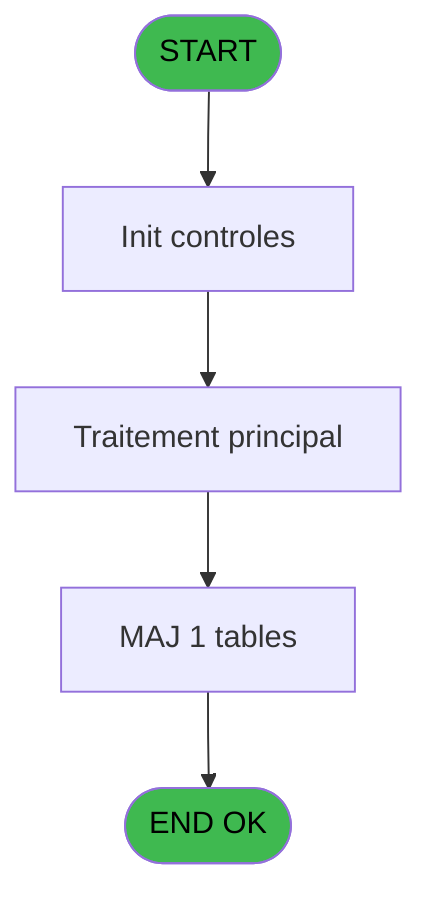
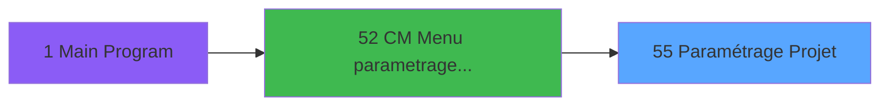
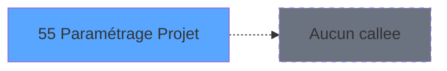

# MAI IDE 55 - Paramétrage Projet

> **Analyse**: Phases 1-4 2026-02-03 14:57 -> 14:57 (10s) | Assemblage 14:57
> **Pipeline**: V7.2 Enrichi
> **Structure**: 4 onglets (Resume | Ecrans | Donnees | Connexions)

<!-- TAB:Resume -->

## 1. FICHE D'IDENTITE

| Attribut | Valeur |
|----------|--------|
| Projet | MAI |
| IDE Position | 55 |
| Nom Programme | Paramétrage Projet |
| Fichier source | `Prg_55.xml` |
| Dossier IDE | PME |
| Taches | 1 (1 ecrans visibles) |
| Tables modifiees | 1 |
| Programmes appeles | 0 |

## 2. DESCRIPTION FONCTIONNELLE

**Paramétrage Projet** assure la gestion complete de ce processus, accessible depuis [CM  Menu parametrage caisse (IDE 52)](MAI-IDE-52.md).

Le flux de traitement s'organise en **1 blocs fonctionnels** :

- **Traitement** (1 tache) : traitements metier divers

**Donnees modifiees** : 1 tables en ecriture (motif_no_enreg_na).

**Logique metier** : 1 regles identifiees couvrant conditions metier.

## 3. BLOCS FONCTIONNELS

### 3.1 Traitement (1 tache)

Traitements internes.

---

#### 55 - Paramétrage Projet [[ECRAN]](#ecran-t1)

**Role** : Traitement : Paramétrage Projet.
**Ecran** : 1198 x 322 DLU | [Voir mockup](#ecran-t1)

## 5. REGLES METIER

1 regles identifiees:

### Autres (1 regles)

#### [RM-001] Si [C] alors 204 sinon 200)

| Element | Detail |
|---------|--------|
| **Condition** | `[C]` |
| **Si vrai** | 204 |
| **Si faux** | 200) |
| **Expression source** | Expression 8 : `IF([C],204,200)` |
| **Exemple** | Si [C] → 204. Sinon → 200) |

## 6. CONTEXTE

- **Appele par**: [CM  Menu parametrage caisse (IDE 52)](MAI-IDE-52.md)
- **Appelle**: 0 programmes | **Tables**: 1 (W:1 R:0 L:0) | **Taches**: 1 | **Expressions**: 11

<!-- TAB:Ecrans -->

## 8. ECRANS

### 8.1 Forms visibles (1 / 1)

| # | Position | Tache | Nom | Type | Largeur | Hauteur | Bloc |
|---|----------|-------|-----|------|---------|---------|------|
| 1 | 55 | 55 | Paramétrage Projet | Type0 | 1198 | 322 | Traitement |

### 8.2 Mockups Ecrans

---

#### 55 - Paramétrage Projet
**Tache** : [55](#t1) | **Type** : Type0 | **Dimensions** : 1198 x 322 DLU
**Bloc** : Traitement | **Titre IDE** : Paramétrage Projet

<!-- FORM-DATA:
{
    "width":  1198,
    "vFactor":  8,
    "type":  "Type0",
    "hFactor":  8,
    "controls":  [
                     {
                         "x":  5,
                         "type":  "label",
                         "var":  "",
                         "y":  1,
                         "w":  1188,
                         "fmt":  "",
                         "name":  "",
                         "h":  19,
                         "color":  "",
                         "text":  "",
                         "parent":  null
                     },
                     {
                         "x":  4,
                         "type":  "table",
                         "var":  "",
                         "name":  "",
                         "titleH":  12,
                         "color":  "110",
                         "w":  1187,
                         "y":  29,
                         "fmt":  "",
                         "parent":  null,
                         "text":  "",
                         "rowH":  13,
                         "h":  179,
                         "cols":  [
                                      {
                                          "title":  "Code",
                                          "layer":  1,
                                          "w":  94
                                      },
                                      {
                                          "title":  "Version",
                                          "layer":  2,
                                          "w":  160
                                      },
                                      {
                                          "title":  "Libellé",
                                          "layer":  3,
                                          "w":  675
                                      },
                                      {
                                          "title":  "Actif",
                                          "layer":  4,
                                          "w":  85
                                      },
                                      {
                                          "title":  "Creation",
                                          "layer":  5,
                                          "w":  123
                                      }
                                  ],
                         "rows":  5
                     },
                     {
                         "x":  6,
                         "type":  "label",
                         "var":  "",
                         "y":  296,
                         "w":  1188,
                         "fmt":  "",
                         "name":  "",
                         "h":  24,
                         "color":  "",
                         "text":  "",
                         "parent":  null
                     },
                     {
                         "x":  6,
                         "type":  "label",
                         "var":  "",
                         "y":  213,
                         "w":  1188,
                         "fmt":  "",
                         "name":  "",
                         "h":  77,
                         "color":  "",
                         "text":  "Commentaire",
                         "parent":  null
                     },
                     {
                         "x":  15,
                         "type":  "edit",
                         "var":  "",
                         "y":  6,
                         "w":  267,
                         "fmt":  "20",
                         "name":  "",
                         "h":  8,
                         "color":  "",
                         "text":  "",
                         "parent":  1
                     },
                     {
                         "x":  818,
                         "type":  "edit",
                         "var":  "",
                         "y":  6,
                         "w":  365,
                         "fmt":  "WWW DD MMM YYYYT",
                         "name":  "",
                         "h":  8,
                         "color":  "",
                         "text":  "",
                         "parent":  1
                     },
                     {
                         "x":  11,
                         "type":  "edit",
                         "var":  "",
                         "y":  44,
                         "w":  40,
                         "fmt":  "",
                         "name":  "VER_Projet",
                         "h":  10,
                         "color":  "171",
                         "text":  "",
                         "parent":  4
                     },
                     {
                         "x":  104,
                         "type":  "edit",
                         "var":  "",
                         "y":  44,
                         "w":  169,
                         "fmt":  "",
                         "name":  "VER_Version",
                         "h":  10,
                         "color":  "171",
                         "text":  "",
                         "parent":  4
                     },
                     {
                         "x":  264,
                         "type":  "edit",
                         "var":  "",
                         "y":  44,
                         "w":  667,
                         "fmt":  "",
                         "name":  "VER_Libelle",
                         "h":  10,
                         "color":  "171",
                         "text":  "",
                         "parent":  4
                     },
                     {
                         "x":  966,
                         "type":  "checkbox",
                         "var":  "",
                         "y":  44,
                         "w":  19,
                         "fmt":  "",
                         "name":  "VER_Activation",
                         "h":  9,
                         "color":  "171",
                         "text":  "",
                         "parent":  4
                     },
                     {
                         "x":  1038,
                         "type":  "edit",
                         "var":  "",
                         "y":  44,
                         "w":  112,
                         "fmt":  "##/##/####Z",
                         "name":  "VER_Date_creation",
                         "h":  10,
                         "color":  "171",
                         "text":  "",
                         "parent":  4
                     },
                     {
                         "x":  16,
                         "type":  "edit",
                         "var":  "",
                         "y":  226,
                         "w":  1166,
                         "fmt":  "",
                         "name":  "VER_Commentaire",
                         "h":  60,
                         "color":  "118",
                         "text":  "",
                         "parent":  16
                     },
                     {
                         "x":  12,
                         "type":  "button",
                         "var":  "",
                         "y":  299,
                         "w":  154,
                         "fmt":  "\u0026Quitter",
                         "name":  "",
                         "h":  18,
                         "color":  "",
                         "text":  "",
                         "parent":  5
                     }
                 ],
    "taskId":  "55",
    "height":  322
}
-->

<strong>Champs : 8 champs</strong>

| Pos (x,y) | Nom | Variable | Type |
|-----------|-----|----------|------|
| 15,6 | 20 | - | edit |
| 818,6 | WWW DD MMM YYYYT | - | edit |
| 11,44 | VER_Projet | - | edit |
| 104,44 | VER_Version | - | edit |
| 264,44 | VER_Libelle | - | edit |
| 966,44 | VER_Activation | - | checkbox |
| 1038,44 | VER_Date_creation | - | edit |
| 16,226 | VER_Commentaire | - | edit |

<strong>Boutons : 1 boutons</strong>

| Bouton | Pos (x,y) | Action |
|--------|-----------|--------|
| Quitter | 12,299 | Quitte le programme |

## 9. NAVIGATION

Ecran unique: **Paramétrage Projet**

### 9.3 Structure hierarchique (1 tache)

| Position | Tache | Type | Dimensions | Bloc |
|----------|-------|------|------------|------|
| **55.1** | [**Paramétrage Projet** (55)](#t1) [mockup](#ecran-t1) | - | 1198x322 | Traitement |

### 9.4 Algorigramme

> **Legende**: Vert = START/END OK | Rouge = END KO | Bleu = Decisions
> *Algorigramme auto-genere. Utiliser `/algorigramme` pour une synthese metier detaillee.*

<!-- TAB:Donnees -->

## 10. TABLES

### Tables utilisees (1)

| ID | Nom | Description | Type | R | W | L | Usages |
|----|-----|-------------|------|---|---|---|--------|
| 768 | motif_no_enreg_na |  | DB |   | **W** |   | 1 |

### Colonnes par table (0 / 1 tables avec colonnes identifiees)

Table 768 - motif_no_enreg_na (**W**) - 1 usages

*Table utilisee uniquement en Link ou aucune colonne Real identifiee dans le DataView.*

## 11. VARIABLES

*(Programme sans variables locales mappees)*

## 12. EXPRESSIONS

**11 / 11 expressions decodees (100%)**

### 12.1 Repartition par type

| Type | Expressions | Regles |
|------|-------------|--------|
| CONDITION | 2 | 5 |
| CONSTANTE | 3 | 0 |
| DATE | 1 | 0 |
| REFERENCE_VG | 1 | 0 |
| OTHER | 1 | 0 |
| CAST_LOGIQUE | 1 | 0 |
| CONCATENATION | 2 | 0 |

### 12.2 Expressions cles par type

#### CONDITION (2 expressions)

| Type | IDE | Expression | Regle |
|------|-----|------------|-------|
| CONDITION | 8 | `IF([C],204,200)` | [RM-001](#rm-RM-001) |
| CONDITION | 7 | `[C]<>VarPrev('[C]'VAR)` | - |

#### CONSTANTE (3 expressions)

| Type | IDE | Expression | Regle |
|------|-----|------------|-------|
| CONSTANTE | 10 | `'OK'` | - |
| CONSTANTE | 4 | `'Project setting'` | - |
| CONSTANTE | 3 | `'PARAM'` | - |

#### DATE (1 expressions)

| Type | IDE | Expression | Regle |
|------|-----|------------|-------|
| DATE | 2 | `Date()` | - |

#### REFERENCE_VG (1 expressions)

| Type | IDE | Expression | Regle |
|------|-----|------------|-------|
| REFERENCE_VG | 1 | `VG2` | - |

#### OTHER (1 expressions)

| Type | IDE | Expression | Regle |
|------|-----|------------|-------|
| OTHER | 9 | `VG11 AND [F]` | - |

#### CAST_LOGIQUE (1 expressions)

| Type | IDE | Expression | Regle |
|------|-----|------------|-------|
| CAST_LOGIQUE | 11 | `INIPut('AllowUpdateInQuery=Y', 'FALSE'LOG)` | - |

#### CONCATENATION (2 expressions)

| Type | IDE | Expression | Regle |
|------|-----|------------|-------|
| CONCATENATION | 6 | `Trim([A])&'~'&Trim([B])&'~'&IF ([C],'Activated','Deactivated')` | - |
| CONCATENATION | 5 | `Trim([A])&' '&Trim([B])&' '&IF ([C],'Activated','Deactivated')` | - |

<!-- TAB:Connexions -->

## 13. GRAPHE D'APPELS

### 13.1 Chaine depuis Main (Callers)

Main -> ... -> [CM  Menu parametrage caisse (IDE 52)](MAI-IDE-52.md) -> **Paramétrage Projet (IDE 55)**

### 13.2 Callers

| IDE | Nom Programme | Nb Appels |
|-----|---------------|-----------|
| [52](MAI-IDE-52.md) | CM  Menu parametrage caisse | 1 |

### 13.3 Callees (programmes appeles)

### 13.4 Detail Callees avec contexte

| IDE | Nom Programme | Appels | Contexte |
|-----|---------------|--------|----------|
| - | (aucun) | - | - |

## 14. RECOMMANDATIONS MIGRATION

### 14.1 Profil du programme

| Metrique | Valeur | Impact migration |
|----------|--------|-----------------|
| Lignes de logique | 11 | Programme compact |
| Expressions | 11 | Peu de logique |
| Tables WRITE | 1 | Impact faible |
| Sous-programmes | 0 | Peu de dependances |
| Ecrans visibles | 1 | Ecran unique ou traitement batch |
| Code desactive | 0% (0 / 11) | Code sain |
| Regles metier | 1 | Quelques regles a preserver |

### 14.2 Plan de migration par bloc

#### Traitement (1 tache: 1 ecran, 0 traitement)

- **Strategie** : 1 composant(s) UI (Razor/React) avec formulaires et validation.
- Decomposer les taches en services unitaires testables.

### 14.3 Dependances critiques

| Dependance | Type | Appels | Impact |
|------------|------|--------|--------|
| motif_no_enreg_na | Table WRITE (Database) | 1x | Schema + repository |

---
*Spec DETAILED generee par Pipeline V7.2 - 2026-02-03 14:57*
