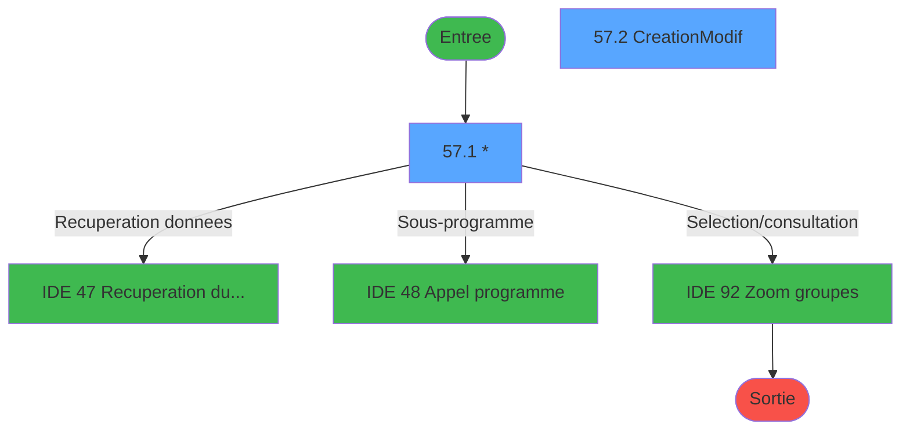
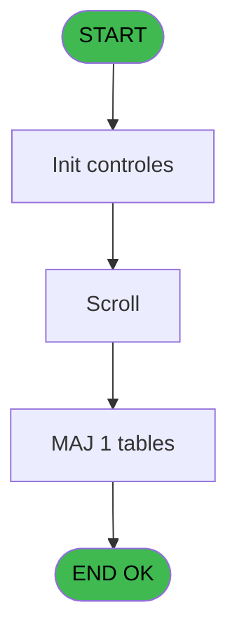
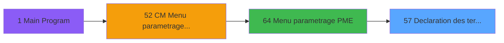
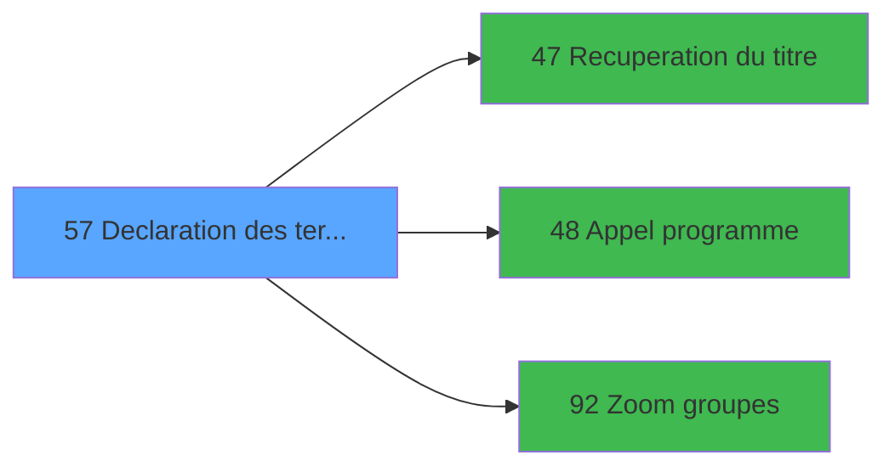

# MAI IDE 57 - Declaration des terminaux

> **Analyse**: Phases 1-4 2026-02-03 14:57 -> 14:57 (10s) | Assemblage 14:57
> **Pipeline**: V7.2 Enrichi
> **Structure**: 4 onglets (Resume | Ecrans | Donnees | Connexions)

<!-- TAB:Resume -->

## 1. FICHE D'IDENTITE

| Attribut | Valeur |
|----------|--------|
| Projet | MAI |
| IDE Position | 57 |
| Nom Programme | Declaration des terminaux |
| Fichier source | `Prg_57.xml` |
| Dossier IDE | PME |
| Taches | 6 (2 ecrans visibles) |
| Tables modifiees | 1 |
| Programmes appeles | 3 |

## 2. DESCRIPTION FONCTIONNELLE

**Declaration des terminaux** assure la gestion complete de ce processus, accessible depuis [Menu parametrage PME (IDE 64)](MAI-IDE-64.md).

Le flux de traitement s'organise en **2 blocs fonctionnels** :

- **Traitement** (4 taches) : traitements metier divers
- **Creation** (2 taches) : insertion d'enregistrements en base (mouvements, prestations)

**Donnees modifiees** : 1 tables en ecriture (terminaux_pme____tpm).

Detail : phases du traitement

#### Phase 1 : Traitement (4 taches)

- **57** - AC  Table des types d'ID **[[ECRAN]](#ecran-t1)**
- **57.1** - * **[[ECRAN]](#ecran-t2)**
- **57.3** - Confirmation suppression **[[ECRAN]](#ecran-t6)**
- **57.3.1** - Suppression

Delegue a : [Recuperation du titre (IDE 47)](MAI-IDE-47.md), [Appel programme (IDE 48)](MAI-IDE-48.md)

#### Phase 2 : Creation (2 taches)

- **57.2** - Creation/Modif **[[ECRAN]](#ecran-t3)**
- **57.2.1** - Creation

#### Tables impactees

| Table | Operations | Role metier |
|-------|-----------|-------------|
| terminaux_pme____tpm | R/**W** (4 usages) |  |

## 3. BLOCS FONCTIONNELS

### 3.1 Traitement (4 taches)

Traitements internes.

---

#### 57 - AC  Table des types d'ID [[ECRAN]](#ecran-t1)

**Role** : Traitement : AC  Table des types d'ID.
**Ecran** : 166 x 26 DLU (MDI) | [Voir mockup](#ecran-t1)

3 sous-taches directes

| Tache | Nom | Bloc |
|-------|-----|------|
| [57.1](#t2) | * **[[ECRAN]](#ecran-t2)** | Traitement |
| [57.3](#t6) | Confirmation suppression **[[ECRAN]](#ecran-t6)** | Traitement |
| [57.3.1](#t7) | Suppression | Traitement |

**Delegue a** : [Recuperation du titre (IDE 47)](MAI-IDE-47.md), [Appel programme (IDE 48)](MAI-IDE-48.md)

---

#### 57.1 - * [[ECRAN]](#ecran-t2)

**Role** : Traitement interne.
**Ecran** : 581 x 248 DLU (MDI) | [Voir mockup](#ecran-t2)

---

#### 57.3 - Confirmation suppression [[ECRAN]](#ecran-t6)

**Role** : Traitement : Confirmation suppression.
**Ecran** : 240 x 24 DLU (MDI) | [Voir mockup](#ecran-t6)
**Delegue a** : [Recuperation du titre (IDE 47)](MAI-IDE-47.md), [Appel programme (IDE 48)](MAI-IDE-48.md)

---

#### 57.3.1 - Suppression

**Role** : Traitement : Suppression.
**Delegue a** : [Recuperation du titre (IDE 47)](MAI-IDE-47.md), [Appel programme (IDE 48)](MAI-IDE-48.md)

### 3.2 Creation (2 taches)

Insertion de nouveaux enregistrements en base.

---

#### 57.2 - Creation/Modif [[ECRAN]](#ecran-t3)

**Role** : Creation d'enregistrement : Creation/Modif.
**Ecran** : 458 x 99 DLU (MDI) | [Voir mockup](#ecran-t3)

---

#### 57.2.1 - Creation

**Role** : Creation d'enregistrement : Creation.

## 5. REGLES METIER

*(Aucune regle metier identifiee)*

## 6. CONTEXTE

- **Appele par**: [Menu parametrage PME (IDE 64)](MAI-IDE-64.md)
- **Appelle**: 3 programmes | **Tables**: 2 (W:1 R:1 L:1) | **Taches**: 6 | **Expressions**: 5

<!-- TAB:Ecrans -->

## 8. ECRANS

### 8.1 Forms visibles (2 / 6)

| # | Position | Tache | Nom | Type | Largeur | Hauteur | Bloc |
|---|----------|-------|-----|------|---------|---------|------|
| 1 | 57.1 | 57.1 | * | MDI | 581 | 248 | Traitement |
| 2 | 57.2 | 57.2 | Creation/Modif | MDI | 458 | 99 | Creation |

### 8.2 Mockups Ecrans

---

#### 57.1 - *
**Tache** : [57.1](#t2) | **Type** : MDI | **Dimensions** : 581 x 248 DLU
**Bloc** : Traitement | **Titre IDE** : *

<!-- FORM-DATA:
{
    "width":  581,
    "vFactor":  8,
    "type":  "MDI",
    "hFactor":  8,
    "controls":  [
                     {
                         "x":  0,
                         "type":  "label",
                         "var":  "",
                         "y":  2,
                         "w":  581,
                         "fmt":  "",
                         "name":  "",
                         "h":  19,
                         "color":  "",
                         "text":  "",
                         "parent":  null
                     },
                     {
                         "x":  31,
                         "type":  "label",
                         "var":  "",
                         "y":  27,
                         "w":  519,
                         "fmt":  "",
                         "name":  "",
                         "h":  188,
                         "color":  "",
                         "text":  "",
                         "parent":  null
                     },
                     {
                         "x":  57,
                         "type":  "table",
                         "var":  "",
                         "name":  "",
                         "titleH":  12,
                         "color":  "110",
                         "w":  464,
                         "y":  34,
                         "fmt":  "",
                         "parent":  null,
                         "text":  "",
                         "rowH":  14,
                         "h":  98,
                         "cols":  [
                                      {
                                          "title":  "Numéro",
                                          "layer":  1,
                                          "w":  126
                                      },
                                      {
                                          "title":  "Libellé",
                                          "layer":  2,
                                          "w":  183
                                      },
                                      {
                                          "title":  "Groupe",
                                          "layer":  3,
                                          "w":  122
                                      }
                                  ],
                         "rows":  3
                     },
                     {
                         "x":  160,
                         "type":  "label",
                         "var":  "",
                         "y":  139,
                         "w":  257,
                         "fmt":  "",
                         "name":  "",
                         "h":  69,
                         "color":  "",
                         "text":  "",
                         "parent":  null
                     },
                     {
                         "x":  163,
                         "type":  "label",
                         "var":  "",
                         "y":  140,
                         "w":  253,
                         "fmt":  "",
                         "name":  "",
                         "h":  67,
                         "color":  "",
                         "text":  "",
                         "parent":  null
                     },
                     {
                         "x":  189,
                         "type":  "label",
                         "var":  "",
                         "y":  148,
                         "w":  202,
                         "fmt":  "",
                         "name":  "",
                         "h":  42,
                         "color":  "",
                         "text":  "",
                         "parent":  null
                     },
                     {
                         "x":  191,
                         "type":  "label",
                         "var":  "",
                         "y":  149,
                         "w":  45,
                         "fmt":  "",
                         "name":  "",
                         "h":  40,
                         "color":  "",
                         "text":  "",
                         "parent":  null
                     },
                     {
                         "x":  250,
                         "type":  "label",
                         "var":  "",
                         "y":  153,
                         "w":  99,
                         "fmt":  "",
                         "name":  "",
                         "h":  9,
                         "color":  "7",
                         "text":  "Creation",
                         "parent":  null
                     },
                     {
                         "x":  250,
                         "type":  "label",
                         "var":  "",
                         "y":  165,
                         "w":  131,
                         "fmt":  "",
                         "name":  "",
                         "h":  8,
                         "color":  "7",
                         "text":  "Modification",
                         "parent":  null
                     },
                     {
                         "x":  250,
                         "type":  "label",
                         "var":  "",
                         "y":  175,
                         "w":  131,
                         "fmt":  "",
                         "name":  "",
                         "h":  8,
                         "color":  "7",
                         "text":  "Suppression",
                         "parent":  null
                     },
                     {
                         "x":  213,
                         "type":  "label",
                         "var":  "",
                         "y":  193,
                         "w":  123,
                         "fmt":  "",
                         "name":  "",
                         "h":  10,
                         "color":  "",
                         "text":  "Votre choix",
                         "parent":  null
                     },
                     {
                         "x":  0,
                         "type":  "label",
                         "var":  "",
                         "y":  224,
                         "w":  580,
                         "fmt":  "",
                         "name":  "",
                         "h":  24,
                         "color":  "",
                         "text":  "",
                         "parent":  null
                     },
                     {
                         "x":  62,
                         "type":  "edit",
                         "var":  "",
                         "y":  49,
                         "w":  42,
                         "fmt":  "#3PO",
                         "name":  "",
                         "h":  8,
                         "color":  "110",
                         "text":  "",
                         "parent":  5
                     },
                     {
                         "x":  371,
                         "type":  "edit",
                         "var":  "",
                         "y":  49,
                         "w":  30,
                         "fmt":  "#2PO",
                         "name":  "",
                         "h":  8,
                         "color":  "110",
                         "text":  "",
                         "parent":  5
                     },
                     {
                         "x":  189,
                         "type":  "edit",
                         "var":  "",
                         "y":  49,
                         "w":  176,
                         "fmt":  "",
                         "name":  "",
                         "h":  8,
                         "color":  "110",
                         "text":  "",
                         "parent":  5
                     },
                     {
                         "x":  334,
                         "type":  "edit",
                         "var":  "",
                         "y":  193,
                         "w":  26,
                         "fmt":  "",
                         "name":  "W1 choix action",
                         "h":  10,
                         "color":  "6",
                         "text":  "",
                         "parent":  null
                     },
                     {
                         "x":  6,
                         "type":  "edit",
                         "var":  "",
                         "y":  6,
                         "w":  396,
                         "fmt":  "20",
                         "name":  "",
                         "h":  8,
                         "color":  "",
                         "text":  "",
                         "parent":  null
                     },
                     {
                         "x":  274,
                         "type":  "edit",
                         "var":  "",
                         "y":  7,
                         "w":  299,
                         "fmt":  "WWW DD MMM YYYYT",
                         "name":  "",
                         "h":  8,
                         "color":  "",
                         "text":  "",
                         "parent":  null
                     },
                     {
                         "x":  201,
                         "type":  "button",
                         "var":  "",
                         "y":  153,
                         "w":  26,
                         "fmt":  "C",
                         "name":  "C",
                         "h":  9,
                         "color":  "",
                         "text":  "",
                         "parent":  null
                     },
                     {
                         "x":  201,
                         "type":  "button",
                         "var":  "",
                         "y":  164,
                         "w":  26,
                         "fmt":  "M",
                         "name":  "M",
                         "h":  9,
                         "color":  "",
                         "text":  "",
                         "parent":  null
                     },
                     {
                         "x":  201,
                         "type":  "button",
                         "var":  "",
                         "y":  175,
                         "w":  26,
                         "fmt":  "S",
                         "name":  "S",
                         "h":  9,
                         "color":  "",
                         "text":  "",
                         "parent":  null
                     },
                     {
                         "x":  6,
                         "type":  "button",
                         "var":  "",
                         "y":  228,
                         "w":  154,
                         "fmt":  "\u0026Quitter",
                         "name":  "",
                         "h":  18,
                         "color":  "",
                         "text":  "",
                         "parent":  null
                     }
                 ],
    "taskId":  "57.1",
    "height":  248
}
-->

<strong>Champs : 6 champs</strong>

| Pos (x,y) | Nom | Variable | Type |
|-----------|-----|----------|------|
| 62,49 | #3PO | - | edit |
| 371,49 | #2PO | - | edit |
| 189,49 | (sans nom) | - | edit |
| 334,193 | W1 choix action | - | edit |
| 6,6 | 20 | - | edit |
| 274,7 | WWW DD MMM YYYYT | - | edit |

<strong>Boutons : 4 boutons</strong>

| Bouton | Pos (x,y) | Action |
|--------|-----------|--------|
| C | 201,153 | Bouton fonctionnel |
| M | 201,164 | Bouton fonctionnel |
| S | 201,175 | Bouton fonctionnel |
| Quitter | 6,228 | Quitte le programme |

---

#### 57.2 - Creation/Modif
**Tache** : [57.2](#t3) | **Type** : MDI | **Dimensions** : 458 x 99 DLU
**Bloc** : Creation | **Titre IDE** : Creation/Modif

<!-- FORM-DATA:
{
    "width":  458,
    "vFactor":  8,
    "type":  "MDI",
    "hFactor":  8,
    "controls":  [
                     {
                         "x":  0,
                         "type":  "label",
                         "var":  "",
                         "y":  1,
                         "w":  453,
                         "fmt":  "",
                         "name":  "",
                         "h":  26,
                         "color":  "",
                         "text":  "",
                         "parent":  null
                     },
                     {
                         "x":  0,
                         "type":  "label",
                         "var":  "",
                         "y":  27,
                         "w":  453,
                         "fmt":  "",
                         "name":  "",
                         "h":  41,
                         "color":  "",
                         "text":  "",
                         "parent":  null
                     },
                     {
                         "x":  15,
                         "type":  "label",
                         "var":  "",
                         "y":  33,
                         "w":  67,
                         "fmt":  "",
                         "name":  "",
                         "h":  8,
                         "color":  "",
                         "text":  "Numero",
                         "parent":  null
                     },
                     {
                         "x":  196,
                         "type":  "label",
                         "var":  "",
                         "y":  33,
                         "w":  56,
                         "fmt":  "",
                         "name":  "",
                         "h":  10,
                         "color":  "",
                         "text":  "Libelle",
                         "parent":  null
                     },
                     {
                         "x":  15,
                         "type":  "label",
                         "var":  "",
                         "y":  53,
                         "w":  88,
                         "fmt":  "",
                         "name":  "",
                         "h":  10,
                         "color":  "",
                         "text":  "N° Groupe",
                         "parent":  null
                     },
                     {
                         "x":  1,
                         "type":  "label",
                         "var":  "",
                         "y":  74,
                         "w":  451,
                         "fmt":  "",
                         "name":  "",
                         "h":  22,
                         "color":  "",
                         "text":  "",
                         "parent":  null
                     },
                     {
                         "x":  119,
                         "type":  "edit",
                         "var":  "",
                         "y":  33,
                         "w":  48,
                         "fmt":  "",
                         "name":  "W1 N° terminal",
                         "h":  10,
                         "color":  "6",
                         "text":  "",
                         "parent":  null
                     },
                     {
                         "x":  260,
                         "type":  "edit",
                         "var":  "",
                         "y":  33,
                         "w":  182,
                         "fmt":  "UX14",
                         "name":  "W1 libelle terminal",
                         "h":  10,
                         "color":  "6",
                         "text":  "",
                         "parent":  null
                     },
                     {
                         "x":  130,
                         "type":  "edit",
                         "var":  "",
                         "y":  53,
                         "w":  37,
                         "fmt":  "",
                         "name":  "W1 n° groupe",
                         "h":  10,
                         "color":  "6",
                         "text":  "",
                         "parent":  null
                     },
                     {
                         "x":  9,
                         "type":  "button",
                         "var":  "",
                         "y":  77,
                         "w":  154,
                         "fmt":  "\u0026Ok",
                         "name":  "Bouton Ok",
                         "h":  17,
                         "color":  "",
                         "text":  "",
                         "parent":  null
                     },
                     {
                         "x":  68,
                         "type":  "edit",
                         "var":  "",
                         "y":  10,
                         "w":  317,
                         "fmt":  "15",
                         "name":  "",
                         "h":  8,
                         "color":  "7",
                         "text":  "",
                         "parent":  null
                     },
                     {
                         "x":  169,
                         "type":  "button",
                         "var":  "",
                         "y":  77,
                         "w":  154,
                         "fmt":  "A\u0026bandonner",
                         "name":  "",
                         "h":  17,
                         "color":  "",
                         "text":  "",
                         "parent":  null
                     }
                 ],
    "taskId":  "57.2",
    "height":  99
}
-->

<strong>Champs : 4 champs</strong>

| Pos (x,y) | Nom | Variable | Type |
|-----------|-----|----------|------|
| 119,33 | W1 N° terminal | - | edit |
| 260,33 | W1 libelle terminal | - | edit |
| 130,53 | W1 n° groupe | - | edit |
| 68,10 | 15 | - | edit |

<strong>Boutons : 2 boutons</strong>

| Bouton | Pos (x,y) | Action |
|--------|-----------|--------|
| Ok | 9,77 | Valide la saisie et enregistre |
| Abandonner | 169,77 | Annule et retour au menu |

## 9. NAVIGATION

### 9.1 Enchainement des ecrans

**Detail par enchainement :**

| Depuis | Action | Vers | Retour |
|--------|--------|------|--------|
| * | Recuperation donnees | [Recuperation du titre (IDE 47)](MAI-IDE-47.md) | Retour ecran |
| * | Sous-programme | [Appel programme (IDE 48)](MAI-IDE-48.md) | Retour ecran |
| * | Selection/consultation | [Zoom groupes (IDE 92)](MAI-IDE-92.md) | Retour ecran |

### 9.3 Structure hierarchique (6 taches)

| Position | Tache | Type | Dimensions | Bloc |
|----------|-------|------|------------|------|
| **57.1** | [**AC  Table des types d'ID** (57)](#t1) [mockup](#ecran-t1) | MDI | 166x26 | Traitement |
| 57.1.1 | [* (57.1)](#t2) [mockup](#ecran-t2) | MDI | 581x248 | |
| 57.1.2 | [Confirmation suppression (57.3)](#t6) [mockup](#ecran-t6) | MDI | 240x24 | |
| 57.1.3 | [Suppression (57.3.1)](#t7) | MDI | - | |
| **57.2** | [**Creation/Modif** (57.2)](#t3) [mockup](#ecran-t3) | MDI | 458x99 | Creation |
| 57.2.1 | [Creation (57.2.1)](#t4) | MDI | - | |

### 9.4 Algorigramme

> **Legende**: Vert = START/END OK | Rouge = END KO | Bleu = Decisions
> *Algorigramme auto-genere. Utiliser `/algorigramme` pour une synthese metier detaillee.*

<!-- TAB:Donnees -->

## 10. TABLES

### Tables utilisees (2)

| ID | Nom | Description | Type | R | W | L | Usages |
|----|-----|-------------|------|---|---|---|--------|
| 176 | groupes_pme______gpm |  | DB |   |   | L | 1 |
| 177 | terminaux_pme____tpm |  | DB | R | **W** |   | 4 |

### Colonnes par table (1 / 1 tables avec colonnes identifiees)

Table 177 - terminaux_pme____tpm (R/**W**) - 4 usages

| Lettre | Variable | Acces | Type |
|--------|----------|-------|------|
| A | v. titre ecran | W | Alpha |
| B | W1 fin tâche | W | Alpha |
| C | W1 choix action | W | Alpha |
| D | W1 N° terminal | W | Numeric |
| E | W1 libelle terminal | W | Alpha |
| F | W1 n° groupe | W | Numeric |
| G | W1 validation | W | Numeric |
| H | Bouton Ok | W | Alpha |

## 11. VARIABLES

### 11.1 Variables de travail (5)

Variables internes au programme.

| Lettre | Nom | Type | Usage dans |
|--------|-----|------|-----------|
| A | W0 choix action | Alpha | 3x calcul interne |
| B | W0 scroll vide | Alpha | - |
| C | W0 N° terminal | Numeric | - |
| D | W0 n° groupe | Numeric | - |
| E | W0 Libelle | Alpha | - |

### 11.2 Autres (3)

Variables diverses.

| Lettre | Nom | Type | Usage dans |
|--------|-----|------|-----------|
| F | W1 n° groupe | Numeric | - |
| G | W1 validation | Numeric | - |
| H | Bouton Ok | Alpha | - |

## 12. EXPRESSIONS

**5 / 5 expressions decodees (100%)**

### 12.1 Repartition par type

| Type | Expressions | Regles |
|------|-------------|--------|
| CONDITION | 3 | 0 |
| CAST_LOGIQUE | 2 | 0 |

### 12.2 Expressions cles par type

#### CONDITION (3 expressions)

| Type | IDE | Expression | Regle |
|------|-----|------------|-------|
| CONDITION | 3 | `W0 choix action [A]='F'` | - |
| CONDITION | 2 | `W0 choix action [A]='S'` | - |
| CONDITION | 1 | `W0 choix action [A]='C' OR W0 choix action [A]='M'` | - |

#### CAST_LOGIQUE (2 expressions)

| Type | IDE | Expression | Regle |
|------|-----|------------|-------|
| CAST_LOGIQUE | 5 | `INIPut ('AllowCreateInModify = Y','FALSE'LOG)` | - |
| CAST_LOGIQUE | 4 | `INIPut ('AllowCreateInModify = N','FALSE'LOG)` | - |

<!-- TAB:Connexions -->

## 13. GRAPHE D'APPELS

### 13.1 Chaine depuis Main (Callers)

Main -> ... -> [Menu parametrage PME (IDE 64)](MAI-IDE-64.md) -> **Declaration des terminaux (IDE 57)**

### 13.2 Callers

| IDE | Nom Programme | Nb Appels |
|-----|---------------|-----------|
| [64](MAI-IDE-64.md) | Menu parametrage PME | 1 |

### 13.3 Callees (programmes appeles)

### 13.4 Detail Callees avec contexte

| IDE | Nom Programme | Appels | Contexte |
|-----|---------------|--------|----------|
| [47](MAI-IDE-47.md) | Recuperation du titre | 2 | Recuperation donnees |
| [48](MAI-IDE-48.md) | Appel programme | 1 | Sous-programme |
| [92](MAI-IDE-92.md) | Zoom groupes | 1 | Selection/consultation |

## 14. RECOMMANDATIONS MIGRATION

### 14.1 Profil du programme

| Metrique | Valeur | Impact migration |
|----------|--------|-----------------|
| Lignes de logique | 102 | Programme compact |
| Expressions | 5 | Peu de logique |
| Tables WRITE | 1 | Impact faible |
| Sous-programmes | 3 | Peu de dependances |
| Ecrans visibles | 2 | Quelques ecrans |
| Code desactive | 0% (0 / 102) | Code sain |
| Regles metier | 0 | Pas de regle identifiee |

### 14.2 Plan de migration par bloc

#### Traitement (4 taches: 3 ecrans, 1 traitement)

- **Strategie** : Orchestrateur avec 3 ecrans (Razor/React) et 1 traitements backend (services).
- Les ecrans deviennent des composants UI, les traitements invisibles deviennent des services injectables.
- 3 sous-programme(s) a migrer ou a reutiliser depuis les services existants.
- Decomposer les taches en services unitaires testables.

#### Creation (2 taches: 1 ecran, 1 traitement)

- **Strategie** : Repository pattern avec Entity Framework Core.
- Insertion via `IRepository<T>.CreateAsync()`

### 14.3 Dependances critiques

| Dependance | Type | Appels | Impact |
|------------|------|--------|--------|
| terminaux_pme____tpm | Table WRITE (Database) | 3x | Schema + repository |
| [Recuperation du titre (IDE 47)](MAI-IDE-47.md) | Sous-programme | 2x | Haute - Recuperation donnees |
| [Zoom groupes (IDE 92)](MAI-IDE-92.md) | Sous-programme | 1x | Normale - Selection/consultation |
| [Appel programme (IDE 48)](MAI-IDE-48.md) | Sous-programme | 1x | Normale - Sous-programme |

---
*Spec DETAILED generee par Pipeline V7.2 - 2026-02-03 14:57*
