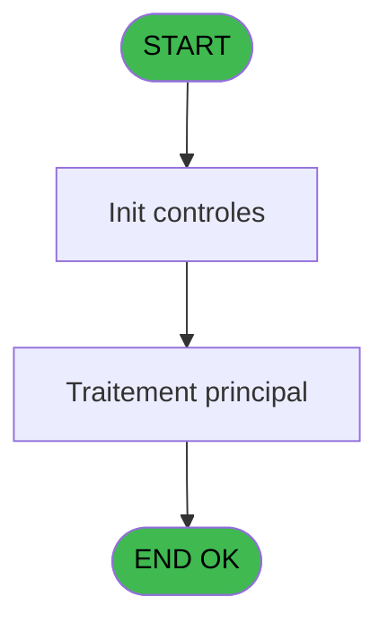

# MAI IDE 59 - Telechargement

> **Analyse**: Phases 1-4 2026-02-03 14:58 -> 14:58 (9s) | Assemblage 14:58
> **Pipeline**: V7.2 Enrichi
> **Structure**: 4 onglets (Resume | Ecrans | Donnees | Connexions)

<!-- TAB:Resume -->

## 1. FICHE D'IDENTITE

| Attribut | Valeur |
|----------|--------|
| Projet | MAI |
| IDE Position | 59 |
| Nom Programme | Telechargement |
| Fichier source | `Prg_59.xml` |
| Dossier IDE | PME |
| Taches | 1 (0 ecrans visibles) |
| Tables modifiees | 0 |
| Programmes appeles | 0 |

## 2. DESCRIPTION FONCTIONNELLE

**Telechargement** assure la gestion complete de ce processus, accessible depuis [Menu parametrage PME (IDE 64)](MAI-IDE-64.md).

Le flux de traitement s'organise en **1 blocs fonctionnels** :

- **Traitement** (1 tache) : traitements metier divers

## 3. BLOCS FONCTIONNELS

### 3.1 Traitement (1 tache)

Traitements internes.

---

#### 59 - Telechargement [[ECRAN]](#ecran-t1)

**Role** : Traitement : Telechargement.
**Ecran** : 164 x 88 DLU (MDI) | [Voir mockup](#ecran-t1)

## 5. REGLES METIER

*(Aucune regle metier identifiee)*

## 6. CONTEXTE

- **Appele par**: [Menu parametrage PME (IDE 64)](MAI-IDE-64.md)
- **Appelle**: 0 programmes | **Tables**: 0 (W:0 R:0 L:0) | **Taches**: 1 | **Expressions**: 20

<!-- TAB:Ecrans -->

## 8. ECRANS

*(Programme sans ecran visible)*

## 9. NAVIGATION

### 9.3 Structure hierarchique (1 tache)

| Position | Tache | Type | Dimensions | Bloc |
|----------|-------|------|------------|------|
| **59.1** | [**Telechargement** (59)](#t1) [mockup](#ecran-t1) | MDI | 164x88 | Traitement |

### 9.4 Algorigramme

> **Legende**: Vert = START/END OK | Rouge = END KO | Bleu = Decisions
> *Algorigramme auto-genere. Utiliser `/algorigramme` pour une synthese metier detaillee.*

<!-- TAB:Donnees -->

## 10. TABLES

### Tables utilisees (0)

| ID | Nom | Description | Type | R | W | L | Usages |
|----|-----|-------------|------|---|---|---|--------|

### Colonnes par table (0 / 0 tables avec colonnes identifiees)

## 11. VARIABLES

### 11.1 Parametres entrants (1)

Variables recues du programme appelant ([Menu parametrage PME (IDE 64)](MAI-IDE-64.md)).

| Lettre | Nom | Type | Usage dans |
|--------|-----|------|-----------|
| A | P0 choix (4) (5) | Alpha | 4x parametre entrant |

### 11.2 Autres (1)

Variables diverses.

| Lettre | Nom | Type | Usage dans |
|--------|-----|------|-----------|
| B | Confirmation | Numeric | 1x refs |

## 12. EXPRESSIONS

**20 / 20 expressions decodees (100%)**

### 12.1 Repartition par type

| Type | Expressions | Regles |
|------|-------------|--------|
| CONSTANTE | 1 | 0 |
| CONDITION | 5 | 0 |
| OTHER | 2 | 0 |
| CONCATENATION | 10 | 0 |
| STRING | 2 | 0 |

### 12.2 Expressions cles par type

#### CONSTANTE (1 expressions)

| Type | IDE | Expression | Regle |
|------|-----|------------|-------|
| CONSTANTE | 11 | `'5'` | - |

#### CONDITION (5 expressions)

| Type | IDE | Expression | Regle |
|------|-----|------------|-------|
| CONDITION | 10 | `Confirmation [B]=6` | - |
| CONDITION | 12 | `P0 choix (4) (5) [A]=''` | - |
| CONDITION | 5 | `P0 choix (4) (5) [A]='5'` | - |
| CONDITION | 1 | `'Un GRC500 doit être connecte à votre ordinateur sur le port COM1 et doit être allume en ayant pris soin de maintenir enfonce la touche <<. Si tel est le cas, confirmez vous le telechargement en mode '&IF (P0 choix (4) (5) [A]='4','Point de vente',IF (P0 choix (4) (5) [A]='5','guichet',''))` | - |
| CONDITION | 4 | `P0 choix (4) (5) [A]='4'` | - |

#### OTHER (2 expressions)

| Type | IDE | Expression | Regle |
|------|-----|------------|-------|
| OTHER | 3 | `SetCrsr (1)` | - |
| OTHER | 2 | `SetCrsr (2)` | - |

#### CONCATENATION (10 expressions)

| Type | IDE | Expression | Regle |
|------|-----|------------|-------|
| CONCATENATION | 17 | `FileCopy (Trim (INIGet ('[MAGIC_LOGICAL_NAMES]club_pme_guichet'))&'Medram.2',Trim (INIGet ('[MAGIC_LOGICAL_NAMES]env'))&'Medram.2')` | - |
| CONCATENATION | 16 | `FileCopy (Trim (INIGet ('[MAGIC_LOGICAL_NAMES]club_pme_pdv'))&'Med2ram.1',Trim (INIGet ('[MAGIC_LOGICAL_NAMES]env'))&'Med2ram.1')` | - |
| CONCATENATION | 18 | `FileCopy (Trim (INIGet ('[MAGIC_LOGICAL_NAMES]club_pme_pdv'))&'Med2ram.2',Trim (INIGet ('[MAGIC_LOGICAL_NAMES]env'))&'Med2ram.2')` | - |
| CONCATENATION | 20 | `FileCopy (Trim (INIGet ('[MAGIC_LOGICAL_NAMES]club_pme_pdv'))&'g4load.ini',Trim (INIGet ('[MAGIC_LOGICAL_NAMES]env'))&'g4load.ini')` | - |
| CONCATENATION | 19 | `FileCopy (Trim (INIGet ('[MAGIC_LOGICAL_NAMES]club_pme_guichet'))&'g4load.ini',Trim (INIGet ('[MAGIC_LOGICAL_NAMES]env'))&'g4load.ini')` | - |
| ... | | *+5 autres* | |

#### STRING (2 expressions)

| Type | IDE | Expression | Regle |
|------|-----|------------|-------|
| STRING | 8 | `Trim (INIGet ('[MAGIC_LOGICAL_NAMES]club_pme_pdv'))&'g4load.exe'` | - |
| STRING | 7 | `Trim (INIGet ('[MAGIC_LOGICAL_NAMES]club_pme_guichet'))&'g4load.exe'` | - |

<!-- TAB:Connexions -->

## 13. GRAPHE D'APPELS

### 13.1 Chaine depuis Main (Callers)

Main -> ... -> [Menu parametrage PME (IDE 64)](MAI-IDE-64.md) -> **Telechargement (IDE 59)**

### 13.2 Callers

| IDE | Nom Programme | Nb Appels |
|-----|---------------|-----------|
| [64](MAI-IDE-64.md) | Menu parametrage PME | 1 |

### 13.3 Callees (programmes appeles)

### 13.4 Detail Callees avec contexte

| IDE | Nom Programme | Appels | Contexte |
|-----|---------------|--------|----------|
| - | (aucun) | - | - |

## 14. RECOMMANDATIONS MIGRATION

### 14.1 Profil du programme

| Metrique | Valeur | Impact migration |
|----------|--------|-----------------|
| Lignes de logique | 27 | Programme compact |
| Expressions | 20 | Peu de logique |
| Tables WRITE | 0 | Impact faible |
| Sous-programmes | 0 | Peu de dependances |
| Ecrans visibles | 0 | Ecran unique ou traitement batch |
| Code desactive | 0% (0 / 27) | Code sain |
| Regles metier | 0 | Pas de regle identifiee |

### 14.2 Plan de migration par bloc

#### Traitement (1 tache: 1 ecran, 0 traitement)

- **Strategie** : 1 composant(s) UI (Razor/React) avec formulaires et validation.
- Decomposer les taches en services unitaires testables.

### 14.3 Dependances critiques

| Dependance | Type | Appels | Impact |
|------------|------|--------|--------|

---
*Spec DETAILED generee par Pipeline V7.2 - 2026-02-03 14:58*
