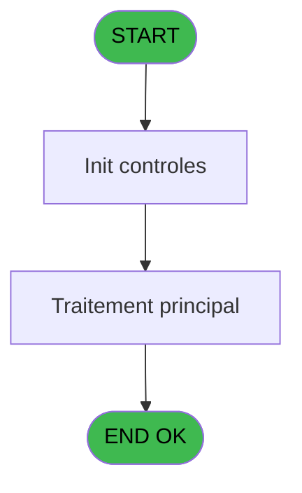
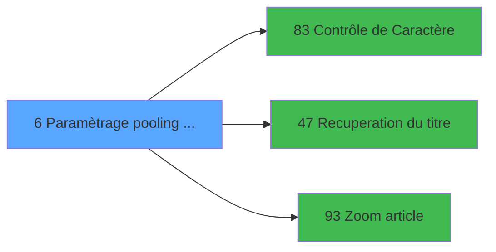

# MAI IDE 6 - Paramètrage pooling BIBOP

> **Analyse**: Phases 1-4 2026-02-03 14:45 -> 14:45 (10s) | Assemblage 14:45
> **Pipeline**: V7.2 Enrichi
> **Structure**: 4 onglets (Resume | Ecrans | Donnees | Connexions)

<!-- TAB:Resume -->

## 1. FICHE D'IDENTITE

| Attribut | Valeur |
|----------|--------|
| Projet | MAI |
| IDE Position | 6 |
| Nom Programme | Paramètrage pooling BIBOP |
| Fichier source | `Prg_6.xml` |
| Dossier IDE | Bibop |
| Taches | 1 (1 ecrans visibles) |
| Tables modifiees | 0 |
| Programmes appeles | 3 |

## 2. DESCRIPTION FONCTIONNELLE

**Paramètrage pooling BIBOP** assure la gestion complete de ce processus, accessible depuis [Menu parametrage Bibop (IDE 8)](MAI-IDE-8.md).

Le flux de traitement s'organise en **1 blocs fonctionnels** :

- **Traitement** (1 tache) : traitements metier divers

**Logique metier** : 4 regles identifiees couvrant conditions metier.

## 3. BLOCS FONCTIONNELS

### 3.1 Traitement (1 tache)

Traitements internes.

---

#### 6 - Parmetrage pooling BIBOP [[ECRAN]](#ecran-t1)

**Role** : Traitement : Parmetrage pooling BIBOP.
**Ecran** : 1141 x 289 DLU (MDI) | [Voir mockup](#ecran-t1)
**Delegue a** : [Contrôle de Caractère (IDE 83)](MAI-IDE-83.md), [Recuperation du titre (IDE 47)](MAI-IDE-47.md)

## 5. REGLES METIER

4 regles identifiees:

### Autres (4 regles)

#### [RM-001] Si [AF]='G' alors 'P' sinon 'G')

| Element | Detail |
|---------|--------|
| **Condition** | `[AF]='G'` |
| **Si vrai** | 'P' |
| **Si faux** | 'G') |
| **Expression source** | Expression 28 : `IF ([AF]='G','P','G')` |
| **Exemple** | Si [AF]='G' → 'P'. Sinon → 'G') |

#### [RM-002] Si [AI]='G' alors 'et' sinon IF ([AI]='P','ut',''))

| Element | Detail |
|---------|--------|
| **Condition** | `[AI]='G'` |
| **Si vrai** | 'et' |
| **Si faux** | IF ([AI]='P','ut','')) |
| **Expression source** | Expression 61 : `IF ([AI]='G','et',IF ([AI]='P','ut',''))` |
| **Exemple** | Si [AI]='G' → 'et'. Sinon → IF ([AI]='P','ut','')) |

#### [RM-003] Si [AU]='N' alors 'oir' sinon IF ([AU]='C','ouleur',''))

| Element | Detail |
|---------|--------|
| **Condition** | `[AU]='N'` |
| **Si vrai** | 'oir' |
| **Si faux** | IF ([AU]='C','ouleur','')) |
| **Expression source** | Expression 62 : `IF ([AU]='N','oir',IF ([AU]='C','ouleur',''))` |
| **Exemple** | Si [AU]='N' → 'oir'. Sinon → IF ([AU]='C','ouleur','')) |

#### [RM-004] Si [AV]=1 alors 150 sinon IF ([AV]=2,300,IF ([AV]=3,600,IF ([AV]=4,1200,IF ([AV]=5,2400,IF ([AV]=6,4800,IF ([AV]=7,9600,IF ([AV]=8,19200,IF ([AV]=9,38400,0)))))))))

| Element | Detail |
|---------|--------|
| **Condition** | `[AV]=1` |
| **Si vrai** | 150 |
| **Si faux** | IF ([AV]=2,300,IF ([AV]=3,600,IF ([AV]=4,1200,IF ([AV]=5,2400,IF ([AV]=6,4800,IF ([AV]=7,9600,IF ([AV]=8,19200,IF ([AV]=9,38400,0))))))))) |
| **Expression source** | Expression 63 : `IF ([AV]=1,150,IF ([AV]=2,300,IF ([AV]=3,600,IF ([AV]=4,1200` |
| **Exemple** | Si [AV]=1 → 150 |

## 6. CONTEXTE

- **Appele par**: [Menu parametrage Bibop (IDE 8)](MAI-IDE-8.md)
- **Appelle**: 3 programmes | **Tables**: 2 (W:0 R:1 L:1) | **Taches**: 1 | **Expressions**: 71

<!-- TAB:Ecrans -->

## 8. ECRANS

### 8.1 Forms visibles (1 / 1)

| # | Position | Tache | Nom | Type | Largeur | Hauteur | Bloc |
|---|----------|-------|-----|------|---------|---------|------|
| 1 | 6 | 6 | Parmetrage pooling BIBOP | MDI | 1141 | 289 | Traitement |

### 8.2 Mockups Ecrans

---

#### 6 - Parmetrage pooling BIBOP
**Tache** : [6](#t1) | **Type** : MDI | **Dimensions** : 1141 x 289 DLU
**Bloc** : Traitement | **Titre IDE** : Parmetrage pooling BIBOP

<!-- FORM-DATA:
{
    "width":  1141,
    "vFactor":  8,
    "type":  "MDI",
    "hFactor":  8,
    "controls":  [
                     {
                         "x":  0,
                         "type":  "label",
                         "var":  "",
                         "y":  0,
                         "w":  1132,
                         "fmt":  "",
                         "name":  "",
                         "h":  19,
                         "color":  "",
                         "text":  "",
                         "parent":  null
                     },
                     {
                         "x":  0,
                         "type":  "label",
                         "var":  "",
                         "y":  23,
                         "w":  531,
                         "fmt":  "",
                         "name":  "",
                         "h":  43,
                         "color":  "195",
                         "text":  "Traitement 1",
                         "parent":  null
                     },
                     {
                         "x":  545,
                         "type":  "label",
                         "var":  "",
                         "y":  23,
                         "w":  590,
                         "fmt":  "",
                         "name":  "",
                         "h":  43,
                         "color":  "195",
                         "text":  "Traitement 2",
                         "parent":  null
                     },
                     {
                         "x":  17,
                         "type":  "label",
                         "var":  "",
                         "y":  38,
                         "w":  50,
                         "fmt":  "",
                         "name":  "",
                         "h":  8,
                         "color":  "",
                         "text":  "Type",
                         "parent":  4
                     },
                     {
                         "x":  195,
                         "type":  "label",
                         "var":  "",
                         "y":  38,
                         "w":  110,
                         "fmt":  "",
                         "name":  "",
                         "h":  8,
                         "color":  "",
                         "text":  "Temporisation",
                         "parent":  4
                     },
                     {
                         "x":  464,
                         "type":  "label",
                         "var":  "",
                         "y":  38,
                         "w":  45,
                         "fmt":  "",
                         "name":  "",
                         "h":  8,
                         "color":  "",
                         "text":  "Faire",
                         "parent":  4
                     },
                     {
                         "x":  585,
                         "type":  "label",
                         "var":  "",
                         "y":  38,
                         "w":  66,
                         "fmt":  "",
                         "name":  "",
                         "h":  8,
                         "color":  "",
                         "text":  "Type",
                         "parent":  5
                     },
                     {
                         "x":  792,
                         "type":  "label",
                         "var":  "",
                         "y":  38,
                         "w":  147,
                         "fmt":  "",
                         "name":  "",
                         "h":  8,
                         "color":  "",
                         "text":  "Temporisation",
                         "parent":  5
                     },
                     {
                         "x":  1067,
                         "type":  "label",
                         "var":  "",
                         "y":  38,
                         "w":  45,
                         "fmt":  "",
                         "name":  "",
                         "h":  8,
                         "color":  "",
                         "text":  "Faire",
                         "parent":  5
                     },
                     {
                         "x":  3,
                         "type":  "label",
                         "var":  "",
                         "y":  71,
                         "w":  718,
                         "fmt":  "",
                         "name":  "",
                         "h":  62,
                         "color":  "195",
                         "text":  "Fichiers",
                         "parent":  null
                     },
                     {
                         "x":  40,
                         "type":  "label",
                         "var":  "",
                         "y":  81,
                         "w":  133,
                         "fmt":  "",
                         "name":  "",
                         "h":  8,
                         "color":  "",
                         "text":  "GETTRS Entree",
                         "parent":  21
                     },
                     {
                         "x":  40,
                         "type":  "label",
                         "var":  "",
                         "y":  90,
                         "w":  112,
                         "fmt":  "",
                         "name":  "",
                         "h":  8,
                         "color":  "",
                         "text":  "GETTRS Log",
                         "parent":  21
                     },
                     {
                         "x":  40,
                         "type":  "label",
                         "var":  "",
                         "y":  100,
                         "w":  146,
                         "fmt":  "",
                         "name":  "",
                         "h":  8,
                         "color":  "",
                         "text":  "PUTTRS Resultat",
                         "parent":  21
                     },
                     {
                         "x":  40,
                         "type":  "label",
                         "var":  "",
                         "y":  110,
                         "w":  154,
                         "fmt":  "",
                         "name":  "",
                         "h":  8,
                         "color":  "",
                         "text":  "PUTTRS Log",
                         "parent":  21
                     },
                     {
                         "x":  40,
                         "type":  "label",
                         "var":  "",
                         "y":  120,
                         "w":  150,
                         "fmt":  "",
                         "name":  "",
                         "h":  8,
                         "color":  "",
                         "text":  "PUTTRS Directory",
                         "parent":  21
                     },
                     {
                         "x":  2,
                         "type":  "label",
                         "var":  "",
                         "y":  137,
                         "w":  1133,
                         "fmt":  "",
                         "name":  "",
                         "h":  121,
                         "color":  "",
                         "text":  "",
                         "parent":  null
                     },
                     {
                         "x":  234,
                         "type":  "label",
                         "var":  "",
                         "y":  140,
                         "w":  890,
                         "fmt":  "",
                         "name":  "",
                         "h":  30,
                         "color":  "195",
                         "text":  "Detruit",
                         "parent":  null
                     },
                     {
                         "x":  15,
                         "type":  "label",
                         "var":  "",
                         "y":  153,
                         "w":  99,
                         "fmt":  "",
                         "name":  "",
                         "h":  10,
                         "color":  "",
                         "text":  "Test/Exploit",
                         "parent":  null
                     },
                     {
                         "x":  312,
                         "type":  "label",
                         "var":  "",
                         "y":  153,
                         "w":  86,
                         "fmt":  "",
                         "name":  "",
                         "h":  10,
                         "color":  "",
                         "text":  "TAMPON",
                         "parent":  33
                     },
                     {
                         "x":  594,
                         "type":  "label",
                         "var":  "",
                         "y":  153,
                         "w":  51,
                         "fmt":  "",
                         "name":  "",
                         "h":  10,
                         "color":  "",
                         "text":  "ASCII",
                         "parent":  33
                     },
                     {
                         "x":  858,
                         "type":  "label",
                         "var":  "",
                         "y":  153,
                         "w":  83,
                         "fmt":  "",
                         "name":  "",
                         "h":  10,
                         "color":  "",
                         "text":  "AFAIRE",
                         "parent":  33
                     },
                     {
                         "x":  11,
                         "type":  "line",
                         "var":  "",
                         "y":  178,
                         "w":  1114,
                         "fmt":  "",
                         "name":  "",
                         "h":  0,
                         "color":  "",
                         "text":  "",
                         "parent":  32
                     },
                     {
                         "x":  15,
                         "type":  "label",
                         "var":  "",
                         "y":  186,
                         "w":  125,
                         "fmt":  "",
                         "name":  "",
                         "h":  10,
                         "color":  "",
                         "text":  "Noir ou Couleur",
                         "parent":  null
                     },
                     {
                         "x":  413,
                         "type":  "label",
                         "var":  "",
                         "y":  186,
                         "w":  189,
                         "fmt":  "",
                         "name":  "",
                         "h":  10,
                         "color":  "",
                         "text":  "Vitesse de Transmission",
                         "parent":  null
                     },
                     {
                         "x":  15,
                         "type":  "label",
                         "var":  "",
                         "y":  212,
                         "w":  54,
                         "fmt":  "",
                         "name":  "",
                         "h":  10,
                         "color":  "",
                         "text":  "Article",
                         "parent":  null
                     },
                     {
                         "x":  413,
                         "type":  "label",
                         "var":  "",
                         "y":  212,
                         "w":  86,
                         "fmt":  "",
                         "name":  "",
                         "h":  10,
                         "color":  "",
                         "text":  "Imputation",
                         "parent":  null
                     },
                     {
                         "x":  10,
                         "type":  "line",
                         "var":  "",
                         "y":  231,
                         "w":  1112,
                         "fmt":  "",
                         "name":  "",
                         "h":  0,
                         "color":  "",
                         "text":  "",
                         "parent":  32
                     },
                     {
                         "x":  15,
                         "type":  "label",
                         "var":  "",
                         "y":  238,
                         "w":  101,
                         "fmt":  "",
                         "name":  "",
                         "h":  10,
                         "color":  "",
                         "text":  "Sauvegarde",
                         "parent":  null
                     },
                     {
                         "x":  413,
                         "type":  "label",
                         "var":  "",
                         "y":  238,
                         "w":  152,
                         "fmt":  "",
                         "name":  "",
                         "h":  10,
                         "color":  "",
                         "text":  "Debut Sauvegarde",
                         "parent":  null
                     },
                     {
                         "x":  863,
                         "type":  "label",
                         "var":  "",
                         "y":  238,
                         "w":  128,
                         "fmt":  "",
                         "name":  "",
                         "h":  10,
                         "color":  "",
                         "text":  "Fin Sauvegarde",
                         "parent":  null
                     },
                     {
                         "x":  0,
                         "type":  "label",
                         "var":  "",
                         "y":  262,
                         "w":  1136,
                         "fmt":  "",
                         "name":  "",
                         "h":  24,
                         "color":  "",
                         "text":  "",
                         "parent":  null
                     },
                     {
                         "x":  12,
                         "type":  "edit",
                         "var":  "",
                         "y":  49,
                         "w":  26,
                         "fmt":  "",
                         "name":  "PBI Type Trait. 1",
                         "h":  10,
                         "color":  "6",
                         "text":  "",
                         "parent":  4
                     },
                     {
                         "x":  195,
                         "type":  "edit",
                         "var":  "",
                         "y":  49,
                         "w":  104,
                         "fmt":  "",
                         "name":  "PBI Attente     1",
                         "h":  10,
                         "color":  "6",
                         "text":  "",
                         "parent":  4
                     },
                     {
                         "x":  472,
                         "type":  "edit",
                         "var":  "",
                         "y":  49,
                         "w":  26,
                         "fmt":  "",
                         "name":  "PBI Faire       1",
                         "h":  10,
                         "color":  "6",
                         "text":  "",
                         "parent":  4
                     },
                     {
                         "x":  583,
                         "type":  "edit",
                         "var":  "",
                         "y":  49,
                         "w":  19,
                         "fmt":  "",
                         "name":  "",
                         "h":  8,
                         "color":  "",
                         "text":  "",
                         "parent":  5
                     },
                     {
                         "x":  798,
                         "type":  "edit",
                         "var":  "",
                         "y":  49,
                         "w":  104,
                         "fmt":  "",
                         "name":  "PBI Attente     2",
                         "h":  10,
                         "color":  "6",
                         "text":  "",
                         "parent":  5
                     },
                     {
                         "x":  1073,
                         "type":  "edit",
                         "var":  "",
                         "y":  49,
                         "w":  26,
                         "fmt":  "",
                         "name":  "PBI Faire       2",
                         "h":  10,
                         "color":  "6",
                         "text":  "",
                         "parent":  5
                     },
                     {
                         "x":  243,
                         "type":  "edit",
                         "var":  "",
                         "y":  79,
                         "w":  462,
                         "fmt":  "",
                         "name":  "PBI GETBIB Dir+Fic",
                         "h":  10,
                         "color":  "6",
                         "text":  "",
                         "parent":  21
                     },
                     {
                         "x":  243,
                         "type":  "edit",
                         "var":  "",
                         "y":  90,
                         "w":  462,
                         "fmt":  "",
                         "name":  "PBI GETBIB Log",
                         "h":  10,
                         "color":  "6",
                         "text":  "",
                         "parent":  21
                     },
                     {
                         "x":  243,
                         "type":  "edit",
                         "var":  "",
                         "y":  100,
                         "w":  462,
                         "fmt":  "",
                         "name":  "PBI PUTBIB Fic.Resul",
                         "h":  10,
                         "color":  "6",
                         "text":  "",
                         "parent":  21
                     },
                     {
                         "x":  243,
                         "type":  "edit",
                         "var":  "",
                         "y":  110,
                         "w":  462,
                         "fmt":  "",
                         "name":  "PBI PUTBIB Fic.LOG",
                         "h":  10,
                         "color":  "6",
                         "text":  "",
                         "parent":  21
                     },
                     {
                         "x":  243,
                         "type":  "edit",
                         "var":  "",
                         "y":  120,
                         "w":  462,
                         "fmt":  "",
                         "name":  "PBI PUTBIB Directory",
                         "h":  10,
                         "color":  "6",
                         "text":  "",
                         "parent":  21
                     },
                     {
                         "x":  115,
                         "type":  "edit",
                         "var":  "",
                         "y":  153,
                         "w":  26,
                         "fmt":  "",
                         "name":  "PBI Test ou Exploit.",
                         "h":  10,
                         "color":  "6",
                         "text":  "",
                         "parent":  null
                     },
                     {
                         "x":  405,
                         "type":  "edit",
                         "var":  "",
                         "y":  153,
                         "w":  26,
                         "fmt":  "",
                         "name":  "PBI Detruit TAMPON",
                         "h":  10,
                         "color":  "6",
                         "text":  "",
                         "parent":  33
                     },
                     {
                         "x":  647,
                         "type":  "edit",
                         "var":  "",
                         "y":  153,
                         "w":  26,
                         "fmt":  "",
                         "name":  "PBI Detruit ASCII",
                         "h":  10,
                         "color":  "6",
                         "text":  "",
                         "parent":  33
                     },
                     {
                         "x":  933,
                         "type":  "edit",
                         "var":  "",
                         "y":  153,
                         "w":  26,
                         "fmt":  "",
                         "name":  "PBI Detruit AFAIRE",
                         "h":  10,
                         "color":  "6",
                         "text":  "",
                         "parent":  33
                     },
                     {
                         "x":  152,
                         "type":  "edit",
                         "var":  "",
                         "y":  186,
                         "w":  26,
                         "fmt":  "",
                         "name":  "PBI Blanc ou Couleur",
                         "h":  10,
                         "color":  "6",
                         "text":  "",
                         "parent":  null
                     },
                     {
                         "x":  611,
                         "type":  "edit",
                         "var":  "",
                         "y":  186,
                         "w":  26,
                         "fmt":  "",
                         "name":  "PBI Type Transmissio",
                         "h":  10,
                         "color":  "6",
                         "text":  "",
                         "parent":  null
                     },
                     {
                         "x":  152,
                         "type":  "edit",
                         "var":  "",
                         "y":  212,
                         "w":  82,
                         "fmt":  "",
                         "name":  "PBI n° article",
                         "h":  10,
                         "color":  "6",
                         "text":  "",
                         "parent":  null
                     },
                     {
                         "x":  123,
                         "type":  "edit",
                         "var":  "",
                         "y":  238,
                         "w":  26,
                         "fmt":  "",
                         "name":  "PBI sauvegarde",
                         "h":  10,
                         "color":  "6",
                         "text":  "",
                         "parent":  null
                     },
                     {
                         "x":  611,
                         "type":  "edit",
                         "var":  "",
                         "y":  238,
                         "w":  104,
                         "fmt":  "",
                         "name":  "PBI debut sauvegarde",
                         "h":  10,
                         "color":  "6",
                         "text":  "",
                         "parent":  null
                     },
                     {
                         "x":  996,
                         "type":  "edit",
                         "var":  "",
                         "y":  238,
                         "w":  104,
                         "fmt":  "",
                         "name":  "PBI fin sauvegarde",
                         "h":  10,
                         "color":  "6",
                         "text":  "",
                         "parent":  null
                     },
                     {
                         "x":  241,
                         "type":  "edit",
                         "var":  "",
                         "y":  212,
                         "w":  142,
                         "fmt":  "",
                         "name":  "",
                         "h":  10,
                         "color":  "7",
                         "text":  "",
                         "parent":  null
                     },
                     {
                         "x":  611,
                         "type":  "edit",
                         "var":  "",
                         "y":  212,
                         "w":  126,
                         "fmt":  "",
                         "name":  "",
                         "h":  10,
                         "color":  "6",
                         "text":  "",
                         "parent":  null
                     },
                     {
                         "x":  747,
                         "type":  "edit",
                         "var":  "",
                         "y":  212,
                         "w":  59,
                         "fmt":  "",
                         "name":  "",
                         "h":  10,
                         "color":  "7",
                         "text":  "",
                         "parent":  null
                     },
                     {
                         "x":  9,
                         "type":  "button",
                         "var":  "",
                         "y":  265,
                         "w":  154,
                         "fmt":  "\u0026Ok",
                         "name":  "Ok",
                         "h":  18,
                         "color":  "",
                         "text":  "",
                         "parent":  null
                     },
                     {
                         "x":  6,
                         "type":  "edit",
                         "var":  "",
                         "y":  4,
                         "w":  267,
                         "fmt":  "20",
                         "name":  "",
                         "h":  8,
                         "color":  "",
                         "text":  "",
                         "parent":  null
                     },
                     {
                         "x":  922,
                         "type":  "edit",
                         "var":  "",
                         "y":  4,
                         "w":  203,
                         "fmt":  "WWW DD MMM YYYYT",
                         "name":  "",
                         "h":  8,
                         "color":  "",
                         "text":  "",
                         "parent":  null
                     },
                     {
                         "x":  603,
                         "type":  "edit",
                         "var":  "",
                         "y":  49,
                         "w":  30,
                         "fmt":  "2",
                         "name":  "",
                         "h":  8,
                         "color":  "7",
                         "text":  "",
                         "parent":  5
                     },
                     {
                         "x":  41,
                         "type":  "edit",
                         "var":  "",
                         "y":  51,
                         "w":  46,
                         "fmt":  "2",
                         "name":  "",
                         "h":  8,
                         "color":  "7",
                         "text":  "",
                         "parent":  4
                     },
                     {
                         "x":  825,
                         "type":  "image",
                         "var":  "",
                         "y":  70,
                         "w":  272,
                         "fmt":  "",
                         "name":  "",
                         "h":  62,
                         "color":  "",
                         "text":  "",
                         "parent":  null
                     },
                     {
                         "x":  644,
                         "type":  "edit",
                         "var":  "",
                         "y":  186,
                         "w":  67,
                         "fmt":  "4",
                         "name":  "",
                         "h":  10,
                         "color":  "7",
                         "text":  "",
                         "parent":  null
                     },
                     {
                         "x":  192,
                         "type":  "edit",
                         "var":  "",
                         "y":  188,
                         "w":  189,
                         "fmt":  "30",
                         "name":  "",
                         "h":  8,
                         "color":  "7",
                         "text":  "",
                         "parent":  null
                     },
                     {
                         "x":  171,
                         "type":  "button",
                         "var":  "",
                         "y":  265,
                         "w":  154,
                         "fmt":  "A\u0026bandonner",
                         "name":  "",
                         "h":  18,
                         "color":  "",
                         "text":  "",
                         "parent":  null
                     }
                 ],
    "taskId":  "6",
    "height":  289
}
-->

<strong>Champs : 30 champs</strong>

| Pos (x,y) | Nom | Variable | Type |
|-----------|-----|----------|------|
| 12,49 | PBI Type Trait. 1 | - | edit |
| 195,49 | PBI Attente     1 | - | edit |
| 472,49 | PBI Faire       1 | - | edit |
| 583,49 | (sans nom) | - | edit |
| 798,49 | PBI Attente     2 | - | edit |
| 1073,49 | PBI Faire       2 | - | edit |
| 243,79 | PBI GETBIB Dir+Fic | - | edit |
| 243,90 | PBI GETBIB Log | - | edit |
| 243,100 | PBI PUTBIB Fic.Resul | - | edit |
| 243,110 | PBI PUTBIB Fic.LOG | - | edit |
| 243,120 | PBI PUTBIB Directory | - | edit |
| 115,153 | PBI Test ou Exploit. | - | edit |
| 405,153 | PBI Detruit TAMPON | - | edit |
| 647,153 | PBI Detruit ASCII | - | edit |
| 933,153 | PBI Detruit AFAIRE | - | edit |
| 152,186 | PBI Blanc ou Couleur | - | edit |
| 611,186 | PBI Type Transmissio | - | edit |
| 152,212 | PBI n° article | - | edit |
| 123,238 | PBI sauvegarde | - | edit |
| 611,238 | PBI debut sauvegarde | - | edit |
| 996,238 | PBI fin sauvegarde | - | edit |
| 241,212 | (sans nom) | - | edit |
| 611,212 | (sans nom) | - | edit |
| 747,212 | (sans nom) | - | edit |
| 6,4 | 20 | - | edit |
| 922,4 | WWW DD MMM YYYYT | - | edit |
| 603,49 | 2 | - | edit |
| 41,51 | 2 | - | edit |
| 644,186 | 4 | - | edit |
| 192,188 | 30 | - | edit |

<strong>Boutons : 2 boutons</strong>

| Bouton | Pos (x,y) | Action |
|--------|-----------|--------|
| Ok | 9,265 | Valide la saisie et enregistre |
| Abandonner | 171,265 | Annule et retour au menu |

## 9. NAVIGATION

Ecran unique: **Parmetrage pooling BIBOP**

### 9.3 Structure hierarchique (1 tache)

| Position | Tache | Type | Dimensions | Bloc |
|----------|-------|------|------------|------|
| **6.1** | [**Parmetrage pooling BIBOP** (6)](#t1) [mockup](#ecran-t1) | MDI | 1141x289 | Traitement |

### 9.4 Algorigramme

> **Legende**: Vert = START/END OK | Rouge = END KO | Bleu = Decisions
> *Algorigramme auto-genere. Utiliser `/algorigramme` pour une synthese metier detaillee.*

<!-- TAB:Donnees -->

## 10. TABLES

### Tables utilisees (2)

| ID | Nom | Description | Type | R | W | L | Usages |
|----|-----|-------------|------|---|---|---|--------|
| 77 | articles_________art | Articles et stock | DB | R |   |   | 1 |
| 161 | parametres_bibop |  | DB |   |   | L | 1 |

### Colonnes par table (1 / 1 tables avec colonnes identifiees)

Table 77 - articles_________art (R) - 1 usages

| Lettre | Variable | Acces | Type |
|--------|----------|-------|------|
| A | v. titre ecran | R | Alpha |
| B | W0 Type Erreur | R | Numeric |
| C | W0 Longueur contrôle | R | Numeric |
| D | W0 Affiche Erreur | R | Alpha |
| E | W0 Message | R | Alpha |
| F | W0 Reponse | R | Numeric |
| G | Bouton Ok | R | Alpha |

## 11. VARIABLES

### 11.1 Variables de session (1)

Variables persistantes pendant toute la session.

| Lettre | Nom | Type | Usage dans |
|--------|-----|------|-----------|
| A | v. titre ecran | Alpha | 1x session |

### 11.2 Variables de travail (5)

Variables internes au programme.

| Lettre | Nom | Type | Usage dans |
|--------|-----|------|-----------|
| B | W0 Type Erreur | Numeric | 1x calcul interne |
| C | W0 Longueur contrôle | Numeric | - |
| D | W0 Affiche Erreur | Alpha | - |
| E | W0 Message | Alpha | 1x calcul interne |
| F | W0 Reponse | Numeric | - |

### 11.3 Autres (1)

Variables diverses.

| Lettre | Nom | Type | Usage dans |
|--------|-----|------|-----------|
| G | Bouton Ok | Alpha | 1x refs |

## 12. EXPRESSIONS

**71 / 71 expressions decodees (100%)**

### 12.1 Repartition par type

| Type | Expressions | Regles |
|------|-------------|--------|
| CONDITION | 33 | 4 |
| CONSTANTE | 6 | 0 |
| DATE | 2 | 0 |
| REFERENCE_VG | 2 | 0 |
| OTHER | 27 | 0 |
| STRING | 1 | 0 |

### 12.2 Expressions cles par type

#### CONDITION (33 expressions)

| Type | IDE | Expression | Regle |
|------|-----|------------|-------|
| CONDITION | 62 | `IF ([AU]='N','oir',IF ([AU]='C','ouleur',''))` | [RM-003](#rm-RM-003) |
| CONDITION | 63 | `IF ([AV]=1,150,IF ([AV]=2,300,IF ([AV]=3,600,IF ([AV]=4,1200,IF ([AV]=5,2400,IF ([AV]=6,4800,IF ([AV]=7,9600,IF ([AV]=8,19200,IF ([AV]=9,38400,0)))))))))` | [RM-004](#rm-RM-004) |
| CONDITION | 61 | `IF ([AI]='G','et',IF ([AI]='P','ut',''))` | [RM-002](#rm-RM-002) |
| CONDITION | 28 | `IF ([AF]='G','P','G')` | [RM-001](#rm-RM-001) |
| CONDITION | 15 | `InStr ('ON',[AH])=0` | - |
| ... | | *+28 autres* | |

#### CONSTANTE (6 expressions)

| Type | IDE | Expression | Regle |
|------|-----|------------|-------|
| CONSTANTE | 11 | `''` | - |
| CONSTANTE | 67 | `'C'` | - |
| CONSTANTE | 68 | `7` | - |
| CONSTANTE | 4 | `12` | - |
| CONSTANTE | 5 | `40` | - |
| ... | | *+1 autres* | |

#### DATE (2 expressions)

| Type | IDE | Expression | Regle |
|------|-----|------------|-------|
| DATE | 64 | `Date ()` | - |
| DATE | 1 | `Date ()` | - |

#### REFERENCE_VG (2 expressions)

| Type | IDE | Expression | Regle |
|------|-----|------------|-------|
| REFERENCE_VG | 66 | `VG1` | - |
| REFERENCE_VG | 2 | `VG2` | - |

#### OTHER (27 expressions)

| Type | IDE | Expression | Regle |
|------|-----|------------|-------|
| OTHER | 47 | `[W]` | - |
| OTHER | 48 | `[X]` | - |
| OTHER | 49 | `[Y]` | - |
| OTHER | 44 | `[T]` | - |
| OTHER | 45 | `[U]` | - |
| ... | | *+22 autres* | |

#### STRING (1 expressions)

| Type | IDE | Expression | Regle |
|------|-----|------------|-------|
| STRING | 3 | `Trim (v. titre ecran [A])` | - |

### 12.3 Toutes les expressions (71)

Voir les 71 expressions

#### CONDITION (33)

| IDE | Expression Decodee |
|-----|-------------------|
| 28 | `IF ([AF]='G','P','G')` |
| 60 | `IF ([AF]='G','et',IF ([AF]='P','ut',''))` |
| 61 | `IF ([AI]='G','et',IF ([AI]='P','ut',''))` |
| 62 | `IF ([AU]='N','oir',IF ([AU]='C','ouleur',''))` |
| 63 | `IF ([AV]=1,150,IF ([AV]=2,300,IF ([AV]=3,600,IF ([AV]=4,1200,IF ([AV]=5,2400,IF ([AV]=6,4800,IF ([AV]=7,9600,IF ([AV]=8,19200,IF ([AV]=9,38400,0)))))))))` |
| 8 | `W0 Type Erreur [B]=1` |
| 9 | `[BH]<>6` |
| 10 | `[BH]=6` |
| 13 | `[AG]=0` |
| 14 | `[AG]>'00:00:59'TIME` |
| 23 | `[AV]=0` |
| 25 | `[AY]>'06:00:00'TIME` |
| 26 | `[AX]='O' AND [AZ]<=[AY]` |
| 27 | `[AZ]>'06:00:00'TIME` |
| 29 | `[AJ]=0` |
| 30 | `[AJ]>'00:00:59'TIME` |
| 55 | `[AL]=''` |
| 56 | `[AM]=''` |
| 57 | `[AN]=''` |
| 58 | `[AO]=''` |
| 59 | `[AP]=''` |
| 71 | `LastClicked ()='Ok'` |
| 12 | `InStr ('GP',[AF])=0` |
| 15 | `InStr ('ON',[AH])=0` |
| 16 | `InStr ('ON',[AK])=0` |
| 17 | `InStr ('GP',[AI])=0` |
| 18 | `InStr ('TE',[AQ])=0` |
| 19 | `InStr ('ON',[AR])=0` |
| 20 | `InStr ('ON',[AS])=0` |
| 21 | `InStr ('ON',[AT])=0` |
| 22 | `InStr ('NC',[AU])=0` |
| 24 | `InStr ('ON',[AX])=0` |
| 69 | `MID ([AP],Len (RTrim (RTrim ([AP]))),1)='\'` |

#### CONSTANTE (6)

| IDE | Expression Decodee |
|-----|-------------------|
| 4 | `12` |
| 5 | `40` |
| 6 | `'N'` |
| 11 | `''` |
| 67 | `'C'` |
| 68 | `7` |

#### DATE (2)

| IDE | Expression Decodee |
|-----|-------------------|
| 1 | `Date ()` |
| 64 | `Date ()` |

#### REFERENCE_VG (2)

| IDE | Expression Decodee |
|-----|-------------------|
| 2 | `VG2` |
| 66 | `VG1` |

#### OTHER (27)

| IDE | Expression Decodee |
|-----|-------------------|
| 7 | `W0 Message [E]` |
| 31 | `Bouton Ok [G]` |
| 32 | `[H]` |
| 33 | `[I]` |
| 34 | `[J]` |
| 35 | `[K]` |
| 36 | `[L]` |
| 37 | `[M]` |
| 38 | `[N]` |
| 39 | `[O]` |
| 40 | `[P]` |
| 41 | `[Q]` |
| 42 | `[R]` |
| 43 | `[S]` |
| 44 | `[T]` |
| 45 | `[U]` |
| 46 | `[V]` |
| 47 | `[W]` |
| 48 | `[X]` |
| 49 | `[Y]` |
| 50 | `[Z]` |
| 51 | `[AA]` |
| 52 | `[AB]` |
| 53 | `[AC]` |
| 54 | `[AD]` |
| 65 | `Time ()` |
| 70 | `[AW]` |

#### STRING (1)

| IDE | Expression Decodee |
|-----|-------------------|
| 3 | `Trim (v. titre ecran [A])` |

<!-- TAB:Connexions -->

## 13. GRAPHE D'APPELS

### 13.1 Chaine depuis Main (Callers)

Main -> ... -> [Menu parametrage Bibop (IDE 8)](MAI-IDE-8.md) -> **Paramètrage pooling BIBOP (IDE 6)**

### 13.2 Callers

| IDE | Nom Programme | Nb Appels |
|-----|---------------|-----------|
| [8](MAI-IDE-8.md) | Menu parametrage Bibop | 1 |

### 13.3 Callees (programmes appeles)

### 13.4 Detail Callees avec contexte

| IDE | Nom Programme | Appels | Contexte |
|-----|---------------|--------|----------|
| [83](MAI-IDE-83.md) | Contrôle de Caractère | 6 | Validation saisie |
| [47](MAI-IDE-47.md) | Recuperation du titre | 1 | Recuperation donnees |
| [93](MAI-IDE-93.md) | Zoom article | 1 | Selection/consultation |

## 14. RECOMMANDATIONS MIGRATION

### 14.1 Profil du programme

| Metrique | Valeur | Impact migration |
|----------|--------|-----------------|
| Lignes de logique | 168 | Programme compact |
| Expressions | 71 | Logique moderee |
| Tables WRITE | 0 | Impact faible |
| Sous-programmes | 3 | Peu de dependances |
| Ecrans visibles | 1 | Ecran unique ou traitement batch |
| Code desactive | 0% (0 / 168) | Code sain |
| Regles metier | 4 | Quelques regles a preserver |

### 14.2 Plan de migration par bloc

#### Traitement (1 tache: 1 ecran, 0 traitement)

- **Strategie** : 1 composant(s) UI (Razor/React) avec formulaires et validation.
- 3 sous-programme(s) a migrer ou a reutiliser depuis les services existants.
- Decomposer les taches en services unitaires testables.

### 14.3 Dependances critiques

| Dependance | Type | Appels | Impact |
|------------|------|--------|--------|
| [Contrôle de Caractère (IDE 83)](MAI-IDE-83.md) | Sous-programme | 6x | **CRITIQUE** - Validation saisie |
| [Zoom article (IDE 93)](MAI-IDE-93.md) | Sous-programme | 1x | Normale - Selection/consultation |
| [Recuperation du titre (IDE 47)](MAI-IDE-47.md) | Sous-programme | 1x | Normale - Recuperation donnees |

---
*Spec DETAILED generee par Pipeline V7.2 - 2026-02-03 14:45*
