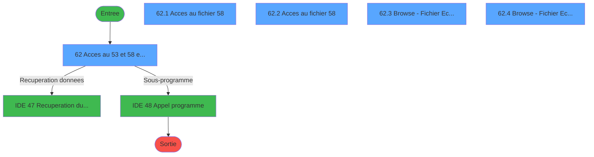
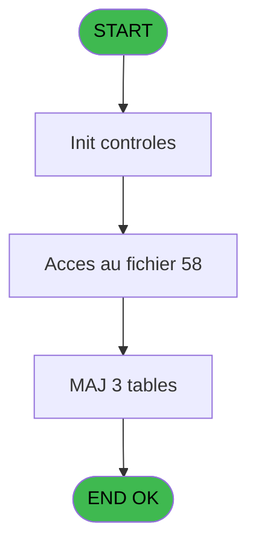
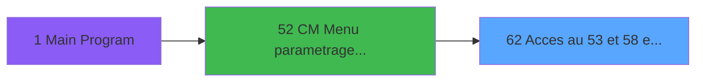
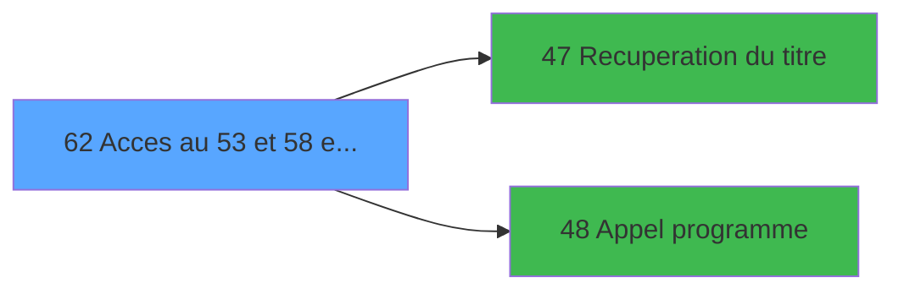

# MAI IDE 62 - Acces au 53 et 58 et 114

> **Analyse**: Phases 1-4 2026-02-03 14:58 -> 14:59 (10s) | Assemblage 14:59
> **Pipeline**: V7.2 Enrichi
> **Structure**: 4 onglets (Resume | Ecrans | Donnees | Connexions)

<!-- TAB:Resume -->

## 1. FICHE D'IDENTITE

| Attribut | Valeur |
|----------|--------|
| Projet | MAI |
| IDE Position | 62 |
| Nom Programme | Acces au 53 et 58 et 114 |
| Fichier source | `Prg_62.xml` |
| Dossier IDE | PME |
| Taches | 5 (5 ecrans visibles) |
| Tables modifiees | 3 |
| Programmes appeles | 2 |

## 2. DESCRIPTION FONCTIONNELLE

**Acces au 53 et 58 et 114** assure la gestion complete de ce processus, accessible depuis [CM  Menu parametrage caisse (IDE 52)](MAI-IDE-52.md).

Le flux de traitement s'organise en **1 blocs fonctionnels** :

- **Traitement** (5 taches) : traitements metier divers

**Donnees modifiees** : 3 tables en ecriture (commande_autocom_cot, codes_autocom____aut, fichier_echanges).

Detail : phases du traitement

#### Phase 1 : Traitement (5 taches)

- **62** - Acces au 53 et 58 et 114 **[[ECRAN]](#ecran-t1)**
- **62.1** - Acces au fichier 58 **[[ECRAN]](#ecran-t2)**
- **62.2** - Acces au fichier 58 **[[ECRAN]](#ecran-t3)**
- **62.3** - Browse - Fichier Echanges **[[ECRAN]](#ecran-t4)**
- **62.4** - Browse - Fichier Echanges **[[ECRAN]](#ecran-t7)**

Delegue a : [Recuperation du titre (IDE 47)](MAI-IDE-47.md), [Appel programme (IDE 48)](MAI-IDE-48.md)

#### Tables impactees

| Table | Operations | Role metier |
|-------|-----------|-------------|
| fichier_echanges | **W** (2 usages) |  |
| commande_autocom_cot | **W** (1 usages) |  |
| codes_autocom____aut | **W** (1 usages) |  |

## 3. BLOCS FONCTIONNELS

### 3.1 Traitement (5 taches)

Traitements internes.

---

#### 62 - Acces au 53 et 58 et 114 [[ECRAN]](#ecran-t1)

**Role** : Traitement : Acces au 53 et 58 et 114.
**Ecran** : 624 x 165 DLU (MDI) | [Voir mockup](#ecran-t1)

4 sous-taches directes

| Tache | Nom | Bloc |
|-------|-----|------|
| [62.1](#t2) | Acces au fichier 58 **[[ECRAN]](#ecran-t2)** | Traitement |
| [62.2](#t3) | Acces au fichier 58 **[[ECRAN]](#ecran-t3)** | Traitement |
| [62.3](#t4) | Browse - Fichier Echanges **[[ECRAN]](#ecran-t4)** | Traitement |
| [62.4](#t7) | Browse - Fichier Echanges **[[ECRAN]](#ecran-t7)** | Traitement |

**Delegue a** : [Recuperation du titre (IDE 47)](MAI-IDE-47.md), [Appel programme (IDE 48)](MAI-IDE-48.md)

---

#### 62.1 - Acces au fichier 58 [[ECRAN]](#ecran-t2)

**Role** : Traitement : Acces au fichier 58.
**Ecran** : 739 x 177 DLU (MDI) | [Voir mockup](#ecran-t2)
**Delegue a** : [Recuperation du titre (IDE 47)](MAI-IDE-47.md), [Appel programme (IDE 48)](MAI-IDE-48.md)

---

#### 62.2 - Acces au fichier 58 [[ECRAN]](#ecran-t3)

**Role** : Traitement : Acces au fichier 58.
**Ecran** : 672 x 176 DLU (MDI) | [Voir mockup](#ecran-t3)
**Delegue a** : [Recuperation du titre (IDE 47)](MAI-IDE-47.md), [Appel programme (IDE 48)](MAI-IDE-48.md)

---

#### 62.3 - Browse - Fichier Echanges [[ECRAN]](#ecran-t4)

**Role** : Traitement : Browse - Fichier Echanges.
**Ecran** : 1227 x 249 DLU (MDI) | [Voir mockup](#ecran-t4)
**Delegue a** : [Recuperation du titre (IDE 47)](MAI-IDE-47.md), [Appel programme (IDE 48)](MAI-IDE-48.md)

---

#### 62.4 - Browse - Fichier Echanges [[ECRAN]](#ecran-t7)

**Role** : Traitement : Browse - Fichier Echanges.
**Ecran** : 1591 x 249 DLU (MDI) | [Voir mockup](#ecran-t7)
**Delegue a** : [Recuperation du titre (IDE 47)](MAI-IDE-47.md), [Appel programme (IDE 48)](MAI-IDE-48.md)

## 5. REGLES METIER

*(Aucune regle metier identifiee)*

## 6. CONTEXTE

- **Appele par**: [CM  Menu parametrage caisse (IDE 52)](MAI-IDE-52.md)
- **Appelle**: 2 programmes | **Tables**: 3 (W:3 R:0 L:0) | **Taches**: 5 | **Expressions**: 10

<!-- TAB:Ecrans -->

## 8. ECRANS

### 8.1 Forms visibles (5 / 5)

| # | Position | Tache | Nom | Type | Largeur | Hauteur | Bloc |
|---|----------|-------|-----|------|---------|---------|------|
| 1 | 62 | 62 | Acces au 53 et 58 et 114 | MDI | 624 | 165 | Traitement |
| 2 | 62.1 | 62.1 | Acces au fichier 58 | MDI | 739 | 177 | Traitement |
| 3 | 62.2 | 62.2 | Acces au fichier 58 | MDI | 672 | 176 | Traitement |
| 4 | 62.3 | 62.3 | Browse - Fichier Echanges | MDI | 1227 | 249 | Traitement |
| 5 | 62.4 | 62.4 | Browse - Fichier Echanges | MDI | 1591 | 249 | Traitement |

### 8.2 Mockups Ecrans

---

#### 62 - Acces au 53 et 58 et 114
**Tache** : [62](#t1) | **Type** : MDI | **Dimensions** : 624 x 165 DLU
**Bloc** : Traitement | **Titre IDE** : Acces au 53 et 58 et 114

<!-- FORM-DATA:
{
    "width":  624,
    "vFactor":  8,
    "type":  "MDI",
    "hFactor":  8,
    "controls":  [
                     {
                         "x":  0,
                         "type":  "label",
                         "var":  "",
                         "y":  0,
                         "w":  619,
                         "fmt":  "",
                         "name":  "",
                         "h":  19,
                         "color":  "",
                         "text":  "",
                         "parent":  null
                     },
                     {
                         "x":  40,
                         "type":  "label",
                         "var":  "",
                         "y":  34,
                         "w":  540,
                         "fmt":  "",
                         "name":  "",
                         "h":  88,
                         "color":  "",
                         "text":  "",
                         "parent":  null
                     },
                     {
                         "x":  42,
                         "type":  "label",
                         "var":  "",
                         "y":  35,
                         "w":  537,
                         "fmt":  "",
                         "name":  "",
                         "h":  86,
                         "color":  "",
                         "text":  "",
                         "parent":  null
                     },
                     {
                         "x":  268,
                         "type":  "label",
                         "var":  "",
                         "y":  47,
                         "w":  279,
                         "fmt":  "",
                         "name":  "",
                         "h":  50,
                         "color":  "",
                         "text":  "",
                         "parent":  null
                     },
                     {
                         "x":  271,
                         "type":  "label",
                         "var":  "",
                         "y":  48,
                         "w":  45,
                         "fmt":  "",
                         "name":  "",
                         "h":  48,
                         "color":  "",
                         "text":  "",
                         "parent":  null
                     },
                     {
                         "x":  332,
                         "type":  "label",
                         "var":  "",
                         "y":  52,
                         "w":  197,
                         "fmt":  "",
                         "name":  "",
                         "h":  8,
                         "color":  "7",
                         "text":  "Acces au fichier 58",
                         "parent":  null
                     },
                     {
                         "x":  332,
                         "type":  "label",
                         "var":  "",
                         "y":  66,
                         "w":  197,
                         "fmt":  "",
                         "name":  "",
                         "h":  8,
                         "color":  "7",
                         "text":  "Acces au fichier 53",
                         "parent":  null
                     },
                     {
                         "x":  332,
                         "type":  "label",
                         "var":  "",
                         "y":  80,
                         "w":  208,
                         "fmt":  "",
                         "name":  "",
                         "h":  8,
                         "color":  "7",
                         "text":  "Acces au fichier 114",
                         "parent":  null
                     },
                     {
                         "x":  318,
                         "type":  "label",
                         "var":  "",
                         "y":  103,
                         "w":  113,
                         "fmt":  "",
                         "name":  "",
                         "h":  10,
                         "color":  "",
                         "text":  "Votre choix",
                         "parent":  null
                     },
                     {
                         "x":  0,
                         "type":  "label",
                         "var":  "",
                         "y":  138,
                         "w":  619,
                         "fmt":  "",
                         "name":  "",
                         "h":  24,
                         "color":  "",
                         "text":  "",
                         "parent":  null
                     },
                     {
                         "x":  436,
                         "type":  "edit",
                         "var":  "",
                         "y":  103,
                         "w":  26,
                         "fmt":  "",
                         "name":  "",
                         "h":  10,
                         "color":  "6",
                         "text":  "",
                         "parent":  null
                     },
                     {
                         "x":  409,
                         "type":  "edit",
                         "var":  "",
                         "y":  4,
                         "w":  203,
                         "fmt":  "WWW DD MMM YYYYT",
                         "name":  "",
                         "h":  8,
                         "color":  "",
                         "text":  "",
                         "parent":  null
                     },
                     {
                         "x":  64,
                         "type":  "image",
                         "var":  "",
                         "y":  47,
                         "w":  170,
                         "fmt":  "",
                         "name":  "",
                         "h":  55,
                         "color":  "",
                         "text":  "",
                         "parent":  5
                     },
                     {
                         "x":  282,
                         "type":  "button",
                         "var":  "",
                         "y":  51,
                         "w":  26,
                         "fmt":  "1",
                         "name":  "1",
                         "h":  8,
                         "color":  "",
                         "text":  "",
                         "parent":  null
                     },
                     {
                         "x":  282,
                         "type":  "button",
                         "var":  "",
                         "y":  66,
                         "w":  26,
                         "fmt":  "2",
                         "name":  "2",
                         "h":  8,
                         "color":  "",
                         "text":  "",
                         "parent":  null
                     },
                     {
                         "x":  282,
                         "type":  "button",
                         "var":  "",
                         "y":  80,
                         "w":  26,
                         "fmt":  "3",
                         "name":  "3",
                         "h":  8,
                         "color":  "",
                         "text":  "",
                         "parent":  null
                     },
                     {
                         "x":  6,
                         "type":  "button",
                         "var":  "",
                         "y":  142,
                         "w":  154,
                         "fmt":  "\u0026Quitter",
                         "name":  "\u0026Quitter",
                         "h":  18,
                         "color":  "",
                         "text":  "",
                         "parent":  null
                     },
                     {
                         "x":  6,
                         "type":  "edit",
                         "var":  "",
                         "y":  4,
                         "w":  267,
                         "fmt":  "20",
                         "name":  "",
                         "h":  8,
                         "color":  "",
                         "text":  "",
                         "parent":  null
                     }
                 ],
    "taskId":  "62",
    "height":  165
}
-->

<strong>Champs : 3 champs</strong>

| Pos (x,y) | Nom | Variable | Type |
|-----------|-----|----------|------|
| 436,103 | (sans nom) | - | edit |
| 409,4 | WWW DD MMM YYYYT | - | edit |
| 6,4 | 20 | - | edit |

<strong>Boutons : 4 boutons</strong>

| Bouton | Pos (x,y) | Action |
|--------|-----------|--------|
| 1 | 282,51 | Bouton fonctionnel |
| 2 | 282,66 | Bouton fonctionnel |
| 3 | 282,80 | Bouton fonctionnel |
| Quitter | 6,142 | Quitte le programme |

---

#### 62.1 - Acces au fichier 58
**Tache** : [62.1](#t2) | **Type** : MDI | **Dimensions** : 739 x 177 DLU
**Bloc** : Traitement | **Titre IDE** : Acces au fichier 58

<!-- FORM-DATA:
{
    "width":  739,
    "vFactor":  8,
    "type":  "MDI",
    "hFactor":  8,
    "controls":  [
                     {
                         "x":  2,
                         "type":  "label",
                         "var":  "",
                         "y":  0,
                         "w":  728,
                         "fmt":  "",
                         "name":  "",
                         "h":  19,
                         "color":  "",
                         "text":  "",
                         "parent":  null
                     },
                     {
                         "x":  11,
                         "type":  "table",
                         "var":  "",
                         "name":  "",
                         "titleH":  12,
                         "color":  "110",
                         "w":  717,
                         "y":  25,
                         "fmt":  "",
                         "parent":  null,
                         "text":  "",
                         "rowH":  16,
                         "h":  120,
                         "cols":  [
                                      {
                                          "title":  "N°",
                                          "layer":  1,
                                          "w":  48
                                      },
                                      {
                                          "title":  "Code",
                                          "layer":  2,
                                          "w":  121
                                      },
                                      {
                                          "title":  "Filiation",
                                          "layer":  3,
                                          "w":  82
                                      },
                                      {
                                          "title":  "Poste",
                                          "layer":  4,
                                          "w":  108
                                      },
                                      {
                                          "title":  "Ligne téléphone",
                                          "layer":  5,
                                          "w":  146
                                      },
                                      {
                                          "title":  "Code autocom",
                                          "layer":  6,
                                          "w":  129
                                      },
                                      {
                                          "title":  "Flag",
                                          "layer":  7,
                                          "w":  49
                                      }
                                  ],
                         "rows":  7
                     },
                     {
                         "x":  2,
                         "type":  "label",
                         "var":  "",
                         "y":  150,
                         "w":  728,
                         "fmt":  "",
                         "name":  "",
                         "h":  24,
                         "color":  "",
                         "text":  "",
                         "parent":  null
                     },
                     {
                         "x":  22,
                         "type":  "edit",
                         "var":  "",
                         "y":  41,
                         "w":  19,
                         "fmt":  "",
                         "name":  "",
                         "h":  8,
                         "color":  "110",
                         "text":  "",
                         "parent":  4
                     },
                     {
                         "x":  70,
                         "type":  "edit",
                         "var":  "",
                         "y":  41,
                         "w":  98,
                         "fmt":  "",
                         "name":  "",
                         "h":  8,
                         "color":  "110",
                         "text":  "",
                         "parent":  4
                     },
                     {
                         "x":  189,
                         "type":  "edit",
                         "var":  "",
                         "y":  41,
                         "w":  42,
                         "fmt":  "",
                         "name":  "",
                         "h":  8,
                         "color":  "110",
                         "text":  "",
                         "parent":  4
                     },
                     {
                         "x":  274,
                         "type":  "edit",
                         "var":  "",
                         "y":  41,
                         "w":  75,
                         "fmt":  "",
                         "name":  "",
                         "h":  8,
                         "color":  "110",
                         "text":  "",
                         "parent":  4
                     },
                     {
                         "x":  381,
                         "type":  "edit",
                         "var":  "",
                         "y":  41,
                         "w":  75,
                         "fmt":  "",
                         "name":  "",
                         "h":  8,
                         "color":  "110",
                         "text":  "",
                         "parent":  4
                     },
                     {
                         "x":  528,
                         "type":  "edit",
                         "var":  "",
                         "y":  41,
                         "w":  75,
                         "fmt":  "",
                         "name":  "",
                         "h":  8,
                         "color":  "110",
                         "text":  "",
                         "parent":  4
                     },
                     {
                         "x":  656,
                         "type":  "edit",
                         "var":  "",
                         "y":  41,
                         "w":  19,
                         "fmt":  "",
                         "name":  "",
                         "h":  8,
                         "color":  "110",
                         "text":  "",
                         "parent":  4
                     },
                     {
                         "x":  518,
                         "type":  "edit",
                         "var":  "",
                         "y":  4,
                         "w":  203,
                         "fmt":  "WWW DD MMM YYYYT",
                         "name":  "",
                         "h":  8,
                         "color":  "",
                         "text":  "",
                         "parent":  null
                     },
                     {
                         "x":  6,
                         "type":  "button",
                         "var":  "",
                         "y":  154,
                         "w":  154,
                         "fmt":  "\u0026Quitter",
                         "name":  "",
                         "h":  18,
                         "color":  "",
                         "text":  "",
                         "parent":  null
                     },
                     {
                         "x":  8,
                         "type":  "edit",
                         "var":  "",
                         "y":  4,
                         "w":  267,
                         "fmt":  "20",
                         "name":  "",
                         "h":  8,
                         "color":  "",
                         "text":  "",
                         "parent":  null
                     }
                 ],
    "taskId":  "62.1",
    "height":  177
}
-->

<strong>Champs : 9 champs</strong>

| Pos (x,y) | Nom | Variable | Type |
|-----------|-----|----------|------|
| 22,41 | (sans nom) | - | edit |
| 70,41 | (sans nom) | - | edit |
| 189,41 | (sans nom) | - | edit |
| 274,41 | (sans nom) | - | edit |
| 381,41 | (sans nom) | - | edit |
| 528,41 | (sans nom) | - | edit |
| 656,41 | (sans nom) | - | edit |
| 518,4 | WWW DD MMM YYYYT | - | edit |
| 8,4 | 20 | - | edit |

<strong>Boutons : 1 boutons</strong>

| Bouton | Pos (x,y) | Action |
|--------|-----------|--------|
| Quitter | 6,154 | Quitte le programme |

---

#### 62.2 - Acces au fichier 58
**Tache** : [62.2](#t3) | **Type** : MDI | **Dimensions** : 672 x 176 DLU
**Bloc** : Traitement | **Titre IDE** : Acces au fichier 58

<!-- FORM-DATA:
{
    "width":  672,
    "vFactor":  8,
    "type":  "MDI",
    "hFactor":  8,
    "controls":  [
                     {
                         "x":  1,
                         "type":  "label",
                         "var":  "",
                         "y":  0,
                         "w":  664,
                         "fmt":  "",
                         "name":  "",
                         "h":  19,
                         "color":  "",
                         "text":  "",
                         "parent":  null
                     },
                     {
                         "x":  26,
                         "type":  "table",
                         "var":  "",
                         "name":  "",
                         "titleH":  12,
                         "color":  "110",
                         "w":  621,
                         "y":  26,
                         "fmt":  "",
                         "parent":  null,
                         "text":  "",
                         "rowH":  15,
                         "h":  116,
                         "cols":  [
                                      {
                                          "title":  "Action",
                                          "layer":  1,
                                          "w":  66
                                      },
                                      {
                                          "title":  "Opération",
                                          "layer":  2,
                                          "w":  91
                                      },
                                      {
                                          "title":  "Nom ASCII",
                                          "layer":  3,
                                          "w":  163
                                      },
                                      {
                                          "title":  "Date",
                                          "layer":  4,
                                          "w":  146
                                      },
                                      {
                                          "title":  "Heure",
                                          "layer":  5,
                                          "w":  118
                                      }
                                  ],
                         "rows":  5
                     },
                     {
                         "x":  1,
                         "type":  "label",
                         "var":  "",
                         "y":  150,
                         "w":  665,
                         "fmt":  "",
                         "name":  "",
                         "h":  24,
                         "color":  "",
                         "text":  "",
                         "parent":  null
                     },
                     {
                         "x":  42,
                         "type":  "edit",
                         "var":  "",
                         "y":  42,
                         "w":  19,
                         "fmt":  "",
                         "name":  "",
                         "h":  8,
                         "color":  "110",
                         "text":  "",
                         "parent":  4
                     },
                     {
                         "x":  106,
                         "type":  "edit",
                         "var":  "",
                         "y":  42,
                         "w":  19,
                         "fmt":  "",
                         "name":  "",
                         "h":  8,
                         "color":  "110",
                         "text":  "",
                         "parent":  4
                     },
                     {
                         "x":  192,
                         "type":  "edit",
                         "var":  "",
                         "y":  42,
                         "w":  142,
                         "fmt":  "",
                         "name":  "",
                         "h":  8,
                         "color":  "110",
                         "text":  "",
                         "parent":  4
                     },
                     {
                         "x":  355,
                         "type":  "edit",
                         "var":  "",
                         "y":  42,
                         "w":  120,
                         "fmt":  "##/##/####T",
                         "name":  "",
                         "h":  8,
                         "color":  "110",
                         "text":  "",
                         "parent":  4
                     },
                     {
                         "x":  502,
                         "type":  "edit",
                         "var":  "",
                         "y":  42,
                         "w":  98,
                         "fmt":  "",
                         "name":  "",
                         "h":  8,
                         "color":  "110",
                         "text":  "",
                         "parent":  4
                     },
                     {
                         "x":  458,
                         "type":  "edit",
                         "var":  "",
                         "y":  4,
                         "w":  203,
                         "fmt":  "WWW DD MMM YYYYT",
                         "name":  "",
                         "h":  8,
                         "color":  "",
                         "text":  "",
                         "parent":  null
                     },
                     {
                         "x":  7,
                         "type":  "button",
                         "var":  "",
                         "y":  154,
                         "w":  154,
                         "fmt":  "\u0026Quitter",
                         "name":  "",
                         "h":  18,
                         "color":  "",
                         "text":  "",
                         "parent":  null
                     },
                     {
                         "x":  7,
                         "type":  "edit",
                         "var":  "",
                         "y":  4,
                         "w":  267,
                         "fmt":  "20",
                         "name":  "",
                         "h":  8,
                         "color":  "",
                         "text":  "",
                         "parent":  null
                     }
                 ],
    "taskId":  "62.2",
    "height":  176
}
-->

<strong>Champs : 7 champs</strong>

| Pos (x,y) | Nom | Variable | Type |
|-----------|-----|----------|------|
| 42,42 | (sans nom) | - | edit |
| 106,42 | (sans nom) | - | edit |
| 192,42 | (sans nom) | - | edit |
| 355,42 | ##/##/####T | - | edit |
| 502,42 | (sans nom) | - | edit |
| 458,4 | WWW DD MMM YYYYT | - | edit |
| 7,4 | 20 | - | edit |

<strong>Boutons : 1 boutons</strong>

| Bouton | Pos (x,y) | Action |
|--------|-----------|--------|
| Quitter | 7,154 | Quitte le programme |

---

#### 62.3 - Browse - Fichier Echanges
**Tache** : [62.3](#t4) | **Type** : MDI | **Dimensions** : 1227 x 249 DLU
**Bloc** : Traitement | **Titre IDE** : Browse - Fichier Echanges

<!-- FORM-DATA:
{
    "width":  1227,
    "vFactor":  8,
    "type":  "MDI",
    "hFactor":  8,
    "controls":  [
                     {
                         "x":  1,
                         "type":  "label",
                         "var":  "",
                         "y":  1,
                         "w":  1213,
                         "fmt":  "",
                         "name":  "",
                         "h":  19,
                         "color":  "",
                         "text":  "",
                         "parent":  null
                     },
                     {
                         "x":  1,
                         "type":  "table",
                         "var":  "",
                         "name":  "",
                         "titleH":  12,
                         "color":  "110",
                         "w":  1221,
                         "y":  37,
                         "fmt":  "",
                         "parent":  null,
                         "text":  "",
                         "rowH":  32,
                         "h":  174,
                         "cols":  [
                                      {
                                          "title":  "Date Traitement",
                                          "layer":  1,
                                          "w":  132
                                      },
                                      {
                                          "title":  "Heure Traitement",
                                          "layer":  2,
                                          "w":  155
                                      },
                                      {
                                          "title":  "Date jour",
                                          "layer":  3,
                                          "w":  131
                                      },
                                      {
                                          "title":  "Heure Jour",
                                          "layer":  4,
                                          "w":  121
                                      },
                                      {
                                          "title":  "N° Terminal",
                                          "layer":  5,
                                          "w":  111
                                      },
                                      {
                                          "title":  "Code",
                                          "layer":  6,
                                          "w":  71
                                      },
                                      {
                                          "title":  "Essais",
                                          "layer":  7,
                                          "w":  74
                                      },
                                      {
                                          "title":  "Commande",
                                          "layer":  8,
                                          "w":  393
                                      }
                                  ],
                         "rows":  8
                     },
                     {
                         "x":  1,
                         "type":  "label",
                         "var":  "",
                         "y":  221,
                         "w":  1221,
                         "fmt":  "",
                         "name":  "",
                         "h":  24,
                         "color":  "",
                         "text":  "",
                         "parent":  null
                     },
                     {
                         "x":  6,
                         "type":  "edit",
                         "var":  "",
                         "y":  59,
                         "w":  120,
                         "fmt":  "##/##/####T",
                         "name":  "",
                         "h":  8,
                         "color":  "110",
                         "text":  "",
                         "parent":  4
                     },
                     {
                         "x":  142,
                         "type":  "edit",
                         "var":  "",
                         "y":  59,
                         "w":  98,
                         "fmt":  "",
                         "name":  "",
                         "h":  8,
                         "color":  "110",
                         "text":  "",
                         "parent":  4
                     },
                     {
                         "x":  296,
                         "type":  "edit",
                         "var":  "",
                         "y":  59,
                         "w":  120,
                         "fmt":  "##/##/####T",
                         "name":  "",
                         "h":  8,
                         "color":  "110",
                         "text":  "",
                         "parent":  4
                     },
                     {
                         "x":  429,
                         "type":  "edit",
                         "var":  "",
                         "y":  59,
                         "w":  98,
                         "fmt":  "",
                         "name":  "",
                         "h":  8,
                         "color":  "110",
                         "text":  "",
                         "parent":  4
                     },
                     {
                         "x":  550,
                         "type":  "edit",
                         "var":  "",
                         "y":  59,
                         "w":  42,
                         "fmt":  "",
                         "name":  "",
                         "h":  8,
                         "color":  "110",
                         "text":  "",
                         "parent":  4
                     },
                     {
                         "x":  662,
                         "type":  "edit",
                         "var":  "",
                         "y":  59,
                         "w":  30,
                         "fmt":  "",
                         "name":  "",
                         "h":  8,
                         "color":  "110",
                         "text":  "",
                         "parent":  4
                     },
                     {
                         "x":  733,
                         "type":  "edit",
                         "var":  "",
                         "y":  59,
                         "w":  30,
                         "fmt":  "",
                         "name":  "",
                         "h":  8,
                         "color":  "110",
                         "text":  "",
                         "parent":  4
                     },
                     {
                         "x":  805,
                         "type":  "edit",
                         "var":  "",
                         "y":  52,
                         "w":  367,
                         "fmt":  "",
                         "name":  "",
                         "h":  27,
                         "color":  "110",
                         "text":  "",
                         "parent":  4
                     },
                     {
                         "x":  1005,
                         "type":  "edit",
                         "var":  "",
                         "y":  6,
                         "w":  203,
                         "fmt":  "WWW DD MMM YYYYT",
                         "name":  "",
                         "h":  8,
                         "color":  "",
                         "text":  "",
                         "parent":  null
                     },
                     {
                         "x":  7,
                         "type":  "button",
                         "var":  "",
                         "y":  224,
                         "w":  152,
                         "fmt":  "\u0026Quitter",
                         "name":  "",
                         "h":  18,
                         "color":  "",
                         "text":  "",
                         "parent":  null
                     },
                     {
                         "x":  7,
                         "type":  "edit",
                         "var":  "",
                         "y":  5,
                         "w":  267,
                         "fmt":  "20",
                         "name":  "",
                         "h":  8,
                         "color":  "",
                         "text":  "",
                         "parent":  null
                     }
                 ],
    "taskId":  "62.3",
    "height":  249
}
-->

<strong>Champs : 10 champs</strong>

| Pos (x,y) | Nom | Variable | Type |
|-----------|-----|----------|------|
| 6,59 | ##/##/####T | - | edit |
| 142,59 | (sans nom) | - | edit |
| 296,59 | ##/##/####T | - | edit |
| 429,59 | (sans nom) | - | edit |
| 550,59 | (sans nom) | - | edit |
| 662,59 | (sans nom) | - | edit |
| 733,59 | (sans nom) | - | edit |
| 805,52 | (sans nom) | - | edit |
| 1005,6 | WWW DD MMM YYYYT | - | edit |
| 7,5 | 20 | - | edit |

<strong>Boutons : 1 boutons</strong>

| Bouton | Pos (x,y) | Action |
|--------|-----------|--------|
| Quitter | 7,224 | Quitte le programme |

---

#### 62.4 - Browse - Fichier Echanges
**Tache** : [62.4](#t7) | **Type** : MDI | **Dimensions** : 1591 x 249 DLU
**Bloc** : Traitement | **Titre IDE** : Browse - Fichier Echanges

<!-- FORM-DATA:
{
    "width":  1591,
    "vFactor":  8,
    "type":  "MDI",
    "hFactor":  8,
    "controls":  [
                     {
                         "x":  1,
                         "type":  "label",
                         "var":  "",
                         "y":  1,
                         "w":  1578,
                         "fmt":  "",
                         "name":  "",
                         "h":  19,
                         "color":  "",
                         "text":  "",
                         "parent":  null
                     },
                     {
                         "x":  1,
                         "type":  "table",
                         "var":  "",
                         "name":  "",
                         "titleH":  12,
                         "color":  "110",
                         "w":  1578,
                         "y":  37,
                         "fmt":  "",
                         "parent":  null,
                         "text":  "",
                         "rowH":  32,
                         "h":  174,
                         "cols":  [
                                      {
                                          "title":  "Date Traitement",
                                          "layer":  1,
                                          "w":  132
                                      },
                                      {
                                          "title":  "Heure Traitement",
                                          "layer":  2,
                                          "w":  155
                                      },
                                      {
                                          "title":  "Date jour",
                                          "layer":  3,
                                          "w":  131
                                      },
                                      {
                                          "title":  "Heure Jour",
                                          "layer":  4,
                                          "w":  121
                                      },
                                      {
                                          "title":  "N° Terminal",
                                          "layer":  5,
                                          "w":  111
                                      },
                                      {
                                          "title":  "Ordinateur",
                                          "layer":  6,
                                          "w":  344
                                      },
                                      {
                                          "title":  "Code",
                                          "layer":  7,
                                          "w":  71
                                      },
                                      {
                                          "title":  "Essais",
                                          "layer":  8,
                                          "w":  74
                                      },
                                      {
                                          "title":  "Commande",
                                          "layer":  9,
                                          "w":  393
                                      }
                                  ],
                         "rows":  9
                     },
                     {
                         "x":  1,
                         "type":  "label",
                         "var":  "",
                         "y":  221,
                         "w":  1578,
                         "fmt":  "",
                         "name":  "",
                         "h":  24,
                         "color":  "",
                         "text":  "",
                         "parent":  null
                     },
                     {
                         "x":  6,
                         "type":  "edit",
                         "var":  "",
                         "y":  59,
                         "w":  120,
                         "fmt":  "##/##/####T",
                         "name":  "",
                         "h":  8,
                         "color":  "110",
                         "text":  "",
                         "parent":  4
                     },
                     {
                         "x":  142,
                         "type":  "edit",
                         "var":  "",
                         "y":  59,
                         "w":  98,
                         "fmt":  "",
                         "name":  "",
                         "h":  8,
                         "color":  "110",
                         "text":  "",
                         "parent":  4
                     },
                     {
                         "x":  296,
                         "type":  "edit",
                         "var":  "",
                         "y":  59,
                         "w":  120,
                         "fmt":  "##/##/####T",
                         "name":  "",
                         "h":  8,
                         "color":  "110",
                         "text":  "",
                         "parent":  4
                     },
                     {
                         "x":  429,
                         "type":  "edit",
                         "var":  "",
                         "y":  59,
                         "w":  98,
                         "fmt":  "",
                         "name":  "",
                         "h":  8,
                         "color":  "110",
                         "text":  "",
                         "parent":  4
                     },
                     {
                         "x":  550,
                         "type":  "edit",
                         "var":  "",
                         "y":  59,
                         "w":  42,
                         "fmt":  "",
                         "name":  "",
                         "h":  8,
                         "color":  "110",
                         "text":  "",
                         "parent":  4
                     },
                     {
                         "x":  1006,
                         "type":  "edit",
                         "var":  "",
                         "y":  59,
                         "w":  30,
                         "fmt":  "",
                         "name":  "",
                         "h":  8,
                         "color":  "110",
                         "text":  "",
                         "parent":  4
                     },
                     {
                         "x":  1077,
                         "type":  "edit",
                         "var":  "",
                         "y":  59,
                         "w":  30,
                         "fmt":  "",
                         "name":  "",
                         "h":  8,
                         "color":  "110",
                         "text":  "",
                         "parent":  4
                     },
                     {
                         "x":  1149,
                         "type":  "edit",
                         "var":  "",
                         "y":  52,
                         "w":  367,
                         "fmt":  "",
                         "name":  "",
                         "h":  27,
                         "color":  "110",
                         "text":  "",
                         "parent":  4
                     },
                     {
                         "x":  1370,
                         "type":  "edit",
                         "var":  "",
                         "y":  6,
                         "w":  203,
                         "fmt":  "WWW DD MMM YYYYT",
                         "name":  "",
                         "h":  8,
                         "color":  "",
                         "text":  "",
                         "parent":  null
                     },
                     {
                         "x":  7,
                         "type":  "button",
                         "var":  "",
                         "y":  224,
                         "w":  152,
                         "fmt":  "\u0026Quitter",
                         "name":  "",
                         "h":  18,
                         "color":  "",
                         "text":  "",
                         "parent":  null
                     },
                     {
                         "x":  7,
                         "type":  "edit",
                         "var":  "",
                         "y":  5,
                         "w":  267,
                         "fmt":  "20",
                         "name":  "",
                         "h":  8,
                         "color":  "",
                         "text":  "",
                         "parent":  null
                     },
                     {
                         "x":  655,
                         "type":  "edit",
                         "var":  "",
                         "y":  57,
                         "w":  334,
                         "fmt":  "",
                         "name":  "hostname_fe",
                         "h":  10,
                         "color":  "110",
                         "text":  "",
                         "parent":  4
                     }
                 ],
    "taskId":  "62.4",
    "height":  249
}
-->

<strong>Champs : 11 champs</strong>

| Pos (x,y) | Nom | Variable | Type |
|-----------|-----|----------|------|
| 6,59 | ##/##/####T | - | edit |
| 142,59 | (sans nom) | - | edit |
| 296,59 | ##/##/####T | - | edit |
| 429,59 | (sans nom) | - | edit |
| 550,59 | (sans nom) | - | edit |
| 1006,59 | (sans nom) | - | edit |
| 1077,59 | (sans nom) | - | edit |
| 1149,52 | (sans nom) | - | edit |
| 1370,6 | WWW DD MMM YYYYT | - | edit |
| 7,5 | 20 | - | edit |
| 655,57 | hostname_fe | - | edit |

<strong>Boutons : 1 boutons</strong>

| Bouton | Pos (x,y) | Action |
|--------|-----------|--------|
| Quitter | 7,224 | Quitte le programme |

## 9. NAVIGATION

### 9.1 Enchainement des ecrans

**Detail par enchainement :**

| Depuis | Action | Vers | Retour |
|--------|--------|------|--------|
| Acces au 53 et 58 et 114 | Recuperation donnees | [Recuperation du titre (IDE 47)](MAI-IDE-47.md) | Retour ecran |
| Acces au 53 et 58 et 114 | Sous-programme | [Appel programme (IDE 48)](MAI-IDE-48.md) | Retour ecran |

### 9.3 Structure hierarchique (5 taches)

| Position | Tache | Type | Dimensions | Bloc |
|----------|-------|------|------------|------|
| **62.1** | [**Acces au 53 et 58 et 114** (62)](#t1) [mockup](#ecran-t1) | MDI | 624x165 | Traitement |
| 62.1.1 | [Acces au fichier 58 (62.1)](#t2) [mockup](#ecran-t2) | MDI | 739x177 | |
| 62.1.2 | [Acces au fichier 58 (62.2)](#t3) [mockup](#ecran-t3) | MDI | 672x176 | |
| 62.1.3 | [Browse - Fichier Echanges (62.3)](#t4) [mockup](#ecran-t4) | MDI | 1227x249 | |
| 62.1.4 | [Browse - Fichier Echanges (62.4)](#t7) [mockup](#ecran-t7) | MDI | 1591x249 | |

### 9.4 Algorigramme

> **Legende**: Vert = START/END OK | Rouge = END KO | Bleu = Decisions
> *Algorigramme auto-genere. Utiliser `/algorigramme` pour une synthese metier detaillee.*

<!-- TAB:Donnees -->

## 10. TABLES

### Tables utilisees (3)

| ID | Nom | Description | Type | R | W | L | Usages |
|----|-----|-------------|------|---|---|---|--------|
| 75 | commande_autocom_cot |  | DB |   | **W** |   | 1 |
| 80 | codes_autocom____aut |  | DB |   | **W** |   | 1 |
| 136 | fichier_echanges |  | DB |   | **W** |   | 2 |

### Colonnes par table (0 / 3 tables avec colonnes identifiees)

Table 75 - commande_autocom_cot (**W**) - 1 usages

*Table utilisee uniquement en Link ou aucune colonne Real identifiee dans le DataView.*

Table 80 - codes_autocom____aut (**W**) - 1 usages

*Table utilisee uniquement en Link ou aucune colonne Real identifiee dans le DataView.*

Table 136 - fichier_echanges (**W**) - 2 usages

*Table utilisee uniquement en Link ou aucune colonne Real identifiee dans le DataView.*

## 11. VARIABLES

### 11.1 Variables de session (1)

Variables persistantes pendant toute la session.

| Lettre | Nom | Type | Usage dans |
|--------|-----|------|-----------|
| A | v. titre ecran | Alpha | 1x session |

### 11.2 Variables de travail (1)

Variables internes au programme.

| Lettre | Nom | Type | Usage dans |
|--------|-----|------|-----------|
| B | W0 choix | Alpha | 3x calcul interne |

## 12. EXPRESSIONS

**10 / 10 expressions decodees (100%)**

### 12.1 Repartition par type

| Type | Expressions | Regles |
|------|-------------|--------|
| CONSTANTE | 2 | 0 |
| DATE | 1 | 0 |
| REFERENCE_VG | 2 | 0 |
| CONDITION | 3 | 0 |
| NEGATION | 1 | 0 |
| STRING | 1 | 0 |

### 12.2 Expressions cles par type

#### CONSTANTE (2 expressions)

| Type | IDE | Expression | Regle |
|------|-----|------------|-------|
| CONSTANTE | 5 | `''` | - |
| CONSTANTE | 2 | `19` | - |

#### DATE (1 expressions)

| Type | IDE | Expression | Regle |
|------|-----|------------|-------|
| DATE | 3 | `Date ()` | - |

#### REFERENCE_VG (2 expressions)

| Type | IDE | Expression | Regle |
|------|-----|------------|-------|
| REFERENCE_VG | 10 | `VG9` | - |
| REFERENCE_VG | 4 | `VG2` | - |

#### CONDITION (3 expressions)

| Type | IDE | Expression | Regle |
|------|-----|------------|-------|
| CONDITION | 8 | `W0 choix [B]='3'` | - |
| CONDITION | 7 | `W0 choix [B]='2'` | - |
| CONDITION | 6 | `W0 choix [B]='1'` | - |

#### NEGATION (1 expressions)

| Type | IDE | Expression | Regle |
|------|-----|------------|-------|
| NEGATION | 9 | `NOT VG9` | - |

#### STRING (1 expressions)

| Type | IDE | Expression | Regle |
|------|-----|------------|-------|
| STRING | 1 | `Trim (v. titre ecran [A])` | - |

<!-- TAB:Connexions -->

## 13. GRAPHE D'APPELS

### 13.1 Chaine depuis Main (Callers)

Main -> ... -> [CM  Menu parametrage caisse (IDE 52)](MAI-IDE-52.md) -> **Acces au 53 et 58 et 114 (IDE 62)**

### 13.2 Callers

| IDE | Nom Programme | Nb Appels |
|-----|---------------|-----------|
| [52](MAI-IDE-52.md) | CM  Menu parametrage caisse | 1 |

### 13.3 Callees (programmes appeles)

### 13.4 Detail Callees avec contexte

| IDE | Nom Programme | Appels | Contexte |
|-----|---------------|--------|----------|
| [47](MAI-IDE-47.md) | Recuperation du titre | 5 | Recuperation donnees |
| [48](MAI-IDE-48.md) | Appel programme | 1 | Sous-programme |

## 14. RECOMMANDATIONS MIGRATION

### 14.1 Profil du programme

| Metrique | Valeur | Impact migration |
|----------|--------|-----------------|
| Lignes de logique | 52 | Programme compact |
| Expressions | 10 | Peu de logique |
| Tables WRITE | 3 | Impact modere |
| Sous-programmes | 2 | Peu de dependances |
| Ecrans visibles | 5 | Quelques ecrans |
| Code desactive | 0% (0 / 52) | Code sain |
| Regles metier | 0 | Pas de regle identifiee |

### 14.2 Plan de migration par bloc

#### Traitement (5 taches: 5 ecrans, 0 traitement)

- **Strategie** : 5 composant(s) UI (Razor/React) avec formulaires et validation.
- 2 sous-programme(s) a migrer ou a reutiliser depuis les services existants.
- Decomposer les taches en services unitaires testables.

### 14.3 Dependances critiques

| Dependance | Type | Appels | Impact |
|------------|------|--------|--------|
| commande_autocom_cot | Table WRITE (Database) | 1x | Schema + repository |
| codes_autocom____aut | Table WRITE (Database) | 1x | Schema + repository |
| fichier_echanges | Table WRITE (Database) | 2x | Schema + repository |
| [Recuperation du titre (IDE 47)](MAI-IDE-47.md) | Sous-programme | 5x | **CRITIQUE** - Recuperation donnees |
| [Appel programme (IDE 48)](MAI-IDE-48.md) | Sous-programme | 1x | Normale - Sous-programme |

---
*Spec DETAILED generee par Pipeline V7.2 - 2026-02-03 14:59*
