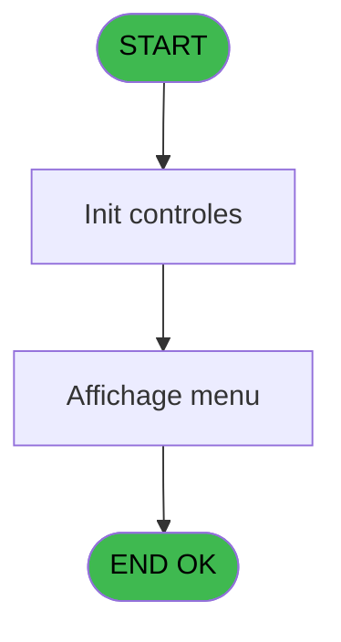
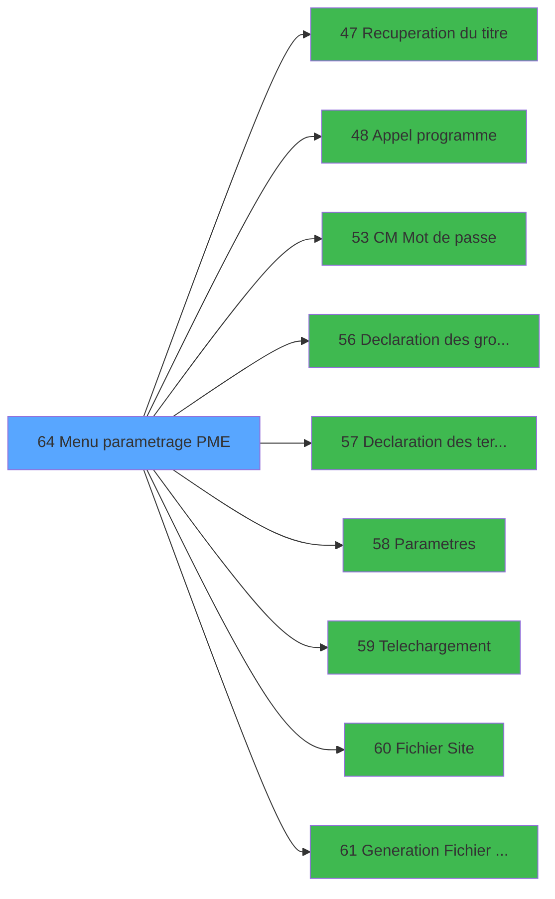

# MAI IDE 64 - Menu parametrage PME

> **Analyse**: Phases 1-4 2026-02-03 14:59 -> 14:59 (10s) | Assemblage 14:59
> **Pipeline**: V7.2 Enrichi
> **Structure**: 4 onglets (Resume | Ecrans | Donnees | Connexions)

<!-- TAB:Resume -->

## 1. FICHE D'IDENTITE

| Attribut | Valeur |
|----------|--------|
| Projet | MAI |
| IDE Position | 64 |
| Nom Programme | Menu parametrage PME |
| Fichier source | `Prg_64.xml` |
| Dossier IDE | Printer |
| Taches | 2 (1 ecrans visibles) |
| Tables modifiees | 0 |
| Programmes appeles | 9 |

## 2. DESCRIPTION FONCTIONNELLE

**Menu parametrage PME** assure la gestion complete de ce processus, accessible depuis [CM  Menu parametrage caisse (IDE 52)](MAI-IDE-52.md).

Le flux de traitement s'organise en **2 blocs fonctionnels** :

- **Consultation** (1 tache) : ecrans de recherche, selection et consultation
- **Traitement** (1 tache) : traitements metier divers

Detail : phases du traitement

#### Phase 1 : Traitement (1 tache)

- **64** - CV  Menu parametrage tel **[[ECRAN]](#ecran-t1)**

Delegue a : [Recuperation du titre (IDE 47)](MAI-IDE-47.md), [Appel programme (IDE 48)](MAI-IDE-48.md), [CM  Mot de passe (IDE 53)](MAI-IDE-53.md), [Declaration des groupes (IDE 56)](MAI-IDE-56.md), [Declaration des terminaux (IDE 57)](MAI-IDE-57.md), [Parametres (IDE 58)](MAI-IDE-58.md), [Telechargement (IDE 59)](MAI-IDE-59.md), [Fichier Site (IDE 60)](MAI-IDE-60.md), [Generation Fichier Site (IDE 61)](MAI-IDE-61.md)

#### Phase 2 : Consultation (1 tache)

- **64.1** - Affichage menu **[[ECRAN]](#ecran-t2)**

Delegue a : [Recuperation du titre (IDE 47)](MAI-IDE-47.md)

## 3. BLOCS FONCTIONNELS

### 3.1 Traitement (1 tache)

Traitements internes.

---

#### 64 - CV  Menu parametrage tel [[ECRAN]](#ecran-t1)

**Role** : Traitement : CV  Menu parametrage tel.
**Ecran** : 640 x 72 DLU (MDI) | [Voir mockup](#ecran-t1)
**Delegue a** : [Recuperation du titre (IDE 47)](MAI-IDE-47.md), [Appel programme (IDE 48)](MAI-IDE-48.md), [CM  Mot de passe (IDE 53)](MAI-IDE-53.md)

### 3.2 Consultation (1 tache)

Ecrans de recherche et consultation.

---

#### 64.1 - Affichage menu [[ECRAN]](#ecran-t2)

**Role** : Reinitialisation : Affichage menu.
**Ecran** : 718 x 191 DLU (MDI) | [Voir mockup](#ecran-t2)

## 5. REGLES METIER

*(Aucune regle metier identifiee)*

## 6. CONTEXTE

- **Appele par**: [CM  Menu parametrage caisse (IDE 52)](MAI-IDE-52.md)
- **Appelle**: 9 programmes | **Tables**: 0 (W:0 R:0 L:0) | **Taches**: 2 | **Expressions**: 7

<!-- TAB:Ecrans -->

## 8. ECRANS

### 8.1 Forms visibles (1 / 2)

| # | Position | Tache | Nom | Type | Largeur | Hauteur | Bloc |
|---|----------|-------|-----|------|---------|---------|------|
| 1 | 64.1 | 64.1 | Affichage menu | MDI | 718 | 191 | Consultation |

### 8.2 Mockups Ecrans

---

#### 64.1 - Affichage menu
**Tache** : [64.1](#t2) | **Type** : MDI | **Dimensions** : 718 x 191 DLU
**Bloc** : Consultation | **Titre IDE** : Affichage menu

<!-- FORM-DATA:
{
    "width":  718,
    "vFactor":  8,
    "type":  "MDI",
    "hFactor":  8,
    "controls":  [
                     {
                         "x":  0,
                         "type":  "label",
                         "var":  "",
                         "y":  0,
                         "w":  715,
                         "fmt":  "",
                         "name":  "",
                         "h":  19,
                         "color":  "",
                         "text":  "",
                         "parent":  null
                     },
                     {
                         "x":  20,
                         "type":  "label",
                         "var":  "",
                         "y":  32,
                         "w":  675,
                         "fmt":  "",
                         "name":  "",
                         "h":  126,
                         "color":  "",
                         "text":  "",
                         "parent":  null
                     },
                     {
                         "x":  22,
                         "type":  "label",
                         "var":  "",
                         "y":  33,
                         "w":  670,
                         "fmt":  "",
                         "name":  "",
                         "h":  124,
                         "color":  "",
                         "text":  "",
                         "parent":  null
                     },
                     {
                         "x":  255,
                         "type":  "label",
                         "var":  "",
                         "y":  43,
                         "w":  399,
                         "fmt":  "",
                         "name":  "",
                         "h":  93,
                         "color":  "",
                         "text":  "",
                         "parent":  null
                     },
                     {
                         "x":  258,
                         "type":  "label",
                         "var":  "",
                         "y":  44,
                         "w":  45,
                         "fmt":  "",
                         "name":  "",
                         "h":  91,
                         "color":  "",
                         "text":  "",
                         "parent":  null
                     },
                     {
                         "x":  319,
                         "type":  "label",
                         "var":  "",
                         "y":  50,
                         "w":  326,
                         "fmt":  "",
                         "name":  "",
                         "h":  8,
                         "color":  "7",
                         "text":  "Declaration des groupes",
                         "parent":  null
                     },
                     {
                         "x":  319,
                         "type":  "label",
                         "var":  "",
                         "y":  64,
                         "w":  326,
                         "fmt":  "",
                         "name":  "",
                         "h":  8,
                         "color":  "7",
                         "text":  "Declaration des terminaux",
                         "parent":  null
                     },
                     {
                         "x":  319,
                         "type":  "label",
                         "var":  "",
                         "y":  78,
                         "w":  326,
                         "fmt":  "",
                         "name":  "",
                         "h":  8,
                         "color":  "7",
                         "text":  "Paramètres",
                         "parent":  null
                     },
                     {
                         "x":  319,
                         "type":  "label",
                         "var":  "",
                         "y":  92,
                         "w":  326,
                         "fmt":  "",
                         "name":  "",
                         "h":  8,
                         "color":  "7",
                         "text":  "Telechargement Point de Vente",
                         "parent":  null
                     },
                     {
                         "x":  319,
                         "type":  "label",
                         "var":  "",
                         "y":  106,
                         "w":  326,
                         "fmt":  "",
                         "name":  "",
                         "h":  8,
                         "color":  "7",
                         "text":  "Telechargement Guichet",
                         "parent":  null
                     },
                     {
                         "x":  319,
                         "type":  "label",
                         "var":  "",
                         "y":  120,
                         "w":  326,
                         "fmt":  "",
                         "name":  "",
                         "h":  8,
                         "color":  "7",
                         "text":  "Fichier Site(Collecte automatique)",
                         "parent":  null
                     },
                     {
                         "x":  365,
                         "type":  "label",
                         "var":  "",
                         "y":  141,
                         "w":  123,
                         "fmt":  "",
                         "name":  "",
                         "h":  10,
                         "color":  "",
                         "text":  "Votre choix",
                         "parent":  null
                     },
                     {
                         "x":  0,
                         "type":  "label",
                         "var":  "",
                         "y":  164,
                         "w":  715,
                         "fmt":  "",
                         "name":  "",
                         "h":  24,
                         "color":  "",
                         "text":  "",
                         "parent":  null
                     },
                     {
                         "x":  499,
                         "type":  "edit",
                         "var":  "",
                         "y":  141,
                         "w":  26,
                         "fmt":  "",
                         "name":  "",
                         "h":  10,
                         "color":  "6",
                         "text":  "",
                         "parent":  null
                     },
                     {
                         "x":  6,
                         "type":  "edit",
                         "var":  "",
                         "y":  4,
                         "w":  267,
                         "fmt":  "20",
                         "name":  "",
                         "h":  8,
                         "color":  "",
                         "text":  "",
                         "parent":  null
                     },
                     {
                         "x":  419,
                         "type":  "edit",
                         "var":  "",
                         "y":  4,
                         "w":  286,
                         "fmt":  "WWW DD MMM YYYYT",
                         "name":  "",
                         "h":  8,
                         "color":  "",
                         "text":  "",
                         "parent":  null
                     },
                     {
                         "x":  46,
                         "type":  "image",
                         "var":  "",
                         "y":  65,
                         "w":  184,
                         "fmt":  "",
                         "name":  "",
                         "h":  59,
                         "color":  "",
                         "text":  "",
                         "parent":  null
                     },
                     {
                         "x":  269,
                         "type":  "button",
                         "var":  "",
                         "y":  49,
                         "w":  26,
                         "fmt":  "1",
                         "name":  "1",
                         "h":  8,
                         "color":  "",
                         "text":  "",
                         "parent":  null
                     },
                     {
                         "x":  269,
                         "type":  "button",
                         "var":  "",
                         "y":  64,
                         "w":  26,
                         "fmt":  "2",
                         "name":  "2",
                         "h":  8,
                         "color":  "",
                         "text":  "",
                         "parent":  null
                     },
                     {
                         "x":  269,
                         "type":  "button",
                         "var":  "",
                         "y":  78,
                         "w":  26,
                         "fmt":  "3",
                         "name":  "3",
                         "h":  8,
                         "color":  "",
                         "text":  "",
                         "parent":  null
                     },
                     {
                         "x":  269,
                         "type":  "button",
                         "var":  "",
                         "y":  92,
                         "w":  26,
                         "fmt":  "4",
                         "name":  "4",
                         "h":  8,
                         "color":  "",
                         "text":  "",
                         "parent":  null
                     },
                     {
                         "x":  269,
                         "type":  "button",
                         "var":  "",
                         "y":  106,
                         "w":  26,
                         "fmt":  "5",
                         "name":  "5",
                         "h":  8,
                         "color":  "",
                         "text":  "",
                         "parent":  null
                     },
                     {
                         "x":  269,
                         "type":  "button",
                         "var":  "",
                         "y":  120,
                         "w":  26,
                         "fmt":  "6",
                         "name":  "6",
                         "h":  8,
                         "color":  "",
                         "text":  "",
                         "parent":  null
                     },
                     {
                         "x":  6,
                         "type":  "button",
                         "var":  "",
                         "y":  168,
                         "w":  154,
                         "fmt":  "\u0026Quitter",
                         "name":  "\u0026Quitter",
                         "h":  18,
                         "color":  "",
                         "text":  "",
                         "parent":  null
                     }
                 ],
    "taskId":  "64.1",
    "height":  191
}
-->

<strong>Champs : 3 champs</strong>

| Pos (x,y) | Nom | Variable | Type |
|-----------|-----|----------|------|
| 499,141 | (sans nom) | - | edit |
| 6,4 | 20 | - | edit |
| 419,4 | WWW DD MMM YYYYT | - | edit |

<strong>Boutons : 7 boutons</strong>

| Bouton | Pos (x,y) | Action |
|--------|-----------|--------|
| 1 | 269,49 | Bouton fonctionnel |
| 2 | 269,64 | Bouton fonctionnel |
| 3 | 269,78 | Bouton fonctionnel |
| 4 | 269,92 | Bouton fonctionnel |
| 5 | 269,106 | Bouton fonctionnel |
| 6 | 269,120 | Bouton fonctionnel |
| Quitter | 6,168 | Quitte le programme |

## 9. NAVIGATION

Ecran unique: **Affichage menu**

### 9.3 Structure hierarchique (2 taches)

| Position | Tache | Type | Dimensions | Bloc |
|----------|-------|------|------------|------|
| **64.1** | [**CV  Menu parametrage tel** (64)](#t1) [mockup](#ecran-t1) | MDI | 640x72 | Traitement |
| **64.2** | [**Affichage menu** (64.1)](#t2) [mockup](#ecran-t2) | MDI | 718x191 | Consultation |

### 9.4 Algorigramme

> **Legende**: Vert = START/END OK | Rouge = END KO | Bleu = Decisions
> *Algorigramme auto-genere. Utiliser `/algorigramme` pour une synthese metier detaillee.*

<!-- TAB:Donnees -->

## 10. TABLES

### Tables utilisees (0)

| ID | Nom | Description | Type | R | W | L | Usages |
|----|-----|-------------|------|---|---|---|--------|

### Colonnes par table (0 / 0 tables avec colonnes identifiees)

## 11. VARIABLES

### 11.1 Parametres entrants (2)

Variables recues du programme appelant ([CM  Menu parametrage caisse (IDE 52)](MAI-IDE-52.md)).

| Lettre | Nom | Type | Usage dans |
|--------|-----|------|-----------|
| A | P0 societe | Alpha | - |
| B | P0 devise locale | Alpha | - |

### 11.2 Variables de travail (2)

Variables internes au programme.

| Lettre | Nom | Type | Usage dans |
|--------|-----|------|-----------|
| C | W0 choix action | Alpha | 7x calcul interne |
| D | W0 acces ? | Alpha | 1x calcul interne |

## 12. EXPRESSIONS

**7 / 7 expressions decodees (100%)**

### 12.1 Repartition par type

| Type | Expressions | Regles |
|------|-------------|--------|
| CONDITION | 7 | 0 |

### 12.2 Expressions cles par type

#### CONDITION (7 expressions)

| Type | IDE | Expression | Regle |
|------|-----|------------|-------|
| CONDITION | 5 | `W0 choix action [C]='3' AND W0 acces ? [D]='O'` | - |
| CONDITION | 6 | `W0 choix action [C]='4' OR W0 choix action [C]='5'` | - |
| CONDITION | 7 | `W0 choix action [C]='6'` | - |
| CONDITION | 4 | `W0 choix action [C]='3'` | - |
| CONDITION | 1 | `W0 choix action [C]='F'` | - |
| ... | | *+2 autres* | |

<!-- TAB:Connexions -->

## 13. GRAPHE D'APPELS

### 13.1 Chaine depuis Main (Callers)

Main -> ... -> [CM  Menu parametrage caisse (IDE 52)](MAI-IDE-52.md) -> **Menu parametrage PME (IDE 64)**

### 13.2 Callers

| IDE | Nom Programme | Nb Appels |
|-----|---------------|-----------|
| [52](MAI-IDE-52.md) | CM  Menu parametrage caisse | 1 |

### 13.3 Callees (programmes appeles)

### 13.4 Detail Callees avec contexte

| IDE | Nom Programme | Appels | Contexte |
|-----|---------------|--------|----------|
| [47](MAI-IDE-47.md) | Recuperation du titre | 1 | Recuperation donnees |
| [48](MAI-IDE-48.md) | Appel programme | 1 | Sous-programme |
| [53](MAI-IDE-53.md) | CM  Mot de passe | 1 | Sous-programme |
| [56](MAI-IDE-56.md) | Declaration des groupes | 1 | Sous-programme |
| [57](MAI-IDE-57.md) | Declaration des terminaux | 1 | Sous-programme |
| [58](MAI-IDE-58.md) | Parametres | 1 | Sous-programme |
| [59](MAI-IDE-59.md) | Telechargement | 1 | Sous-programme |
| [60](MAI-IDE-60.md) | Fichier Site | 1 | Sous-programme |
| [61](MAI-IDE-61.md) | Generation Fichier Site | 1 | Sous-programme |

## 14. RECOMMANDATIONS MIGRATION

### 14.1 Profil du programme

| Metrique | Valeur | Impact migration |
|----------|--------|-----------------|
| Lignes de logique | 23 | Programme compact |
| Expressions | 7 | Peu de logique |
| Tables WRITE | 0 | Impact faible |
| Sous-programmes | 9 | Dependances moderees |
| Ecrans visibles | 1 | Ecran unique ou traitement batch |
| Code desactive | 0% (0 / 23) | Code sain |
| Regles metier | 0 | Pas de regle identifiee |

### 14.2 Plan de migration par bloc

#### Traitement (1 tache: 1 ecran, 0 traitement)

- **Strategie** : 1 composant(s) UI (Razor/React) avec formulaires et validation.
- 9 sous-programme(s) a migrer ou a reutiliser depuis les services existants.
- Decomposer les taches en services unitaires testables.

#### Consultation (1 tache: 1 ecran, 0 traitement)

- **Strategie** : Composants de recherche/selection en modales.
- 1 ecran : Affichage menu

### 14.3 Dependances critiques

| Dependance | Type | Appels | Impact |
|------------|------|--------|--------|
| [Telechargement (IDE 59)](MAI-IDE-59.md) | Sous-programme | 1x | Normale - Sous-programme |
| [Parametres (IDE 58)](MAI-IDE-58.md) | Sous-programme | 1x | Normale - Sous-programme |
| [Generation Fichier Site (IDE 61)](MAI-IDE-61.md) | Sous-programme | 1x | Normale - Sous-programme |
| [Fichier Site (IDE 60)](MAI-IDE-60.md) | Sous-programme | 1x | Normale - Sous-programme |
| [Declaration des terminaux (IDE 57)](MAI-IDE-57.md) | Sous-programme | 1x | Normale - Sous-programme |
| [Appel programme (IDE 48)](MAI-IDE-48.md) | Sous-programme | 1x | Normale - Sous-programme |
| [Recuperation du titre (IDE 47)](MAI-IDE-47.md) | Sous-programme | 1x | Normale - Recuperation donnees |
| [Declaration des groupes (IDE 56)](MAI-IDE-56.md) | Sous-programme | 1x | Normale - Sous-programme |
| [CM  Mot de passe (IDE 53)](MAI-IDE-53.md) | Sous-programme | 1x | Normale - Sous-programme |

---
*Spec DETAILED generee par Pipeline V7.2 - 2026-02-03 14:59*
