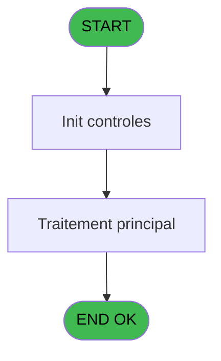
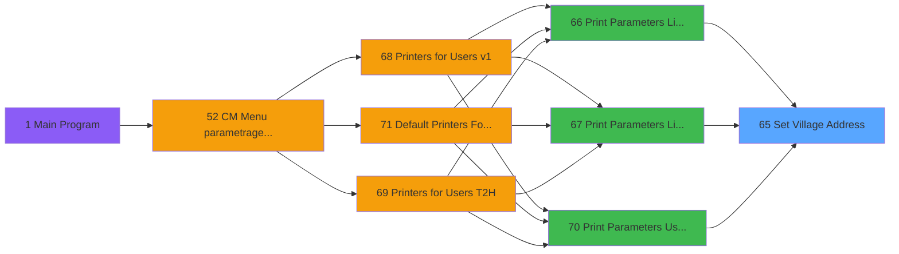

# MAI IDE 65 - Set Village Address

> **Analyse**: Phases 1-4 2026-02-03 14:59 -> 14:59 (10s) | Assemblage 14:59
> **Pipeline**: V7.2 Enrichi
> **Structure**: 4 onglets (Resume | Ecrans | Donnees | Connexions)

<!-- TAB:Resume -->

## 1. FICHE D'IDENTITE

| Attribut | Valeur |
|----------|--------|
| Projet | MAI |
| IDE Position | 65 |
| Nom Programme | Set Village Address |
| Fichier source | `Prg_65.xml` |
| Dossier IDE | Printer |
| Taches | 2 (0 ecrans visibles) |
| Tables modifiees | 0 |
| Programmes appeles | 0 |

## 2. DESCRIPTION FONCTIONNELLE

**Set Village Address** assure la gestion complete de ce processus, accessible depuis [Print Parameters Listing User (IDE 66)](MAI-IDE-66.md), [Print Parameters Listing Admin (IDE 67)](MAI-IDE-67.md), [Print Parameters User  T2H (IDE 70)](MAI-IDE-70.md).

Le flux de traitement s'organise en **1 blocs fonctionnels** :

- **Traitement** (2 taches) : traitements metier divers

## 3. BLOCS FONCTIONNELS

### 3.1 Traitement (2 taches)

Traitements internes.

---

#### 65 - Set Village Address

**Role** : Traitement : Set Village Address.

---

#### 65.1 - Load Buffer

**Role** : Traitement : Load Buffer.
**Variables liees** : A (Buffer)

## 5. REGLES METIER

*(Aucune regle metier identifiee)*

## 6. CONTEXTE

- **Appele par**: [Print Parameters Listing User (IDE 66)](MAI-IDE-66.md), [Print Parameters Listing Admin (IDE 67)](MAI-IDE-67.md), [Print Parameters User  T2H (IDE 70)](MAI-IDE-70.md)
- **Appelle**: 0 programmes | **Tables**: 1 (W:0 R:1 L:0) | **Taches**: 2 | **Expressions**: 19

<!-- TAB:Ecrans -->

## 8. ECRANS

*(Programme sans ecran visible)*

## 9. NAVIGATION

### 9.3 Structure hierarchique (2 taches)

| Position | Tache | Type | Dimensions | Bloc |
|----------|-------|------|------------|------|
| **65.1** | [**Set Village Address** (65)](#t1) | MDI | - | Traitement |
| 65.1.1 | [Load Buffer (65.1)](#t2) | MDI | - | |

### 9.4 Algorigramme

> **Legende**: Vert = START/END OK | Rouge = END KO | Bleu = Decisions
> *Algorigramme auto-genere. Utiliser `/algorigramme` pour une synthese metier detaillee.*

<!-- TAB:Donnees -->

## 10. TABLES

### Tables utilisees (1)

| ID | Nom | Description | Type | R | W | L | Usages |
|----|-----|-------------|------|---|---|---|--------|
| 372 | pv_budget |  | DB | R |   |   | 1 |

### Colonnes par table (1 / 1 tables avec colonnes identifiees)

Table 372 - pv_budget (R) - 1 usages

| Lettre | Variable | Acces | Type |
|--------|----------|-------|------|
| A | Buffer | R | Alpha |
| B | CounterTel | R | Numeric |
| C | CounterFax | R | Numeric |

## 11. VARIABLES

### 11.1 Autres (3)

Variables diverses.

| Lettre | Nom | Type | Usage dans |
|--------|-----|------|-----------|
| A | Buffer | Alpha | [65.1](#t2) |
| B | CounterTel | Numeric | 1x refs |
| C | CounterFax | Numeric | - |

## 12. EXPRESSIONS

**19 / 19 expressions decodees (100%)**

### 12.1 Repartition par type

| Type | Expressions | Regles |
|------|-------------|--------|
| CONCATENATION | 1 | 0 |
| CONDITION | 4 | 0 |
| CALCULATION | 1 | 0 |
| CONSTANTE | 3 | 0 |
| OTHER | 10 | 0 |

### 12.2 Expressions cles par type

#### CONCATENATION (1 expressions)

| Type | IDE | Expression | Regle |
|------|-----|------------|-------|
| CONCATENATION | 12 | `Trim ({1,17})&Left (IF (CounterTel [B]='','',CounterTel [B])&VarCurr ('{1,1}'VAR+Counter (0)),128)&'\|'` | - |

#### CONDITION (4 expressions)

| Type | IDE | Expression | Regle |
|------|-----|------------|-------|
| CONDITION | 15 | `VarName ('{1,1}'VAR+Counter (0))='PMS Village.FAX'` | - |
| CONDITION | 11 | `Counter (0)>=10` | - |
| CONDITION | 13 | `VarCurr ('{1,1}'VAR+Counter (0))<>''` | - |
| CONDITION | 14 | `VarName ('{1,1}'VAR+Counter (0))='PMS Village.PHONE'` | - |

#### CALCULATION (1 expressions)

| Type | IDE | Expression | Regle |
|------|-----|------------|-------|
| CALCULATION | 16 | `Buffer [A]+1` | - |

#### CONSTANTE (3 expressions)

| Type | IDE | Expression | Regle |
|------|-----|------------|-------|
| CONSTANTE | 19 | `''` | - |
| CONSTANTE | 18 | `'Fax  '` | - |
| CONSTANTE | 17 | `'Tel  '` | - |

#### OTHER (10 expressions)

| Type | IDE | Expression | Regle |
|------|-----|------------|-------|
| OTHER | 7 | `SetParam ('VI_FAXN',MID ([Q],775,128))` | - |
| OTHER | 6 | `SetParam ('VI_PHON',MID ([Q],646,128))` | - |
| OTHER | 8 | `SetParam ('VI_MAIL',MID ([Q],904,128))` | - |
| OTHER | 10 | `SetParam ('VI_VATN',MID ([Q],1162,128))` | - |
| OTHER | 9 | `SetParam ('VI_SIRE',MID ([Q],1033,128))` | - |
| ... | | *+5 autres* | |

<!-- TAB:Connexions -->

## 13. GRAPHE D'APPELS

### 13.1 Chaine depuis Main (Callers)

Main -> ... -> [Print Parameters Listing User (IDE 66)](MAI-IDE-66.md) -> **Set Village Address (IDE 65)**

Main -> ... -> [Print Parameters Listing Admin (IDE 67)](MAI-IDE-67.md) -> **Set Village Address (IDE 65)**

Main -> ... -> [Print Parameters User  T2H (IDE 70)](MAI-IDE-70.md) -> **Set Village Address (IDE 65)**

### 13.2 Callers

| IDE | Nom Programme | Nb Appels |
|-----|---------------|-----------|
| [66](MAI-IDE-66.md) | Print Parameters Listing User | 1 |
| [67](MAI-IDE-67.md) | Print Parameters Listing Admin | 1 |
| [70](MAI-IDE-70.md) | Print Parameters User  T2H | 1 |

### 13.3 Callees (programmes appeles)

### 13.4 Detail Callees avec contexte

| IDE | Nom Programme | Appels | Contexte |
|-----|---------------|--------|----------|
| - | (aucun) | - | - |

## 14. RECOMMANDATIONS MIGRATION

### 14.1 Profil du programme

| Metrique | Valeur | Impact migration |
|----------|--------|-----------------|
| Lignes de logique | 45 | Programme compact |
| Expressions | 19 | Peu de logique |
| Tables WRITE | 0 | Impact faible |
| Sous-programmes | 0 | Peu de dependances |
| Ecrans visibles | 0 | Ecran unique ou traitement batch |
| Code desactive | 0% (0 / 45) | Code sain |
| Regles metier | 0 | Pas de regle identifiee |

### 14.2 Plan de migration par bloc

#### Traitement (2 taches: 0 ecran, 2 traitements)

- **Strategie** : 2 service(s) backend injectable(s) (Domain Services).
- Decomposer les taches en services unitaires testables.

### 14.3 Dependances critiques

| Dependance | Type | Appels | Impact |
|------------|------|--------|--------|

---
*Spec DETAILED generee par Pipeline V7.2 - 2026-02-03 14:59*
