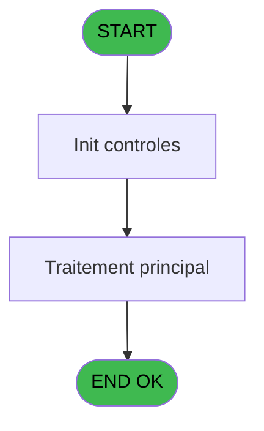

# MAI IDE 66 - Print Parameters Listing User

> **Analyse**: Phases 1-4 2026-02-03 14:59 -> 15:00 (11s) | Assemblage 15:00
> **Pipeline**: V7.2 Enrichi
> **Structure**: 4 onglets (Resume | Ecrans | Donnees | Connexions)

<!-- TAB:Resume -->

## 1. FICHE D'IDENTITE

| Attribut | Valeur |
|----------|--------|
| Projet | MAI |
| IDE Position | 66 |
| Nom Programme | Print Parameters Listing User |
| Fichier source | `Prg_66.xml` |
| Dossier IDE | Printer |
| Taches | 1 (1 ecrans visibles) |
| Tables modifiees | 0 |
| Programmes appeles | 1 |

## 2. DESCRIPTION FONCTIONNELLE

**Print Parameters Listing User** assure la gestion complete de ce processus, accessible depuis [Printers for Users v1 (IDE 68)](MAI-IDE-68.md).

Le flux de traitement s'organise en **1 blocs fonctionnels** :

- **Impression** (1 tache) : generation de tickets et documents

## 3. BLOCS FONCTIONNELS

### 3.1 Impression (1 tache)

Generation des documents et tickets.

---

#### 66 - Print Parameters Listing User [[ECRAN]](#ecran-t1)

**Role** : Generation du document : Print Parameters Listing User.
**Ecran** : 435 x 57 DLU (MDI) | [Voir mockup](#ecran-t1)

## 5. REGLES METIER

*(Aucune regle metier identifiee)*

## 6. CONTEXTE

- **Appele par**: [Printers for Users v1 (IDE 68)](MAI-IDE-68.md)
- **Appelle**: 1 programmes | **Tables**: 3 (W:0 R:1 L:2) | **Taches**: 1 | **Expressions**: 19

<!-- TAB:Ecrans -->

## 8. ECRANS

### 8.1 Forms visibles (1 / 1)

| # | Position | Tache | Nom | Type | Largeur | Hauteur | Bloc |
|---|----------|-------|-----|------|---------|---------|------|
| 1 | 66 | 66 | Print Parameters Listing User | MDI | 435 | 57 | Impression |

### 8.2 Mockups Ecrans

---

#### 66 - Print Parameters Listing User
**Tache** : [66](#t1) | **Type** : MDI | **Dimensions** : 435 x 57 DLU
**Bloc** : Impression | **Titre IDE** : Print Parameters Listing User

<!-- FORM-DATA:
{
    "width":  435,
    "vFactor":  8,
    "type":  "MDI",
    "hFactor":  8,
    "controls":  [
                     {
                         "x":  0,
                         "type":  "label",
                         "var":  "",
                         "y":  0,
                         "w":  432,
                         "fmt":  "",
                         "name":  "",
                         "h":  29,
                         "color":  "",
                         "text":  "",
                         "parent":  null
                     },
                     {
                         "x":  120,
                         "type":  "label",
                         "var":  "",
                         "y":  10,
                         "w":  256,
                         "fmt":  "",
                         "name":  "",
                         "h":  8,
                         "color":  "142",
                         "text":  "Impression en cours ...",
                         "parent":  null
                     },
                     {
                         "x":  0,
                         "type":  "label",
                         "var":  "",
                         "y":  29,
                         "w":  432,
                         "fmt":  "",
                         "name":  "",
                         "h":  27,
                         "color":  "",
                         "text":  "",
                         "parent":  null
                     },
                     {
                         "x":  27,
                         "type":  "label",
                         "var":  "",
                         "y":  38,
                         "w":  375,
                         "fmt":  "",
                         "name":  "",
                         "h":  8,
                         "color":  "",
                         "text":  "Terminal parameters",
                         "parent":  null
                     },
                     {
                         "x":  4,
                         "type":  "image",
                         "var":  "",
                         "y":  2,
                         "w":  72,
                         "fmt":  "",
                         "name":  "",
                         "h":  25,
                         "color":  "",
                         "text":  "",
                         "parent":  null
                     }
                 ],
    "taskId":  "66",
    "height":  57
}
-->

## 9. NAVIGATION

Ecran unique: **Print Parameters Listing User**

### 9.3 Structure hierarchique (1 tache)

| Position | Tache | Type | Dimensions | Bloc |
|----------|-------|------|------------|------|
| **66.1** | [**Print Parameters Listing User** (66)](#t1) [mockup](#ecran-t1) | MDI | 435x57 | Impression |

### 9.4 Algorigramme

> **Legende**: Vert = START/END OK | Rouge = END KO | Bleu = Decisions
> *Algorigramme auto-genere. Utiliser `/algorigramme` pour une synthese metier detaillee.*

<!-- TAB:Donnees -->

## 10. TABLES

### Tables utilisees (3)

| ID | Nom | Description | Type | R | W | L | Usages |
|----|-----|-------------|------|---|---|---|--------|
| 367 | pms_print_param_default |  | DB | R |   |   | 1 |
| 369 | presents_par_nationalite |  | DB |   |   | L | 1 |
| 370 | pv_accounting_date |  | DB |   |   | L | 1 |

### Colonnes par table (1 / 1 tables avec colonnes identifiees)

Table 367 - pms_print_param_default (R) - 1 usages

| Lettre | Variable | Acces | Type |
|--------|----------|-------|------|
| A | PARAM Terminal | R | Numeric |
| B | PARAM Terminal name | R | Alpha |

## 11. VARIABLES

### 11.1 Autres (2)

Variables diverses.

| Lettre | Nom | Type | Usage dans |
|--------|-----|------|-----------|
| A | PARAM Terminal | Numeric | [66](#t1) |
| B | PARAM Terminal name | Alpha | [66](#t1) |

## 12. EXPRESSIONS

**19 / 19 expressions decodees (100%)**

### 12.1 Repartition par type

| Type | Expressions | Regles |
|------|-------------|--------|
| CONCATENATION | 1 | 0 |
| DATE | 1 | 0 |
| OTHER | 15 | 0 |
| REFERENCE_VG | 1 | 0 |
| STRING | 1 | 0 |

### 12.2 Expressions cles par type

#### CONCATENATION (1 expressions)

| Type | IDE | Expression | Regle |
|------|-----|------------|-------|
| CONCATENATION | 11 | `'LISTING PARAMETERS for '&Str (PARAM Terminal [A],'3P0')&' - '&Trim (PARAM Terminal name [B])` | - |

#### DATE (1 expressions)

| Type | IDE | Expression | Regle |
|------|-----|------------|-------|
| DATE | 12 | `Date ()` | - |

#### OTHER (15 expressions)

| Type | IDE | Expression | Regle |
|------|-----|------------|-------|
| OTHER | 13 | `Time ()` | - |
| OTHER | 10 | `GetParam ('VI_VATN')` | - |
| OTHER | 9 | `GetParam ('VI_SIRE')` | - |
| OTHER | 16 | `PARAM Terminal [A]` | - |
| OTHER | 19 | `[K]` | - |
| ... | | *+10 autres* | |

#### REFERENCE_VG (1 expressions)

| Type | IDE | Expression | Regle |
|------|-----|------------|-------|
| REFERENCE_VG | 15 | `VG2` | - |

#### STRING (1 expressions)

| Type | IDE | Expression | Regle |
|------|-----|------------|-------|
| STRING | 14 | `'Page '&Trim (Str (Page (0,1),'4'))` | - |

<!-- TAB:Connexions -->

## 13. GRAPHE D'APPELS

### 13.1 Chaine depuis Main (Callers)

Main -> ... -> [Printers for Users v1 (IDE 68)](MAI-IDE-68.md) -> **Print Parameters Listing User (IDE 66)**

### 13.2 Callers

| IDE | Nom Programme | Nb Appels |
|-----|---------------|-----------|
| [68](MAI-IDE-68.md) | Printers for Users v1 | 1 |

### 13.3 Callees (programmes appeles)

### 13.4 Detail Callees avec contexte

| IDE | Nom Programme | Appels | Contexte |
|-----|---------------|--------|----------|
| [65](MAI-IDE-65.md) | Set Village Address | 1 | Sous-programme |

## 14. RECOMMANDATIONS MIGRATION

### 14.1 Profil du programme

| Metrique | Valeur | Impact migration |
|----------|--------|-----------------|
| Lignes de logique | 24 | Programme compact |
| Expressions | 19 | Peu de logique |
| Tables WRITE | 0 | Impact faible |
| Sous-programmes | 1 | Peu de dependances |
| Ecrans visibles | 1 | Ecran unique ou traitement batch |
| Code desactive | 0% (0 / 24) | Code sain |
| Regles metier | 0 | Pas de regle identifiee |

### 14.2 Plan de migration par bloc

#### Impression (1 tache: 1 ecran, 0 traitement)

- **Strategie** : Templates HTML -> PDF via wkhtmltopdf ou Puppeteer.
- `PrintService` injectable avec choix imprimante

### 14.3 Dependances critiques

| Dependance | Type | Appels | Impact |
|------------|------|--------|--------|
| [Set Village Address (IDE 65)](MAI-IDE-65.md) | Sous-programme | 1x | Normale - Sous-programme |

---
*Spec DETAILED generee par Pipeline V7.2 - 2026-02-03 15:00*
