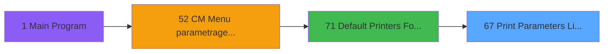

# MAI IDE 67 - Print Parameters Listing Admin

> **Analyse**: Phases 1-4 2026-02-03 15:00 -> 15:00 (10s) | Assemblage 15:00
> **Pipeline**: V7.2 Enrichi
> **Structure**: 4 onglets (Resume | Ecrans | Donnees | Connexions)

<!-- TAB:Resume -->

## 1. FICHE D'IDENTITE

| Attribut | Valeur |
|----------|--------|
| Projet | MAI |
| IDE Position | 67 |
| Nom Programme | Print Parameters Listing Admin |
| Fichier source | `Prg_67.xml` |
| Dossier IDE | Printer |
| Taches | 8 (7 ecrans visibles) |
| Tables modifiees | 0 |
| Programmes appeles | 1 |

## 2. DESCRIPTION FONCTIONNELLE

**Print Parameters Listing Admin** assure la gestion complete de ce processus, accessible depuis [Default Printers For Admin (IDE 71)](MAI-IDE-71.md).

Le flux de traitement s'organise en **3 blocs fonctionnels** :

- **Traitement** (4 taches) : traitements metier divers
- **Impression** (3 taches) : generation de tickets et documents
- **Consultation** (1 tache) : ecrans de recherche, selection et consultation

Detail : phases du traitement

#### Phase 1 : Impression (3 taches)

- **67** - Print Parameters Listing Admin **[[ECRAN]](#ecran-t1)**
- **67.1.1** - Compute #printer
- **67.2** - Printer **[[ECRAN]](#ecran-t4)**

#### Phase 2 : Traitement (4 taches)

- **67.1** - Listing **[[ECRAN]](#ecran-t2)**
- **67.3** - Admin parameters **[[ECRAN]](#ecran-t5)**
- **67.4** - Terminal Parameters **[[ECRAN]](#ecran-t6)**
- **67.4.1** - Term Parameters **[[ECRAN]](#ecran-t7)**

Delegue a : [Set Village Address (IDE 65)](MAI-IDE-65.md)

#### Phase 3 : Consultation (1 tache)

- **67.4.2** - Zoom Term **[[ECRAN]](#ecran-t8)**

## 3. BLOCS FONCTIONNELS

### 3.1 Impression (3 taches)

Generation des documents et tickets.

---

#### 67 - Print Parameters Listing Admin [[ECRAN]](#ecran-t1)

**Role** : Generation du document : Print Parameters Listing Admin.
**Ecran** : 648 x 162 DLU (MDI) | [Voir mockup](#ecran-t1)

---

#### 67.1.1 - Compute #printer

**Role** : Generation du document : Compute #printer.

---

#### 67.2 - Printer [[ECRAN]](#ecran-t4)

**Role** : Generation du document : Printer.
**Ecran** : 432 x 56 DLU (MDI) | [Voir mockup](#ecran-t4)

### 3.2 Traitement (4 taches)

Traitements internes.

---

#### 67.1 - Listing [[ECRAN]](#ecran-t2)

**Role** : Traitement : Listing.
**Ecran** : 432 x 56 DLU (MDI) | [Voir mockup](#ecran-t2)
**Delegue a** : [Set Village Address (IDE 65)](MAI-IDE-65.md)

---

#### 67.3 - Admin parameters [[ECRAN]](#ecran-t5)

**Role** : Traitement : Admin parameters.
**Ecran** : 432 x 56 DLU (MDI) | [Voir mockup](#ecran-t5)
**Delegue a** : [Set Village Address (IDE 65)](MAI-IDE-65.md)

---

#### 67.4 - Terminal Parameters [[ECRAN]](#ecran-t6)

**Role** : Traitement : Terminal Parameters.
**Ecran** : 646 x 163 DLU (MDI) | [Voir mockup](#ecran-t6)
**Delegue a** : [Set Village Address (IDE 65)](MAI-IDE-65.md)

---

#### 67.4.1 - Term Parameters [[ECRAN]](#ecran-t7)

**Role** : Traitement : Term Parameters.
**Ecran** : 435 x 59 DLU (MDI) | [Voir mockup](#ecran-t7)
**Delegue a** : [Set Village Address (IDE 65)](MAI-IDE-65.md)

### 3.3 Consultation (1 tache)

Ecrans de recherche et consultation.

---

#### 67.4.2 - Zoom Term [[ECRAN]](#ecran-t8)

**Role** : Selection par l'operateur : Zoom Term.
**Ecran** : 284 x 0 DLU (MDI) | [Voir mockup](#ecran-t8)

## 5. REGLES METIER

*(Aucune regle metier identifiee)*

## 6. CONTEXTE

- **Appele par**: [Default Printers For Admin (IDE 71)](MAI-IDE-71.md)
- **Appelle**: 1 programmes | **Tables**: 5 (W:0 R:3 L:3) | **Taches**: 8 | **Expressions**: 6

<!-- TAB:Ecrans -->

## 8. ECRANS

### 8.1 Forms visibles (7 / 8)

| # | Position | Tache | Nom | Type | Largeur | Hauteur | Bloc |
|---|----------|-------|-----|------|---------|---------|------|
| 1 | 67 | 67 | Print Parameters Listing Admin | MDI | 648 | 162 | Impression |
| 2 | 67.1 | 67.1 | Listing | MDI | 432 | 56 | Traitement |
| 3 | 67.2 | 67.2 | Printer | MDI | 432 | 56 | Impression |
| 4 | 67.3 | 67.3 | Admin parameters | MDI | 432 | 56 | Traitement |
| 5 | 67.4 | 67.4 | Terminal Parameters | MDI | 646 | 163 | Traitement |
| 6 | 67.4.1 | 67.4.1 | Term Parameters | MDI | 435 | 59 | Traitement |
| 7 | 67.4.2 | 67.4.2 | Zoom Term | MDI | 284 | 0 | Consultation |

### 8.2 Mockups Ecrans

---

#### 67 - Print Parameters Listing Admin
**Tache** : [67](#t1) | **Type** : MDI | **Dimensions** : 648 x 162 DLU
**Bloc** : Impression | **Titre IDE** : Print Parameters Listing Admin

<!-- FORM-DATA:
{
    "width":  648,
    "vFactor":  8,
    "type":  "MDI",
    "hFactor":  8,
    "controls":  [
                     {
                         "x":  0,
                         "type":  "label",
                         "var":  "",
                         "y":  0,
                         "w":  640,
                         "fmt":  "",
                         "name":  "",
                         "h":  21,
                         "color":  "",
                         "text":  "",
                         "parent":  null
                     },
                     {
                         "x":  0,
                         "type":  "label",
                         "var":  "",
                         "y":  22,
                         "w":  640,
                         "fmt":  "",
                         "name":  "",
                         "h":  113,
                         "color":  "",
                         "text":  "",
                         "parent":  null
                     },
                     {
                         "x":  10,
                         "type":  "label",
                         "var":  "",
                         "y":  27,
                         "w":  620,
                         "fmt":  "",
                         "name":  "",
                         "h":  106,
                         "color":  "",
                         "text":  "",
                         "parent":  null
                     },
                     {
                         "x":  280,
                         "type":  "label",
                         "var":  "",
                         "y":  37,
                         "w":  316,
                         "fmt":  "",
                         "name":  "",
                         "h":  81,
                         "color":  "",
                         "text":  "",
                         "parent":  null
                     },
                     {
                         "x":  286,
                         "type":  "label",
                         "var":  "",
                         "y":  40,
                         "w":  45,
                         "fmt":  "",
                         "name":  "",
                         "h":  75,
                         "color":  "",
                         "text":  "",
                         "parent":  null
                     },
                     {
                         "x":  333,
                         "type":  "label",
                         "var":  "",
                         "y":  46,
                         "w":  248,
                         "fmt":  "",
                         "name":  "",
                         "h":  10,
                         "color":  "7",
                         "text":  "Listing",
                         "parent":  null
                     },
                     {
                         "x":  333,
                         "type":  "label",
                         "var":  "",
                         "y":  63,
                         "w":  248,
                         "fmt":  "",
                         "name":  "",
                         "h":  10,
                         "color":  "7",
                         "text":  "Printer",
                         "parent":  null
                     },
                     {
                         "x":  335,
                         "type":  "label",
                         "var":  "",
                         "y":  80,
                         "w":  248,
                         "fmt":  "",
                         "name":  "",
                         "h":  10,
                         "color":  "7",
                         "text":  "Default parameters",
                         "parent":  null
                     },
                     {
                         "x":  335,
                         "type":  "label",
                         "var":  "",
                         "y":  97,
                         "w":  248,
                         "fmt":  "",
                         "name":  "",
                         "h":  10,
                         "color":  "7",
                         "text":  "Terminal parameters",
                         "parent":  null
                     },
                     {
                         "x":  333,
                         "type":  "label",
                         "var":  "",
                         "y":  121,
                         "w":  141,
                         "fmt":  "",
                         "name":  "",
                         "h":  10,
                         "color":  "",
                         "text":  "Votre choix",
                         "parent":  null
                     },
                     {
                         "x":  0,
                         "type":  "label",
                         "var":  "",
                         "y":  136,
                         "w":  638,
                         "fmt":  "",
                         "name":  "",
                         "h":  24,
                         "color":  "",
                         "text":  "",
                         "parent":  null
                     },
                     {
                         "x":  496,
                         "type":  "edit",
                         "var":  "",
                         "y":  121,
                         "w":  45,
                         "fmt":  "1AZ",
                         "name":  "CHOICE",
                         "h":  10,
                         "color":  "6",
                         "text":  "",
                         "parent":  null
                     },
                     {
                         "x":  3,
                         "type":  "image",
                         "var":  "",
                         "y":  1,
                         "w":  59,
                         "fmt":  "",
                         "name":  "",
                         "h":  18,
                         "color":  "",
                         "text":  "",
                         "parent":  null
                     },
                     {
                         "x":  79,
                         "type":  "edit",
                         "var":  "",
                         "y":  5,
                         "w":  413,
                         "fmt":  "30",
                         "name":  "",
                         "h":  10,
                         "color":  "",
                         "text":  "",
                         "parent":  null
                     },
                     {
                         "x":  40,
                         "type":  "image",
                         "var":  "",
                         "y":  38,
                         "w":  210,
                         "fmt":  "",
                         "name":  "",
                         "h":  81,
                         "color":  "",
                         "text":  "",
                         "parent":  null
                     },
                     {
                         "x":  295,
                         "type":  "button",
                         "var":  "",
                         "y":  46,
                         "w":  26,
                         "fmt":  "1",
                         "name":  "1",
                         "h":  10,
                         "color":  "",
                         "text":  "",
                         "parent":  null
                     },
                     {
                         "x":  295,
                         "type":  "button",
                         "var":  "",
                         "y":  63,
                         "w":  26,
                         "fmt":  "2",
                         "name":  "2",
                         "h":  10,
                         "color":  "",
                         "text":  "",
                         "parent":  null
                     },
                     {
                         "x":  297,
                         "type":  "button",
                         "var":  "",
                         "y":  80,
                         "w":  26,
                         "fmt":  "3",
                         "name":  "3",
                         "h":  10,
                         "color":  "",
                         "text":  "",
                         "parent":  null
                     },
                     {
                         "x":  297,
                         "type":  "button",
                         "var":  "",
                         "y":  97,
                         "w":  26,
                         "fmt":  "4",
                         "name":  "4",
                         "h":  10,
                         "color":  "",
                         "text":  "",
                         "parent":  null
                     },
                     {
                         "x":  11,
                         "type":  "button",
                         "var":  "",
                         "y":  139,
                         "w":  154,
                         "fmt":  "\u0026Quitter",
                         "name":  "",
                         "h":  18,
                         "color":  "",
                         "text":  "",
                         "parent":  null
                     }
                 ],
    "taskId":  "67",
    "height":  162
}
-->

<strong>Champs : 2 champs</strong>

| Pos (x,y) | Nom | Variable | Type |
|-----------|-----|----------|------|
| 496,121 | CHOICE | - | edit |
| 79,5 | 30 | - | edit |

<strong>Boutons : 5 boutons</strong>

| Bouton | Pos (x,y) | Action |
|--------|-----------|--------|
| 1 | 295,46 | Bouton fonctionnel |
| 2 | 295,63 | Bouton fonctionnel |
| 3 | 297,80 | Bouton fonctionnel |
| 4 | 297,97 | Bouton fonctionnel |
| Quitter | 11,139 | Quitte le programme |

---

#### 67.1 - Listing
**Tache** : [67.1](#t2) | **Type** : MDI | **Dimensions** : 432 x 56 DLU
**Bloc** : Traitement | **Titre IDE** : Listing

<!-- FORM-DATA:
{
    "width":  432,
    "vFactor":  8,
    "type":  "MDI",
    "hFactor":  8,
    "controls":  [
                     {
                         "x":  0,
                         "type":  "label",
                         "var":  "",
                         "y":  0,
                         "w":  432,
                         "fmt":  "",
                         "name":  "",
                         "h":  29,
                         "color":  "",
                         "text":  "",
                         "parent":  null
                     },
                     {
                         "x":  120,
                         "type":  "label",
                         "var":  "",
                         "y":  10,
                         "w":  256,
                         "fmt":  "",
                         "name":  "",
                         "h":  8,
                         "color":  "142",
                         "text":  "Impression en cours ...",
                         "parent":  null
                     },
                     {
                         "x":  0,
                         "type":  "label",
                         "var":  "",
                         "y":  29,
                         "w":  432,
                         "fmt":  "",
                         "name":  "",
                         "h":  27,
                         "color":  "",
                         "text":  "",
                         "parent":  null
                     },
                     {
                         "x":  27,
                         "type":  "label",
                         "var":  "",
                         "y":  38,
                         "w":  375,
                         "fmt":  "",
                         "name":  "",
                         "h":  8,
                         "color":  "",
                         "text":  "LISTING",
                         "parent":  null
                     },
                     {
                         "x":  4,
                         "type":  "image",
                         "var":  "",
                         "y":  2,
                         "w":  72,
                         "fmt":  "",
                         "name":  "",
                         "h":  25,
                         "color":  "",
                         "text":  "",
                         "parent":  null
                     }
                 ],
    "taskId":  "67.1",
    "height":  56
}
-->

---

#### 67.2 - Printer
**Tache** : [67.2](#t4) | **Type** : MDI | **Dimensions** : 432 x 56 DLU
**Bloc** : Impression | **Titre IDE** : Printer

<!-- FORM-DATA:
{
    "width":  432,
    "vFactor":  8,
    "type":  "MDI",
    "hFactor":  8,
    "controls":  [
                     {
                         "x":  0,
                         "type":  "label",
                         "var":  "",
                         "y":  0,
                         "w":  432,
                         "fmt":  "",
                         "name":  "",
                         "h":  29,
                         "color":  "",
                         "text":  "",
                         "parent":  null
                     },
                     {
                         "x":  120,
                         "type":  "label",
                         "var":  "",
                         "y":  10,
                         "w":  256,
                         "fmt":  "",
                         "name":  "",
                         "h":  8,
                         "color":  "142",
                         "text":  "Impression en cours ...",
                         "parent":  null
                     },
                     {
                         "x":  0,
                         "type":  "label",
                         "var":  "",
                         "y":  29,
                         "w":  432,
                         "fmt":  "",
                         "name":  "",
                         "h":  27,
                         "color":  "",
                         "text":  "",
                         "parent":  null
                     },
                     {
                         "x":  27,
                         "type":  "label",
                         "var":  "",
                         "y":  38,
                         "w":  375,
                         "fmt":  "",
                         "name":  "",
                         "h":  8,
                         "color":  "",
                         "text":  "PRINTERS",
                         "parent":  null
                     },
                     {
                         "x":  4,
                         "type":  "image",
                         "var":  "",
                         "y":  2,
                         "w":  72,
                         "fmt":  "",
                         "name":  "",
                         "h":  25,
                         "color":  "",
                         "text":  "",
                         "parent":  null
                     }
                 ],
    "taskId":  "67.2",
    "height":  56
}
-->

---

#### 67.3 - Admin parameters
**Tache** : [67.3](#t5) | **Type** : MDI | **Dimensions** : 432 x 56 DLU
**Bloc** : Traitement | **Titre IDE** : Admin parameters

<!-- FORM-DATA:
{
    "width":  432,
    "vFactor":  8,
    "type":  "MDI",
    "hFactor":  8,
    "controls":  [
                     {
                         "x":  0,
                         "type":  "label",
                         "var":  "",
                         "y":  0,
                         "w":  432,
                         "fmt":  "",
                         "name":  "",
                         "h":  29,
                         "color":  "",
                         "text":  "",
                         "parent":  null
                     },
                     {
                         "x":  120,
                         "type":  "label",
                         "var":  "",
                         "y":  10,
                         "w":  256,
                         "fmt":  "",
                         "name":  "",
                         "h":  8,
                         "color":  "142",
                         "text":  "Impression en cours ...",
                         "parent":  null
                     },
                     {
                         "x":  0,
                         "type":  "label",
                         "var":  "",
                         "y":  29,
                         "w":  432,
                         "fmt":  "",
                         "name":  "",
                         "h":  27,
                         "color":  "",
                         "text":  "",
                         "parent":  null
                     },
                     {
                         "x":  27,
                         "type":  "label",
                         "var":  "",
                         "y":  38,
                         "w":  375,
                         "fmt":  "",
                         "name":  "",
                         "h":  8,
                         "color":  "",
                         "text":  "Admin parameters",
                         "parent":  null
                     },
                     {
                         "x":  4,
                         "type":  "image",
                         "var":  "",
                         "y":  2,
                         "w":  72,
                         "fmt":  "",
                         "name":  "",
                         "h":  25,
                         "color":  "",
                         "text":  "",
                         "parent":  null
                     }
                 ],
    "taskId":  "67.3",
    "height":  56
}
-->

---

#### 67.4 - Terminal Parameters
**Tache** : [67.4](#t6) | **Type** : MDI | **Dimensions** : 646 x 163 DLU
**Bloc** : Traitement | **Titre IDE** : Terminal Parameters

<!-- FORM-DATA:
{
    "width":  646,
    "vFactor":  8,
    "type":  "MDI",
    "hFactor":  8,
    "controls":  [
                     {
                         "x":  0,
                         "type":  "label",
                         "var":  "",
                         "y":  0,
                         "w":  640,
                         "fmt":  "",
                         "name":  "",
                         "h":  21,
                         "color":  "",
                         "text":  "",
                         "parent":  null
                     },
                     {
                         "x":  0,
                         "type":  "label",
                         "var":  "",
                         "y":  22,
                         "w":  640,
                         "fmt":  "",
                         "name":  "",
                         "h":  112,
                         "color":  "",
                         "text":  "",
                         "parent":  null
                     },
                     {
                         "x":  107,
                         "type":  "label",
                         "var":  "",
                         "y":  45,
                         "w":  250,
                         "fmt":  "",
                         "name":  "",
                         "h":  10,
                         "color":  "142",
                         "text":  "Printing parameters for",
                         "parent":  4
                     },
                     {
                         "x":  107,
                         "type":  "label",
                         "var":  "",
                         "y":  64,
                         "w":  250,
                         "fmt":  "",
                         "name":  "",
                         "h":  44,
                         "color":  "",
                         "text":  "",
                         "parent":  null
                     },
                     {
                         "x":  127,
                         "type":  "label",
                         "var":  "",
                         "y":  80,
                         "w":  164,
                         "fmt":  "",
                         "name":  "",
                         "h":  12,
                         "color":  "142",
                         "text":  "Terminal number",
                         "parent":  null
                     },
                     {
                         "x":  0,
                         "type":  "label",
                         "var":  "",
                         "y":  136,
                         "w":  638,
                         "fmt":  "",
                         "name":  "",
                         "h":  24,
                         "color":  "",
                         "text":  "",
                         "parent":  null
                     },
                     {
                         "x":  295,
                         "type":  "edit",
                         "var":  "",
                         "y":  80,
                         "w":  48,
                         "fmt":  "",
                         "name":  "Terminal",
                         "h":  12,
                         "color":  "6",
                         "text":  "",
                         "parent":  null
                     },
                     {
                         "x":  478,
                         "type":  "button",
                         "var":  "",
                         "y":  139,
                         "w":  154,
                         "fmt":  "",
                         "name":  "Validation button",
                         "h":  18,
                         "color":  "",
                         "text":  "",
                         "parent":  null
                     },
                     {
                         "x":  3,
                         "type":  "image",
                         "var":  "",
                         "y":  1,
                         "w":  59,
                         "fmt":  "",
                         "name":  "",
                         "h":  18,
                         "color":  "",
                         "text":  "",
                         "parent":  null
                     },
                     {
                         "x":  79,
                         "type":  "edit",
                         "var":  "",
                         "y":  5,
                         "w":  413,
                         "fmt":  "30",
                         "name":  "",
                         "h":  10,
                         "color":  "",
                         "text":  "",
                         "parent":  null
                     },
                     {
                         "x":  369,
                         "type":  "image",
                         "var":  "",
                         "y":  64,
                         "w":  165,
                         "fmt":  "",
                         "name":  "",
                         "h":  44,
                         "color":  "",
                         "text":  "",
                         "parent":  null
                     },
                     {
                         "x":  11,
                         "type":  "button",
                         "var":  "",
                         "y":  139,
                         "w":  154,
                         "fmt":  "\u0026Quitter",
                         "name":  "",
                         "h":  18,
                         "color":  "",
                         "text":  "",
                         "parent":  null
                     }
                 ],
    "taskId":  "67.4",
    "height":  163
}
-->

<strong>Champs : 2 champs</strong>

| Pos (x,y) | Nom | Variable | Type |
|-----------|-----|----------|------|
| 295,80 | Terminal | - | edit |
| 79,5 | 30 | - | edit |

<strong>Boutons : 2 boutons</strong>

| Bouton | Pos (x,y) | Action |
|--------|-----------|--------|
| Validation button | 478,139 | Valide la saisie et enregistre |
| Quitter | 11,139 | Quitte le programme |

---

#### 67.4.1 - Term Parameters
**Tache** : [67.4.1](#t7) | **Type** : MDI | **Dimensions** : 435 x 59 DLU
**Bloc** : Traitement | **Titre IDE** : Term Parameters

<!-- FORM-DATA:
{
    "width":  435,
    "vFactor":  8,
    "type":  "MDI",
    "hFactor":  8,
    "controls":  [
                     {
                         "x":  0,
                         "type":  "label",
                         "var":  "",
                         "y":  0,
                         "w":  432,
                         "fmt":  "",
                         "name":  "",
                         "h":  29,
                         "color":  "",
                         "text":  "",
                         "parent":  null
                     },
                     {
                         "x":  120,
                         "type":  "label",
                         "var":  "",
                         "y":  10,
                         "w":  256,
                         "fmt":  "",
                         "name":  "",
                         "h":  8,
                         "color":  "142",
                         "text":  "Impression en cours ...",
                         "parent":  null
                     },
                     {
                         "x":  0,
                         "type":  "label",
                         "var":  "",
                         "y":  29,
                         "w":  432,
                         "fmt":  "",
                         "name":  "",
                         "h":  27,
                         "color":  "",
                         "text":  "",
                         "parent":  null
                     },
                     {
                         "x":  27,
                         "type":  "label",
                         "var":  "",
                         "y":  38,
                         "w":  375,
                         "fmt":  "",
                         "name":  "",
                         "h":  8,
                         "color":  "",
                         "text":  "Terminal parameters",
                         "parent":  null
                     },
                     {
                         "x":  4,
                         "type":  "image",
                         "var":  "",
                         "y":  2,
                         "w":  72,
                         "fmt":  "",
                         "name":  "",
                         "h":  25,
                         "color":  "",
                         "text":  "",
                         "parent":  null
                     }
                 ],
    "taskId":  "67.4.1",
    "height":  59
}
-->

---

#### 67.4.2 - Zoom Term
**Tache** : [67.4.2](#t8) | **Type** : MDI | **Dimensions** : 284 x 0 DLU
**Bloc** : Consultation | **Titre IDE** : Zoom Term

<!-- FORM-DATA:
{
    "width":  284,
    "vFactor":  8,
    "type":  "MDI",
    "hFactor":  4,
    "controls":  [
                     {
                         "x":  7,
                         "type":  "table",
                         "var":  "",
                         "name":  "",
                         "titleH":  11,
                         "color":  "196",
                         "w":  271,
                         "y":  8,
                         "fmt":  "",
                         "parent":  null,
                         "text":  "",
                         "rowH":  12,
                         "h":  165,
                         "cols":  [
                                      {
                                          "title":  "PRN N° terminal",
                                          "layer":  1,
                                          "w":  74
                                      },
                                      {
                                          "title":  "PRN Nom terminal",
                                          "layer":  2,
                                          "w":  179
                                      }
                                  ],
                         "rows":  2
                     },
                     {
                         "x":  11,
                         "type":  "edit",
                         "var":  "",
                         "y":  21,
                         "w":  21,
                         "fmt":  "",
                         "name":  "",
                         "h":  8,
                         "color":  "196",
                         "text":  "",
                         "parent":  1
                     },
                     {
                         "x":  86,
                         "type":  "edit",
                         "var":  "",
                         "y":  21,
                         "w":  172,
                         "fmt":  "",
                         "name":  "",
                         "h":  8,
                         "color":  "196",
                         "text":  "",
                         "parent":  1
                     },
                     {
                         "x":  192,
                         "type":  "button",
                         "var":  "",
                         "y":  184,
                         "w":  77,
                         "fmt":  "Select",
                         "name":  "",
                         "h":  14,
                         "color":  "",
                         "text":  "",
                         "parent":  null
                     }
                 ],
    "taskId":  "67.4.2",
    "height":  0
}
-->

<strong>Champs : 2 champs</strong>

| Pos (x,y) | Nom | Variable | Type |
|-----------|-----|----------|------|
| 11,21 | (sans nom) | - | edit |
| 86,21 | (sans nom) | - | edit |

<strong>Boutons : 1 boutons</strong>

| Bouton | Pos (x,y) | Action |
|--------|-----------|--------|
| Select | 192,184 | Ouvre la selection |

## 9. NAVIGATION

### 9.1 Enchainement des ecrans

**Detail par enchainement :**

| Depuis | Action | Vers | Retour |
|--------|--------|------|--------|
| Print Parameters Listing Admin | Sous-programme | [Set Village Address (IDE 65)](MAI-IDE-65.md) | Retour ecran |

### 9.3 Structure hierarchique (8 taches)

| Position | Tache | Type | Dimensions | Bloc |
|----------|-------|------|------------|------|
| **67.1** | [**Print Parameters Listing Admin** (67)](#t1) [mockup](#ecran-t1) | MDI | 648x162 | Impression |
| 67.1.1 | [Compute #printer (67.1.1)](#t3) | MDI | - | |
| 67.1.2 | [Printer (67.2)](#t4) [mockup](#ecran-t4) | MDI | 432x56 | |
| **67.2** | [**Listing** (67.1)](#t2) [mockup](#ecran-t2) | MDI | 432x56 | Traitement |
| 67.2.1 | [Admin parameters (67.3)](#t5) [mockup](#ecran-t5) | MDI | 432x56 | |
| 67.2.2 | [Terminal Parameters (67.4)](#t6) [mockup](#ecran-t6) | MDI | 646x163 | |
| 67.2.3 | [Term Parameters (67.4.1)](#t7) [mockup](#ecran-t7) | MDI | 435x59 | |
| **67.3** | [**Zoom Term** (67.4.2)](#t8) [mockup](#ecran-t8) | MDI | 284x0 | Consultation |

### 9.4 Algorigramme

> **Legende**: Vert = START/END OK | Rouge = END KO | Bleu = Decisions
> *Algorigramme auto-genere. Utiliser `/algorigramme` pour une synthese metier detaillee.*

<!-- TAB:Donnees -->

## 10. TABLES

### Tables utilisees (5)

| ID | Nom | Description | Type | R | W | L | Usages |
|----|-----|-------------|------|---|---|---|--------|
| 24 | imprimante_______prn |  | DB | R |   |   | 2 |
| 367 | pms_print_param_default |  | DB | R |   |   | 3 |
| 369 | presents_par_nationalite |  | DB | R |   | L | 3 |
| 370 | pv_accounting_date |  | DB |   |   | L | 1 |
| 371 | pv_binding_settings |  | DB |   |   | L | 1 |

### Colonnes par table (2 / 3 tables avec colonnes identifiees)

Table 24 - imprimante_______prn (R) - 2 usages

| Lettre | Variable | Acces | Type |
|--------|----------|-------|------|
| A | Terminal | R | Numeric |
| B | Validation button | R | Alpha |

Table 367 - pms_print_param_default (R) - 3 usages

| Lettre | Variable | Acces | Type |
|--------|----------|-------|------|
| A | #printer | R | Alpha |

Table 369 - presents_par_nationalite (R/L) - 3 usages

*Table utilisee uniquement en Link ou aucune colonne Real identifiee dans le DataView.*

## 11. VARIABLES

### 11.1 Autres (2)

Variables diverses.

| Lettre | Nom | Type | Usage dans |
|--------|-----|------|-----------|
| A | CHOICE | Numeric | 4x refs |
| B | Validation button | Alpha | - |

## 12. EXPRESSIONS

**6 / 6 expressions decodees (100%)**

### 12.1 Repartition par type

| Type | Expressions | Regles |
|------|-------------|--------|
| CONDITION | 4 | 0 |
| REFERENCE_VG | 1 | 0 |
| OTHER | 1 | 0 |

### 12.2 Expressions cles par type

#### CONDITION (4 expressions)

| Type | IDE | Expression | Regle |
|------|-----|------------|-------|
| CONDITION | 3 | `CHOICE [A]=3` | - |
| CONDITION | 4 | `CHOICE [A]=4` | - |
| CONDITION | 1 | `CHOICE [A]=1` | - |
| CONDITION | 2 | `CHOICE [A]=2` | - |

#### REFERENCE_VG (1 expressions)

| Type | IDE | Expression | Regle |
|------|-----|------------|-------|
| REFERENCE_VG | 5 | `VG2` | - |

#### OTHER (1 expressions)

| Type | IDE | Expression | Regle |
|------|-----|------------|-------|
| OTHER | 6 | `GetParam ('VI_CLUB')` | - |

<!-- TAB:Connexions -->

## 13. GRAPHE D'APPELS

### 13.1 Chaine depuis Main (Callers)

Main -> ... -> [Default Printers For Admin (IDE 71)](MAI-IDE-71.md) -> **Print Parameters Listing Admin (IDE 67)**

### 13.2 Callers

| IDE | Nom Programme | Nb Appels |
|-----|---------------|-----------|
| [71](MAI-IDE-71.md) | Default Printers For Admin | 1 |

### 13.3 Callees (programmes appeles)

### 13.4 Detail Callees avec contexte

| IDE | Nom Programme | Appels | Contexte |
|-----|---------------|--------|----------|
| [65](MAI-IDE-65.md) | Set Village Address | 1 | Sous-programme |

## 14. RECOMMANDATIONS MIGRATION

### 14.1 Profil du programme

| Metrique | Valeur | Impact migration |
|----------|--------|-----------------|
| Lignes de logique | 93 | Programme compact |
| Expressions | 6 | Peu de logique |
| Tables WRITE | 0 | Impact faible |
| Sous-programmes | 1 | Peu de dependances |
| Ecrans visibles | 7 | Interface complexe multi-ecrans |
| Code desactive | 0% (0 / 93) | Code sain |
| Regles metier | 0 | Pas de regle identifiee |

### 14.2 Plan de migration par bloc

#### Impression (3 taches: 2 ecrans, 1 traitement)

- **Strategie** : Templates HTML -> PDF via wkhtmltopdf ou Puppeteer.
- `PrintService` injectable avec choix imprimante

#### Traitement (4 taches: 4 ecrans, 0 traitement)

- **Strategie** : 4 composant(s) UI (Razor/React) avec formulaires et validation.
- 1 sous-programme(s) a migrer ou a reutiliser depuis les services existants.
- Decomposer les taches en services unitaires testables.

#### Consultation (1 tache: 1 ecran, 0 traitement)

- **Strategie** : Composants de recherche/selection en modales.
- 1 ecran : Zoom Term

### 14.3 Dependances critiques

| Dependance | Type | Appels | Impact |
|------------|------|--------|--------|
| [Set Village Address (IDE 65)](MAI-IDE-65.md) | Sous-programme | 1x | Normale - Sous-programme |

---
*Spec DETAILED generee par Pipeline V7.2 - 2026-02-03 15:00*
