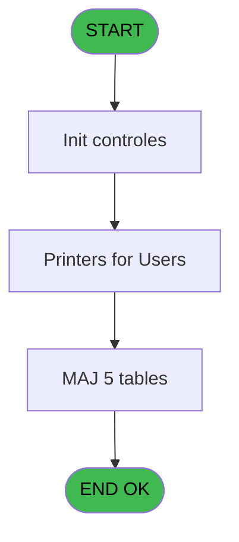
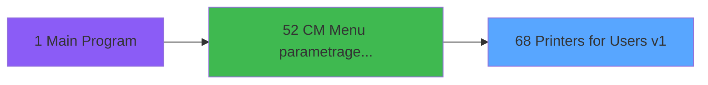
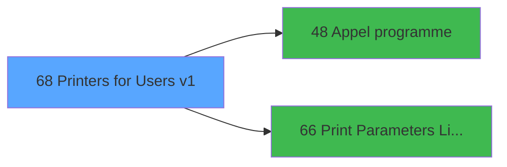

# MAI IDE 68 - Printers for Users v1

> **Analyse**: Phases 1-4 2026-02-03 15:00 -> 15:00 (9s) | Assemblage 15:00
> **Pipeline**: V7.2 Enrichi
> **Structure**: 4 onglets (Resume | Ecrans | Donnees | Connexions)

<!-- TAB:Resume -->

## 1. FICHE D'IDENTITE

| Attribut | Valeur |
|----------|--------|
| Projet | MAI |
| IDE Position | 68 |
| Nom Programme | Printers for Users v1 |
| Fichier source | `Prg_68.xml` |
| Dossier IDE | Printer |
| Taches | 46 (18 ecrans visibles) |
| Tables modifiees | 5 |
| Programmes appeles | 2 |

## 2. DESCRIPTION FONCTIONNELLE

**Printers for Users v1** assure la gestion complete de ce processus, accessible depuis [CM  Menu parametrage caisse (IDE 52)](MAI-IDE-52.md).

Le flux de traitement s'organise en **4 blocs fonctionnels** :

- **Traitement** (32 taches) : traitements metier divers
- **Impression** (9 taches) : generation de tickets et documents
- **Creation** (3 taches) : insertion d'enregistrements en base (mouvements, prestations)
- **Consultation** (2 taches) : ecrans de recherche, selection et consultation

**Donnees modifiees** : 5 tables en ecriture (imprimante_______prn, pms_print_param_default, presents_par_nationalite, pv_accounting_date, tempo_affiche).

Detail : phases du traitement

#### Phase 1 : Impression (9 taches)

- **68** - Printers for Users v1 **[[ECRAN]](#ecran-t1)**
- **68.1** - Printers for Users **[[ECRAN]](#ecran-t2)**
- **68.1.1** - Load Printer Choice
- **68.1.2.5** - Other printer **[[ECRAN]](#ecran-t9)**
- **68.1.2.6.1** - Zoom Printer **[[ECRAN]](#ecran-t13)**
- **68.1.6** - Printer choice **[[ECRAN]](#ecran-t29)**
- **68.1.6.1** - Zoom Printer **[[ECRAN]](#ecran-t30)**
- **68.1.7** - Printer exchange **[[ECRAN]](#ecran-t37)**
- **68.1.7.1** - Zoom Printer **[[ECRAN]](#ecran-t38)**

Delegue a : [Print Parameters Listing User (IDE 66)](MAI-IDE-66.md)

#### Phase 2 : Creation (3 taches)

- **68.1.2** - Listing to create **[[ECRAN]](#ecran-t4)**
- **68.1.3.1.1** - Create
- **68.1.5.3.1** - Create

#### Phase 3 : Traitement (32 taches)

- **68.1.2.1** - Load current
- **68.1.2.2** - Load dispo
- **68.1.2.3** - Delete before Gen
- **68.1.2.4** - Gen default listing
- **68.1.2.5.1** - Delete before Gen
- **68.1.2.5.2** - Gener Other
- **68.1.2.6** - Resultat **[[ECRAN]](#ecran-t12)**
- **68.1.2.7** - FirstAndLast
- **68.1.2.8** - Update copies
- **68.1.3** - Gener default **[[ECRAN]](#ecran-t16)**
- **68.1.3.1** - Read Default
- **68.1.4** - Purge **[[ECRAN]](#ecran-t19)**
- **68.1.4.1** - Purge
- **68.1.5** - Duplication **[[ECRAN]](#ecran-t21)**
- **68.1.5.2** - Duplication
- **68.1.5.3** - Terminal List Gener
- **68.1.5.4** - Terminal List Entry **[[ECRAN]](#ecran-t26)**
- **68.1.5.5** - Duplication
- **68.1.5.5.1** - Duplication
- **68.1.6.2** - Duplication
- **68.1.6.2.1** - Available
- **68.1.6.2.2** - Not Available
- **68.1.6.2.3** - This Listing Exist
- **68.1.6.2.4** - Purge
- **68.1.6.3** - Exist Listing
- **68.1.7.2** - Duplication
- **68.1.8** - Add New Listing **[[ECRAN]](#ecran-t40)**
- **68.1.8.2** - Read Term
- **68.1.8.2.1** - Add Listing
- **68.1.9** - Detail **[[ECRAN]](#ecran-t44)**
- **68.1.10** - Application choice **[[ECRAN]](#ecran-t45)**
- **68.1.11** - All Application

Delegue a : [Appel programme (IDE 48)](MAI-IDE-48.md)

#### Phase 4 : Consultation (2 taches)

- **68.1.5.1** - Zoom Terminal **[[ECRAN]](#ecran-t22)**
- **68.1.8.1** - Zoom Terminal **[[ECRAN]](#ecran-t41)**

#### Tables impactees

| Table | Operations | Role metier |
|-------|-----------|-------------|
| pv_accounting_date | R/**W**/L (25 usages) |  |
| pms_print_param_default | R/**W**/L (13 usages) |  |
| presents_par_nationalite | R/**W**/L (10 usages) |  |
| imprimante_______prn | R/**W** (5 usages) |  |
| tempo_affiche | R/**W**/L (4 usages) | Table temporaire ecran |

## 3. BLOCS FONCTIONNELS

### 3.1 Impression (9 taches)

Generation des documents et tickets.

---

#### 68 - Printers for Users v1 [[ECRAN]](#ecran-t1)

**Role** : Tache d'orchestration : point d'entree du programme (9 sous-taches). Coordonne l'enchainement des traitements.
**Ecran** : 1024 x 280 DLU (MDI) | [Voir mockup](#ecran-t1)

8 sous-taches directes

| Tache | Nom | Bloc |
|-------|-----|------|
| [68.1](#t2) | Printers for Users **[[ECRAN]](#ecran-t2)** | Impression |
| [68.1.1](#t3) | Load Printer Choice | Impression |
| [68.1.2.5](#t9) | Other printer **[[ECRAN]](#ecran-t9)** | Impression |
| [68.1.2.6.1](#t13) | Zoom Printer **[[ECRAN]](#ecran-t13)** | Impression |
| [68.1.6](#t29) | Printer choice **[[ECRAN]](#ecran-t29)** | Impression |
| [68.1.6.1](#t30) | Zoom Printer **[[ECRAN]](#ecran-t30)** | Impression |
| [68.1.7](#t37) | Printer exchange **[[ECRAN]](#ecran-t37)** | Impression |
| [68.1.7.1](#t38) | Zoom Printer **[[ECRAN]](#ecran-t38)** | Impression |

**Variables liees** : A (EndProgramForUsers)
**Delegue a** : [Print Parameters Listing User (IDE 66)](MAI-IDE-66.md)

---

#### 68.1 - Printers for Users [[ECRAN]](#ecran-t2)

**Role** : Generation du document : Printers for Users.
**Ecran** : 1203 x 322 DLU (MDI) | [Voir mockup](#ecran-t2)
**Variables liees** : A (EndProgramForUsers)
**Delegue a** : [Print Parameters Listing User (IDE 66)](MAI-IDE-66.md)

---

#### 68.1.1 - Load Printer Choice

**Role** : Generation du document : Load Printer Choice.
**Variables liees** : Q (Choice)
**Delegue a** : [Print Parameters Listing User (IDE 66)](MAI-IDE-66.md)

---

#### 68.1.2.5 - Other printer [[ECRAN]](#ecran-t9)

**Role** : Generation du document : Other printer.
**Ecran** : 610 x 173 DLU (MDI) | [Voir mockup](#ecran-t9)
**Delegue a** : [Print Parameters Listing User (IDE 66)](MAI-IDE-66.md)

---

#### 68.1.2.6.1 - Zoom Printer [[ECRAN]](#ecran-t13)

**Role** : Generation du document : Zoom Printer.
**Ecran** : 928 x 279 DLU (MDI) | [Voir mockup](#ecran-t13)
**Delegue a** : [Print Parameters Listing User (IDE 66)](MAI-IDE-66.md)

---

#### 68.1.6 - Printer choice [[ECRAN]](#ecran-t29)

**Role** : Generation du document : Printer choice.
**Ecran** : 640 x 0 DLU (MDI) | [Voir mockup](#ecran-t29)
**Variables liees** : Q (Choice)
**Delegue a** : [Print Parameters Listing User (IDE 66)](MAI-IDE-66.md)

---

#### 68.1.6.1 - Zoom Printer [[ECRAN]](#ecran-t30)

**Role** : Generation du document : Zoom Printer.
**Ecran** : 494 x 0 DLU (MDI) | [Voir mockup](#ecran-t30)
**Delegue a** : [Print Parameters Listing User (IDE 66)](MAI-IDE-66.md)

---

#### 68.1.7 - Printer exchange [[ECRAN]](#ecran-t37)

**Role** : Generation du document : Printer exchange.
**Ecran** : 640 x 0 DLU (MDI) | [Voir mockup](#ecran-t37)
**Delegue a** : [Print Parameters Listing User (IDE 66)](MAI-IDE-66.md)

---

#### 68.1.7.1 - Zoom Printer [[ECRAN]](#ecran-t38)

**Role** : Generation du document : Zoom Printer.
**Ecran** : 494 x 0 DLU (MDI) | [Voir mockup](#ecran-t38)
**Delegue a** : [Print Parameters Listing User (IDE 66)](MAI-IDE-66.md)

### 3.2 Creation (3 taches)

Insertion de nouveaux enregistrements en base.

---

#### 68.1.2 - Listing to create [[ECRAN]](#ecran-t4)

**Role** : Traitement : Listing to create.
**Ecran** : 1200 x 320 DLU (MDI) | [Voir mockup](#ecran-t4)
**Variables liees** : H (AllListingForThisTerm), L (AllListingForAllTerm)
**Delegue a** : [Print Parameters Listing User (IDE 66)](MAI-IDE-66.md)

---

#### 68.1.3.1.1 - Create

**Role** : Traitement : Create.

---

#### 68.1.5.3.1 - Create

**Role** : Traitement : Create.

### 3.3 Traitement (32 taches)

Traitements internes.

---

#### 68.1.2.1 - Load current

**Role** : Traitement : Load current.

---

#### 68.1.2.2 - Load dispo

**Role** : Traitement : Load dispo.

---

#### 68.1.2.3 - Delete before Gen

**Role** : Traitement : Delete before Gen.

---

#### 68.1.2.4 - Gen default listing

**Role** : Traitement : Gen default listing.
**Variables liees** : H (AllListingForThisTerm), L (AllListingForAllTerm)

---

#### 68.1.2.5.1 - Delete before Gen

**Role** : Traitement : Delete before Gen.

---

#### 68.1.2.5.2 - Gener Other

**Role** : Traitement : Gener Other.

---

#### 68.1.2.6 - Resultat [[ECRAN]](#ecran-t12)

**Role** : Traitement : Resultat.
**Ecran** : 1082 x 280 DLU (MDI) | [Voir mockup](#ecran-t12)

---

#### 68.1.2.7 - FirstAndLast

**Role** : Traitement : FirstAndLast.

---

#### 68.1.2.8 - Update copies

**Role** : Traitement : Update copies.

---

#### 68.1.3 - Gener default [[ECRAN]](#ecran-t16)

**Role** : Traitement : Gener default.
**Ecran** : 700 x 153 DLU (MDI) | [Voir mockup](#ecran-t16)

---

#### 68.1.3.1 - Read Default

**Role** : Traitement : Read Default.

---

#### 68.1.4 - Purge [[ECRAN]](#ecran-t19)

**Role** : Traitement : Purge.
**Ecran** : 700 x 153 DLU (MDI) | [Voir mockup](#ecran-t19)
**Variables liees** : I (Confirm purge for this term), M (Confirmation purge)

---

#### 68.1.4.1 - Purge

**Role** : Traitement : Purge.
**Variables liees** : I (Confirm purge for this term), M (Confirmation purge)

---

#### 68.1.5 - Duplication [[ECRAN]](#ecran-t21)

**Role** : Traitement : Duplication.
**Ecran** : 640 x 0 DLU (MDI) | [Voir mockup](#ecran-t21)

---

#### 68.1.5.2 - Duplication

**Role** : Traitement : Duplication.

---

#### 68.1.5.3 - Terminal List Gener

**Role** : Traitement : Terminal List Gener.
**Variables liees** : B (Terminal_Position), H (AllListingForThisTerm), L (AllListingForAllTerm)

---

#### 68.1.5.4 - Terminal List Entry [[ECRAN]](#ecran-t26)

**Role** : Traitement : Terminal List Entry.
**Ecran** : 613 x 319 DLU (MDI) | [Voir mockup](#ecran-t26)
**Variables liees** : B (Terminal_Position), H (AllListingForThisTerm), L (AllListingForAllTerm)

---

#### 68.1.5.5 - Duplication

**Role** : Traitement : Duplication.

---

#### 68.1.5.5.1 - Duplication

**Role** : Traitement : Duplication.

---

#### 68.1.6.2 - Duplication

**Role** : Traitement : Duplication.

---

#### 68.1.6.2.1 - Available

**Role** : Traitement : Available.

---

#### 68.1.6.2.2 - Not Available

**Role** : Traitement : Not Available.

---

#### 68.1.6.2.3 - This Listing Exist

**Role** : Traitement : This Listing Exist.
**Variables liees** : G (Confirm All for this term), H (AllListingForThisTerm), I (Confirm purge for this term), J (AllRazForThisTerm), L (AllListingForAllTerm)

---

#### 68.1.6.2.4 - Purge

**Role** : Traitement : Purge.
**Variables liees** : I (Confirm purge for this term), M (Confirmation purge)

---

#### 68.1.6.3 - Exist Listing

**Role** : Traitement : Exist Listing.
**Variables liees** : H (AllListingForThisTerm), L (AllListingForAllTerm), O (Exist)

---

#### 68.1.7.2 - Duplication

**Role** : Traitement : Duplication.

---

#### 68.1.8 - Add New Listing [[ECRAN]](#ecran-t40)

**Role** : Traitement : Add New Listing.
**Ecran** : 640 x 0 DLU (MDI) | [Voir mockup](#ecran-t40)
**Variables liees** : H (AllListingForThisTerm), L (AllListingForAllTerm)

---

#### 68.1.8.2 - Read Term

**Role** : Traitement : Read Term.
**Variables liees** : B (Terminal_Position), G (Confirm All for this term), H (AllListingForThisTerm), I (Confirm purge for this term), J (AllRazForThisTerm)

---

#### 68.1.8.2.1 - Add Listing

**Role** : Traitement : Add Listing.
**Variables liees** : H (AllListingForThisTerm), L (AllListingForAllTerm)

---

#### 68.1.9 - Detail [[ECRAN]](#ecran-t44)

**Role** : Traitement : Detail.
**Ecran** : 720 x 172 DLU (Modal) | [Voir mockup](#ecran-t44)

---

#### 68.1.10 - Application choice [[ECRAN]](#ecran-t45)

**Role** : Traitement : Application choice.
**Ecran** : 640 x 0 DLU (MDI) | [Voir mockup](#ecran-t45)
**Variables liees** : Q (Choice), R (Application Selection)

---

#### 68.1.11 - All Application

**Role** : Traitement : All Application.
**Variables liees** : R (Application Selection)

### 3.4 Consultation (2 taches)

Ecrans de recherche et consultation.

---

#### 68.1.5.1 - Zoom Terminal [[ECRAN]](#ecran-t22)

**Role** : Selection par l'operateur : Zoom Terminal.
**Ecran** : 494 x 0 DLU (MDI) | [Voir mockup](#ecran-t22)
**Variables liees** : B (Terminal_Position)

---

#### 68.1.8.1 - Zoom Terminal [[ECRAN]](#ecran-t41)

**Role** : Selection par l'operateur : Zoom Terminal.
**Ecran** : 494 x 0 DLU (MDI) | [Voir mockup](#ecran-t41)
**Variables liees** : B (Terminal_Position)

## 5. REGLES METIER

*(Aucune regle metier identifiee)*

## 6. CONTEXTE

- **Appele par**: [CM  Menu parametrage caisse (IDE 52)](MAI-IDE-52.md)
- **Appelle**: 2 programmes | **Tables**: 7 (W:5 R:5 L:6) | **Taches**: 46 | **Expressions**: 1

<!-- TAB:Ecrans -->

## 8. ECRANS

### 8.1 Forms visibles (18 / 46)

| # | Position | Tache | Nom | Type | Largeur | Hauteur | Bloc |
|---|----------|-------|-----|------|---------|---------|------|
| 1 | 68.1 | 68.1 | Printers for Users | MDI | 1203 | 322 | Impression |
| 2 | 68.1.2 | 68.1.2 | Listing to create | MDI | 1200 | 320 | Creation |
| 3 | 68.1.2.5 | 68.1.2.5 | Other printer | MDI | 610 | 173 | Impression |
| 4 | 68.1.2.6 | 68.1.2.6 | Resultat | MDI | 1082 | 280 | Traitement |
| 5 | 68.1.2.6.1 | 68.1.2.6.1 | Zoom Printer | MDI | 928 | 279 | Impression |
| 6 | 68.1.3 | 68.1.3 | Gener default | MDI | 700 | 153 | Traitement |
| 7 | 68.1.4 | 68.1.4 | Purge | MDI | 700 | 153 | Traitement |
| 8 | 68.1.5 | 68.1.5 | Duplication | MDI | 640 | 0 | Traitement |
| 9 | 68.1.5.1 | 68.1.5.1 | Zoom Terminal | MDI | 494 | 0 | Consultation |
| 10 | 68.1.5.4 | 68.1.5.4 | Terminal List Entry | MDI | 613 | 319 | Traitement |
| 11 | 68.1.6 | 68.1.6 | Printer choice | MDI | 640 | 0 | Impression |
| 12 | 68.1.6.1 | 68.1.6.1 | Zoom Printer | MDI | 494 | 0 | Impression |
| 13 | 68.1.7 | 68.1.7 | Printer exchange | MDI | 640 | 0 | Impression |
| 14 | 68.1.7.1 | 68.1.7.1 | Zoom Printer | MDI | 494 | 0 | Impression |
| 15 | 68.1.8 | 68.1.8 | Add New Listing | MDI | 640 | 0 | Traitement |
| 16 | 68.1.8.1 | 68.1.8.1 | Zoom Terminal | MDI | 494 | 0 | Consultation |
| 17 | 68.1.9 | 68.1.9 | Detail | Modal | 720 | 172 | Traitement |
| 18 | 68.1.10 | 68.1.10 | Application choice | MDI | 640 | 0 | Traitement |

### 8.2 Mockups Ecrans

---

#### 68.1 - Printers for Users
**Tache** : [68.1](#t2) | **Type** : MDI | **Dimensions** : 1203 x 322 DLU
**Bloc** : Impression | **Titre IDE** : Printers for Users

<!-- FORM-DATA:
{
    "width":  1203,
    "vFactor":  8,
    "type":  "MDI",
    "hFactor":  8,
    "controls":  [
                     {
                         "x":  7,
                         "type":  "label",
                         "var":  "",
                         "y":  2,
                         "w":  1185,
                         "fmt":  "",
                         "name":  "",
                         "h":  18,
                         "color":  "",
                         "text":  "",
                         "parent":  null
                     },
                     {
                         "x":  7,
                         "type":  "label",
                         "var":  "",
                         "y":  23,
                         "w":  1185,
                         "fmt":  "",
                         "name":  "",
                         "h":  272,
                         "color":  "",
                         "text":  "",
                         "parent":  null
                     },
                     {
                         "x":  21,
                         "type":  "table",
                         "var":  "",
                         "name":  "",
                         "titleH":  12,
                         "color":  "110",
                         "w":  442,
                         "y":  28,
                         "fmt":  "",
                         "parent":  null,
                         "text":  "",
                         "rowH":  13,
                         "h":  165,
                         "cols":  [
                                      {
                                          "title":  "Terminal",
                                          "layer":  1,
                                          "w":  75
                                      },
                                      {
                                          "title":  "Terminal name",
                                          "layer":  2,
                                          "w":  332
                                      }
                                  ],
                         "rows":  2
                     },
                     {
                         "x":  15,
                         "type":  "label",
                         "var":  "",
                         "y":  197,
                         "w":  441,
                         "fmt":  "",
                         "name":  "",
                         "h":  95,
                         "color":  "",
                         "text":  "",
                         "parent":  null
                     },
                     {
                         "x":  26,
                         "type":  "label",
                         "var":  "",
                         "y":  200,
                         "w":  420,
                         "fmt":  "",
                         "name":  "",
                         "h":  89,
                         "color":  "",
                         "text":  "",
                         "parent":  null
                     },
                     {
                         "x":  184,
                         "type":  "label",
                         "var":  "",
                         "y":  201,
                         "w":  45,
                         "fmt":  "",
                         "name":  "",
                         "h":  87,
                         "color":  "",
                         "text":  "",
                         "parent":  null
                     },
                     {
                         "x":  231,
                         "type":  "label",
                         "var":  "",
                         "y":  203,
                         "w":  208,
                         "fmt":  "",
                         "name":  "",
                         "h":  8,
                         "color":  "7",
                         "text":  "Management",
                         "parent":  null
                     },
                     {
                         "x":  473,
                         "type":  "label",
                         "var":  "",
                         "y":  204,
                         "w":  709,
                         "fmt":  "",
                         "name":  "",
                         "h":  17,
                         "color":  "180",
                         "text":  "",
                         "parent":  null
                     },
                     {
                         "x":  231,
                         "type":  "label",
                         "var":  "",
                         "y":  215,
                         "w":  208,
                         "fmt":  "",
                         "name":  "",
                         "h":  8,
                         "color":  "7",
                         "text":  "Duplication",
                         "parent":  null
                     },
                     {
                         "x":  231,
                         "type":  "label",
                         "var":  "",
                         "y":  227,
                         "w":  208,
                         "fmt":  "",
                         "name":  "",
                         "h":  8,
                         "color":  "7",
                         "text":  "Choix imprimante",
                         "parent":  null
                     },
                     {
                         "x":  473,
                         "type":  "label",
                         "var":  "",
                         "y":  228,
                         "w":  709,
                         "fmt":  "",
                         "name":  "",
                         "h":  17,
                         "color":  "180",
                         "text":  "",
                         "parent":  null
                     },
                     {
                         "x":  231,
                         "type":  "label",
                         "var":  "",
                         "y":  239,
                         "w":  208,
                         "fmt":  "",
                         "name":  "",
                         "h":  8,
                         "color":  "7",
                         "text":  "Echange imprimante",
                         "parent":  null
                     },
                     {
                         "x":  231,
                         "type":  "label",
                         "var":  "",
                         "y":  251,
                         "w":  208,
                         "fmt":  "",
                         "name":  "",
                         "h":  8,
                         "color":  "7",
                         "text":  "Visualisation",
                         "parent":  null
                     },
                     {
                         "x":  473,
                         "type":  "label",
                         "var":  "",
                         "y":  252,
                         "w":  709,
                         "fmt":  "",
                         "name":  "",
                         "h":  17,
                         "color":  "179",
                         "text":  "",
                         "parent":  null
                     },
                     {
                         "x":  36,
                         "type":  "label",
                         "var":  "",
                         "y":  257,
                         "w":  141,
                         "fmt":  "",
                         "name":  "",
                         "h":  10,
                         "color":  "",
                         "text":  "Votre choix",
                         "parent":  null
                     },
                     {
                         "x":  231,
                         "type":  "label",
                         "var":  "",
                         "y":  263,
                         "w":  208,
                         "fmt":  "",
                         "name":  "",
                         "h":  8,
                         "color":  "7",
                         "text":  "Ajouter une edition",
                         "parent":  null
                     },
                     {
                         "x":  231,
                         "type":  "label",
                         "var":  "",
                         "y":  275,
                         "w":  208,
                         "fmt":  "",
                         "name":  "",
                         "h":  8,
                         "color":  "7",
                         "text":  "Listing",
                         "parent":  null
                     },
                     {
                         "x":  473,
                         "type":  "label",
                         "var":  "",
                         "y":  276,
                         "w":  709,
                         "fmt":  "",
                         "name":  "",
                         "h":  17,
                         "color":  "179",
                         "text":  "",
                         "parent":  null
                     },
                     {
                         "x":  7,
                         "type":  "label",
                         "var":  "",
                         "y":  298,
                         "w":  1185,
                         "fmt":  "",
                         "name":  "",
                         "h":  22,
                         "color":  "",
                         "text":  "",
                         "parent":  null
                     },
                     {
                         "x":  15,
                         "type":  "button",
                         "var":  "",
                         "y":  300,
                         "w":  160,
                         "fmt":  "",
                         "name":  "EndButton",
                         "h":  18,
                         "color":  "",
                         "text":  "",
                         "parent":  null
                     },
                     {
                         "x":  466,
                         "type":  "button",
                         "var":  "",
                         "y":  223,
                         "w":  712,
                         "fmt":  "",
                         "name":  "AllListingForThisTerm",
                         "h":  20,
                         "color":  "",
                         "text":  "",
                         "parent":  null
                     },
                     {
                         "x":  466,
                         "type":  "button",
                         "var":  "",
                         "y":  199,
                         "w":  712,
                         "fmt":  "",
                         "name":  "AllRazForThisTerm",
                         "h":  20,
                         "color":  "",
                         "text":  "",
                         "parent":  null
                     },
                     {
                         "x":  466,
                         "type":  "button",
                         "var":  "",
                         "y":  271,
                         "w":  712,
                         "fmt":  "",
                         "name":  "AllListingForAllTerm",
                         "h":  20,
                         "color":  "",
                         "text":  "",
                         "parent":  null
                     },
                     {
                         "x":  466,
                         "type":  "button",
                         "var":  "",
                         "y":  247,
                         "w":  712,
                         "fmt":  "",
                         "name":  "AllRazForAllTerm",
                         "h":  20,
                         "color":  "",
                         "text":  "",
                         "parent":  null
                     },
                     {
                         "x":  27,
                         "type":  "edit",
                         "var":  "",
                         "y":  42,
                         "w":  68,
                         "fmt":  "",
                         "name":  "PRN N° terminal",
                         "h":  11,
                         "color":  "171",
                         "text":  "",
                         "parent":  5
                     },
                     {
                         "x":  101,
                         "type":  "edit",
                         "var":  "",
                         "y":  42,
                         "w":  322,
                         "fmt":  "",
                         "name":  "",
                         "h":  11,
                         "color":  "171",
                         "text":  "",
                         "parent":  5
                     },
                     {
                         "x":  84,
                         "type":  "edit",
                         "var":  "",
                         "y":  273,
                         "w":  45,
                         "fmt":  "UA",
                         "name":  "Choice",
                         "h":  10,
                         "color":  "6",
                         "text":  "",
                         "parent":  null
                     },
                     {
                         "x":  942,
                         "type":  "checkbox",
                         "var":  "",
                         "y":  303,
                         "w":  236,
                         "fmt":  "",
                         "name":  "Application Selection",
                         "h":  12,
                         "color":  "",
                         "text":  " Application Selection",
                         "parent":  27
                     },
                     {
                         "x":  13,
                         "type":  "edit",
                         "var":  "",
                         "y":  6,
                         "w":  267,
                         "fmt":  "30",
                         "name":  "",
                         "h":  8,
                         "color":  "",
                         "text":  "",
                         "parent":  null
                     },
                     {
                         "x":  879,
                         "type":  "edit",
                         "var":  "",
                         "y":  7,
                         "w":  296,
                         "fmt":  "WWW DD MMM YYYYT",
                         "name":  "",
                         "h":  8,
                         "color":  "",
                         "text":  "",
                         "parent":  null
                     },
                     {
                         "x":  36,
                         "type":  "image",
                         "var":  "",
                         "y":  203,
                         "w":  141,
                         "fmt":  "",
                         "name":  "",
                         "h":  48,
                         "color":  "",
                         "text":  "",
                         "parent":  null
                     },
                     {
                         "x":  193,
                         "type":  "button",
                         "var":  "",
                         "y":  203,
                         "w":  26,
                         "fmt":  "1",
                         "name":  "1",
                         "h":  8,
                         "color":  "",
                         "text":  "",
                         "parent":  null
                     },
                     {
                         "x":  193,
                         "type":  "button",
                         "var":  "",
                         "y":  215,
                         "w":  26,
                         "fmt":  "2",
                         "name":  "2",
                         "h":  8,
                         "color":  "",
                         "text":  "",
                         "parent":  null
                     },
                     {
                         "x":  193,
                         "type":  "button",
                         "var":  "",
                         "y":  227,
                         "w":  26,
                         "fmt":  "3",
                         "name":  "3",
                         "h":  8,
                         "color":  "",
                         "text":  "",
                         "parent":  null
                     },
                     {
                         "x":  193,
                         "type":  "button",
                         "var":  "",
                         "y":  239,
                         "w":  26,
                         "fmt":  "4",
                         "name":  "4",
                         "h":  8,
                         "color":  "",
                         "text":  "",
                         "parent":  null
                     },
                     {
                         "x":  193,
                         "type":  "button",
                         "var":  "",
                         "y":  251,
                         "w":  26,
                         "fmt":  "5",
                         "name":  "5",
                         "h":  8,
                         "color":  "",
                         "text":  "",
                         "parent":  null
                     },
                     {
                         "x":  193,
                         "type":  "button",
                         "var":  "",
                         "y":  263,
                         "w":  26,
                         "fmt":  "6",
                         "name":  "6",
                         "h":  8,
                         "color":  "",
                         "text":  "",
                         "parent":  null
                     },
                     {
                         "x":  193,
                         "type":  "button",
                         "var":  "",
                         "y":  275,
                         "w":  26,
                         "fmt":  "7",
                         "name":  "7",
                         "h":  8,
                         "color":  "",
                         "text":  "",
                         "parent":  null
                     }
                 ],
    "taskId":  "68.1",
    "height":  322
}
-->

<strong>Champs : 6 champs</strong>

| Pos (x,y) | Nom | Variable | Type |
|-----------|-----|----------|------|
| 27,42 | PRN N° terminal | - | edit |
| 101,42 | (sans nom) | - | edit |
| 84,273 | Choice | - | edit |
| 942,303 | Application Selection | - | checkbox |
| 13,6 | 30 | - | edit |
| 879,7 | WWW DD MMM YYYYT | - | edit |

<strong>Boutons : 12 boutons</strong>

| Bouton | Pos (x,y) | Action |
|--------|-----------|--------|
| EndButton | 15,300 | Bouton fonctionnel |
| AllListingForThisTerm | 466,223 | Bouton fonctionnel |
| AllRazForThisTerm | 466,199 | Bouton fonctionnel |
| AllListingForAllTerm | 466,271 | Bouton fonctionnel |
| AllRazForAllTerm | 466,247 | Bouton fonctionnel |
| 1 | 193,203 | Bouton fonctionnel |
| 2 | 193,215 | Bouton fonctionnel |
| 3 | 193,227 | Bouton fonctionnel |
| 4 | 193,239 | Bouton fonctionnel |
| 5 | 193,251 | Bouton fonctionnel |
| 6 | 193,263 | Bouton fonctionnel |
| 7 | 193,275 | Bouton fonctionnel |

---

#### 68.1.2 - Listing to create
**Tache** : [68.1.2](#t4) | **Type** : MDI | **Dimensions** : 1200 x 320 DLU
**Bloc** : Creation | **Titre IDE** : Listing to create

<!-- FORM-DATA:
{
    "width":  1200,
    "vFactor":  8,
    "type":  "MDI",
    "hFactor":  8,
    "controls":  [
                     {
                         "x":  0,
                         "type":  "table",
                         "var":  "",
                         "name":  "",
                         "titleH":  12,
                         "color":  "110",
                         "w":  1006,
                         "y":  1,
                         "fmt":  "",
                         "parent":  null,
                         "text":  "",
                         "rowH":  13,
                         "h":  293,
                         "cols":  [
                                      {
                                          "title":  "#",
                                          "layer":  1,
                                          "w":  49
                                      },
                                      {
                                          "title":  "Description",
                                          "layer":  2,
                                          "w":  398
                                      },
                                      {
                                          "title":  "CTL",
                                          "layer":  3,
                                          "w":  144
                                      },
                                      {
                                          "title":  "Default",
                                          "layer":  4,
                                          "w":  63
                                      },
                                      {
                                          "title":  "Other",
                                          "layer":  5,
                                          "w":  53
                                      },
                                      {
                                          "title":  "Defined Printer",
                                          "layer":  6,
                                          "w":  157
                                      },
                                      {
                                          "title":  "Tray",
                                          "layer":  7,
                                          "w":  42
                                      },
                                      {
                                          "title":  "Copies",
                                          "layer":  8,
                                          "w":  65
                                      }
                                  ],
                         "rows":  8
                     },
                     {
                         "x":  1008,
                         "type":  "label",
                         "var":  "",
                         "y":  1,
                         "w":  176,
                         "fmt":  "",
                         "name":  "",
                         "h":  10,
                         "color":  "",
                         "text":  "Available Printers",
                         "parent":  null
                     },
                     {
                         "x":  347,
                         "type":  "label",
                         "var":  "",
                         "y":  300,
                         "w":  320,
                         "fmt":  "",
                         "name":  "",
                         "h":  18,
                         "color":  "144",
                         "text":  "Clic Default to set default printer",
                         "parent":  null
                     },
                     {
                         "x":  669,
                         "type":  "label",
                         "var":  "",
                         "y":  300,
                         "w":  320,
                         "fmt":  "",
                         "name":  "",
                         "h":  18,
                         "color":  "146",
                         "text":  "Clic Other to choose other one",
                         "parent":  null
                     },
                     {
                         "x":  8,
                         "type":  "edit",
                         "var":  "",
                         "y":  15,
                         "w":  40,
                         "fmt":  "",
                         "name":  "",
                         "h":  10,
                         "color":  "110",
                         "text":  "",
                         "parent":  1
                     },
                     {
                         "x":  456,
                         "type":  "edit",
                         "var":  "",
                         "y":  15,
                         "w":  132,
                         "fmt":  "",
                         "name":  "",
                         "h":  10,
                         "color":  "110",
                         "text":  "",
                         "parent":  1
                     },
                     {
                         "x":  603,
                         "type":  "button",
                         "var":  "",
                         "y":  15,
                         "w":  42,
                         "fmt":  "",
                         "name":  "Choice Default",
                         "h":  12,
                         "color":  "",
                         "text":  "",
                         "parent":  1
                     },
                     {
                         "x":  664,
                         "type":  "button",
                         "var":  "",
                         "y":  15,
                         "w":  42,
                         "fmt":  "",
                         "name":  "Choice Other",
                         "h":  12,
                         "color":  "",
                         "text":  "",
                         "parent":  1
                     },
                     {
                         "x":  917,
                         "type":  "edit",
                         "var":  "",
                         "y":  15,
                         "w":  30,
                         "fmt":  "",
                         "name":  "Copies",
                         "h":  10,
                         "color":  "110",
                         "text":  "",
                         "parent":  1
                     },
                     {
                         "x":  717,
                         "type":  "edit",
                         "var":  "",
                         "y":  15,
                         "w":  145,
                         "fmt":  "",
                         "name":  "",
                         "h":  10,
                         "color":  "110",
                         "text":  "",
                         "parent":  1
                     },
                     {
                         "x":  870,
                         "type":  "edit",
                         "var":  "",
                         "y":  15,
                         "w":  30,
                         "fmt":  "",
                         "name":  "",
                         "h":  10,
                         "color":  "110",
                         "text":  "",
                         "parent":  1
                     },
                     {
                         "x":  56,
                         "type":  "edit",
                         "var":  "",
                         "y":  15,
                         "w":  387,
                         "fmt":  "64",
                         "name":  "",
                         "h":  10,
                         "color":  "110",
                         "text":  "",
                         "parent":  1
                     },
                     {
                         "x":  1008,
                         "type":  "edit",
                         "var":  "",
                         "y":  15,
                         "w":  176,
                         "fmt":  "64",
                         "name":  "",
                         "h":  6,
                         "color":  "",
                         "text":  "",
                         "parent":  null
                     },
                     {
                         "x":  1008,
                         "type":  "edit",
                         "var":  "",
                         "y":  23,
                         "w":  176,
                         "fmt":  "64",
                         "name":  "",
                         "h":  6,
                         "color":  "",
                         "text":  "",
                         "parent":  null
                     },
                     {
                         "x":  1008,
                         "type":  "edit",
                         "var":  "",
                         "y":  31,
                         "w":  176,
                         "fmt":  "64",
                         "name":  "",
                         "h":  6,
                         "color":  "",
                         "text":  "",
                         "parent":  null
                     },
                     {
                         "x":  1008,
                         "type":  "edit",
                         "var":  "",
                         "y":  39,
                         "w":  176,
                         "fmt":  "64",
                         "name":  "",
                         "h":  6,
                         "color":  "",
                         "text":  "",
                         "parent":  null
                     },
                     {
                         "x":  1008,
                         "type":  "edit",
                         "var":  "",
                         "y":  47,
                         "w":  176,
                         "fmt":  "64",
                         "name":  "",
                         "h":  6,
                         "color":  "",
                         "text":  "",
                         "parent":  null
                     },
                     {
                         "x":  1008,
                         "type":  "edit",
                         "var":  "",
                         "y":  55,
                         "w":  176,
                         "fmt":  "64",
                         "name":  "",
                         "h":  6,
                         "color":  "",
                         "text":  "",
                         "parent":  null
                     },
                     {
                         "x":  1008,
                         "type":  "edit",
                         "var":  "",
                         "y":  63,
                         "w":  176,
                         "fmt":  "64",
                         "name":  "",
                         "h":  6,
                         "color":  "",
                         "text":  "",
                         "parent":  null
                     },
                     {
                         "x":  1008,
                         "type":  "edit",
                         "var":  "",
                         "y":  71,
                         "w":  176,
                         "fmt":  "64",
                         "name":  "",
                         "h":  6,
                         "color":  "",
                         "text":  "",
                         "parent":  null
                     },
                     {
                         "x":  1008,
                         "type":  "edit",
                         "var":  "",
                         "y":  79,
                         "w":  176,
                         "fmt":  "64",
                         "name":  "",
                         "h":  6,
                         "color":  "",
                         "text":  "",
                         "parent":  null
                     },
                     {
                         "x":  1008,
                         "type":  "edit",
                         "var":  "",
                         "y":  87,
                         "w":  176,
                         "fmt":  "64",
                         "name":  "",
                         "h":  6,
                         "color":  "",
                         "text":  "",
                         "parent":  null
                     },
                     {
                         "x":  1008,
                         "type":  "edit",
                         "var":  "",
                         "y":  95,
                         "w":  176,
                         "fmt":  "64",
                         "name":  "",
                         "h":  6,
                         "color":  "",
                         "text":  "",
                         "parent":  null
                     },
                     {
                         "x":  1008,
                         "type":  "edit",
                         "var":  "",
                         "y":  103,
                         "w":  176,
                         "fmt":  "64",
                         "name":  "",
                         "h":  6,
                         "color":  "",
                         "text":  "",
                         "parent":  null
                     },
                     {
                         "x":  1008,
                         "type":  "edit",
                         "var":  "",
                         "y":  111,
                         "w":  176,
                         "fmt":  "64",
                         "name":  "",
                         "h":  6,
                         "color":  "",
                         "text":  "",
                         "parent":  null
                     },
                     {
                         "x":  1008,
                         "type":  "edit",
                         "var":  "",
                         "y":  119,
                         "w":  176,
                         "fmt":  "64",
                         "name":  "",
                         "h":  6,
                         "color":  "",
                         "text":  "",
                         "parent":  null
                     },
                     {
                         "x":  1008,
                         "type":  "edit",
                         "var":  "",
                         "y":  127,
                         "w":  176,
                         "fmt":  "64",
                         "name":  "",
                         "h":  6,
                         "color":  "",
                         "text":  "",
                         "parent":  null
                     },
                     {
                         "x":  1008,
                         "type":  "edit",
                         "var":  "",
                         "y":  135,
                         "w":  176,
                         "fmt":  "64",
                         "name":  "",
                         "h":  6,
                         "color":  "",
                         "text":  "",
                         "parent":  null
                     },
                     {
                         "x":  1008,
                         "type":  "edit",
                         "var":  "",
                         "y":  143,
                         "w":  176,
                         "fmt":  "64",
                         "name":  "",
                         "h":  6,
                         "color":  "",
                         "text":  "",
                         "parent":  null
                     },
                     {
                         "x":  1008,
                         "type":  "edit",
                         "var":  "",
                         "y":  151,
                         "w":  176,
                         "fmt":  "64",
                         "name":  "",
                         "h":  6,
                         "color":  "",
                         "text":  "",
                         "parent":  null
                     },
                     {
                         "x":  1008,
                         "type":  "edit",
                         "var":  "",
                         "y":  159,
                         "w":  176,
                         "fmt":  "64",
                         "name":  "",
                         "h":  6,
                         "color":  "",
                         "text":  "",
                         "parent":  null
                     },
                     {
                         "x":  1008,
                         "type":  "edit",
                         "var":  "",
                         "y":  167,
                         "w":  176,
                         "fmt":  "64",
                         "name":  "",
                         "h":  6,
                         "color":  "",
                         "text":  "",
                         "parent":  null
                     },
                     {
                         "x":  15,
                         "type":  "button",
                         "var":  "",
                         "y":  300,
                         "w":  160,
                         "fmt":  "Quitter",
                         "name":  "",
                         "h":  18,
                         "color":  "",
                         "text":  "",
                         "parent":  null
                     }
                 ],
    "taskId":  "68.1.2",
    "height":  320
}
-->

<strong>Champs : 26 champs</strong>

| Pos (x,y) | Nom | Variable | Type |
|-----------|-----|----------|------|
| 8,15 | (sans nom) | - | edit |
| 456,15 | (sans nom) | - | edit |
| 917,15 | Copies | - | edit |
| 717,15 | (sans nom) | - | edit |
| 870,15 | (sans nom) | - | edit |
| 56,15 | 64 | - | edit |
| 1008,15 | 64 | - | edit |
| 1008,23 | 64 | - | edit |
| 1008,31 | 64 | - | edit |
| 1008,39 | 64 | - | edit |
| 1008,47 | 64 | - | edit |
| 1008,55 | 64 | - | edit |
| 1008,63 | 64 | - | edit |
| 1008,71 | 64 | - | edit |
| 1008,79 | 64 | - | edit |
| 1008,87 | 64 | - | edit |
| 1008,95 | 64 | - | edit |
| 1008,103 | 64 | - | edit |
| 1008,111 | 64 | - | edit |
| 1008,119 | 64 | - | edit |
| 1008,127 | 64 | - | edit |
| 1008,135 | 64 | - | edit |
| 1008,143 | 64 | - | edit |
| 1008,151 | 64 | - | edit |
| 1008,159 | 64 | - | edit |
| 1008,167 | 64 | - | edit |

<strong>Boutons : 3 boutons</strong>

| Bouton | Pos (x,y) | Action |
|--------|-----------|--------|
| Choice Default | 603,15 | Bouton fonctionnel |
| Choice Other | 664,15 | Bouton fonctionnel |
| Quitter | 15,300 | Quitte le programme |

---

#### 68.1.2.5 - Other printer
**Tache** : [68.1.2.5](#t9) | **Type** : MDI | **Dimensions** : 610 x 173 DLU
**Bloc** : Impression | **Titre IDE** : Other printer

<!-- FORM-DATA:
{
    "width":  610,
    "vFactor":  8,
    "type":  "MDI",
    "hFactor":  8,
    "controls":  [
                     {
                         "x":  8,
                         "type":  "table",
                         "var":  "",
                         "name":  "",
                         "titleH":  11,
                         "color":  "196",
                         "w":  586,
                         "y":  3,
                         "fmt":  "",
                         "parent":  null,
                         "text":  "",
                         "rowH":  12,
                         "h":  144,
                         "cols":  [
                                      {
                                          "title":  "Chrono",
                                          "layer":  1,
                                          "w":  78
                                      },
                                      {
                                          "title":  "Libelle",
                                          "layer":  2,
                                          "w":  418
                                      },
                                      {
                                          "title":  "Bac",
                                          "layer":  3,
                                          "w":  55
                                      }
                                  ],
                         "rows":  3
                     },
                     {
                         "x":  16,
                         "type":  "edit",
                         "var":  "",
                         "y":  16,
                         "w":  42,
                         "fmt":  "",
                         "name":  "",
                         "h":  8,
                         "color":  "196",
                         "text":  "",
                         "parent":  1
                     },
                     {
                         "x":  94,
                         "type":  "edit",
                         "var":  "",
                         "y":  16,
                         "w":  400,
                         "fmt":  "",
                         "name":  "",
                         "h":  8,
                         "color":  "196",
                         "text":  "",
                         "parent":  1
                     },
                     {
                         "x":  514,
                         "type":  "edit",
                         "var":  "",
                         "y":  16,
                         "w":  38,
                         "fmt":  "",
                         "name":  "",
                         "h":  8,
                         "color":  "196",
                         "text":  "",
                         "parent":  1
                     },
                     {
                         "x":  432,
                         "type":  "button",
                         "var":  "",
                         "y":  151,
                         "w":  154,
                         "fmt":  "Select",
                         "name":  "",
                         "h":  14,
                         "color":  "",
                         "text":  "",
                         "parent":  null
                     },
                     {
                         "x":  8,
                         "type":  "button",
                         "var":  "",
                         "y":  151,
                         "w":  154,
                         "fmt":  "Exit",
                         "name":  "",
                         "h":  14,
                         "color":  "",
                         "text":  "",
                         "parent":  null
                     }
                 ],
    "taskId":  "68.1.2.5",
    "height":  173
}
-->

<strong>Champs : 3 champs</strong>

| Pos (x,y) | Nom | Variable | Type |
|-----------|-----|----------|------|
| 16,16 | (sans nom) | - | edit |
| 94,16 | (sans nom) | - | edit |
| 514,16 | (sans nom) | - | edit |

<strong>Boutons : 2 boutons</strong>

| Bouton | Pos (x,y) | Action |
|--------|-----------|--------|
| Select | 432,151 | Ouvre la selection |
| Exit | 8,151 | Quitte le programme |

---

#### 68.1.2.6 - Resultat
**Tache** : [68.1.2.6](#t12) | **Type** : MDI | **Dimensions** : 1082 x 280 DLU
**Bloc** : Traitement | **Titre IDE** : Resultat

<!-- FORM-DATA:
{
    "width":  1082,
    "vFactor":  8,
    "type":  "MDI",
    "hFactor":  8,
    "controls":  [
                     {
                         "x":  8,
                         "type":  "table",
                         "var":  "",
                         "name":  "",
                         "titleH":  12,
                         "color":  "110",
                         "w":  1061,
                         "y":  6,
                         "fmt":  "",
                         "parent":  null,
                         "text":  "",
                         "rowH":  14,
                         "h":  261,
                         "cols":  [
                                      {
                                          "title":  "Terminal",
                                          "layer":  1,
                                          "w":  88
                                      },
                                      {
                                          "title":  "Edition",
                                          "layer":  2,
                                          "w":  76
                                      },
                                      {
                                          "title":  "Imrimante",
                                          "layer":  3,
                                          "w":  114
                                      },
                                      {
                                          "title":  "Libelle",
                                          "layer":  4,
                                          "w":  742
                                      }
                                  ],
                         "rows":  4
                     },
                     {
                         "x":  16,
                         "type":  "edit",
                         "var":  "",
                         "y":  19,
                         "w":  42,
                         "fmt":  "",
                         "name":  "Terminal",
                         "h":  10,
                         "color":  "110",
                         "text":  "",
                         "parent":  1
                     },
                     {
                         "x":  104,
                         "type":  "edit",
                         "var":  "",
                         "y":  19,
                         "w":  42,
                         "fmt":  "",
                         "name":  "Edition",
                         "h":  10,
                         "color":  "110",
                         "text":  "",
                         "parent":  1
                     },
                     {
                         "x":  181,
                         "type":  "edit",
                         "var":  "",
                         "y":  19,
                         "w":  42,
                         "fmt":  "",
                         "name":  "Imprimante",
                         "h":  10,
                         "color":  "110",
                         "text":  "",
                         "parent":  1
                     },
                     {
                         "x":  293,
                         "type":  "edit",
                         "var":  "",
                         "y":  19,
                         "w":  731,
                         "fmt":  "",
                         "name":  "",
                         "h":  10,
                         "color":  "110",
                         "text":  "",
                         "parent":  1
                     }
                 ],
    "taskId":  "68.1.2.6",
    "height":  280
}
-->

<strong>Champs : 4 champs</strong>

| Pos (x,y) | Nom | Variable | Type |
|-----------|-----|----------|------|
| 16,19 | Terminal | - | edit |
| 104,19 | Edition | - | edit |
| 181,19 | Imprimante | - | edit |
| 293,19 | (sans nom) | - | edit |

---

#### 68.1.2.6.1 - Zoom Printer
**Tache** : [68.1.2.6.1](#t13) | **Type** : MDI | **Dimensions** : 928 x 279 DLU
**Bloc** : Impression | **Titre IDE** : Zoom Printer

<!-- FORM-DATA:
{
    "width":  928,
    "vFactor":  8,
    "type":  "MDI",
    "hFactor":  8,
    "controls":  [
                     {
                         "x":  8,
                         "type":  "table",
                         "var":  "",
                         "name":  "",
                         "titleH":  11,
                         "color":  "196",
                         "w":  917,
                         "y":  9,
                         "fmt":  "",
                         "parent":  null,
                         "text":  "",
                         "rowH":  12,
                         "h":  229,
                         "cols":  [
                                      {
                                          "title":  "Chrono",
                                          "layer":  1,
                                          "w":  78
                                      },
                                      {
                                          "title":  "Libelle",
                                          "layer":  2,
                                          "w":  740
                                      },
                                      {
                                          "title":  "Bac",
                                          "layer":  3,
                                          "w":  61
                                      }
                                  ],
                         "rows":  3
                     },
                     {
                         "x":  16,
                         "type":  "edit",
                         "var":  "",
                         "y":  22,
                         "w":  42,
                         "fmt":  "",
                         "name":  "",
                         "h":  8,
                         "color":  "196",
                         "text":  "",
                         "parent":  1
                     },
                     {
                         "x":  94,
                         "type":  "edit",
                         "var":  "",
                         "y":  22,
                         "w":  724,
                         "fmt":  "",
                         "name":  "",
                         "h":  8,
                         "color":  "196",
                         "text":  "",
                         "parent":  1
                     },
                     {
                         "x":  834,
                         "type":  "edit",
                         "var":  "",
                         "y":  22,
                         "w":  20,
                         "fmt":  "",
                         "name":  "",
                         "h":  8,
                         "color":  "196",
                         "text":  "",
                         "parent":  1
                     },
                     {
                         "x":  707,
                         "type":  "button",
                         "var":  "",
                         "y":  241,
                         "w":  154,
                         "fmt":  "Select",
                         "name":  "",
                         "h":  14,
                         "color":  "",
                         "text":  "",
                         "parent":  null
                     }
                 ],
    "taskId":  "68.1.2.6.1",
    "height":  279
}
-->

<strong>Champs : 3 champs</strong>

| Pos (x,y) | Nom | Variable | Type |
|-----------|-----|----------|------|
| 16,22 | (sans nom) | - | edit |
| 94,22 | (sans nom) | - | edit |
| 834,22 | (sans nom) | - | edit |

<strong>Boutons : 1 boutons</strong>

| Bouton | Pos (x,y) | Action |
|--------|-----------|--------|
| Select | 707,241 | Ouvre la selection |

---

#### 68.1.3 - Gener default
**Tache** : [68.1.3](#t16) | **Type** : MDI | **Dimensions** : 700 x 153 DLU
**Bloc** : Traitement | **Titre IDE** : Gener default

<!-- FORM-DATA:
{
    "width":  700,
    "vFactor":  8,
    "type":  "MDI",
    "hFactor":  8,
    "controls":  [
                     {
                         "x":  267,
                         "type":  "label",
                         "var":  "",
                         "y":  69,
                         "w":  167,
                         "fmt":  "",
                         "name":  "",
                         "h":  15,
                         "color":  "",
                         "text":  "Processing ...",
                         "parent":  null
                     }
                 ],
    "taskId":  "68.1.3",
    "height":  153
}
-->

---

#### 68.1.4 - Purge
**Tache** : [68.1.4](#t19) | **Type** : MDI | **Dimensions** : 700 x 153 DLU
**Bloc** : Traitement | **Titre IDE** : Purge

<!-- FORM-DATA:
{
    "width":  700,
    "vFactor":  8,
    "type":  "MDI",
    "hFactor":  8,
    "controls":  [
                     {
                         "x":  267,
                         "type":  "label",
                         "var":  "",
                         "y":  69,
                         "w":  167,
                         "fmt":  "",
                         "name":  "",
                         "h":  15,
                         "color":  "",
                         "text":  "Processing ...",
                         "parent":  null
                     }
                 ],
    "taskId":  "68.1.4",
    "height":  153
}
-->

---

#### 68.1.5 - Duplication
**Tache** : [68.1.5](#t21) | **Type** : MDI | **Dimensions** : 640 x 0 DLU
**Bloc** : Traitement | **Titre IDE** : Duplication

<!-- FORM-DATA:
{
    "width":  640,
    "vFactor":  8,
    "type":  "MDI",
    "hFactor":  8,
    "controls":  [
                     {
                         "x":  7,
                         "type":  "label",
                         "var":  "",
                         "y":  4,
                         "w":  612,
                         "fmt":  "",
                         "name":  "",
                         "h":  23,
                         "color":  "",
                         "text":  "",
                         "parent":  null
                     },
                     {
                         "x":  7,
                         "type":  "label",
                         "var":  "",
                         "y":  32,
                         "w":  612,
                         "fmt":  "",
                         "name":  "",
                         "h":  132,
                         "color":  "",
                         "text":  "",
                         "parent":  null
                     },
                     {
                         "x":  24,
                         "type":  "label",
                         "var":  "",
                         "y":  39,
                         "w":  575,
                         "fmt":  "",
                         "name":  "",
                         "h":  118,
                         "color":  "",
                         "text":  "",
                         "parent":  null
                     },
                     {
                         "x":  220,
                         "type":  "label",
                         "var":  "",
                         "y":  47,
                         "w":  189,
                         "fmt":  "",
                         "name":  "",
                         "h":  44,
                         "color":  "",
                         "text":  "",
                         "parent":  null
                     },
                     {
                         "x":  229,
                         "type":  "label",
                         "var":  "",
                         "y":  64,
                         "w":  114,
                         "fmt":  "",
                         "name":  "",
                         "h":  10,
                         "color":  "143",
                         "text":  "From Terminal",
                         "parent":  null
                     },
                     {
                         "x":  220,
                         "type":  "label",
                         "var":  "",
                         "y":  105,
                         "w":  189,
                         "fmt":  "",
                         "name":  "",
                         "h":  44,
                         "color":  "",
                         "text":  "",
                         "parent":  null
                     },
                     {
                         "x":  229,
                         "type":  "label",
                         "var":  "",
                         "y":  113,
                         "w":  114,
                         "fmt":  "",
                         "name":  "",
                         "h":  12,
                         "color":  "142",
                         "text":  "To Terminal",
                         "parent":  null
                     },
                     {
                         "x":  7,
                         "type":  "label",
                         "var":  "",
                         "y":  169,
                         "w":  612,
                         "fmt":  "",
                         "name":  "",
                         "h":  23,
                         "color":  "",
                         "text":  "",
                         "parent":  null
                     },
                     {
                         "x":  347,
                         "type":  "edit",
                         "var":  "",
                         "y":  64,
                         "w":  48,
                         "fmt":  "",
                         "name":  "",
                         "h":  10,
                         "color":  "6",
                         "text":  "",
                         "parent":  null
                     },
                     {
                         "x":  181,
                         "type":  "edit",
                         "var":  "",
                         "y":  173,
                         "w":  261,
                         "fmt":  "",
                         "name":  "",
                         "h":  16,
                         "color":  "143",
                         "text":  "",
                         "parent":  14
                     },
                     {
                         "x":  347,
                         "type":  "edit",
                         "var":  "",
                         "y":  113,
                         "w":  48,
                         "fmt":  "",
                         "name":  "To Terminal",
                         "h":  12,
                         "color":  "6",
                         "text":  "",
                         "parent":  null
                     },
                     {
                         "x":  229,
                         "type":  "checkbox",
                         "var":  "",
                         "y":  130,
                         "w":  164,
                         "fmt":  "",
                         "name":  "To Terminal List is Active",
                         "h":  12,
                         "color":  "142",
                         "text":  " To Terminal List",
                         "parent":  null
                     },
                     {
                         "x":  453,
                         "type":  "button",
                         "var":  "",
                         "y":  173,
                         "w":  154,
                         "fmt":  "",
                         "name":  "Validation",
                         "h":  16,
                         "color":  "",
                         "text":  "",
                         "parent":  null
                     },
                     {
                         "x":  18,
                         "type":  "edit",
                         "var":  "",
                         "y":  9,
                         "w":  250,
                         "fmt":  "30",
                         "name":  "",
                         "h":  12,
                         "color":  "",
                         "text":  "",
                         "parent":  1
                     },
                     {
                         "x":  357,
                         "type":  "edit",
                         "var":  "",
                         "y":  9,
                         "w":  250,
                         "fmt":  "WWW DD MMM YYYYT",
                         "name":  "",
                         "h":  12,
                         "color":  "",
                         "text":  "",
                         "parent":  1
                     },
                     {
                         "x":  41,
                         "type":  "image",
                         "var":  "",
                         "y":  47,
                         "w":  165,
                         "fmt":  "",
                         "name":  "",
                         "h":  44,
                         "color":  "",
                         "text":  "",
                         "parent":  null
                     },
                     {
                         "x":  421,
                         "type":  "image",
                         "var":  "",
                         "y":  105,
                         "w":  165,
                         "fmt":  "",
                         "name":  "",
                         "h":  44,
                         "color":  "",
                         "text":  "",
                         "parent":  null
                     },
                     {
                         "x":  18,
                         "type":  "button",
                         "var":  "",
                         "y":  173,
                         "w":  154,
                         "fmt":  "Quitter",
                         "name":  "",
                         "h":  16,
                         "color":  "",
                         "text":  "",
                         "parent":  null
                     }
                 ],
    "taskId":  "68.1.5",
    "height":  0
}
-->

<strong>Champs : 6 champs</strong>

| Pos (x,y) | Nom | Variable | Type |
|-----------|-----|----------|------|
| 347,64 | (sans nom) | - | edit |
| 181,173 | (sans nom) | - | edit |
| 347,113 | To Terminal | - | edit |
| 229,130 | To Terminal List is Active | - | checkbox |
| 18,9 | 30 | - | edit |
| 357,9 | WWW DD MMM YYYYT | - | edit |

<strong>Boutons : 2 boutons</strong>

| Bouton | Pos (x,y) | Action |
|--------|-----------|--------|
| Validation | 453,173 | Valide la saisie et enregistre |
| Quitter | 18,173 | Quitte le programme |

---

#### 68.1.5.1 - Zoom Terminal
**Tache** : [68.1.5.1](#t22) | **Type** : MDI | **Dimensions** : 494 x 0 DLU
**Bloc** : Consultation | **Titre IDE** : Zoom Terminal

<!-- FORM-DATA:
{
    "width":  494,
    "vFactor":  8,
    "type":  "MDI",
    "hFactor":  8,
    "controls":  [
                     {
                         "x":  8,
                         "type":  "table",
                         "var":  "",
                         "name":  "",
                         "titleH":  11,
                         "color":  "196",
                         "w":  478,
                         "y":  3,
                         "fmt":  "",
                         "parent":  null,
                         "text":  "",
                         "rowH":  12,
                         "h":  171,
                         "cols":  [
                                      {
                                          "title":  "Terminal",
                                          "layer":  1,
                                          "w":  90
                                      },
                                      {
                                          "title":  "Terminal name",
                                          "layer":  2,
                                          "w":  353
                                      }
                                  ],
                         "rows":  2
                     },
                     {
                         "x":  13,
                         "type":  "edit",
                         "var":  "",
                         "y":  16,
                         "w":  83,
                         "fmt":  "",
                         "name":  "",
                         "h":  10,
                         "color":  "196",
                         "text":  "",
                         "parent":  1
                     },
                     {
                         "x":  102,
                         "type":  "edit",
                         "var":  "",
                         "y":  16,
                         "w":  344,
                         "fmt":  "",
                         "name":  "",
                         "h":  10,
                         "color":  "196",
                         "text":  "",
                         "parent":  1
                     },
                     {
                         "x":  324,
                         "type":  "button",
                         "var":  "",
                         "y":  179,
                         "w":  154,
                         "fmt":  "Select",
                         "name":  "",
                         "h":  14,
                         "color":  "",
                         "text":  "",
                         "parent":  null
                     },
                     {
                         "x":  8,
                         "type":  "button",
                         "var":  "",
                         "y":  179,
                         "w":  154,
                         "fmt":  "Exit",
                         "name":  "",
                         "h":  14,
                         "color":  "",
                         "text":  "",
                         "parent":  null
                     }
                 ],
    "taskId":  "68.1.5.1",
    "height":  0
}
-->

<strong>Champs : 2 champs</strong>

| Pos (x,y) | Nom | Variable | Type |
|-----------|-----|----------|------|
| 13,16 | (sans nom) | - | edit |
| 102,16 | (sans nom) | - | edit |

<strong>Boutons : 2 boutons</strong>

| Bouton | Pos (x,y) | Action |
|--------|-----------|--------|
| Select | 324,179 | Ouvre la selection |
| Exit | 8,179 | Quitte le programme |

---

#### 68.1.5.4 - Terminal List Entry
**Tache** : [68.1.5.4](#t26) | **Type** : MDI | **Dimensions** : 613 x 319 DLU
**Bloc** : Traitement | **Titre IDE** : Terminal List Entry

<!-- FORM-DATA:
{
    "width":  613,
    "vFactor":  8,
    "type":  "MDI",
    "hFactor":  8,
    "controls":  [
                     {
                         "x":  25,
                         "type":  "table",
                         "var":  "",
                         "name":  "",
                         "titleH":  12,
                         "color":  "110",
                         "w":  557,
                         "y":  5,
                         "fmt":  "",
                         "parent":  null,
                         "text":  "",
                         "rowH":  14,
                         "h":  284,
                         "cols":  [
                                      {
                                          "title":  "Terminal",
                                          "layer":  1,
                                          "w":  95
                                      },
                                      {
                                          "title":  "Terminal Name",
                                          "layer":  2,
                                          "w":  351
                                      },
                                      {
                                          "title":  "To Do",
                                          "layer":  3,
                                          "w":  74
                                      }
                                  ],
                         "rows":  3
                     },
                     {
                         "x":  25,
                         "type":  "button",
                         "var":  "",
                         "y":  300,
                         "w":  154,
                         "fmt":  "",
                         "name":  "Cancel Button",
                         "h":  14,
                         "color":  "",
                         "text":  "",
                         "parent":  null
                     },
                     {
                         "x":  30,
                         "type":  "edit",
                         "var":  "",
                         "y":  19,
                         "w":  88,
                         "fmt":  "",
                         "name":  "Terminal",
                         "h":  12,
                         "color":  "110",
                         "text":  "",
                         "parent":  1
                     },
                     {
                         "x":  126,
                         "type":  "edit",
                         "var":  "",
                         "y":  19,
                         "w":  331,
                         "fmt":  "",
                         "name":  "Terminal Name",
                         "h":  12,
                         "color":  "110",
                         "text":  "",
                         "parent":  1
                     },
                     {
                         "x":  493,
                         "type":  "checkbox",
                         "var":  "",
                         "y":  19,
                         "w":  26,
                         "fmt":  "",
                         "name":  "To Do",
                         "h":  12,
                         "color":  "110",
                         "text":  "",
                         "parent":  1
                     },
                     {
                         "x":  418,
                         "type":  "button",
                         "var":  "",
                         "y":  300,
                         "w":  154,
                         "fmt":  "Validation",
                         "name":  "",
                         "h":  14,
                         "color":  "",
                         "text":  "",
                         "parent":  null
                     }
                 ],
    "taskId":  "68.1.5.4",
    "height":  319
}
-->

<strong>Champs : 3 champs</strong>

| Pos (x,y) | Nom | Variable | Type |
|-----------|-----|----------|------|
| 30,19 | Terminal | - | edit |
| 126,19 | Terminal Name | - | edit |
| 493,19 | To Do | - | checkbox |

<strong>Boutons : 2 boutons</strong>

| Bouton | Pos (x,y) | Action |
|--------|-----------|--------|
| Cancel Button | 25,300 | Annule et retour au menu |
| Validation | 418,300 | Valide la saisie et enregistre |

---

#### 68.1.6 - Printer choice
**Tache** : [68.1.6](#t29) | **Type** : MDI | **Dimensions** : 640 x 0 DLU
**Bloc** : Impression | **Titre IDE** : Printer choice

<!-- FORM-DATA:
{
    "width":  640,
    "vFactor":  8,
    "type":  "MDI",
    "hFactor":  8,
    "controls":  [
                     {
                         "x":  7,
                         "type":  "label",
                         "var":  "",
                         "y":  4,
                         "w":  612,
                         "fmt":  "",
                         "name":  "",
                         "h":  23,
                         "color":  "",
                         "text":  "",
                         "parent":  null
                     },
                     {
                         "x":  7,
                         "type":  "label",
                         "var":  "",
                         "y":  32,
                         "w":  612,
                         "fmt":  "",
                         "name":  "",
                         "h":  132,
                         "color":  "",
                         "text":  "",
                         "parent":  null
                     },
                     {
                         "x":  24,
                         "type":  "label",
                         "var":  "",
                         "y":  39,
                         "w":  575,
                         "fmt":  "",
                         "name":  "",
                         "h":  118,
                         "color":  "",
                         "text":  "",
                         "parent":  null
                     },
                     {
                         "x":  278,
                         "type":  "label",
                         "var":  "",
                         "y":  53,
                         "w":  301,
                         "fmt":  "",
                         "name":  "",
                         "h":  22,
                         "color":  "7",
                         "text":  "Allocate one printer for all listing",
                         "parent":  null
                     },
                     {
                         "x":  278,
                         "type":  "label",
                         "var":  "",
                         "y":  80,
                         "w":  301,
                         "fmt":  "",
                         "name":  "",
                         "h":  12,
                         "color":  "7",
                         "text":  "default copies allocation",
                         "parent":  null
                     },
                     {
                         "x":  278,
                         "type":  "label",
                         "var":  "",
                         "y":  97,
                         "w":  301,
                         "fmt":  "",
                         "name":  "",
                         "h":  22,
                         "color":  "7",
                         "text":  "Allocate Default if not available",
                         "parent":  null
                     },
                     {
                         "x":  59,
                         "type":  "label",
                         "var":  "",
                         "y":  132,
                         "w":  133,
                         "fmt":  "",
                         "name":  "",
                         "h":  10,
                         "color":  "142",
                         "text":  "Printer to allocate",
                         "parent":  null
                     },
                     {
                         "x":  7,
                         "type":  "label",
                         "var":  "",
                         "y":  169,
                         "w":  612,
                         "fmt":  "",
                         "name":  "",
                         "h":  23,
                         "color":  "",
                         "text":  "",
                         "parent":  null
                     },
                     {
                         "x":  214,
                         "type":  "edit",
                         "var":  "",
                         "y":  132,
                         "w":  48,
                         "fmt":  "",
                         "name":  "printer to allocate",
                         "h":  10,
                         "color":  "6",
                         "text":  "",
                         "parent":  null
                     },
                     {
                         "x":  278,
                         "type":  "edit",
                         "var":  "",
                         "y":  132,
                         "w":  301,
                         "fmt":  "",
                         "name":  "",
                         "h":  10,
                         "color":  "",
                         "text":  "",
                         "parent":  null
                     },
                     {
                         "x":  181,
                         "type":  "edit",
                         "var":  "",
                         "y":  173,
                         "w":  261,
                         "fmt":  "",
                         "name":  "",
                         "h":  16,
                         "color":  "143",
                         "text":  "",
                         "parent":  13
                     },
                     {
                         "x":  453,
                         "type":  "button",
                         "var":  "",
                         "y":  173,
                         "w":  154,
                         "fmt":  "",
                         "name":  "Validation",
                         "h":  16,
                         "color":  "",
                         "text":  "",
                         "parent":  null
                     },
                     {
                         "x":  18,
                         "type":  "edit",
                         "var":  "",
                         "y":  9,
                         "w":  250,
                         "fmt":  "30",
                         "name":  "",
                         "h":  12,
                         "color":  "",
                         "text":  "",
                         "parent":  1
                     },
                     {
                         "x":  357,
                         "type":  "edit",
                         "var":  "",
                         "y":  9,
                         "w":  250,
                         "fmt":  "WWW DD MMM YYYYT",
                         "name":  "",
                         "h":  12,
                         "color":  "",
                         "text":  "",
                         "parent":  1
                     },
                     {
                         "x":  59,
                         "type":  "image",
                         "var":  "",
                         "y":  53,
                         "w":  200,
                         "fmt":  "",
                         "name":  "",
                         "h":  67,
                         "color":  "",
                         "text":  "",
                         "parent":  null
                     },
                     {
                         "x":  18,
                         "type":  "button",
                         "var":  "",
                         "y":  173,
                         "w":  154,
                         "fmt":  "Quitter",
                         "name":  "",
                         "h":  16,
                         "color":  "",
                         "text":  "",
                         "parent":  null
                     }
                 ],
    "taskId":  "68.1.6",
    "height":  0
}
-->

<strong>Champs : 5 champs</strong>

| Pos (x,y) | Nom | Variable | Type |
|-----------|-----|----------|------|
| 214,132 | printer to allocate | - | edit |
| 278,132 | (sans nom) | - | edit |
| 181,173 | (sans nom) | - | edit |
| 18,9 | 30 | - | edit |
| 357,9 | WWW DD MMM YYYYT | - | edit |

<strong>Boutons : 2 boutons</strong>

| Bouton | Pos (x,y) | Action |
|--------|-----------|--------|
| Validation | 453,173 | Valide la saisie et enregistre |
| Quitter | 18,173 | Quitte le programme |

---

#### 68.1.6.1 - Zoom Printer
**Tache** : [68.1.6.1](#t30) | **Type** : MDI | **Dimensions** : 494 x 0 DLU
**Bloc** : Impression | **Titre IDE** : Zoom Printer

<!-- FORM-DATA:
{
    "width":  494,
    "vFactor":  8,
    "type":  "MDI",
    "hFactor":  8,
    "controls":  [
                     {
                         "x":  8,
                         "type":  "table",
                         "var":  "",
                         "name":  "",
                         "titleH":  11,
                         "color":  "196",
                         "w":  475,
                         "y":  5,
                         "fmt":  "",
                         "parent":  null,
                         "text":  "",
                         "rowH":  12,
                         "h":  166,
                         "cols":  [
                                      {
                                          "title":  "Printer",
                                          "layer":  1,
                                          "w":  90
                                      },
                                      {
                                          "title":  "Printer name",
                                          "layer":  2,
                                          "w":  353
                                      }
                                  ],
                         "rows":  2
                     },
                     {
                         "x":  13,
                         "type":  "edit",
                         "var":  "",
                         "y":  18,
                         "w":  83,
                         "fmt":  "",
                         "name":  "",
                         "h":  10,
                         "color":  "196",
                         "text":  "",
                         "parent":  1
                     },
                     {
                         "x":  102,
                         "type":  "edit",
                         "var":  "",
                         "y":  18,
                         "w":  344,
                         "fmt":  "30",
                         "name":  "",
                         "h":  10,
                         "color":  "196",
                         "text":  "",
                         "parent":  1
                     },
                     {
                         "x":  324,
                         "type":  "button",
                         "var":  "",
                         "y":  179,
                         "w":  154,
                         "fmt":  "Select",
                         "name":  "",
                         "h":  14,
                         "color":  "",
                         "text":  "",
                         "parent":  null
                     },
                     {
                         "x":  8,
                         "type":  "button",
                         "var":  "",
                         "y":  179,
                         "w":  154,
                         "fmt":  "Exit",
                         "name":  "",
                         "h":  14,
                         "color":  "",
                         "text":  "",
                         "parent":  null
                     }
                 ],
    "taskId":  "68.1.6.1",
    "height":  0
}
-->

<strong>Champs : 2 champs</strong>

| Pos (x,y) | Nom | Variable | Type |
|-----------|-----|----------|------|
| 13,18 | (sans nom) | - | edit |
| 102,18 | 30 | - | edit |

<strong>Boutons : 2 boutons</strong>

| Bouton | Pos (x,y) | Action |
|--------|-----------|--------|
| Select | 324,179 | Ouvre la selection |
| Exit | 8,179 | Quitte le programme |

---

#### 68.1.7 - Printer exchange
**Tache** : [68.1.7](#t37) | **Type** : MDI | **Dimensions** : 640 x 0 DLU
**Bloc** : Impression | **Titre IDE** : Printer exchange

<!-- FORM-DATA:
{
    "width":  640,
    "vFactor":  8,
    "type":  "MDI",
    "hFactor":  8,
    "controls":  [
                     {
                         "x":  7,
                         "type":  "label",
                         "var":  "",
                         "y":  4,
                         "w":  612,
                         "fmt":  "",
                         "name":  "",
                         "h":  23,
                         "color":  "",
                         "text":  "",
                         "parent":  null
                     },
                     {
                         "x":  7,
                         "type":  "label",
                         "var":  "",
                         "y":  32,
                         "w":  612,
                         "fmt":  "",
                         "name":  "",
                         "h":  132,
                         "color":  "",
                         "text":  "",
                         "parent":  null
                     },
                     {
                         "x":  24,
                         "type":  "label",
                         "var":  "",
                         "y":  39,
                         "w":  575,
                         "fmt":  "",
                         "name":  "",
                         "h":  118,
                         "color":  "",
                         "text":  "",
                         "parent":  null
                     },
                     {
                         "x":  278,
                         "type":  "label",
                         "var":  "",
                         "y":  48,
                         "w":  301,
                         "fmt":  "",
                         "name":  "",
                         "h":  12,
                         "color":  "7",
                         "text":  "Exchange old printer",
                         "parent":  null
                     },
                     {
                         "x":  278,
                         "type":  "label",
                         "var":  "",
                         "y":  65,
                         "w":  301,
                         "fmt":  "",
                         "name":  "",
                         "h":  22,
                         "color":  "7",
                         "text":  "for all listing using this old printer",
                         "parent":  null
                     },
                     {
                         "x":  278,
                         "type":  "label",
                         "var":  "",
                         "y":  92,
                         "w":  301,
                         "fmt":  "",
                         "name":  "",
                         "h":  22,
                         "color":  "7",
                         "text":  "Allocate Default if not available",
                         "parent":  null
                     },
                     {
                         "x":  58,
                         "type":  "label",
                         "var":  "",
                         "y":  125,
                         "w":  133,
                         "fmt":  "",
                         "name":  "",
                         "h":  10,
                         "color":  "142",
                         "text":  "Old printer",
                         "parent":  null
                     },
                     {
                         "x":  58,
                         "type":  "label",
                         "var":  "",
                         "y":  140,
                         "w":  133,
                         "fmt":  "",
                         "name":  "",
                         "h":  10,
                         "color":  "142",
                         "text":  "New printer",
                         "parent":  null
                     },
                     {
                         "x":  7,
                         "type":  "label",
                         "var":  "",
                         "y":  169,
                         "w":  612,
                         "fmt":  "",
                         "name":  "",
                         "h":  23,
                         "color":  "",
                         "text":  "",
                         "parent":  null
                     },
                     {
                         "x":  213,
                         "type":  "edit",
                         "var":  "",
                         "y":  125,
                         "w":  48,
                         "fmt":  "",
                         "name":  "OLD printer",
                         "h":  10,
                         "color":  "6",
                         "text":  "",
                         "parent":  null
                     },
                     {
                         "x":  278,
                         "type":  "edit",
                         "var":  "",
                         "y":  125,
                         "w":  301,
                         "fmt":  "",
                         "name":  "",
                         "h":  10,
                         "color":  "",
                         "text":  "",
                         "parent":  null
                     },
                     {
                         "x":  213,
                         "type":  "edit",
                         "var":  "",
                         "y":  140,
                         "w":  48,
                         "fmt":  "",
                         "name":  "NEW printer",
                         "h":  10,
                         "color":  "6",
                         "text":  "",
                         "parent":  null
                     },
                     {
                         "x":  278,
                         "type":  "edit",
                         "var":  "",
                         "y":  140,
                         "w":  301,
                         "fmt":  "",
                         "name":  "",
                         "h":  10,
                         "color":  "",
                         "text":  "",
                         "parent":  null
                     },
                     {
                         "x":  181,
                         "type":  "edit",
                         "var":  "",
                         "y":  173,
                         "w":  261,
                         "fmt":  "",
                         "name":  "",
                         "h":  16,
                         "color":  "143",
                         "text":  "",
                         "parent":  16
                     },
                     {
                         "x":  453,
                         "type":  "button",
                         "var":  "",
                         "y":  173,
                         "w":  154,
                         "fmt":  "",
                         "name":  "Validation",
                         "h":  16,
                         "color":  "",
                         "text":  "",
                         "parent":  null
                     },
                     {
                         "x":  18,
                         "type":  "edit",
                         "var":  "",
                         "y":  9,
                         "w":  250,
                         "fmt":  "30",
                         "name":  "",
                         "h":  12,
                         "color":  "",
                         "text":  "",
                         "parent":  1
                     },
                     {
                         "x":  357,
                         "type":  "edit",
                         "var":  "",
                         "y":  9,
                         "w":  250,
                         "fmt":  "WWW DD MMM YYYYT",
                         "name":  "",
                         "h":  12,
                         "color":  "",
                         "text":  "",
                         "parent":  1
                     },
                     {
                         "x":  58,
                         "type":  "image",
                         "var":  "",
                         "y":  48,
                         "w":  200,
                         "fmt":  "",
                         "name":  "",
                         "h":  67,
                         "color":  "",
                         "text":  "",
                         "parent":  null
                     },
                     {
                         "x":  18,
                         "type":  "button",
                         "var":  "",
                         "y":  173,
                         "w":  154,
                         "fmt":  "Quitter",
                         "name":  "",
                         "h":  16,
                         "color":  "",
                         "text":  "",
                         "parent":  null
                     }
                 ],
    "taskId":  "68.1.7",
    "height":  0
}
-->

<strong>Champs : 7 champs</strong>

| Pos (x,y) | Nom | Variable | Type |
|-----------|-----|----------|------|
| 213,125 | OLD printer | - | edit |
| 278,125 | (sans nom) | - | edit |
| 213,140 | NEW printer | - | edit |
| 278,140 | (sans nom) | - | edit |
| 181,173 | (sans nom) | - | edit |
| 18,9 | 30 | - | edit |
| 357,9 | WWW DD MMM YYYYT | - | edit |

<strong>Boutons : 2 boutons</strong>

| Bouton | Pos (x,y) | Action |
|--------|-----------|--------|
| Validation | 453,173 | Valide la saisie et enregistre |
| Quitter | 18,173 | Quitte le programme |

---

#### 68.1.7.1 - Zoom Printer
**Tache** : [68.1.7.1](#t38) | **Type** : MDI | **Dimensions** : 494 x 0 DLU
**Bloc** : Impression | **Titre IDE** : Zoom Printer

<!-- FORM-DATA:
{
    "width":  494,
    "vFactor":  8,
    "type":  "MDI",
    "hFactor":  8,
    "controls":  [
                     {
                         "x":  8,
                         "type":  "table",
                         "var":  "",
                         "name":  "",
                         "titleH":  11,
                         "color":  "196",
                         "w":  482,
                         "y":  7,
                         "fmt":  "",
                         "parent":  null,
                         "text":  "",
                         "rowH":  12,
                         "h":  168,
                         "cols":  [
                                      {
                                          "title":  "Printer",
                                          "layer":  1,
                                          "w":  90
                                      },
                                      {
                                          "title":  "Printer name",
                                          "layer":  2,
                                          "w":  353
                                      }
                                  ],
                         "rows":  2
                     },
                     {
                         "x":  13,
                         "type":  "edit",
                         "var":  "",
                         "y":  20,
                         "w":  83,
                         "fmt":  "",
                         "name":  "",
                         "h":  10,
                         "color":  "196",
                         "text":  "",
                         "parent":  1
                     },
                     {
                         "x":  102,
                         "type":  "edit",
                         "var":  "",
                         "y":  20,
                         "w":  344,
                         "fmt":  "30",
                         "name":  "",
                         "h":  10,
                         "color":  "196",
                         "text":  "",
                         "parent":  1
                     },
                     {
                         "x":  324,
                         "type":  "button",
                         "var":  "",
                         "y":  179,
                         "w":  154,
                         "fmt":  "Select",
                         "name":  "",
                         "h":  14,
                         "color":  "",
                         "text":  "",
                         "parent":  null
                     },
                     {
                         "x":  8,
                         "type":  "button",
                         "var":  "",
                         "y":  179,
                         "w":  154,
                         "fmt":  "Exit",
                         "name":  "",
                         "h":  14,
                         "color":  "",
                         "text":  "",
                         "parent":  null
                     }
                 ],
    "taskId":  "68.1.7.1",
    "height":  0
}
-->

<strong>Champs : 2 champs</strong>

| Pos (x,y) | Nom | Variable | Type |
|-----------|-----|----------|------|
| 13,20 | (sans nom) | - | edit |
| 102,20 | 30 | - | edit |

<strong>Boutons : 2 boutons</strong>

| Bouton | Pos (x,y) | Action |
|--------|-----------|--------|
| Select | 324,179 | Ouvre la selection |
| Exit | 8,179 | Quitte le programme |

---

#### 68.1.8 - Add New Listing
**Tache** : [68.1.8](#t40) | **Type** : MDI | **Dimensions** : 640 x 0 DLU
**Bloc** : Traitement | **Titre IDE** : Add New Listing

<!-- FORM-DATA:
{
    "width":  640,
    "vFactor":  8,
    "type":  "MDI",
    "hFactor":  8,
    "controls":  [
                     {
                         "x":  7,
                         "type":  "label",
                         "var":  "",
                         "y":  4,
                         "w":  612,
                         "fmt":  "",
                         "name":  "",
                         "h":  23,
                         "color":  "",
                         "text":  "",
                         "parent":  null
                     },
                     {
                         "x":  7,
                         "type":  "label",
                         "var":  "",
                         "y":  32,
                         "w":  612,
                         "fmt":  "",
                         "name":  "",
                         "h":  132,
                         "color":  "",
                         "text":  "",
                         "parent":  null
                     },
                     {
                         "x":  24,
                         "type":  "label",
                         "var":  "",
                         "y":  39,
                         "w":  575,
                         "fmt":  "",
                         "name":  "",
                         "h":  118,
                         "color":  "",
                         "text":  "",
                         "parent":  null
                     },
                     {
                         "x":  58,
                         "type":  "label",
                         "var":  "",
                         "y":  133,
                         "w":  133,
                         "fmt":  "",
                         "name":  "",
                         "h":  10,
                         "color":  "142",
                         "text":  "Listing to add",
                         "parent":  null
                     },
                     {
                         "x":  7,
                         "type":  "label",
                         "var":  "",
                         "y":  169,
                         "w":  612,
                         "fmt":  "",
                         "name":  "",
                         "h":  23,
                         "color":  "",
                         "text":  "",
                         "parent":  null
                     },
                     {
                         "x":  278,
                         "type":  "checkbox",
                         "var":  "",
                         "y":  77,
                         "w":  234,
                         "fmt":  "",
                         "name":  "For current term only",
                         "h":  12,
                         "color":  "",
                         "text":  " For current term only",
                         "parent":  null
                     },
                     {
                         "x":  278,
                         "type":  "checkbox",
                         "var":  "",
                         "y":  97,
                         "w":  301,
                         "fmt":  "",
                         "name":  "For all term",
                         "h":  12,
                         "color":  "",
                         "text":  " For All Term",
                         "parent":  null
                     },
                     {
                         "x":  213,
                         "type":  "edit",
                         "var":  "",
                         "y":  133,
                         "w":  48,
                         "fmt":  "",
                         "name":  "Listing to add",
                         "h":  10,
                         "color":  "6",
                         "text":  "",
                         "parent":  null
                     },
                     {
                         "x":  278,
                         "type":  "edit",
                         "var":  "",
                         "y":  133,
                         "w":  301,
                         "fmt":  "",
                         "name":  "",
                         "h":  10,
                         "color":  "",
                         "text":  "",
                         "parent":  null
                     },
                     {
                         "x":  179,
                         "type":  "edit",
                         "var":  "",
                         "y":  173,
                         "w":  261,
                         "fmt":  "",
                         "name":  "",
                         "h":  16,
                         "color":  "143",
                         "text":  "",
                         "parent":  null
                     },
                     {
                         "x":  448,
                         "type":  "button",
                         "var":  "",
                         "y":  173,
                         "w":  154,
                         "fmt":  "",
                         "name":  "Validation",
                         "h":  16,
                         "color":  "",
                         "text":  "",
                         "parent":  null
                     },
                     {
                         "x":  18,
                         "type":  "edit",
                         "var":  "",
                         "y":  9,
                         "w":  250,
                         "fmt":  "30",
                         "name":  "",
                         "h":  12,
                         "color":  "",
                         "text":  "",
                         "parent":  1
                     },
                     {
                         "x":  357,
                         "type":  "edit",
                         "var":  "",
                         "y":  9,
                         "w":  250,
                         "fmt":  "WWW DD MMM YYYYT",
                         "name":  "",
                         "h":  12,
                         "color":  "",
                         "text":  "",
                         "parent":  1
                     },
                     {
                         "x":  58,
                         "type":  "image",
                         "var":  "",
                         "y":  48,
                         "w":  200,
                         "fmt":  "",
                         "name":  "",
                         "h":  67,
                         "color":  "",
                         "text":  "",
                         "parent":  null
                     },
                     {
                         "x":  278,
                         "type":  "edit",
                         "var":  "",
                         "y":  57,
                         "w":  301,
                         "fmt":  "30",
                         "name":  "",
                         "h":  12,
                         "color":  "142",
                         "text":  "",
                         "parent":  null
                     },
                     {
                         "x":  18,
                         "type":  "button",
                         "var":  "",
                         "y":  173,
                         "w":  154,
                         "fmt":  "Quitter",
                         "name":  "",
                         "h":  16,
                         "color":  "",
                         "text":  "",
                         "parent":  null
                     }
                 ],
    "taskId":  "68.1.8",
    "height":  0
}
-->

<strong>Champs : 8 champs</strong>

| Pos (x,y) | Nom | Variable | Type |
|-----------|-----|----------|------|
| 278,77 | For current term only | - | checkbox |
| 278,97 | For all term | - | checkbox |
| 213,133 | Listing to add | - | edit |
| 278,133 | (sans nom) | - | edit |
| 179,173 | (sans nom) | - | edit |
| 18,9 | 30 | - | edit |
| 357,9 | WWW DD MMM YYYYT | - | edit |
| 278,57 | 30 | - | edit |

<strong>Boutons : 2 boutons</strong>

| Bouton | Pos (x,y) | Action |
|--------|-----------|--------|
| Validation | 448,173 | Valide la saisie et enregistre |
| Quitter | 18,173 | Quitte le programme |

---

#### 68.1.8.1 - Zoom Terminal
**Tache** : [68.1.8.1](#t41) | **Type** : MDI | **Dimensions** : 494 x 0 DLU
**Bloc** : Consultation | **Titre IDE** : Zoom Terminal

<!-- FORM-DATA:
{
    "width":  494,
    "vFactor":  8,
    "type":  "MDI",
    "hFactor":  8,
    "controls":  [
                     {
                         "x":  8,
                         "type":  "table",
                         "var":  "",
                         "name":  "",
                         "titleH":  11,
                         "color":  "196",
                         "w":  486,
                         "y":  8,
                         "fmt":  "",
                         "parent":  null,
                         "text":  "",
                         "rowH":  12,
                         "h":  161,
                         "cols":  [
                                      {
                                          "title":  "Listing",
                                          "layer":  1,
                                          "w":  90
                                      },
                                      {
                                          "title":  "Listing NAme",
                                          "layer":  2,
                                          "w":  353
                                      }
                                  ],
                         "rows":  2
                     },
                     {
                         "x":  13,
                         "type":  "edit",
                         "var":  "",
                         "y":  21,
                         "w":  83,
                         "fmt":  "",
                         "name":  "",
                         "h":  10,
                         "color":  "196",
                         "text":  "",
                         "parent":  1
                     },
                     {
                         "x":  8,
                         "type":  "button",
                         "var":  "",
                         "y":  179,
                         "w":  154,
                         "fmt":  "Exit",
                         "name":  "",
                         "h":  14,
                         "color":  "",
                         "text":  "",
                         "parent":  null
                     },
                     {
                         "x":  324,
                         "type":  "button",
                         "var":  "",
                         "y":  179,
                         "w":  154,
                         "fmt":  "Select",
                         "name":  "",
                         "h":  14,
                         "color":  "",
                         "text":  "",
                         "parent":  null
                     },
                     {
                         "x":  102,
                         "type":  "edit",
                         "var":  "",
                         "y":  21,
                         "w":  344,
                         "fmt":  "30",
                         "name":  "",
                         "h":  10,
                         "color":  "196",
                         "text":  "",
                         "parent":  1
                     }
                 ],
    "taskId":  "68.1.8.1",
    "height":  0
}
-->

<strong>Champs : 2 champs</strong>

| Pos (x,y) | Nom | Variable | Type |
|-----------|-----|----------|------|
| 13,21 | (sans nom) | - | edit |
| 102,21 | 30 | - | edit |

<strong>Boutons : 2 boutons</strong>

| Bouton | Pos (x,y) | Action |
|--------|-----------|--------|
| Exit | 8,179 | Quitte le programme |
| Select | 324,179 | Ouvre la selection |

---

#### 68.1.9 - Detail
**Tache** : [68.1.9](#t44) | **Type** : Modal | **Dimensions** : 720 x 172 DLU
**Bloc** : Traitement | **Titre IDE** : Detail

<!-- FORM-DATA:
{
    "width":  720,
    "vFactor":  8,
    "type":  "Modal",
    "hFactor":  8,
    "controls":  [
                     {
                         "x":  1,
                         "type":  "table",
                         "var":  "",
                         "name":  "",
                         "titleH":  11,
                         "color":  "110",
                         "w":  714,
                         "y":  1,
                         "fmt":  "",
                         "parent":  null,
                         "text":  "",
                         "rowH":  11,
                         "h":  167,
                         "cols":  [
                                      {
                                          "title":  "",
                                          "layer":  1,
                                          "w":  37
                                      },
                                      {
                                          "title":  "Edition",
                                          "layer":  2,
                                          "w":  367
                                      },
                                      {
                                          "title":  "",
                                          "layer":  3,
                                          "w":  40
                                      },
                                      {
                                          "title":  "Imprimante",
                                          "layer":  4,
                                          "w":  169
                                      },
                                      {
                                          "title":  "Copies",
                                          "layer":  5,
                                          "w":  63
                                      }
                                  ],
                         "rows":  5
                     },
                     {
                         "x":  5,
                         "type":  "edit",
                         "var":  "",
                         "y":  13,
                         "w":  30,
                         "fmt":  "",
                         "name":  "Edition",
                         "h":  10,
                         "color":  "110",
                         "text":  "",
                         "parent":  1
                     },
                     {
                         "x":  411,
                         "type":  "edit",
                         "var":  "",
                         "y":  13,
                         "w":  32,
                         "fmt":  "",
                         "name":  "Imprimante",
                         "h":  10,
                         "color":  "110",
                         "text":  "",
                         "parent":  1
                     },
                     {
                         "x":  619,
                         "type":  "edit",
                         "var":  "",
                         "y":  13,
                         "w":  54,
                         "fmt":  "",
                         "name":  "Copies",
                         "h":  10,
                         "color":  "110",
                         "text":  "",
                         "parent":  1
                     },
                     {
                         "x":  453,
                         "type":  "edit",
                         "var":  "",
                         "y":  13,
                         "w":  160,
                         "fmt":  "",
                         "name":  "",
                         "h":  10,
                         "color":  "110",
                         "text":  "",
                         "parent":  1
                     },
                     {
                         "x":  45,
                         "type":  "edit",
                         "var":  "",
                         "y":  13,
                         "w":  360,
                         "fmt":  "64",
                         "name":  "",
                         "h":  10,
                         "color":  "110",
                         "text":  "",
                         "parent":  1
                     }
                 ],
    "taskId":  "68.1.9",
    "height":  172
}
-->

<strong>Champs : 5 champs</strong>

| Pos (x,y) | Nom | Variable | Type |
|-----------|-----|----------|------|
| 5,13 | Edition | - | edit |
| 411,13 | Imprimante | - | edit |
| 619,13 | Copies | - | edit |
| 453,13 | (sans nom) | - | edit |
| 45,13 | 64 | - | edit |

---

#### 68.1.10 - Application choice
**Tache** : [68.1.10](#t45) | **Type** : MDI | **Dimensions** : 640 x 0 DLU
**Bloc** : Traitement | **Titre IDE** : Application choice

<!-- FORM-DATA:
{
    "width":  640,
    "vFactor":  8,
    "type":  "MDI",
    "hFactor":  8,
    "controls":  [
                     {
                         "x":  14,
                         "type":  "label",
                         "var":  "",
                         "y":  6,
                         "w":  612,
                         "fmt":  "",
                         "name":  "",
                         "h":  23,
                         "color":  "",
                         "text":  "",
                         "parent":  null
                     },
                     {
                         "x":  14,
                         "type":  "label",
                         "var":  "",
                         "y":  34,
                         "w":  612,
                         "fmt":  "",
                         "name":  "",
                         "h":  132,
                         "color":  "",
                         "text":  "",
                         "parent":  null
                     },
                     {
                         "x":  31,
                         "type":  "label",
                         "var":  "",
                         "y":  41,
                         "w":  575,
                         "fmt":  "",
                         "name":  "",
                         "h":  118,
                         "color":  "",
                         "text":  "",
                         "parent":  null
                     },
                     {
                         "x":  14,
                         "type":  "label",
                         "var":  "",
                         "y":  171,
                         "w":  612,
                         "fmt":  "",
                         "name":  "",
                         "h":  23,
                         "color":  "",
                         "text":  "",
                         "parent":  null
                     },
                     {
                         "x":  359,
                         "type":  "checkbox",
                         "var":  "",
                         "y":  62,
                         "w":  199,
                         "fmt":  "",
                         "name":  "Caisse Adherent",
                         "h":  12,
                         "color":  "",
                         "text":  " Caisse adherent",
                         "parent":  null
                     },
                     {
                         "x":  359,
                         "type":  "checkbox",
                         "var":  "",
                         "y":  78,
                         "w":  199,
                         "fmt":  "",
                         "name":  "Excursions",
                         "h":  12,
                         "color":  "",
                         "text":  " Excursions",
                         "parent":  null
                     },
                     {
                         "x":  359,
                         "type":  "checkbox",
                         "var":  "",
                         "y":  94,
                         "w":  199,
                         "fmt":  "",
                         "name":  "Od Light",
                         "h":  12,
                         "color":  "",
                         "text":  " Od Light",
                         "parent":  null
                     },
                     {
                         "x":  359,
                         "type":  "checkbox",
                         "var":  "",
                         "y":  110,
                         "w":  199,
                         "fmt":  "",
                         "name":  "Request",
                         "h":  12,
                         "color":  "",
                         "text":  " Request",
                         "parent":  null
                     },
                     {
                         "x":  359,
                         "type":  "checkbox",
                         "var":  "",
                         "y":  126,
                         "w":  199,
                         "fmt":  "",
                         "name":  "Barfo ou Spafo",
                         "h":  12,
                         "color":  "",
                         "text":  " Barfo / Spafo",
                         "parent":  null
                     },
                     {
                         "x":  464,
                         "type":  "button",
                         "var":  "",
                         "y":  175,
                         "w":  154,
                         "fmt":  "",
                         "name":  "Validation",
                         "h":  16,
                         "color":  "",
                         "text":  "",
                         "parent":  null
                     },
                     {
                         "x":  25,
                         "type":  "edit",
                         "var":  "",
                         "y":  11,
                         "w":  250,
                         "fmt":  "30",
                         "name":  "",
                         "h":  12,
                         "color":  "",
                         "text":  "",
                         "parent":  1
                     },
                     {
                         "x":  364,
                         "type":  "edit",
                         "var":  "",
                         "y":  11,
                         "w":  250,
                         "fmt":  "WWW DD MMM YYYYT",
                         "name":  "",
                         "h":  12,
                         "color":  "",
                         "text":  "",
                         "parent":  1
                     },
                     {
                         "x":  82,
                         "type":  "image",
                         "var":  "",
                         "y":  62,
                         "w":  229,
                         "fmt":  "",
                         "name":  "",
                         "h":  77,
                         "color":  "",
                         "text":  "",
                         "parent":  null
                     },
                     {
                         "x":  25,
                         "type":  "button",
                         "var":  "",
                         "y":  175,
                         "w":  154,
                         "fmt":  "Quitter",
                         "name":  "",
                         "h":  16,
                         "color":  "",
                         "text":  "",
                         "parent":  null
                     }
                 ],
    "taskId":  "68.1.10",
    "height":  0
}
-->

<strong>Champs : 7 champs</strong>

| Pos (x,y) | Nom | Variable | Type |
|-----------|-----|----------|------|
| 359,62 | Caisse Adherent | - | checkbox |
| 359,78 | Excursions | - | checkbox |
| 359,94 | Od Light | - | checkbox |
| 359,110 | Request | - | checkbox |
| 359,126 | Barfo ou Spafo | - | checkbox |
| 25,11 | 30 | - | edit |
| 364,11 | WWW DD MMM YYYYT | - | edit |

<strong>Boutons : 2 boutons</strong>

| Bouton | Pos (x,y) | Action |
|--------|-----------|--------|
| Validation | 464,175 | Valide la saisie et enregistre |
| Quitter | 25,175 | Quitte le programme |

## 9. NAVIGATION

### 9.1 Enchainement des ecrans

```mermaid
flowchart TD
    START([Entree])
    style START fill:#3fb950
    VF2[68.1 Printers for Users]
    style VF2 fill:#58a6ff
    VF4[68.1.2 Listing to create]
    style VF4 fill:#58a6ff
    VF9[68.1.2.5 Other printer]
    style VF9 fill:#58a6ff
    VF12[68.1.2.6 Resultat]
    style VF12 fill:#58a6ff
    VF13[68.1.2.6.1 Zoom Printer]
    style VF13 fill:#58a6ff
    VF16[68.1.3 Gener default]
    style VF16 fill:#58a6ff
    VF19[68.1.4 Purge]
    style VF19 fill:#58a6ff
    VF21[68.1.5 Duplication]
    style VF21 fill:#58a6ff
    VF22[68.1.5.1 Zoom Terminal]
    style VF22 fill:#58a6ff
    VF26[68.1.5.4 Terminal List Entry]
    style VF26 fill:#58a6ff
    VF29[68.1.6 Printer choice]
    style VF29 fill:#58a6ff
    VF30[68.1.6.1 Zoom Printer]
    style VF30 fill:#58a6ff
    VF37[68.1.7 Printer exchange]
    style VF37 fill:#58a6ff
    VF38[68.1.7.1 Zoom Printer]
    style VF38 fill:#58a6ff
    VF40[68.1.8 Add New Listing]
    style VF40 fill:#58a6ff
    VF41[68.1.8.1 Zoom Terminal]
    style VF41 fill:#58a6ff
    VF44[68.1.9 Detail]
    style VF44 fill:#58a6ff
    VF45[68.1.10 Application choice]
    style VF45 fill:#58a6ff
    EXT48[IDE 48 Appel programme]
    style EXT48 fill:#3fb950
    EXT66[IDE 66 Print Parameter...]
    style EXT66 fill:#3fb950
    FIN([Sortie])
    style FIN fill:#f85149
    START --> VF2
    VF2 -->|Sous-programme| EXT48
    VF2 -->|Impression ticket/document| EXT66
    EXT66 --> FIN
```

**Detail par enchainement :**

| Depuis | Action | Vers | Retour |
|--------|--------|------|--------|
| Printers for Users | Sous-programme | [Appel programme (IDE 48)](MAI-IDE-48.md) | Retour ecran |
| Printers for Users | Impression ticket/document | [Print Parameters Listing User (IDE 66)](MAI-IDE-66.md) | Retour ecran |

### 9.3 Structure hierarchique (46 taches)

| Position | Tache | Type | Dimensions | Bloc |
|----------|-------|------|------------|------|
| **68.1** | [**Printers for Users v1** (68)](#t1) [mockup](#ecran-t1) | MDI | 1024x280 | Impression |
| 68.1.1 | [Printers for Users (68.1)](#t2) [mockup](#ecran-t2) | MDI | 1203x322 | |
| 68.1.2 | [Load Printer Choice (68.1.1)](#t3) | MDI | - | |
| 68.1.3 | [Other printer (68.1.2.5)](#t9) [mockup](#ecran-t9) | MDI | 610x173 | |
| 68.1.4 | [Zoom Printer (68.1.2.6.1)](#t13) [mockup](#ecran-t13) | MDI | 928x279 | |
| 68.1.5 | [Printer choice (68.1.6)](#t29) [mockup](#ecran-t29) | MDI | 640x0 | |
| 68.1.6 | [Zoom Printer (68.1.6.1)](#t30) [mockup](#ecran-t30) | MDI | 494x0 | |
| 68.1.7 | [Printer exchange (68.1.7)](#t37) [mockup](#ecran-t37) | MDI | 640x0 | |
| 68.1.8 | [Zoom Printer (68.1.7.1)](#t38) [mockup](#ecran-t38) | MDI | 494x0 | |
| **68.2** | [**Listing to create** (68.1.2)](#t4) [mockup](#ecran-t4) | MDI | 1200x320 | Creation |
| 68.2.1 | [Create (68.1.3.1.1)](#t18) | MDI | - | |
| 68.2.2 | [Create (68.1.5.3.1)](#t25) | MDI | - | |
| **68.3** | [**Load current** (68.1.2.1)](#t5) | MDI | - | Traitement |
| 68.3.1 | [Load dispo (68.1.2.2)](#t6) | MDI | - | |
| 68.3.2 | [Delete before Gen (68.1.2.3)](#t7) | MDI | - | |
| 68.3.3 | [Gen default listing (68.1.2.4)](#t8) | MDI | - | |
| 68.3.4 | [Delete before Gen (68.1.2.5.1)](#t10) | MDI | - | |
| 68.3.5 | [Gener Other (68.1.2.5.2)](#t11) | MDI | - | |
| 68.3.6 | [Resultat (68.1.2.6)](#t12) [mockup](#ecran-t12) | MDI | 1082x280 | |
| 68.3.7 | [FirstAndLast (68.1.2.7)](#t14) | MDI | - | |
| 68.3.8 | [Update copies (68.1.2.8)](#t15) | MDI | - | |
| 68.3.9 | [Gener default (68.1.3)](#t16) [mockup](#ecran-t16) | MDI | 700x153 | |
| 68.3.10 | [Read Default (68.1.3.1)](#t17) | MDI | - | |
| 68.3.11 | [Purge (68.1.4)](#t19) [mockup](#ecran-t19) | MDI | 700x153 | |
| 68.3.12 | [Purge (68.1.4.1)](#t20) | MDI | - | |
| 68.3.13 | [Duplication (68.1.5)](#t21) [mockup](#ecran-t21) | MDI | 640x0 | |
| 68.3.14 | [Duplication (68.1.5.2)](#t23) | MDI | - | |
| 68.3.15 | [Terminal List Gener (68.1.5.3)](#t24) | MDI | - | |
| 68.3.16 | [Terminal List Entry (68.1.5.4)](#t26) [mockup](#ecran-t26) | MDI | 613x319 | |
| 68.3.17 | [Duplication (68.1.5.5)](#t27) | MDI | - | |
| 68.3.18 | [Duplication (68.1.5.5.1)](#t28) | MDI | - | |
| 68.3.19 | [Duplication (68.1.6.2)](#t31) | MDI | - | |
| 68.3.20 | [Available (68.1.6.2.1)](#t32) | MDI | - | |
| 68.3.21 | [Not Available (68.1.6.2.2)](#t33) | MDI | - | |
| 68.3.22 | [This Listing Exist (68.1.6.2.3)](#t34) | MDI | - | |
| 68.3.23 | [Purge (68.1.6.2.4)](#t35) | MDI | - | |
| 68.3.24 | [Exist Listing (68.1.6.3)](#t36) | MDI | - | |
| 68.3.25 | [Duplication (68.1.7.2)](#t39) | MDI | - | |
| 68.3.26 | [Add New Listing (68.1.8)](#t40) [mockup](#ecran-t40) | MDI | 640x0 | |
| 68.3.27 | [Read Term (68.1.8.2)](#t42) | MDI | - | |
| 68.3.28 | [Add Listing (68.1.8.2.1)](#t43) | MDI | - | |
| 68.3.29 | [Detail (68.1.9)](#t44) [mockup](#ecran-t44) | Modal | 720x172 | |
| 68.3.30 | [Application choice (68.1.10)](#t45) [mockup](#ecran-t45) | MDI | 640x0 | |
| 68.3.31 | [All Application (68.1.11)](#t46) | MDI | - | |
| **68.4** | [**Zoom Terminal** (68.1.5.1)](#t22) [mockup](#ecran-t22) | MDI | 494x0 | Consultation |
| 68.4.1 | [Zoom Terminal (68.1.8.1)](#t41) [mockup](#ecran-t41) | MDI | 494x0 | |

### 9.4 Algorigramme

> **Legende**: Vert = START/END OK | Rouge = END KO | Bleu = Decisions
> *Algorigramme auto-genere. Utiliser `/algorigramme` pour une synthese metier detaillee.*

<!-- TAB:Donnees -->

## 10. TABLES

### Tables utilisees (7)

| ID | Nom | Description | Type | R | W | L | Usages |
|----|-----|-------------|------|---|---|---|--------|
| 24 | imprimante_______prn |  | DB | R | **W** |   | 5 |
| 367 | pms_print_param_default |  | DB | R | **W** | L | 13 |
| 369 | presents_par_nationalite |  | DB | R | **W** | L | 10 |
| 370 | pv_accounting_date |  | DB | R | **W** | L | 25 |
| 371 | pv_binding_settings |  | DB |   |   | L | 11 |
| 583 | tempo_hebergements | Hebergement (chambres) | TMP |   |   | L | 3 |
| 586 | tempo_affiche | Table temporaire ecran | TMP | R | **W** | L | 4 |

### Colonnes par table (3 / 5 tables avec colonnes identifiees)

Table 24 - imprimante_______prn (R/**W**) - 5 usages

| Lettre | Variable | Acces | Type |
|--------|----------|-------|------|
| A | EndButton | W | Alpha |
| B | Do ADH | W | Logical |
| C | Do EXF | W | Logical |
| D | Do ODL | W | Logical |
| E | Do REQ | W | Logical |
| F | Do BFO | W | Logical |
| G | Confirm All for this term | W | Numeric |
| H | AllListingForThisTerm | W | Alpha |
| I | Confirm purge for this term | W | Numeric |
| J | AllRazForThisTerm | W | Alpha |
| K | Confirmation All | W | Logical |
| L | AllListingForAllTerm | W | Alpha |
| M | Confirmation purge | W | Logical |
| N | AllRazForAllTerm | W | Alpha |
| O | Exist | W | Logical |
| P | cursor | W | Logical |
| Q | Choice | W | Alpha |
| R | Application Selection | W | Logical |

Table 367 - pms_print_param_default (R/**W**/L) - 13 usages

| Lettre | Variable | Acces | Type |
|--------|----------|-------|------|
| A | cursor | W | Logical |
| B | IsNotFirst | W | Logical |
| C | IsNotLast | W | Logical |
| D | PrintersAvailable | W | Alpha |
| E | Validation | W | Alpha |

Table 369 - presents_par_nationalite (R/**W**/L) - 10 usages

| Lettre | Variable | Acces | Type |
|--------|----------|-------|------|
| A | Exist Listing | W | Logical |
| B | printer to allocate | W | Numeric |
| C | MessageAllocation | W | Alpha |
| D | Validation | W | Alpha |

Table 370 - pv_accounting_date (R/**W**/L) - 25 usages

*Table utilisee uniquement en Link ou aucune colonne Real identifiee dans le DataView.*

Table 586 - tempo_affiche (R/**W**/L) - 4 usages

*Table utilisee uniquement en Link ou aucune colonne Real identifiee dans le DataView.*

## 11. VARIABLES

### 11.1 Autres (18)

Variables diverses.

| Lettre | Nom | Type | Usage dans |
|--------|-----|------|-----------|
| A | EndProgramForUsers | Logical | 1x refs |
| B | Terminal_Position | Numeric | - |
| C | Do EXF | Logical | - |
| D | Do ODL | Logical | - |
| E | Do REQ | Logical | - |
| F | Do BFO | Logical | - |
| G | Confirm All for this term | Numeric | - |
| H | AllListingForThisTerm | Alpha | - |
| I | Confirm purge for this term | Numeric | - |
| J | AllRazForThisTerm | Alpha | - |
| K | Confirmation All | Logical | - |
| L | AllListingForAllTerm | Alpha | - |
| M | Confirmation purge | Logical | - |
| N | AllRazForAllTerm | Alpha | - |
| O | Exist | Logical | - |
| P | cursor | Logical | - |
| Q | Choice | Alpha | - |
| R | Application Selection | Logical | - |

Toutes les 18 variables (liste complete)

| Cat | Lettre | Nom Variable | Type |
|-----|--------|--------------|------|
| Autre | **A** | EndProgramForUsers | Logical |
| Autre | **B** | Terminal_Position | Numeric |
| Autre | **C** | Do EXF | Logical |
| Autre | **D** | Do ODL | Logical |
| Autre | **E** | Do REQ | Logical |
| Autre | **F** | Do BFO | Logical |
| Autre | **G** | Confirm All for this term | Numeric |
| Autre | **H** | AllListingForThisTerm | Alpha |
| Autre | **I** | Confirm purge for this term | Numeric |
| Autre | **J** | AllRazForThisTerm | Alpha |
| Autre | **K** | Confirmation All | Logical |
| Autre | **L** | AllListingForAllTerm | Alpha |
| Autre | **M** | Confirmation purge | Logical |
| Autre | **N** | AllRazForAllTerm | Alpha |
| Autre | **O** | Exist | Logical |
| Autre | **P** | cursor | Logical |
| Autre | **Q** | Choice | Alpha |
| Autre | **R** | Application Selection | Logical |

## 12. EXPRESSIONS

**1 / 1 expressions decodees (100%)**

### 12.1 Repartition par type

| Type | Expressions | Regles |
|------|-------------|--------|
| OTHER | 1 | 0 |

### 12.2 Expressions cles par type

#### OTHER (1 expressions)

| Type | IDE | Expression | Regle |
|------|-----|------------|-------|
| OTHER | 1 | `EndProgramForUsers [A]` | - |

<!-- TAB:Connexions -->

## 13. GRAPHE D'APPELS

### 13.1 Chaine depuis Main (Callers)

Main -> ... -> [CM  Menu parametrage caisse (IDE 52)](MAI-IDE-52.md) -> **Printers for Users v1 (IDE 68)**

### 13.2 Callers

| IDE | Nom Programme | Nb Appels |
|-----|---------------|-----------|
| [52](MAI-IDE-52.md) | CM  Menu parametrage caisse | 2 |

### 13.3 Callees (programmes appeles)

### 13.4 Detail Callees avec contexte

| IDE | Nom Programme | Appels | Contexte |
|-----|---------------|--------|----------|
| [48](MAI-IDE-48.md) | Appel programme | 1 | Sous-programme |
| [66](MAI-IDE-66.md) | Print Parameters Listing User | 1 | Impression ticket/document |

## 14. RECOMMANDATIONS MIGRATION

### 14.1 Profil du programme

| Metrique | Valeur | Impact migration |
|----------|--------|-----------------|
| Lignes de logique | 736 | Programme volumineux |
| Expressions | 1 | Peu de logique |
| Tables WRITE | 5 | Impact modere |
| Sous-programmes | 2 | Peu de dependances |
| Ecrans visibles | 18 | Interface complexe multi-ecrans |
| Code desactive | 0% (0 / 736) | Code sain |
| Regles metier | 0 | Pas de regle identifiee |

### 14.2 Plan de migration par bloc

#### Impression (9 taches: 8 ecrans, 1 traitement)

- **Strategie** : Templates HTML -> PDF via wkhtmltopdf ou Puppeteer.
- `PrintService` injectable avec choix imprimante

#### Creation (3 taches: 1 ecran, 2 traitements)

- **Strategie** : Repository pattern avec Entity Framework Core.
- Insertion via `IRepository<T>.CreateAsync()`

#### Traitement (32 taches: 8 ecrans, 24 traitements)

- **Strategie** : Orchestrateur avec 8 ecrans (Razor/React) et 24 traitements backend (services).
- Les ecrans deviennent des composants UI, les traitements invisibles deviennent des services injectables.
- 2 sous-programme(s) a migrer ou a reutiliser depuis les services existants.
- Decomposer les taches en services unitaires testables.

#### Consultation (2 taches: 2 ecrans, 0 traitement)

- **Strategie** : Composants de recherche/selection en modales.
- 2 ecrans : Zoom Terminal, Zoom Terminal

### 14.3 Dependances critiques

| Dependance | Type | Appels | Impact |
|------------|------|--------|--------|
| imprimante_______prn | Table WRITE (Database) | 1x | Schema + repository |
| pms_print_param_default | Table WRITE (Database) | 2x | Schema + repository |
| presents_par_nationalite | Table WRITE (Database) | 1x | Schema + repository |
| pv_accounting_date | Table WRITE (Database) | 13x | Schema + repository |
| tempo_affiche | Table WRITE (Temp) | 2x | Schema + repository |
| [Print Parameters Listing User (IDE 66)](MAI-IDE-66.md) | Sous-programme | 1x | Normale - Impression ticket/document |
| [Appel programme (IDE 48)](MAI-IDE-48.md) | Sous-programme | 1x | Normale - Sous-programme |

---
*Spec DETAILED generee par Pipeline V7.2 - 2026-02-03 15:00*
