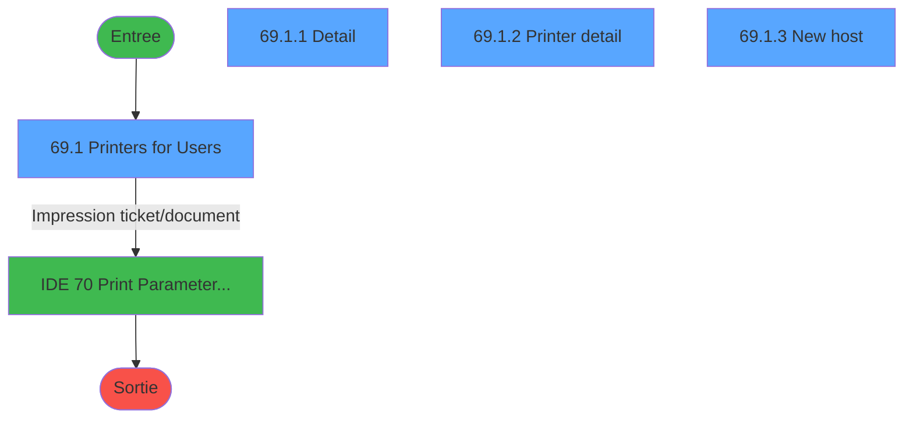
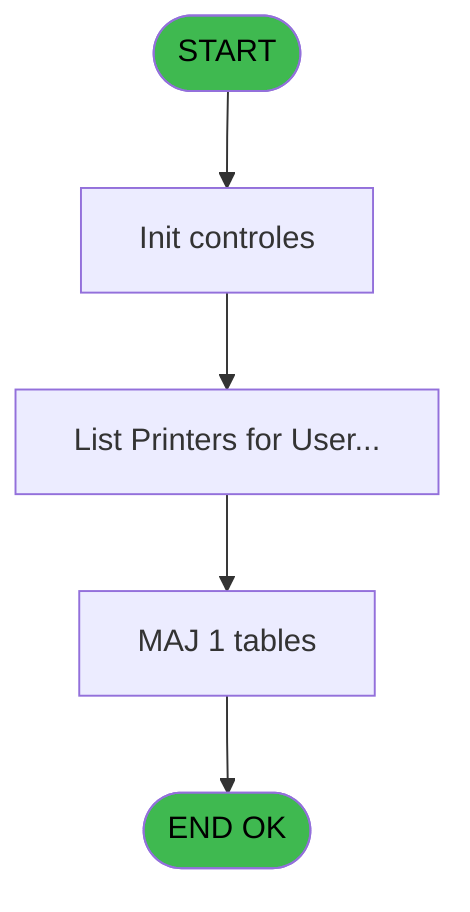
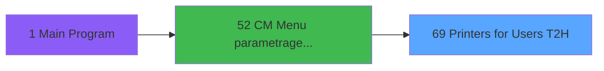

# MAI IDE 69 - Printers for Users T2H

> **Analyse**: Phases 1-4 2026-02-03 15:00 -> 15:00 (9s) | Assemblage 15:00
> **Pipeline**: V7.2 Enrichi
> **Structure**: 4 onglets (Resume | Ecrans | Donnees | Connexions)

<!-- TAB:Resume -->

## 1. FICHE D'IDENTITE

| Attribut | Valeur |
|----------|--------|
| Projet | MAI |
| IDE Position | 69 |
| Nom Programme | Printers for Users T2H |
| Fichier source | `Prg_69.xml` |
| Dossier IDE | Printer |
| Taches | 13 (4 ecrans visibles) |
| Tables modifiees | 1 |
| Programmes appeles | 1 |

## 2. DESCRIPTION FONCTIONNELLE

**Printers for Users T2H** assure la gestion complete de ce processus, accessible depuis [CM  Menu parametrage caisse (IDE 52)](MAI-IDE-52.md).

Le flux de traitement s'organise en **4 blocs fonctionnels** :

- **Traitement** (5 taches) : traitements metier divers
- **Creation** (4 taches) : insertion d'enregistrements en base (mouvements, prestations)
- **Impression** (3 taches) : generation de tickets et documents
- **Initialisation** (1 tache) : reinitialisation d'etats et de variables de travail

**Donnees modifiees** : 1 tables en ecriture (pv_accounting_date).

Detail : phases du traitement

#### Phase 1 : Impression (3 taches)

- **69** - Printers for Users T2H **[[ECRAN]](#ecran-t1)**
- **69.1** - Printers for Users **[[ECRAN]](#ecran-t2)**
- **69.1.2** - Printer detail **[[ECRAN]](#ecran-t53)**

Delegue a : [Print Parameters User  T2H (IDE 70)](MAI-IDE-70.md)

#### Phase 2 : Traitement (5 taches)

- **69.1.1** - Detail **[[ECRAN]](#ecran-t44)**
- **69.1.2.1** - Màj param impression
- **69.1.2.2** - Màj param impression
- **69.1.3** - New host **[[ECRAN]](#ecran-t60)**
- **69.1.2.1.1** - Màj param impression

#### Phase 3 : Creation (4 taches)

- **69.1.1.1** - Ajoute toutes les éditions
- **69.1.1.2** - Ajoute toutes les éditions
- **69.1.3.1** - Ajoute toutes les éditions
- **69.1.1.1.1** - Ajoute toutes les éditions

#### Phase 4 : Initialisation (1 tache)

- **69.1.4** - Raz detail impressions

#### Tables impactees

| Table | Operations | Role metier |
|-------|-----------|-------------|
| pv_accounting_date | **W**/L (11 usages) |  |

## 3. BLOCS FONCTIONNELS

### 3.1 Impression (3 taches)

Generation des documents et tickets.

---

#### 69 - Printers for Users T2H [[ECRAN]](#ecran-t1)

**Role** : Generation du document : Printers for Users T2H.
**Ecran** : 1024 x 280 DLU (MDI) | [Voir mockup](#ecran-t1)
**Delegue a** : [Print Parameters User  T2H (IDE 70)](MAI-IDE-70.md)

---

#### 69.1 - Printers for Users [[ECRAN]](#ecran-t2)

**Role** : Generation du document : Printers for Users.
**Ecran** : 1203 x 322 DLU (MDI) | [Voir mockup](#ecran-t2)
**Delegue a** : [Print Parameters User  T2H (IDE 70)](MAI-IDE-70.md)

---

#### 69.1.2 - Printer detail [[ECRAN]](#ecran-t53)

**Role** : Generation du document : Printer detail.
**Ecran** : 1151 x 376 DLU (MDI) | [Voir mockup](#ecran-t53)
**Delegue a** : [Print Parameters User  T2H (IDE 70)](MAI-IDE-70.md)

### 3.2 Traitement (5 taches)

Traitements internes.

---

#### 69.1.1 - Detail [[ECRAN]](#ecran-t44)

**Role** : Traitement : Detail.
**Ecran** : 647 x 158 DLU (Modal) | [Voir mockup](#ecran-t44)

---

#### 69.1.2.1 - Màj param impression

**Role** : Generation du document : Màj param impression.
**Variables liees** : D (v.Chrono impression position)

---

#### 69.1.2.2 - Màj param impression

**Role** : Generation du document : Màj param impression.
**Variables liees** : D (v.Chrono impression position)

---

#### 69.1.3 - New host [[ECRAN]](#ecran-t60)

**Role** : Traitement : New host.
**Ecran** : 635 x 197 DLU (MDI) | [Voir mockup](#ecran-t60)
**Variables liees** : B (v.Hostname position)

---

#### 69.1.2.1.1 - Màj param impression

**Role** : Generation du document : Màj param impression.
**Variables liees** : D (v.Chrono impression position)

### 3.3 Creation (4 taches)

Insertion de nouveaux enregistrements en base.

---

#### 69.1.1.1 - Ajoute toutes les éditions

**Role** : Creation d'enregistrement : Ajoute toutes les éditions.

---

#### 69.1.1.2 - Ajoute toutes les éditions

**Role** : Creation d'enregistrement : Ajoute toutes les éditions.

---

#### 69.1.3.1 - Ajoute toutes les éditions

**Role** : Creation d'enregistrement : Ajoute toutes les éditions.

---

#### 69.1.1.1.1 - Ajoute toutes les éditions

**Role** : Creation d'enregistrement : Ajoute toutes les éditions.

### 3.4 Initialisation (1 tache)

Reinitialisation d'etats et variables de travail.

---

#### 69.1.4 - Raz detail impressions

**Role** : Generation du document : Raz detail impressions.

## 5. REGLES METIER

*(Aucune regle metier identifiee)*

## 6. CONTEXTE

- **Appele par**: [CM  Menu parametrage caisse (IDE 52)](MAI-IDE-52.md)
- **Appelle**: 1 programmes | **Tables**: 4 (W:1 R:2 L:2) | **Taches**: 13 | **Expressions**: 21

<!-- TAB:Ecrans -->

## 8. ECRANS

### 8.1 Forms visibles (4 / 13)

| # | Position | Tache | Nom | Type | Largeur | Hauteur | Bloc |
|---|----------|-------|-----|------|---------|---------|------|
| 1 | 69.1 | 69.1 | Printers for Users | MDI | 1203 | 322 | Impression |
| 2 | 69.1.1 | 69.1.1 | Detail | Modal | 647 | 158 | Traitement |
| 3 | 69.1.2 | 69.1.2 | Printer detail | MDI | 1151 | 376 | Impression |
| 4 | 69.1.3 | 69.1.3 | New host | MDI | 635 | 197 | Traitement |

### 8.2 Mockups Ecrans

---

#### 69.1 - Printers for Users
**Tache** : [69.1](#t2) | **Type** : MDI | **Dimensions** : 1203 x 322 DLU
**Bloc** : Impression | **Titre IDE** : Printers for Users

<!-- FORM-DATA:
{
    "width":  1203,
    "vFactor":  8,
    "type":  "MDI",
    "hFactor":  8,
    "controls":  [
                     {
                         "x":  7,
                         "type":  "label",
                         "var":  "",
                         "y":  2,
                         "w":  1185,
                         "fmt":  "",
                         "name":  "",
                         "h":  18,
                         "color":  "",
                         "text":  "",
                         "parent":  null
                     },
                     {
                         "x":  7,
                         "type":  "label",
                         "var":  "",
                         "y":  23,
                         "w":  1185,
                         "fmt":  "",
                         "name":  "",
                         "h":  272,
                         "color":  "",
                         "text":  "",
                         "parent":  null
                     },
                     {
                         "x":  15,
                         "type":  "table",
                         "var":  "",
                         "name":  "",
                         "titleH":  12,
                         "color":  "110",
                         "w":  462,
                         "y":  28,
                         "fmt":  "",
                         "parent":  null,
                         "text":  "",
                         "rowH":  13,
                         "h":  183,
                         "cols":  [
                                      {
                                          "title":  "Host",
                                          "layer":  1,
                                          "w":  406
                                      }
                                  ],
                         "rows":  1
                     },
                     {
                         "x":  15,
                         "type":  "label",
                         "var":  "",
                         "y":  217,
                         "w":  462,
                         "fmt":  "",
                         "name":  "",
                         "h":  75,
                         "color":  "",
                         "text":  "",
                         "parent":  null
                     },
                     {
                         "x":  24,
                         "type":  "label",
                         "var":  "",
                         "y":  222,
                         "w":  438,
                         "fmt":  "",
                         "name":  "",
                         "h":  67,
                         "color":  "",
                         "text":  "",
                         "parent":  null
                     },
                     {
                         "x":  184,
                         "type":  "label",
                         "var":  "",
                         "y":  226,
                         "w":  45,
                         "fmt":  "",
                         "name":  "",
                         "h":  49,
                         "color":  "",
                         "text":  "",
                         "parent":  null
                     },
                     {
                         "x":  231,
                         "type":  "label",
                         "var":  "",
                         "y":  228,
                         "w":  225,
                         "fmt":  "",
                         "name":  "LCOPIES",
                         "h":  8,
                         "color":  "7",
                         "text":  "Modifications copies",
                         "parent":  null
                     },
                     {
                         "x":  231,
                         "type":  "label",
                         "var":  "",
                         "y":  239,
                         "w":  225,
                         "fmt":  "",
                         "name":  "LNEW",
                         "h":  8,
                         "color":  "7",
                         "text":  "Ajouter un poste",
                         "parent":  null
                     },
                     {
                         "x":  231,
                         "type":  "label",
                         "var":  "",
                         "y":  261,
                         "w":  225,
                         "fmt":  "",
                         "name":  "LPRINT",
                         "h":  8,
                         "color":  "7",
                         "text":  "Listing",
                         "parent":  null
                     },
                     {
                         "x":  204,
                         "type":  "label",
                         "var":  "",
                         "y":  276,
                         "w":  141,
                         "fmt":  "",
                         "name":  "",
                         "h":  10,
                         "color":  "",
                         "text":  "Votre choix",
                         "parent":  null
                     },
                     {
                         "x":  7,
                         "type":  "label",
                         "var":  "",
                         "y":  298,
                         "w":  1185,
                         "fmt":  "",
                         "name":  "",
                         "h":  22,
                         "color":  "",
                         "text":  "",
                         "parent":  null
                     },
                     {
                         "x":  231,
                         "type":  "label",
                         "var":  "",
                         "y":  250,
                         "w":  225,
                         "fmt":  "",
                         "name":  "LDELETE",
                         "h":  8,
                         "color":  "7",
                         "text":  "Supprimerr un poste",
                         "parent":  null
                     },
                     {
                         "x":  374,
                         "type":  "edit",
                         "var":  "",
                         "y":  276,
                         "w":  45,
                         "fmt":  "UA",
                         "name":  "Choice",
                         "h":  10,
                         "color":  "6",
                         "text":  "",
                         "parent":  null
                     },
                     {
                         "x":  21,
                         "type":  "edit",
                         "var":  "",
                         "y":  42,
                         "w":  399,
                         "fmt":  "",
                         "name":  "Hostname",
                         "h":  11,
                         "color":  "171",
                         "text":  "",
                         "parent":  5
                     },
                     {
                         "x":  490,
                         "type":  "subform",
                         "var":  "",
                         "y":  27,
                         "w":  689,
                         "fmt":  "",
                         "name":  "DetailSubForm",
                         "h":  264,
                         "color":  "",
                         "text":  "",
                         "parent":  null
                     },
                     {
                         "x":  15,
                         "type":  "button",
                         "var":  "",
                         "y":  300,
                         "w":  160,
                         "fmt":  "Quitter",
                         "name":  "EndButton",
                         "h":  18,
                         "color":  "",
                         "text":  "",
                         "parent":  null
                     },
                     {
                         "x":  13,
                         "type":  "edit",
                         "var":  "",
                         "y":  6,
                         "w":  267,
                         "fmt":  "30",
                         "name":  "",
                         "h":  8,
                         "color":  "",
                         "text":  "",
                         "parent":  null
                     },
                     {
                         "x":  879,
                         "type":  "edit",
                         "var":  "",
                         "y":  7,
                         "w":  296,
                         "fmt":  "WWW DD MMM YYYYT",
                         "name":  "",
                         "h":  8,
                         "color":  "",
                         "text":  "",
                         "parent":  null
                     },
                     {
                         "x":  36,
                         "type":  "image",
                         "var":  "",
                         "y":  226,
                         "w":  141,
                         "fmt":  "",
                         "name":  "",
                         "h":  48,
                         "color":  "",
                         "text":  "",
                         "parent":  null
                     },
                     {
                         "x":  191,
                         "type":  "button",
                         "var":  "",
                         "y":  228,
                         "w":  26,
                         "fmt":  "1",
                         "name":  "1",
                         "h":  8,
                         "color":  "",
                         "text":  "",
                         "parent":  null
                     },
                     {
                         "x":  191,
                         "type":  "button",
                         "var":  "",
                         "y":  239,
                         "w":  26,
                         "fmt":  "2",
                         "name":  "2",
                         "h":  8,
                         "color":  "",
                         "text":  "",
                         "parent":  null
                     },
                     {
                         "x":  191,
                         "type":  "button",
                         "var":  "",
                         "y":  261,
                         "w":  26,
                         "fmt":  "4",
                         "name":  "4",
                         "h":  8,
                         "color":  "",
                         "text":  "",
                         "parent":  null
                     },
                     {
                         "x":  191,
                         "type":  "button",
                         "var":  "",
                         "y":  250,
                         "w":  26,
                         "fmt":  "3",
                         "name":  "3",
                         "h":  8,
                         "color":  "",
                         "text":  "",
                         "parent":  null
                     }
                 ],
    "taskId":  "69.1",
    "height":  322
}
-->

<strong>Champs : 4 champs</strong>

| Pos (x,y) | Nom | Variable | Type |
|-----------|-----|----------|------|
| 374,276 | Choice | - | edit |
| 21,42 | Hostname | - | edit |
| 13,6 | 30 | - | edit |
| 879,7 | WWW DD MMM YYYYT | - | edit |

<strong>Boutons : 5 boutons</strong>

| Bouton | Pos (x,y) | Action |
|--------|-----------|--------|
| Quitter | 15,300 | Quitte le programme |
| 1 | 191,228 | Bouton fonctionnel |
| 2 | 191,239 | Bouton fonctionnel |
| 4 | 191,261 | Bouton fonctionnel |
| 3 | 191,250 | Bouton fonctionnel |

---

#### 69.1.1 - Detail
**Tache** : [69.1.1](#t44) | **Type** : Modal | **Dimensions** : 647 x 158 DLU
**Bloc** : Traitement | **Titre IDE** : Detail

<!-- FORM-DATA:
{
    "width":  647,
    "vFactor":  8,
    "type":  "Modal",
    "hFactor":  8,
    "controls":  [
                     {
                         "x":  1,
                         "type":  "table",
                         "var":  "",
                         "name":  "",
                         "titleH":  12,
                         "color":  "110",
                         "w":  634,
                         "y":  1,
                         "fmt":  "",
                         "parent":  null,
                         "text":  "",
                         "rowH":  12,
                         "h":  79,
                         "cols":  [
                                      {
                                          "title":  "Printer",
                                          "layer":  1,
                                          "w":  383
                                      },
                                      {
                                          "title":  "Active",
                                          "layer":  2,
                                          "w":  154
                                      }
                                  ],
                         "rows":  2
                     },
                     {
                         "x":  9,
                         "type":  "edit",
                         "var":  "",
                         "y":  14,
                         "w":  362,
                         "fmt":  "",
                         "name":  "libelle",
                         "h":  10,
                         "color":  "110",
                         "text":  "",
                         "parent":  1
                     },
                     {
                         "x":  443,
                         "type":  "checkbox",
                         "var":  "",
                         "y":  16,
                         "w":  27,
                         "fmt":  "",
                         "name":  "v.Imprimante sélectionnée ?",
                         "h":  9,
                         "color":  "",
                         "text":  "",
                         "parent":  1
                     }
                 ],
    "taskId":  "69.1.1",
    "height":  158
}
-->

<strong>Champs : 2 champs</strong>

| Pos (x,y) | Nom | Variable | Type |
|-----------|-----|----------|------|
| 9,14 | libelle | - | edit |
| 443,16 | v.Imprimante sélectionnée ? | - | checkbox |

---

#### 69.1.2 - Printer detail
**Tache** : [69.1.2](#t53) | **Type** : MDI | **Dimensions** : 1151 x 376 DLU
**Bloc** : Impression | **Titre IDE** : Printer detail

<!-- FORM-DATA:
{
    "width":  1151,
    "vFactor":  8,
    "type":  "MDI",
    "hFactor":  8,
    "controls":  [
                     {
                         "x":  7,
                         "type":  "table",
                         "var":  "",
                         "name":  "",
                         "titleH":  11,
                         "color":  "110",
                         "w":  1134,
                         "y":  4,
                         "fmt":  "",
                         "parent":  null,
                         "text":  "",
                         "rowH":  14,
                         "h":  341,
                         "cols":  [
                                      {
                                          "title":  "Application",
                                          "layer":  1,
                                          "w":  220
                                      },
                                      {
                                          "title":  "Printing",
                                          "layer":  2,
                                          "w":  433
                                      },
                                      {
                                          "title":  "Printer",
                                          "layer":  3,
                                          "w":  86
                                      },
                                      {
                                          "title":  "Description",
                                          "layer":  4,
                                          "w":  295
                                      },
                                      {
                                          "title":  "Copies",
                                          "layer":  5,
                                          "w":  63
                                      }
                                  ],
                         "rows":  5
                     },
                     {
                         "x":  8,
                         "type":  "label",
                         "var":  "",
                         "y":  351,
                         "w":  1131,
                         "fmt":  "",
                         "name":  "",
                         "h":  22,
                         "color":  "",
                         "text":  "",
                         "parent":  null
                     },
                     {
                         "x":  11,
                         "type":  "edit",
                         "var":  "",
                         "y":  18,
                         "w":  211,
                         "fmt":  "",
                         "name":  "APPLICATIONNAME",
                         "h":  10,
                         "color":  "110",
                         "text":  "",
                         "parent":  1
                     },
                     {
                         "x":  234,
                         "type":  "edit",
                         "var":  "",
                         "y":  18,
                         "w":  425,
                         "fmt":  "",
                         "name":  "PRINTINGNAME",
                         "h":  10,
                         "color":  "110",
                         "text":  "",
                         "parent":  1
                     },
                     {
                         "x":  666,
                         "type":  "edit",
                         "var":  "",
                         "y":  18,
                         "w":  70,
                         "fmt":  "",
                         "name":  "imprimante",
                         "h":  10,
                         "color":  "110",
                         "text":  "",
                         "parent":  1
                     },
                     {
                         "x":  750,
                         "type":  "edit",
                         "var":  "",
                         "y":  18,
                         "w":  283,
                         "fmt":  "",
                         "name":  "libelle",
                         "h":  10,
                         "color":  "110",
                         "text":  "",
                         "parent":  1
                     },
                     {
                         "x":  1046,
                         "type":  "edit",
                         "var":  "",
                         "y":  18,
                         "w":  51,
                         "fmt":  "",
                         "name":  "copies",
                         "h":  10,
                         "color":  "110",
                         "text":  "",
                         "parent":  1
                     },
                     {
                         "x":  16,
                         "type":  "button",
                         "var":  "",
                         "y":  353,
                         "w":  160,
                         "fmt":  "Quitter",
                         "name":  "EndButton",
                         "h":  18,
                         "color":  "",
                         "text":  "",
                         "parent":  null
                     }
                 ],
    "taskId":  "69.1.2",
    "height":  376
}
-->

<strong>Champs : 5 champs</strong>

| Pos (x,y) | Nom | Variable | Type |
|-----------|-----|----------|------|
| 11,18 | APPLICATIONNAME | - | edit |
| 234,18 | PRINTINGNAME | - | edit |
| 666,18 | imprimante | - | edit |
| 750,18 | libelle | - | edit |
| 1046,18 | copies | - | edit |

<strong>Boutons : 1 boutons</strong>

| Bouton | Pos (x,y) | Action |
|--------|-----------|--------|
| Quitter | 16,353 | Quitte le programme |

---

#### 69.1.3 - New host
**Tache** : [69.1.3](#t60) | **Type** : MDI | **Dimensions** : 635 x 197 DLU
**Bloc** : Traitement | **Titre IDE** : New host

<!-- FORM-DATA:
{
    "width":  635,
    "vFactor":  8,
    "type":  "MDI",
    "hFactor":  8,
    "controls":  [
                     {
                         "x":  7,
                         "type":  "label",
                         "var":  "",
                         "y":  4,
                         "w":  612,
                         "fmt":  "",
                         "name":  "",
                         "h":  23,
                         "color":  "",
                         "text":  "",
                         "parent":  null
                     },
                     {
                         "x":  7,
                         "type":  "label",
                         "var":  "",
                         "y":  32,
                         "w":  612,
                         "fmt":  "",
                         "name":  "",
                         "h":  132,
                         "color":  "",
                         "text":  "",
                         "parent":  null
                     },
                     {
                         "x":  24,
                         "type":  "label",
                         "var":  "",
                         "y":  39,
                         "w":  575,
                         "fmt":  "",
                         "name":  "",
                         "h":  118,
                         "color":  "",
                         "text":  "",
                         "parent":  null
                     },
                     {
                         "x":  220,
                         "type":  "label",
                         "var":  "",
                         "y":  47,
                         "w":  357,
                         "fmt":  "",
                         "name":  "",
                         "h":  44,
                         "color":  "",
                         "text":  "",
                         "parent":  null
                     },
                     {
                         "x":  229,
                         "type":  "label",
                         "var":  "",
                         "y":  64,
                         "w":  114,
                         "fmt":  "",
                         "name":  "",
                         "h":  10,
                         "color":  "137",
                         "text":  "Poste",
                         "parent":  null
                     },
                     {
                         "x":  7,
                         "type":  "label",
                         "var":  "",
                         "y":  169,
                         "w":  612,
                         "fmt":  "",
                         "name":  "",
                         "h":  23,
                         "color":  "",
                         "text":  "",
                         "parent":  null
                     },
                     {
                         "x":  43,
                         "type":  "label",
                         "var":  "",
                         "y":  100,
                         "w":  535,
                         "fmt":  "",
                         "name":  "",
                         "h":  49,
                         "color":  "",
                         "text":  "Imprimante par défaut",
                         "parent":  null
                     },
                     {
                         "x":  347,
                         "type":  "edit",
                         "var":  "",
                         "y":  64,
                         "w":  210,
                         "fmt":  "U50",
                         "name":  "NEWHOSTNAME",
                         "h":  10,
                         "color":  "6",
                         "text":  "",
                         "parent":  null
                     },
                     {
                         "x":  144,
                         "type":  "checkbox",
                         "var":  "",
                         "y":  114,
                         "w":  362,
                         "fmt":  "",
                         "name":  "PRINTER1",
                         "h":  12,
                         "color":  "",
                         "text":  "A4 or LETTER Bac 1",
                         "parent":  null
                     },
                     {
                         "x":  144,
                         "type":  "checkbox",
                         "var":  "",
                         "y":  133,
                         "w":  362,
                         "fmt":  "",
                         "name":  "PRINTER9",
                         "h":  12,
                         "color":  "",
                         "text":  "TMT88 IV USB",
                         "parent":  null
                     },
                     {
                         "x":  18,
                         "type":  "edit",
                         "var":  "",
                         "y":  9,
                         "w":  250,
                         "fmt":  "30",
                         "name":  "",
                         "h":  12,
                         "color":  "",
                         "text":  "",
                         "parent":  1
                     },
                     {
                         "x":  357,
                         "type":  "edit",
                         "var":  "",
                         "y":  9,
                         "w":  250,
                         "fmt":  "WWW DD MMM YYYYT",
                         "name":  "",
                         "h":  12,
                         "color":  "",
                         "text":  "",
                         "parent":  1
                     },
                     {
                         "x":  41,
                         "type":  "image",
                         "var":  "",
                         "y":  47,
                         "w":  165,
                         "fmt":  "",
                         "name":  "",
                         "h":  44,
                         "color":  "",
                         "text":  "",
                         "parent":  null
                     },
                     {
                         "x":  18,
                         "type":  "button",
                         "var":  "",
                         "y":  173,
                         "w":  154,
                         "fmt":  "Quitter",
                         "name":  "",
                         "h":  16,
                         "color":  "",
                         "text":  "",
                         "parent":  null
                     },
                     {
                         "x":  453,
                         "type":  "button",
                         "var":  "",
                         "y":  173,
                         "w":  154,
                         "fmt":  "Valider",
                         "name":  "Validation",
                         "h":  16,
                         "color":  "",
                         "text":  "",
                         "parent":  null
                     }
                 ],
    "taskId":  "69.1.3",
    "height":  197
}
-->

<strong>Champs : 5 champs</strong>

| Pos (x,y) | Nom | Variable | Type |
|-----------|-----|----------|------|
| 347,64 | NEWHOSTNAME | - | edit |
| 144,114 | PRINTER1 | - | checkbox |
| 144,133 | PRINTER9 | - | checkbox |
| 18,9 | 30 | - | edit |
| 357,9 | WWW DD MMM YYYYT | - | edit |

<strong>Boutons : 2 boutons</strong>

| Bouton | Pos (x,y) | Action |
|--------|-----------|--------|
| Quitter | 18,173 | Quitte le programme |
| Valider | 453,173 | Valide la saisie et enregistre |

## 9. NAVIGATION

### 9.1 Enchainement des ecrans

**Detail par enchainement :**

| Depuis | Action | Vers | Retour |
|--------|--------|------|--------|
| Printers for Users | Impression ticket/document | [Print Parameters User  T2H (IDE 70)](MAI-IDE-70.md) | Retour ecran |

### 9.3 Structure hierarchique (13 taches)

| Position | Tache | Type | Dimensions | Bloc |
|----------|-------|------|------------|------|
| **69.1** | [**Printers for Users T2H** (69)](#t1) [mockup](#ecran-t1) | MDI | 1024x280 | Impression |
| 69.1.1 | [Printers for Users (69.1)](#t2) [mockup](#ecran-t2) | MDI | 1203x322 | |
| 69.1.2 | [Printer detail (69.1.2)](#t53) [mockup](#ecran-t53) | MDI | 1151x376 | |
| **69.2** | [**Detail** (69.1.1)](#t44) [mockup](#ecran-t44) | Modal | 647x158 | Traitement |
| 69.2.1 | [Màj param impression (69.1.2.1)](#t54) | - | - | |
| 69.2.2 | [Màj param impression (69.1.2.2)](#t57) | - | - | |
| 69.2.3 | [New host (69.1.3)](#t60) [mockup](#ecran-t60) | MDI | 635x197 | |
| 69.2.4 | [Màj param impression (69.1.2.1.1)](#t76) | - | - | |
| **69.3** | [**Ajoute toutes les éditions** (69.1.1.1)](#t47) | - | - | Creation |
| 69.3.1 | [Ajoute toutes les éditions (69.1.1.2)](#t50) | - | - | |
| 69.3.2 | [Ajoute toutes les éditions (69.1.3.1)](#t72) | - | - | |
| 69.3.3 | [Ajoute toutes les éditions (69.1.1.1.1)](#t79) | - | - | |
| **69.4** | [**Raz detail impressions** (69.1.4)](#t73) | - | - | Initialisation |

### 9.4 Algorigramme

> **Legende**: Vert = START/END OK | Rouge = END KO | Bleu = Decisions
> *Algorigramme auto-genere. Utiliser `/algorigramme` pour une synthese metier detaillee.*

<!-- TAB:Donnees -->

## 10. TABLES

### Tables utilisees (4)

| ID | Nom | Description | Type | R | W | L | Usages |
|----|-----|-------------|------|---|---|---|--------|
| 367 | pms_print_param_default |  | DB | R |   |   | 3 |
| 369 | presents_par_nationalite |  | DB | R |   |   | 2 |
| 370 | pv_accounting_date |  | DB |   | **W** | L | 11 |
| 371 | pv_binding_settings |  | DB |   |   | L | 2 |

### Colonnes par table (2 / 3 tables avec colonnes identifiees)

Table 367 - pms_print_param_default (R) - 3 usages

| Lettre | Variable | Acces | Type |
|--------|----------|-------|------|
| A | v.Paramétrage par défaut ? | R | Logical |
| B | v.Libellé édition fra | R | Unicode |
| C | v.Libellé édition eng | R | Unicode |
| D | v.Libellé application | R | Unicode |
| E | v.Chrono imprimante | R | Numeric |
| F | v.Libellé imprimante | R | Unicode |
| G | v.Exist précédent application ? | R | Logical |
| H | v.Précédent renseigné ? | R | Logical |
| I | v.Suivant renseigné ? | R | Logical |
| J | v.Libellé application/vide | R | Unicode |
| K | v.En cours ? | R | Logical |
| L | v.Libellé imprimante | R | Unicode |
| M | v.Doublon ? | R | Logical |
| N | v.Copies | R | Numeric |
| O | CHG_REASON_v.Copies | R | Numeric |
| P | CHG_PRV_v.Copies | R | Numeric |

Table 369 - presents_par_nationalite (R) - 2 usages

| Lettre | Variable | Acces | Type |
|--------|----------|-------|------|
| A | p.i.Hostname | R | Unicode |
| B | v.Imprimante sélectionnée ? | R | Logical |
| C | CHG_REASON_v.Imprimante sélect | R | Numeric |
| D | CHG_PRV_v.Imprimante sélection | R | Logical |
| E | v.Retour dialogue | R | Numeric |
| F | CHG_REASON_v.Printer 1 ? | R | Numeric |
| G | CHG_PRV_v.Printer 1 ? | R | Logical |
| H | CHG_REASON_v.Printer 9 ? | R | Numeric |
| I | CHG_PRV_v.Printer 9 ? | R | Logical |

Table 370 - pv_accounting_date (**W**/L) - 11 usages

*Table utilisee uniquement en Link ou aucune colonne Real identifiee dans le DataView.*

## 11. VARIABLES

### 11.1 Variables de session (13)

Variables persistantes pendant toute la session.

| Lettre | Nom | Type | Usage dans |
|--------|-----|------|-----------|
| A | v.Quitter ? | Logical | 1x session |
| B | v.Hostname position | Unicode | - |
| C | v.Libellé application position | Unicode | - |
| D | v.Chrono impression position | Numeric | - |
| E | v.Chono imprimante position | Numeric | - |
| G | v.Exist précédent application ? | Logical | - |
| H | v.Précédent renseigné ? | Logical | - |
| I | v.Suivant renseigné ? | Logical | - |
| J | v.Libellé application/vide | Unicode | - |
| K | v.En cours ? | Logical | - |
| L | v.Libellé imprimante | Unicode | - |
| M | v.Doublon ? | Logical | - |
| N | v.Copies | Numeric | - |

### 11.2 Autres (3)

Variables diverses.

| Lettre | Nom | Type | Usage dans |
|--------|-----|------|-----------|
| F | CHG_PRV_Choice | Alpha | - |
| O | CHG_REASON_v.Copies | Numeric | - |
| P | CHG_PRV_v.Copies | Numeric | - |

Toutes les 16 variables (liste complete)

| Cat | Lettre | Nom Variable | Type |
|-----|--------|--------------|------|
| V. | **A** | v.Quitter ? | Logical |
| V. | **B** | v.Hostname position | Unicode |
| V. | **C** | v.Libellé application position | Unicode |
| V. | **D** | v.Chrono impression position | Numeric |
| V. | **E** | v.Chono imprimante position | Numeric |
| V. | **G** | v.Exist précédent application ? | Logical |
| V. | **H** | v.Précédent renseigné ? | Logical |
| V. | **I** | v.Suivant renseigné ? | Logical |
| V. | **J** | v.Libellé application/vide | Unicode |
| V. | **K** | v.En cours ? | Logical |
| V. | **L** | v.Libellé imprimante | Unicode |
| V. | **M** | v.Doublon ? | Logical |
| V. | **N** | v.Copies | Numeric |
| Autre | **F** | CHG_PRV_Choice | Alpha |
| Autre | **O** | CHG_REASON_v.Copies | Numeric |
| Autre | **P** | CHG_PRV_v.Copies | Numeric |

## 12. EXPRESSIONS

**21 / 21 expressions decodees (100%)**

### 12.1 Repartition par type

| Type | Expressions | Regles |
|------|-------------|--------|
| CALCULATION | 1 | 0 |
| CONSTANTE | 4 | 0 |
| DATE | 1 | 0 |
| OTHER | 4 | 0 |
| CAST_LOGIQUE | 1 | 0 |
| REFERENCE_VG | 1 | 0 |
| CONDITION | 8 | 0 |
| NEGATION | 1 | 0 |

### 12.2 Expressions cles par type

#### CALCULATION (1 expressions)

| Type | IDE | Expression | Regle |
|------|-----|------------|-------|
| CALCULATION | 19 | `StrBuild(MlsTrans('Confirmez-vous la suppression du paramétrage des éditions pour le poste @1@ ?'), [T])` | - |

#### CONSTANTE (4 expressions)

| Type | IDE | Expression | Regle |
|------|-----|------------|-------|
| CONSTANTE | 14 | `''` | - |
| CONSTANTE | 21 | `'DetailSubForm'` | - |
| CONSTANTE | 9 | `''` | - |
| CONSTANTE | 12 | `1` | - |

#### DATE (1 expressions)

| Type | IDE | Expression | Regle |
|------|-----|------------|-------|
| DATE | 4 | `Date ()` | - |

#### OTHER (4 expressions)

| Type | IDE | Expression | Regle |
|------|-----|------------|-------|
| OTHER | 16 | `[T]` | - |
| OTHER | 17 | `Stat(0, 'C'MODE)` | - |
| OTHER | 1 | `v.Quitter ? [A]` | - |
| OTHER | 10 | `{1,1}` | - |

#### CAST_LOGIQUE (1 expressions)

| Type | IDE | Expression | Regle |
|------|-----|------------|-------|
| CAST_LOGIQUE | 2 | `'TRUE'LOG` | - |

#### REFERENCE_VG (1 expressions)

| Type | IDE | Expression | Regle |
|------|-----|------------|-------|
| REFERENCE_VG | 3 | `VG2` | - |

#### CONDITION (8 expressions)

| Type | IDE | Expression | Regle |
|------|-----|------------|-------|
| CONDITION | 13 | `{1,2}<>''` | - |
| CONDITION | 11 | `[T]>={1,2}` | - |
| CONDITION | 20 | `[BB]=6` | - |
| CONDITION | 15 | `[AZ]=0` | - |
| CONDITION | 6 | `[V]='2'` | - |
| ... | | *+3 autres* | |

#### NEGATION (1 expressions)

| Type | IDE | Expression | Regle |
|------|-----|------------|-------|
| NEGATION | 18 | `NOT Stat(0, 'C'MODE)` | - |

### 12.3 Toutes les expressions (21)

Voir les 21 expressions

#### CALCULATION (1)

| IDE | Expression Decodee |
|-----|-------------------|
| 19 | `StrBuild(MlsTrans('Confirmez-vous la suppression du paramétrage des éditions pour le poste @1@ ?'), [T])` |

#### CONSTANTE (4)

| IDE | Expression Decodee |
|-----|-------------------|
| 9 | `''` |
| 12 | `1` |
| 14 | `''` |
| 21 | `'DetailSubForm'` |

#### DATE (1)

| IDE | Expression Decodee |
|-----|-------------------|
| 4 | `Date ()` |

#### OTHER (4)

| IDE | Expression Decodee |
|-----|-------------------|
| 1 | `v.Quitter ? [A]` |
| 10 | `{1,1}` |
| 16 | `[T]` |
| 17 | `Stat(0, 'C'MODE)` |

#### CAST_LOGIQUE (1)

| IDE | Expression Decodee |
|-----|-------------------|
| 2 | `'TRUE'LOG` |

#### REFERENCE_VG (1)

| IDE | Expression Decodee |
|-----|-------------------|
| 3 | `VG2` |

#### CONDITION (8)

| IDE | Expression Decodee |
|-----|-------------------|
| 5 | `[V]='1'` |
| 6 | `[V]='2'` |
| 7 | `[V]='3'` |
| 8 | `[V]='4'` |
| 11 | `[T]>={1,2}` |
| 13 | `{1,2}<>''` |
| 15 | `[AZ]=0` |
| 20 | `[BB]=6` |

#### NEGATION (1)

| IDE | Expression Decodee |
|-----|-------------------|
| 18 | `NOT Stat(0, 'C'MODE)` |

<!-- TAB:Connexions -->

## 13. GRAPHE D'APPELS

### 13.1 Chaine depuis Main (Callers)

Main -> ... -> [CM  Menu parametrage caisse (IDE 52)](MAI-IDE-52.md) -> **Printers for Users T2H (IDE 69)**

### 13.2 Callers

| IDE | Nom Programme | Nb Appels |
|-----|---------------|-----------|
| [52](MAI-IDE-52.md) | CM  Menu parametrage caisse | 2 |

### 13.3 Callees (programmes appeles)

### 13.4 Detail Callees avec contexte

| IDE | Nom Programme | Appels | Contexte |
|-----|---------------|--------|----------|
| [70](MAI-IDE-70.md) | Print Parameters User  T2H | 1 | Impression ticket/document |

## 14. RECOMMANDATIONS MIGRATION

### 14.1 Profil du programme

| Metrique | Valeur | Impact migration |
|----------|--------|-----------------|
| Lignes de logique | 327 | Taille moyenne |
| Expressions | 21 | Peu de logique |
| Tables WRITE | 1 | Impact faible |
| Sous-programmes | 1 | Peu de dependances |
| Ecrans visibles | 4 | Quelques ecrans |
| Code desactive | 0% (0 / 327) | Code sain |
| Regles metier | 0 | Pas de regle identifiee |

### 14.2 Plan de migration par bloc

#### Impression (3 taches: 3 ecrans, 0 traitement)

- **Strategie** : Templates HTML -> PDF via wkhtmltopdf ou Puppeteer.
- `PrintService` injectable avec choix imprimante

#### Traitement (5 taches: 2 ecrans, 3 traitements)

- **Strategie** : Orchestrateur avec 2 ecrans (Razor/React) et 3 traitements backend (services).
- Les ecrans deviennent des composants UI, les traitements invisibles deviennent des services injectables.
- 1 sous-programme(s) a migrer ou a reutiliser depuis les services existants.
- Decomposer les taches en services unitaires testables.

#### Creation (4 taches: 0 ecran, 4 traitements)

- **Strategie** : Repository pattern avec Entity Framework Core.
- Insertion via `IRepository<T>.CreateAsync()`

#### Initialisation (1 tache: 0 ecran, 1 traitement)

- **Strategie** : Constructeur/methode `InitAsync()` dans l'orchestrateur.

### 14.3 Dependances critiques

| Dependance | Type | Appels | Impact |
|------------|------|--------|--------|
| pv_accounting_date | Table WRITE (Database) | 6x | Schema + repository |
| [Print Parameters User  T2H (IDE 70)](MAI-IDE-70.md) | Sous-programme | 1x | Normale - Impression ticket/document |

---
*Spec DETAILED generee par Pipeline V7.2 - 2026-02-03 15:00*
