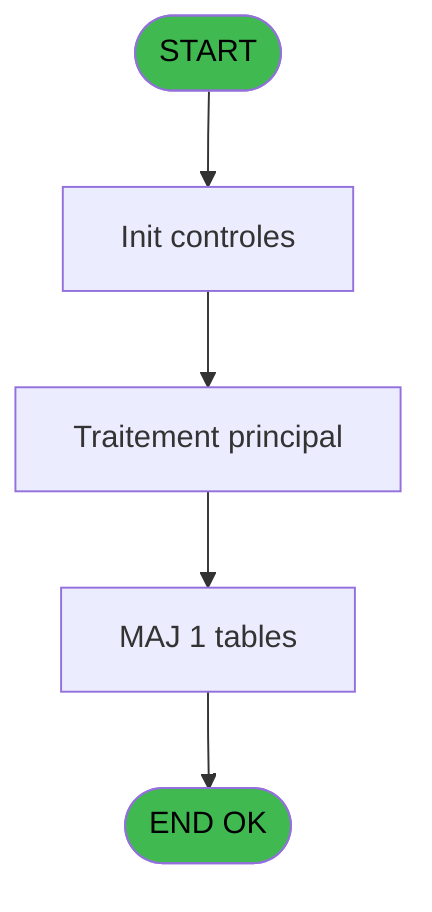

# MAI IDE 7 - Envoi table SCP

> **Analyse**: Phases 1-4 2026-02-03 14:45 -> 14:45 (9s) | Assemblage 14:45
> **Pipeline**: V7.2 Enrichi
> **Structure**: 4 onglets (Resume | Ecrans | Donnees | Connexions)

<!-- TAB:Resume -->

## 1. FICHE D'IDENTITE

| Attribut | Valeur |
|----------|--------|
| Projet | MAI |
| IDE Position | 7 |
| Nom Programme | Envoi table SCP |
| Fichier source | `Prg_7.xml` |
| Dossier IDE | Bibop |
| Taches | 4 (0 ecrans visibles) |
| Tables modifiees | 1 |
| Programmes appeles | 0 |

## 2. DESCRIPTION FONCTIONNELLE

**Envoi table SCP** assure la gestion complete de ce processus, accessible depuis [Menu parametrage Bibop (IDE 8)](MAI-IDE-8.md).

Le flux de traitement s'organise en **2 blocs fonctionnels** :

- **Traitement** (3 taches) : traitements metier divers
- **Creation** (1 tache) : insertion d'enregistrements en base (mouvements, prestations)

**Donnees modifiees** : 1 tables en ecriture (commande_bibop___cob).

Detail : phases du traitement

#### Phase 1 : Traitement (3 taches)

- **7** - CM  Envoi table autocom **[[ECRAN]](#ecran-t1)**
- **7.1** - SOH6
- **7.2** - Boucle bibop

#### Phase 2 : Creation (1 tache)

- **7.2.1** - Creation commande tel

#### Tables impactees

| Table | Operations | Role metier |
|-------|-----------|-------------|
| commande_bibop___cob | **W** (2 usages) |  |

## 3. BLOCS FONCTIONNELS

### 3.1 Traitement (3 taches)

Traitements internes.

---

#### 7 - CM  Envoi table autocom [[ECRAN]](#ecran-t1)

**Role** : Traitement : CM  Envoi table autocom.
**Ecran** : 100 x 24 DLU (MDI) | [Voir mockup](#ecran-t1)

---

#### 7.1 - SOH6

**Role** : Traitement : SOH6.

---

#### 7.2 - Boucle bibop

**Role** : Traitement : Boucle bibop.

### 3.2 Creation (1 tache)

Insertion de nouveaux enregistrements en base.

---

#### 7.2.1 - Creation commande tel

**Role** : Creation d'enregistrement : Creation commande tel.

## 5. REGLES METIER

*(Aucune regle metier identifiee)*

## 6. CONTEXTE

- **Appele par**: [Menu parametrage Bibop (IDE 8)](MAI-IDE-8.md)
- **Appelle**: 0 programmes | **Tables**: 3 (W:1 R:1 L:1) | **Taches**: 4 | **Expressions**: 4

<!-- TAB:Ecrans -->

## 8. ECRANS

*(Programme sans ecran visible)*

## 9. NAVIGATION

### 9.3 Structure hierarchique (4 taches)

| Position | Tache | Type | Dimensions | Bloc |
|----------|-------|------|------------|------|
| **7.1** | [**CM  Envoi table autocom** (7)](#t1) [mockup](#ecran-t1) | MDI | 100x24 | Traitement |
| 7.1.1 | [SOH6 (7.1)](#t2) | MDI | - | |
| 7.1.2 | [Boucle bibop (7.2)](#t3) | MDI | - | |
| **7.2** | [**Creation commande tel** (7.2.1)](#t4) | MDI | - | Creation |

### 9.4 Algorigramme

> **Legende**: Vert = START/END OK | Rouge = END KO | Bleu = Decisions
> *Algorigramme auto-genere. Utiliser `/algorigramme` pour une synthese metier detaillee.*

<!-- TAB:Donnees -->

## 10. TABLES

### Tables utilisees (3)

| ID | Nom | Description | Type | R | W | L | Usages |
|----|-----|-------------|------|---|---|---|--------|
| 158 | table_bibop______tbp |  | DB |   |   | L | 1 |
| 159 | commande_bibop___cob |  | DB |   | **W** |   | 2 |
| 160 | bibop____________bib |  | DB | R |   |   | 1 |

### Colonnes par table (0 / 2 tables avec colonnes identifiees)

Table 159 - commande_bibop___cob (**W**) - 2 usages

*Table utilisee uniquement en Link ou aucune colonne Real identifiee dans le DataView.*

Table 160 - bibop____________bib (R) - 1 usages

*Table utilisee uniquement en Link ou aucune colonne Real identifiee dans le DataView.*

## 11. VARIABLES

### 11.1 Variables de travail (2)

Variables internes au programme.

| Lettre | Nom | Type | Usage dans |
|--------|-----|------|-----------|
| A | W0 confirmation | Numeric | 1x calcul interne |
| B | W0 nom ASCII | Alpha | - |

## 12. EXPRESSIONS

**4 / 4 expressions decodees (100%)**

### 12.1 Repartition par type

| Type | Expressions | Regles |
|------|-------------|--------|
| CONSTANTE | 1 | 0 |
| CONCATENATION | 2 | 0 |
| CONDITION | 1 | 0 |

### 12.2 Expressions cles par type

#### CONSTANTE (1 expressions)

| Type | IDE | Expression | Regle |
|------|-----|------------|-------|
| CONSTANTE | 4 | `'0'` | - |

#### CONCATENATION (2 expressions)

| Type | IDE | Expression | Regle |
|------|-----|------------|-------|
| CONCATENATION | 3 | `'2'&DStr (Date (),'DD')&ASCIIChr (65+Hour (Time ()))&TStr (Time (),'MMSS')&'.'&GetShortHostname ()` | - |
| CONCATENATION | 2 | `'2'&DStr (Date (),'DD')&ASCIIChr (65+Hour (Time ()))&TStr (Time (),'MMSS')&'.'&Str (VG10,'3P0')` | - |

#### CONDITION (1 expressions)

| Type | IDE | Expression | Regle |
|------|-----|------------|-------|
| CONDITION | 1 | `W0 confirmation [A]=6` | - |

<!-- TAB:Connexions -->

## 13. GRAPHE D'APPELS

### 13.1 Chaine depuis Main (Callers)

Main -> ... -> [Menu parametrage Bibop (IDE 8)](MAI-IDE-8.md) -> **Envoi table SCP (IDE 7)**

### 13.2 Callers

| IDE | Nom Programme | Nb Appels |
|-----|---------------|-----------|
| [8](MAI-IDE-8.md) | Menu parametrage Bibop | 1 |

### 13.3 Callees (programmes appeles)

### 13.4 Detail Callees avec contexte

| IDE | Nom Programme | Appels | Contexte |
|-----|---------------|--------|----------|
| - | (aucun) | - | - |

## 14. RECOMMANDATIONS MIGRATION

### 14.1 Profil du programme

| Metrique | Valeur | Impact migration |
|----------|--------|-----------------|
| Lignes de logique | 49 | Programme compact |
| Expressions | 4 | Peu de logique |
| Tables WRITE | 1 | Impact faible |
| Sous-programmes | 0 | Peu de dependances |
| Ecrans visibles | 0 | Ecran unique ou traitement batch |
| Code desactive | 0% (0 / 49) | Code sain |
| Regles metier | 0 | Pas de regle identifiee |

### 14.2 Plan de migration par bloc

#### Traitement (3 taches: 1 ecran, 2 traitements)

- **Strategie** : Orchestrateur avec 1 ecrans (Razor/React) et 2 traitements backend (services).
- Les ecrans deviennent des composants UI, les traitements invisibles deviennent des services injectables.
- Decomposer les taches en services unitaires testables.

#### Creation (1 tache: 0 ecran, 1 traitement)

- **Strategie** : Repository pattern avec Entity Framework Core.
- Insertion via `IRepository<T>.CreateAsync()`

### 14.3 Dependances critiques

| Dependance | Type | Appels | Impact |
|------------|------|--------|--------|
| commande_bibop___cob | Table WRITE (Database) | 2x | Schema + repository |

---
*Spec DETAILED generee par Pipeline V7.2 - 2026-02-03 14:45*
