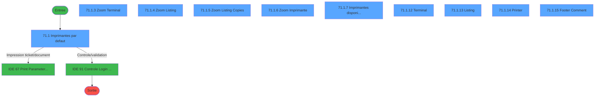
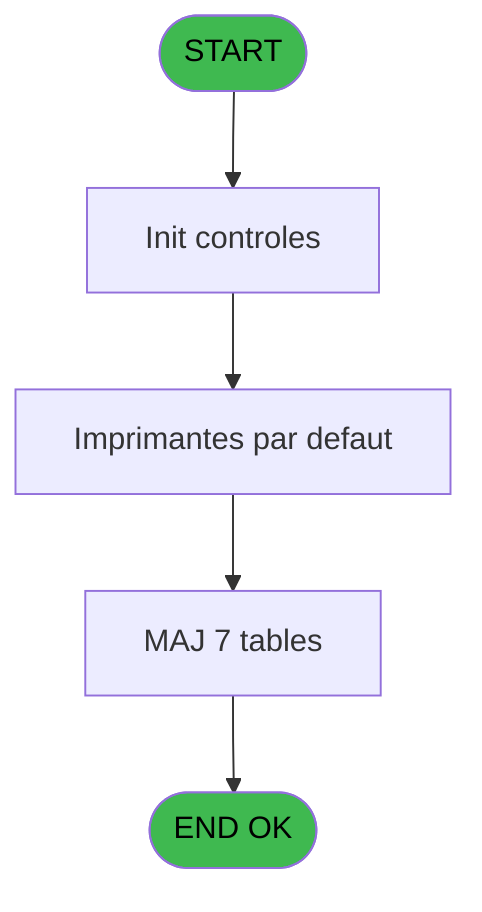
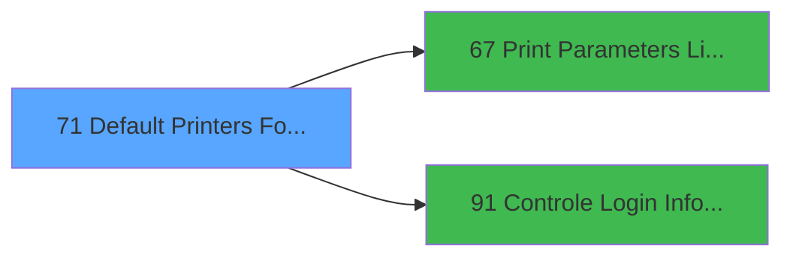

# MAI IDE 71 - Default Printers For Admin

> **Analyse**: Phases 1-4 2026-02-03 15:01 -> 15:01 (11s) | Assemblage 15:01
> **Pipeline**: V7.2 Enrichi
> **Structure**: 4 onglets (Resume | Ecrans | Donnees | Connexions)

<!-- TAB:Resume -->

## 1. FICHE D'IDENTITE

| Attribut | Valeur |
|----------|--------|
| Projet | MAI |
| IDE Position | 71 |
| Nom Programme | Default Printers For Admin |
| Fichier source | `Prg_71.xml` |
| Dossier IDE | Printer |
| Taches | 31 (10 ecrans visibles) |
| Tables modifiees | 7 |
| Programmes appeles | 2 |

## 2. DESCRIPTION FONCTIONNELLE

**Default Printers For Admin** assure la gestion complete de ce processus, accessible depuis [CM  Menu parametrage caisse (IDE 52)](MAI-IDE-52.md).

Le flux de traitement s'organise en **6 blocs fonctionnels** :

- **Traitement** (18 taches) : traitements metier divers
- **Impression** (7 taches) : generation de tickets et documents
- **Consultation** (3 taches) : ecrans de recherche, selection et consultation
- **Validation** (1 tache) : controles et verifications de coherence
- **Creation** (1 tache) : insertion d'enregistrements en base (mouvements, prestations)
- **Calcul** (1 tache) : calculs de montants, stocks ou compteurs

**Donnees modifiees** : 7 tables en ecriture (imprimante_______prn, pms_print_param_default, pms_village, presents_par_nationalite, pv_accounting_date, pv_binding_settings, tempo_adherents).

Detail : phases du traitement

#### Phase 1 : Impression (7 taches)

- **71** - Default Printers For Admin **[[ECRAN]](#ecran-t1)**
- **71.1** - Imprimantes par defaut **[[ECRAN]](#ecran-t2)**
- **71.1.6** - Zoom Imprimante **[[ECRAN]](#ecran-t8)**
- **71.1.7** - Imprimantes disponibles **[[ECRAN]](#ecran-t9)**
- **71.1.8** - Load Default printer
- **71.1.9** - Del Default printer
- **71.1.14** - Printer **[[ECRAN]](#ecran-t28)**

Delegue a : [Print Parameters Listing Admin (IDE 67)](MAI-IDE-67.md)

#### Phase 2 : Traitement (18 taches)

- **71.1.1** - Load empty dispo **[[ECRAN]](#ecran-t3)**
- **71.1.2** - Load dispo **[[ECRAN]](#ecran-t4)**
- **71.1.7.1** - Load dispo
- **71.1.8.1** - Read Listing
- **71.1.9.1** - Read Listing
- **71.1.9.1.1** - Del default
- **71.1.10** - Del Term
- **71.1.10.1** - Read Listing
- **71.1.10.1.1** - Del default
- **71.1.11** - Load Default Avail
- **71.1.12** - Terminal **[[ECRAN]](#ecran-t22)**
- **71.1.13** - Listing **[[ECRAN]](#ecran-t23)**
- **71.1.13.1** - Delete
- **71.1.13.1.1** - For All term
- **71.1.13.1.1.1** - For one term
- **71.1.13.1.2** - For Default
- **71.1.15** - Footer Comment **[[ECRAN]](#ecran-t29)**
- **71.1.15.1** - Abandon

#### Phase 3 : Consultation (3 taches)

- **71.1.3** - Zoom Terminal **[[ECRAN]](#ecran-t5)**
- **71.1.4** - Zoom Listing **[[ECRAN]](#ecran-t6)**
- **71.1.5** - Zoom Listing Copies **[[ECRAN]](#ecran-t7)**

#### Phase 4 : Calcul (1 tache)

- **71.1.7.2** - Calcul dispo

#### Phase 5 : Creation (1 tache)

- **71.1.8.1.1** - Create default

#### Phase 6 : Validation (1 tache)

- **71.1.15.2** - Validation

Delegue a : [Controle Login Informaticien (IDE 91)](MAI-IDE-91.md)

#### Tables impactees

| Table | Operations | Role metier |
|-------|-----------|-------------|
| pms_print_param_default | R/**W**/L (13 usages) |  |
| pv_binding_settings | **W**/L (8 usages) |  |
| imprimante_______prn | R/**W** (7 usages) |  |
| presents_par_nationalite | R/**W**/L (5 usages) |  |
| tempo_adherents | R/**W**/L (4 usages) | Table temporaire ecran |
| pms_village | **W** (1 usages) |  |
| pv_accounting_date | **W** (1 usages) |  |

## 3. BLOCS FONCTIONNELS

### 3.1 Impression (7 taches)

Generation des documents et tickets.

---

#### 71 - Default Printers For Admin [[ECRAN]](#ecran-t1)

**Role** : Tache d'orchestration : point d'entree du programme (7 sous-taches). Coordonne l'enchainement des traitements.
**Ecran** : 1461 x 264 DLU (MDI) | [Voir mockup](#ecran-t1)

6 sous-taches directes

| Tache | Nom | Bloc |
|-------|-----|------|
| [71.1](#t2) | Imprimantes par defaut **[[ECRAN]](#ecran-t2)** | Impression |
| [71.1.6](#t8) | Zoom Imprimante **[[ECRAN]](#ecran-t8)** | Impression |
| [71.1.7](#t9) | Imprimantes disponibles **[[ECRAN]](#ecran-t9)** | Impression |
| [71.1.8](#t12) | Load Default printer | Impression |
| [71.1.9](#t15) | Del Default printer | Impression |
| [71.1.14](#t28) | Printer **[[ECRAN]](#ecran-t28)** | Impression |

**Variables liees** : B (EndProgramDefaultPrinters), D (LoadDefaultPrinters), E (DeleteDefaultPrinters), F (LoadDefaultAvailablePrinters)
**Delegue a** : [Print Parameters Listing Admin (IDE 67)](MAI-IDE-67.md)

---

#### 71.1 - Imprimantes par defaut [[ECRAN]](#ecran-t2)

**Role** : Configuration/parametrage : Imprimantes par defaut.
**Ecran** : 1208 x 323 DLU (MDI) | [Voir mockup](#ecran-t2)
**Delegue a** : [Print Parameters Listing Admin (IDE 67)](MAI-IDE-67.md)

---

#### 71.1.6 - Zoom Imprimante [[ECRAN]](#ecran-t8)

**Role** : Selection par l'operateur : Zoom Imprimante.
**Ecran** : 608 x 201 DLU (MDI) | [Voir mockup](#ecran-t8)
**Delegue a** : [Print Parameters Listing Admin (IDE 67)](MAI-IDE-67.md)

---

#### 71.1.7 - Imprimantes disponibles [[ECRAN]](#ecran-t9)

**Role** : Configuration/parametrage : Imprimantes disponibles.
**Ecran** : 646 x 0 DLU (MDI) | [Voir mockup](#ecran-t9)
**Delegue a** : [Print Parameters Listing Admin (IDE 67)](MAI-IDE-67.md)

---

#### 71.1.8 - Load Default printer

**Role** : Generation du document : Load Default printer.
**Variables liees** : B (EndProgramDefaultPrinters), D (LoadDefaultPrinters), E (DeleteDefaultPrinters), F (LoadDefaultAvailablePrinters)
**Delegue a** : [Print Parameters Listing Admin (IDE 67)](MAI-IDE-67.md)

---

#### 71.1.9 - Del Default printer

**Role** : Generation du document : Del Default printer.
**Variables liees** : B (EndProgramDefaultPrinters), D (LoadDefaultPrinters), E (DeleteDefaultPrinters), F (LoadDefaultAvailablePrinters)
**Delegue a** : [Print Parameters Listing Admin (IDE 67)](MAI-IDE-67.md)

---

#### 71.1.14 - Printer [[ECRAN]](#ecran-t28)

**Role** : Generation du document : Printer.
**Ecran** : 1200 x 320 DLU (MDI) | [Voir mockup](#ecran-t28)
**Variables liees** : B (EndProgramDefaultPrinters), D (LoadDefaultPrinters), E (DeleteDefaultPrinters), F (LoadDefaultAvailablePrinters)
**Delegue a** : [Print Parameters Listing Admin (IDE 67)](MAI-IDE-67.md)

### 3.2 Traitement (18 taches)

Traitements internes.

---

#### 71.1.1 - Load empty dispo [[ECRAN]](#ecran-t3)

**Role** : Traitement : Load empty dispo.
**Ecran** : 558 x 201 DLU (MDI) | [Voir mockup](#ecran-t3)
**Variables liees** : D (LoadDefaultPrinters), F (LoadDefaultAvailablePrinters)

---

#### 71.1.2 - Load dispo [[ECRAN]](#ecran-t4)

**Role** : Traitement : Load dispo.
**Ecran** : 1316 x 23 DLU (MDI) | [Voir mockup](#ecran-t4)
**Variables liees** : D (LoadDefaultPrinters), F (LoadDefaultAvailablePrinters)

---

#### 71.1.7.1 - Load dispo

**Role** : Traitement : Load dispo.
**Variables liees** : D (LoadDefaultPrinters), F (LoadDefaultAvailablePrinters)

---

#### 71.1.8.1 - Read Listing

**Role** : Traitement : Read Listing.

---

#### 71.1.9.1 - Read Listing

**Role** : Traitement : Read Listing.

---

#### 71.1.9.1.1 - Del default

**Role** : Traitement : Del default.
**Variables liees** : B (EndProgramDefaultPrinters), D (LoadDefaultPrinters), E (DeleteDefaultPrinters), F (LoadDefaultAvailablePrinters)

---

#### 71.1.10 - Del Term

**Role** : Traitement : Del Term.

---

#### 71.1.10.1 - Read Listing

**Role** : Traitement : Read Listing.

---

#### 71.1.10.1.1 - Del default

**Role** : Traitement : Del default.
**Variables liees** : B (EndProgramDefaultPrinters), D (LoadDefaultPrinters), E (DeleteDefaultPrinters), F (LoadDefaultAvailablePrinters)

---

#### 71.1.11 - Load Default Avail

**Role** : Traitement : Load Default Avail.
**Variables liees** : B (EndProgramDefaultPrinters), D (LoadDefaultPrinters), E (DeleteDefaultPrinters), F (LoadDefaultAvailablePrinters)

---

#### 71.1.12 - Terminal [[ECRAN]](#ecran-t22)

**Role** : Traitement : Terminal.
**Ecran** : 1200 x 320 DLU (MDI) | [Voir mockup](#ecran-t22)

---

#### 71.1.13 - Listing [[ECRAN]](#ecran-t23)

**Role** : Traitement : Listing.
**Ecran** : 1354 x 320 DLU (MDI) | [Voir mockup](#ecran-t23)

---

#### 71.1.13.1 - Delete

**Role** : Traitement : Delete.
**Variables liees** : E (DeleteDefaultPrinters)

---

#### 71.1.13.1.1 - For All term

**Role** : Traitement : For All term.

---

#### 71.1.13.1.1.1 - For one term

**Role** : Traitement : For one term.

---

#### 71.1.13.1.2 - For Default

**Role** : Traitement : For Default.
**Variables liees** : B (EndProgramDefaultPrinters), D (LoadDefaultPrinters), E (DeleteDefaultPrinters), F (LoadDefaultAvailablePrinters)

---

#### 71.1.15 - Footer Comment [[ECRAN]](#ecran-t29)

**Role** : Traitement : Footer Comment.
**Ecran** : 1200 x 135 DLU (MDI) | [Voir mockup](#ecran-t29)

---

#### 71.1.15.1 - Abandon

**Role** : Traitement : Abandon.

### 3.3 Consultation (3 taches)

Ecrans de recherche et consultation.

---

#### 71.1.3 - Zoom Terminal [[ECRAN]](#ecran-t5)

**Role** : Selection par l'operateur : Zoom Terminal.
**Ecran** : 558 x 201 DLU (MDI) | [Voir mockup](#ecran-t5)

---

#### 71.1.4 - Zoom Listing [[ECRAN]](#ecran-t6)

**Role** : Selection par l'operateur : Zoom Listing.
**Ecran** : 1222 x 0 DLU (MDI) | [Voir mockup](#ecran-t6)

---

#### 71.1.5 - Zoom Listing Copies [[ECRAN]](#ecran-t7)

**Role** : Selection par l'operateur : Zoom Listing Copies.
**Ecran** : 1285 x 0 DLU (MDI) | [Voir mockup](#ecran-t7)

### 3.4 Calcul (1 tache)

Calculs metier : montants, stocks, compteurs.

---

#### 71.1.7.2 - Calcul dispo

**Role** : Calcul : Calcul dispo.

### 3.5 Creation (1 tache)

Insertion de nouveaux enregistrements en base.

---

#### 71.1.8.1.1 - Create default

**Role** : Traitement : Create default.
**Variables liees** : B (EndProgramDefaultPrinters), D (LoadDefaultPrinters), E (DeleteDefaultPrinters), F (LoadDefaultAvailablePrinters)

### 3.6 Validation (1 tache)

Controles de coherence : 1 tache verifie les donnees et conditions.

---

#### 71.1.15.2 - Validation

**Role** : Verification : Validation.
**Delegue a** : [Controle Login Informaticien (IDE 91)](MAI-IDE-91.md)

## 5. REGLES METIER

*(Aucune regle metier identifiee)*

## 6. CONTEXTE

- **Appele par**: [CM  Menu parametrage caisse (IDE 52)](MAI-IDE-52.md)
- **Appelle**: 2 programmes | **Tables**: 7 (W:7 R:4 L:4) | **Taches**: 31 | **Expressions**: 4

<!-- TAB:Ecrans -->

## 8. ECRANS

### 8.1 Forms visibles (10 / 31)

| # | Position | Tache | Nom | Type | Largeur | Hauteur | Bloc |
|---|----------|-------|-----|------|---------|---------|------|
| 1 | 71.1 | 71.1 | Imprimantes par defaut | MDI | 1208 | 323 | Impression |
| 2 | 71.1.3 | 71.1.3 | Zoom Terminal | MDI | 558 | 201 | Consultation |
| 3 | 71.1.4 | 71.1.4 | Zoom Listing | MDI | 1222 | 0 | Consultation |
| 4 | 71.1.5 | 71.1.5 | Zoom Listing Copies | MDI | 1285 | 0 | Consultation |
| 5 | 71.1.6 | 71.1.6 | Zoom Imprimante | MDI | 608 | 201 | Impression |
| 6 | 71.1.7 | 71.1.7 | Imprimantes disponibles | MDI | 646 | 0 | Impression |
| 7 | 71.1.12 | 71.1.12 | Terminal | MDI | 1200 | 320 | Traitement |
| 8 | 71.1.13 | 71.1.13 | Listing | MDI | 1354 | 320 | Traitement |
| 9 | 71.1.14 | 71.1.14 | Printer | MDI | 1200 | 320 | Impression |
| 10 | 71.1.15 | 71.1.15 | Footer Comment | MDI | 1200 | 135 | Traitement |

### 8.2 Mockups Ecrans

---

#### 71.1 - Imprimantes par defaut
**Tache** : [71.1](#t2) | **Type** : MDI | **Dimensions** : 1208 x 323 DLU
**Bloc** : Impression | **Titre IDE** : Imprimantes par defaut

<!-- FORM-DATA:
{
    "width":  1208,
    "vFactor":  8,
    "type":  "MDI",
    "hFactor":  8,
    "controls":  [
                     {
                         "x":  0,
                         "type":  "table",
                         "var":  "",
                         "name":  "",
                         "titleH":  12,
                         "color":  "110",
                         "w":  1005,
                         "y":  0,
                         "fmt":  "",
                         "parent":  null,
                         "text":  "",
                         "rowH":  12,
                         "h":  271,
                         "cols":  [
                                      {
                                          "title":  "Terminal",
                                          "layer":  1,
                                          "w":  97
                                      },
                                      {
                                          "title":  "Listing",
                                          "layer":  2,
                                          "w":  440
                                      },
                                      {
                                          "title":  "Imprimante",
                                          "layer":  3,
                                          "w":  180
                                      },
                                      {
                                          "title":  "Tray",
                                          "layer":  4,
                                          "w":  40
                                      },
                                      {
                                          "title":  "Copy",
                                          "layer":  5,
                                          "w":  49
                                      },
                                      {
                                          "title":  "CTL",
                                          "layer":  6,
                                          "w":  49
                                      },
                                      {
                                          "title":  "Disponibles",
                                          "layer":  7,
                                          "w":  114
                                      }
                                  ],
                         "rows":  7
                     },
                     {
                         "x":  1008,
                         "type":  "label",
                         "var":  "",
                         "y":  0,
                         "w":  176,
                         "fmt":  "",
                         "name":  "",
                         "h":  12,
                         "color":  "146",
                         "text":  " Available printers",
                         "parent":  null
                     },
                     {
                         "x":  1008,
                         "type":  "label",
                         "var":  "",
                         "y":  277,
                         "w":  176,
                         "fmt":  "",
                         "name":  "",
                         "h":  14,
                         "color":  "147",
                         "text":  "Listing not enable",
                         "parent":  null
                     },
                     {
                         "x":  0,
                         "type":  "line",
                         "var":  "",
                         "y":  298,
                         "w":  1200,
                         "fmt":  "",
                         "name":  "",
                         "h":  0,
                         "color":  "",
                         "text":  "",
                         "parent":  null
                     },
                     {
                         "x":  5,
                         "type":  "label",
                         "var":  "",
                         "y":  304,
                         "w":  242,
                         "fmt":  "",
                         "name":  "",
                         "h":  14,
                         "color":  "",
                         "text":  "Was used for first initialization only",
                         "parent":  null
                     },
                     {
                         "x":  258,
                         "type":  "label",
                         "var":  "",
                         "y":  304,
                         "w":  102,
                         "fmt":  "",
                         "name":  "",
                         "h":  14,
                         "color":  "",
                         "text":  "Default Printer",
                         "parent":  null
                     },
                     {
                         "x":  6,
                         "type":  "edit",
                         "var":  "",
                         "y":  14,
                         "w":  27,
                         "fmt":  "",
                         "name":  "Terminal",
                         "h":  10,
                         "color":  "110",
                         "text":  "",
                         "parent":  1
                     },
                     {
                         "x":  102,
                         "type":  "edit",
                         "var":  "",
                         "y":  14,
                         "w":  32,
                         "fmt":  "",
                         "name":  "Edition",
                         "h":  10,
                         "color":  "110",
                         "text":  "",
                         "parent":  1
                     },
                     {
                         "x":  542,
                         "type":  "edit",
                         "var":  "",
                         "y":  14,
                         "w":  32,
                         "fmt":  "",
                         "name":  "Imprimante",
                         "h":  10,
                         "color":  "110",
                         "text":  "",
                         "parent":  1
                     },
                     {
                         "x":  758,
                         "type":  "edit",
                         "var":  "",
                         "y":  14,
                         "w":  43,
                         "fmt":  "",
                         "name":  "Copies",
                         "h":  10,
                         "color":  "110",
                         "text":  "",
                         "parent":  1
                     },
                     {
                         "x":  37,
                         "type":  "edit",
                         "var":  "",
                         "y":  14,
                         "w":  56,
                         "fmt":  "",
                         "name":  "",
                         "h":  10,
                         "color":  "110",
                         "text":  "",
                         "parent":  1
                     },
                     {
                         "x":  861,
                         "type":  "edit",
                         "var":  "",
                         "y":  14,
                         "w":  101,
                         "fmt":  "",
                         "name":  "Imprimantes Disponibles",
                         "h":  10,
                         "color":  "110",
                         "text":  "",
                         "parent":  1
                     },
                     {
                         "x":  813,
                         "type":  "edit",
                         "var":  "",
                         "y":  14,
                         "w":  34,
                         "fmt":  "",
                         "name":  "",
                         "h":  10,
                         "color":  "110",
                         "text":  "",
                         "parent":  1
                     },
                     {
                         "x":  579,
                         "type":  "edit",
                         "var":  "",
                         "y":  14,
                         "w":  136,
                         "fmt":  "",
                         "name":  "",
                         "h":  10,
                         "color":  "110",
                         "text":  "",
                         "parent":  1
                     },
                     {
                         "x":  722,
                         "type":  "edit",
                         "var":  "",
                         "y":  14,
                         "w":  30,
                         "fmt":  "",
                         "name":  "",
                         "h":  10,
                         "color":  "110",
                         "text":  "",
                         "parent":  1
                     },
                     {
                         "x":  370,
                         "type":  "edit",
                         "var":  "",
                         "y":  304,
                         "w":  40,
                         "fmt":  "",
                         "name":  "DefaultPrinter",
                         "h":  14,
                         "color":  "6",
                         "text":  "",
                         "parent":  null
                     },
                     {
                         "x":  836,
                         "type":  "button",
                         "var":  "",
                         "y":  277,
                         "w":  160,
                         "fmt":  "20",
                         "name":  "EndProgramButton",
                         "h":  14,
                         "color":  "",
                         "text":  "",
                         "parent":  null
                     },
                     {
                         "x":  430,
                         "type":  "button",
                         "var":  "",
                         "y":  304,
                         "w":  160,
                         "fmt":  "",
                         "name":  "LoadDefaultPrinters",
                         "h":  14,
                         "color":  "",
                         "text":  "",
                         "parent":  null
                     },
                     {
                         "x":  620,
                         "type":  "button",
                         "var":  "",
                         "y":  304,
                         "w":  160,
                         "fmt":  "",
                         "name":  "DeleteDefaultPrinters",
                         "h":  14,
                         "color":  "",
                         "text":  "",
                         "parent":  null
                     },
                     {
                         "x":  836,
                         "type":  "button",
                         "var":  "",
                         "y":  304,
                         "w":  160,
                         "fmt":  "",
                         "name":  "LoadDefaultAvailablePrinters",
                         "h":  14,
                         "color":  "",
                         "text":  "",
                         "parent":  null
                     },
                     {
                         "x":  134,
                         "type":  "edit",
                         "var":  "",
                         "y":  14,
                         "w":  400,
                         "fmt":  "64",
                         "name":  "",
                         "h":  10,
                         "color":  "110",
                         "text":  "",
                         "parent":  1
                     },
                     {
                         "x":  1008,
                         "type":  "edit",
                         "var":  "",
                         "y":  15,
                         "w":  176,
                         "fmt":  "64",
                         "name":  "",
                         "h":  6,
                         "color":  "142",
                         "text":  "",
                         "parent":  null
                     },
                     {
                         "x":  1008,
                         "type":  "edit",
                         "var":  "",
                         "y":  23,
                         "w":  176,
                         "fmt":  "64",
                         "name":  "",
                         "h":  6,
                         "color":  "142",
                         "text":  "",
                         "parent":  null
                     },
                     {
                         "x":  1008,
                         "type":  "edit",
                         "var":  "",
                         "y":  31,
                         "w":  176,
                         "fmt":  "64",
                         "name":  "",
                         "h":  6,
                         "color":  "142",
                         "text":  "",
                         "parent":  null
                     },
                     {
                         "x":  1008,
                         "type":  "edit",
                         "var":  "",
                         "y":  39,
                         "w":  176,
                         "fmt":  "64",
                         "name":  "",
                         "h":  6,
                         "color":  "142",
                         "text":  "",
                         "parent":  null
                     },
                     {
                         "x":  1008,
                         "type":  "edit",
                         "var":  "",
                         "y":  47,
                         "w":  176,
                         "fmt":  "64",
                         "name":  "",
                         "h":  6,
                         "color":  "142",
                         "text":  "",
                         "parent":  null
                     },
                     {
                         "x":  1008,
                         "type":  "edit",
                         "var":  "",
                         "y":  55,
                         "w":  176,
                         "fmt":  "64",
                         "name":  "",
                         "h":  6,
                         "color":  "142",
                         "text":  "",
                         "parent":  null
                     },
                     {
                         "x":  1008,
                         "type":  "edit",
                         "var":  "",
                         "y":  63,
                         "w":  176,
                         "fmt":  "64",
                         "name":  "",
                         "h":  6,
                         "color":  "142",
                         "text":  "",
                         "parent":  null
                     },
                     {
                         "x":  1008,
                         "type":  "edit",
                         "var":  "",
                         "y":  71,
                         "w":  176,
                         "fmt":  "64",
                         "name":  "",
                         "h":  6,
                         "color":  "142",
                         "text":  "",
                         "parent":  null
                     },
                     {
                         "x":  1008,
                         "type":  "edit",
                         "var":  "",
                         "y":  79,
                         "w":  176,
                         "fmt":  "64",
                         "name":  "",
                         "h":  6,
                         "color":  "142",
                         "text":  "",
                         "parent":  null
                     },
                     {
                         "x":  1008,
                         "type":  "edit",
                         "var":  "",
                         "y":  87,
                         "w":  176,
                         "fmt":  "64",
                         "name":  "",
                         "h":  6,
                         "color":  "142",
                         "text":  "",
                         "parent":  null
                     },
                     {
                         "x":  1008,
                         "type":  "edit",
                         "var":  "",
                         "y":  95,
                         "w":  176,
                         "fmt":  "64",
                         "name":  "",
                         "h":  6,
                         "color":  "142",
                         "text":  "",
                         "parent":  null
                     },
                     {
                         "x":  1008,
                         "type":  "edit",
                         "var":  "",
                         "y":  103,
                         "w":  176,
                         "fmt":  "64",
                         "name":  "",
                         "h":  6,
                         "color":  "142",
                         "text":  "",
                         "parent":  null
                     },
                     {
                         "x":  1008,
                         "type":  "edit",
                         "var":  "",
                         "y":  111,
                         "w":  176,
                         "fmt":  "64",
                         "name":  "",
                         "h":  6,
                         "color":  "142",
                         "text":  "",
                         "parent":  null
                     },
                     {
                         "x":  1008,
                         "type":  "edit",
                         "var":  "",
                         "y":  119,
                         "w":  176,
                         "fmt":  "64",
                         "name":  "",
                         "h":  6,
                         "color":  "142",
                         "text":  "",
                         "parent":  null
                     },
                     {
                         "x":  1008,
                         "type":  "edit",
                         "var":  "",
                         "y":  127,
                         "w":  176,
                         "fmt":  "64",
                         "name":  "",
                         "h":  6,
                         "color":  "142",
                         "text":  "",
                         "parent":  null
                     },
                     {
                         "x":  1008,
                         "type":  "edit",
                         "var":  "",
                         "y":  135,
                         "w":  176,
                         "fmt":  "64",
                         "name":  "",
                         "h":  6,
                         "color":  "142",
                         "text":  "",
                         "parent":  null
                     },
                     {
                         "x":  1008,
                         "type":  "edit",
                         "var":  "",
                         "y":  143,
                         "w":  176,
                         "fmt":  "64",
                         "name":  "",
                         "h":  6,
                         "color":  "142",
                         "text":  "",
                         "parent":  null
                     },
                     {
                         "x":  1008,
                         "type":  "edit",
                         "var":  "",
                         "y":  151,
                         "w":  176,
                         "fmt":  "64",
                         "name":  "",
                         "h":  6,
                         "color":  "142",
                         "text":  "",
                         "parent":  null
                     },
                     {
                         "x":  1008,
                         "type":  "edit",
                         "var":  "",
                         "y":  159,
                         "w":  176,
                         "fmt":  "64",
                         "name":  "",
                         "h":  6,
                         "color":  "142",
                         "text":  "",
                         "parent":  null
                     },
                     {
                         "x":  1008,
                         "type":  "edit",
                         "var":  "",
                         "y":  167,
                         "w":  176,
                         "fmt":  "64",
                         "name":  "",
                         "h":  6,
                         "color":  "142",
                         "text":  "",
                         "parent":  null
                     },
                     {
                         "x":  1016,
                         "type":  "button",
                         "var":  "",
                         "y":  250,
                         "w":  160,
                         "fmt":  "Footer Comment",
                         "name":  "",
                         "h":  14,
                         "color":  "",
                         "text":  "",
                         "parent":  null
                     },
                     {
                         "x":  0,
                         "type":  "button",
                         "var":  "",
                         "y":  277,
                         "w":  160,
                         "fmt":  "Terminal",
                         "name":  "",
                         "h":  14,
                         "color":  "",
                         "text":  "",
                         "parent":  null
                     },
                     {
                         "x":  215,
                         "type":  "button",
                         "var":  "",
                         "y":  277,
                         "w":  160,
                         "fmt":  "Listing",
                         "name":  "",
                         "h":  14,
                         "color":  "",
                         "text":  "",
                         "parent":  null
                     },
                     {
                         "x":  430,
                         "type":  "button",
                         "var":  "",
                         "y":  277,
                         "w":  160,
                         "fmt":  "Printer",
                         "name":  "",
                         "h":  14,
                         "color":  "",
                         "text":  "",
                         "parent":  null
                     },
                     {
                         "x":  620,
                         "type":  "button",
                         "var":  "",
                         "y":  277,
                         "w":  160,
                         "fmt":  "Print",
                         "name":  "",
                         "h":  14,
                         "color":  "",
                         "text":  "",
                         "parent":  null
                     }
                 ],
    "taskId":  "71.1",
    "height":  323
}
-->

<strong>Champs : 31 champs</strong>

| Pos (x,y) | Nom | Variable | Type |
|-----------|-----|----------|------|
| 6,14 | Terminal | - | edit |
| 102,14 | Edition | - | edit |
| 542,14 | Imprimante | - | edit |
| 758,14 | Copies | - | edit |
| 37,14 | (sans nom) | - | edit |
| 861,14 | Imprimantes Disponibles | - | edit |
| 813,14 | (sans nom) | - | edit |
| 579,14 | (sans nom) | - | edit |
| 722,14 | (sans nom) | - | edit |
| 370,304 | DefaultPrinter | - | edit |
| 134,14 | 64 | - | edit |
| 1008,15 | 64 | - | edit |
| 1008,23 | 64 | - | edit |
| 1008,31 | 64 | - | edit |
| 1008,39 | 64 | - | edit |
| 1008,47 | 64 | - | edit |
| 1008,55 | 64 | - | edit |
| 1008,63 | 64 | - | edit |
| 1008,71 | 64 | - | edit |
| 1008,79 | 64 | - | edit |
| 1008,87 | 64 | - | edit |
| 1008,95 | 64 | - | edit |
| 1008,103 | 64 | - | edit |
| 1008,111 | 64 | - | edit |
| 1008,119 | 64 | - | edit |
| 1008,127 | 64 | - | edit |
| 1008,135 | 64 | - | edit |
| 1008,143 | 64 | - | edit |
| 1008,151 | 64 | - | edit |
| 1008,159 | 64 | - | edit |
| 1008,167 | 64 | - | edit |

<strong>Boutons : 9 boutons</strong>

| Bouton | Pos (x,y) | Action |
|--------|-----------|--------|
| 20 | 836,277 | Bouton fonctionnel |
| LoadDefaultPrinters | 430,304 | Lance l'impression Ajoute un element Selectionne l'imprimante |
| DeleteDefaultPrinters | 620,304 | Lance l'impression Supprime l'element selectionne Selectionne l'imprimante |
| LoadDefaultAvailablePrinters | 836,304 | Lance l'impression Ajoute un element Selectionne l'imprimante |
| Footer Comment | 1016,250 | Bouton fonctionnel |
| Terminal | 0,277 | Bouton fonctionnel |
| Listing | 215,277 | Appel [Print Parameters Listing Admin (IDE 67)](MAI-IDE-67.md) |
| Printer | 430,277 | Appel [Print Parameters Listing Admin (IDE 67)](MAI-IDE-67.md) |
| Print | 620,277 | Appel [Print Parameters Listing Admin (IDE 67)](MAI-IDE-67.md) |

---

#### 71.1.3 - Zoom Terminal
**Tache** : [71.1.3](#t5) | **Type** : MDI | **Dimensions** : 558 x 201 DLU
**Bloc** : Consultation | **Titre IDE** : Zoom Terminal

<!-- FORM-DATA:
{
    "width":  558,
    "vFactor":  8,
    "type":  "MDI",
    "hFactor":  8,
    "controls":  [
                     {
                         "x":  8,
                         "type":  "table",
                         "var":  "",
                         "name":  "",
                         "titleH":  11,
                         "color":  "196",
                         "w":  542,
                         "y":  2,
                         "fmt":  "",
                         "parent":  null,
                         "text":  "",
                         "rowH":  12,
                         "h":  172,
                         "cols":  [
                                      {
                                          "title":  "Terminal number",
                                          "layer":  1,
                                          "w":  148
                                      },
                                      {
                                          "title":  "Terminal name",
                                          "layer":  2,
                                          "w":  359
                                      }
                                  ],
                         "rows":  2
                     },
                     {
                         "x":  16,
                         "type":  "edit",
                         "var":  "",
                         "y":  15,
                         "w":  42,
                         "fmt":  "",
                         "name":  "",
                         "h":  8,
                         "color":  "196",
                         "text":  "",
                         "parent":  1
                     },
                     {
                         "x":  165,
                         "type":  "edit",
                         "var":  "",
                         "y":  15,
                         "w":  344,
                         "fmt":  "",
                         "name":  "",
                         "h":  8,
                         "color":  "196",
                         "text":  "",
                         "parent":  1
                     },
                     {
                         "x":  360,
                         "type":  "button",
                         "var":  "",
                         "y":  178,
                         "w":  154,
                         "fmt":  "Select",
                         "name":  "",
                         "h":  14,
                         "color":  "",
                         "text":  "",
                         "parent":  null
                     },
                     {
                         "x":  24,
                         "type":  "button",
                         "var":  "",
                         "y":  178,
                         "w":  154,
                         "fmt":  "Exit",
                         "name":  "",
                         "h":  14,
                         "color":  "",
                         "text":  "",
                         "parent":  null
                     }
                 ],
    "taskId":  "71.1.3",
    "height":  201
}
-->

<strong>Champs : 2 champs</strong>

| Pos (x,y) | Nom | Variable | Type |
|-----------|-----|----------|------|
| 16,15 | (sans nom) | - | edit |
| 165,15 | (sans nom) | - | edit |

<strong>Boutons : 2 boutons</strong>

| Bouton | Pos (x,y) | Action |
|--------|-----------|--------|
| Select | 360,178 | Ouvre la selection |
| Exit | 24,178 | Quitte le programme |

---

#### 71.1.4 - Zoom Listing
**Tache** : [71.1.4](#t6) | **Type** : MDI | **Dimensions** : 1222 x 0 DLU
**Bloc** : Consultation | **Titre IDE** : Zoom Listing

<!-- FORM-DATA:
{
    "width":  1222,
    "vFactor":  8,
    "type":  "MDI",
    "hFactor":  8,
    "controls":  [
                     {
                         "x":  8,
                         "type":  "table",
                         "var":  "",
                         "name":  "",
                         "titleH":  11,
                         "color":  "196",
                         "w":  1194,
                         "y":  4,
                         "fmt":  "",
                         "parent":  null,
                         "text":  "",
                         "rowH":  12,
                         "h":  166,
                         "cols":  [
                                      {
                                          "title":  "Chrono",
                                          "layer":  1,
                                          "w":  78
                                      },
                                      {
                                          "title":  "Libelle FRA",
                                          "layer":  2,
                                          "w":  497
                                      },
                                      {
                                          "title":  "Imprimantes Disponibles",
                                          "layer":  3,
                                          "w":  246
                                      },
                                      {
                                          "title":  "XPA prg",
                                          "layer":  4,
                                          "w":  79
                                      },
                                      {
                                          "title":  "Programme XPA Libelle",
                                          "layer":  5,
                                          "w":  259
                                      }
                                  ],
                         "rows":  5
                     },
                     {
                         "x":  16,
                         "type":  "edit",
                         "var":  "",
                         "y":  18,
                         "w":  42,
                         "fmt":  "",
                         "name":  "",
                         "h":  8,
                         "color":  "196",
                         "text":  "",
                         "parent":  1
                     },
                     {
                         "x":  592,
                         "type":  "edit",
                         "var":  "",
                         "y":  18,
                         "w":  232,
                         "fmt":  "",
                         "name":  "",
                         "h":  8,
                         "color":  "196",
                         "text":  "",
                         "parent":  1
                     },
                     {
                         "x":  834,
                         "type":  "edit",
                         "var":  "",
                         "y":  18,
                         "w":  70,
                         "fmt":  "",
                         "name":  "",
                         "h":  8,
                         "color":  "196",
                         "text":  "",
                         "parent":  1
                     },
                     {
                         "x":  915,
                         "type":  "edit",
                         "var":  "",
                         "y":  18,
                         "w":  240,
                         "fmt":  "",
                         "name":  "",
                         "h":  8,
                         "color":  "196",
                         "text":  "",
                         "parent":  1
                     },
                     {
                         "x":  24,
                         "type":  "button",
                         "var":  "",
                         "y":  177,
                         "w":  154,
                         "fmt":  "Exit",
                         "name":  "",
                         "h":  14,
                         "color":  "",
                         "text":  "",
                         "parent":  null
                     },
                     {
                         "x":  1023,
                         "type":  "button",
                         "var":  "",
                         "y":  177,
                         "w":  154,
                         "fmt":  "Select",
                         "name":  "",
                         "h":  14,
                         "color":  "",
                         "text":  "",
                         "parent":  null
                     },
                     {
                         "x":  94,
                         "type":  "edit",
                         "var":  "",
                         "y":  18,
                         "w":  480,
                         "fmt":  "64",
                         "name":  "",
                         "h":  8,
                         "color":  "196",
                         "text":  "",
                         "parent":  1
                     }
                 ],
    "taskId":  "71.1.4",
    "height":  0
}
-->

<strong>Champs : 5 champs</strong>

| Pos (x,y) | Nom | Variable | Type |
|-----------|-----|----------|------|
| 16,18 | (sans nom) | - | edit |
| 592,18 | (sans nom) | - | edit |
| 834,18 | (sans nom) | - | edit |
| 915,18 | (sans nom) | - | edit |
| 94,18 | 64 | - | edit |

<strong>Boutons : 2 boutons</strong>

| Bouton | Pos (x,y) | Action |
|--------|-----------|--------|
| Exit | 24,177 | Quitte le programme |
| Select | 1023,177 | Ouvre la selection |

---

#### 71.1.5 - Zoom Listing Copies
**Tache** : [71.1.5](#t7) | **Type** : MDI | **Dimensions** : 1285 x 0 DLU
**Bloc** : Consultation | **Titre IDE** : Zoom Listing Copies

<!-- FORM-DATA:
{
    "width":  1285,
    "vFactor":  8,
    "type":  "MDI",
    "hFactor":  8,
    "controls":  [
                     {
                         "x":  8,
                         "type":  "table",
                         "var":  "",
                         "name":  "",
                         "titleH":  12,
                         "color":  "196",
                         "w":  1266,
                         "y":  4,
                         "fmt":  "",
                         "parent":  null,
                         "text":  "",
                         "rowH":  14,
                         "h":  169,
                         "cols":  [
                                      {
                                          "title":  "Chrono",
                                          "layer":  1,
                                          "w":  78
                                      },
                                      {
                                          "title":  "Libelle FRA",
                                          "layer":  2,
                                          "w":  497
                                      },
                                      {
                                          "title":  "Imprimantes disponibles",
                                          "layer":  3,
                                          "w":  246
                                      },
                                      {
                                          "title":  "XPA prg",
                                          "layer":  4,
                                          "w":  79
                                      },
                                      {
                                          "title":  "Programme XPA Libelle",
                                          "layer":  5,
                                          "w":  260
                                      },
                                      {
                                          "title":  "Copies",
                                          "layer":  6,
                                          "w":  70
                                      }
                                  ],
                         "rows":  6
                     },
                     {
                         "x":  16,
                         "type":  "edit",
                         "var":  "",
                         "y":  18,
                         "w":  42,
                         "fmt":  "",
                         "name":  "",
                         "h":  8,
                         "color":  "196",
                         "text":  "",
                         "parent":  1
                     },
                     {
                         "x":  94,
                         "type":  "edit",
                         "var":  "",
                         "y":  18,
                         "w":  480,
                         "fmt":  "",
                         "name":  "",
                         "h":  8,
                         "color":  "196",
                         "text":  "",
                         "parent":  1
                     },
                     {
                         "x":  592,
                         "type":  "edit",
                         "var":  "",
                         "y":  18,
                         "w":  232,
                         "fmt":  "",
                         "name":  "",
                         "h":  8,
                         "color":  "196",
                         "text":  "",
                         "parent":  1
                     },
                     {
                         "x":  834,
                         "type":  "edit",
                         "var":  "",
                         "y":  18,
                         "w":  70,
                         "fmt":  "",
                         "name":  "",
                         "h":  8,
                         "color":  "196",
                         "text":  "",
                         "parent":  1
                     },
                     {
                         "x":  915,
                         "type":  "edit",
                         "var":  "",
                         "y":  18,
                         "w":  240,
                         "fmt":  "",
                         "name":  "",
                         "h":  8,
                         "color":  "196",
                         "text":  "",
                         "parent":  1
                     },
                     {
                         "x":  1174,
                         "type":  "edit",
                         "var":  "",
                         "y":  18,
                         "w":  37,
                         "fmt":  "",
                         "name":  "",
                         "h":  10,
                         "color":  "196",
                         "text":  "",
                         "parent":  1
                     },
                     {
                         "x":  1095,
                         "type":  "button",
                         "var":  "",
                         "y":  177,
                         "w":  154,
                         "fmt":  "Select",
                         "name":  "",
                         "h":  14,
                         "color":  "",
                         "text":  "",
                         "parent":  null
                     },
                     {
                         "x":  24,
                         "type":  "button",
                         "var":  "",
                         "y":  177,
                         "w":  154,
                         "fmt":  "Exit",
                         "name":  "",
                         "h":  14,
                         "color":  "",
                         "text":  "",
                         "parent":  null
                     }
                 ],
    "taskId":  "71.1.5",
    "height":  0
}
-->

<strong>Champs : 6 champs</strong>

| Pos (x,y) | Nom | Variable | Type |
|-----------|-----|----------|------|
| 16,18 | (sans nom) | - | edit |
| 94,18 | (sans nom) | - | edit |
| 592,18 | (sans nom) | - | edit |
| 834,18 | (sans nom) | - | edit |
| 915,18 | (sans nom) | - | edit |
| 1174,18 | (sans nom) | - | edit |

<strong>Boutons : 2 boutons</strong>

| Bouton | Pos (x,y) | Action |
|--------|-----------|--------|
| Select | 1095,177 | Ouvre la selection |
| Exit | 24,177 | Quitte le programme |

---

#### 71.1.6 - Zoom Imprimante
**Tache** : [71.1.6](#t8) | **Type** : MDI | **Dimensions** : 608 x 201 DLU
**Bloc** : Impression | **Titre IDE** : Zoom Imprimante

<!-- FORM-DATA:
{
    "width":  608,
    "vFactor":  8,
    "type":  "MDI",
    "hFactor":  8,
    "controls":  [
                     {
                         "x":  22,
                         "type":  "table",
                         "var":  "",
                         "name":  "",
                         "titleH":  12,
                         "color":  "196",
                         "w":  574,
                         "y":  3,
                         "fmt":  "",
                         "parent":  null,
                         "text":  "",
                         "rowH":  14,
                         "h":  166,
                         "cols":  [
                                      {
                                          "title":  "Chrono",
                                          "layer":  1,
                                          "w":  74
                                      },
                                      {
                                          "title":  "Libelle",
                                          "layer":  2,
                                          "w":  415
                                      },
                                      {
                                          "title":  "Bac",
                                          "layer":  3,
                                          "w":  49
                                      }
                                  ],
                         "rows":  3
                     },
                     {
                         "x":  29,
                         "type":  "edit",
                         "var":  "",
                         "y":  17,
                         "w":  48,
                         "fmt":  "",
                         "name":  "",
                         "h":  10,
                         "color":  "196",
                         "text":  "",
                         "parent":  1
                     },
                     {
                         "x":  102,
                         "type":  "edit",
                         "var":  "",
                         "y":  17,
                         "w":  400,
                         "fmt":  "",
                         "name":  "",
                         "h":  10,
                         "color":  "196",
                         "text":  "",
                         "parent":  1
                     },
                     {
                         "x":  517,
                         "type":  "edit",
                         "var":  "",
                         "y":  17,
                         "w":  26,
                         "fmt":  "",
                         "name":  "",
                         "h":  10,
                         "color":  "196",
                         "text":  "",
                         "parent":  1
                     },
                     {
                         "x":  424,
                         "type":  "button",
                         "var":  "",
                         "y":  176,
                         "w":  154,
                         "fmt":  "Select",
                         "name":  "",
                         "h":  14,
                         "color":  "",
                         "text":  "",
                         "parent":  null
                     },
                     {
                         "x":  32,
                         "type":  "button",
                         "var":  "",
                         "y":  176,
                         "w":  154,
                         "fmt":  "Exit",
                         "name":  "",
                         "h":  14,
                         "color":  "",
                         "text":  "",
                         "parent":  null
                     }
                 ],
    "taskId":  "71.1.6",
    "height":  201
}
-->

<strong>Champs : 3 champs</strong>

| Pos (x,y) | Nom | Variable | Type |
|-----------|-----|----------|------|
| 29,17 | (sans nom) | - | edit |
| 102,17 | (sans nom) | - | edit |
| 517,17 | (sans nom) | - | edit |

<strong>Boutons : 2 boutons</strong>

| Bouton | Pos (x,y) | Action |
|--------|-----------|--------|
| Select | 424,176 | Ouvre la selection |
| Exit | 32,176 | Quitte le programme |

---

#### 71.1.7 - Imprimantes disponibles
**Tache** : [71.1.7](#t9) | **Type** : MDI | **Dimensions** : 646 x 0 DLU
**Bloc** : Impression | **Titre IDE** : Imprimantes disponibles

<!-- FORM-DATA:
{
    "width":  646,
    "vFactor":  8,
    "type":  "MDI",
    "hFactor":  8,
    "controls":  [
                     {
                         "x":  13,
                         "type":  "table",
                         "var":  "",
                         "name":  "",
                         "titleH":  12,
                         "color":  "110",
                         "w":  619,
                         "y":  4,
                         "fmt":  "",
                         "parent":  null,
                         "text":  "",
                         "rowH":  14,
                         "h":  152,
                         "cols":  [
                                      {
                                          "title":  "Chrono",
                                          "layer":  1,
                                          "w":  74
                                      },
                                      {
                                          "title":  "Libelle",
                                          "layer":  2,
                                          "w":  415
                                      },
                                      {
                                          "title":  "Bac",
                                          "layer":  3,
                                          "w":  50
                                      },
                                      {
                                          "title":  "",
                                          "layer":  4,
                                          "w":  41
                                      }
                                  ],
                         "rows":  4
                     },
                     {
                         "x":  19,
                         "type":  "edit",
                         "var":  "",
                         "y":  18,
                         "w":  48,
                         "fmt":  "",
                         "name":  "",
                         "h":  10,
                         "color":  "110",
                         "text":  "",
                         "parent":  1
                     },
                     {
                         "x":  93,
                         "type":  "edit",
                         "var":  "",
                         "y":  18,
                         "w":  400,
                         "fmt":  "",
                         "name":  "",
                         "h":  10,
                         "color":  "110",
                         "text":  "",
                         "parent":  1
                     },
                     {
                         "x":  509,
                         "type":  "edit",
                         "var":  "",
                         "y":  18,
                         "w":  26,
                         "fmt":  "",
                         "name":  "",
                         "h":  10,
                         "color":  "110",
                         "text":  "",
                         "parent":  1
                     },
                     {
                         "x":  558,
                         "type":  "checkbox",
                         "var":  "",
                         "y":  18,
                         "w":  30,
                         "fmt":  "",
                         "name":  "Disponible",
                         "h":  9,
                         "color":  "110",
                         "text":  "Disponible",
                         "parent":  1
                     },
                     {
                         "x":  23,
                         "type":  "button",
                         "var":  "",
                         "y":  163,
                         "w":  154,
                         "fmt":  "",
                         "name":  "Abandon",
                         "h":  14,
                         "color":  "",
                         "text":  "",
                         "parent":  null
                     },
                     {
                         "x":  415,
                         "type":  "button",
                         "var":  "",
                         "y":  163,
                         "w":  154,
                         "fmt":  "",
                         "name":  "Validation",
                         "h":  14,
                         "color":  "",
                         "text":  "",
                         "parent":  null
                     }
                 ],
    "taskId":  "71.1.7",
    "height":  0
}
-->

<strong>Champs : 4 champs</strong>

| Pos (x,y) | Nom | Variable | Type |
|-----------|-----|----------|------|
| 19,18 | (sans nom) | - | edit |
| 93,18 | (sans nom) | - | edit |
| 509,18 | (sans nom) | - | edit |
| 558,18 | Disponible | - | checkbox |

<strong>Boutons : 2 boutons</strong>

| Bouton | Pos (x,y) | Action |
|--------|-----------|--------|
| Abandon | 23,163 | Annule et retour au menu |
| Validation | 415,163 | Valide la saisie et enregistre |

---

#### 71.1.12 - Terminal
**Tache** : [71.1.12](#t22) | **Type** : MDI | **Dimensions** : 1200 x 320 DLU
**Bloc** : Traitement | **Titre IDE** : Terminal

<!-- FORM-DATA:
{
    "width":  1200,
    "vFactor":  8,
    "type":  "MDI",
    "hFactor":  8,
    "controls":  [
                     {
                         "x":  93,
                         "type":  "table",
                         "var":  "",
                         "name":  "",
                         "titleH":  12,
                         "color":  "110",
                         "w":  1024,
                         "y":  4,
                         "fmt":  "",
                         "parent":  null,
                         "text":  "",
                         "rowH":  12,
                         "h":  291,
                         "cols":  [
                                      {
                                          "title":  "Termnal",
                                          "layer":  1,
                                          "w":  148
                                      },
                                      {
                                          "title":  "Terminal name",
                                          "layer":  2,
                                          "w":  360
                                      },
                                      {
                                          "title":  "Printer Code",
                                          "layer":  3,
                                          "w":  186
                                      },
                                      {
                                          "title":  "Lines / Page",
                                          "layer":  4,
                                          "w":  178
                                      },
                                      {
                                          "title":  "Header",
                                          "layer":  5,
                                          "w":  115
                                      }
                                  ],
                         "rows":  5
                     },
                     {
                         "x":  101,
                         "type":  "edit",
                         "var":  "",
                         "y":  18,
                         "w":  42,
                         "fmt":  "",
                         "name":  "",
                         "h":  10,
                         "color":  "110",
                         "text":  "",
                         "parent":  1
                     },
                     {
                         "x":  250,
                         "type":  "edit",
                         "var":  "",
                         "y":  18,
                         "w":  344,
                         "fmt":  "",
                         "name":  "",
                         "h":  10,
                         "color":  "110",
                         "text":  "",
                         "parent":  1
                     },
                     {
                         "x":  606,
                         "type":  "edit",
                         "var":  "",
                         "y":  18,
                         "w":  26,
                         "fmt":  "",
                         "name":  "",
                         "h":  10,
                         "color":  "110",
                         "text":  "",
                         "parent":  1
                     },
                     {
                         "x":  794,
                         "type":  "edit",
                         "var":  "",
                         "y":  18,
                         "w":  48,
                         "fmt":  "",
                         "name":  "",
                         "h":  10,
                         "color":  "110",
                         "text":  "",
                         "parent":  1
                     },
                     {
                         "x":  971,
                         "type":  "edit",
                         "var":  "",
                         "y":  18,
                         "w":  26,
                         "fmt":  "",
                         "name":  "",
                         "h":  10,
                         "color":  "110",
                         "text":  "",
                         "parent":  1
                     },
                     {
                         "x":  939,
                         "type":  "button",
                         "var":  "",
                         "y":  301,
                         "w":  154,
                         "fmt":  "Validation",
                         "name":  "",
                         "h":  14,
                         "color":  "",
                         "text":  "",
                         "parent":  null
                     },
                     {
                         "x":  109,
                         "type":  "button",
                         "var":  "",
                         "y":  301,
                         "w":  154,
                         "fmt":  "Exit",
                         "name":  "",
                         "h":  14,
                         "color":  "",
                         "text":  "",
                         "parent":  null
                     }
                 ],
    "taskId":  "71.1.12",
    "height":  320
}
-->

<strong>Champs : 5 champs</strong>

| Pos (x,y) | Nom | Variable | Type |
|-----------|-----|----------|------|
| 101,18 | (sans nom) | - | edit |
| 250,18 | (sans nom) | - | edit |
| 606,18 | (sans nom) | - | edit |
| 794,18 | (sans nom) | - | edit |
| 971,18 | (sans nom) | - | edit |

<strong>Boutons : 2 boutons</strong>

| Bouton | Pos (x,y) | Action |
|--------|-----------|--------|
| Validation | 939,301 | Valide la saisie et enregistre |
| Exit | 109,301 | Quitte le programme |

---

#### 71.1.13 - Listing
**Tache** : [71.1.13](#t23) | **Type** : MDI | **Dimensions** : 1354 x 320 DLU
**Bloc** : Traitement | **Titre IDE** : Listing

<!-- FORM-DATA:
{
    "width":  1354,
    "vFactor":  8,
    "type":  "MDI",
    "hFactor":  8,
    "controls":  [
                     {
                         "x":  33,
                         "type":  "table",
                         "var":  "",
                         "name":  "",
                         "titleH":  12,
                         "color":  "110",
                         "w":  1299,
                         "y":  6,
                         "fmt":  "",
                         "parent":  null,
                         "text":  "",
                         "rowH":  19,
                         "h":  291,
                         "cols":  [
                                      {
                                          "title":  "#",
                                          "layer":  1,
                                          "w":  54
                                      },
                                      {
                                          "title":  "Libelle FRA",
                                          "layer":  2,
                                          "w":  248
                                      },
                                      {
                                          "title":  "Libelle ANG",
                                          "layer":  3,
                                          "w":  242
                                      },
                                      {
                                          "title":  "Available Printers",
                                          "layer":  4,
                                          "w":  247
                                      },
                                      {
                                          "title":  "XPA prg",
                                          "layer":  5,
                                          "w":  69
                                      },
                                      {
                                          "title":  "Application Description",
                                          "layer":  6,
                                          "w":  242
                                      },
                                      {
                                          "title":  "Copy",
                                          "layer":  7,
                                          "w":  60
                                      },
                                      {
                                          "title":  "Enable",
                                          "layer":  8,
                                          "w":  98
                                      }
                                  ],
                         "rows":  8
                     },
                     {
                         "x":  42,
                         "type":  "edit",
                         "var":  "",
                         "y":  20,
                         "w":  42,
                         "fmt":  "",
                         "name":  "",
                         "h":  8,
                         "color":  "110",
                         "text":  "",
                         "parent":  1
                     },
                     {
                         "x":  93,
                         "type":  "edit",
                         "var":  "",
                         "y":  20,
                         "w":  480,
                         "fmt":  "",
                         "name":  "",
                         "h":  10,
                         "color":  "144",
                         "text":  "",
                         "parent":  1
                     },
                     {
                         "x":  93,
                         "type":  "edit",
                         "var":  "",
                         "y":  30,
                         "w":  480,
                         "fmt":  "",
                         "name":  "",
                         "h":  8,
                         "color":  "146",
                         "text":  "",
                         "parent":  1
                     },
                     {
                         "x":  586,
                         "type":  "edit",
                         "var":  "",
                         "y":  20,
                         "w":  232,
                         "fmt":  "",
                         "name":  "",
                         "h":  8,
                         "color":  "170",
                         "text":  "",
                         "parent":  1
                     },
                     {
                         "x":  830,
                         "type":  "edit",
                         "var":  "",
                         "y":  20,
                         "w":  54,
                         "fmt":  "",
                         "name":  "",
                         "h":  8,
                         "color":  "110",
                         "text":  "",
                         "parent":  1
                     },
                     {
                         "x":  896,
                         "type":  "edit",
                         "var":  "",
                         "y":  20,
                         "w":  240,
                         "fmt":  "",
                         "name":  "",
                         "h":  8,
                         "color":  "110",
                         "text":  "",
                         "parent":  1
                     },
                     {
                         "x":  1142,
                         "type":  "edit",
                         "var":  "",
                         "y":  20,
                         "w":  41,
                         "fmt":  "",
                         "name":  "",
                         "h":  8,
                         "color":  "110",
                         "text":  "",
                         "parent":  1
                     },
                     {
                         "x":  1202,
                         "type":  "edit",
                         "var":  "",
                         "y":  20,
                         "w":  80,
                         "fmt":  "",
                         "name":  "",
                         "h":  8,
                         "color":  "110",
                         "text":  "",
                         "parent":  1
                     },
                     {
                         "x":  231,
                         "type":  "button",
                         "var":  "",
                         "y":  301,
                         "w":  154,
                         "fmt":  "F4 - to Create",
                         "name":  "",
                         "h":  14,
                         "color":  "",
                         "text":  "",
                         "parent":  null
                     },
                     {
                         "x":  416,
                         "type":  "button",
                         "var":  "",
                         "y":  301,
                         "w":  154,
                         "fmt":  "F3 - to Delete",
                         "name":  "",
                         "h":  14,
                         "color":  "",
                         "text":  "",
                         "parent":  null
                     },
                     {
                         "x":  1155,
                         "type":  "button",
                         "var":  "",
                         "y":  301,
                         "w":  154,
                         "fmt":  "Validation",
                         "name":  "",
                         "h":  14,
                         "color":  "",
                         "text":  "",
                         "parent":  null
                     },
                     {
                         "x":  47,
                         "type":  "button",
                         "var":  "",
                         "y":  301,
                         "w":  154,
                         "fmt":  "Exit",
                         "name":  "",
                         "h":  14,
                         "color":  "",
                         "text":  "",
                         "parent":  null
                     }
                 ],
    "taskId":  "71.1.13",
    "height":  320
}
-->

<strong>Champs : 8 champs</strong>

| Pos (x,y) | Nom | Variable | Type |
|-----------|-----|----------|------|
| 42,20 | (sans nom) | - | edit |
| 93,20 | (sans nom) | - | edit |
| 93,30 | (sans nom) | - | edit |
| 586,20 | (sans nom) | - | edit |
| 830,20 | (sans nom) | - | edit |
| 896,20 | (sans nom) | - | edit |
| 1142,20 | (sans nom) | - | edit |
| 1202,20 | (sans nom) | - | edit |

<strong>Boutons : 4 boutons</strong>

| Bouton | Pos (x,y) | Action |
|--------|-----------|--------|
| F4 - to Create | 231,301 | Bouton fonctionnel |
| F3 - to Delete | 416,301 | Supprime l'element selectionne |
| Validation | 1155,301 | Valide la saisie et enregistre |
| Exit | 47,301 | Quitte le programme |

---

#### 71.1.14 - Printer
**Tache** : [71.1.14](#t28) | **Type** : MDI | **Dimensions** : 1200 x 320 DLU
**Bloc** : Impression | **Titre IDE** : Printer

<!-- FORM-DATA:
{
    "width":  1200,
    "vFactor":  8,
    "type":  "MDI",
    "hFactor":  8,
    "controls":  [
                     {
                         "x":  318,
                         "type":  "table",
                         "var":  "",
                         "name":  "",
                         "titleH":  12,
                         "color":  "110",
                         "w":  581,
                         "y":  9,
                         "fmt":  "",
                         "parent":  null,
                         "text":  "",
                         "rowH":  14,
                         "h":  280,
                         "cols":  [
                                      {
                                          "title":  "Chrono",
                                          "layer":  1,
                                          "w":  74
                                      },
                                      {
                                          "title":  "Libelle",
                                          "layer":  2,
                                          "w":  415
                                      },
                                      {
                                          "title":  "Bac",
                                          "layer":  3,
                                          "w":  49
                                      }
                                  ],
                         "rows":  3
                     },
                     {
                         "x":  325,
                         "type":  "edit",
                         "var":  "",
                         "y":  23,
                         "w":  48,
                         "fmt":  "",
                         "name":  "",
                         "h":  10,
                         "color":  "110",
                         "text":  "",
                         "parent":  1
                     },
                     {
                         "x":  398,
                         "type":  "edit",
                         "var":  "",
                         "y":  23,
                         "w":  400,
                         "fmt":  "",
                         "name":  "",
                         "h":  10,
                         "color":  "110",
                         "text":  "",
                         "parent":  1
                     },
                     {
                         "x":  813,
                         "type":  "edit",
                         "var":  "",
                         "y":  23,
                         "w":  26,
                         "fmt":  "",
                         "name":  "",
                         "h":  10,
                         "color":  "110",
                         "text":  "",
                         "parent":  1
                     },
                     {
                         "x":  720,
                         "type":  "button",
                         "var":  "",
                         "y":  300,
                         "w":  154,
                         "fmt":  "Validation",
                         "name":  "",
                         "h":  14,
                         "color":  "",
                         "text":  "",
                         "parent":  null
                     },
                     {
                         "x":  328,
                         "type":  "button",
                         "var":  "",
                         "y":  300,
                         "w":  154,
                         "fmt":  "Exit",
                         "name":  "",
                         "h":  14,
                         "color":  "",
                         "text":  "",
                         "parent":  null
                     }
                 ],
    "taskId":  "71.1.14",
    "height":  320
}
-->

<strong>Champs : 3 champs</strong>

| Pos (x,y) | Nom | Variable | Type |
|-----------|-----|----------|------|
| 325,23 | (sans nom) | - | edit |
| 398,23 | (sans nom) | - | edit |
| 813,23 | (sans nom) | - | edit |

<strong>Boutons : 2 boutons</strong>

| Bouton | Pos (x,y) | Action |
|--------|-----------|--------|
| Validation | 720,300 | Valide la saisie et enregistre |
| Exit | 328,300 | Quitte le programme |

---

#### 71.1.15 - Footer Comment
**Tache** : [71.1.15](#t29) | **Type** : MDI | **Dimensions** : 1200 x 135 DLU
**Bloc** : Traitement | **Titre IDE** : Footer Comment

<!-- FORM-DATA:
{
    "width":  1200,
    "vFactor":  8,
    "type":  "MDI",
    "hFactor":  8,
    "controls":  [
                     {
                         "x":  18,
                         "type":  "label",
                         "var":  "",
                         "y":  43,
                         "w":  93,
                         "fmt":  "",
                         "name":  "",
                         "h":  12,
                         "color":  "",
                         "text":  "Comment 1",
                         "parent":  null
                     },
                     {
                         "x":  18,
                         "type":  "label",
                         "var":  "",
                         "y":  62,
                         "w":  93,
                         "fmt":  "",
                         "name":  "",
                         "h":  12,
                         "color":  "",
                         "text":  "Comment 2",
                         "parent":  null
                     },
                     {
                         "x":  18,
                         "type":  "label",
                         "var":  "",
                         "y":  81,
                         "w":  93,
                         "fmt":  "",
                         "name":  "",
                         "h":  12,
                         "color":  "",
                         "text":  "Comment 3",
                         "parent":  null
                     },
                     {
                         "x":  116,
                         "type":  "edit",
                         "var":  "",
                         "y":  43,
                         "w":  1067,
                         "fmt":  "",
                         "name":  "",
                         "h":  12,
                         "color":  "6",
                         "text":  "",
                         "parent":  null
                     },
                     {
                         "x":  116,
                         "type":  "edit",
                         "var":  "",
                         "y":  62,
                         "w":  1067,
                         "fmt":  "",
                         "name":  "",
                         "h":  12,
                         "color":  "6",
                         "text":  "",
                         "parent":  null
                     },
                     {
                         "x":  116,
                         "type":  "edit",
                         "var":  "",
                         "y":  81,
                         "w":  1067,
                         "fmt":  "",
                         "name":  "",
                         "h":  12,
                         "color":  "6",
                         "text":  "",
                         "parent":  null
                     },
                     {
                         "x":  1013,
                         "type":  "button",
                         "var":  "",
                         "y":  113,
                         "w":  154,
                         "fmt":  "\u0026Validation",
                         "name":  "",
                         "h":  14,
                         "color":  "",
                         "text":  "",
                         "parent":  null
                     },
                     {
                         "x":  27,
                         "type":  "button",
                         "var":  "",
                         "y":  113,
                         "w":  154,
                         "fmt":  "\u0026Abandon",
                         "name":  "",
                         "h":  14,
                         "color":  "",
                         "text":  "",
                         "parent":  null
                     }
                 ],
    "taskId":  "71.1.15",
    "height":  135
}
-->

<strong>Champs : 3 champs</strong>

| Pos (x,y) | Nom | Variable | Type |
|-----------|-----|----------|------|
| 116,43 | (sans nom) | - | edit |
| 116,62 | (sans nom) | - | edit |
| 116,81 | (sans nom) | - | edit |

<strong>Boutons : 2 boutons</strong>

| Bouton | Pos (x,y) | Action |
|--------|-----------|--------|
| Validation | 1013,113 | Valide la saisie et enregistre |
| Abandon | 27,113 | Annule et retour au menu |

## 9. NAVIGATION

### 9.1 Enchainement des ecrans

**Detail par enchainement :**

| Depuis | Action | Vers | Retour |
|--------|--------|------|--------|
| Imprimantes par defaut | Impression ticket/document | [Print Parameters Listing Admin (IDE 67)](MAI-IDE-67.md) | Retour ecran |
| Imprimantes par defaut | Controle/validation | [Controle Login Informaticien (IDE 91)](MAI-IDE-91.md) | Retour ecran |

### 9.3 Structure hierarchique (31 taches)

| Position | Tache | Type | Dimensions | Bloc |
|----------|-------|------|------------|------|
| **71.1** | [**Default Printers For Admin** (71)](#t1) [mockup](#ecran-t1) | MDI | 1461x264 | Impression |
| 71.1.1 | [Imprimantes par defaut (71.1)](#t2) [mockup](#ecran-t2) | MDI | 1208x323 | |
| 71.1.2 | [Zoom Imprimante (71.1.6)](#t8) [mockup](#ecran-t8) | MDI | 608x201 | |
| 71.1.3 | [Imprimantes disponibles (71.1.7)](#t9) [mockup](#ecran-t9) | MDI | 646x0 | |
| 71.1.4 | [Load Default printer (71.1.8)](#t12) | MDI | - | |
| 71.1.5 | [Del Default printer (71.1.9)](#t15) | MDI | - | |
| 71.1.6 | [Printer (71.1.14)](#t28) [mockup](#ecran-t28) | MDI | 1200x320 | |
| **71.2** | [**Load empty dispo** (71.1.1)](#t3) [mockup](#ecran-t3) | MDI | 558x201 | Traitement |
| 71.2.1 | [Load dispo (71.1.2)](#t4) [mockup](#ecran-t4) | MDI | 1316x23 | |
| 71.2.2 | [Load dispo (71.1.7.1)](#t10) | MDI | - | |
| 71.2.3 | [Read Listing (71.1.8.1)](#t13) | MDI | - | |
| 71.2.4 | [Read Listing (71.1.9.1)](#t16) | MDI | - | |
| 71.2.5 | [Del default (71.1.9.1.1)](#t17) | MDI | - | |
| 71.2.6 | [Del Term (71.1.10)](#t18) | MDI | - | |
| 71.2.7 | [Read Listing (71.1.10.1)](#t19) | MDI | - | |
| 71.2.8 | [Del default (71.1.10.1.1)](#t20) | MDI | - | |
| 71.2.9 | [Load Default Avail (71.1.11)](#t21) | MDI | - | |
| 71.2.10 | [Terminal (71.1.12)](#t22) [mockup](#ecran-t22) | MDI | 1200x320 | |
| 71.2.11 | [Listing (71.1.13)](#t23) [mockup](#ecran-t23) | MDI | 1354x320 | |
| 71.2.12 | [Delete (71.1.13.1)](#t24) | MDI | - | |
| 71.2.13 | [For All term (71.1.13.1.1)](#t25) | MDI | - | |
| 71.2.14 | [For one term (71.1.13.1.1.1)](#t26) | MDI | - | |
| 71.2.15 | [For Default (71.1.13.1.2)](#t27) | MDI | - | |
| 71.2.16 | [Footer Comment (71.1.15)](#t29) [mockup](#ecran-t29) | MDI | 1200x135 | |
| 71.2.17 | [Abandon (71.1.15.1)](#t30) | MDI | - | |
| **71.3** | [**Zoom Terminal** (71.1.3)](#t5) [mockup](#ecran-t5) | MDI | 558x201 | Consultation |
| 71.3.1 | [Zoom Listing (71.1.4)](#t6) [mockup](#ecran-t6) | MDI | 1222x0 | |
| 71.3.2 | [Zoom Listing Copies (71.1.5)](#t7) [mockup](#ecran-t7) | MDI | 1285x0 | |
| **71.4** | [**Calcul dispo** (71.1.7.2)](#t11) | MDI | - | Calcul |
| **71.5** | [**Create default** (71.1.8.1.1)](#t14) | MDI | - | Creation |
| **71.6** | [**Validation** (71.1.15.2)](#t31) | MDI | - | Validation |

### 9.4 Algorigramme

> **Legende**: Vert = START/END OK | Rouge = END KO | Bleu = Decisions
> *Algorigramme auto-genere. Utiliser `/algorigramme` pour une synthese metier detaillee.*

<!-- TAB:Donnees -->

## 10. TABLES

### Tables utilisees (7)

| ID | Nom | Description | Type | R | W | L | Usages |
|----|-----|-------------|------|---|---|---|--------|
| 24 | imprimante_______prn |  | DB | R | **W** |   | 7 |
| 367 | pms_print_param_default |  | DB | R | **W** | L | 13 |
| 368 | pms_village |  | DB |   | **W** |   | 1 |
| 369 | presents_par_nationalite |  | DB | R | **W** | L | 5 |
| 370 | pv_accounting_date |  | DB |   | **W** |   | 1 |
| 371 | pv_binding_settings |  | DB |   | **W** | L | 8 |
| 585 | tempo_adherents | Table temporaire ecran | TMP | R | **W** | L | 4 |

### Colonnes par table (3 / 7 tables avec colonnes identifiees)

Table 24 - imprimante_______prn (R/**W**) - 7 usages

| Lettre | Variable | Acces | Type |
|--------|----------|-------|------|
| A | LibelleImprimantes | W | Alpha |
| B | DefaultPrinter | W | Numeric |
| C | EndProgramButton | W | Alpha |
| D | LoadDefaultPrinters | W | Alpha |
| E | DeleteDefaultPrinters | W | Alpha |
| F | LoadDefaultAvailablePrinters | W | Alpha |

Table 367 - pms_print_param_default (R/**W**/L) - 13 usages

| Lettre | Variable | Acces | Type |
|--------|----------|-------|------|
| A | param societe | W | Alpha |
| B | EndProgramDefaultPrinters | W | Logical |
| D | LoadDefaultPrinters | W | Alpha |
| E | DeleteDefaultPrinters | W | Alpha |
| F | LoadDefaultAvailablePrinters | W | Alpha |

Table 368 - pms_village (**W**) - 1 usages

*Table utilisee uniquement en Link ou aucune colonne Real identifiee dans le DataView.*

Table 369 - presents_par_nationalite (R/**W**/L) - 5 usages

*Table utilisee uniquement en Link ou aucune colonne Real identifiee dans le DataView.*

Table 370 - pv_accounting_date (**W**) - 1 usages

*Table utilisee uniquement en Link ou aucune colonne Real identifiee dans le DataView.*

Table 371 - pv_binding_settings (**W**/L) - 8 usages

*Table utilisee uniquement en Link ou aucune colonne Real identifiee dans le DataView.*

Table 585 - tempo_adherents (R/**W**/L) - 4 usages

| Lettre | Variable | Acces | Type |
|--------|----------|-------|------|
| A | Flag_validation | W | Logical |
| B | Abandon | W | Alpha |
| C | Validation | W | Alpha |

## 11. VARIABLES

### 11.1 Autres (6)

Variables diverses.

| Lettre | Nom | Type | Usage dans |
|--------|-----|------|-----------|
| A | param societe | Alpha | - |
| B | EndProgramDefaultPrinters | Logical | 1x refs |
| C | Autorisation | Logical | 2x refs |
| D | LoadDefaultPrinters | Alpha | - |
| E | DeleteDefaultPrinters | Alpha | - |
| F | LoadDefaultAvailablePrinters | Alpha | - |

## 12. EXPRESSIONS

**4 / 4 expressions decodees (100%)**

### 12.1 Repartition par type

| Type | Expressions | Regles |
|------|-------------|--------|
| OTHER | 2 | 0 |
| NEGATION | 1 | 0 |
| CAST_LOGIQUE | 1 | 0 |

### 12.2 Expressions cles par type

#### OTHER (2 expressions)

| Type | IDE | Expression | Regle |
|------|-----|------------|-------|
| OTHER | 2 | `Autorisation [C]` | - |
| OTHER | 1 | `EndProgramDefaultPrinters [B]` | - |

#### NEGATION (1 expressions)

| Type | IDE | Expression | Regle |
|------|-----|------------|-------|
| NEGATION | 3 | `NOT (Autorisation [C])` | - |

#### CAST_LOGIQUE (1 expressions)

| Type | IDE | Expression | Regle |
|------|-----|------------|-------|
| CAST_LOGIQUE | 4 | `'TRUE'LOG` | - |

<!-- TAB:Connexions -->

## 13. GRAPHE D'APPELS

### 13.1 Chaine depuis Main (Callers)

Main -> ... -> [CM  Menu parametrage caisse (IDE 52)](MAI-IDE-52.md) -> **Default Printers For Admin (IDE 71)**

### 13.2 Callers

| IDE | Nom Programme | Nb Appels |
|-----|---------------|-----------|
| [52](MAI-IDE-52.md) | CM  Menu parametrage caisse | 2 |

### 13.3 Callees (programmes appeles)

### 13.4 Detail Callees avec contexte

| IDE | Nom Programme | Appels | Contexte |
|-----|---------------|--------|----------|
| [67](MAI-IDE-67.md) | Print Parameters Listing Admin | 1 | Impression ticket/document |
| [91](MAI-IDE-91.md) | Controle Login Informaticien | 1 | Controle/validation |

## 14. RECOMMANDATIONS MIGRATION

### 14.1 Profil du programme

| Metrique | Valeur | Impact migration |
|----------|--------|-----------------|
| Lignes de logique | 269 | Taille moyenne |
| Expressions | 4 | Peu de logique |
| Tables WRITE | 7 | Fort impact donnees |
| Sous-programmes | 2 | Peu de dependances |
| Ecrans visibles | 10 | Interface complexe multi-ecrans |
| Code desactive | 0% (0 / 269) | Code sain |
| Regles metier | 0 | Pas de regle identifiee |

### 14.2 Plan de migration par bloc

#### Impression (7 taches: 5 ecrans, 2 traitements)

- **Strategie** : Templates HTML -> PDF via wkhtmltopdf ou Puppeteer.
- `PrintService` injectable avec choix imprimante

#### Traitement (18 taches: 5 ecrans, 13 traitements)

- **Strategie** : Orchestrateur avec 5 ecrans (Razor/React) et 13 traitements backend (services).
- Les ecrans deviennent des composants UI, les traitements invisibles deviennent des services injectables.
- 2 sous-programme(s) a migrer ou a reutiliser depuis les services existants.
- Decomposer les taches en services unitaires testables.

#### Consultation (3 taches: 3 ecrans, 0 traitement)

- **Strategie** : Composants de recherche/selection en modales.
- 3 ecrans : Zoom Terminal, Zoom Listing, Zoom Listing Copies

#### Calcul (1 tache: 0 ecran, 1 traitement)

- **Strategie** : Services de calcul purs (Domain Services).
- Migrer la logique de calcul (stock, compteurs, montants)

#### Creation (1 tache: 0 ecran, 1 traitement)

- **Strategie** : Repository pattern avec Entity Framework Core.
- Insertion via `IRepository<T>.CreateAsync()`

#### Validation (1 tache: 0 ecran, 1 traitement)

- **Strategie** : FluentValidation avec validators specifiques.
- Chaque tache de validation -> un validator injectable

### 14.3 Dependances critiques

| Dependance | Type | Appels | Impact |
|------------|------|--------|--------|
| imprimante_______prn | Table WRITE (Database) | 2x | Schema + repository |
| pms_print_param_default | Table WRITE (Database) | 4x | Schema + repository |
| pms_village | Table WRITE (Database) | 1x | Schema + repository |
| presents_par_nationalite | Table WRITE (Database) | 2x | Schema + repository |
| pv_accounting_date | Table WRITE (Database) | 1x | Schema + repository |
| pv_binding_settings | Table WRITE (Database) | 4x | Schema + repository |
| tempo_adherents | Table WRITE (Temp) | 1x | Schema + repository |
| [Controle Login Informaticien (IDE 91)](MAI-IDE-91.md) | Sous-programme | 1x | Normale - Controle/validation |
| [Print Parameters Listing Admin (IDE 67)](MAI-IDE-67.md) | Sous-programme | 1x | Normale - Impression ticket/document |

---
*Spec DETAILED generee par Pipeline V7.2 - 2026-02-03 15:01*
