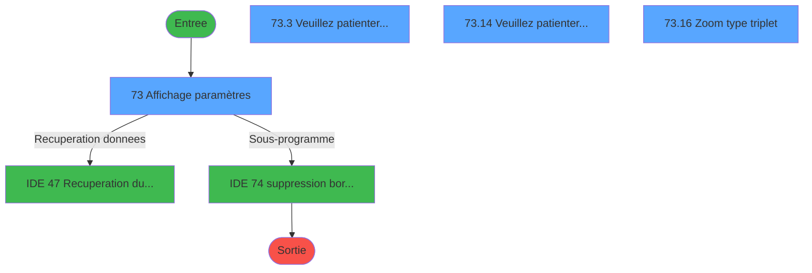
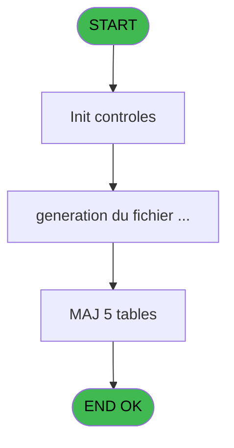
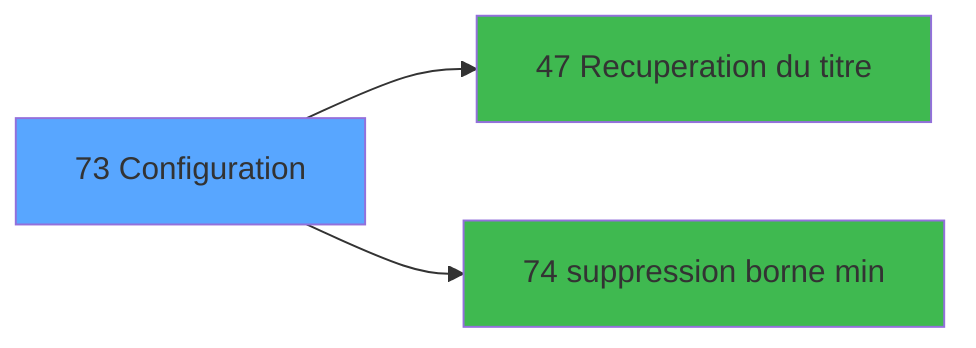

# MAI IDE 73 - Configuration

> **Analyse**: Phases 1-4 2026-02-03 15:01 -> 15:01 (9s) | Assemblage 15:01
> **Pipeline**: V7.2 Enrichi
> **Structure**: 4 onglets (Resume | Ecrans | Donnees | Connexions)

<!-- TAB:Resume -->

## 1. FICHE D'IDENTITE

| Attribut | Valeur |
|----------|--------|
| Projet | MAI |
| IDE Position | 73 |
| Nom Programme | Configuration |
| Fichier source | `Prg_73.xml` |
| Dossier IDE | Telephone |
| Taches | 18 (4 ecrans visibles) |
| Tables modifiees | 5 |
| Programmes appeles | 2 |

## 2. DESCRIPTION FONCTIONNELLE

**Configuration** assure la gestion complete de ce processus, accessible depuis [Menu Telephone (IDE 85)](MAI-IDE-85.md).

Le flux de traitement s'organise en **4 blocs fonctionnels** :

- **Traitement** (14 taches) : traitements metier divers
- **Consultation** (2 taches) : ecrans de recherche, selection et consultation
- **Calcul** (1 tache) : calculs de montants, stocks ou compteurs
- **Initialisation** (1 tache) : reinitialisation d'etats et de variables de travail

**Donnees modifiees** : 5 tables en ecriture (serie_ligne______slg, ligne_telephone__lgn, generation_code_gen, serie_telephone__stl, param__telephone_tel).

**Logique metier** : 2 regles identifiees couvrant conditions metier.

Detail : phases du traitement

#### Phase 1 : Consultation (2 taches)

- **73** - Affichage paramètres **[[ECRAN]](#ecran-t1)**
- **73.16** - Zoom type triplet **[[ECRAN]](#ecran-t18)**

Delegue a : [Recuperation du titre (IDE 47)](MAI-IDE-47.md)

#### Phase 2 : Initialisation (1 tache)

- **73.1** - Lecture fichier INIT

#### Phase 3 : Traitement (14 taches)

- **73.2** - enregistrement paramètres
- **73.3** - Veuillez patienter... **[[ECRAN]](#ecran-t5)**
- **73.4** - suppression du 1111
- **73.5** - suppression du 1111
- **73.6** - suppression du 1111
- **73.7** - suppression du 1111
- **73.8** - suppression du 1111
- **73.9** - suppression du 1111
- **73.10** - suppression du 1111
- **73.11** - suppression du 1111
- **73.12** - suppression du 1111
- **73.13** - generation du fichier serie
- **73.14** - Veuillez patienter... **[[ECRAN]](#ecran-t16)**
- **73.15** - generation du fichier serie

Delegue a : [Recuperation du titre (IDE 47)](MAI-IDE-47.md), [   suppression borne min (IDE 74)](MAI-IDE-74.md)

#### Phase 4 : Calcul (1 tache)

- **73.17** - Calcul flag

#### Tables impactees

| Table | Operations | Role metier |
|-------|-----------|-------------|
| generation_code_gen | **W** (10 usages) |  |
| param__telephone_tel | R/**W** (2 usages) |  |
| ligne_telephone__lgn | **W** (1 usages) |  |
| serie_ligne______slg | **W** (1 usages) |  |
| serie_telephone__stl | **W** (1 usages) |  |

## 3. BLOCS FONCTIONNELS

### 3.1 Consultation (2 taches)

Ecrans de recherche et consultation.

---

#### 73 - Affichage paramètres [[ECRAN]](#ecran-t1)

**Role** : Reinitialisation : Affichage paramètres.
**Ecran** : 1040 x 281 DLU (MDI) | [Voir mockup](#ecran-t1)

---

#### 73.16 - Zoom type triplet [[ECRAN]](#ecran-t18)

**Role** : Selection par l'operateur : Zoom type triplet.
**Ecran** : 584 x 84 DLU (Modal) | [Voir mockup](#ecran-t18)
**Variables liees** : C (W0 type triplet), D (W0 type interface)

### 3.2 Initialisation (1 tache)

Reinitialisation d'etats et variables de travail.

---

#### 73.1 - Lecture fichier INIT

**Role** : Reinitialisation : Lecture fichier INIT.

### 3.3 Traitement (14 taches)

Traitements internes.

---

#### 73.2 - enregistrement paramètres

**Role** : Traitement : enregistrement paramètres.

---

#### 73.3 - Veuillez patienter... [[ECRAN]](#ecran-t5)

**Role** : Traitement : Veuillez patienter....
**Ecran** : 422 x 57 DLU (MDI) | [Voir mockup](#ecran-t5)

---

#### 73.4 - suppression du 1111

**Role** : Traitement : suppression du 1111.

---

#### 73.5 - suppression du 1111

**Role** : Traitement : suppression du 1111.

---

#### 73.6 - suppression du 1111

**Role** : Traitement : suppression du 1111.

---

#### 73.7 - suppression du 1111

**Role** : Traitement : suppression du 1111.

---

#### 73.8 - suppression du 1111

**Role** : Traitement : suppression du 1111.

---

#### 73.9 - suppression du 1111

**Role** : Traitement : suppression du 1111.

---

#### 73.10 - suppression du 1111

**Role** : Traitement : suppression du 1111.

---

#### 73.11 - suppression du 1111

**Role** : Traitement : suppression du 1111.

---

#### 73.12 - suppression du 1111

**Role** : Traitement : suppression du 1111.

---

#### 73.13 - generation du fichier serie

**Role** : Traitement : generation du fichier serie.

---

#### 73.14 - Veuillez patienter... [[ECRAN]](#ecran-t16)

**Role** : Traitement : Veuillez patienter....
**Ecran** : 429 x 60 DLU (MDI) | [Voir mockup](#ecran-t16)

---

#### 73.15 - generation du fichier serie

**Role** : Traitement : generation du fichier serie.

### 3.4 Calcul (1 tache)

Calculs metier : montants, stocks, compteurs.

---

#### 73.17 - Calcul flag

**Role** : Calcul : Calcul flag.
**Variables liees** : S (v. flag)

## 5. REGLES METIER

2 regles identifiees:

### Autres (2 regles)

#### [RM-001] Si W0 modif autorisee ? [Q]='O' alors MlsTrans('Modification') sinon MlsTrans('Visualisation'))

| Element | Detail |
|---------|--------|
| **Condition** | `W0 modif autorisee ? [Q]='O'` |
| **Si vrai** | MlsTrans('Modification') |
| **Si faux** | MlsTrans('Visualisation')) |
| **Variables** | Q (W0 modif autorisee ?) |
| **Expression source** | Expression 10 : `IF(W0 modif autorisee ? [Q]='O',MlsTrans('Modification'),Mls` |
| **Exemple** | Si W0 modif autorisee ? [Q]='O' → MlsTrans('Modification'). Sinon → MlsTrans('Visualisation')) |

#### [RM-002] Si W0 longueur code [E]=4 alors 9999 sinon 25000)

| Element | Detail |
|---------|--------|
| **Condition** | `W0 longueur code [E]=4` |
| **Si vrai** | 9999 |
| **Si faux** | 25000) |
| **Variables** | E (W0 longueur code) |
| **Expression source** | Expression 14 : `IF (W0 longueur code [E]=4,9999,25000)` |
| **Exemple** | Si W0 longueur code [E]=4 → 9999. Sinon → 25000) |

## 6. CONTEXTE

- **Appele par**: [Menu Telephone (IDE 85)](MAI-IDE-85.md)
- **Appelle**: 2 programmes | **Tables**: 7 (W:5 R:1 L:2) | **Taches**: 18 | **Expressions**: 41

<!-- TAB:Ecrans -->

## 8. ECRANS

### 8.1 Forms visibles (4 / 18)

| # | Position | Tache | Nom | Type | Largeur | Hauteur | Bloc |
|---|----------|-------|-----|------|---------|---------|------|
| 1 | 73 | 73 | Affichage paramètres | MDI | 1040 | 281 | Consultation |
| 2 | 73.3 | 73.3 | Veuillez patienter... | MDI | 422 | 57 | Traitement |
| 3 | 73.14 | 73.14 | Veuillez patienter... | MDI | 429 | 60 | Traitement |
| 4 | 73.16 | 73.16 | Zoom type triplet | Modal | 584 | 84 | Consultation |

### 8.2 Mockups Ecrans

---

#### 73 - Affichage paramètres
**Tache** : [73](#t1) | **Type** : MDI | **Dimensions** : 1040 x 281 DLU
**Bloc** : Consultation | **Titre IDE** : Affichage paramètres

<!-- FORM-DATA:
{
    "width":  1040,
    "vFactor":  8,
    "type":  "MDI",
    "hFactor":  8,
    "controls":  [
                     {
                         "x":  0,
                         "type":  "label",
                         "var":  "",
                         "y":  0,
                         "w":  1034,
                         "fmt":  "",
                         "name":  "",
                         "h":  19,
                         "color":  "",
                         "text":  "",
                         "parent":  null
                     },
                     {
                         "x":  54,
                         "type":  "label",
                         "var":  "",
                         "y":  26,
                         "w":  925,
                         "fmt":  "",
                         "name":  "",
                         "h":  218,
                         "color":  "195",
                         "text":  "Visualisation",
                         "parent":  null
                     },
                     {
                         "x":  111,
                         "type":  "label",
                         "var":  "",
                         "y":  45,
                         "w":  539,
                         "fmt":  "",
                         "name":  "",
                         "h":  44,
                         "color":  "",
                         "text":  "",
                         "parent":  5
                     },
                     {
                         "x":  663,
                         "type":  "label",
                         "var":  "",
                         "y":  45,
                         "w":  255,
                         "fmt":  "",
                         "name":  "",
                         "h":  44,
                         "color":  "",
                         "text":  "",
                         "parent":  5
                     },
                     {
                         "x":  423,
                         "type":  "label",
                         "var":  "",
                         "y":  51,
                         "w":  120,
                         "fmt":  "",
                         "name":  "",
                         "h":  9,
                         "color":  "4",
                         "text":  "Retour de taxe",
                         "parent":  5
                     },
                     {
                         "x":  686,
                         "type":  "label",
                         "var":  "",
                         "y":  51,
                         "w":  111,
                         "fmt":  "",
                         "name":  "",
                         "h":  9,
                         "color":  "4",
                         "text":  "Langue",
                         "parent":  5
                     },
                     {
                         "x":  121,
                         "type":  "label",
                         "var":  "",
                         "y":  52,
                         "w":  232,
                         "fmt":  "",
                         "name":  "",
                         "h":  8,
                         "color":  "4",
                         "text":  "Telephone carte à memoire",
                         "parent":  5
                     },
                     {
                         "x":  423,
                         "type":  "label",
                         "var":  "",
                         "y":  73,
                         "w":  130,
                         "fmt":  "",
                         "name":  "",
                         "h":  8,
                         "color":  "4",
                         "text":  "Type d\u0027interface",
                         "parent":  5
                     },
                     {
                         "x":  686,
                         "type":  "label",
                         "var":  "",
                         "y":  73,
                         "w":  166,
                         "fmt":  "",
                         "name":  "",
                         "h":  9,
                         "color":  "4",
                         "text":  "Longueur du poste",
                         "parent":  5
                     },
                     {
                         "x":  121,
                         "type":  "label",
                         "var":  "",
                         "y":  74,
                         "w":  115,
                         "fmt":  "",
                         "name":  "",
                         "h":  8,
                         "color":  "4",
                         "text":  "Type de triplet",
                         "parent":  5
                     },
                     {
                         "x":  111,
                         "type":  "label",
                         "var":  "",
                         "y":  104,
                         "w":  807,
                         "fmt":  "",
                         "name":  "",
                         "h":  54,
                         "color":  "",
                         "text":  "",
                         "parent":  5
                     },
                     {
                         "x":  497,
                         "type":  "label",
                         "var":  "",
                         "y":  114,
                         "w":  218,
                         "fmt":  "",
                         "name":  "",
                         "h":  9,
                         "color":  "4",
                         "text":  "Nombre de codes acceptes",
                         "parent":  5
                     },
                     {
                         "x":  121,
                         "type":  "label",
                         "var":  "",
                         "y":  115,
                         "w":  225,
                         "fmt":  "",
                         "name":  "",
                         "h":  9,
                         "color":  "4",
                         "text":  "Longueur du code",
                         "parent":  5
                     },
                     {
                         "x":  121,
                         "type":  "label",
                         "var":  "",
                         "y":  137,
                         "w":  232,
                         "fmt":  "",
                         "name":  "",
                         "h":  9,
                         "color":  "4",
                         "text":  "Borne minimale code autocom :",
                         "parent":  5
                     },
                     {
                         "x":  497,
                         "type":  "label",
                         "var":  "",
                         "y":  137,
                         "w":  232,
                         "fmt":  "",
                         "name":  "",
                         "h":  9,
                         "color":  "4",
                         "text":  "Borne maximale code autocom :",
                         "parent":  5
                     },
                     {
                         "x":  112,
                         "type":  "label",
                         "var":  "",
                         "y":  174,
                         "w":  805,
                         "fmt":  "",
                         "name":  "",
                         "h":  53,
                         "color":  "",
                         "text":  "",
                         "parent":  5
                     },
                     {
                         "x":  121,
                         "type":  "label",
                         "var":  "",
                         "y":  185,
                         "w":  241,
                         "fmt":  "",
                         "name":  "",
                         "h":  8,
                         "color":  "4",
                         "text":  "Borne minimale n° ligne",
                         "parent":  5
                     },
                     {
                         "x":  497,
                         "type":  "label",
                         "var":  "",
                         "y":  185,
                         "w":  238,
                         "fmt":  "",
                         "name":  "",
                         "h":  9,
                         "color":  "4",
                         "text":  "Borne maximale n° ligne",
                         "parent":  5
                     },
                     {
                         "x":  121,
                         "type":  "label",
                         "var":  "",
                         "y":  206,
                         "w":  168,
                         "fmt":  "",
                         "name":  "",
                         "h":  8,
                         "color":  "4",
                         "text":  "Ligne directe (S.D.A)",
                         "parent":  5
                     },
                     {
                         "x":  497,
                         "type":  "label",
                         "var":  "",
                         "y":  206,
                         "w":  200,
                         "fmt":  "",
                         "name":  "",
                         "h":  9,
                         "color":  "4",
                         "text":  "Nb.max de ligne / poste",
                         "parent":  5
                     },
                     {
                         "x":  0,
                         "type":  "label",
                         "var":  "",
                         "y":  252,
                         "w":  1034,
                         "fmt":  "",
                         "name":  "",
                         "h":  24,
                         "color":  "",
                         "text":  "",
                         "parent":  null
                     },
                     {
                         "x":  356,
                         "type":  "edit",
                         "var":  "",
                         "y":  51,
                         "w":  26,
                         "fmt":  "UA",
                         "name":  "",
                         "h":  10,
                         "color":  "6",
                         "text":  "",
                         "parent":  5
                     },
                     {
                         "x":  570,
                         "type":  "edit",
                         "var":  "",
                         "y":  51,
                         "w":  26,
                         "fmt":  "UA",
                         "name":  "W0 retour taxe",
                         "h":  10,
                         "color":  "6",
                         "text":  "",
                         "parent":  5
                     },
                     {
                         "x":  356,
                         "type":  "edit",
                         "var":  "",
                         "y":  73,
                         "w":  26,
                         "fmt":  "UA",
                         "name":  "W0 type triplet",
                         "h":  10,
                         "color":  "6",
                         "text":  "",
                         "parent":  5
                     },
                     {
                         "x":  570,
                         "type":  "edit",
                         "var":  "",
                         "y":  72,
                         "w":  70,
                         "fmt":  "",
                         "name":  "W0 type interface",
                         "h":  10,
                         "color":  "6",
                         "text":  "",
                         "parent":  5
                     },
                     {
                         "x":  370,
                         "type":  "edit",
                         "var":  "",
                         "y":  115,
                         "w":  26,
                         "fmt":  "1A",
                         "name":  "W0 longueur code",
                         "h":  10,
                         "color":  "6",
                         "text":  "",
                         "parent":  5
                     },
                     {
                         "x":  756,
                         "type":  "edit",
                         "var":  "",
                         "y":  114,
                         "w":  82,
                         "fmt":  "6LA",
                         "name":  "W0 nbre codes",
                         "h":  10,
                         "color":  "6",
                         "text":  "",
                         "parent":  5
                     },
                     {
                         "x":  370,
                         "type":  "edit",
                         "var":  "",
                         "y":  136,
                         "w":  82,
                         "fmt":  "6L",
                         "name":  "W0 borne min code",
                         "h":  10,
                         "color":  "6",
                         "text":  "",
                         "parent":  5
                     },
                     {
                         "x":  756,
                         "type":  "edit",
                         "var":  "",
                         "y":  137,
                         "w":  82,
                         "fmt":  "6L",
                         "name":  "W0 borne max code",
                         "h":  10,
                         "color":  "6",
                         "text":  "",
                         "parent":  5
                     },
                     {
                         "x":  859,
                         "type":  "edit",
                         "var":  "",
                         "y":  51,
                         "w":  26,
                         "fmt":  "",
                         "name":  "W0 Langue",
                         "h":  10,
                         "color":  "6",
                         "text":  "",
                         "parent":  5
                     },
                     {
                         "x":  859,
                         "type":  "edit",
                         "var":  "",
                         "y":  73,
                         "w":  26,
                         "fmt":  "",
                         "name":  "W0 Longueur poste",
                         "h":  10,
                         "color":  "6",
                         "text":  "",
                         "parent":  5
                     },
                     {
                         "x":  370,
                         "type":  "edit",
                         "var":  "",
                         "y":  185,
                         "w":  82,
                         "fmt":  "6L",
                         "name":  "W0 borne min ligne",
                         "h":  10,
                         "color":  "6",
                         "text":  "",
                         "parent":  5
                     },
                     {
                         "x":  756,
                         "type":  "edit",
                         "var":  "",
                         "y":  185,
                         "w":  82,
                         "fmt":  "6L",
                         "name":  "W0 borne max ligne",
                         "h":  10,
                         "color":  "6",
                         "text":  "",
                         "parent":  5
                     },
                     {
                         "x":  370,
                         "type":  "edit",
                         "var":  "",
                         "y":  206,
                         "w":  26,
                         "fmt":  "",
                         "name":  "W0 SDA",
                         "h":  10,
                         "color":  "6",
                         "text":  "",
                         "parent":  5
                     },
                     {
                         "x":  756,
                         "type":  "edit",
                         "var":  "",
                         "y":  206,
                         "w":  59,
                         "fmt":  "4L",
                         "name":  "W0 Max ligne/poste",
                         "h":  10,
                         "color":  "6",
                         "text":  "",
                         "parent":  5
                     },
                     {
                         "x":  6,
                         "type":  "button",
                         "var":  "",
                         "y":  256,
                         "w":  154,
                         "fmt":  "\u0026Ok",
                         "name":  "bouton Ok",
                         "h":  18,
                         "color":  "",
                         "text":  "",
                         "parent":  null
                     },
                     {
                         "x":  6,
                         "type":  "edit",
                         "var":  "",
                         "y":  4,
                         "w":  267,
                         "fmt":  "20",
                         "name":  "",
                         "h":  8,
                         "color":  "",
                         "text":  "",
                         "parent":  null
                     },
                     {
                         "x":  826,
                         "type":  "edit",
                         "var":  "",
                         "y":  4,
                         "w":  203,
                         "fmt":  "WWW DD MMM YYYYT",
                         "name":  "",
                         "h":  8,
                         "color":  "",
                         "text":  "",
                         "parent":  null
                     },
                     {
                         "x":  171,
                         "type":  "button",
                         "var":  "",
                         "y":  256,
                         "w":  154,
                         "fmt":  "\u0026Abandonner",
                         "name":  "",
                         "h":  18,
                         "color":  "",
                         "text":  "",
                         "parent":  null
                     }
                 ],
    "taskId":  "73",
    "height":  281
}
-->

<strong>Champs : 16 champs</strong>

| Pos (x,y) | Nom | Variable | Type |
|-----------|-----|----------|------|
| 356,51 | UA | - | edit |
| 570,51 | W0 retour taxe | - | edit |
| 356,73 | W0 type triplet | - | edit |
| 570,72 | W0 type interface | - | edit |
| 370,115 | W0 longueur code | - | edit |
| 756,114 | W0 nbre codes | - | edit |
| 370,136 | W0 borne min code | - | edit |
| 756,137 | W0 borne max code | - | edit |
| 859,51 | W0 Langue | - | edit |
| 859,73 | W0 Longueur poste | - | edit |
| 370,185 | W0 borne min ligne | - | edit |
| 756,185 | W0 borne max ligne | - | edit |
| 370,206 | W0 SDA | - | edit |
| 756,206 | W0 Max ligne/poste | - | edit |
| 6,4 | 20 | - | edit |
| 826,4 | WWW DD MMM YYYYT | - | edit |

<strong>Boutons : 2 boutons</strong>

| Bouton | Pos (x,y) | Action |
|--------|-----------|--------|
| Ok | 6,256 | Valide la saisie et enregistre |
| Abandonner | 171,256 | Annule et retour au menu |

---

#### 73.3 - Veuillez patienter...
**Tache** : [73.3](#t5) | **Type** : MDI | **Dimensions** : 422 x 57 DLU
**Bloc** : Traitement | **Titre IDE** : Veuillez patienter...

<!-- FORM-DATA:
{
    "width":  422,
    "vFactor":  8,
    "type":  "MDI",
    "hFactor":  8,
    "controls":  [
                     {
                         "x":  0,
                         "type":  "label",
                         "var":  "",
                         "y":  0,
                         "w":  423,
                         "fmt":  "",
                         "name":  "",
                         "h":  29,
                         "color":  "",
                         "text":  "",
                         "parent":  null
                     },
                     {
                         "x":  120,
                         "type":  "label",
                         "var":  "",
                         "y":  10,
                         "w":  272,
                         "fmt":  "",
                         "name":  "",
                         "h":  8,
                         "color":  "7",
                         "text":  "Generation code en cours ...",
                         "parent":  null
                     },
                     {
                         "x":  0,
                         "type":  "label",
                         "var":  "",
                         "y":  29,
                         "w":  423,
                         "fmt":  "",
                         "name":  "",
                         "h":  27,
                         "color":  "",
                         "text":  "",
                         "parent":  null
                     },
                     {
                         "x":  131,
                         "type":  "label",
                         "var":  "",
                         "y":  38,
                         "w":  48,
                         "fmt":  "",
                         "name":  "",
                         "h":  8,
                         "color":  "",
                         "text":  "Etat",
                         "parent":  null
                     },
                     {
                         "x":  206,
                         "type":  "edit",
                         "var":  "",
                         "y":  38,
                         "w":  86,
                         "fmt":  "",
                         "name":  "",
                         "h":  8,
                         "color":  "",
                         "text":  "",
                         "parent":  4
                     },
                     {
                         "x":  4,
                         "type":  "image",
                         "var":  "",
                         "y":  2,
                         "w":  72,
                         "fmt":  "",
                         "name":  "",
                         "h":  25,
                         "color":  "",
                         "text":  "",
                         "parent":  null
                     }
                 ],
    "taskId":  "73.3",
    "height":  57
}
-->

<strong>Champs : 1 champs</strong>

| Pos (x,y) | Nom | Variable | Type |
|-----------|-----|----------|------|
| 206,38 | (sans nom) | - | edit |

---

#### 73.14 - Veuillez patienter...
**Tache** : [73.14](#t16) | **Type** : MDI | **Dimensions** : 429 x 60 DLU
**Bloc** : Traitement | **Titre IDE** : Veuillez patienter...

<!-- FORM-DATA:
{
    "width":  429,
    "vFactor":  8,
    "type":  "MDI",
    "hFactor":  8,
    "controls":  [
                     {
                         "x":  0,
                         "type":  "label",
                         "var":  "",
                         "y":  0,
                         "w":  423,
                         "fmt":  "",
                         "name":  "",
                         "h":  29,
                         "color":  "",
                         "text":  "",
                         "parent":  null
                     },
                     {
                         "x":  120,
                         "type":  "label",
                         "var":  "",
                         "y":  10,
                         "w":  254,
                         "fmt":  "",
                         "name":  "",
                         "h":  8,
                         "color":  "7",
                         "text":  "Generation lignes en cours",
                         "parent":  null
                     },
                     {
                         "x":  0,
                         "type":  "label",
                         "var":  "",
                         "y":  29,
                         "w":  423,
                         "fmt":  "",
                         "name":  "",
                         "h":  27,
                         "color":  "",
                         "text":  "",
                         "parent":  null
                     },
                     {
                         "x":  137,
                         "type":  "label",
                         "var":  "",
                         "y":  39,
                         "w":  48,
                         "fmt":  "",
                         "name":  "",
                         "h":  8,
                         "color":  "",
                         "text":  "Etat",
                         "parent":  null
                     },
                     {
                         "x":  4,
                         "type":  "image",
                         "var":  "",
                         "y":  2,
                         "w":  72,
                         "fmt":  "",
                         "name":  "",
                         "h":  25,
                         "color":  "",
                         "text":  "",
                         "parent":  null
                     },
                     {
                         "x":  199,
                         "type":  "edit",
                         "var":  "",
                         "y":  39,
                         "w":  88,
                         "fmt":  "",
                         "name":  "",
                         "h":  8,
                         "color":  "",
                         "text":  "",
                         "parent":  4
                     }
                 ],
    "taskId":  "73.14",
    "height":  60
}
-->

<strong>Champs : 1 champs</strong>

| Pos (x,y) | Nom | Variable | Type |
|-----------|-----|----------|------|
| 199,39 | (sans nom) | - | edit |

---

#### 73.16 - Zoom type triplet
**Tache** : [73.16](#t18) | **Type** : Modal | **Dimensions** : 584 x 84 DLU
**Bloc** : Consultation | **Titre IDE** : Zoom type triplet

<!-- FORM-DATA:
{
    "width":  584,
    "vFactor":  8,
    "type":  "Modal",
    "hFactor":  8,
    "controls":  [
                     {
                         "x":  0,
                         "type":  "label",
                         "var":  "",
                         "y":  2,
                         "w":  580,
                         "fmt":  "",
                         "name":  "",
                         "h":  53,
                         "color":  "",
                         "text":  "",
                         "parent":  null
                     },
                     {
                         "x":  76,
                         "type":  "label",
                         "var":  "",
                         "y":  8,
                         "w":  136,
                         "fmt":  "",
                         "name":  "",
                         "h":  8,
                         "color":  "",
                         "text":  "1   -\u003e     Ní poste",
                         "parent":  null
                     },
                     {
                         "x":  236,
                         "type":  "label",
                         "var":  "",
                         "y":  8,
                         "w":  96,
                         "fmt":  "",
                         "name":  "",
                         "h":  8,
                         "color":  "",
                         "text":  "+    Ní ligne",
                         "parent":  null
                     },
                     {
                         "x":  358,
                         "type":  "label",
                         "var":  "",
                         "y":  8,
                         "w":  147,
                         "fmt":  "",
                         "name":  "",
                         "h":  8,
                         "color":  "",
                         "text":  "+    Code autocom",
                         "parent":  null
                     },
                     {
                         "x":  76,
                         "type":  "label",
                         "var":  "",
                         "y":  20,
                         "w":  136,
                         "fmt":  "",
                         "name":  "",
                         "h":  8,
                         "color":  "",
                         "text":  "2   -\u003e     Blanc",
                         "parent":  null
                     },
                     {
                         "x":  236,
                         "type":  "label",
                         "var":  "",
                         "y":  20,
                         "w":  96,
                         "fmt":  "",
                         "name":  "",
                         "h":  8,
                         "color":  "",
                         "text":  "+    Ní ligne",
                         "parent":  null
                     },
                     {
                         "x":  358,
                         "type":  "label",
                         "var":  "",
                         "y":  20,
                         "w":  147,
                         "fmt":  "",
                         "name":  "",
                         "h":  8,
                         "color":  "",
                         "text":  "+    Code autocom",
                         "parent":  null
                     },
                     {
                         "x":  76,
                         "type":  "label",
                         "var":  "",
                         "y":  32,
                         "w":  136,
                         "fmt":  "",
                         "name":  "",
                         "h":  8,
                         "color":  "",
                         "text":  "3   -\u003e     Ní poste",
                         "parent":  null
                     },
                     {
                         "x":  236,
                         "type":  "label",
                         "var":  "",
                         "y":  32,
                         "w":  96,
                         "fmt":  "",
                         "name":  "",
                         "h":  8,
                         "color":  "",
                         "text":  "+    Blanc",
                         "parent":  null
                     },
                     {
                         "x":  358,
                         "type":  "label",
                         "var":  "",
                         "y":  32,
                         "w":  147,
                         "fmt":  "",
                         "name":  "",
                         "h":  8,
                         "color":  "",
                         "text":  "+    Code autocom",
                         "parent":  null
                     },
                     {
                         "x":  76,
                         "type":  "label",
                         "var":  "",
                         "y":  44,
                         "w":  136,
                         "fmt":  "",
                         "name":  "",
                         "h":  8,
                         "color":  "",
                         "text":  "4   -\u003e     Blanc",
                         "parent":  null
                     },
                     {
                         "x":  236,
                         "type":  "label",
                         "var":  "",
                         "y":  44,
                         "w":  96,
                         "fmt":  "",
                         "name":  "",
                         "h":  8,
                         "color":  "",
                         "text":  "+    Blanc",
                         "parent":  null
                     },
                     {
                         "x":  358,
                         "type":  "label",
                         "var":  "",
                         "y":  44,
                         "w":  147,
                         "fmt":  "",
                         "name":  "",
                         "h":  8,
                         "color":  "",
                         "text":  "+    Code autocom",
                         "parent":  null
                     },
                     {
                         "x":  0,
                         "type":  "label",
                         "var":  "",
                         "y":  58,
                         "w":  580,
                         "fmt":  "",
                         "name":  "",
                         "h":  24,
                         "color":  "",
                         "text":  "",
                         "parent":  null
                     },
                     {
                         "x":  6,
                         "type":  "button",
                         "var":  "",
                         "y":  61,
                         "w":  154,
                         "fmt":  "\u0026Quitter",
                         "name":  "",
                         "h":  18,
                         "color":  "",
                         "text":  "",
                         "parent":  null
                     }
                 ],
    "taskId":  "73.16",
    "height":  84
}
-->

<strong>Boutons : 1 boutons</strong>

| Bouton | Pos (x,y) | Action |
|--------|-----------|--------|
| Quitter | 6,61 | Quitte le programme |

## 9. NAVIGATION

### 9.1 Enchainement des ecrans

**Detail par enchainement :**

| Depuis | Action | Vers | Retour |
|--------|--------|------|--------|
| Affichage paramètres | Recuperation donnees | [Recuperation du titre (IDE 47)](MAI-IDE-47.md) | Retour ecran |
| Affichage paramètres | Sous-programme | [   suppression borne min (IDE 74)](MAI-IDE-74.md) | Retour ecran |

### 9.3 Structure hierarchique (18 taches)

| Position | Tache | Type | Dimensions | Bloc |
|----------|-------|------|------------|------|
| **73.1** | [**Affichage paramètres** (73)](#t1) [mockup](#ecran-t1) | MDI | 1040x281 | Consultation |
| 73.1.1 | [Zoom type triplet (73.16)](#t18) [mockup](#ecran-t18) | Modal | 584x84 | |
| **73.2** | [**Lecture fichier INIT** (73.1)](#t2) | MDI | - | Initialisation |
| **73.3** | [**enregistrement paramètres** (73.2)](#t4) | MDI | - | Traitement |
| 73.3.1 | [Veuillez patienter... (73.3)](#t5) [mockup](#ecran-t5) | MDI | 422x57 | |
| 73.3.2 | [suppression du 1111 (73.4)](#t6) | MDI | - | |
| 73.3.3 | [suppression du 1111 (73.5)](#t7) | MDI | - | |
| 73.3.4 | [suppression du 1111 (73.6)](#t8) | MDI | - | |
| 73.3.5 | [suppression du 1111 (73.7)](#t9) | MDI | - | |
| 73.3.6 | [suppression du 1111 (73.8)](#t10) | MDI | - | |
| 73.3.7 | [suppression du 1111 (73.9)](#t11) | MDI | - | |
| 73.3.8 | [suppression du 1111 (73.10)](#t12) | MDI | - | |
| 73.3.9 | [suppression du 1111 (73.11)](#t13) | MDI | - | |
| 73.3.10 | [suppression du 1111 (73.12)](#t14) | MDI | - | |
| 73.3.11 | [generation du fichier serie (73.13)](#t15) | MDI | - | |
| 73.3.12 | [Veuillez patienter... (73.14)](#t16) [mockup](#ecran-t16) | MDI | 429x60 | |
| 73.3.13 | [generation du fichier serie (73.15)](#t17) | MDI | - | |
| **73.4** | [**Calcul flag** (73.17)](#t19) | MDI | - | Calcul |

### 9.4 Algorigramme

> **Legende**: Vert = START/END OK | Rouge = END KO | Bleu = Decisions
> *Algorigramme auto-genere. Utiliser `/algorigramme` pour une synthese metier detaillee.*

<!-- TAB:Donnees -->

## 10. TABLES

### Tables utilisees (7)

| ID | Nom | Description | Type | R | W | L | Usages |
|----|-----|-------------|------|---|---|---|--------|
| 52 | serie_ligne______slg |  | DB |   | **W** |   | 1 |
| 53 | ligne_telephone__lgn |  | DB |   | **W** |   | 1 |
| 72 | generation_code_gen |  | DB |   | **W** |   | 10 |
| 73 | serie_telephone__stl |  | DB |   | **W** |   | 1 |
| 78 | param__telephone_tel |  | DB | R | **W** |   | 2 |
| 80 | codes_autocom____aut |  | DB |   |   | L | 1 |
| 87 | sda_telephone____sda |  | DB |   |   | L | 1 |

### Colonnes par table (5 / 5 tables avec colonnes identifiees)

Table 52 - serie_ligne______slg (**W**) - 1 usages

| Lettre | Variable | Acces | Type |
|--------|----------|-------|------|
| K | W0 borne min ligne | W | Numeric |
| L | W0 borne max ligne | W | Numeric |
| N | W0 Max ligne/poste | W | Numeric |

Table 53 - ligne_telephone__lgn (**W**) - 1 usages

| Lettre | Variable | Acces | Type |
|--------|----------|-------|------|
| K | W0 borne min ligne | W | Numeric |
| L | W0 borne max ligne | W | Numeric |
| N | W0 Max ligne/poste | W | Numeric |

Table 72 - generation_code_gen (**W**) - 10 usages

| Lettre | Variable | Acces | Type |
|--------|----------|-------|------|
| A | W1 pas | W | Numeric |
| B | W1 compteur | W | Numeric |
| C | W1 log neperien | W | Numeric |
| D | W1 nbre enr. generes | W | Numeric |

Table 73 - serie_telephone__stl (**W**) - 1 usages

*Table utilisee uniquement en Link ou aucune colonne Real identifiee dans le DataView.*

Table 78 - param__telephone_tel (R/**W**) - 2 usages

| Lettre | Variable | Acces | Type |
|--------|----------|-------|------|
| A | W1 retour lien autoc | W | Numeric |
| B | W1 ret.lien SDA | W | Numeric |

## 11. VARIABLES

### 11.1 Variables de session (2)

Variables persistantes pendant toute la session.

| Lettre | Nom | Type | Usage dans |
|--------|-----|------|-----------|
| R | v. titre ecran | Alpha | 1x session |
| S | v. flag | Logical | [73.17](#t19) |

### 11.2 Variables de travail (17)

Variables internes au programme.

| Lettre | Nom | Type | Usage dans |
|--------|-----|------|-----------|
| A | W0 tel à CAM | Alpha | 3x calcul interne |
| B | W0 retour taxe | Alpha | 1x calcul interne |
| C | W0 type triplet | Alpha | [73.16](#t18) |
| D | W0 type interface | Alpha | [73.16](#t18) |
| E | W0 longueur code | Numeric | 7x calcul interne |
| F | W0 nbre codes | Numeric | 4x calcul interne |
| G | W0 borne min code | Numeric | - |
| H | W0 borne max code | Numeric | 4x calcul interne |
| I | W0 Langue | Alpha | 2x calcul interne |
| J | W0 Longueur poste | Numeric | 3x calcul interne |
| K | W0 borne min ligne | Numeric | 2x calcul interne |
| L | W0 borne max ligne | Numeric | 3x calcul interne |
| M | W0 SDA | Alpha | - |
| N | W0 Max ligne/poste | Numeric | 2x calcul interne |
| O | W0 nb code max | Numeric | 1x calcul interne |
| P | W0 validation | Numeric | 2x calcul interne |
| Q | W0 modif autorisee ? | Alpha | 5x calcul interne |

### 11.3 Autres (1)

Variables diverses.

| Lettre | Nom | Type | Usage dans |
|--------|-----|------|-----------|
| T | bouton Ok | Alpha | - |

Toutes les 20 variables (liste complete)

| Cat | Lettre | Nom Variable | Type |
|-----|--------|--------------|------|
| W0 | **A** | W0 tel à CAM | Alpha |
| W0 | **B** | W0 retour taxe | Alpha |
| W0 | **C** | W0 type triplet | Alpha |
| W0 | **D** | W0 type interface | Alpha |
| W0 | **E** | W0 longueur code | Numeric |
| W0 | **F** | W0 nbre codes | Numeric |
| W0 | **G** | W0 borne min code | Numeric |
| W0 | **H** | W0 borne max code | Numeric |
| W0 | **I** | W0 Langue | Alpha |
| W0 | **J** | W0 Longueur poste | Numeric |
| W0 | **K** | W0 borne min ligne | Numeric |
| W0 | **L** | W0 borne max ligne | Numeric |
| W0 | **M** | W0 SDA | Alpha |
| W0 | **N** | W0 Max ligne/poste | Numeric |
| W0 | **O** | W0 nb code max | Numeric |
| W0 | **P** | W0 validation | Numeric |
| W0 | **Q** | W0 modif autorisee ? | Alpha |
| V. | **R** | v. titre ecran | Alpha |
| V. | **S** | v. flag | Logical |
| Autre | **T** | bouton Ok | Alpha |

## 12. EXPRESSIONS

**41 / 41 expressions decodees (100%)**

### 12.1 Repartition par type

| Type | Expressions | Regles |
|------|-------------|--------|
| CALCULATION | 3 | 0 |
| CONDITION | 21 | 2 |
| CONSTANTE | 4 | 0 |
| DATE | 1 | 0 |
| REFERENCE_VG | 1 | 0 |
| OTHER | 9 | 0 |
| STRING | 1 | 0 |
| CONCATENATION | 1 | 0 |

### 12.2 Expressions cles par type

#### CALCULATION (3 expressions)

| Type | IDE | Expression | Regle |
|------|-----|------------|-------|
| CALCULATION | 30 | `CallProg('{323,-1}'PROG,DbName('{151,2}'DSOURCE))` | - |
| CALCULATION | 29 | `CallProg('{323,-1}'PROG,DbName('{53,2}'DSOURCE))` | - |
| CALCULATION | 28 | `CallProg('{323,-1}'PROG,DbName('{72,2}'DSOURCE))` | - |

#### CONDITION (21 expressions)

| Type | IDE | Expression | Regle |
|------|-----|------------|-------|
| CONDITION | 14 | `IF (W0 longueur code [E]=4,9999,25000)` | [RM-002](#rm-RM-002) |
| CONDITION | 10 | `IF(W0 modif autorisee ? [Q]='O',MlsTrans('Modification'),MlsTrans('Visualisation'))` | [RM-001](#rm-RM-001) |
| CONDITION | 25 | `(W0 Longueur poste [J]<1 OR W0 Longueur poste [J]>6) AND (W0 type triplet [C]='1' OR W0 type triplet [C]='3')` | - |
| CONDITION | 26 | `W0 borne min ligne [K]>=W0 borne max ligne [L] AND W0 type triplet [C]<'3'` | - |
| CONDITION | 21 | `W0 validation [P]=6 AND W0 type triplet [C]<'3'` | - |
| ... | | *+16 autres* | |

#### CONSTANTE (4 expressions)

| Type | IDE | Expression | Regle |
|------|-----|------------|-------|
| CONSTANTE | 6 | `'N'` | - |
| CONSTANTE | 34 | `'0'` | - |
| CONSTANTE | 4 | `7` | - |
| CONSTANTE | 5 | `0` | - |

#### DATE (1 expressions)

| Type | IDE | Expression | Regle |
|------|-----|------------|-------|
| DATE | 1 | `Date ()` | - |

#### REFERENCE_VG (1 expressions)

| Type | IDE | Expression | Regle |
|------|-----|------------|-------|
| REFERENCE_VG | 2 | `VG2` | - |

#### OTHER (9 expressions)

| Type | IDE | Expression | Regle |
|------|-----|------------|-------|
| OTHER | 39 | `W0 borne max code [H]` | - |
| OTHER | 38 | `W0 nbre codes [F]` | - |
| OTHER | 41 | `W0 Longueur poste [J]` | - |
| OTHER | 40 | `W0 Langue [I]` | - |
| OTHER | 37 | `W0 borne max ligne [L]` | - |
| ... | | *+4 autres* | |

#### STRING (1 expressions)

| Type | IDE | Expression | Regle |
|------|-----|------------|-------|
| STRING | 3 | `Trim (v. titre ecran [R])` | - |

#### CONCATENATION (1 expressions)

| Type | IDE | Expression | Regle |
|------|-----|------------|-------|
| CONCATENATION | 22 | `MlsTrans ('Le nombre de codes doit être superieur à 0 et inferieur à')&' '&Str (W0 nb code max [O],'######')` | - |

### 12.3 Toutes les expressions (41)

Voir les 41 expressions

#### CALCULATION (3)

| IDE | Expression Decodee |
|-----|-------------------|
| 28 | `CallProg('{323,-1}'PROG,DbName('{72,2}'DSOURCE))` |
| 29 | `CallProg('{323,-1}'PROG,DbName('{53,2}'DSOURCE))` |
| 30 | `CallProg('{323,-1}'PROG,DbName('{151,2}'DSOURCE))` |

#### CONDITION (21)

| IDE | Expression Decodee |
|-----|-------------------|
| 10 | `IF(W0 modif autorisee ? [Q]='O',MlsTrans('Modification'),MlsTrans('Visualisation'))` |
| 14 | `IF (W0 longueur code [E]=4,9999,25000)` |
| 7 | `W0 type triplet [C]>'2'` |
| 8 | `W0 type triplet [C]>'2' OR W0 tel à CAM [A]='O'` |
| 9 | `W0 type triplet [C]='2' OR W0 type triplet [C]='4'` |
| 11 | `W0 modif autorisee ? [Q]='O' AND (W0 type triplet [C]='1' OR W0 type triplet [C]='2')` |
| 12 | `W0 modif autorisee ? [Q]='O' AND (W0 type triplet [C]='1' OR W0 type triplet [C]='2') AND W0 tel à CAM [A]<>'O'` |
| 13 | `W0 modif autorisee ? [Q]='O' AND (W0 type triplet [C]='1' OR W0 type triplet [C]='3')` |
| 15 | `W0 type interface [D]<>'XIOX' AND W0 type interface [D]<>'CIEME' AND W0 type interface [D]<>'INGEN' AND W0 type interface [D]<>'FCS' AND W0 type interface [D]<>'CLUB'` |
| 16 | `W0 longueur code [E]=4 AND (W0 nbre codes [F]>9999 OR W0 nbre codes [F]<1) OR W0 longueur code [E]>4 AND (W0 nbre codes [F]>25000 OR W0 nbre codes [F]<1)` |
| 19 | `W0 type triplet [C]='1' AND W0 borne min ligne [K]<W0 borne max ligne [L] AND W0 Longueur poste [J]>0 AND W0 Longueur poste [J]<7 AND W0 Max ligne/poste [N]<>0 OR W0 type triplet [C]='2' AND W0 borne min ligne [K]<W0 borne max ligne [L] AND W0 Max ligne/poste [N]=0 OR W0 type triplet [C]='3' AND W0 borne min ligne [K]=0 AND W0 borne max ligne [L]=0 AND W0 Longueur poste [J]>0 AND W0 Longueur poste [J]<7 AND W0 Max ligne/poste [N]<>0 OR W0 type triplet [C]='4' AND W0 borne min ligne [K]=0 AND W0 borne max ligne [L]=0 AND W0 Max ligne/poste [N]=0` |
| 20 | `W0 validation [P]=6` |
| 21 | `W0 validation [P]=6 AND W0 type triplet [C]<'3'` |
| 24 | `W0 borne max code [H]<W0 nbre codes [F]` |
| 25 | `(W0 Longueur poste [J]<1 OR W0 Longueur poste [J]>6) AND (W0 type triplet [C]='1' OR W0 type triplet [C]='3')` |
| 26 | `W0 borne min ligne [K]>=W0 borne max ligne [L] AND W0 type triplet [C]<'3'` |
| 27 | `W0 Max ligne/poste [N]=0 AND (W0 type triplet [C]='1' OR W0 type triplet [C]='3')` |
| 33 | `W0 modif autorisee ? [Q]='O'` |
| 17 | `W0 tel à CAM [A]<>'' AND W0 retour taxe [B]<>'' AND InStr ('1234',W0 type triplet [C])<>0 AND W0 longueur code [E]>3 AND W0 longueur code [E]<7 AND (W0 type interface [D]='XIOX' OR W0 type interface [D]='CIEME' OR W0 type interface [D]='INGEN' OR W0 type interface [D]='FCS' OR W0 type interface [D]='CLUB') AND InStr ('ON',W0 Langue [I])>0` |
| 18 | `(W0 nbre codes [F]>1 AND W0 nbre codes [F]<=25000 AND W0 longueur code [E]>4 OR W0 nbre codes [F]>1 AND W0 nbre codes [F]<=9999 AND W0 longueur code [E]=4) AND W0 borne max code [H]>=W0 nbre codes [F] AND W0 borne max code [H]<=Val (Fill ('9',W0 longueur code [E]),'######')` |
| 23 | `W0 borne max code [H]>Val (Fill ('9',W0 longueur code [E]),'######')` |

#### CONSTANTE (4)

| IDE | Expression Decodee |
|-----|-------------------|
| 4 | `7` |
| 5 | `0` |
| 6 | `'N'` |
| 34 | `'0'` |

#### DATE (1)

| IDE | Expression Decodee |
|-----|-------------------|
| 1 | `Date ()` |

#### REFERENCE_VG (1)

| IDE | Expression Decodee |
|-----|-------------------|
| 2 | `VG2` |

#### OTHER (9)

| IDE | Expression Decodee |
|-----|-------------------|
| 31 | `v. flag [S]` |
| 32 | `MlsTrans('La borne max doit être inférieure à ')&Fill('9',W0 longueur code [E])` |
| 35 | `W0 type interface [D]` |
| 36 | `W0 longueur code [E]` |
| 37 | `W0 borne max ligne [L]` |
| 38 | `W0 nbre codes [F]` |
| 39 | `W0 borne max code [H]` |
| 40 | `W0 Langue [I]` |
| 41 | `W0 Longueur poste [J]` |

#### STRING (1)

| IDE | Expression Decodee |
|-----|-------------------|
| 3 | `Trim (v. titre ecran [R])` |

#### CONCATENATION (1)

| IDE | Expression Decodee |
|-----|-------------------|
| 22 | `MlsTrans ('Le nombre de codes doit être superieur à 0 et inferieur à')&' '&Str (W0 nb code max [O],'######')` |

<!-- TAB:Connexions -->

## 13. GRAPHE D'APPELS

### 13.1 Chaine depuis Main (Callers)

Main -> ... -> [Menu Telephone (IDE 85)](MAI-IDE-85.md) -> **Configuration (IDE 73)**

### 13.2 Callers

| IDE | Nom Programme | Nb Appels |
|-----|---------------|-----------|
| [85](MAI-IDE-85.md) | Menu Telephone | 1 |

### 13.3 Callees (programmes appeles)

### 13.4 Detail Callees avec contexte

| IDE | Nom Programme | Appels | Contexte |
|-----|---------------|--------|----------|
| [47](MAI-IDE-47.md) | Recuperation du titre | 1 | Recuperation donnees |
| [74](MAI-IDE-74.md) |    suppression borne min | 1 | Sous-programme |

## 14. RECOMMANDATIONS MIGRATION

### 14.1 Profil du programme

| Metrique | Valeur | Impact migration |
|----------|--------|-----------------|
| Lignes de logique | 233 | Taille moyenne |
| Expressions | 41 | Peu de logique |
| Tables WRITE | 5 | Impact modere |
| Sous-programmes | 2 | Peu de dependances |
| Ecrans visibles | 4 | Quelques ecrans |
| Code desactive | 0% (0 / 233) | Code sain |
| Regles metier | 2 | Quelques regles a preserver |

### 14.2 Plan de migration par bloc

#### Consultation (2 taches: 2 ecrans, 0 traitement)

- **Strategie** : Composants de recherche/selection en modales.
- 2 ecrans : Affichage paramètres, Zoom type triplet

#### Initialisation (1 tache: 0 ecran, 1 traitement)

- **Strategie** : Constructeur/methode `InitAsync()` dans l'orchestrateur.

#### Traitement (14 taches: 2 ecrans, 12 traitements)

- **Strategie** : Orchestrateur avec 2 ecrans (Razor/React) et 12 traitements backend (services).
- Les ecrans deviennent des composants UI, les traitements invisibles deviennent des services injectables.
- 2 sous-programme(s) a migrer ou a reutiliser depuis les services existants.
- Decomposer les taches en services unitaires testables.

#### Calcul (1 tache: 0 ecran, 1 traitement)

- **Strategie** : Services de calcul purs (Domain Services).
- Migrer la logique de calcul (stock, compteurs, montants)

### 14.3 Dependances critiques

| Dependance | Type | Appels | Impact |
|------------|------|--------|--------|
| serie_ligne______slg | Table WRITE (Database) | 1x | Schema + repository |
| ligne_telephone__lgn | Table WRITE (Database) | 1x | Schema + repository |
| generation_code_gen | Table WRITE (Database) | 10x | Schema + repository |
| serie_telephone__stl | Table WRITE (Database) | 1x | Schema + repository |
| param__telephone_tel | Table WRITE (Database) | 1x | Schema + repository |
| [   suppression borne min (IDE 74)](MAI-IDE-74.md) | Sous-programme | 1x | Normale - Sous-programme |
| [Recuperation du titre (IDE 47)](MAI-IDE-47.md) | Sous-programme | 1x | Normale - Recuperation donnees |

---
*Spec DETAILED generee par Pipeline V7.2 - 2026-02-03 15:01*
