# MAI IDE 77 - Table des S.D.A

> **Analyse**: Phases 1-4 2026-02-03 15:02 -> 15:02 (9s) | Assemblage 15:02
> **Pipeline**: V7.2 Enrichi
> **Structure**: 4 onglets (Resume | Ecrans | Donnees | Connexions)

<!-- TAB:Resume -->

## 1. FICHE D'IDENTITE

| Attribut | Valeur |
|----------|--------|
| Projet | MAI |
| IDE Position | 77 |
| Nom Programme | Table des S.D.A |
| Fichier source | `Prg_77.xml` |
| Dossier IDE | Telephone |
| Taches | 11 (2 ecrans visibles) |
| Tables modifiees | 4 |
| Programmes appeles | 2 |

## 2. DESCRIPTION FONCTIONNELLE

**Table des S.D.A** assure la gestion complete de ce processus, accessible depuis [Menu Telephone (IDE 85)](MAI-IDE-85.md).

Le flux de traitement s'organise en **3 blocs fonctionnels** :

- **Traitement** (6 taches) : traitements metier divers
- **Creation** (4 taches) : insertion d'enregistrements en base (mouvements, prestations)
- **Validation** (1 tache) : controles et verifications de coherence

**Donnees modifiees** : 4 tables en ecriture (ligne_telephone__lgn, serie_sda________ssd, sda_telephone____sda, correspondance_sda).

Detail : phases du traitement

#### Phase 1 : Traitement (6 taches)

- **77** - CM  Table gratuites
- **77.1** - Scroll **[[ECRAN]](#ecran-t2)**
- **77.2.2** - Modif Serie S.D.A
- **77.2.4** - Suppression Ligne
- **77.3** - Confirmation suppression **[[ECRAN]](#ecran-t9)**
- **77.3.1** - Suppression correspondance

Delegue a : [Recuperation du titre (IDE 47)](MAI-IDE-47.md), [Appel programme (IDE 48)](MAI-IDE-48.md)

#### Phase 2 : Validation (1 tache)

- **77.1.1** - Verification enregistrement

#### Phase 3 : Creation (4 taches)

- **77.2** - Creation SDA **[[ECRAN]](#ecran-t4)**
- **77.2.1** - Creation gratuite
- **77.2.3** - Creation gratuite
- **77.3.2** - Creation gratuite

#### Tables impactees

| Table | Operations | Role metier |
|-------|-----------|-------------|
| sda_telephone____sda | R/**W** (4 usages) |  |
| correspondance_sda | **W**/L (3 usages) |  |
| ligne_telephone__lgn | **W** (2 usages) |  |
| serie_sda________ssd | **W** (1 usages) |  |

## 3. BLOCS FONCTIONNELS

### 3.1 Traitement (6 taches)

Traitements internes.

---

#### 77 - CM  Table gratuites

**Role** : Tache d'orchestration : point d'entree du programme (6 sous-taches). Coordonne l'enchainement des traitements.

5 sous-taches directes

| Tache | Nom | Bloc |
|-------|-----|------|
| [77.1](#t2) | Scroll **[[ECRAN]](#ecran-t2)** | Traitement |
| [77.2.2](#t6) | Modif Serie S.D.A | Traitement |
| [77.2.4](#t8) | Suppression Ligne | Traitement |
| [77.3](#t9) | Confirmation suppression **[[ECRAN]](#ecran-t9)** | Traitement |
| [77.3.1](#t10) | Suppression correspondance | Traitement |

**Delegue a** : [Recuperation du titre (IDE 47)](MAI-IDE-47.md), [Appel programme (IDE 48)](MAI-IDE-48.md)

---

#### 77.1 - Scroll [[ECRAN]](#ecran-t2)

**Role** : Traitement : Scroll.
**Ecran** : 720 x 255 DLU (MDI) | [Voir mockup](#ecran-t2)
**Variables liees** : C (W0 scroll vide)
**Delegue a** : [Recuperation du titre (IDE 47)](MAI-IDE-47.md), [Appel programme (IDE 48)](MAI-IDE-48.md)

---

#### 77.2.2 - Modif Serie S.D.A

**Role** : Traitement : Modif Serie S.D.A.
**Delegue a** : [Recuperation du titre (IDE 47)](MAI-IDE-47.md), [Appel programme (IDE 48)](MAI-IDE-48.md)

---

#### 77.2.4 - Suppression Ligne

**Role** : Traitement : Suppression Ligne.
**Delegue a** : [Recuperation du titre (IDE 47)](MAI-IDE-47.md), [Appel programme (IDE 48)](MAI-IDE-48.md)

---

#### 77.3 - Confirmation suppression [[ECRAN]](#ecran-t9)

**Role** : Traitement : Confirmation suppression.
**Ecran** : 180 x 32 DLU (MDI) | [Voir mockup](#ecran-t9)
**Delegue a** : [Recuperation du titre (IDE 47)](MAI-IDE-47.md), [Appel programme (IDE 48)](MAI-IDE-48.md)

---

#### 77.3.1 - Suppression correspondance

**Role** : Traitement : Suppression correspondance.
**Delegue a** : [Recuperation du titre (IDE 47)](MAI-IDE-47.md), [Appel programme (IDE 48)](MAI-IDE-48.md)

### 3.2 Validation (1 tache)

Controles de coherence : 1 tache verifie les donnees et conditions.

---

#### 77.1.1 - Verification enregistrement

**Role** : Verification : Verification enregistrement.

### 3.3 Creation (4 taches)

Insertion de nouveaux enregistrements en base.

---

#### 77.2 - Creation SDA [[ECRAN]](#ecran-t4)

**Role** : Creation d'enregistrement : Creation SDA.
**Ecran** : 515 x 81 DLU (MDI) | [Voir mockup](#ecran-t4)

---

#### 77.2.1 - Creation gratuite

**Role** : Creation d'enregistrement : Creation gratuite.

---

#### 77.2.3 - Creation gratuite

**Role** : Creation d'enregistrement : Creation gratuite.

---

#### 77.3.2 - Creation gratuite

**Role** : Creation d'enregistrement : Creation gratuite.

## 5. REGLES METIER

*(Aucune regle metier identifiee)*

## 6. CONTEXTE

- **Appele par**: [Menu Telephone (IDE 85)](MAI-IDE-85.md)
- **Appelle**: 2 programmes | **Tables**: 4 (W:4 R:1 L:1) | **Taches**: 11 | **Expressions**: 4

<!-- TAB:Ecrans -->

## 8. ECRANS

### 8.1 Forms visibles (2 / 11)

| # | Position | Tache | Nom | Type | Largeur | Hauteur | Bloc |
|---|----------|-------|-----|------|---------|---------|------|
| 1 | 77.1 | 77.1 | Scroll | MDI | 720 | 255 | Traitement |
| 2 | 77.2 | 77.2 | Creation SDA | MDI | 515 | 81 | Creation |

### 8.2 Mockups Ecrans

---

#### 77.1 - Scroll
**Tache** : [77.1](#t2) | **Type** : MDI | **Dimensions** : 720 x 255 DLU
**Bloc** : Traitement | **Titre IDE** : Scroll

<!-- FORM-DATA:
{
    "width":  720,
    "vFactor":  8,
    "type":  "MDI",
    "hFactor":  8,
    "controls":  [
                     {
                         "x":  0,
                         "type":  "label",
                         "var":  "",
                         "y":  1,
                         "w":  720,
                         "fmt":  "",
                         "name":  "",
                         "h":  19,
                         "color":  "",
                         "text":  "",
                         "parent":  null
                     },
                     {
                         "x":  43,
                         "type":  "label",
                         "var":  "",
                         "y":  28,
                         "w":  634,
                         "fmt":  "",
                         "name":  "",
                         "h":  195,
                         "color":  "",
                         "text":  "",
                         "parent":  null
                     },
                     {
                         "x":  143,
                         "type":  "table",
                         "var":  "",
                         "name":  "",
                         "titleH":  12,
                         "color":  "110",
                         "w":  432,
                         "y":  40,
                         "fmt":  "",
                         "parent":  null,
                         "text":  "",
                         "rowH":  14,
                         "h":  98,
                         "cols":  [
                                      {
                                          "title":  "Numéro",
                                          "layer":  1,
                                          "w":  96
                                      },
                                      {
                                          "title":  "Téléphone",
                                          "layer":  2,
                                          "w":  300
                                      }
                                  ],
                         "rows":  2
                     },
                     {
                         "x":  125,
                         "type":  "label",
                         "var":  "",
                         "y":  147,
                         "w":  476,
                         "fmt":  "",
                         "name":  "",
                         "h":  68,
                         "color":  "",
                         "text":  "",
                         "parent":  null
                     },
                     {
                         "x":  128,
                         "type":  "label",
                         "var":  "",
                         "y":  148,
                         "w":  472,
                         "fmt":  "",
                         "name":  "",
                         "h":  66,
                         "color":  "",
                         "text":  "",
                         "parent":  null
                     },
                     {
                         "x":  368,
                         "type":  "label",
                         "var":  "",
                         "y":  159,
                         "w":  202,
                         "fmt":  "",
                         "name":  "",
                         "h":  36,
                         "color":  "",
                         "text":  "",
                         "parent":  null
                     },
                     {
                         "x":  370,
                         "type":  "label",
                         "var":  "",
                         "y":  160,
                         "w":  45,
                         "fmt":  "",
                         "name":  "",
                         "h":  34,
                         "color":  "",
                         "text":  "",
                         "parent":  null
                     },
                     {
                         "x":  429,
                         "type":  "label",
                         "var":  "",
                         "y":  164,
                         "w":  99,
                         "fmt":  "",
                         "name":  "",
                         "h":  9,
                         "color":  "7",
                         "text":  "Creation",
                         "parent":  null
                     },
                     {
                         "x":  429,
                         "type":  "label",
                         "var":  "",
                         "y":  181,
                         "w":  131,
                         "fmt":  "",
                         "name":  "",
                         "h":  8,
                         "color":  "7",
                         "text":  "Suppression",
                         "parent":  null
                     },
                     {
                         "x":  376,
                         "type":  "label",
                         "var":  "",
                         "y":  199,
                         "w":  123,
                         "fmt":  "",
                         "name":  "",
                         "h":  10,
                         "color":  "",
                         "text":  "Votre choix",
                         "parent":  null
                     },
                     {
                         "x":  0,
                         "type":  "label",
                         "var":  "",
                         "y":  231,
                         "w":  718,
                         "fmt":  "",
                         "name":  "",
                         "h":  24,
                         "color":  "",
                         "text":  "",
                         "parent":  null
                     },
                     {
                         "x":  147,
                         "type":  "edit",
                         "var":  "",
                         "y":  55,
                         "w":  75,
                         "fmt":  "",
                         "name":  "",
                         "h":  8,
                         "color":  "110",
                         "text":  "",
                         "parent":  5
                     },
                     {
                         "x":  243,
                         "type":  "edit",
                         "var":  "",
                         "y":  55,
                         "w":  288,
                         "fmt":  "",
                         "name":  "",
                         "h":  8,
                         "color":  "110",
                         "text":  "",
                         "parent":  5
                     },
                     {
                         "x":  510,
                         "type":  "edit",
                         "var":  "",
                         "y":  199,
                         "w":  26,
                         "fmt":  "",
                         "name":  "",
                         "h":  10,
                         "color":  "6",
                         "text":  "",
                         "parent":  null
                     },
                     {
                         "x":  369,
                         "type":  "edit",
                         "var":  "",
                         "y":  6,
                         "w":  342,
                         "fmt":  "WWW DD MMM YYYYT",
                         "name":  "",
                         "h":  8,
                         "color":  "",
                         "text":  "",
                         "parent":  null
                     },
                     {
                         "x":  155,
                         "type":  "image",
                         "var":  "",
                         "y":  153,
                         "w":  154,
                         "fmt":  "",
                         "name":  "",
                         "h":  59,
                         "color":  "",
                         "text":  "",
                         "parent":  10
                     },
                     {
                         "x":  379,
                         "type":  "button",
                         "var":  "",
                         "y":  164,
                         "w":  26,
                         "fmt":  "C",
                         "name":  "C",
                         "h":  9,
                         "color":  "",
                         "text":  "",
                         "parent":  null
                     },
                     {
                         "x":  379,
                         "type":  "button",
                         "var":  "",
                         "y":  180,
                         "w":  26,
                         "fmt":  "S",
                         "name":  "S",
                         "h":  9,
                         "color":  "",
                         "text":  "",
                         "parent":  null
                     },
                     {
                         "x":  6,
                         "type":  "button",
                         "var":  "",
                         "y":  235,
                         "w":  154,
                         "fmt":  "\u0026Quitter",
                         "name":  "",
                         "h":  18,
                         "color":  "",
                         "text":  "",
                         "parent":  null
                     },
                     {
                         "x":  6,
                         "type":  "edit",
                         "var":  "",
                         "y":  6,
                         "w":  323,
                         "fmt":  "20",
                         "name":  "",
                         "h":  8,
                         "color":  "",
                         "text":  "",
                         "parent":  null
                     }
                 ],
    "taskId":  "77.1",
    "height":  255
}
-->

<strong>Champs : 5 champs</strong>

| Pos (x,y) | Nom | Variable | Type |
|-----------|-----|----------|------|
| 147,55 | (sans nom) | - | edit |
| 243,55 | (sans nom) | - | edit |
| 510,199 | (sans nom) | - | edit |
| 369,6 | WWW DD MMM YYYYT | - | edit |
| 6,6 | 20 | - | edit |

<strong>Boutons : 3 boutons</strong>

| Bouton | Pos (x,y) | Action |
|--------|-----------|--------|
| C | 379,164 | Bouton fonctionnel |
| S | 379,180 | Bouton fonctionnel |
| Quitter | 6,235 | Quitte le programme |

---

#### 77.2 - Creation SDA
**Tache** : [77.2](#t4) | **Type** : MDI | **Dimensions** : 515 x 81 DLU
**Bloc** : Creation | **Titre IDE** : Creation SDA

<!-- FORM-DATA:
{
    "width":  515,
    "vFactor":  8,
    "type":  "MDI",
    "hFactor":  8,
    "controls":  [
                     {
                         "x":  6,
                         "type":  "label",
                         "var":  "",
                         "y":  2,
                         "w":  497,
                         "fmt":  "",
                         "name":  "",
                         "h":  50,
                         "color":  "195",
                         "text":  "SDA",
                         "parent":  null
                     },
                     {
                         "x":  34,
                         "type":  "label",
                         "var":  "",
                         "y":  17,
                         "w":  70,
                         "fmt":  "",
                         "name":  "",
                         "h":  8,
                         "color":  "",
                         "text":  "N° Serie",
                         "parent":  1
                     },
                     {
                         "x":  34,
                         "type":  "label",
                         "var":  "",
                         "y":  37,
                         "w":  139,
                         "fmt":  "",
                         "name":  "",
                         "h":  10,
                         "color":  "",
                         "text":  "Telephone Direct",
                         "parent":  1
                     },
                     {
                         "x":  0,
                         "type":  "label",
                         "var":  "",
                         "y":  55,
                         "w":  509,
                         "fmt":  "",
                         "name":  "",
                         "h":  22,
                         "color":  "",
                         "text":  "",
                         "parent":  null
                     },
                     {
                         "x":  189,
                         "type":  "edit",
                         "var":  "",
                         "y":  16,
                         "w":  82,
                         "fmt":  "6A",
                         "name":  "W1 n° serie",
                         "h":  10,
                         "color":  "6",
                         "text":  "",
                         "parent":  1
                     },
                     {
                         "x":  189,
                         "type":  "edit",
                         "var":  "",
                         "y":  36,
                         "w":  294,
                         "fmt":  "",
                         "name":  "W1 telephone direct",
                         "h":  10,
                         "color":  "6",
                         "text":  "",
                         "parent":  1
                     },
                     {
                         "x":  8,
                         "type":  "button",
                         "var":  "",
                         "y":  58,
                         "w":  154,
                         "fmt":  "\u0026Ok",
                         "name":  "Bouton Ok",
                         "h":  17,
                         "color":  "",
                         "text":  "",
                         "parent":  null
                     },
                     {
                         "x":  168,
                         "type":  "button",
                         "var":  "",
                         "y":  58,
                         "w":  154,
                         "fmt":  "A\u0026bandonner",
                         "name":  "",
                         "h":  17,
                         "color":  "",
                         "text":  "",
                         "parent":  null
                     }
                 ],
    "taskId":  "77.2",
    "height":  81
}
-->

<strong>Champs : 2 champs</strong>

| Pos (x,y) | Nom | Variable | Type |
|-----------|-----|----------|------|
| 189,16 | W1 n° serie | - | edit |
| 189,36 | W1 telephone direct | - | edit |

<strong>Boutons : 2 boutons</strong>

| Bouton | Pos (x,y) | Action |
|--------|-----------|--------|
| Ok | 8,58 | Valide la saisie et enregistre |
| Abandonner | 168,58 | Annule et retour au menu |

## 9. NAVIGATION

### 9.1 Enchainement des ecrans

```mermaid
flowchart TD
    START([Entree])
    style START fill:#3fb950
    VF2[77.1 Scroll]
    style VF2 fill:#58a6ff
    VF4[77.2 Creation SDA]
    style VF4 fill:#58a6ff
    EXT47[IDE 47 Recuperation du...]
    style EXT47 fill:#3fb950
    EXT48[IDE 48 Appel programme]
    style EXT48 fill:#3fb950
    FIN([Sortie])
    style FIN fill:#f85149
    START --> VF2
    VF2 -->|Recuperation donnees| EXT47
    VF2 -->|Sous-programme| EXT48
    EXT48 --> FIN
```

**Detail par enchainement :**

| Depuis | Action | Vers | Retour |
|--------|--------|------|--------|
| Scroll | Recuperation donnees | [Recuperation du titre (IDE 47)](MAI-IDE-47.md) | Retour ecran |
| Scroll | Sous-programme | [Appel programme (IDE 48)](MAI-IDE-48.md) | Retour ecran |

### 9.3 Structure hierarchique (11 taches)

| Position | Tache | Type | Dimensions | Bloc |
|----------|-------|------|------------|------|
| **77.1** | [**CM  Table gratuites** (77)](#t1) | MDI | - | Traitement |
| 77.1.1 | [Scroll (77.1)](#t2) [mockup](#ecran-t2) | MDI | 720x255 | |
| 77.1.2 | [Modif Serie S.D.A (77.2.2)](#t6) | MDI | - | |
| 77.1.3 | [Suppression Ligne (77.2.4)](#t8) | MDI | - | |
| 77.1.4 | [Confirmation suppression (77.3)](#t9) [mockup](#ecran-t9) | MDI | 180x32 | |
| 77.1.5 | [Suppression correspondance (77.3.1)](#t10) | MDI | - | |
| **77.2** | [**Verification enregistrement** (77.1.1)](#t3) | MDI | - | Validation |
| **77.3** | [**Creation SDA** (77.2)](#t4) [mockup](#ecran-t4) | MDI | 515x81 | Creation |
| 77.3.1 | [Creation gratuite (77.2.1)](#t5) | MDI | - | |
| 77.3.2 | [Creation gratuite (77.2.3)](#t7) | MDI | - | |
| 77.3.3 | [Creation gratuite (77.3.2)](#t11) | MDI | - | |

### 9.4 Algorigramme

> **Legende**: Vert = START/END OK | Rouge = END KO | Bleu = Decisions
> *Algorigramme auto-genere. Utiliser `/algorigramme` pour une synthese metier detaillee.*

<!-- TAB:Donnees -->

## 10. TABLES

### Tables utilisees (4)

| ID | Nom | Description | Type | R | W | L | Usages |
|----|-----|-------------|------|---|---|---|--------|
| 53 | ligne_telephone__lgn |  | DB |   | **W** |   | 2 |
| 86 | serie_sda________ssd |  | DB |   | **W** |   | 1 |
| 87 | sda_telephone____sda |  | DB | R | **W** |   | 4 |
| 188 | correspondance_sda |  | DB |   | **W** | L | 3 |

### Colonnes par table (3 / 4 tables avec colonnes identifiees)

Table 53 - ligne_telephone__lgn (**W**) - 2 usages

| Lettre | Variable | Acces | Type |
|--------|----------|-------|------|
| A | W1 n° serie | W | Numeric |
| B | W1 telephone direct | W | Alpha |
| C | W1 validation | W | Numeric |
| D | W1 ret lien ligne | W | Numeric |
| E | Bouton Ok | W | Alpha |

Table 86 - serie_sda________ssd (**W**) - 1 usages

| Lettre | Variable | Acces | Type |
|--------|----------|-------|------|
| A | W1 n° serie | W | Numeric |

Table 87 - sda_telephone____sda (R/**W**) - 4 usages

| Lettre | Variable | Acces | Type |
|--------|----------|-------|------|
| A | v. titre ecran | W | Alpha |
| B | v. passage prefixe | W | Logical |
| C | v. existe 1 enreg | W | Logical |
| D | W1 choix action | W | Alpha |
| E | W1 fin tâche | W | Alpha |

Table 188 - correspondance_sda (**W**/L) - 3 usages

*Table utilisee uniquement en Link ou aucune colonne Real identifiee dans le DataView.*

## 11. VARIABLES

### 11.1 Parametres entrants (1)

Variables recues du programme appelant ([Menu Telephone (IDE 85)](MAI-IDE-85.md)).

| Lettre | Nom | Type | Usage dans |
|--------|-----|------|-----------|
| A | P0 societe | Alpha | - |

### 11.2 Variables de travail (4)

Variables internes au programme.

| Lettre | Nom | Type | Usage dans |
|--------|-----|------|-----------|
| B | W0 choix action | Alpha | 3x calcul interne |
| C | W0 scroll vide | Alpha | - |
| D | W0 titre ecran | Alpha | - |
| E | W0 code | Numeric | - |

## 12. EXPRESSIONS

**4 / 4 expressions decodees (100%)**

### 12.1 Repartition par type

| Type | Expressions | Regles |
|------|-------------|--------|
| CONSTANTE | 1 | 0 |
| CONDITION | 3 | 0 |

### 12.2 Expressions cles par type

#### CONSTANTE (1 expressions)

| Type | IDE | Expression | Regle |
|------|-----|------------|-------|
| CONSTANTE | 4 | `24` | - |

#### CONDITION (3 expressions)

| Type | IDE | Expression | Regle |
|------|-----|------------|-------|
| CONDITION | 3 | `W0 choix action [B]='F'` | - |
| CONDITION | 2 | `W0 choix action [B]='S'` | - |
| CONDITION | 1 | `W0 choix action [B]='C'` | - |

<!-- TAB:Connexions -->

## 13. GRAPHE D'APPELS

### 13.1 Chaine depuis Main (Callers)

Main -> ... -> [Menu Telephone (IDE 85)](MAI-IDE-85.md) -> **Table des S.D.A (IDE 77)**

### 13.2 Callers

| IDE | Nom Programme | Nb Appels |
|-----|---------------|-----------|
| [85](MAI-IDE-85.md) | Menu Telephone | 1 |

### 13.3 Callees (programmes appeles)

### 13.4 Detail Callees avec contexte

| IDE | Nom Programme | Appels | Contexte |
|-----|---------------|--------|----------|
| [47](MAI-IDE-47.md) | Recuperation du titre | 1 | Recuperation donnees |
| [48](MAI-IDE-48.md) | Appel programme | 1 | Sous-programme |

## 14. RECOMMANDATIONS MIGRATION

### 14.1 Profil du programme

| Metrique | Valeur | Impact migration |
|----------|--------|-----------------|
| Lignes de logique | 115 | Programme compact |
| Expressions | 4 | Peu de logique |
| Tables WRITE | 4 | Impact modere |
| Sous-programmes | 2 | Peu de dependances |
| Ecrans visibles | 2 | Quelques ecrans |
| Code desactive | 0% (0 / 115) | Code sain |
| Regles metier | 0 | Pas de regle identifiee |

### 14.2 Plan de migration par bloc

#### Traitement (6 taches: 2 ecrans, 4 traitements)

- **Strategie** : Orchestrateur avec 2 ecrans (Razor/React) et 4 traitements backend (services).
- Les ecrans deviennent des composants UI, les traitements invisibles deviennent des services injectables.
- 2 sous-programme(s) a migrer ou a reutiliser depuis les services existants.
- Decomposer les taches en services unitaires testables.

#### Validation (1 tache: 0 ecran, 1 traitement)

- **Strategie** : FluentValidation avec validators specifiques.
- Chaque tache de validation -> un validator injectable

#### Creation (4 taches: 1 ecran, 3 traitements)

- **Strategie** : Repository pattern avec Entity Framework Core.
- Insertion via `IRepository<T>.CreateAsync()`

### 14.3 Dependances critiques

| Dependance | Type | Appels | Impact |
|------------|------|--------|--------|
| ligne_telephone__lgn | Table WRITE (Database) | 2x | Schema + repository |
| serie_sda________ssd | Table WRITE (Database) | 1x | Schema + repository |
| sda_telephone____sda | Table WRITE (Database) | 2x | Schema + repository |
| correspondance_sda | Table WRITE (Database) | 2x | Schema + repository |
| [Appel programme (IDE 48)](MAI-IDE-48.md) | Sous-programme | 1x | Normale - Sous-programme |
| [Recuperation du titre (IDE 47)](MAI-IDE-47.md) | Sous-programme | 1x | Normale - Recuperation donnees |

---
*Spec DETAILED generee par Pipeline V7.2 - 2026-02-03 15:02*
