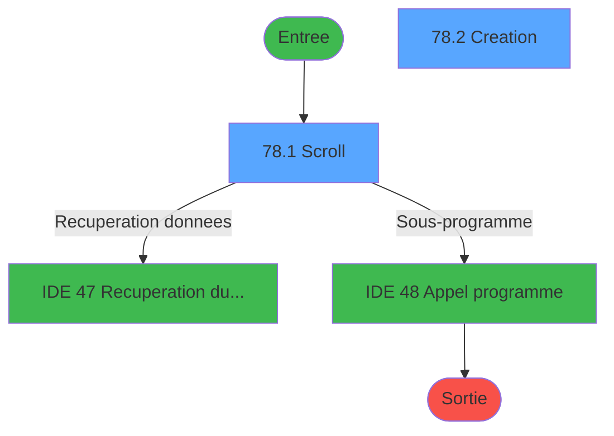
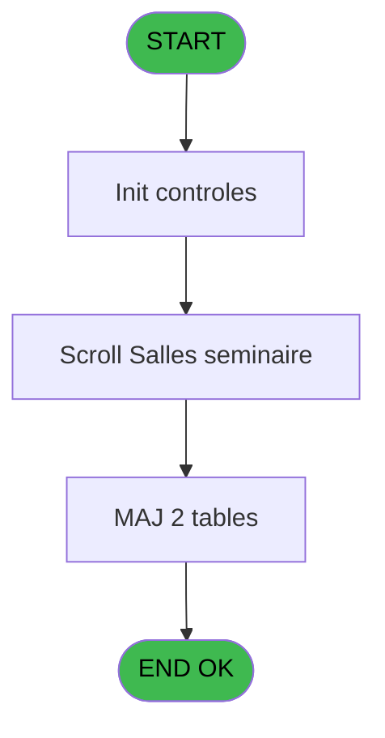
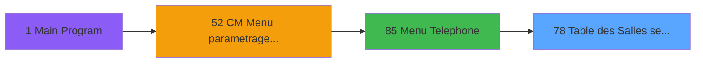
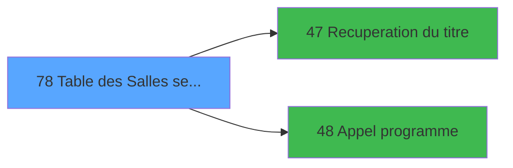

# MAI IDE 78 - Table des Salles semimaire

> **Analyse**: Phases 1-4 2026-02-03 15:02 -> 15:02 (9s) | Assemblage 15:02
> **Pipeline**: V7.2 Enrichi
> **Structure**: 4 onglets (Resume | Ecrans | Donnees | Connexions)

<!-- TAB:Resume -->

## 1. FICHE D'IDENTITE

| Attribut | Valeur |
|----------|--------|
| Projet | MAI |
| IDE Position | 78 |
| Nom Programme | Table des Salles semimaire |
| Fichier source | `Prg_78.xml` |
| Dossier IDE | Telephone |
| Taches | 8 (2 ecrans visibles) |
| Tables modifiees | 2 |
| Programmes appeles | 2 |

## 2. DESCRIPTION FONCTIONNELLE

**Table des Salles semimaire** assure la gestion complete de ce processus, accessible depuis [Menu Telephone (IDE 85)](MAI-IDE-85.md).

Le flux de traitement s'organise en **2 blocs fonctionnels** :

- **Creation** (5 taches) : insertion d'enregistrements en base (mouvements, prestations)
- **Traitement** (3 taches) : traitements metier divers

**Donnees modifiees** : 2 tables en ecriture (nb_code__poste, salle_seminaire__sse).

Detail : phases du traitement

#### Phase 1 : Traitement (3 taches)

- **78** - CM  Table gratuites **[[ECRAN]](#ecran-t1)**
- **78.1** - Scroll **[[ECRAN]](#ecran-t2)**
- **78.3** - Confirmation suppression **[[ECRAN]](#ecran-t6)**

Delegue a : [Recuperation du titre (IDE 47)](MAI-IDE-47.md), [Appel programme (IDE 48)](MAI-IDE-48.md)

#### Phase 2 : Creation (5 taches)

- **78.2** - Creation **[[ECRAN]](#ecran-t3)**
- **78.2.1** - Creation gratuite
- **78.2.2** - Creation FIC
- **78.3.1** - Creation gratuite
- **78.3.2** - Creation gratuite

#### Tables impactees

| Table | Operations | Role metier |
|-------|-----------|-------------|
| salle_seminaire__sse | R/**W** (4 usages) |  |
| nb_code__poste | **W** (2 usages) |  |

## 3. BLOCS FONCTIONNELS

### 3.1 Traitement (3 taches)

Traitements internes.

---

#### 78 - CM  Table gratuites [[ECRAN]](#ecran-t1)

**Role** : Traitement : CM  Table gratuites.
**Ecran** : 640 x 184 DLU (MDI) | [Voir mockup](#ecran-t1)
**Delegue a** : [Recuperation du titre (IDE 47)](MAI-IDE-47.md), [Appel programme (IDE 48)](MAI-IDE-48.md)

---

#### 78.1 - Scroll [[ECRAN]](#ecran-t2)

**Role** : Traitement : Scroll.
**Ecran** : 754 x 252 DLU (MDI) | [Voir mockup](#ecran-t2)
**Variables liees** : C (W0 scroll vide)
**Delegue a** : [Recuperation du titre (IDE 47)](MAI-IDE-47.md), [Appel programme (IDE 48)](MAI-IDE-48.md)

---

#### 78.3 - Confirmation suppression [[ECRAN]](#ecran-t6)

**Role** : Traitement : Confirmation suppression.
**Ecran** : 192 x 32 DLU (MDI) | [Voir mockup](#ecran-t6)
**Delegue a** : [Recuperation du titre (IDE 47)](MAI-IDE-47.md), [Appel programme (IDE 48)](MAI-IDE-48.md)

### 3.2 Creation (5 taches)

Insertion de nouveaux enregistrements en base.

---

#### 78.2 - Creation [[ECRAN]](#ecran-t3)

**Role** : Creation d'enregistrement : Creation.
**Ecran** : 456 x 82 DLU (MDI) | [Voir mockup](#ecran-t3)

---

#### 78.2.1 - Creation gratuite

**Role** : Creation d'enregistrement : Creation gratuite.

---

#### 78.2.2 - Creation FIC

**Role** : Creation d'enregistrement : Creation FIC.

---

#### 78.3.1 - Creation gratuite

**Role** : Creation d'enregistrement : Creation gratuite.

---

#### 78.3.2 - Creation gratuite

**Role** : Creation d'enregistrement : Creation gratuite.

## 5. REGLES METIER

*(Aucune regle metier identifiee)*

## 6. CONTEXTE

- **Appele par**: [Menu Telephone (IDE 85)](MAI-IDE-85.md)
- **Appelle**: 2 programmes | **Tables**: 3 (W:2 R:1 L:1) | **Taches**: 8 | **Expressions**: 5

<!-- TAB:Ecrans -->

## 8. ECRANS

### 8.1 Forms visibles (2 / 8)

| # | Position | Tache | Nom | Type | Largeur | Hauteur | Bloc |
|---|----------|-------|-----|------|---------|---------|------|
| 1 | 78.1 | 78.1 | Scroll | MDI | 754 | 252 | Traitement |
| 2 | 78.2 | 78.2 | Creation | MDI | 456 | 82 | Creation |

### 8.2 Mockups Ecrans

---

#### 78.1 - Scroll
**Tache** : [78.1](#t2) | **Type** : MDI | **Dimensions** : 754 x 252 DLU
**Bloc** : Traitement | **Titre IDE** : Scroll

<!-- FORM-DATA:
{
    "width":  754,
    "vFactor":  8,
    "type":  "MDI",
    "hFactor":  8,
    "controls":  [
                     {
                         "x":  0,
                         "type":  "label",
                         "var":  "",
                         "y":  2,
                         "w":  754,
                         "fmt":  "",
                         "name":  "",
                         "h":  19,
                         "color":  "",
                         "text":  "",
                         "parent":  null
                     },
                     {
                         "x":  50,
                         "type":  "label",
                         "var":  "",
                         "y":  29,
                         "w":  653,
                         "fmt":  "",
                         "name":  "",
                         "h":  188,
                         "color":  "",
                         "text":  "",
                         "parent":  null
                     },
                     {
                         "x":  179,
                         "type":  "table",
                         "var":  "",
                         "name":  "",
                         "titleH":  12,
                         "color":  "110",
                         "w":  395,
                         "y":  37,
                         "fmt":  "",
                         "parent":  null,
                         "text":  "",
                         "rowH":  14,
                         "h":  104,
                         "cols":  [
                                      {
                                          "title":  "Salle",
                                          "layer":  1,
                                          "w":  257
                                      },
                                      {
                                          "title":  "Poste",
                                          "layer":  2,
                                          "w":  103
                                      }
                                  ],
                         "rows":  2
                     },
                     {
                         "x":  358,
                         "type":  "label",
                         "var":  "",
                         "y":  144,
                         "w":  263,
                         "fmt":  "",
                         "name":  "",
                         "h":  63,
                         "color":  "",
                         "text":  "",
                         "parent":  4
                     },
                     {
                         "x":  386,
                         "type":  "label",
                         "var":  "",
                         "y":  154,
                         "w":  202,
                         "fmt":  "",
                         "name":  "",
                         "h":  31,
                         "color":  "",
                         "text":  "",
                         "parent":  10
                     },
                     {
                         "x":  388,
                         "type":  "label",
                         "var":  "",
                         "y":  155,
                         "w":  45,
                         "fmt":  "",
                         "name":  "",
                         "h":  29,
                         "color":  "",
                         "text":  "",
                         "parent":  10
                     },
                     {
                         "x":  447,
                         "type":  "label",
                         "var":  "",
                         "y":  159,
                         "w":  131,
                         "fmt":  "",
                         "name":  "",
                         "h":  9,
                         "color":  "7",
                         "text":  "Création",
                         "parent":  10
                     },
                     {
                         "x":  447,
                         "type":  "label",
                         "var":  "",
                         "y":  172,
                         "w":  131,
                         "fmt":  "",
                         "name":  "",
                         "h":  8,
                         "color":  "7",
                         "text":  "Suppression",
                         "parent":  10
                     },
                     {
                         "x":  408,
                         "type":  "label",
                         "var":  "",
                         "y":  192,
                         "w":  114,
                         "fmt":  "",
                         "name":  "",
                         "h":  10,
                         "color":  "",
                         "text":  "Votre choix",
                         "parent":  10
                     },
                     {
                         "x":  0,
                         "type":  "label",
                         "var":  "",
                         "y":  228,
                         "w":  752,
                         "fmt":  "",
                         "name":  "",
                         "h":  24,
                         "color":  "",
                         "text":  "",
                         "parent":  null
                     },
                     {
                         "x":  186,
                         "type":  "edit",
                         "var":  "",
                         "y":  52,
                         "w":  232,
                         "fmt":  "",
                         "name":  "",
                         "h":  8,
                         "color":  "110",
                         "text":  "",
                         "parent":  5
                     },
                     {
                         "x":  442,
                         "type":  "edit",
                         "var":  "",
                         "y":  52,
                         "w":  91,
                         "fmt":  "",
                         "name":  "",
                         "h":  8,
                         "color":  "110",
                         "text":  "",
                         "parent":  5
                     },
                     {
                         "x":  527,
                         "type":  "edit",
                         "var":  "",
                         "y":  192,
                         "w":  26,
                         "fmt":  "",
                         "name":  "W1 choix action",
                         "h":  10,
                         "color":  "6",
                         "text":  "",
                         "parent":  10
                     },
                     {
                         "x":  6,
                         "type":  "edit",
                         "var":  "",
                         "y":  6,
                         "w":  267,
                         "fmt":  "20",
                         "name":  "",
                         "h":  8,
                         "color":  "",
                         "text":  "",
                         "parent":  null
                     },
                     {
                         "x":  543,
                         "type":  "edit",
                         "var":  "",
                         "y":  6,
                         "w":  203,
                         "fmt":  "WWW DD MMM YYYYT",
                         "name":  "",
                         "h":  8,
                         "color":  "",
                         "text":  "",
                         "parent":  null
                     },
                     {
                         "x":  136,
                         "type":  "image",
                         "var":  "",
                         "y":  150,
                         "w":  154,
                         "fmt":  "",
                         "name":  "",
                         "h":  59,
                         "color":  "",
                         "text":  "",
                         "parent":  null
                     },
                     {
                         "x":  397,
                         "type":  "button",
                         "var":  "",
                         "y":  159,
                         "w":  26,
                         "fmt":  "C",
                         "name":  "C",
                         "h":  9,
                         "color":  "",
                         "text":  "",
                         "parent":  null
                     },
                     {
                         "x":  397,
                         "type":  "button",
                         "var":  "",
                         "y":  171,
                         "w":  26,
                         "fmt":  "S",
                         "name":  "S",
                         "h":  9,
                         "color":  "",
                         "text":  "",
                         "parent":  null
                     },
                     {
                         "x":  6,
                         "type":  "button",
                         "var":  "",
                         "y":  232,
                         "w":  154,
                         "fmt":  "\u0026Quitter",
                         "name":  "Bt Quitter",
                         "h":  18,
                         "color":  "",
                         "text":  "",
                         "parent":  null
                     }
                 ],
    "taskId":  "78.1",
    "height":  252
}
-->

<strong>Champs : 5 champs</strong>

| Pos (x,y) | Nom | Variable | Type |
|-----------|-----|----------|------|
| 186,52 | (sans nom) | - | edit |
| 442,52 | (sans nom) | - | edit |
| 527,192 | W1 choix action | - | edit |
| 6,6 | 20 | - | edit |
| 543,6 | WWW DD MMM YYYYT | - | edit |

<strong>Boutons : 3 boutons</strong>

| Bouton | Pos (x,y) | Action |
|--------|-----------|--------|
| C | 397,159 | Bouton fonctionnel |
| S | 397,171 | Bouton fonctionnel |
| Quitter | 6,232 | Quitte le programme |

---

#### 78.2 - Creation
**Tache** : [78.2](#t3) | **Type** : MDI | **Dimensions** : 456 x 82 DLU
**Bloc** : Creation | **Titre IDE** : Creation

<!-- FORM-DATA:
{
    "width":  456,
    "vFactor":  8,
    "type":  "MDI",
    "hFactor":  8,
    "controls":  [
                     {
                         "x":  8,
                         "type":  "label",
                         "var":  "",
                         "y":  2,
                         "w":  441,
                         "fmt":  "",
                         "name":  "",
                         "h":  54,
                         "color":  "151",
                         "text":  "Seminaire",
                         "parent":  null
                     },
                     {
                         "x":  72,
                         "type":  "label",
                         "var":  "",
                         "y":  17,
                         "w":  45,
                         "fmt":  "",
                         "name":  "",
                         "h":  10,
                         "color":  "",
                         "text":  "Salle",
                         "parent":  1
                     },
                     {
                         "x":  72,
                         "type":  "label",
                         "var":  "",
                         "y":  39,
                         "w":  51,
                         "fmt":  "",
                         "name":  "",
                         "h":  10,
                         "color":  "",
                         "text":  "Poste",
                         "parent":  1
                     },
                     {
                         "x":  0,
                         "type":  "label",
                         "var":  "",
                         "y":  60,
                         "w":  456,
                         "fmt":  "",
                         "name":  "",
                         "h":  22,
                         "color":  "",
                         "text":  "",
                         "parent":  null
                     },
                     {
                         "x":  147,
                         "type":  "edit",
                         "var":  "",
                         "y":  17,
                         "w":  238,
                         "fmt":  "",
                         "name":  "W1 nom salle",
                         "h":  10,
                         "color":  "6",
                         "text":  "",
                         "parent":  1
                     },
                     {
                         "x":  147,
                         "type":  "edit",
                         "var":  "",
                         "y":  39,
                         "w":  82,
                         "fmt":  "",
                         "name":  "W1 poste",
                         "h":  10,
                         "color":  "6",
                         "text":  "",
                         "parent":  1
                     },
                     {
                         "x":  8,
                         "type":  "button",
                         "var":  "",
                         "y":  63,
                         "w":  154,
                         "fmt":  "\u0026Ok",
                         "name":  "Bouton Ok",
                         "h":  17,
                         "color":  "",
                         "text":  "",
                         "parent":  null
                     },
                     {
                         "x":  168,
                         "type":  "button",
                         "var":  "",
                         "y":  63,
                         "w":  154,
                         "fmt":  "A\u0026bandonner",
                         "name":  "",
                         "h":  17,
                         "color":  "",
                         "text":  "",
                         "parent":  null
                     }
                 ],
    "taskId":  "78.2",
    "height":  82
}
-->

<strong>Champs : 2 champs</strong>

| Pos (x,y) | Nom | Variable | Type |
|-----------|-----|----------|------|
| 147,17 | W1 nom salle | - | edit |
| 147,39 | W1 poste | - | edit |

<strong>Boutons : 2 boutons</strong>

| Bouton | Pos (x,y) | Action |
|--------|-----------|--------|
| Ok | 8,63 | Valide la saisie et enregistre |
| Abandonner | 168,63 | Annule et retour au menu |

## 9. NAVIGATION

### 9.1 Enchainement des ecrans

**Detail par enchainement :**

| Depuis | Action | Vers | Retour |
|--------|--------|------|--------|
| Scroll | Recuperation donnees | [Recuperation du titre (IDE 47)](MAI-IDE-47.md) | Retour ecran |
| Scroll | Sous-programme | [Appel programme (IDE 48)](MAI-IDE-48.md) | Retour ecran |

### 9.3 Structure hierarchique (8 taches)

| Position | Tache | Type | Dimensions | Bloc |
|----------|-------|------|------------|------|
| **78.1** | [**CM  Table gratuites** (78)](#t1) [mockup](#ecran-t1) | MDI | 640x184 | Traitement |
| 78.1.1 | [Scroll (78.1)](#t2) [mockup](#ecran-t2) | MDI | 754x252 | |
| 78.1.2 | [Confirmation suppression (78.3)](#t6) [mockup](#ecran-t6) | MDI | 192x32 | |
| **78.2** | [**Creation** (78.2)](#t3) [mockup](#ecran-t3) | MDI | 456x82 | Creation |
| 78.2.1 | [Creation gratuite (78.2.1)](#t4) | MDI | - | |
| 78.2.2 | [Creation FIC (78.2.2)](#t5) | MDI | - | |
| 78.2.3 | [Creation gratuite (78.3.1)](#t7) | MDI | - | |
| 78.2.4 | [Creation gratuite (78.3.2)](#t8) | MDI | - | |

### 9.4 Algorigramme

> **Legende**: Vert = START/END OK | Rouge = END KO | Bleu = Decisions
> *Algorigramme auto-genere. Utiliser `/algorigramme` pour une synthese metier detaillee.*

<!-- TAB:Donnees -->

## 10. TABLES

### Tables utilisees (3)

| ID | Nom | Description | Type | R | W | L | Usages |
|----|-----|-------------|------|---|---|---|--------|
| 80 | codes_autocom____aut |  | DB |   |   | L | 1 |
| 151 | nb_code__poste |  | DB |   | **W** |   | 2 |
| 169 | salle_seminaire__sse |  | DB | R | **W** |   | 4 |

### Colonnes par table (2 / 2 tables avec colonnes identifiees)

Table 151 - nb_code__poste (**W**) - 2 usages

| Lettre | Variable | Acces | Type |
|--------|----------|-------|------|
| A | W1 ret.lien code aut | W | Numeric |
| B | W1 poste | W | Alpha |
| E | W0 poste | W | Alpha |

Table 169 - salle_seminaire__sse (R/**W**) - 4 usages

| Lettre | Variable | Acces | Type |
|--------|----------|-------|------|
| A | W1 ret.lien code aut | W | Numeric |
| B | W1 choix action | W | Alpha |
| C | v. titre ecran | W | Alpha |
| D | W1 ret lien salle | W | Numeric |
| E | W1 ret lien poste | W | Numeric |
| F | v. titre ecran | W | Alpha |
| G | Bouton Ok | W | Alpha |

## 11. VARIABLES

### 11.1 Parametres entrants (1)

Variables recues du programme appelant ([Menu Telephone (IDE 85)](MAI-IDE-85.md)).

| Lettre | Nom | Type | Usage dans |
|--------|-----|------|-----------|
| A | P0 societe | Alpha | - |

### 11.2 Variables de session (1)

Variables persistantes pendant toute la session.

| Lettre | Nom | Type | Usage dans |
|--------|-----|------|-----------|
| F | v. titre ecran | Alpha | - |

### 11.3 Variables de travail (4)

Variables internes au programme.

| Lettre | Nom | Type | Usage dans |
|--------|-----|------|-----------|
| B | W0 choix action | Alpha | 3x calcul interne |
| C | W0 scroll vide | Alpha | - |
| D | W0 salle | Alpha | - |
| E | W0 poste | Alpha | - |

### 11.4 Autres (1)

Variables diverses.

| Lettre | Nom | Type | Usage dans |
|--------|-----|------|-----------|
| G | Bouton Ok | Alpha | - |

## 12. EXPRESSIONS

**5 / 5 expressions decodees (100%)**

### 12.1 Repartition par type

| Type | Expressions | Regles |
|------|-------------|--------|
| CONDITION | 3 | 0 |
| CAST_LOGIQUE | 2 | 0 |

### 12.2 Expressions cles par type

#### CONDITION (3 expressions)

| Type | IDE | Expression | Regle |
|------|-----|------------|-------|
| CONDITION | 3 | `W0 choix action [B]='F'` | - |
| CONDITION | 2 | `W0 choix action [B]='S'` | - |
| CONDITION | 1 | `W0 choix action [B]='C'` | - |

#### CAST_LOGIQUE (2 expressions)

| Type | IDE | Expression | Regle |
|------|-----|------------|-------|
| CAST_LOGIQUE | 5 | `INIPut ('[MAGIC_ENV]AllowCreateInModify=Y','FALSE'LOG)` | - |
| CAST_LOGIQUE | 4 | `INIPut ('[MAGIC_ENV]AllowCreateInModify=N','FALSE'LOG)` | - |

<!-- TAB:Connexions -->

## 13. GRAPHE D'APPELS

### 13.1 Chaine depuis Main (Callers)

Main -> ... -> [Menu Telephone (IDE 85)](MAI-IDE-85.md) -> **Table des Salles semimaire (IDE 78)**

### 13.2 Callers

| IDE | Nom Programme | Nb Appels |
|-----|---------------|-----------|
| [85](MAI-IDE-85.md) | Menu Telephone | 1 |

### 13.3 Callees (programmes appeles)

### 13.4 Detail Callees avec contexte

| IDE | Nom Programme | Appels | Contexte |
|-----|---------------|--------|----------|
| [47](MAI-IDE-47.md) | Recuperation du titre | 2 | Recuperation donnees |
| [48](MAI-IDE-48.md) | Appel programme | 1 | Sous-programme |

## 14. RECOMMANDATIONS MIGRATION

### 14.1 Profil du programme

| Metrique | Valeur | Impact migration |
|----------|--------|-----------------|
| Lignes de logique | 97 | Programme compact |
| Expressions | 5 | Peu de logique |
| Tables WRITE | 2 | Impact faible |
| Sous-programmes | 2 | Peu de dependances |
| Ecrans visibles | 2 | Quelques ecrans |
| Code desactive | 0% (0 / 97) | Code sain |
| Regles metier | 0 | Pas de regle identifiee |

### 14.2 Plan de migration par bloc

#### Traitement (3 taches: 3 ecrans, 0 traitement)

- **Strategie** : 3 composant(s) UI (Razor/React) avec formulaires et validation.
- 2 sous-programme(s) a migrer ou a reutiliser depuis les services existants.
- Decomposer les taches en services unitaires testables.

#### Creation (5 taches: 1 ecran, 4 traitements)

- **Strategie** : Repository pattern avec Entity Framework Core.
- Insertion via `IRepository<T>.CreateAsync()`

### 14.3 Dependances critiques

| Dependance | Type | Appels | Impact |
|------------|------|--------|--------|
| nb_code__poste | Table WRITE (Database) | 2x | Schema + repository |
| salle_seminaire__sse | Table WRITE (Database) | 3x | Schema + repository |
| [Recuperation du titre (IDE 47)](MAI-IDE-47.md) | Sous-programme | 2x | Haute - Recuperation donnees |
| [Appel programme (IDE 48)](MAI-IDE-48.md) | Sous-programme | 1x | Normale - Sous-programme |

---
*Spec DETAILED generee par Pipeline V7.2 - 2026-02-03 15:02*
