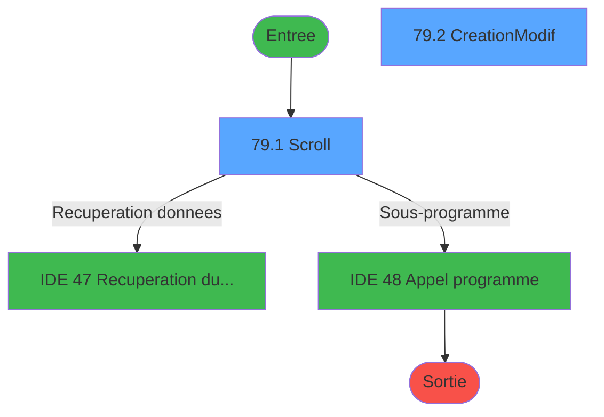
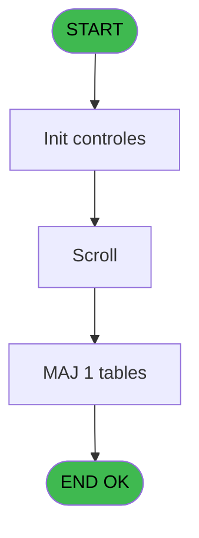
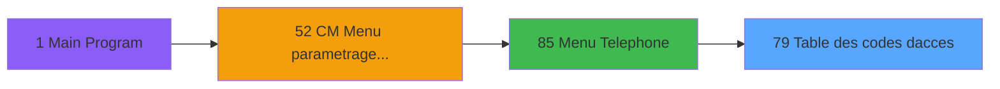
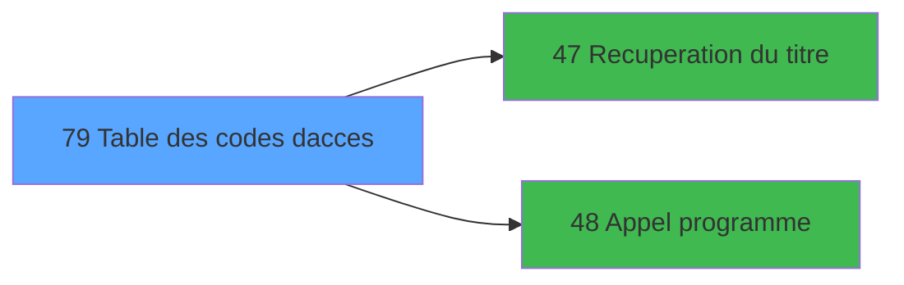

# MAI IDE 79 - Table des codes d'acces

> **Analyse**: Phases 1-4 2026-02-03 15:02 -> 15:03 (9s) | Assemblage 15:03
> **Pipeline**: V7.2 Enrichi
> **Structure**: 4 onglets (Resume | Ecrans | Donnees | Connexions)

<!-- TAB:Resume -->

## 1. FICHE D'IDENTITE

| Attribut | Valeur |
|----------|--------|
| Projet | MAI |
| IDE Position | 79 |
| Nom Programme | Table des codes d'acces |
| Fichier source | `Prg_79.xml` |
| Dossier IDE | Telephone |
| Taches | 5 (2 ecrans visibles) |
| Tables modifiees | 1 |
| Programmes appeles | 2 |

## 2. DESCRIPTION FONCTIONNELLE

**Table des codes d'acces** assure la gestion complete de ce processus, accessible depuis [Menu Telephone (IDE 85)](MAI-IDE-85.md).

Le flux de traitement s'organise en **2 blocs fonctionnels** :

- **Traitement** (3 taches) : traitements metier divers
- **Creation** (2 taches) : insertion d'enregistrements en base (mouvements, prestations)

**Donnees modifiees** : 1 tables en ecriture (table_code_acces_tca).

Detail : phases du traitement

#### Phase 1 : Traitement (3 taches)

- **79** - AC  Table des types d'ID **[[ECRAN]](#ecran-t1)**
- **79.1** - Scroll **[[ECRAN]](#ecran-t2)**
- **79.1.1** - Confirmation suppression **[[ECRAN]](#ecran-t3)**

Delegue a : [Recuperation du titre (IDE 47)](MAI-IDE-47.md), [Appel programme (IDE 48)](MAI-IDE-48.md)

#### Phase 2 : Creation (2 taches)

- **79.2** - Creation/Modif **[[ECRAN]](#ecran-t4)**
- **79.2.1** - Creation

#### Tables impactees

| Table | Operations | Role metier |
|-------|-----------|-------------|
| table_code_acces_tca | **W** (3 usages) |  |

## 3. BLOCS FONCTIONNELS

### 3.1 Traitement (3 taches)

Traitements internes.

---

#### 79 - AC  Table des types d'ID [[ECRAN]](#ecran-t1)

**Role** : Traitement : AC  Table des types d'ID.
**Ecran** : 640 x 18 DLU (MDI) | [Voir mockup](#ecran-t1)
**Delegue a** : [Recuperation du titre (IDE 47)](MAI-IDE-47.md), [Appel programme (IDE 48)](MAI-IDE-48.md)

---

#### 79.1 - Scroll [[ECRAN]](#ecran-t2)

**Role** : Traitement : Scroll.
**Ecran** : 758 x 266 DLU (MDI) | [Voir mockup](#ecran-t2)
**Delegue a** : [Recuperation du titre (IDE 47)](MAI-IDE-47.md), [Appel programme (IDE 48)](MAI-IDE-48.md)

---

#### 79.1.1 - Confirmation suppression [[ECRAN]](#ecran-t3)

**Role** : Traitement : Confirmation suppression.
**Ecran** : 240 x 24 DLU (MDI) | [Voir mockup](#ecran-t3)
**Delegue a** : [Recuperation du titre (IDE 47)](MAI-IDE-47.md), [Appel programme (IDE 48)](MAI-IDE-48.md)

### 3.2 Creation (2 taches)

Insertion de nouveaux enregistrements en base.

---

#### 79.2 - Creation/Modif [[ECRAN]](#ecran-t4)

**Role** : Creation d'enregistrement : Creation/Modif.
**Ecran** : 464 x 92 DLU (MDI) | [Voir mockup](#ecran-t4)

---

#### 79.2.1 - Creation

**Role** : Creation d'enregistrement : Creation.

## 5. REGLES METIER

*(Aucune regle metier identifiee)*

## 6. CONTEXTE

- **Appele par**: [Menu Telephone (IDE 85)](MAI-IDE-85.md)
- **Appelle**: 2 programmes | **Tables**: 2 (W:1 R:1 L:0) | **Taches**: 5 | **Expressions**: 6

<!-- TAB:Ecrans -->

## 8. ECRANS

### 8.1 Forms visibles (2 / 5)

| # | Position | Tache | Nom | Type | Largeur | Hauteur | Bloc |
|---|----------|-------|-----|------|---------|---------|------|
| 1 | 79.1 | 79.1 | Scroll | MDI | 758 | 266 | Traitement |
| 2 | 79.2 | 79.2 | Creation/Modif | MDI | 464 | 92 | Creation |

### 8.2 Mockups Ecrans

---

#### 79.1 - Scroll
**Tache** : [79.1](#t2) | **Type** : MDI | **Dimensions** : 758 x 266 DLU
**Bloc** : Traitement | **Titre IDE** : Scroll

<!-- FORM-DATA:
{
    "width":  758,
    "vFactor":  8,
    "type":  "MDI",
    "hFactor":  8,
    "controls":  [
                     {
                         "x":  0,
                         "type":  "label",
                         "var":  "",
                         "y":  2,
                         "w":  754,
                         "fmt":  "",
                         "name":  "",
                         "h":  19,
                         "color":  "",
                         "text":  "",
                         "parent":  null
                     },
                     {
                         "x":  56,
                         "type":  "label",
                         "var":  "",
                         "y":  31,
                         "w":  655,
                         "fmt":  "",
                         "name":  "",
                         "h":  194,
                         "color":  "",
                         "text":  "",
                         "parent":  null
                     },
                     {
                         "x":  70,
                         "type":  "table",
                         "var":  "",
                         "name":  "",
                         "titleH":  12,
                         "color":  "110",
                         "w":  626,
                         "y":  38,
                         "fmt":  "",
                         "parent":  null,
                         "text":  "",
                         "rowH":  15,
                         "h":  89,
                         "cols":  [
                                      {
                                          "title":  "Mode",
                                          "layer":  1,
                                          "w":  97
                                      },
                                      {
                                          "title":  "Libellé",
                                          "layer":  2,
                                          "w":  259
                                      },
                                      {
                                          "title":  "Code d\u0027accès",
                                          "layer":  3,
                                          "w":  150
                                      },
                                      {
                                          "title":  "Cabine",
                                          "layer":  4,
                                          "w":  85
                                      }
                                  ],
                         "rows":  4
                     },
                     {
                         "x":  126,
                         "type":  "label",
                         "var":  "",
                         "y":  138,
                         "w":  503,
                         "fmt":  "",
                         "name":  "",
                         "h":  78,
                         "color":  "",
                         "text":  "",
                         "parent":  null
                     },
                     {
                         "x":  366,
                         "type":  "label",
                         "var":  "",
                         "y":  151,
                         "w":  202,
                         "fmt":  "",
                         "name":  "",
                         "h":  45,
                         "color":  "",
                         "text":  "",
                         "parent":  13
                     },
                     {
                         "x":  368,
                         "type":  "label",
                         "var":  "",
                         "y":  152,
                         "w":  45,
                         "fmt":  "",
                         "name":  "",
                         "h":  43,
                         "color":  "",
                         "text":  "",
                         "parent":  13
                     },
                     {
                         "x":  427,
                         "type":  "label",
                         "var":  "",
                         "y":  156,
                         "w":  99,
                         "fmt":  "",
                         "name":  "",
                         "h":  9,
                         "color":  "7",
                         "text":  "Creation",
                         "parent":  13
                     },
                     {
                         "x":  427,
                         "type":  "label",
                         "var":  "",
                         "y":  170,
                         "w":  131,
                         "fmt":  "",
                         "name":  "",
                         "h":  8,
                         "color":  "7",
                         "text":  "Modification",
                         "parent":  13
                     },
                     {
                         "x":  427,
                         "type":  "label",
                         "var":  "",
                         "y":  183,
                         "w":  131,
                         "fmt":  "",
                         "name":  "",
                         "h":  8,
                         "color":  "7",
                         "text":  "Suppression",
                         "parent":  13
                     },
                     {
                         "x":  394,
                         "type":  "label",
                         "var":  "",
                         "y":  200,
                         "w":  123,
                         "fmt":  "",
                         "name":  "",
                         "h":  10,
                         "color":  "",
                         "text":  "Votre choix",
                         "parent":  13
                     },
                     {
                         "x":  0,
                         "type":  "label",
                         "var":  "",
                         "y":  239,
                         "w":  752,
                         "fmt":  "",
                         "name":  "",
                         "h":  24,
                         "color":  "",
                         "text":  "",
                         "parent":  null
                     },
                     {
                         "x":  521,
                         "type":  "edit",
                         "var":  "",
                         "y":  200,
                         "w":  26,
                         "fmt":  "",
                         "name":  "W1 choix action",
                         "h":  10,
                         "color":  "6",
                         "text":  "",
                         "parent":  13
                     },
                     {
                         "x":  110,
                         "type":  "edit",
                         "var":  "",
                         "y":  54,
                         "w":  19,
                         "fmt":  "",
                         "name":  "",
                         "h":  9,
                         "color":  "110",
                         "text":  "",
                         "parent":  5
                     },
                     {
                         "x":  177,
                         "type":  "edit",
                         "var":  "",
                         "y":  54,
                         "w":  232,
                         "fmt":  "",
                         "name":  "",
                         "h":  9,
                         "color":  "110",
                         "text":  "",
                         "parent":  5
                     },
                     {
                         "x":  478,
                         "type":  "edit",
                         "var":  "",
                         "y":  54,
                         "w":  30,
                         "fmt":  "",
                         "name":  "TCA code accès",
                         "h":  9,
                         "color":  "110",
                         "text":  "",
                         "parent":  5
                     },
                     {
                         "x":  611,
                         "type":  "checkbox",
                         "var":  "",
                         "y":  53,
                         "w":  26,
                         "fmt":  "",
                         "name":  "W1 Cabine",
                         "h":  12,
                         "color":  "110",
                         "text":  "Check",
                         "parent":  5
                     },
                     {
                         "x":  6,
                         "type":  "edit",
                         "var":  "",
                         "y":  6,
                         "w":  267,
                         "fmt":  "20",
                         "name":  "",
                         "h":  8,
                         "color":  "",
                         "text":  "",
                         "parent":  null
                     },
                     {
                         "x":  513,
                         "type":  "edit",
                         "var":  "",
                         "y":  7,
                         "w":  237,
                         "fmt":  "WWW DD MMM YYYYT",
                         "name":  "",
                         "h":  8,
                         "color":  "",
                         "text":  "",
                         "parent":  null
                     },
                     {
                         "x":  152,
                         "type":  "image",
                         "var":  "",
                         "y":  147,
                         "w":  179,
                         "fmt":  "",
                         "name":  "",
                         "h":  62,
                         "color":  "",
                         "text":  "",
                         "parent":  13
                     },
                     {
                         "x":  377,
                         "type":  "button",
                         "var":  "",
                         "y":  156,
                         "w":  26,
                         "fmt":  "C",
                         "name":  "C",
                         "h":  9,
                         "color":  "",
                         "text":  "",
                         "parent":  null
                     },
                     {
                         "x":  377,
                         "type":  "button",
                         "var":  "",
                         "y":  169,
                         "w":  26,
                         "fmt":  "M",
                         "name":  "M",
                         "h":  9,
                         "color":  "",
                         "text":  "",
                         "parent":  null
                     },
                     {
                         "x":  377,
                         "type":  "button",
                         "var":  "",
                         "y":  182,
                         "w":  26,
                         "fmt":  "S",
                         "name":  "S",
                         "h":  9,
                         "color":  "",
                         "text":  "",
                         "parent":  null
                     },
                     {
                         "x":  6,
                         "type":  "button",
                         "var":  "",
                         "y":  243,
                         "w":  154,
                         "fmt":  "\u0026Quitter",
                         "name":  "",
                         "h":  18,
                         "color":  "",
                         "text":  "",
                         "parent":  null
                     }
                 ],
    "taskId":  "79.1",
    "height":  266
}
-->

<strong>Champs : 7 champs</strong>

| Pos (x,y) | Nom | Variable | Type |
|-----------|-----|----------|------|
| 521,200 | W1 choix action | - | edit |
| 110,54 | (sans nom) | - | edit |
| 177,54 | (sans nom) | - | edit |
| 478,54 | TCA code accès | - | edit |
| 611,53 | W1 Cabine | - | checkbox |
| 6,6 | 20 | - | edit |
| 513,7 | WWW DD MMM YYYYT | - | edit |

<strong>Boutons : 4 boutons</strong>

| Bouton | Pos (x,y) | Action |
|--------|-----------|--------|
| C | 377,156 | Bouton fonctionnel |
| M | 377,169 | Bouton fonctionnel |
| S | 377,182 | Bouton fonctionnel |
| Quitter | 6,243 | Quitte le programme |

---

#### 79.2 - Creation/Modif
**Tache** : [79.2](#t4) | **Type** : MDI | **Dimensions** : 464 x 92 DLU
**Bloc** : Creation | **Titre IDE** : Creation/Modif

<!-- FORM-DATA:
{
    "width":  464,
    "vFactor":  8,
    "type":  "MDI",
    "hFactor":  8,
    "controls":  [
                     {
                         "x":  2,
                         "type":  "label",
                         "var":  "",
                         "y":  4,
                         "w":  457,
                         "fmt":  "",
                         "name":  "",
                         "h":  57,
                         "color":  "195",
                         "text":  "Code d\u0027accès",
                         "parent":  null
                     },
                     {
                         "x":  14,
                         "type":  "label",
                         "var":  "",
                         "y":  23,
                         "w":  51,
                         "fmt":  "",
                         "name":  "",
                         "h":  8,
                         "color":  "",
                         "text":  "Mode",
                         "parent":  1
                     },
                     {
                         "x":  111,
                         "type":  "label",
                         "var":  "",
                         "y":  23,
                         "w":  88,
                         "fmt":  "",
                         "name":  "",
                         "h":  8,
                         "color":  "",
                         "text":  "Libelle",
                         "parent":  1
                     },
                     {
                         "x":  27,
                         "type":  "label",
                         "var":  "",
                         "y":  45,
                         "w":  99,
                         "fmt":  "",
                         "name":  "",
                         "h":  8,
                         "color":  "",
                         "text":  "Code acces",
                         "parent":  1
                     },
                     {
                         "x":  0,
                         "type":  "label",
                         "var":  "",
                         "y":  68,
                         "w":  461,
                         "fmt":  "",
                         "name":  "",
                         "h":  22,
                         "color":  "",
                         "text":  "",
                         "parent":  null
                     },
                     {
                         "x":  71,
                         "type":  "edit",
                         "var":  "",
                         "y":  22,
                         "w":  26,
                         "fmt":  "",
                         "name":  "W1 code action",
                         "h":  10,
                         "color":  "6",
                         "text":  "",
                         "parent":  1
                     },
                     {
                         "x":  204,
                         "type":  "edit",
                         "var":  "",
                         "y":  22,
                         "w":  238,
                         "fmt":  "",
                         "name":  "W1 libelle",
                         "h":  10,
                         "color":  "6",
                         "text":  "",
                         "parent":  1
                     },
                     {
                         "x":  143,
                         "type":  "edit",
                         "var":  "",
                         "y":  44,
                         "w":  37,
                         "fmt":  "",
                         "name":  "W1 acces",
                         "h":  10,
                         "color":  "6",
                         "text":  "",
                         "parent":  1
                     },
                     {
                         "x":  8,
                         "type":  "button",
                         "var":  "",
                         "y":  71,
                         "w":  154,
                         "fmt":  "\u0026Ok",
                         "name":  "Bouton Ok",
                         "h":  17,
                         "color":  "",
                         "text":  "",
                         "parent":  null
                     },
                     {
                         "x":  168,
                         "type":  "button",
                         "var":  "",
                         "y":  71,
                         "w":  154,
                         "fmt":  "\u0026Abandonner",
                         "name":  "",
                         "h":  17,
                         "color":  "",
                         "text":  "",
                         "parent":  null
                     }
                 ],
    "taskId":  "79.2",
    "height":  92
}
-->

<strong>Champs : 3 champs</strong>

| Pos (x,y) | Nom | Variable | Type |
|-----------|-----|----------|------|
| 71,22 | W1 code action | - | edit |
| 204,22 | W1 libelle | - | edit |
| 143,44 | W1 acces | - | edit |

<strong>Boutons : 2 boutons</strong>

| Bouton | Pos (x,y) | Action |
|--------|-----------|--------|
| Ok | 8,71 | Valide la saisie et enregistre |
| Abandonner | 168,71 | Annule et retour au menu |

## 9. NAVIGATION

### 9.1 Enchainement des ecrans

**Detail par enchainement :**

| Depuis | Action | Vers | Retour |
|--------|--------|------|--------|
| Scroll | Recuperation donnees | [Recuperation du titre (IDE 47)](MAI-IDE-47.md) | Retour ecran |
| Scroll | Sous-programme | [Appel programme (IDE 48)](MAI-IDE-48.md) | Retour ecran |

### 9.3 Structure hierarchique (5 taches)

| Position | Tache | Type | Dimensions | Bloc |
|----------|-------|------|------------|------|
| **79.1** | [**AC  Table des types d'ID** (79)](#t1) [mockup](#ecran-t1) | MDI | 640x18 | Traitement |
| 79.1.1 | [Scroll (79.1)](#t2) [mockup](#ecran-t2) | MDI | 758x266 | |
| 79.1.2 | [Confirmation suppression (79.1.1)](#t3) [mockup](#ecran-t3) | MDI | 240x24 | |
| **79.2** | [**Creation/Modif** (79.2)](#t4) [mockup](#ecran-t4) | MDI | 464x92 | Creation |
| 79.2.1 | [Creation (79.2.1)](#t5) | MDI | - | |

### 9.4 Algorigramme

> **Legende**: Vert = START/END OK | Rouge = END KO | Bleu = Decisions
> *Algorigramme auto-genere. Utiliser `/algorigramme` pour une synthese metier detaillee.*

<!-- TAB:Donnees -->

## 10. TABLES

### Tables utilisees (2)

| ID | Nom | Description | Type | R | W | L | Usages |
|----|-----|-------------|------|---|---|---|--------|
| 60 | table_code_acces_tca |  | DB |   | **W** |   | 3 |
| 63 | parametres___par |  | DB | R |   |   | 1 |

### Colonnes par table (1 / 2 tables avec colonnes identifiees)

Table 60 - table_code_acces_tca (**W**) - 3 usages

| Lettre | Variable | Acces | Type |
|--------|----------|-------|------|
| A | v. titre ecran | W | Alpha |
| B | W1 choix action | W | Alpha |
| C | W1 Cabine | W | Logical |
| D | W1 fin tâche | W | Alpha |
| E | W1 ret lien acces | W | Numeric |
| F | W1 code d'acces init | W | Alpha |
| G | Bouton Ok | W | Alpha |

Table 63 - parametres___par (R) - 1 usages

*Table utilisee uniquement en Link ou aucune colonne Real identifiee dans le DataView.*

## 11. VARIABLES

### 11.1 Variables de travail (1)

Variables internes au programme.

| Lettre | Nom | Type | Usage dans |
|--------|-----|------|-----------|
| A | W0 choix action | Alpha | 2x calcul interne |

### 11.2 Autres (6)

Variables diverses.

| Lettre | Nom | Type | Usage dans |
|--------|-----|------|-----------|
| B | W1 choix action | Alpha | - |
| C | W1 Cabine | Logical | - |
| D | W1 fin tâche | Alpha | - |
| E | W1 ret lien acces | Numeric | - |
| F | W1 code d'acces init | Alpha | - |
| G | Bouton Ok | Alpha | - |

## 12. EXPRESSIONS

**6 / 6 expressions decodees (100%)**

### 12.1 Repartition par type

| Type | Expressions | Regles |
|------|-------------|--------|
| CONSTANTE | 2 | 0 |
| CAST_LOGIQUE | 2 | 0 |
| CONDITION | 2 | 0 |

### 12.2 Expressions cles par type

#### CONSTANTE (2 expressions)

| Type | IDE | Expression | Regle |
|------|-----|------------|-------|
| CONSTANTE | 6 | `34` | - |
| CONSTANTE | 5 | `'C'` | - |

#### CAST_LOGIQUE (2 expressions)

| Type | IDE | Expression | Regle |
|------|-----|------------|-------|
| CAST_LOGIQUE | 2 | `INIPut ('[MAGIC_ENV]AllowCreateInModify=N','FALSE'LOG)` | - |
| CAST_LOGIQUE | 1 | `INIPut ('[MAGIC_ENV]AllowCreateInModify=Y','FALSE'LOG)` | - |

#### CONDITION (2 expressions)

| Type | IDE | Expression | Regle |
|------|-----|------------|-------|
| CONDITION | 4 | `W0 choix action [A]='F'` | - |
| CONDITION | 3 | `W0 choix action [A]='C'` | - |

<!-- TAB:Connexions -->

## 13. GRAPHE D'APPELS

### 13.1 Chaine depuis Main (Callers)

Main -> ... -> [Menu Telephone (IDE 85)](MAI-IDE-85.md) -> **Table des codes d'acces (IDE 79)**

### 13.2 Callers

| IDE | Nom Programme | Nb Appels |
|-----|---------------|-----------|
| [85](MAI-IDE-85.md) | Menu Telephone | 1 |

### 13.3 Callees (programmes appeles)

### 13.4 Detail Callees avec contexte

| IDE | Nom Programme | Appels | Contexte |
|-----|---------------|--------|----------|
| [47](MAI-IDE-47.md) | Recuperation du titre | 2 | Recuperation donnees |
| [48](MAI-IDE-48.md) | Appel programme | 1 | Sous-programme |

## 14. RECOMMANDATIONS MIGRATION

### 14.1 Profil du programme

| Metrique | Valeur | Impact migration |
|----------|--------|-----------------|
| Lignes de logique | 90 | Programme compact |
| Expressions | 6 | Peu de logique |
| Tables WRITE | 1 | Impact faible |
| Sous-programmes | 2 | Peu de dependances |
| Ecrans visibles | 2 | Quelques ecrans |
| Code desactive | 0% (0 / 90) | Code sain |
| Regles metier | 0 | Pas de regle identifiee |

### 14.2 Plan de migration par bloc

#### Traitement (3 taches: 3 ecrans, 0 traitement)

- **Strategie** : 3 composant(s) UI (Razor/React) avec formulaires et validation.
- 2 sous-programme(s) a migrer ou a reutiliser depuis les services existants.
- Decomposer les taches en services unitaires testables.

#### Creation (2 taches: 1 ecran, 1 traitement)

- **Strategie** : Repository pattern avec Entity Framework Core.
- Insertion via `IRepository<T>.CreateAsync()`

### 14.3 Dependances critiques

| Dependance | Type | Appels | Impact |
|------------|------|--------|--------|
| table_code_acces_tca | Table WRITE (Database) | 3x | Schema + repository |
| [Recuperation du titre (IDE 47)](MAI-IDE-47.md) | Sous-programme | 2x | Haute - Recuperation donnees |
| [Appel programme (IDE 48)](MAI-IDE-48.md) | Sous-programme | 1x | Normale - Sous-programme |

---
*Spec DETAILED generee par Pipeline V7.2 - 2026-02-03 15:03*
