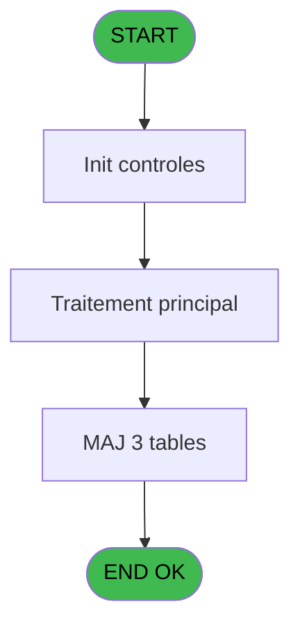

# MAI IDE 81 - Envoi table autocom PABX

> **Analyse**: Phases 1-4 2026-02-03 15:03 -> 15:03 (9s) | Assemblage 15:03
> **Pipeline**: V7.2 Enrichi
> **Structure**: 4 onglets (Resume | Ecrans | Donnees | Connexions)

<!-- TAB:Resume -->

## 1. FICHE D'IDENTITE

| Attribut | Valeur |
|----------|--------|
| Projet | MAI |
| IDE Position | 81 |
| Nom Programme | Envoi table autocom PABX |
| Fichier source | `Prg_81.xml` |
| Dossier IDE | Telephone |
| Taches | 9 (0 ecrans visibles) |
| Tables modifiees | 3 |
| Programmes appeles | 1 |

## 2. DESCRIPTION FONCTIONNELLE

**Envoi table autocom PABX** assure la gestion complete de ce processus, accessible depuis [Menu Telephone (IDE 85)](MAI-IDE-85.md).

Le flux de traitement s'organise en **2 blocs fonctionnels** :

- **Traitement** (6 taches) : traitements metier divers
- **Creation** (3 taches) : insertion d'enregistrements en base (mouvements, prestations)

**Donnees modifiees** : 3 tables en ecriture (commande_autocom_cot, fichier_echanges, nb_code__poste).

Detail : phases du traitement

#### Phase 1 : Traitement (6 taches)

- **81** - CM  Envoi table autocom **[[ECRAN]](#ecran-t1)**
- **81.1** - Boucle code autocom
- **81.1.2** - Table des poste/code
- **81.2** - Boucle code autocom
- **81.2.2** - Tempo 1 sec
- **81.2.3** - Table des poste/code

Delegue a : [Vidage table SQL (IDE 86)](MAI-IDE-86.md)

#### Phase 2 : Creation (3 taches)

- **81.1.1** - Creation commande tel
- **81.2.1** - Creation commande tel
- **81.2.4** - Creation commande tel

#### Tables impactees

| Table | Operations | Role metier |
|-------|-----------|-------------|
| fichier_echanges | **W** (2 usages) |  |
| nb_code__poste | **W** (2 usages) |  |
| commande_autocom_cot | **W** (1 usages) |  |

## 3. BLOCS FONCTIONNELS

### 3.1 Traitement (6 taches)

Traitements internes.

---

#### 81 - CM  Envoi table autocom [[ECRAN]](#ecran-t1)

**Role** : Tache d'orchestration : point d'entree du programme (6 sous-taches). Coordonne l'enchainement des traitements.
**Ecran** : 100 x 24 DLU (MDI) | [Voir mockup](#ecran-t1)

5 sous-taches directes

| Tache | Nom | Bloc |
|-------|-----|------|
| [81.1](#t2) | Boucle code autocom | Traitement |
| [81.1.2](#t4) | Table des poste/code | Traitement |
| [81.2](#t5) | Boucle code autocom | Traitement |
| [81.2.2](#t7) | Tempo 1 sec | Traitement |
| [81.2.3](#t8) | Table des poste/code | Traitement |

**Delegue a** : [Vidage table SQL (IDE 86)](MAI-IDE-86.md)

---

#### 81.1 - Boucle code autocom

**Role** : Traitement : Boucle code autocom.
**Delegue a** : [Vidage table SQL (IDE 86)](MAI-IDE-86.md)

---

#### 81.1.2 - Table des poste/code

**Role** : Traitement : Table des poste/code.
**Delegue a** : [Vidage table SQL (IDE 86)](MAI-IDE-86.md)

---

#### 81.2 - Boucle code autocom

**Role** : Traitement : Boucle code autocom.
**Delegue a** : [Vidage table SQL (IDE 86)](MAI-IDE-86.md)

---

#### 81.2.2 - Tempo 1 sec

**Role** : Traitement : Tempo 1 sec.
**Delegue a** : [Vidage table SQL (IDE 86)](MAI-IDE-86.md)

---

#### 81.2.3 - Table des poste/code

**Role** : Traitement : Table des poste/code.
**Delegue a** : [Vidage table SQL (IDE 86)](MAI-IDE-86.md)

### 3.2 Creation (3 taches)

Insertion de nouveaux enregistrements en base.

---

#### 81.1.1 - Creation commande tel

**Role** : Creation d'enregistrement : Creation commande tel.

---

#### 81.2.1 - Creation commande tel

**Role** : Creation d'enregistrement : Creation commande tel.

---

#### 81.2.4 - Creation commande tel

**Role** : Creation d'enregistrement : Creation commande tel.

## 5. REGLES METIER

*(Aucune regle metier identifiee)*

## 6. CONTEXTE

- **Appele par**: [Menu Telephone (IDE 85)](MAI-IDE-85.md)
- **Appelle**: 1 programmes | **Tables**: 8 (W:3 R:2 L:5) | **Taches**: 9 | **Expressions**: 9

<!-- TAB:Ecrans -->

## 8. ECRANS

*(Programme sans ecran visible)*

## 9. NAVIGATION

### 9.3 Structure hierarchique (9 taches)

| Position | Tache | Type | Dimensions | Bloc |
|----------|-------|------|------------|------|
| **81.1** | [**CM  Envoi table autocom** (81)](#t1) [mockup](#ecran-t1) | MDI | 100x24 | Traitement |
| 81.1.1 | [Boucle code autocom (81.1)](#t2) | MDI | - | |
| 81.1.2 | [Table des poste/code (81.1.2)](#t4) | MDI | - | |
| 81.1.3 | [Boucle code autocom (81.2)](#t5) | MDI | - | |
| 81.1.4 | [Tempo 1 sec (81.2.2)](#t7) | MDI | - | |
| 81.1.5 | [Table des poste/code (81.2.3)](#t8) | MDI | - | |
| **81.2** | [**Creation commande tel** (81.1.1)](#t3) | MDI | - | Creation |
| 81.2.1 | [Creation commande tel (81.2.1)](#t6) | MDI | - | |
| 81.2.2 | [Creation commande tel (81.2.4)](#t11) | MDI | - | |

### 9.4 Algorigramme

> **Legende**: Vert = START/END OK | Rouge = END KO | Bleu = Decisions
> *Algorigramme auto-genere. Utiliser `/algorigramme` pour une synthese metier detaillee.*

<!-- TAB:Donnees -->

## 10. TABLES

### Tables utilisees (8)

| ID | Nom | Description | Type | R | W | L | Usages |
|----|-----|-------------|------|---|---|---|--------|
| 30 | gm-recherche_____gmr | Index de recherche | DB | R |   | L | 2 |
| 75 | commande_autocom_cot |  | DB |   | **W** |   | 1 |
| 80 | codes_autocom____aut |  | DB | R |   | L | 2 |
| 130 | fichier_langue |  | DB |   |   | L | 2 |
| 131 | fichier_validation |  | DB |   |   | L | 2 |
| 136 | fichier_echanges |  | DB |   | **W** |   | 2 |
| 151 | nb_code__poste |  | DB |   | **W** |   | 2 |
| 152 | parametres_pour_pabx |  | DB |   |   | L | 1 |

### Colonnes par table (1 / 5 tables avec colonnes identifiees)

Table 30 - gm-recherche_____gmr (R/L) - 2 usages

*Table utilisee uniquement en Link ou aucune colonne Real identifiee dans le DataView.*

Table 75 - commande_autocom_cot (**W**) - 1 usages

*Table utilisee uniquement en Link ou aucune colonne Real identifiee dans le DataView.*

Table 80 - codes_autocom____aut (R/L) - 2 usages

| Lettre | Variable | Acces | Type |
|--------|----------|-------|------|
| A | W1 triplet | R | Alpha |
| B | W1 vip | R | Alpha |

Table 136 - fichier_echanges (**W**) - 2 usages

*Table utilisee uniquement en Link ou aucune colonne Real identifiee dans le DataView.*

Table 151 - nb_code__poste (**W**) - 2 usages

*Table utilisee uniquement en Link ou aucune colonne Real identifiee dans le DataView.*

## 11. VARIABLES

### 11.1 Parametres entrants (2)

Variables recues du programme appelant ([Menu Telephone (IDE 85)](MAI-IDE-85.md)).

| Lettre | Nom | Type | Usage dans |
|--------|-----|------|-----------|
| A | P0 type triplet | Alpha | - |
| B | P0 interface | Alpha | 2x parametre entrant |

### 11.2 Variables de travail (2)

Variables internes au programme.

| Lettre | Nom | Type | Usage dans |
|--------|-----|------|-----------|
| C | W0 confirmation | Numeric | 1x calcul interne |
| D | W0 nom ASCII | Alpha | - |

## 12. EXPRESSIONS

**9 / 9 expressions decodees (100%)**

### 12.1 Repartition par type

| Type | Expressions | Regles |
|------|-------------|--------|
| CONCATENATION | 2 | 0 |
| OTHER | 2 | 0 |
| CONDITION | 3 | 0 |
| NEGATION | 1 | 0 |
| REFERENCE_VG | 1 | 0 |

### 12.2 Expressions cles par type

#### CONCATENATION (2 expressions)

| Type | IDE | Expression | Regle |
|------|-----|------------|-------|
| CONCATENATION | 5 | `'2'&DStr (Date (),'DD')&ASCIIChr (65+Hour (Time ()))&TStr (Time (),'MMSS')&'.'&GetShortHostname ()` | - |
| CONCATENATION | 4 | `'2'&DStr (Date (),'DD')&ASCIIChr (65+Hour (Time ()))&TStr (Time (),'MMSS')&'.'&Str (VG10,'3P0')` | - |

#### OTHER (2 expressions)

| Type | IDE | Expression | Regle |
|------|-----|------------|-------|
| OTHER | 2 | `SetCrsr (1)` | - |
| OTHER | 1 | `SetCrsr (2)` | - |

#### CONDITION (3 expressions)

| Type | IDE | Expression | Regle |
|------|-----|------------|-------|
| CONDITION | 7 | `P0 interface [B]='CLUB'` | - |
| CONDITION | 6 | `P0 interface [B]<>'CLUB'` | - |
| CONDITION | 3 | `W0 confirmation [C]=6` | - |

#### NEGATION (1 expressions)

| Type | IDE | Expression | Regle |
|------|-----|------------|-------|
| NEGATION | 8 | `NOT VG9` | - |

#### REFERENCE_VG (1 expressions)

| Type | IDE | Expression | Regle |
|------|-----|------------|-------|
| REFERENCE_VG | 9 | `VG9` | - |

<!-- TAB:Connexions -->

## 13. GRAPHE D'APPELS

### 13.1 Chaine depuis Main (Callers)

Main -> ... -> [Menu Telephone (IDE 85)](MAI-IDE-85.md) -> **Envoi table autocom PABX (IDE 81)**

### 13.2 Callers

| IDE | Nom Programme | Nb Appels |
|-----|---------------|-----------|
| [85](MAI-IDE-85.md) | Menu Telephone | 1 |

### 13.3 Callees (programmes appeles)

### 13.4 Detail Callees avec contexte

| IDE | Nom Programme | Appels | Contexte |
|-----|---------------|--------|----------|
| [86](MAI-IDE-86.md) | Vidage table SQL | 1 | Sous-programme |

## 14. RECOMMANDATIONS MIGRATION

### 14.1 Profil du programme

| Metrique | Valeur | Impact migration |
|----------|--------|-----------------|
| Lignes de logique | 186 | Programme compact |
| Expressions | 9 | Peu de logique |
| Tables WRITE | 3 | Impact modere |
| Sous-programmes | 1 | Peu de dependances |
| Ecrans visibles | 0 | Ecran unique ou traitement batch |
| Code desactive | 0% (0 / 186) | Code sain |
| Regles metier | 0 | Pas de regle identifiee |

### 14.2 Plan de migration par bloc

#### Traitement (6 taches: 1 ecran, 5 traitements)

- **Strategie** : Orchestrateur avec 1 ecrans (Razor/React) et 5 traitements backend (services).
- Les ecrans deviennent des composants UI, les traitements invisibles deviennent des services injectables.
- 1 sous-programme(s) a migrer ou a reutiliser depuis les services existants.
- Decomposer les taches en services unitaires testables.

#### Creation (3 taches: 0 ecran, 3 traitements)

- **Strategie** : Repository pattern avec Entity Framework Core.
- Insertion via `IRepository<T>.CreateAsync()`

### 14.3 Dependances critiques

| Dependance | Type | Appels | Impact |
|------------|------|--------|--------|
| commande_autocom_cot | Table WRITE (Database) | 1x | Schema + repository |
| fichier_echanges | Table WRITE (Database) | 2x | Schema + repository |
| nb_code__poste | Table WRITE (Database) | 2x | Schema + repository |
| [Vidage table SQL (IDE 86)](MAI-IDE-86.md) | Sous-programme | 1x | Normale - Sous-programme |

---
*Spec DETAILED generee par Pipeline V7.2 - 2026-02-03 15:03*
