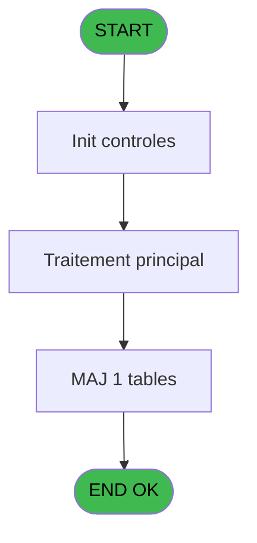
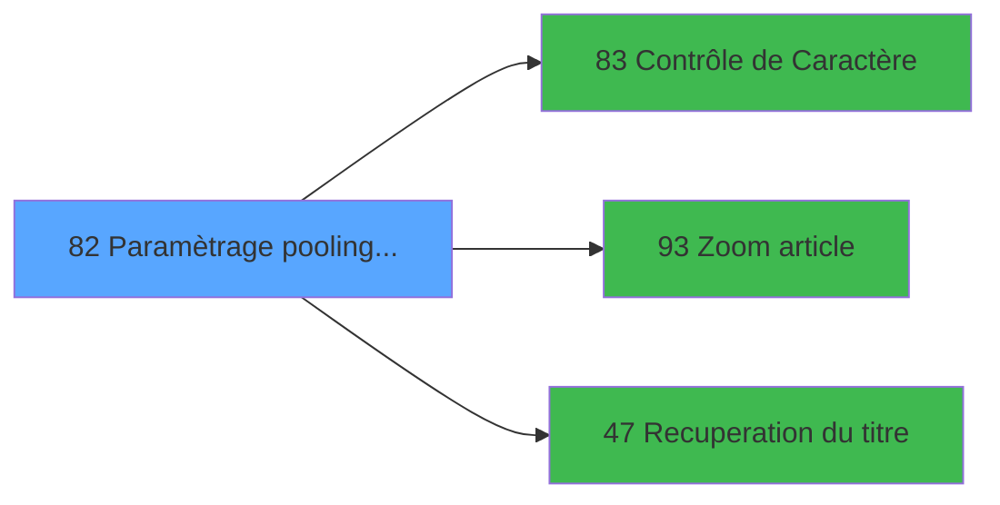

# MAI IDE 82 - Paramètrage pooling Telephone

> **Analyse**: Phases 1-4 2026-02-03 15:03 -> 15:03 (9s) | Assemblage 15:03
> **Pipeline**: V7.2 Enrichi
> **Structure**: 4 onglets (Resume | Ecrans | Donnees | Connexions)

<!-- TAB:Resume -->

## 1. FICHE D'IDENTITE

| Attribut | Valeur |
|----------|--------|
| Projet | MAI |
| IDE Position | 82 |
| Nom Programme | Paramètrage pooling Telephone |
| Fichier source | `Prg_82.xml` |
| Dossier IDE | Telephone |
| Taches | 1 (1 ecrans visibles) |
| Tables modifiees | 1 |
| Programmes appeles | 3 |

## 2. DESCRIPTION FONCTIONNELLE

**Paramètrage pooling Telephone** assure la gestion complete de ce processus, accessible depuis [Menu Telephone (IDE 85)](MAI-IDE-85.md).

Le flux de traitement s'organise en **1 blocs fonctionnels** :

- **Traitement** (1 tache) : traitements metier divers

**Donnees modifiees** : 1 tables en ecriture (parametres_pour_pabx).

**Logique metier** : 4 regles identifiees couvrant conditions metier.

## 3. BLOCS FONCTIONNELS

### 3.1 Traitement (1 tache)

Traitements internes.

---

#### 82 - Parametres [[ECRAN]](#ecran-t1)

**Role** : Traitement : Parametres.
**Ecran** : 1130 x 304 DLU (MDI) | [Voir mockup](#ecran-t1)
**Delegue a** : [Contrôle de Caractère (IDE 83)](MAI-IDE-83.md), [Recuperation du titre (IDE 47)](MAI-IDE-47.md)

## 5. REGLES METIER

4 regles identifiees:

### Autres (4 regles)

#### [RM-001] Si [AN]='G' alors 'P' sinon 'G')

| Element | Detail |
|---------|--------|
| **Condition** | `[AN]='G'` |
| **Si vrai** | 'P' |
| **Si faux** | 'G') |
| **Expression source** | Expression 26 : `IF ([AN]='G','P','G')` |
| **Exemple** | Si [AN]='G' → 'P'. Sinon → 'G') |

#### [RM-002] Si [AQ]='G' alors 'Get' sinon IF ([AQ]='P','Put',''))

| Element | Detail |
|---------|--------|
| **Condition** | `[AQ]='G'` |
| **Si vrai** | 'Get' |
| **Si faux** | IF ([AQ]='P','Put','')) |
| **Expression source** | Expression 61 : `IF ([AQ]='G','Get',IF ([AQ]='P','Put',''))` |
| **Exemple** | Si [AQ]='G' → 'Get'. Sinon → IF ([AQ]='P','Put','')) |

#### [RM-003] Si [BC]='N' alors 'oir' sinon IF ([BC]='C','ouleur',''))

| Element | Detail |
|---------|--------|
| **Condition** | `[BC]='N'` |
| **Si vrai** | 'oir' |
| **Si faux** | IF ([BC]='C','ouleur','')) |
| **Expression source** | Expression 62 : `IF ([BC]='N','oir',IF ([BC]='C','ouleur',''))` |
| **Exemple** | Si [BC]='N' → 'oir'. Sinon → IF ([BC]='C','ouleur','')) |

#### [RM-004] Si [BD]=1 alors 150 sinon IF ([BD]=2,300,IF ([BD]=3,600,IF ([BD]=4,1200,IF ([BD]=5,2400,IF ([BD]=6,4800,IF ([BD]=7,9600,IF ([BD]=8,19200,IF ([BD]=9,38400,0)))))))))

| Element | Detail |
|---------|--------|
| **Condition** | `[BD]=1` |
| **Si vrai** | 150 |
| **Si faux** | IF ([BD]=2,300,IF ([BD]=3,600,IF ([BD]=4,1200,IF ([BD]=5,2400,IF ([BD]=6,4800,IF ([BD]=7,9600,IF ([BD]=8,19200,IF ([BD]=9,38400,0))))))))) |
| **Expression source** | Expression 63 : `IF ([BD]=1,150,IF ([BD]=2,300,IF ([BD]=3,600,IF ([BD]=4,1200` |
| **Exemple** | Si [BD]=1 → 150 |

## 6. CONTEXTE

- **Appele par**: [Menu Telephone (IDE 85)](MAI-IDE-85.md)
- **Appelle**: 3 programmes | **Tables**: 2 (W:1 R:0 L:1) | **Taches**: 1 | **Expressions**: 79

<!-- TAB:Ecrans -->

## 8. ECRANS

### 8.1 Forms visibles (1 / 1)

| # | Position | Tache | Nom | Type | Largeur | Hauteur | Bloc |
|---|----------|-------|-----|------|---------|---------|------|
| 1 | 82 | 82 | Parametres | MDI | 1130 | 304 | Traitement |

### 8.2 Mockups Ecrans

---

#### 82 - Parametres
**Tache** : [82](#t1) | **Type** : MDI | **Dimensions** : 1130 x 304 DLU
**Bloc** : Traitement | **Titre IDE** : Parametres

<!-- FORM-DATA:
{
    "width":  1130,
    "vFactor":  8,
    "type":  "MDI",
    "hFactor":  8,
    "controls":  [
                     {
                         "x":  0,
                         "type":  "label",
                         "var":  "",
                         "y":  0,
                         "w":  1124,
                         "fmt":  "",
                         "name":  "",
                         "h":  19,
                         "color":  "",
                         "text":  "",
                         "parent":  null
                     },
                     {
                         "x":  0,
                         "type":  "label",
                         "var":  "",
                         "y":  21,
                         "w":  531,
                         "fmt":  "",
                         "name":  "",
                         "h":  43,
                         "color":  "195",
                         "text":  "Traitement 1",
                         "parent":  null
                     },
                     {
                         "x":  545,
                         "type":  "label",
                         "var":  "",
                         "y":  21,
                         "w":  580,
                         "fmt":  "",
                         "name":  "",
                         "h":  43,
                         "color":  "195",
                         "text":  "Traitement 2",
                         "parent":  null
                     },
                     {
                         "x":  17,
                         "type":  "label",
                         "var":  "",
                         "y":  34,
                         "w":  50,
                         "fmt":  "",
                         "name":  "",
                         "h":  8,
                         "color":  "",
                         "text":  "Type",
                         "parent":  4
                     },
                     {
                         "x":  195,
                         "type":  "label",
                         "var":  "",
                         "y":  34,
                         "w":  110,
                         "fmt":  "",
                         "name":  "",
                         "h":  8,
                         "color":  "",
                         "text":  "Temporisation",
                         "parent":  4
                     },
                     {
                         "x":  464,
                         "type":  "label",
                         "var":  "",
                         "y":  34,
                         "w":  45,
                         "fmt":  "",
                         "name":  "",
                         "h":  8,
                         "color":  "",
                         "text":  "Faire",
                         "parent":  4
                     },
                     {
                         "x":  585,
                         "type":  "label",
                         "var":  "",
                         "y":  34,
                         "w":  66,
                         "fmt":  "",
                         "name":  "",
                         "h":  8,
                         "color":  "",
                         "text":  "Type",
                         "parent":  5
                     },
                     {
                         "x":  792,
                         "type":  "label",
                         "var":  "",
                         "y":  34,
                         "w":  147,
                         "fmt":  "",
                         "name":  "",
                         "h":  8,
                         "color":  "",
                         "text":  "Temporisation",
                         "parent":  5
                     },
                     {
                         "x":  1067,
                         "type":  "label",
                         "var":  "",
                         "y":  34,
                         "w":  45,
                         "fmt":  "",
                         "name":  "",
                         "h":  8,
                         "color":  "",
                         "text":  "Faire",
                         "parent":  5
                     },
                     {
                         "x":  0,
                         "type":  "label",
                         "var":  "",
                         "y":  67,
                         "w":  942,
                         "fmt":  "",
                         "name":  "",
                         "h":  62,
                         "color":  "195",
                         "text":  "Fichiers",
                         "parent":  null
                     },
                     {
                         "x":  37,
                         "type":  "label",
                         "var":  "",
                         "y":  77,
                         "w":  133,
                         "fmt":  "",
                         "name":  "",
                         "h":  8,
                         "color":  "",
                         "text":  "GETTRS Entree",
                         "parent":  19
                     },
                     {
                         "x":  37,
                         "type":  "label",
                         "var":  "",
                         "y":  86,
                         "w":  112,
                         "fmt":  "",
                         "name":  "",
                         "h":  8,
                         "color":  "",
                         "text":  "GETTRS Log",
                         "parent":  19
                     },
                     {
                         "x":  37,
                         "type":  "label",
                         "var":  "",
                         "y":  96,
                         "w":  146,
                         "fmt":  "",
                         "name":  "",
                         "h":  8,
                         "color":  "",
                         "text":  "PUTTRS Resultat",
                         "parent":  19
                     },
                     {
                         "x":  37,
                         "type":  "label",
                         "var":  "",
                         "y":  106,
                         "w":  154,
                         "fmt":  "",
                         "name":  "",
                         "h":  8,
                         "color":  "",
                         "text":  "PUTTRS Log",
                         "parent":  19
                     },
                     {
                         "x":  37,
                         "type":  "label",
                         "var":  "",
                         "y":  116,
                         "w":  150,
                         "fmt":  "",
                         "name":  "",
                         "h":  8,
                         "color":  "",
                         "text":  "PUTTRS Directory",
                         "parent":  19
                     },
                     {
                         "x":  2,
                         "type":  "label",
                         "var":  "",
                         "y":  137,
                         "w":  1122,
                         "fmt":  "",
                         "name":  "",
                         "h":  136,
                         "color":  "",
                         "text":  "",
                         "parent":  null
                     },
                     {
                         "x":  176,
                         "type":  "label",
                         "var":  "",
                         "y":  141,
                         "w":  890,
                         "fmt":  "",
                         "name":  "",
                         "h":  28,
                         "color":  "195",
                         "text":  "Detruit",
                         "parent":  null
                     },
                     {
                         "x":  13,
                         "type":  "label",
                         "var":  "",
                         "y":  152,
                         "w":  99,
                         "fmt":  "",
                         "name":  "",
                         "h":  10,
                         "color":  "",
                         "text":  "Test/Exploit",
                         "parent":  null
                     },
                     {
                         "x":  257,
                         "type":  "label",
                         "var":  "",
                         "y":  152,
                         "w":  86,
                         "fmt":  "",
                         "name":  "",
                         "h":  10,
                         "color":  "",
                         "text":  "TAMPON",
                         "parent":  32
                     },
                     {
                         "x":  592,
                         "type":  "label",
                         "var":  "",
                         "y":  152,
                         "w":  51,
                         "fmt":  "",
                         "name":  "",
                         "h":  10,
                         "color":  "",
                         "text":  "ASCII",
                         "parent":  32
                     },
                     {
                         "x":  835,
                         "type":  "label",
                         "var":  "",
                         "y":  152,
                         "w":  91,
                         "fmt":  "",
                         "name":  "",
                         "h":  10,
                         "color":  "",
                         "text":  "AFAIRE",
                         "parent":  32
                     },
                     {
                         "x":  11,
                         "type":  "line",
                         "var":  "",
                         "y":  175,
                         "w":  1098,
                         "fmt":  "",
                         "name":  "",
                         "h":  0,
                         "color":  "",
                         "text":  "",
                         "parent":  null
                     },
                     {
                         "x":  13,
                         "type":  "label",
                         "var":  "",
                         "y":  181,
                         "w":  125,
                         "fmt":  "",
                         "name":  "",
                         "h":  10,
                         "color":  "",
                         "text":  "Noir ou Couleur",
                         "parent":  null
                     },
                     {
                         "x":  413,
                         "type":  "label",
                         "var":  "",
                         "y":  182,
                         "w":  189,
                         "fmt":  "",
                         "name":  "",
                         "h":  10,
                         "color":  "",
                         "text":  "Vitesse de Transmission",
                         "parent":  null
                     },
                     {
                         "x":  13,
                         "type":  "label",
                         "var":  "",
                         "y":  196,
                         "w":  54,
                         "fmt":  "",
                         "name":  "",
                         "h":  10,
                         "color":  "",
                         "text":  "Article",
                         "parent":  null
                     },
                     {
                         "x":  413,
                         "type":  "label",
                         "var":  "",
                         "y":  196,
                         "w":  86,
                         "fmt":  "",
                         "name":  "",
                         "h":  10,
                         "color":  "",
                         "text":  "Imputation",
                         "parent":  null
                     },
                     {
                         "x":  13,
                         "type":  "label",
                         "var":  "",
                         "y":  208,
                         "w":  112,
                         "fmt":  "",
                         "name":  "",
                         "h":  8,
                         "color":  "",
                         "text":  "Article Cabine",
                         "parent":  null
                     },
                     {
                         "x":  413,
                         "type":  "label",
                         "var":  "",
                         "y":  208,
                         "w":  86,
                         "fmt":  "",
                         "name":  "",
                         "h":  10,
                         "color":  "",
                         "text":  "Imputation",
                         "parent":  null
                     },
                     {
                         "x":  11,
                         "type":  "line",
                         "var":  "",
                         "y":  221,
                         "w":  1098,
                         "fmt":  "",
                         "name":  "",
                         "h":  0,
                         "color":  "",
                         "text":  "",
                         "parent":  null
                     },
                     {
                         "x":  13,
                         "type":  "label",
                         "var":  "",
                         "y":  225,
                         "w":  101,
                         "fmt":  "",
                         "name":  "",
                         "h":  10,
                         "color":  "",
                         "text":  "Sauvegarde",
                         "parent":  null
                     },
                     {
                         "x":  413,
                         "type":  "label",
                         "var":  "",
                         "y":  225,
                         "w":  170,
                         "fmt":  "",
                         "name":  "",
                         "h":  10,
                         "color":  "",
                         "text":  "Debut Sauvegarde",
                         "parent":  null
                     },
                     {
                         "x":  786,
                         "type":  "label",
                         "var":  "",
                         "y":  225,
                         "w":  128,
                         "fmt":  "",
                         "name":  "",
                         "h":  10,
                         "color":  "",
                         "text":  "Fin Sauvegarde",
                         "parent":  null
                     },
                     {
                         "x":  13,
                         "type":  "label",
                         "var":  "",
                         "y":  245,
                         "w":  104,
                         "fmt":  "",
                         "name":  "",
                         "h":  8,
                         "color":  "",
                         "text":  "Cout Taxe",
                         "parent":  null
                     },
                     {
                         "x":  413,
                         "type":  "label",
                         "var":  "",
                         "y":  245,
                         "w":  211,
                         "fmt":  "",
                         "name":  "",
                         "h":  8,
                         "color":  "",
                         "text":  "Interface transfert fichier",
                         "parent":  null
                     },
                     {
                         "x":  768,
                         "type":  "label",
                         "var":  "",
                         "y":  245,
                         "w":  211,
                         "fmt":  "",
                         "name":  "",
                         "h":  8,
                         "color":  "",
                         "text":  "Extension Triplet (Nom ...)",
                         "parent":  null
                     },
                     {
                         "x":  13,
                         "type":  "label",
                         "var":  "",
                         "y":  261,
                         "w":  267,
                         "fmt":  "",
                         "name":  "",
                         "h":  8,
                         "color":  "",
                         "text":  "Test fonctionnement Room Status",
                         "parent":  null
                     },
                     {
                         "x":  413,
                         "type":  "label",
                         "var":  "",
                         "y":  261,
                         "w":  195,
                         "fmt":  "",
                         "name":  "",
                         "h":  8,
                         "color":  "",
                         "text":  "Edition fil de l\u0027eau tickets",
                         "parent":  null
                     },
                     {
                         "x":  0,
                         "type":  "label",
                         "var":  "",
                         "y":  276,
                         "w":  1124,
                         "fmt":  "",
                         "name":  "",
                         "h":  24,
                         "color":  "",
                         "text":  "",
                         "parent":  null
                     },
                     {
                         "x":  12,
                         "type":  "edit",
                         "var":  "",
                         "y":  47,
                         "w":  26,
                         "fmt":  "",
                         "name":  "PBX Type Trait. 1",
                         "h":  10,
                         "color":  "6",
                         "text":  "",
                         "parent":  4
                     },
                     {
                         "x":  195,
                         "type":  "edit",
                         "var":  "",
                         "y":  47,
                         "w":  104,
                         "fmt":  "",
                         "name":  "PBX Attente     1",
                         "h":  10,
                         "color":  "6",
                         "text":  "",
                         "parent":  4
                     },
                     {
                         "x":  472,
                         "type":  "edit",
                         "var":  "",
                         "y":  47,
                         "w":  26,
                         "fmt":  "",
                         "name":  "PBX Faire       1",
                         "h":  10,
                         "color":  "6",
                         "text":  "",
                         "parent":  4
                     },
                     {
                         "x":  798,
                         "type":  "edit",
                         "var":  "",
                         "y":  47,
                         "w":  104,
                         "fmt":  "",
                         "name":  "PBX Attente     2",
                         "h":  10,
                         "color":  "6",
                         "text":  "",
                         "parent":  5
                     },
                     {
                         "x":  1075,
                         "type":  "edit",
                         "var":  "",
                         "y":  49,
                         "w":  26,
                         "fmt":  "",
                         "name":  "PBX Faire       2",
                         "h":  10,
                         "color":  "6",
                         "text":  "",
                         "parent":  5
                     },
                     {
                         "x":  240,
                         "type":  "edit",
                         "var":  "",
                         "y":  75,
                         "w":  686,
                         "fmt":  "U70A",
                         "name":  "PBX GETTEL Dir+Fic",
                         "h":  10,
                         "color":  "6",
                         "text":  "",
                         "parent":  19
                     },
                     {
                         "x":  240,
                         "type":  "edit",
                         "var":  "",
                         "y":  86,
                         "w":  686,
                         "fmt":  "U70A",
                         "name":  "PBX GETTEL Log",
                         "h":  10,
                         "color":  "6",
                         "text":  "",
                         "parent":  19
                     },
                     {
                         "x":  240,
                         "type":  "edit",
                         "var":  "",
                         "y":  96,
                         "w":  686,
                         "fmt":  "U70A",
                         "name":  "PBX PUTTEL Fic.Resul",
                         "h":  10,
                         "color":  "6",
                         "text":  "",
                         "parent":  19
                     },
                     {
                         "x":  240,
                         "type":  "edit",
                         "var":  "",
                         "y":  106,
                         "w":  686,
                         "fmt":  "U70A",
                         "name":  "PBX PUTTEL Fic.LOG",
                         "h":  10,
                         "color":  "6",
                         "text":  "",
                         "parent":  19
                     },
                     {
                         "x":  240,
                         "type":  "edit",
                         "var":  "",
                         "y":  116,
                         "w":  686,
                         "fmt":  "U70A",
                         "name":  "PBX PUTTEL Directory",
                         "h":  10,
                         "color":  "6",
                         "text":  "",
                         "parent":  19
                     },
                     {
                         "x":  124,
                         "type":  "edit",
                         "var":  "",
                         "y":  152,
                         "w":  26,
                         "fmt":  "",
                         "name":  "PBX Test ou Exploit.",
                         "h":  10,
                         "color":  "6",
                         "text":  "",
                         "parent":  null
                     },
                     {
                         "x":  342,
                         "type":  "edit",
                         "var":  "",
                         "y":  152,
                         "w":  26,
                         "fmt":  "",
                         "name":  "PBX Detruit TAMPON",
                         "h":  10,
                         "color":  "6",
                         "text":  "",
                         "parent":  32
                     },
                     {
                         "x":  645,
                         "type":  "edit",
                         "var":  "",
                         "y":  152,
                         "w":  26,
                         "fmt":  "",
                         "name":  "PBX Detruit ASCII",
                         "h":  10,
                         "color":  "6",
                         "text":  "",
                         "parent":  32
                     },
                     {
                         "x":  931,
                         "type":  "edit",
                         "var":  "",
                         "y":  152,
                         "w":  26,
                         "fmt":  "",
                         "name":  "PBX Detruit AFAIRE",
                         "h":  10,
                         "color":  "6",
                         "text":  "",
                         "parent":  32
                     },
                     {
                         "x":  143,
                         "type":  "edit",
                         "var":  "",
                         "y":  181,
                         "w":  26,
                         "fmt":  "",
                         "name":  "PBX Blanc ou Couleur",
                         "h":  10,
                         "color":  "6",
                         "text":  "",
                         "parent":  null
                     },
                     {
                         "x":  632,
                         "type":  "edit",
                         "var":  "",
                         "y":  181,
                         "w":  26,
                         "fmt":  "",
                         "name":  "PBX Type Transmissio",
                         "h":  10,
                         "color":  "6",
                         "text":  "",
                         "parent":  null
                     },
                     {
                         "x":  143,
                         "type":  "edit",
                         "var":  "",
                         "y":  196,
                         "w":  82,
                         "fmt":  "",
                         "name":  "PBX n° article",
                         "h":  10,
                         "color":  "6",
                         "text":  "",
                         "parent":  null
                     },
                     {
                         "x":  143,
                         "type":  "edit",
                         "var":  "",
                         "y":  208,
                         "w":  82,
                         "fmt":  "",
                         "name":  "PBX Article Cabine",
                         "h":  10,
                         "color":  "6",
                         "text":  "",
                         "parent":  null
                     },
                     {
                         "x":  143,
                         "type":  "edit",
                         "var":  "",
                         "y":  225,
                         "w":  26,
                         "fmt":  "",
                         "name":  "PBX sauvegarde",
                         "h":  10,
                         "color":  "6",
                         "text":  "",
                         "parent":  null
                     },
                     {
                         "x":  630,
                         "type":  "edit",
                         "var":  "",
                         "y":  225,
                         "w":  106,
                         "fmt":  "",
                         "name":  "PBX Debut sauvegarde",
                         "h":  10,
                         "color":  "6",
                         "text":  "",
                         "parent":  null
                     },
                     {
                         "x":  996,
                         "type":  "edit",
                         "var":  "",
                         "y":  225,
                         "w":  104,
                         "fmt":  "",
                         "name":  "PBX fin sauvegarde",
                         "h":  10,
                         "color":  "6",
                         "text":  "",
                         "parent":  null
                     },
                     {
                         "x":  143,
                         "type":  "edit",
                         "var":  "",
                         "y":  244,
                         "w":  104,
                         "fmt":  "",
                         "name":  "PBX Cout Taxe",
                         "h":  10,
                         "color":  "6",
                         "text":  "",
                         "parent":  null
                     },
                     {
                         "x":  630,
                         "type":  "combobox",
                         "var":  "",
                         "y":  243,
                         "w":  106,
                         "fmt":  "",
                         "name":  "PBX Interface TXT",
                         "h":  12,
                         "color":  "",
                         "text":  "Oui,Non",
                         "parent":  null
                     },
                     {
                         "x":  996,
                         "type":  "combobox",
                         "var":  "",
                         "y":  243,
                         "w":  106,
                         "fmt":  "",
                         "name":  "PBX Triplet Extension Nom",
                         "h":  12,
                         "color":  "",
                         "text":  "Oui,Non",
                         "parent":  null
                     },
                     {
                         "x":  283,
                         "type":  "combobox",
                         "var":  "",
                         "y":  259,
                         "w":  106,
                         "fmt":  "",
                         "name":  "PBX Test Room Status",
                         "h":  12,
                         "color":  "",
                         "text":  "Oui,Non",
                         "parent":  null
                     },
                     {
                         "x":  630,
                         "type":  "combobox",
                         "var":  "",
                         "y":  259,
                         "w":  106,
                         "fmt":  "",
                         "name":  "PBX Edition tickets",
                         "h":  12,
                         "color":  "",
                         "text":  "Oui,Non",
                         "parent":  null
                     },
                     {
                         "x":  235,
                         "type":  "edit",
                         "var":  "",
                         "y":  196,
                         "w":  142,
                         "fmt":  "",
                         "name":  "",
                         "h":  10,
                         "color":  "7",
                         "text":  "",
                         "parent":  null
                     },
                     {
                         "x":  632,
                         "type":  "edit",
                         "var":  "",
                         "y":  196,
                         "w":  126,
                         "fmt":  "",
                         "name":  "",
                         "h":  10,
                         "color":  "7",
                         "text":  "",
                         "parent":  null
                     },
                     {
                         "x":  783,
                         "type":  "edit",
                         "var":  "",
                         "y":  196,
                         "w":  59,
                         "fmt":  "",
                         "name":  "",
                         "h":  10,
                         "color":  "7",
                         "text":  "",
                         "parent":  null
                     },
                     {
                         "x":  235,
                         "type":  "edit",
                         "var":  "",
                         "y":  208,
                         "w":  142,
                         "fmt":  "",
                         "name":  "",
                         "h":  10,
                         "color":  "7",
                         "text":  "",
                         "parent":  null
                     },
                     {
                         "x":  632,
                         "type":  "edit",
                         "var":  "",
                         "y":  208,
                         "w":  126,
                         "fmt":  "",
                         "name":  "",
                         "h":  10,
                         "color":  "7",
                         "text":  "",
                         "parent":  null
                     },
                     {
                         "x":  783,
                         "type":  "edit",
                         "var":  "",
                         "y":  208,
                         "w":  59,
                         "fmt":  "",
                         "name":  "",
                         "h":  10,
                         "color":  "7",
                         "text":  "",
                         "parent":  null
                     },
                     {
                         "x":  6,
                         "type":  "button",
                         "var":  "",
                         "y":  279,
                         "w":  154,
                         "fmt":  "\u0026Ok",
                         "name":  "Bouton Ok",
                         "h":  18,
                         "color":  "",
                         "text":  "",
                         "parent":  null
                     },
                     {
                         "x":  6,
                         "type":  "edit",
                         "var":  "",
                         "y":  4,
                         "w":  267,
                         "fmt":  "20",
                         "name":  "",
                         "h":  8,
                         "color":  "",
                         "text":  "",
                         "parent":  null
                     },
                     {
                         "x":  917,
                         "type":  "edit",
                         "var":  "",
                         "y":  5,
                         "w":  203,
                         "fmt":  "WWW DD MMM YYYYT",
                         "name":  "",
                         "h":  8,
                         "color":  "",
                         "text":  "",
                         "parent":  null
                     },
                     {
                         "x":  585,
                         "type":  "edit",
                         "var":  "",
                         "y":  47,
                         "w":  46,
                         "fmt":  "3",
                         "name":  "",
                         "h":  10,
                         "color":  "7",
                         "text":  "",
                         "parent":  5
                     },
                     {
                         "x":  47,
                         "type":  "edit",
                         "var":  "",
                         "y":  48,
                         "w":  46,
                         "fmt":  "2",
                         "name":  "",
                         "h":  8,
                         "color":  "7",
                         "text":  "",
                         "parent":  4
                     },
                     {
                         "x":  953,
                         "type":  "image",
                         "var":  "",
                         "y":  69,
                         "w":  158,
                         "fmt":  "",
                         "name":  "",
                         "h":  62,
                         "color":  "",
                         "text":  "",
                         "parent":  null
                     },
                     {
                         "x":  171,
                         "type":  "edit",
                         "var":  "",
                         "y":  181,
                         "w":  120,
                         "fmt":  "10",
                         "name":  "",
                         "h":  10,
                         "color":  "7",
                         "text":  "",
                         "parent":  null
                     },
                     {
                         "x":  654,
                         "type":  "edit",
                         "var":  "",
                         "y":  181,
                         "w":  67,
                         "fmt":  "4",
                         "name":  "",
                         "h":  10,
                         "color":  "7",
                         "text":  "",
                         "parent":  null
                     },
                     {
                         "x":  172,
                         "type":  "button",
                         "var":  "",
                         "y":  279,
                         "w":  154,
                         "fmt":  "A\u0026bandonner",
                         "name":  "",
                         "h":  18,
                         "color":  "",
                         "text":  "",
                         "parent":  null
                     }
                 ],
    "taskId":  "82",
    "height":  304
}
-->

<strong>Champs : 38 champs</strong>

| Pos (x,y) | Nom | Variable | Type |
|-----------|-----|----------|------|
| 12,47 | PBX Type Trait. 1 | - | edit |
| 195,47 | PBX Attente     1 | - | edit |
| 472,47 | PBX Faire       1 | - | edit |
| 798,47 | PBX Attente     2 | - | edit |
| 1075,49 | PBX Faire       2 | - | edit |
| 240,75 | PBX GETTEL Dir+Fic | - | edit |
| 240,86 | PBX GETTEL Log | - | edit |
| 240,96 | PBX PUTTEL Fic.Resul | - | edit |
| 240,106 | PBX PUTTEL Fic.LOG | - | edit |
| 240,116 | PBX PUTTEL Directory | - | edit |
| 124,152 | PBX Test ou Exploit. | - | edit |
| 342,152 | PBX Detruit TAMPON | - | edit |
| 645,152 | PBX Detruit ASCII | - | edit |
| 931,152 | PBX Detruit AFAIRE | - | edit |
| 143,181 | PBX Blanc ou Couleur | - | edit |
| 632,181 | PBX Type Transmissio | - | edit |
| 143,196 | PBX n° article | - | edit |
| 143,208 | PBX Article Cabine | - | edit |
| 143,225 | PBX sauvegarde | - | edit |
| 630,225 | PBX Debut sauvegarde | - | edit |
| 996,225 | PBX fin sauvegarde | - | edit |
| 143,244 | PBX Cout Taxe | - | edit |
| 630,243 | PBX Interface TXT | - | combobox |
| 996,243 | PBX Triplet Extension Nom | - | combobox |
| 283,259 | PBX Test Room Status | - | combobox |
| 630,259 | PBX Edition tickets | - | combobox |
| 235,196 | (sans nom) | - | edit |
| 632,196 | (sans nom) | - | edit |
| 783,196 | (sans nom) | - | edit |
| 235,208 | (sans nom) | - | edit |
| 632,208 | (sans nom) | - | edit |
| 783,208 | (sans nom) | - | edit |
| 6,4 | 20 | - | edit |
| 917,5 | WWW DD MMM YYYYT | - | edit |
| 585,47 | 3 | - | edit |
| 47,48 | 2 | - | edit |
| 171,181 | 10 | - | edit |
| 654,181 | 4 | - | edit |

<strong>Boutons : 2 boutons</strong>

| Bouton | Pos (x,y) | Action |
|--------|-----------|--------|
| Ok | 6,279 | Valide la saisie et enregistre |
| Abandonner | 172,279 | Annule et retour au menu |

## 9. NAVIGATION

Ecran unique: **Parametres**

### 9.3 Structure hierarchique (1 tache)

| Position | Tache | Type | Dimensions | Bloc |
|----------|-------|------|------------|------|
| **82.1** | [**Parametres** (82)](#t1) [mockup](#ecran-t1) | MDI | 1130x304 | Traitement |

### 9.4 Algorigramme

> **Legende**: Vert = START/END OK | Rouge = END KO | Bleu = Decisions
> *Algorigramme auto-genere. Utiliser `/algorigramme` pour une synthese metier detaillee.*

<!-- TAB:Donnees -->

## 10. TABLES

### Tables utilisees (2)

| ID | Nom | Description | Type | R | W | L | Usages |
|----|-----|-------------|------|---|---|---|--------|
| 77 | articles_________art | Articles et stock | DB |   |   | L | 1 |
| 152 | parametres_pour_pabx |  | DB |   | **W** |   | 1 |

### Colonnes par table (1 / 1 tables avec colonnes identifiees)

Table 152 - parametres_pour_pabx (**W**) - 1 usages

| Lettre | Variable | Acces | Type |
|--------|----------|-------|------|
| A | v. titre ecran | W | Alpha |
| B | W0 FdP | W | Numeric |
| C | W0 Type Erreur | W | Numeric |
| D | W0 Longueur contrôle | W | Numeric |
| E | W0 Affiche Erreur | W | Alpha |
| F | W0 Message | W | Alpha |
| G | W0 Reponse | W | Numeric |
| H | Bouton Ok | W | Alpha |

## 11. VARIABLES

### 11.1 Variables de session (1)

Variables persistantes pendant toute la session.

| Lettre | Nom | Type | Usage dans |
|--------|-----|------|-----------|
| A | v. titre ecran | Alpha | 1x session |

### 11.2 Variables de travail (6)

Variables internes au programme.

| Lettre | Nom | Type | Usage dans |
|--------|-----|------|-----------|
| B | W0 FdP | Numeric | 1x calcul interne |
| C | W0 Type Erreur | Numeric | 1x calcul interne |
| D | W0 Longueur contrôle | Numeric | - |
| E | W0 Affiche Erreur | Alpha | - |
| F | W0 Message | Alpha | 1x calcul interne |
| G | W0 Reponse | Numeric | - |

### 11.3 Autres (1)

Variables diverses.

| Lettre | Nom | Type | Usage dans |
|--------|-----|------|-----------|
| H | Bouton Ok | Alpha | 1x refs |

## 12. EXPRESSIONS

**79 / 79 expressions decodees (100%)**

### 12.1 Repartition par type

| Type | Expressions | Regles |
|------|-------------|--------|
| CONDITION | 32 | 4 |
| CONSTANTE | 6 | 0 |
| DATE | 2 | 0 |
| REFERENCE_VG | 2 | 0 |
| OTHER | 35 | 0 |
| CAST_LOGIQUE | 1 | 0 |
| STRING | 1 | 0 |

### 12.2 Expressions cles par type

#### CONDITION (32 expressions)

| Type | IDE | Expression | Regle |
|------|-----|------------|-------|
| CONDITION | 62 | `IF ([BC]='N','oir',IF ([BC]='C','ouleur',''))` | [RM-003](#rm-RM-003) |
| CONDITION | 63 | `IF ([BD]=1,150,IF ([BD]=2,300,IF ([BD]=3,600,IF ([BD]=4,1200,IF ([BD]=5,2400,IF ([BD]=6,4800,IF ([BD]=7,9600,IF ([BD]=8,19200,IF ([BD]=9,38400,0)))))))))` | [RM-004](#rm-RM-004) |
| CONDITION | 61 | `IF ([AQ]='G','Get',IF ([AQ]='P','Put',''))` | [RM-002](#rm-RM-002) |
| CONDITION | 26 | `IF ([AN]='G','P','G')` | [RM-001](#rm-RM-001) |
| CONDITION | 13 | `InStr ('ON',[AP])=0` | - |
| ... | | *+27 autres* | |

#### CONSTANTE (6 expressions)

| Type | IDE | Expression | Regle |
|------|-----|------------|-------|
| CONSTANTE | 10 | `''` | - |
| CONSTANTE | 67 | `'C'` | - |
| CONSTANTE | 68 | `7` | - |
| CONSTANTE | 4 | `10` | - |
| CONSTANTE | 5 | `40` | - |
| ... | | *+1 autres* | |

#### DATE (2 expressions)

| Type | IDE | Expression | Regle |
|------|-----|------------|-------|
| DATE | 64 | `Date ()` | - |
| DATE | 2 | `Date ()` | - |

#### REFERENCE_VG (2 expressions)

| Type | IDE | Expression | Regle |
|------|-----|------------|-------|
| REFERENCE_VG | 66 | `VG1` | - |
| REFERENCE_VG | 3 | `VG2` | - |

#### OTHER (35 expressions)

| Type | IDE | Expression | Regle |
|------|-----|------------|-------|
| OTHER | 52 | `[AE]` | - |
| OTHER | 51 | `[AD]` | - |
| OTHER | 65 | `Time ()` | - |
| OTHER | 53 | `[AF]` | - |
| OTHER | 48 | `[AA]` | - |
| ... | | *+30 autres* | |

#### CAST_LOGIQUE (1 expressions)

| Type | IDE | Expression | Regle |
|------|-----|------------|-------|
| CAST_LOGIQUE | 78 | `INIPut ('[MAGIC_LOGICAL_NAMES]club_extension_in_tel='&[BO],'FALSE'LOG)` | - |

#### STRING (1 expressions)

| Type | IDE | Expression | Regle |
|------|-----|------------|-------|
| STRING | 1 | `Trim (v. titre ecran [A])` | - |

### 12.3 Toutes les expressions (79)

Voir les 79 expressions

#### CONDITION (32)

| IDE | Expression Decodee |
|-----|-------------------|
| 26 | `IF ([AN]='G','P','G')` |
| 60 | `IF ([AN]='G','et',IF ([AN]='P','ut',''))` |
| 61 | `IF ([AQ]='G','Get',IF ([AQ]='P','Put',''))` |
| 62 | `IF ([BC]='N','oir',IF ([BC]='C','ouleur',''))` |
| 63 | `IF ([BD]=1,150,IF ([BD]=2,300,IF ([BD]=3,600,IF ([BD]=4,1200,IF ([BD]=5,2400,IF ([BD]=6,4800,IF ([BD]=7,9600,IF ([BD]=8,19200,IF ([BD]=9,38400,0)))))))))` |
| 7 | `W0 Type Erreur [C]=1` |
| 8 | `[CA]<>6` |
| 9 | `[CA]=6` |
| 12 | `[AO]>'00:00:59'TIME` |
| 21 | `[BD]=0` |
| 23 | `[BH]>'06:00:00'TIME` |
| 24 | `[BG]='O' AND [BI]<=[BH]` |
| 25 | `[BI]>'06:00:00'TIME` |
| 27 | `[AR]=0` |
| 28 | `[AR]>'00:00:59'TIME` |
| 54 | `[AT]=''` |
| 55 | `[AU]=''` |
| 56 | `[AV]=''` |
| 57 | `[AW]=''` |
| 58 | `[AX]=''` |
| 59 | `W0 FdP [B]>0` |
| 11 | `InStr ('GP',[AN])=0` |
| 13 | `InStr ('ON',[AP])=0` |
| 14 | `InStr ('ON',[AS])=0` |
| 15 | `InStr ('GP',[AQ])=0` |
| 16 | `InStr ('TE',[AY])=0` |
| 17 | `InStr ('ON',[AZ])=0` |
| 18 | `InStr ('ON',[BA])=0` |
| 19 | `InStr ('ON',[BB])=0` |
| 20 | `InStr ('NC',[BC])=0` |
| 22 | `InStr ('ON',[BG])=0` |
| 69 | `MID ([AX],Len (RTrim (RTrim ([AX]))),1)='\'` |

#### CONSTANTE (6)

| IDE | Expression Decodee |
|-----|-------------------|
| 4 | `10` |
| 5 | `40` |
| 6 | `'N'` |
| 10 | `''` |
| 67 | `'C'` |
| 68 | `7` |

#### DATE (2)

| IDE | Expression Decodee |
|-----|-------------------|
| 2 | `Date ()` |
| 64 | `Date ()` |

#### REFERENCE_VG (2)

| IDE | Expression Decodee |
|-----|-------------------|
| 3 | `VG2` |
| 66 | `VG1` |

#### OTHER (35)

| IDE | Expression Decodee |
|-----|-------------------|
| 29 | `Bouton Ok [H]` |
| 30 | `[I]` |
| 31 | `[J]` |
| 32 | `[K]` |
| 33 | `[L]` |
| 34 | `[M]` |
| 35 | `[N]` |
| 36 | `[O]` |
| 37 | `[P]` |
| 38 | `[Q]` |
| 39 | `[R]` |
| 40 | `[S]` |
| 41 | `[T]` |
| 42 | `[U]` |
| 43 | `[V]` |
| 44 | `[W]` |
| 45 | `[X]` |
| 46 | `[Y]` |
| 47 | `[Z]` |
| 48 | `[AA]` |
| 49 | `[AB]` |
| 50 | `[AC]` |
| 51 | `[AD]` |
| 52 | `[AE]` |
| 53 | `[AF]` |
| 65 | `Time ()` |
| 70 | `[BE]` |
| 71 | `[BF]` |
| 72 | `[AG]` |
| 73 | `[AH]` |
| 74 | `[AI]` |
| 75 | `[AJ]` |
| 76 | `[AK]` |
| 77 | `[AL]` |
| 79 | `MlsTrans(W0 Message [F])` |

#### CAST_LOGIQUE (1)

| IDE | Expression Decodee |
|-----|-------------------|
| 78 | `INIPut ('[MAGIC_LOGICAL_NAMES]club_extension_in_tel='&[BO],'FALSE'LOG)` |

#### STRING (1)

| IDE | Expression Decodee |
|-----|-------------------|
| 1 | `Trim (v. titre ecran [A])` |

<!-- TAB:Connexions -->

## 13. GRAPHE D'APPELS

### 13.1 Chaine depuis Main (Callers)

Main -> ... -> [Menu Telephone (IDE 85)](MAI-IDE-85.md) -> **Paramètrage pooling Telephone (IDE 82)**

### 13.2 Callers

| IDE | Nom Programme | Nb Appels |
|-----|---------------|-----------|
| [85](MAI-IDE-85.md) | Menu Telephone | 1 |

### 13.3 Callees (programmes appeles)

### 13.4 Detail Callees avec contexte

| IDE | Nom Programme | Appels | Contexte |
|-----|---------------|--------|----------|
| [83](MAI-IDE-83.md) | Contrôle de Caractère | 4 | Validation saisie |
| [93](MAI-IDE-93.md) | Zoom article | 2 | Selection/consultation |
| [47](MAI-IDE-47.md) | Recuperation du titre | 1 | Recuperation donnees |

## 14. RECOMMANDATIONS MIGRATION

### 14.1 Profil du programme

| Metrique | Valeur | Impact migration |
|----------|--------|-----------------|
| Lignes de logique | 203 | Taille moyenne |
| Expressions | 79 | Logique moderee |
| Tables WRITE | 1 | Impact faible |
| Sous-programmes | 3 | Peu de dependances |
| Ecrans visibles | 1 | Ecran unique ou traitement batch |
| Code desactive | 0% (0 / 203) | Code sain |
| Regles metier | 4 | Quelques regles a preserver |

### 14.2 Plan de migration par bloc

#### Traitement (1 tache: 1 ecran, 0 traitement)

- **Strategie** : 1 composant(s) UI (Razor/React) avec formulaires et validation.
- 3 sous-programme(s) a migrer ou a reutiliser depuis les services existants.
- Decomposer les taches en services unitaires testables.

### 14.3 Dependances critiques

| Dependance | Type | Appels | Impact |
|------------|------|--------|--------|
| parametres_pour_pabx | Table WRITE (Database) | 1x | Schema + repository |
| [Contrôle de Caractère (IDE 83)](MAI-IDE-83.md) | Sous-programme | 4x | **CRITIQUE** - Validation saisie |
| [Zoom article (IDE 93)](MAI-IDE-93.md) | Sous-programme | 2x | Haute - Selection/consultation |
| [Recuperation du titre (IDE 47)](MAI-IDE-47.md) | Sous-programme | 1x | Normale - Recuperation donnees |

---
*Spec DETAILED generee par Pipeline V7.2 - 2026-02-03 15:03*
