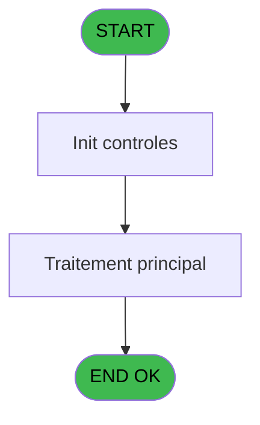
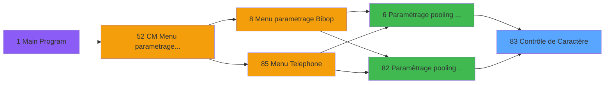

# MAI IDE 83 - Contrôle de Caractère

> **Analyse**: Phases 1-4 2026-02-03 15:03 -> 15:04 (9s) | Assemblage 15:04
> **Pipeline**: V7.2 Enrichi
> **Structure**: 4 onglets (Resume | Ecrans | Donnees | Connexions)

<!-- TAB:Resume -->

## 1. FICHE D'IDENTITE

| Attribut | Valeur |
|----------|--------|
| Projet | MAI |
| IDE Position | 83 |
| Nom Programme | Contrôle de Caractère |
| Fichier source | `Prg_83.xml` |
| Dossier IDE | Telephone |
| Taches | 2 (0 ecrans visibles) |
| Tables modifiees | 0 |
| Programmes appeles | 0 |

## 2. DESCRIPTION FONCTIONNELLE

**Contrôle de Caractère** assure la gestion complete de ce processus, accessible depuis [Paramètrage pooling BIBOP (IDE 6)](MAI-IDE-6.md), [Paramètrage pooling Telephone (IDE 82)](MAI-IDE-82.md).

Le flux de traitement s'organise en **1 blocs fonctionnels** :

- **Traitement** (2 taches) : traitements metier divers

## 3. BLOCS FONCTIONNELS

### 3.1 Traitement (2 taches)

Traitements internes.

---

#### 83 - ÃÄ Contrôle de Caractère

**Role** : Traitement : ÃÄ Contrôle de Caractère.
**Variables liees** : A (P Nom à contrôler --), C (P Longeur contrôle.), F (P Dernier Caractère)

---

#### 83.1 - Contrôles physiques

**Role** : Traitement : Contrôles physiques.

## 5. REGLES METIER

*(Aucune regle metier identifiee)*

## 6. CONTEXTE

- **Appele par**: [Paramètrage pooling BIBOP (IDE 6)](MAI-IDE-6.md), [Paramètrage pooling Telephone (IDE 82)](MAI-IDE-82.md)
- **Appelle**: 0 programmes | **Tables**: 0 (W:0 R:0 L:0) | **Taches**: 2 | **Expressions**: 14

<!-- TAB:Ecrans -->

## 8. ECRANS

*(Programme sans ecran visible)*

## 9. NAVIGATION

### 9.3 Structure hierarchique (2 taches)

| Position | Tache | Type | Dimensions | Bloc |
|----------|-------|------|------------|------|
| **83.1** | [**ÃÄ Contrôle de Caractère** (83)](#t1) | MDI | - | Traitement |
| 83.1.1 | [Contrôles physiques (83.1)](#t2) | MDI | - | |

### 9.4 Algorigramme

> **Legende**: Vert = START/END OK | Rouge = END KO | Bleu = Decisions
> *Algorigramme auto-genere. Utiliser `/algorigramme` pour une synthese metier detaillee.*

<!-- TAB:Donnees -->

## 10. TABLES

### Tables utilisees (0)

| ID | Nom | Description | Type | R | W | L | Usages |
|----|-----|-------------|------|---|---|---|--------|

### Colonnes par table (0 / 0 tables avec colonnes identifiees)

## 11. VARIABLES

### 11.1 Parametres entrants (7)

Variables recues du programme appelant ([Paramètrage pooling BIBOP (IDE 6)](MAI-IDE-6.md)).

| Lettre | Nom | Type | Usage dans |
|--------|-----|------|-----------|
| A | P Nom à contrôler -- | Alpha | - |
| B | P Type erreur | Numeric | 10x parametre entrant |
| C | P Longeur contrôle. | Numeric | - |
| D | P Affichage erreur | Alpha | 1x parametre entrant |
| E | P Intitule erreur | Alpha | - |
| F | P Dernier Caractère | Alpha | - |
| G | P Nb Carac.Speciaux | Numeric | - |

### 11.2 Autres (3)

Variables diverses.

| Lettre | Nom | Type | Usage dans |
|--------|-----|------|-----------|
| H | Col_18 | Alpha | - |
| I | Col_19 | Alpha | - |
| J | W Boucle | Numeric | 1x refs |

## 12. EXPRESSIONS

**14 / 14 expressions decodees (100%)**

### 12.1 Repartition par type

| Type | Expressions | Regles |
|------|-------------|--------|
| CONSTANTE | 2 | 0 |
| CONDITION | 12 | 0 |

### 12.2 Expressions cles par type

#### CONSTANTE (2 expressions)

| Type | IDE | Expression | Regle |
|------|-----|------------|-------|
| CONSTANTE | 14 | `1` | - |
| CONSTANTE | 1 | `1` | - |

#### CONDITION (12 expressions)

| Type | IDE | Expression | Regle |
|------|-----|------------|-------|
| CONDITION | 10 | `P Type erreur [B]=7` | - |
| CONDITION | 9 | `P Type erreur [B]=6` | - |
| CONDITION | 8 | `P Type erreur [B]=5` | - |
| CONDITION | 13 | `P Affichage erreur [D]='O'` | - |
| CONDITION | 12 | `P Type erreur [B]=9` | - |
| ... | | *+7 autres* | |

<!-- TAB:Connexions -->

## 13. GRAPHE D'APPELS

### 13.1 Chaine depuis Main (Callers)

Main -> ... -> [Paramètrage pooling BIBOP (IDE 6)](MAI-IDE-6.md) -> **Contrôle de Caractère (IDE 83)**

Main -> ... -> [Paramètrage pooling Telephone (IDE 82)](MAI-IDE-82.md) -> **Contrôle de Caractère (IDE 83)**

### 13.2 Callers

| IDE | Nom Programme | Nb Appels |
|-----|---------------|-----------|
| [6](MAI-IDE-6.md) | Paramètrage pooling BIBOP | 6 |
| [82](MAI-IDE-82.md) | Paramètrage pooling Telephone | 4 |

### 13.3 Callees (programmes appeles)

### 13.4 Detail Callees avec contexte

| IDE | Nom Programme | Appels | Contexte |
|-----|---------------|--------|----------|
| - | (aucun) | - | - |

## 14. RECOMMANDATIONS MIGRATION

### 14.1 Profil du programme

| Metrique | Valeur | Impact migration |
|----------|--------|-----------------|
| Lignes de logique | 75 | Programme compact |
| Expressions | 14 | Peu de logique |
| Tables WRITE | 0 | Impact faible |
| Sous-programmes | 0 | Peu de dependances |
| Ecrans visibles | 0 | Ecran unique ou traitement batch |
| Code desactive | 0% (0 / 75) | Code sain |
| Regles metier | 0 | Pas de regle identifiee |

### 14.2 Plan de migration par bloc

#### Traitement (2 taches: 0 ecran, 2 traitements)

- **Strategie** : 2 service(s) backend injectable(s) (Domain Services).
- Decomposer les taches en services unitaires testables.

### 14.3 Dependances critiques

| Dependance | Type | Appels | Impact |
|------------|------|--------|--------|

---
*Spec DETAILED generee par Pipeline V7.2 - 2026-02-03 15:04*
