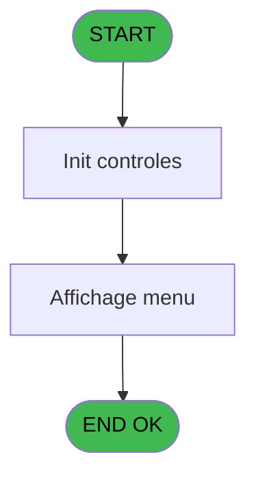
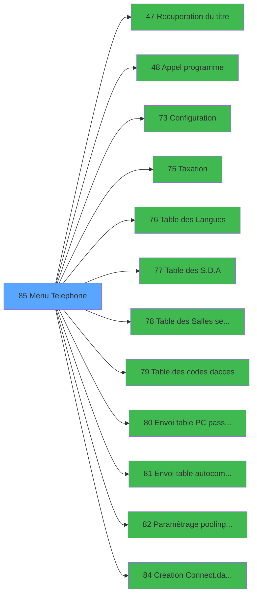

# MAI IDE 85 - Menu Telephone

> **Analyse**: Phases 1-4 2026-02-03 15:04 -> 15:04 (9s) | Assemblage 15:04
> **Pipeline**: V7.2 Enrichi
> **Structure**: 4 onglets (Resume | Ecrans | Donnees | Connexions)

<!-- TAB:Resume -->

## 1. FICHE D'IDENTITE

| Attribut | Valeur |
|----------|--------|
| Projet | MAI |
| IDE Position | 85 |
| Nom Programme | Menu Telephone |
| Fichier source | `Prg_85.xml` |
| Dossier IDE | Utilitaires |
| Taches | 3 (1 ecrans visibles) |
| Tables modifiees | 0 |
| Programmes appeles | 12 |

## 2. DESCRIPTION FONCTIONNELLE

**Menu Telephone** assure la gestion complete de ce processus, accessible depuis [CM  Menu parametrage caisse (IDE 52)](MAI-IDE-52.md).

Le flux de traitement s'organise en **2 blocs fonctionnels** :

- **Traitement** (2 taches) : traitements metier divers
- **Consultation** (1 tache) : ecrans de recherche, selection et consultation

Detail : phases du traitement

#### Phase 1 : Traitement (2 taches)

- **85** - CV  Menu parametrage tel **[[ECRAN]](#ecran-t1)**
- **85.1** - Parametrage telephone

Delegue a : [Recuperation du titre (IDE 47)](MAI-IDE-47.md), [Appel programme (IDE 48)](MAI-IDE-48.md), [Configuration (IDE 73)](MAI-IDE-73.md), [Taxation (IDE 75)](MAI-IDE-75.md), [Table des Langues (IDE 76)](MAI-IDE-76.md), [Table des S.D.A (IDE 77)](MAI-IDE-77.md), [Table des Salles semimaire (IDE 78)](MAI-IDE-78.md), [Table des codes d'acces (IDE 79)](MAI-IDE-79.md), [Envoi table PC passerelle (IDE 80)](MAI-IDE-80.md), [Envoi table autocom PABX (IDE 81)](MAI-IDE-81.md), [Paramètrage pooling Telephone (IDE 82)](MAI-IDE-82.md)

#### Phase 2 : Consultation (1 tache)

- **85.2** - Affichage menu **[[ECRAN]](#ecran-t3)**

Delegue a : [Recuperation du titre (IDE 47)](MAI-IDE-47.md)

## 3. BLOCS FONCTIONNELS

### 3.1 Traitement (2 taches)

Traitements internes.

---

#### 85 - CV  Menu parametrage tel [[ECRAN]](#ecran-t1)

**Role** : Traitement : CV  Menu parametrage tel.
**Ecran** : 640 x 8 DLU (MDI) | [Voir mockup](#ecran-t1)
**Delegue a** : [Recuperation du titre (IDE 47)](MAI-IDE-47.md), [Appel programme (IDE 48)](MAI-IDE-48.md), [Configuration (IDE 73)](MAI-IDE-73.md)

---

#### 85.1 - Parametrage telephone

**Role** : Traitement : Parametrage telephone.
**Delegue a** : [Recuperation du titre (IDE 47)](MAI-IDE-47.md), [Appel programme (IDE 48)](MAI-IDE-48.md), [Configuration (IDE 73)](MAI-IDE-73.md)

### 3.2 Consultation (1 tache)

Ecrans de recherche et consultation.

---

#### 85.2 - Affichage menu [[ECRAN]](#ecran-t3)

**Role** : Reinitialisation : Affichage menu.
**Ecran** : 827 x 247 DLU (MDI) | [Voir mockup](#ecran-t3)

## 5. REGLES METIER

*(Aucune regle metier identifiee)*

## 6. CONTEXTE

- **Appele par**: [CM  Menu parametrage caisse (IDE 52)](MAI-IDE-52.md)
- **Appelle**: 12 programmes | **Tables**: 1 (W:0 R:1 L:0) | **Taches**: 3 | **Expressions**: 14

<!-- TAB:Ecrans -->

## 8. ECRANS

### 8.1 Forms visibles (1 / 3)

| # | Position | Tache | Nom | Type | Largeur | Hauteur | Bloc |
|---|----------|-------|-----|------|---------|---------|------|
| 1 | 85.2 | 85.2 | Affichage menu | MDI | 827 | 247 | Consultation |

### 8.2 Mockups Ecrans

---

#### 85.2 - Affichage menu
**Tache** : [85.2](#t3) | **Type** : MDI | **Dimensions** : 827 x 247 DLU
**Bloc** : Consultation | **Titre IDE** : Affichage menu

<!-- FORM-DATA:
{
    "width":  827,
    "vFactor":  8,
    "type":  "MDI",
    "hFactor":  8,
    "controls":  [
                     {
                         "x":  0,
                         "type":  "label",
                         "var":  "",
                         "y":  0,
                         "w":  820,
                         "fmt":  "",
                         "name":  "",
                         "h":  19,
                         "color":  "",
                         "text":  "",
                         "parent":  null
                     },
                     {
                         "x":  48,
                         "type":  "label",
                         "var":  "",
                         "y":  43,
                         "w":  727,
                         "fmt":  "",
                         "name":  "",
                         "h":  168,
                         "color":  "",
                         "text":  "",
                         "parent":  null
                     },
                     {
                         "x":  50,
                         "type":  "label",
                         "var":  "",
                         "y":  44,
                         "w":  723,
                         "fmt":  "",
                         "name":  "",
                         "h":  166,
                         "color":  "",
                         "text":  "",
                         "parent":  null
                     },
                     {
                         "x":  270,
                         "type":  "label",
                         "var":  "",
                         "y":  58,
                         "w":  464,
                         "fmt":  "",
                         "name":  "",
                         "h":  131,
                         "color":  "",
                         "text":  "",
                         "parent":  null
                     },
                     {
                         "x":  273,
                         "type":  "label",
                         "var":  "",
                         "y":  59,
                         "w":  48,
                         "fmt":  "",
                         "name":  "",
                         "h":  129,
                         "color":  "",
                         "text":  "",
                         "parent":  null
                     },
                     {
                         "x":  334,
                         "type":  "label",
                         "var":  "",
                         "y":  64,
                         "w":  390,
                         "fmt":  "",
                         "name":  "",
                         "h":  8,
                         "color":  "7",
                         "text":  "Configuration Telephonique du village",
                         "parent":  null
                     },
                     {
                         "x":  334,
                         "type":  "label",
                         "var":  "",
                         "y":  77,
                         "w":  390,
                         "fmt":  "",
                         "name":  "",
                         "h":  8,
                         "color":  "7",
                         "text":  "Taxation",
                         "parent":  null
                     },
                     {
                         "x":  334,
                         "type":  "label",
                         "var":  "",
                         "y":  91,
                         "w":  390,
                         "fmt":  "",
                         "name":  "",
                         "h":  8,
                         "color":  "7",
                         "text":  "Table des langues",
                         "parent":  null
                     },
                     {
                         "x":  334,
                         "type":  "label",
                         "var":  "",
                         "y":  105,
                         "w":  390,
                         "fmt":  "",
                         "name":  "",
                         "h":  8,
                         "color":  "7",
                         "text":  "Table des SDA",
                         "parent":  null
                     },
                     {
                         "x":  334,
                         "type":  "label",
                         "var":  "",
                         "y":  119,
                         "w":  390,
                         "fmt":  "",
                         "name":  "",
                         "h":  8,
                         "color":  "7",
                         "text":  "Table des salles de seminaire",
                         "parent":  null
                     },
                     {
                         "x":  334,
                         "type":  "label",
                         "var":  "",
                         "y":  133,
                         "w":  390,
                         "fmt":  "",
                         "name":  "",
                         "h":  8,
                         "color":  "7",
                         "text":  "Table des codes d\u0027acces",
                         "parent":  null
                     },
                     {
                         "x":  334,
                         "type":  "label",
                         "var":  "",
                         "y":  147,
                         "w":  390,
                         "fmt":  "",
                         "name":  "",
                         "h":  8,
                         "color":  "7",
                         "text":  "Parametrage de Pooling",
                         "parent":  null
                     },
                     {
                         "x":  334,
                         "type":  "label",
                         "var":  "",
                         "y":  161,
                         "w":  390,
                         "fmt":  "",
                         "name":  "",
                         "h":  8,
                         "color":  "7",
                         "text":  "Envoi de la table sur le PABX",
                         "parent":  null
                     },
                     {
                         "x":  334,
                         "type":  "label",
                         "var":  "",
                         "y":  176,
                         "w":  390,
                         "fmt":  "",
                         "name":  "",
                         "h":  8,
                         "color":  "7",
                         "text":  "Envoi de la table sur le PC passerelle",
                         "parent":  null
                     },
                     {
                         "x":  414,
                         "type":  "label",
                         "var":  "",
                         "y":  194,
                         "w":  123,
                         "fmt":  "",
                         "name":  "",
                         "h":  10,
                         "color":  "",
                         "text":  "Votre choix",
                         "parent":  null
                     },
                     {
                         "x":  0,
                         "type":  "label",
                         "var":  "",
                         "y":  220,
                         "w":  822,
                         "fmt":  "",
                         "name":  "",
                         "h":  24,
                         "color":  "",
                         "text":  "",
                         "parent":  null
                     },
                     {
                         "x":  548,
                         "type":  "edit",
                         "var":  "",
                         "y":  194,
                         "w":  26,
                         "fmt":  "",
                         "name":  "",
                         "h":  10,
                         "color":  "6",
                         "text":  "",
                         "parent":  null
                     },
                     {
                         "x":  6,
                         "type":  "edit",
                         "var":  "",
                         "y":  4,
                         "w":  267,
                         "fmt":  "20",
                         "name":  "",
                         "h":  8,
                         "color":  "",
                         "text":  "",
                         "parent":  null
                     },
                     {
                         "x":  532,
                         "type":  "edit",
                         "var":  "",
                         "y":  5,
                         "w":  280,
                         "fmt":  "WWW DD MMM YYYYT",
                         "name":  "",
                         "h":  8,
                         "color":  "",
                         "text":  "",
                         "parent":  null
                     },
                     {
                         "x":  71,
                         "type":  "image",
                         "var":  "",
                         "y":  102,
                         "w":  184,
                         "fmt":  "",
                         "name":  "",
                         "h":  61,
                         "color":  "",
                         "text":  "",
                         "parent":  null
                     },
                     {
                         "x":  284,
                         "type":  "button",
                         "var":  "",
                         "y":  63,
                         "w":  26,
                         "fmt":  "1",
                         "name":  "1",
                         "h":  8,
                         "color":  "",
                         "text":  "",
                         "parent":  null
                     },
                     {
                         "x":  284,
                         "type":  "button",
                         "var":  "",
                         "y":  77,
                         "w":  26,
                         "fmt":  "2",
                         "name":  "2",
                         "h":  8,
                         "color":  "",
                         "text":  "",
                         "parent":  null
                     },
                     {
                         "x":  284,
                         "type":  "button",
                         "var":  "",
                         "y":  91,
                         "w":  26,
                         "fmt":  "3",
                         "name":  "3",
                         "h":  8,
                         "color":  "",
                         "text":  "",
                         "parent":  null
                     },
                     {
                         "x":  284,
                         "type":  "button",
                         "var":  "",
                         "y":  105,
                         "w":  26,
                         "fmt":  "4",
                         "name":  "4",
                         "h":  8,
                         "color":  "",
                         "text":  "",
                         "parent":  null
                     },
                     {
                         "x":  284,
                         "type":  "button",
                         "var":  "",
                         "y":  119,
                         "w":  26,
                         "fmt":  "5",
                         "name":  "5",
                         "h":  8,
                         "color":  "",
                         "text":  "",
                         "parent":  null
                     },
                     {
                         "x":  284,
                         "type":  "button",
                         "var":  "",
                         "y":  133,
                         "w":  26,
                         "fmt":  "6",
                         "name":  "6",
                         "h":  8,
                         "color":  "",
                         "text":  "",
                         "parent":  null
                     },
                     {
                         "x":  284,
                         "type":  "button",
                         "var":  "",
                         "y":  147,
                         "w":  26,
                         "fmt":  "7",
                         "name":  "7",
                         "h":  8,
                         "color":  "",
                         "text":  "",
                         "parent":  null
                     },
                     {
                         "x":  284,
                         "type":  "button",
                         "var":  "",
                         "y":  161,
                         "w":  26,
                         "fmt":  "8",
                         "name":  "8",
                         "h":  8,
                         "color":  "",
                         "text":  "",
                         "parent":  null
                     },
                     {
                         "x":  284,
                         "type":  "button",
                         "var":  "",
                         "y":  176,
                         "w":  26,
                         "fmt":  "9",
                         "name":  "9",
                         "h":  8,
                         "color":  "",
                         "text":  "",
                         "parent":  null
                     },
                     {
                         "x":  6,
                         "type":  "button",
                         "var":  "",
                         "y":  224,
                         "w":  154,
                         "fmt":  "\u0026Quitter",
                         "name":  "\u0026Quitter",
                         "h":  18,
                         "color":  "",
                         "text":  "",
                         "parent":  null
                     }
                 ],
    "taskId":  "85.2",
    "height":  247
}
-->

<strong>Champs : 3 champs</strong>

| Pos (x,y) | Nom | Variable | Type |
|-----------|-----|----------|------|
| 548,194 | (sans nom) | - | edit |
| 6,4 | 20 | - | edit |
| 532,5 | WWW DD MMM YYYYT | - | edit |

<strong>Boutons : 10 boutons</strong>

| Bouton | Pos (x,y) | Action |
|--------|-----------|--------|
| 1 | 284,63 | Bouton fonctionnel |
| 2 | 284,77 | Bouton fonctionnel |
| 3 | 284,91 | Bouton fonctionnel |
| 4 | 284,105 | Bouton fonctionnel |
| 5 | 284,119 | Bouton fonctionnel |
| 6 | 284,133 | Bouton fonctionnel |
| 7 | 284,147 | Bouton fonctionnel |
| 8 | 284,161 | Bouton fonctionnel |
| 9 | 284,176 | Bouton fonctionnel |
| Quitter | 6,224 | Quitte le programme |

## 9. NAVIGATION

Ecran unique: **Affichage menu**

### 9.3 Structure hierarchique (3 taches)

| Position | Tache | Type | Dimensions | Bloc |
|----------|-------|------|------------|------|
| **85.1** | [**CV  Menu parametrage tel** (85)](#t1) [mockup](#ecran-t1) | MDI | 640x8 | Traitement |
| 85.1.1 | [Parametrage telephone (85.1)](#t2) | MDI | - | |
| **85.2** | [**Affichage menu** (85.2)](#t3) [mockup](#ecran-t3) | MDI | 827x247 | Consultation |

### 9.4 Algorigramme

> **Legende**: Vert = START/END OK | Rouge = END KO | Bleu = Decisions
> *Algorigramme auto-genere. Utiliser `/algorigramme` pour une synthese metier detaillee.*

<!-- TAB:Donnees -->

## 10. TABLES

### Tables utilisees (1)

| ID | Nom | Description | Type | R | W | L | Usages |
|----|-----|-------------|------|---|---|---|--------|
| 78 | param__telephone_tel |  | DB | R |   |   | 1 |

### Colonnes par table (0 / 1 tables avec colonnes identifiees)

Table 78 - param__telephone_tel (R) - 1 usages

*Table utilisee uniquement en Link ou aucune colonne Real identifiee dans le DataView.*

## 11. VARIABLES

### 11.1 Parametres entrants (1)

Variables recues du programme appelant ([CM  Menu parametrage caisse (IDE 52)](MAI-IDE-52.md)).

| Lettre | Nom | Type | Usage dans |
|--------|-----|------|-----------|
| A | P0 societe | Alpha | 2x parametre entrant |

### 11.2 Variables de travail (5)

Variables internes au programme.

| Lettre | Nom | Type | Usage dans |
|--------|-----|------|-----------|
| B | W0 interface | Alpha | 2x calcul interne |
| C | W0 type de triplet | Alpha | 2x calcul interne |
| D | W0 SDA | Alpha | 2x calcul interne |
| E | W0 nbre ligne/poste | Numeric | - |
| F | W0 choix action | Alpha | 14x calcul interne |

## 12. EXPRESSIONS

**14 / 14 expressions decodees (100%)**

### 12.1 Repartition par type

| Type | Expressions | Regles |
|------|-------------|--------|
| CONDITION | 14 | 0 |

### 12.2 Expressions cles par type

#### CONDITION (14 expressions)

| Type | IDE | Expression | Regle |
|------|-----|------------|-------|
| CONDITION | 10 | `W0 choix action [F]='7' AND P0 societe [A]='C'` | - |
| CONDITION | 9 | `W0 choix action [F]='6'` | - |
| CONDITION | 8 | `W0 choix action [F]='5' AND (W0 type de triplet [C]<>'1' AND W0 type de triplet [C]<>'3')` | - |
| CONDITION | 11 | `W0 choix action [F]='7' AND P0 societe [A]<>'C'` | - |
| CONDITION | 14 | `W0 choix action [F]='9' AND W0 interface [B]<>'CIEME'` | - |
| ... | | *+9 autres* | |

<!-- TAB:Connexions -->

## 13. GRAPHE D'APPELS

### 13.1 Chaine depuis Main (Callers)

Main -> ... -> [CM  Menu parametrage caisse (IDE 52)](MAI-IDE-52.md) -> **Menu Telephone (IDE 85)**

### 13.2 Callers

| IDE | Nom Programme | Nb Appels |
|-----|---------------|-----------|
| [52](MAI-IDE-52.md) | CM  Menu parametrage caisse | 1 |

### 13.3 Callees (programmes appeles)

### 13.4 Detail Callees avec contexte

| IDE | Nom Programme | Appels | Contexte |
|-----|---------------|--------|----------|
| [47](MAI-IDE-47.md) | Recuperation du titre | 1 | Recuperation donnees |
| [48](MAI-IDE-48.md) | Appel programme | 1 | Sous-programme |
| [73](MAI-IDE-73.md) | Configuration | 1 | Sous-programme |
| [75](MAI-IDE-75.md) | Taxation | 1 | Sous-programme |
| [76](MAI-IDE-76.md) | Table des Langues | 1 | Sous-programme |
| [77](MAI-IDE-77.md) | Table des S.D.A | 1 | Sous-programme |
| [78](MAI-IDE-78.md) | Table des Salles semimaire | 1 | Sous-programme |
| [79](MAI-IDE-79.md) | Table des codes d'acces | 1 | Sous-programme |
| [80](MAI-IDE-80.md) | Envoi table PC passerelle | 1 | Sous-programme |
| [81](MAI-IDE-81.md) | Envoi table autocom PABX | 1 | Sous-programme |
| [82](MAI-IDE-82.md) | Paramètrage pooling Telephone | 1 | Sous-programme |
| [84](MAI-IDE-84.md) | Creation Connect.dat / pooling | 1 | Sous-programme |

## 14. RECOMMANDATIONS MIGRATION

### 14.1 Profil du programme

| Metrique | Valeur | Impact migration |
|----------|--------|-----------------|
| Lignes de logique | 42 | Programme compact |
| Expressions | 14 | Peu de logique |
| Tables WRITE | 0 | Impact faible |
| Sous-programmes | 12 | Forte dependance |
| Ecrans visibles | 1 | Ecran unique ou traitement batch |
| Code desactive | 0% (0 / 42) | Code sain |
| Regles metier | 0 | Pas de regle identifiee |

### 14.2 Plan de migration par bloc

#### Traitement (2 taches: 1 ecran, 1 traitement)

- **Strategie** : Orchestrateur avec 1 ecrans (Razor/React) et 1 traitements backend (services).
- Les ecrans deviennent des composants UI, les traitements invisibles deviennent des services injectables.
- 12 sous-programme(s) a migrer ou a reutiliser depuis les services existants.
- Decomposer les taches en services unitaires testables.

#### Consultation (1 tache: 1 ecran, 0 traitement)

- **Strategie** : Composants de recherche/selection en modales.
- 1 ecran : Affichage menu

### 14.3 Dependances critiques

| Dependance | Type | Appels | Impact |
|------------|------|--------|--------|
| [Envoi table PC passerelle (IDE 80)](MAI-IDE-80.md) | Sous-programme | 1x | Normale - Sous-programme |
| [Table des codes d'acces (IDE 79)](MAI-IDE-79.md) | Sous-programme | 1x | Normale - Sous-programme |
| [Table des Salles semimaire (IDE 78)](MAI-IDE-78.md) | Sous-programme | 1x | Normale - Sous-programme |
| [Creation Connect.dat / pooling (IDE 84)](MAI-IDE-84.md) | Sous-programme | 1x | Normale - Sous-programme |
| [Paramètrage pooling Telephone (IDE 82)](MAI-IDE-82.md) | Sous-programme | 1x | Normale - Sous-programme |
| [Envoi table autocom PABX (IDE 81)](MAI-IDE-81.md) | Sous-programme | 1x | Normale - Sous-programme |
| [Configuration (IDE 73)](MAI-IDE-73.md) | Sous-programme | 1x | Normale - Sous-programme |
| [Appel programme (IDE 48)](MAI-IDE-48.md) | Sous-programme | 1x | Normale - Sous-programme |
| [Recuperation du titre (IDE 47)](MAI-IDE-47.md) | Sous-programme | 1x | Normale - Recuperation donnees |
| [Table des S.D.A (IDE 77)](MAI-IDE-77.md) | Sous-programme | 1x | Normale - Sous-programme |

---
*Spec DETAILED generee par Pipeline V7.2 - 2026-02-03 15:04*
