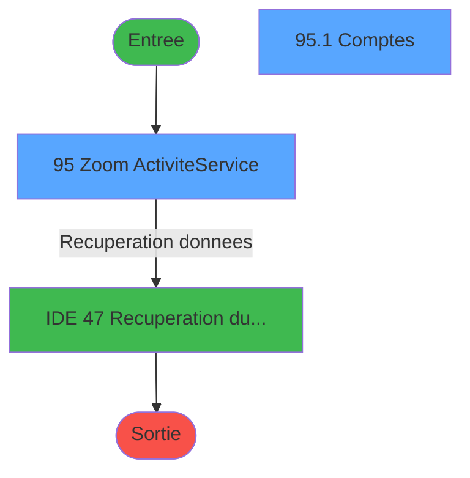
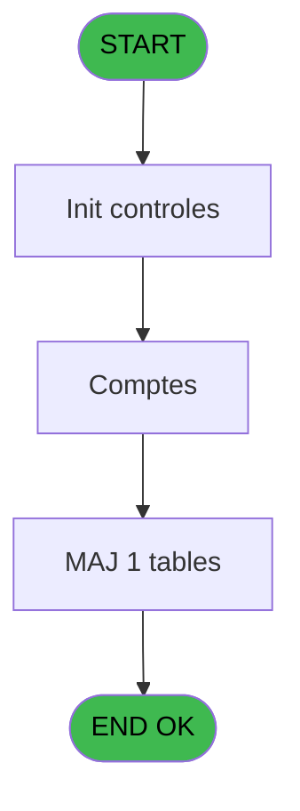
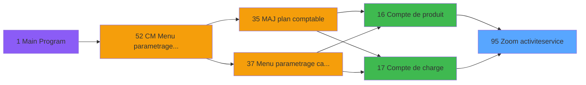
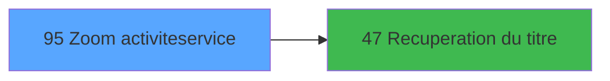

# MAI IDE 95 - Zoom activite/service

> **Analyse**: Phases 1-4 2026-02-03 15:06 -> 15:06 (9s) | Assemblage 15:06
> **Pipeline**: V7.2 Enrichi
> **Structure**: 4 onglets (Resume | Ecrans | Donnees | Connexions)

<!-- TAB:Resume -->

## 1. FICHE D'IDENTITE

| Attribut | Valeur |
|----------|--------|
| Projet | MAI |
| IDE Position | 95 |
| Nom Programme | Zoom activite/service |
| Fichier source | `Prg_95.xml` |
| Dossier IDE | Zoom |
| Taches | 2 (2 ecrans visibles) |
| Tables modifiees | 1 |
| Programmes appeles | 1 |

## 2. DESCRIPTION FONCTIONNELLE

**Zoom activite/service** assure la gestion complete de ce processus, accessible depuis [Compte de produit (IDE 16)](MAI-IDE-16.md), [Compte de charge (IDE 17)](MAI-IDE-17.md).

Le flux de traitement s'organise en **2 blocs fonctionnels** :

- **Calcul** (1 tache) : calculs de montants, stocks ou compteurs
- **Consultation** (1 tache) : ecrans de recherche, selection et consultation

**Donnees modifiees** : 1 tables en ecriture (plan_comptable_central).

Detail : phases du traitement

#### Phase 1 : Consultation (1 tache)

- **95** - Zoom Activite/Service **[[ECRAN]](#ecran-t1)**

Delegue a : [Recuperation du titre (IDE 47)](MAI-IDE-47.md)

#### Phase 2 : Calcul (1 tache)

- **95.1** - Comptes **[[ECRAN]](#ecran-t2)**

#### Tables impactees

| Table | Operations | Role metier |
|-------|-----------|-------------|
| plan_comptable_central | **W** (1 usages) |  |

## 3. BLOCS FONCTIONNELS

### 3.1 Consultation (1 tache)

Ecrans de recherche et consultation.

---

#### 95 - Zoom Activite/Service [[ECRAN]](#ecran-t1)

**Role** : Selection par l'operateur : Zoom Activite/Service.
**Ecran** : 947 x 169 DLU (MDI) | [Voir mockup](#ecran-t1)

### 3.2 Calcul (1 tache)

Calculs metier : montants, stocks, compteurs.

---

#### 95.1 - Comptes [[ECRAN]](#ecran-t2)

**Role** : Traitement : Comptes.
**Ecran** : 952 x 116 DLU (MDI) | [Voir mockup](#ecran-t2)

## 5. REGLES METIER

*(Aucune regle metier identifiee)*

## 6. CONTEXTE

- **Appele par**: [Compte de produit (IDE 16)](MAI-IDE-16.md), [Compte de charge (IDE 17)](MAI-IDE-17.md)
- **Appelle**: 1 programmes | **Tables**: 4 (W:1 R:1 L:2) | **Taches**: 2 | **Expressions**: 7

<!-- TAB:Ecrans -->

## 8. ECRANS

### 8.1 Forms visibles (2 / 2)

| # | Position | Tache | Nom | Type | Largeur | Hauteur | Bloc |
|---|----------|-------|-----|------|---------|---------|------|
| 1 | 95 | 95 | Zoom Activite/Service | MDI | 947 | 169 | Consultation |
| 2 | 95.1 | 95.1 | Comptes | MDI | 952 | 116 | Calcul |

### 8.2 Mockups Ecrans

---

#### 95 - Zoom Activite/Service
**Tache** : [95](#t1) | **Type** : MDI | **Dimensions** : 947 x 169 DLU
**Bloc** : Consultation | **Titre IDE** : Zoom Activite/Service

<!-- FORM-DATA:
{
    "width":  947,
    "vFactor":  8,
    "type":  "MDI",
    "hFactor":  8,
    "controls":  [
                     {
                         "x":  20,
                         "type":  "table",
                         "var":  "",
                         "name":  "",
                         "titleH":  12,
                         "color":  "196",
                         "w":  914,
                         "y":  4,
                         "fmt":  "",
                         "parent":  null,
                         "text":  "",
                         "rowH":  14,
                         "h":  114,
                         "cols":  [
                                      {
                                          "title":  "Activité",
                                          "layer":  1,
                                          "w":  107
                                      },
                                      {
                                          "title":  "Libellé activité",
                                          "layer":  2,
                                          "w":  427
                                      },
                                      {
                                          "title":  "Service",
                                          "layer":  3,
                                          "w":  95
                                      },
                                      {
                                          "title":  "Libellé service",
                                          "layer":  4,
                                          "w":  251
                                      }
                                  ],
                         "rows":  4
                     },
                     {
                         "x":  0,
                         "type":  "label",
                         "var":  "",
                         "y":  144,
                         "w":  945,
                         "fmt":  "",
                         "name":  "",
                         "h":  24,
                         "color":  "",
                         "text":  "",
                         "parent":  null
                     },
                     {
                         "x":  40,
                         "type":  "edit",
                         "var":  "",
                         "y":  20,
                         "w":  75,
                         "fmt":  "",
                         "name":  "Activite du plan comptable",
                         "h":  8,
                         "color":  "196",
                         "text":  "",
                         "parent":  1
                     },
                     {
                         "x":  568,
                         "type":  "edit",
                         "var":  "",
                         "y":  20,
                         "w":  70,
                         "fmt":  "",
                         "name":  "Service de PMS",
                         "h":  8,
                         "color":  "196",
                         "text":  "",
                         "parent":  1
                     },
                     {
                         "x":  138,
                         "type":  "edit",
                         "var":  "",
                         "y":  20,
                         "w":  401,
                         "fmt":  "",
                         "name":  "",
                         "h":  8,
                         "color":  "196",
                         "text":  "",
                         "parent":  1
                     },
                     {
                         "x":  656,
                         "type":  "edit",
                         "var":  "",
                         "y":  20,
                         "w":  234,
                         "fmt":  "",
                         "name":  "",
                         "h":  8,
                         "color":  "196",
                         "text":  "",
                         "parent":  1
                     },
                     {
                         "x":  444,
                         "type":  "image",
                         "var":  "",
                         "y":  123,
                         "w":  58,
                         "fmt":  "",
                         "name":  "",
                         "h":  18,
                         "color":  "",
                         "text":  "",
                         "parent":  null
                     },
                     {
                         "x":  60,
                         "type":  "button",
                         "var":  "",
                         "y":  147,
                         "w":  160,
                         "fmt":  "\u0026Selectionner",
                         "name":  "",
                         "h":  18,
                         "color":  "",
                         "text":  "",
                         "parent":  null
                     },
                     {
                         "x":  393,
                         "type":  "button",
                         "var":  "",
                         "y":  147,
                         "w":  160,
                         "fmt":  "\u0026Detail",
                         "name":  "",
                         "h":  18,
                         "color":  "",
                         "text":  "",
                         "parent":  null
                     },
                     {
                         "x":  718,
                         "type":  "button",
                         "var":  "",
                         "y":  147,
                         "w":  160,
                         "fmt":  "\u0026Quitter",
                         "name":  "",
                         "h":  18,
                         "color":  "",
                         "text":  "",
                         "parent":  null
                     }
                 ],
    "taskId":  "95",
    "height":  169
}
-->

<strong>Champs : 4 champs</strong>

| Pos (x,y) | Nom | Variable | Type |
|-----------|-----|----------|------|
| 40,20 | Activite du plan comptable | - | edit |
| 568,20 | Service de PMS | - | edit |
| 138,20 | (sans nom) | - | edit |
| 656,20 | (sans nom) | - | edit |

<strong>Boutons : 3 boutons</strong>

| Bouton | Pos (x,y) | Action |
|--------|-----------|--------|
| Selectionner | 60,147 | Ouvre la selection |
| Detail | 393,147 | Affiche les details |
| Quitter | 718,147 | Quitte le programme |

---

#### 95.1 - Comptes
**Tache** : [95.1](#t2) | **Type** : MDI | **Dimensions** : 952 x 116 DLU
**Bloc** : Calcul | **Titre IDE** : Comptes

<!-- FORM-DATA:
{
    "width":  952,
    "vFactor":  8,
    "type":  "MDI",
    "hFactor":  8,
    "controls":  [
                     {
                         "x":  19,
                         "type":  "table",
                         "var":  "",
                         "name":  "",
                         "titleH":  12,
                         "color":  "196",
                         "w":  922,
                         "y":  4,
                         "fmt":  "",
                         "parent":  null,
                         "text":  "",
                         "rowH":  14,
                         "h":  109,
                         "cols":  [
                                      {
                                          "title":  "Compte",
                                          "layer":  1,
                                          "w":  102
                                      },
                                      {
                                          "title":  "Libellé service",
                                          "layer":  2,
                                          "w":  388
                                      },
                                      {
                                          "title":  "Libellé compte",
                                          "layer":  3,
                                          "w":  397
                                      }
                                  ],
                         "rows":  3
                     },
                     {
                         "x":  37,
                         "type":  "edit",
                         "var":  "",
                         "y":  18,
                         "w":  72,
                         "fmt":  "",
                         "name":  "",
                         "h":  8,
                         "color":  "196",
                         "text":  "",
                         "parent":  1
                     },
                     {
                         "x":  128,
                         "type":  "edit",
                         "var":  "",
                         "y":  18,
                         "w":  368,
                         "fmt":  "",
                         "name":  "",
                         "h":  8,
                         "color":  "196",
                         "text":  "",
                         "parent":  1
                     },
                     {
                         "x":  517,
                         "type":  "edit",
                         "var":  "",
                         "y":  18,
                         "w":  376,
                         "fmt":  "",
                         "name":  "",
                         "h":  8,
                         "color":  "196",
                         "text":  "",
                         "parent":  1
                     }
                 ],
    "taskId":  "95.1",
    "height":  116
}
-->

<strong>Champs : 3 champs</strong>

| Pos (x,y) | Nom | Variable | Type |
|-----------|-----|----------|------|
| 37,18 | (sans nom) | - | edit |
| 128,18 | (sans nom) | - | edit |
| 517,18 | (sans nom) | - | edit |

## 9. NAVIGATION

### 9.1 Enchainement des ecrans

**Detail par enchainement :**

| Depuis | Action | Vers | Retour |
|--------|--------|------|--------|
| Zoom Activite/Service | Recuperation donnees | [Recuperation du titre (IDE 47)](MAI-IDE-47.md) | Retour ecran |

### 9.3 Structure hierarchique (2 taches)

| Position | Tache | Type | Dimensions | Bloc |
|----------|-------|------|------------|------|
| **95.1** | [**Zoom Activite/Service** (95)](#t1) [mockup](#ecran-t1) | MDI | 947x169 | Consultation |
| **95.2** | [**Comptes** (95.1)](#t2) [mockup](#ecran-t2) | MDI | 952x116 | Calcul |

### 9.4 Algorigramme

> **Legende**: Vert = START/END OK | Rouge = END KO | Bleu = Decisions
> *Algorigramme auto-genere. Utiliser `/algorigramme` pour une synthese metier detaillee.*

<!-- TAB:Donnees -->

## 10. TABLES

### Tables utilisees (4)

| ID | Nom | Description | Type | R | W | L | Usages |
|----|-----|-------------|------|---|---|---|--------|
| 67 | tables___________tab |  | DB | R |   |   | 1 |
| 201 | activite_plan_comptable |  | DB |   |   | L | 1 |
| 202 | activite_service_central | Services / filieres | DB |   |   | L | 1 |
| 209 | plan_comptable_central |  | DB |   | **W** |   | 1 |

### Colonnes par table (2 / 2 tables avec colonnes identifiees)

Table 67 - tables___________tab (R) - 1 usages

| Lettre | Variable | Acces | Type |
|--------|----------|-------|------|
| A | param societe | R | Alpha |
| B | param service | R | Alpha |
| C | >v.titre | R | Alpha |

Table 209 - plan_comptable_central (**W**) - 1 usages

*Table utilisee uniquement en Link ou aucune colonne Real identifiee dans le DataView.*

## 11. VARIABLES

### 11.1 Autres (3)

Variables diverses.

| Lettre | Nom | Type | Usage dans |
|--------|-----|------|-----------|
| A | param societe | Alpha | 1x refs |
| B | param service | Alpha | - |
| C | >v.titre | Alpha | - |

## 12. EXPRESSIONS

**7 / 7 expressions decodees (100%)**

### 12.1 Repartition par type

| Type | Expressions | Regles |
|------|-------------|--------|
| CONSTANTE | 2 | 0 |
| OTHER | 4 | 0 |
| STRING | 1 | 0 |

### 12.2 Expressions cles par type

#### CONSTANTE (2 expressions)

| Type | IDE | Expression | Regle |
|------|-----|------------|-------|
| CONSTANTE | 3 | `'VSERV'` | - |
| CONSTANTE | 2 | `61` | - |

#### OTHER (4 expressions)

| Type | IDE | Expression | Regle |
|------|-----|------------|-------|
| OTHER | 6 | `[D]` | - |
| OTHER | 7 | `[E]` | - |
| OTHER | 4 | `param societe [A]` | - |
| OTHER | 5 | `[E]` | - |

#### STRING (1 expressions)

| Type | IDE | Expression | Regle |
|------|-----|------------|-------|
| STRING | 1 | `Trim ([M])` | - |

<!-- TAB:Connexions -->

## 13. GRAPHE D'APPELS

### 13.1 Chaine depuis Main (Callers)

Main -> ... -> [Compte de produit (IDE 16)](MAI-IDE-16.md) -> **Zoom activite/service (IDE 95)**

Main -> ... -> [Compte de charge (IDE 17)](MAI-IDE-17.md) -> **Zoom activite/service (IDE 95)**

### 13.2 Callers

| IDE | Nom Programme | Nb Appels |
|-----|---------------|-----------|
| [16](MAI-IDE-16.md) | Compte de produit | 1 |
| [17](MAI-IDE-17.md) | Compte de charge | 1 |

### 13.3 Callees (programmes appeles)

### 13.4 Detail Callees avec contexte

| IDE | Nom Programme | Appels | Contexte |
|-----|---------------|--------|----------|
| [47](MAI-IDE-47.md) | Recuperation du titre | 1 | Recuperation donnees |

## 14. RECOMMANDATIONS MIGRATION

### 14.1 Profil du programme

| Metrique | Valeur | Impact migration |
|----------|--------|-----------------|
| Lignes de logique | 37 | Programme compact |
| Expressions | 7 | Peu de logique |
| Tables WRITE | 1 | Impact faible |
| Sous-programmes | 1 | Peu de dependances |
| Ecrans visibles | 2 | Quelques ecrans |
| Code desactive | 0% (0 / 37) | Code sain |
| Regles metier | 0 | Pas de regle identifiee |

### 14.2 Plan de migration par bloc

#### Consultation (1 tache: 1 ecran, 0 traitement)

- **Strategie** : Composants de recherche/selection en modales.
- 1 ecran : Zoom Activite/Service

#### Calcul (1 tache: 1 ecran, 0 traitement)

- **Strategie** : Services de calcul purs (Domain Services).
- Migrer la logique de calcul (stock, compteurs, montants)

### 14.3 Dependances critiques

| Dependance | Type | Appels | Impact |
|------------|------|--------|--------|
| plan_comptable_central | Table WRITE (Database) | 1x | Schema + repository |
| [Recuperation du titre (IDE 47)](MAI-IDE-47.md) | Sous-programme | 1x | Normale - Recuperation donnees |

---
*Spec DETAILED generee par Pipeline V7.2 - 2026-02-03 15:06*
