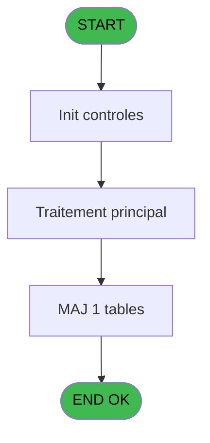
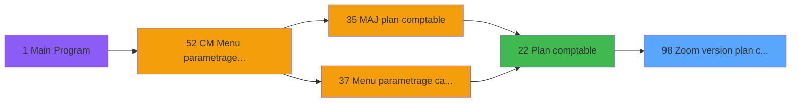
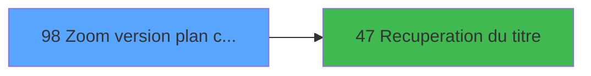

# MAI IDE 98 - Zoom version plan comptable

> **Analyse**: Phases 1-4 2026-02-03 15:07 -> 15:07 (9s) | Assemblage 15:07
> **Pipeline**: V7.2 Enrichi
> **Structure**: 4 onglets (Resume | Ecrans | Donnees | Connexions)

<!-- TAB:Resume -->

## 1. FICHE D'IDENTITE

| Attribut | Valeur |
|----------|--------|
| Projet | MAI |
| IDE Position | 98 |
| Nom Programme | Zoom version plan comptable |
| Fichier source | `Prg_98.xml` |
| Dossier IDE | Zoom |
| Taches | 1 (1 ecrans visibles) |
| Tables modifiees | 1 |
| Programmes appeles | 1 |

## 2. DESCRIPTION FONCTIONNELLE

**Zoom version plan comptable** assure la gestion complete de ce processus, accessible depuis [Plan comptable (IDE 22)](MAI-IDE-22.md).

Le flux de traitement s'organise en **1 blocs fonctionnels** :

- **Consultation** (1 tache) : ecrans de recherche, selection et consultation

**Donnees modifiees** : 1 tables en ecriture (plan_comptable_central_version).

**Logique metier** : 1 regles identifiees couvrant valeurs par defaut.

## 3. BLOCS FONCTIONNELS

### 3.1 Consultation (1 tache)

Ecrans de recherche et consultation.

---

#### 98 - Zoom plan histo [[ECRAN]](#ecran-t1)

**Role** : Selection par l'operateur : Zoom plan histo.
**Ecran** : 960 x 0 DLU (MDI) | [Voir mockup](#ecran-t1)

## 5. REGLES METIER

1 regles identifiees:

### Autres (1 regles)

#### [RM-001] Valeur par defaut si Param societe [A] est vide

| Element | Detail |
|---------|--------|
| **Condition** | `Param societe [A]=''` |
| **Si vrai** | 'C' |
| **Si faux** | Param societe [A]) |
| **Variables** | A (Param societe) |
| **Expression source** | Expression 3 : `IF (Param societe [A]='','C',Param societe [A])` |
| **Exemple** | Si Param societe [A]='' → 'C'. Sinon → Param societe [A]) |

## 6. CONTEXTE

- **Appele par**: [Plan comptable (IDE 22)](MAI-IDE-22.md)
- **Appelle**: 1 programmes | **Tables**: 1 (W:1 R:0 L:0) | **Taches**: 1 | **Expressions**: 4

<!-- TAB:Ecrans -->

## 8. ECRANS

### 8.1 Forms visibles (1 / 1)

| # | Position | Tache | Nom | Type | Largeur | Hauteur | Bloc |
|---|----------|-------|-----|------|---------|---------|------|
| 1 | 98 | 98 | Zoom plan histo | MDI | 960 | 0 | Consultation |

### 8.2 Mockups Ecrans

---

#### 98 - Zoom plan histo
**Tache** : [98](#t1) | **Type** : MDI | **Dimensions** : 960 x 0 DLU
**Bloc** : Consultation | **Titre IDE** : Zoom plan histo

<!-- FORM-DATA:
{
    "width":  960,
    "vFactor":  8,
    "type":  "MDI",
    "hFactor":  8,
    "controls":  [
                     {
                         "x":  294,
                         "type":  "table",
                         "var":  "",
                         "name":  "",
                         "titleH":  12,
                         "color":  "196",
                         "w":  373,
                         "y":  31,
                         "fmt":  "",
                         "parent":  null,
                         "text":  "",
                         "rowH":  14,
                         "h":  100,
                         "cols":  [
                                      {
                                          "title":  "Version",
                                          "layer":  1,
                                          "w":  165
                                      },
                                      {
                                          "title":  "Date",
                                          "layer":  2,
                                          "w":  172
                                      }
                                  ],
                         "rows":  2
                     },
                     {
                         "x":  0,
                         "type":  "label",
                         "var":  "",
                         "y":  176,
                         "w":  957,
                         "fmt":  "",
                         "name":  "",
                         "h":  24,
                         "color":  "",
                         "text":  "",
                         "parent":  null
                     },
                     {
                         "x":  309,
                         "type":  "edit",
                         "var":  "",
                         "y":  47,
                         "w":  134,
                         "fmt":  "",
                         "name":  "",
                         "h":  8,
                         "color":  "196",
                         "text":  "",
                         "parent":  1
                     },
                     {
                         "x":  464,
                         "type":  "edit",
                         "var":  "",
                         "y":  47,
                         "w":  128,
                         "fmt":  "",
                         "name":  "",
                         "h":  8,
                         "color":  "196",
                         "text":  "",
                         "parent":  1
                     },
                     {
                         "x":  28,
                         "type":  "button",
                         "var":  "",
                         "y":  179,
                         "w":  160,
                         "fmt":  "\u0026Selectionner",
                         "name":  "",
                         "h":  18,
                         "color":  "",
                         "text":  "",
                         "parent":  null
                     },
                     {
                         "x":  773,
                         "type":  "button",
                         "var":  "",
                         "y":  179,
                         "w":  160,
                         "fmt":  "\u0026Quitter",
                         "name":  "",
                         "h":  18,
                         "color":  "",
                         "text":  "",
                         "parent":  null
                     },
                     {
                         "x":  451,
                         "type":  "image",
                         "var":  "",
                         "y":  155,
                         "w":  58,
                         "fmt":  "",
                         "name":  "",
                         "h":  18,
                         "color":  "",
                         "text":  "",
                         "parent":  null
                     }
                 ],
    "taskId":  "98",
    "height":  0
}
-->

<strong>Champs : 2 champs</strong>

| Pos (x,y) | Nom | Variable | Type |
|-----------|-----|----------|------|
| 309,47 | (sans nom) | - | edit |
| 464,47 | (sans nom) | - | edit |

<strong>Boutons : 2 boutons</strong>

| Bouton | Pos (x,y) | Action |
|--------|-----------|--------|
| Selectionner | 28,179 | Ouvre la selection |
| Quitter | 773,179 | Quitte le programme |

## 9. NAVIGATION

Ecran unique: **Zoom plan histo**

### 9.3 Structure hierarchique (1 tache)

| Position | Tache | Type | Dimensions | Bloc |
|----------|-------|------|------------|------|
| **98.1** | [**Zoom plan histo** (98)](#t1) [mockup](#ecran-t1) | MDI | 960x0 | Consultation |

### 9.4 Algorigramme

> **Legende**: Vert = START/END OK | Rouge = END KO | Bleu = Decisions
> *Algorigramme auto-genere. Utiliser `/algorigramme` pour une synthese metier detaillee.*

<!-- TAB:Donnees -->

## 10. TABLES

### Tables utilisees (1)

| ID | Nom | Description | Type | R | W | L | Usages |
|----|-----|-------------|------|---|---|---|--------|
| 211 | plan_comptable_central_version |  | DB |   | **W** |   | 1 |

### Colonnes par table (1 / 1 tables avec colonnes identifiees)

Table 211 - plan_comptable_central_version (**W**) - 1 usages

| Lettre | Variable | Acces | Type |
|--------|----------|-------|------|
| A | Param societe | W | Alpha |
| B | Param chrono | W | Numeric |
| C | >v.titre | W | Alpha |

## 11. VARIABLES

### 11.1 Autres (3)

Variables diverses.

| Lettre | Nom | Type | Usage dans |
|--------|-----|------|-----------|
| A | Param societe | Alpha | 1x refs |
| B | Param chrono | Numeric | - |
| C | >v.titre | Alpha | 1x refs |

## 12. EXPRESSIONS

**4 / 4 expressions decodees (100%)**

### 12.1 Repartition par type

| Type | Expressions | Regles |
|------|-------------|--------|
| CONDITION | 2 | 5 |
| CONSTANTE | 1 | 0 |
| STRING | 1 | 0 |

### 12.2 Expressions cles par type

#### CONDITION (2 expressions)

| Type | IDE | Expression | Regle |
|------|-----|------------|-------|
| CONDITION | 3 | `IF (Param societe [A]='','C',Param societe [A])` | [RM-001](#rm-RM-001) |
| CONDITION | 4 | `>v.titre [C]` | - |

#### CONSTANTE (1 expressions)

| Type | IDE | Expression | Regle |
|------|-----|------------|-------|
| CONSTANTE | 2 | `53` | - |

#### STRING (1 expressions)

| Type | IDE | Expression | Regle |
|------|-----|------------|-------|
| STRING | 1 | `Trim ([F])` | - |

<!-- TAB:Connexions -->

## 13. GRAPHE D'APPELS

### 13.1 Chaine depuis Main (Callers)

Main -> ... -> [Plan comptable (IDE 22)](MAI-IDE-22.md) -> **Zoom version plan comptable (IDE 98)**

### 13.2 Callers

| IDE | Nom Programme | Nb Appels |
|-----|---------------|-----------|
| [22](MAI-IDE-22.md) | Plan comptable | 1 |

### 13.3 Callees (programmes appeles)

### 13.4 Detail Callees avec contexte

| IDE | Nom Programme | Appels | Contexte |
|-----|---------------|--------|----------|
| [47](MAI-IDE-47.md) | Recuperation du titre | 1 | Recuperation donnees |

## 14. RECOMMANDATIONS MIGRATION

### 14.1 Profil du programme

| Metrique | Valeur | Impact migration |
|----------|--------|-----------------|
| Lignes de logique | 12 | Programme compact |
| Expressions | 4 | Peu de logique |
| Tables WRITE | 1 | Impact faible |
| Sous-programmes | 1 | Peu de dependances |
| Ecrans visibles | 1 | Ecran unique ou traitement batch |
| Code desactive | 0% (0 / 12) | Code sain |
| Regles metier | 1 | Quelques regles a preserver |

### 14.2 Plan de migration par bloc

#### Consultation (1 tache: 1 ecran, 0 traitement)

- **Strategie** : Composants de recherche/selection en modales.
- 1 ecran : Zoom plan histo

### 14.3 Dependances critiques

| Dependance | Type | Appels | Impact |
|------------|------|--------|--------|
| plan_comptable_central_version | Table WRITE (Database) | 1x | Schema + repository |
| [Recuperation du titre (IDE 47)](MAI-IDE-47.md) | Sous-programme | 1x | Normale - Recuperation donnees |

---
*Spec DETAILED generee par Pipeline V7.2 - 2026-02-03 15:07*
