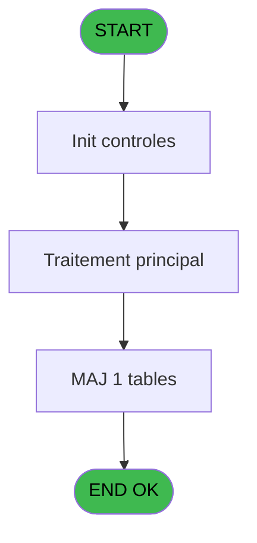
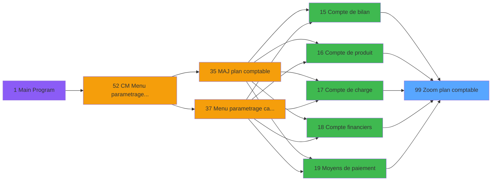
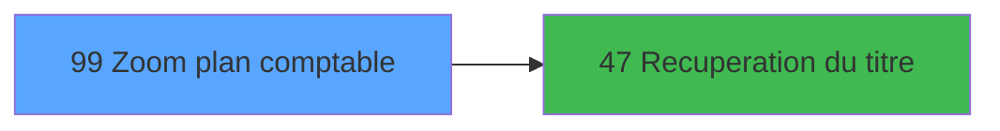

# MAI IDE 99 - Zoom plan comptable

> **Analyse**: Phases 1-4 2026-02-03 15:07 -> 15:07 (9s) | Assemblage 15:07
> **Pipeline**: V7.2 Enrichi
> **Structure**: 4 onglets (Resume | Ecrans | Donnees | Connexions)

<!-- TAB:Resume -->

## 1. FICHE D'IDENTITE

| Attribut | Valeur |
|----------|--------|
| Projet | MAI |
| IDE Position | 99 |
| Nom Programme | Zoom plan comptable |
| Fichier source | `Prg_99.xml` |
| Dossier IDE | Zoom |
| Taches | 1 (1 ecrans visibles) |
| Tables modifiees | 1 |
| Programmes appeles | 1 |

## 2. DESCRIPTION FONCTIONNELLE

**Zoom plan comptable** assure la gestion complete de ce processus, accessible depuis [Plan comptable (IDE 22)](MAI-IDE-22.md), [Compte de bilan (IDE 15)](MAI-IDE-15.md), [Compte de produit (IDE 16)](MAI-IDE-16.md), [Compte de charge (IDE 17)](MAI-IDE-17.md), [Compte financiers (IDE 18)](MAI-IDE-18.md), [Moyens de paiement (IDE 19)](MAI-IDE-19.md), [Menu parametrage caisse (IDE 37)](MAI-IDE-37.md).

Le flux de traitement s'organise en **1 blocs fonctionnels** :

- **Consultation** (1 tache) : ecrans de recherche, selection et consultation

**Donnees modifiees** : 1 tables en ecriture (plan_comptable_central).

**Logique metier** : 2 regles identifiees couvrant conditions metier, valeurs par defaut.

## 3. BLOCS FONCTIONNELS

### 3.1 Consultation (1 tache)

Ecrans de recherche et consultation.

---

#### 99 - Zoom plan [[ECRAN]](#ecran-t1)

**Role** : Selection par l'operateur : Zoom plan.
**Ecran** : 960 x 0 DLU (MDI) | [Voir mockup](#ecran-t1)

## 5. REGLES METIER

2 regles identifiees:

### Autres (2 regles)

#### [RM-001] Si Param Compte/Activite/RDP [A]='C' alors 1 sinon IF (Param Compte/Activite/RDP [A]='A',2,5))

| Element | Detail |
|---------|--------|
| **Condition** | `Param Compte/Activite/RDP [A]='C'` |
| **Si vrai** | 1 |
| **Si faux** | IF (Param Compte/Activite/RDP [A]='A',2,5)) |
| **Variables** | A (Param Compte/Activite/RDP), E (Param compte) |
| **Expression source** | Expression 1 : `IF (Param Compte/Activite/RDP [A]='C',1,IF (Param Compte/Act` |
| **Exemple** | Si Param Compte/Activite/RDP [A]='C' → 1. Sinon → IF (Param Compte/Activite/RDP [A]='A',2,5)) |

#### [RM-002] Valeur par defaut si Param societe [B] est vide

| Element | Detail |
|---------|--------|
| **Condition** | `Param societe [B]=''` |
| **Si vrai** | 'C' |
| **Si faux** | Param societe [B]) |
| **Variables** | B (Param societe) |
| **Expression source** | Expression 4 : `IF (Param societe [B]='','C',Param societe [B])` |
| **Exemple** | Si Param societe [B]='' → 'C'. Sinon → Param societe [B]) |

## 6. CONTEXTE

- **Appele par**: [Plan comptable (IDE 22)](MAI-IDE-22.md), [Compte de bilan (IDE 15)](MAI-IDE-15.md), [Compte de produit (IDE 16)](MAI-IDE-16.md), [Compte de charge (IDE 17)](MAI-IDE-17.md), [Compte financiers (IDE 18)](MAI-IDE-18.md), [Moyens de paiement (IDE 19)](MAI-IDE-19.md), [Menu parametrage caisse (IDE 37)](MAI-IDE-37.md)
- **Appelle**: 1 programmes | **Tables**: 1 (W:1 R:0 L:0) | **Taches**: 1 | **Expressions**: 16

<!-- TAB:Ecrans -->

## 8. ECRANS

### 8.1 Forms visibles (1 / 1)

| # | Position | Tache | Nom | Type | Largeur | Hauteur | Bloc |
|---|----------|-------|-----|------|---------|---------|------|
| 1 | 99 | 99 | Zoom plan | MDI | 960 | 0 | Consultation |

### 8.2 Mockups Ecrans

---

#### 99 - Zoom plan
**Tache** : [99](#t1) | **Type** : MDI | **Dimensions** : 960 x 0 DLU
**Bloc** : Consultation | **Titre IDE** : Zoom plan

<!-- FORM-DATA:
{
    "width":  960,
    "vFactor":  8,
    "type":  "MDI",
    "hFactor":  8,
    "controls":  [
                     {
                         "x":  15,
                         "type":  "table",
                         "var":  "",
                         "name":  "",
                         "titleH":  12,
                         "color":  "196",
                         "w":  930,
                         "y":  7,
                         "fmt":  "",
                         "parent":  null,
                         "text":  "",
                         "rowH":  13,
                         "h":  142,
                         "cols":  [
                                      {
                                          "title":  "Compte",
                                          "layer":  1,
                                          "w":  102
                                      },
                                      {
                                          "title":  "Activité",
                                          "layer":  2,
                                          "w":  92
                                      },
                                      {
                                          "title":  "Libellé",
                                          "layer":  3,
                                          "w":  698
                                      }
                                  ],
                         "rows":  3
                     },
                     {
                         "x":  0,
                         "type":  "label",
                         "var":  "",
                         "y":  176,
                         "w":  957,
                         "fmt":  "",
                         "name":  "",
                         "h":  24,
                         "color":  "",
                         "text":  "",
                         "parent":  null
                     },
                     {
                         "x":  42,
                         "type":  "edit",
                         "var":  "",
                         "y":  23,
                         "w":  67,
                         "fmt":  "",
                         "name":  "",
                         "h":  8,
                         "color":  "196",
                         "text":  "",
                         "parent":  1
                     },
                     {
                         "x":  133,
                         "type":  "edit",
                         "var":  "",
                         "y":  23,
                         "w":  72,
                         "fmt":  "3Z",
                         "name":  "",
                         "h":  8,
                         "color":  "196",
                         "text":  "",
                         "parent":  1
                     },
                     {
                         "x":  213,
                         "type":  "edit",
                         "var":  "",
                         "y":  23,
                         "w":  676,
                         "fmt":  "",
                         "name":  "",
                         "h":  8,
                         "color":  "196",
                         "text":  "",
                         "parent":  1
                     },
                     {
                         "x":  213,
                         "type":  "edit",
                         "var":  "",
                         "y":  23,
                         "w":  676,
                         "fmt":  "",
                         "name":  "",
                         "h":  8,
                         "color":  "196",
                         "text":  "",
                         "parent":  1
                     },
                     {
                         "x":  28,
                         "type":  "button",
                         "var":  "",
                         "y":  179,
                         "w":  160,
                         "fmt":  "\u0026Selectionner",
                         "name":  "",
                         "h":  18,
                         "color":  "",
                         "text":  "",
                         "parent":  null
                     },
                     {
                         "x":  773,
                         "type":  "button",
                         "var":  "",
                         "y":  179,
                         "w":  160,
                         "fmt":  "\u0026Quitter",
                         "name":  "",
                         "h":  18,
                         "color":  "",
                         "text":  "",
                         "parent":  null
                     },
                     {
                         "x":  451,
                         "type":  "image",
                         "var":  "",
                         "y":  155,
                         "w":  58,
                         "fmt":  "",
                         "name":  "",
                         "h":  18,
                         "color":  "",
                         "text":  "",
                         "parent":  null
                     }
                 ],
    "taskId":  "99",
    "height":  0
}
-->

<strong>Champs : 4 champs</strong>

| Pos (x,y) | Nom | Variable | Type |
|-----------|-----|----------|------|
| 42,23 | (sans nom) | - | edit |
| 133,23 | 3Z | - | edit |
| 213,23 | (sans nom) | - | edit |
| 213,23 | (sans nom) | - | edit |

<strong>Boutons : 2 boutons</strong>

| Bouton | Pos (x,y) | Action |
|--------|-----------|--------|
| Selectionner | 28,179 | Ouvre la selection |
| Quitter | 773,179 | Quitte le programme |

## 9. NAVIGATION

Ecran unique: **Zoom plan**

### 9.3 Structure hierarchique (1 tache)

| Position | Tache | Type | Dimensions | Bloc |
|----------|-------|------|------------|------|
| **99.1** | [**Zoom plan** (99)](#t1) [mockup](#ecran-t1) | MDI | 960x0 | Consultation |

### 9.4 Algorigramme

> **Legende**: Vert = START/END OK | Rouge = END KO | Bleu = Decisions
> *Algorigramme auto-genere. Utiliser `/algorigramme` pour une synthese metier detaillee.*

<!-- TAB:Donnees -->

## 10. TABLES

### Tables utilisees (1)

| ID | Nom | Description | Type | R | W | L | Usages |
|----|-----|-------------|------|---|---|---|--------|
| 209 | plan_comptable_central |  | DB |   | **W** |   | 1 |

### Colonnes par table (1 / 1 tables avec colonnes identifiees)

Table 209 - plan_comptable_central (**W**) - 1 usages

| Lettre | Variable | Acces | Type |
|--------|----------|-------|------|
| A | Param Compte/Activite/RDP | W | Alpha |
| B | Param societe | W | Alpha |
| C | Param classe mini | W | Numeric |
| D | Param classse maxi | W | Numeric |
| E | Param compte | W | Numeric |
| F | Param activite | W | Numeric |
| G | Param imputation | W | Numeric |
| H | >v.titre | W | Alpha |

## 11. VARIABLES

### 11.1 Autres (8)

Variables diverses.

| Lettre | Nom | Type | Usage dans |
|--------|-----|------|-----------|
| A | Param Compte/Activite/RDP | Alpha | 4x refs |
| B | Param societe | Alpha | 1x refs |
| C | Param classe mini | Numeric | 1x refs |
| D | Param classse maxi | Numeric | 1x refs |
| E | Param compte | Numeric | 5x refs |
| F | Param activite | Numeric | 1x refs |
| G | Param imputation | Numeric | - |
| H | >v.titre | Alpha | - |

## 12. EXPRESSIONS

**16 / 16 expressions decodees (100%)**

### 12.1 Repartition par type

| Type | Expressions | Regles |
|------|-------------|--------|
| CONDITION | 9 | 2 |
| CALCULATION | 1 | 0 |
| CONSTANTE | 1 | 0 |
| CAST_LOGIQUE | 2 | 0 |
| OTHER | 2 | 0 |
| STRING | 1 | 0 |

### 12.2 Expressions cles par type

#### CONDITION (9 expressions)

| Type | IDE | Expression | Regle |
|------|-----|------------|-------|
| CONDITION | 4 | `IF (Param societe [B]='','C',Param societe [B])` | [RM-002](#rm-RM-002) |
| CONDITION | 1 | `IF (Param Compte/Activite/RDP [A]='C',1,IF (Param Compte/Activite/RDP [A]='A',2,5))` | [RM-001](#rm-RM-001) |
| CONDITION | 16 | `GetParam ('CODELANGUE')='ANG'` | - |
| CONDITION | 7 | `CndRange (Param compte [E]<>0,Val (Left (Trim (Str (Param compte [E],'6'))&'000000',6),'6'))` | - |
| CONDITION | 9 | `CndRange (Param activite [F]<>0,Val (Left (Trim (Str (Param activite [F],'3'))&'000',3),'3'))` | - |
| ... | | *+4 autres* | |

#### CALCULATION (1 expressions)

| Type | IDE | Expression | Regle |
|------|-----|------------|-------|
| CALCULATION | 14 | `[I]*1000+[J]` | - |

#### CONSTANTE (1 expressions)

| Type | IDE | Expression | Regle |
|------|-----|------------|-------|
| CONSTANTE | 3 | `48` | - |

#### CAST_LOGIQUE (2 expressions)

| Type | IDE | Expression | Regle |
|------|-----|------------|-------|
| CAST_LOGIQUE | 11 | `CndRange (Param Compte/Activite/RDP [A]='P','TRUE'LOG)` | - |
| CAST_LOGIQUE | 10 | `CndRange (Param Compte/Activite/RDP [A]='R','TRUE'LOG)` | - |

#### OTHER (2 expressions)

| Type | IDE | Expression | Regle |
|------|-----|------------|-------|
| OTHER | 13 | `[J]` | - |
| OTHER | 12 | `[I]` | - |

#### STRING (1 expressions)

| Type | IDE | Expression | Regle |
|------|-----|------------|-------|
| STRING | 2 | `Trim ([O])` | - |

<!-- TAB:Connexions -->

## 13. GRAPHE D'APPELS

### 13.1 Chaine depuis Main (Callers)

Main -> ... -> [Plan comptable (IDE 22)](MAI-IDE-22.md) -> **Zoom plan comptable (IDE 99)**

Main -> ... -> [Compte de bilan (IDE 15)](MAI-IDE-15.md) -> **Zoom plan comptable (IDE 99)**

Main -> ... -> [Compte de produit (IDE 16)](MAI-IDE-16.md) -> **Zoom plan comptable (IDE 99)**

Main -> ... -> [Compte de charge (IDE 17)](MAI-IDE-17.md) -> **Zoom plan comptable (IDE 99)**

Main -> ... -> [Compte financiers (IDE 18)](MAI-IDE-18.md) -> **Zoom plan comptable (IDE 99)**

Main -> ... -> [Moyens de paiement (IDE 19)](MAI-IDE-19.md) -> **Zoom plan comptable (IDE 99)**

Main -> ... -> [Menu parametrage caisse (IDE 37)](MAI-IDE-37.md) -> **Zoom plan comptable (IDE 99)**

### 13.2 Callers

| IDE | Nom Programme | Nb Appels |
|-----|---------------|-----------|
| [22](MAI-IDE-22.md) | Plan comptable | 6 |
| [15](MAI-IDE-15.md) | Compte de bilan | 1 |
| [16](MAI-IDE-16.md) | Compte de produit | 1 |
| [17](MAI-IDE-17.md) | Compte de charge | 1 |
| [18](MAI-IDE-18.md) | Compte financiers | 1 |
| [19](MAI-IDE-19.md) | Moyens de paiement | 1 |
| [37](MAI-IDE-37.md) | Menu parametrage caisse | 1 |

### 13.3 Callees (programmes appeles)

### 13.4 Detail Callees avec contexte

| IDE | Nom Programme | Appels | Contexte |
|-----|---------------|--------|----------|
| [47](MAI-IDE-47.md) | Recuperation du titre | 1 | Recuperation donnees |

## 14. RECOMMANDATIONS MIGRATION

### 14.1 Profil du programme

| Metrique | Valeur | Impact migration |
|----------|--------|-----------------|
| Lignes de logique | 23 | Programme compact |
| Expressions | 16 | Peu de logique |
| Tables WRITE | 1 | Impact faible |
| Sous-programmes | 1 | Peu de dependances |
| Ecrans visibles | 1 | Ecran unique ou traitement batch |
| Code desactive | 0% (0 / 23) | Code sain |
| Regles metier | 2 | Quelques regles a preserver |

### 14.2 Plan de migration par bloc

#### Consultation (1 tache: 1 ecran, 0 traitement)

- **Strategie** : Composants de recherche/selection en modales.
- 1 ecran : Zoom plan

### 14.3 Dependances critiques

| Dependance | Type | Appels | Impact |
|------------|------|--------|--------|
| plan_comptable_central | Table WRITE (Database) | 1x | Schema + repository |
| [Recuperation du titre (IDE 47)](MAI-IDE-47.md) | Sous-programme | 1x | Normale - Recuperation donnees |

---
*Spec DETAILED generee par Pipeline V7.2 - 2026-02-03 15:07*
