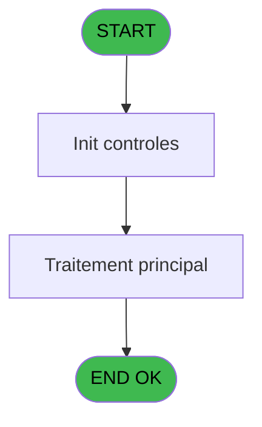
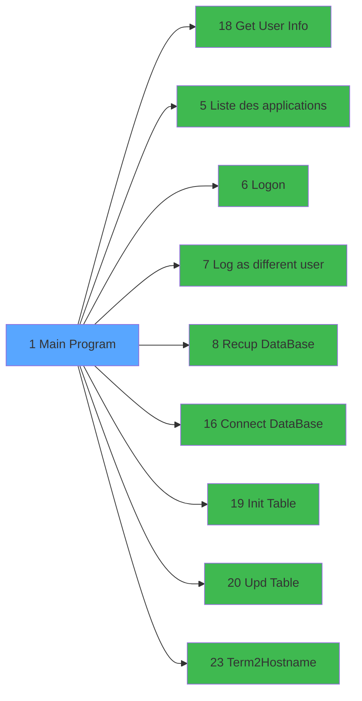

# Menu IDE 1 - Main Program

> **Analyse**: Phases 1-4 2026-02-03 15:08 -> 15:08 (10s) | Assemblage 15:08
> **Pipeline**: V7.2 Enrichi
> **Structure**: 4 onglets (Resume | Ecrans | Donnees | Connexions)

<!-- TAB:Resume -->

## 1. FICHE D'IDENTITE

| Attribut | Valeur |
|----------|--------|
| Projet | Menu |
| IDE Position | 1 |
| Nom Programme | Main Program |
| Fichier source | `Prg_1.xml` |
| Dossier IDE | General |
| Taches | 1 (1 ecrans visibles) |
| Tables modifiees | 0 |
| Programmes appeles | 9 |
| :warning: Statut | **ORPHELIN_POTENTIEL** |

## 2. DESCRIPTION FONCTIONNELLE

**Main Program** assure la gestion complete de ce processus.

Le flux de traitement s'organise en **1 blocs fonctionnels** :

- **Traitement** (1 tache) : traitements metier divers

## 3. BLOCS FONCTIONNELS

### 3.1 Traitement (1 tache)

Traitements internes.

---

#### 1 - Applications [[ECRAN]](#ecran-t1)

**Role** : Traitement : Applications.
**Ecran** : 320 x 200 DLU (Type11) | [Voir mockup](#ecran-t1)
**Delegue a** : [Get User Info (IDE 18)](Menu-IDE-18.md), [Liste des applications (IDE 5)](Menu-IDE-5.md), [Logon (IDE 6)](Menu-IDE-6.md)

## 5. REGLES METIER

*(Aucune regle metier identifiee)*

## 6. CONTEXTE

- **Appele par**: (aucun)
- **Appelle**: 9 programmes | **Tables**: 0 (W:0 R:0 L:0) | **Taches**: 1 | **Expressions**: 24

<!-- TAB:Ecrans -->

## 8. ECRANS

### 8.1 Forms visibles (1 / 1)

| # | Position | Tache | Nom | Type | Largeur | Hauteur | Bloc |
|---|----------|-------|-----|------|---------|---------|------|
| 1 | 1 | 1 | Applications | Type11 | 320 | 200 | Traitement |

### 8.2 Mockups Ecrans

## 9. NAVIGATION

Ecran unique: **Applications**

### 9.3 Structure hierarchique (1 tache)

| Position | Tache | Type | Dimensions | Bloc |
|----------|-------|------|------------|------|
| **1.1** | [**Applications** (1)](#t1) [mockup](#ecran-t1) | Type11 | 320x200 | Traitement |

### 9.4 Algorigramme

> **Legende**: Vert = START/END OK | Rouge = END KO | Bleu = Decisions
> *Algorigramme auto-genere. Utiliser `/algorigramme` pour une synthese metier detaillee.*

<!-- TAB:Donnees -->

## 10. TABLES

### Tables utilisees (0)

| ID | Nom | Description | Type | R | W | L | Usages |
|----|-----|-------------|------|---|---|---|--------|

### Colonnes par table (0 / 0 tables avec colonnes identifiees)

## 11. VARIABLES

### 11.1 Variables de session (2)

Variables persistantes pendant toute la session.

| Lettre | Nom | Type | Usage dans |
|--------|-----|------|-----------|
| I | V.ECF unique | Alpha | 2x session |
| J | V.Nb appli | Numeric | [1](#t1) |

### 11.2 Variables globales (9)

Variables globales partagees entre programmes.

| Lettre | Nom | Type | Usage dans |
|--------|-----|------|-----------|
| A | VG.LOGIN | Unicode | 1x variable globale |
| B | VG.USER | Unicode | 1x variable globale |
| K | VG.DATE | Alpha | - |
| L | VG.VERSION | Alpha | - |
| M | VG.COMPUTERNAME | Alpha | - |
| N | VG.SUPPORT(WS,TB) | Alpha | - |
| O | VG.Cryptage | Logical | - |
| P | VG.HOSTNAME AU LIEU DE TERM | Logical | - |
| Q | VG.Retour Chariot | Alpha | - |

### 11.3 Autres (6)

Variables diverses.

| Lettre | Nom | Type | Usage dans |
|--------|-----|------|-----------|
| C | Code Langue Utilisateur | Alpha | - |
| D | Is admin | Logical | - |
| E | Société | Alpha | 1x refs |
| F | Password | Alpha | 1x refs |
| G | Terminal | Alpha | 1x refs |
| H | L.Login OK ? | Logical | - |

Toutes les 17 variables (liste complete)

| Cat | Lettre | Nom Variable | Type |
|-----|--------|--------------|------|
| V. | **I** | V.ECF unique | Alpha |
| V. | **J** | V.Nb appli | Numeric |
| VG | **A** | VG.LOGIN | Unicode |
| VG | **B** | VG.USER | Unicode |
| VG | **K** | VG.DATE | Alpha |
| VG | **L** | VG.VERSION | Alpha |
| VG | **M** | VG.COMPUTERNAME | Alpha |
| VG | **N** | VG.SUPPORT(WS,TB) | Alpha |
| VG | **O** | VG.Cryptage | Logical |
| VG | **P** | VG.HOSTNAME AU LIEU DE TERM | Logical |
| VG | **Q** | VG.Retour Chariot | Alpha |
| Autre | **C** | Code Langue Utilisateur | Alpha |
| Autre | **D** | Is admin | Logical |
| Autre | **E** | Société | Alpha |
| Autre | **F** | Password | Alpha |
| Autre | **G** | Terminal | Alpha |
| Autre | **H** | L.Login OK ? | Logical |

## 12. EXPRESSIONS

**24 / 24 expressions decodees (100%)**

### 12.1 Repartition par type

| Type | Expressions | Regles |
|------|-------------|--------|
| CALCULATION | 1 | 0 |
| CONCATENATION | 4 | 0 |
| CONSTANTE | 6 | 0 |
| CONDITION | 5 | 0 |
| NEGATION | 1 | 0 |
| OTHER | 6 | 0 |
| FORMAT | 1 | 0 |

### 12.2 Expressions cles par type

#### CALCULATION (1 expressions)

| Type | IDE | Expression | Regle |
|------|-----|------------|-------|
| CALCULATION | 2 | `DbDel('{1,-1}'DSOURCE,'')` | - |

#### CONCATENATION (4 expressions)

| Type | IDE | Expression | Regle |
|------|-----|------------|-------|
| CONCATENATION | 23 | `'cmd /c rmdir /S /Q '&OSEnvGet('USERPROFILE')&'\Appdata\Local\Temp\.net'` | - |
| CONCATENATION | 22 | `StatusBarSetText(Translate(StrToken(StrToken(INIGet('[MAGIC_DATABASES]Pms'),5, ','), 1, '\')& ' : ' & StrToken(INIGet('[MAGIC_DATABASES]Pms'),3, ',')))` | - |
| CONCATENATION | 5 | `Translate('%EngineDir%MgxpaRuntime.exe 
/ini='&Translate('%env%')&'magic.ini'&' 
/InputPassword=N /Terminal=')&Trim(Société [E])&' 
/[MAGIC_LOGICAL_NAMES]club_user='&Trim(Terminal [G])&' 
/[MAGIC_LOGICAL_NAMES]SERVER='&Translate('%SERVER%')&' 
/StartApplication='&Translate('%club_prog%'&Trim(V.Nb appli [J]))&' 
/StartingLanguage='&Trim(VG.LOGIN [A])& ' 
/[MAGIC_LOGICAL_NAMES]club_hostname=' &Trim([AM])` | - |
| CONCATENATION | 10 | `'Applications -V '&ExpCalc('12'EXP)&' - '&ExpCalc('13'EXP)` | - |

#### CONSTANTE (6 expressions)

| Type | IDE | Expression | Regle |
|------|-----|------------|-------|
| CONSTANTE | 14 | `'1.00'` | - |
| CONSTANTE | 16 | `'T2H'` | - |
| CONSTANTE | 18 | `'0'` | - |
| CONSTANTE | 8 | `'1.16'` | - |
| CONSTANTE | 9 | `'21/11/2024'` | - |
| ... | | *+1 autres* | |

#### CONDITION (5 expressions)

| Type | IDE | Expression | Regle |
|------|-----|------------|-------|
| CONDITION | 12 | `INIGet ('[MAGIC_LOGICAL_NAMES]RecupDatabase') = 'O'` | - |
| CONDITION | 21 | `INIGet ('[MAGIC_LOGICAL_NAMES]RecupDatabase') = 'C'` | - |
| CONDITION | 7 | `V.Nb appli [J]<>''` | - |
| CONDITION | 1 | `RunMode()<=2` | - |
| CONDITION | 6 | `V.Nb appli [J]=''` | - |

#### NEGATION (1 expressions)

| Type | IDE | Expression | Regle |
|------|-----|------------|-------|
| NEGATION | 4 | `NOT V.ECF unique [I]` | - |

#### OTHER (6 expressions)

| Type | IDE | Expression | Regle |
|------|-----|------------|-------|
| OTHER | 19 | `[AP]` | - |
| OTHER | 20 | `OSEnvGet('COMPUTERNAME')` | - |
| OTHER | 24 | `ASCIIChr(13)&ASCIIChr(10)` | - |
| OTHER | 11 | `MID([AM],5,2)` | - |
| OTHER | 15 | `VG.USER [B]` | - |
| ... | | *+1 autres* | |

#### FORMAT (1 expressions)

| Type | IDE | Expression | Regle |
|------|-----|------------|-------|
| FORMAT | 3 | `Trim(Str(Term(),'3'))` | - |

### 12.3 Toutes les expressions (24)

Voir les 24 expressions

#### CALCULATION (1)

| IDE | Expression Decodee |
|-----|-------------------|
| 2 | `DbDel('{1,-1}'DSOURCE,'')` |

#### CONCATENATION (4)

| IDE | Expression Decodee |
|-----|-------------------|
| 5 | `Translate('%EngineDir%MgxpaRuntime.exe 
/ini='&Translate('%env%')&'magic.ini'&' 
/InputPassword=N /Terminal=')&Trim(Société [E])&' 
/[MAGIC_LOGICAL_NAMES]club_user='&Trim(Terminal [G])&' 
/[MAGIC_LOGICAL_NAMES]SERVER='&Translate('%SERVER%')&' 
/StartApplication='&Translate('%club_prog%'&Trim(V.Nb appli [J]))&' 
/StartingLanguage='&Trim(VG.LOGIN [A])& ' 
/[MAGIC_LOGICAL_NAMES]club_hostname=' &Trim([AM])` |
| 10 | `'Applications -V '&ExpCalc('12'EXP)&' - '&ExpCalc('13'EXP)` |
| 23 | `'cmd /c rmdir /S /Q '&OSEnvGet('USERPROFILE')&'\Appdata\Local\Temp\.net'` |
| 22 | `StatusBarSetText(Translate(StrToken(StrToken(INIGet('[MAGIC_DATABASES]Pms'),5, ','), 1, '\')& ' : ' & StrToken(INIGet('[MAGIC_DATABASES]Pms'),3, ',')))` |

#### CONSTANTE (6)

| IDE | Expression Decodee |
|-----|-------------------|
| 8 | `'1.16'` |
| 9 | `'21/11/2024'` |
| 13 | `'CRY'` |
| 14 | `'1.00'` |
| 16 | `'T2H'` |
| 18 | `'0'` |

#### CONDITION (5)

| IDE | Expression Decodee |
|-----|-------------------|
| 1 | `RunMode()<=2` |
| 6 | `V.Nb appli [J]=''` |
| 7 | `V.Nb appli [J]<>''` |
| 12 | `INIGet ('[MAGIC_LOGICAL_NAMES]RecupDatabase') = 'O'` |
| 21 | `INIGet ('[MAGIC_LOGICAL_NAMES]RecupDatabase') = 'C'` |

#### NEGATION (1)

| IDE | Expression Decodee |
|-----|-------------------|
| 4 | `NOT V.ECF unique [I]` |

#### OTHER (6)

| IDE | Expression Decodee |
|-----|-------------------|
| 11 | `MID([AM],5,2)` |
| 15 | `VG.USER [B]` |
| 17 | `V.ECF unique [I] AND [AP]` |
| 19 | `[AP]` |
| 20 | `OSEnvGet('COMPUTERNAME')` |
| 24 | `ASCIIChr(13)&ASCIIChr(10)` |

#### FORMAT (1)

| IDE | Expression Decodee |
|-----|-------------------|
| 3 | `Trim(Str(Term(),'3'))` |

<!-- TAB:Connexions -->

## 13. GRAPHE D'APPELS

### 13.1 Chaine depuis Main (Callers)

**Chemin**: (pas de callers directs)

### 13.2 Callers

| IDE | Nom Programme | Nb Appels |
|-----|---------------|-----------|
| - | (aucun) | - |

### 13.3 Callees (programmes appeles)

### 13.4 Detail Callees avec contexte

| IDE | Nom Programme | Appels | Contexte |
|-----|---------------|--------|----------|
| [18](Menu-IDE-18.md) | Get User Info | 2 | Recuperation donnees |
| [5](Menu-IDE-5.md) | Liste des applications | 1 | Configuration impression |
| [6](Menu-IDE-6.md) | Logon | 1 | Sous-programme |
| [7](Menu-IDE-7.md) | Log as different user | 1 | Sous-programme |
| [8](Menu-IDE-8.md) | Recup DataBase | 1 | Recuperation donnees |
| [16](Menu-IDE-16.md) | Connect DataBase | 1 | Sous-programme |
| [19](Menu-IDE-19.md) | Init Table | 1 | Reinitialisation |
| [20](Menu-IDE-20.md) | Upd Table | 1 | Sous-programme |
| [23](Menu-IDE-23.md) | Term2Hostname | 1 | Sous-programme |

## 14. RECOMMANDATIONS MIGRATION

### 14.1 Profil du programme

| Metrique | Valeur | Impact migration |
|----------|--------|-----------------|
| Lignes de logique | 55 | Programme compact |
| Expressions | 24 | Peu de logique |
| Tables WRITE | 0 | Impact faible |
| Sous-programmes | 9 | Dependances moderees |
| Ecrans visibles | 1 | Ecran unique ou traitement batch |
| Code desactive | 0% (0 / 55) | Code sain |
| Regles metier | 0 | Pas de regle identifiee |

### 14.2 Plan de migration par bloc

#### Traitement (1 tache: 1 ecran, 0 traitement)

- **Strategie** : 1 composant(s) UI (Razor/React) avec formulaires et validation.
- 9 sous-programme(s) a migrer ou a reutiliser depuis les services existants.
- Decomposer les taches en services unitaires testables.

### 14.3 Dependances critiques

| Dependance | Type | Appels | Impact |
|------------|------|--------|--------|
| [Get User Info (IDE 18)](Menu-IDE-18.md) | Sous-programme | 2x | Haute - Recuperation donnees |
| [Init Table (IDE 19)](Menu-IDE-19.md) | Sous-programme | 1x | Normale - Reinitialisation |
| [Connect DataBase (IDE 16)](Menu-IDE-16.md) | Sous-programme | 1x | Normale - Sous-programme |
| [Term2Hostname (IDE 23)](Menu-IDE-23.md) | Sous-programme | 1x | Normale - Sous-programme |
| [Upd Table (IDE 20)](Menu-IDE-20.md) | Sous-programme | 1x | Normale - Sous-programme |
| [Logon (IDE 6)](Menu-IDE-6.md) | Sous-programme | 1x | Normale - Sous-programme |
| [Liste des applications (IDE 5)](Menu-IDE-5.md) | Sous-programme | 1x | Normale - Configuration impression |
| [Recup DataBase (IDE 8)](Menu-IDE-8.md) | Sous-programme | 1x | Normale - Recuperation donnees |
| [Log as different user (IDE 7)](Menu-IDE-7.md) | Sous-programme | 1x | Normale - Sous-programme |

---
*Spec DETAILED generee par Pipeline V7.2 - 2026-02-03 15:08*
