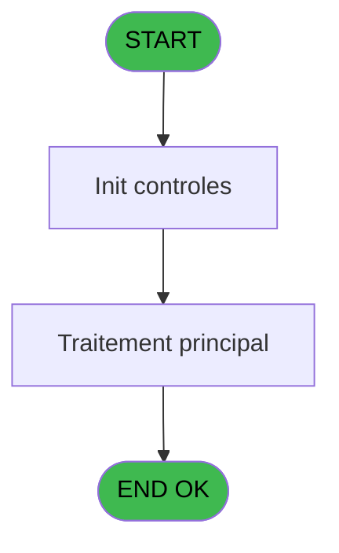

# Menu IDE 12 - GetBackup

> **Analyse**: Phases 1-4 2026-02-03 15:12 -> 15:12 (13s) | Assemblage 15:12
> **Pipeline**: V7.2 Enrichi
> **Structure**: 4 onglets (Resume | Ecrans | Donnees | Connexions)

<!-- TAB:Resume -->

## 1. FICHE D'IDENTITE

| Attribut | Valeur |
|----------|--------|
| Projet | Menu |
| IDE Position | 12 |
| Nom Programme | GetBackup |
| Fichier source | `Prg_12.xml` |
| Dossier IDE | Recup |
| Taches | 1 (0 ecrans visibles) |
| Tables modifiees | 0 |
| Programmes appeles | 0 |

## 2. DESCRIPTION FONCTIONNELLE

**GetBackup** assure la gestion complete de ce processus, accessible depuis [Recup DataBase (IDE 8)](Menu-IDE-8.md).

Le flux de traitement s'organise en **1 blocs fonctionnels** :

- **Traitement** (1 tache) : traitements metier divers

## 3. BLOCS FONCTIONNELS

### 3.1 Traitement (1 tache)

Traitements internes.

---

#### 12 - GetBackup [[ECRAN]](#ecran-t1)

**Role** : Consultation/chargement : GetBackup.
**Ecran** : 671 x 347 DLU | [Voir mockup](#ecran-t1)

## 5. REGLES METIER

*(Aucune regle metier identifiee)*

## 6. CONTEXTE

- **Appele par**: [Recup DataBase (IDE 8)](Menu-IDE-8.md)
- **Appelle**: 0 programmes | **Tables**: 0 (W:0 R:0 L:0) | **Taches**: 1 | **Expressions**: 9

<!-- TAB:Ecrans -->

## 8. ECRANS

*(Programme sans ecran visible)*

## 9. NAVIGATION

### 9.3 Structure hierarchique (1 tache)

| Position | Tache | Type | Dimensions | Bloc |
|----------|-------|------|------------|------|
| **12.1** | [**GetBackup** (12)](#t1) [mockup](#ecran-t1) | - | 671x347 | Traitement |

### 9.4 Algorigramme

> **Legende**: Vert = START/END OK | Rouge = END KO | Bleu = Decisions
> *Algorigramme auto-genere. Utiliser `/algorigramme` pour une synthese metier detaillee.*

<!-- TAB:Donnees -->

## 10. TABLES

### Tables utilisees (0)

| ID | Nom | Description | Type | R | W | L | Usages |
|----|-----|-------------|------|---|---|---|--------|

### Colonnes par table (0 / 0 tables avec colonnes identifiees)

## 11. VARIABLES

### 11.1 Parametres entrants (11)

Variables recues du programme appelant ([Recup DataBase (IDE 8)](Menu-IDE-8.md)).

| Lettre | Nom | Type | Usage dans |
|--------|-----|------|-----------|
| A | P.RepertoirGetFilecmd | Alpha | 2x parametre entrant |
| B | P.Serveur | Unicode | 2x parametre entrant |
| C | P.Utilisateur | Unicode | 2x parametre entrant |
| D | P.Password | Unicode | 2x parametre entrant |
| E | P.RepertoireSource | Alpha | 2x parametre entrant |
| F | P.DataBaseName | Alpha | 3x parametre entrant |
| G | P.RepertoireDestination | Alpha | 6x parametre entrant |
| H | P.RepertoireReboCopy | Alpha | 2x parametre entrant |
| I | P.Avant/AprèsCloture | Numeric | - |
| J | P.Archivage | Logical | - |
| K | P.MessageErreur | Unicode | 1x parametre entrant |

### 11.2 Variables de session (1)

Variables persistantes pendant toute la session.

| Lettre | Nom | Type | Usage dans |
|--------|-----|------|-----------|
| L | V.ResultCMD | Numeric | 1x session |

## 12. EXPRESSIONS

**9 / 9 expressions decodees (100%)**

### 12.1 Repartition par type

| Type | Expressions | Regles |
|------|-------------|--------|
| CALCULATION | 1 | 0 |
| CONSTANTE | 1 | 0 |
| CONDITION | 2 | 0 |
| CONCATENATION | 2 | 0 |
| NEGATION | 2 | 0 |
| STRING | 1 | 0 |

### 12.2 Expressions cles par type

#### CALCULATION (1 expressions)

| Type | IDE | Expression | Regle |
|------|-----|------------|-------|
| CALCULATION | 1 | `'cmd /c MKDIR '&Trim(P.RepertoireDestination [G])` | - |

#### CONSTANTE (1 expressions)

| Type | IDE | Expression | Regle |
|------|-----|------------|-------|
| CONSTANTE | 7 | `'Erreur lors de la récupération de la sauvegarde.'` | - |

#### CONDITION (2 expressions)

| Type | IDE | Expression | Regle |
|------|-----|------------|-------|
| CONDITION | 8 | `Trim(P.MessageErreur [K]) = ''` | - |
| CONDITION | 5 | `V.ResultCMD [L] > 0` | - |

#### CONCATENATION (2 expressions)

| Type | IDE | Expression | Regle |
|------|-----|------------|-------|
| CONCATENATION | 9 | `Trim(P.RepertoirGetFilecmd [A])&'getfile.cmd'&' '&Trim(P.Serveur [B])&' '&Trim(P.Utilisateur [C])&' '&Trim(P.Password [D])&' '&Trim(P.RepertoireSource [E])&' '&Trim(P.DataBaseName [F])&' '&Trim(P.RepertoireDestination [G]) & ' '&Trim(P.RepertoireReboCopy [H])&'ROBOCOPY.EXE'` | - |
| CONCATENATION | 2 | `Trim(P.RepertoirGetFilecmd [A])&'getfile.cmd'&' '&Trim(P.Serveur [B])&' '&Trim(P.Utilisateur [C])&' '&Trim(P.Password [D])&' '&Trim(P.RepertoireSource [E])&' '&Trim(P.DataBaseName [F])&' '&Trim(P.RepertoireDestination [G]) & ' '&Trim(P.RepertoireReboCopy [H])&'ROBOCOPY.EXE'` | - |

#### NEGATION (2 expressions)

| Type | IDE | Expression | Regle |
|------|-----|------------|-------|
| NEGATION | 6 | `NOT FileExist(Trim(P.RepertoireDestination [G])& Trim(P.DataBaseName [F]))` | - |
| NEGATION | 3 | `NOT (FileExist (Trim(P.RepertoireDestination [G])))` | - |

#### STRING (1 expressions)

| Type | IDE | Expression | Regle |
|------|-----|------------|-------|
| STRING | 4 | `'Erreur lors de la création du répértoire : ' & Trim(P.RepertoireDestination [G])` | - |

<!-- TAB:Connexions -->

## 13. GRAPHE D'APPELS

### 13.1 Chaine depuis Main (Callers)

Main -> ... -> [Recup DataBase (IDE 8)](Menu-IDE-8.md) -> **GetBackup (IDE 12)**

### 13.2 Callers

| IDE | Nom Programme | Nb Appels |
|-----|---------------|-----------|
| [8](Menu-IDE-8.md) | Recup DataBase | 3 |

### 13.3 Callees (programmes appeles)

### 13.4 Detail Callees avec contexte

| IDE | Nom Programme | Appels | Contexte |
|-----|---------------|--------|----------|
| - | (aucun) | - | - |

## 14. RECOMMANDATIONS MIGRATION

### 14.1 Profil du programme

| Metrique | Valeur | Impact migration |
|----------|--------|-----------------|
| Lignes de logique | 25 | Programme compact |
| Expressions | 9 | Peu de logique |
| Tables WRITE | 0 | Impact faible |
| Sous-programmes | 0 | Peu de dependances |
| Ecrans visibles | 0 | Ecran unique ou traitement batch |
| Code desactive | 4% (1 / 25) | Code sain |
| Regles metier | 0 | Pas de regle identifiee |

### 14.2 Plan de migration par bloc

#### Traitement (1 tache: 1 ecran, 0 traitement)

- **Strategie** : 1 composant(s) UI (Razor/React) avec formulaires et validation.
- Decomposer les taches en services unitaires testables.

### 14.3 Dependances critiques

| Dependance | Type | Appels | Impact |
|------------|------|--------|--------|

---
*Spec DETAILED generee par Pipeline V7.2 - 2026-02-03 15:12*
