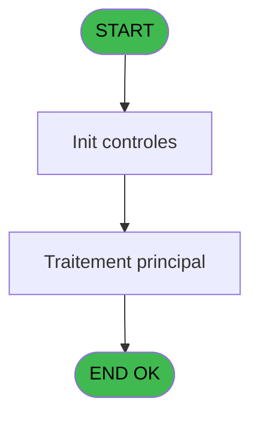

# Menu IDE 13 - DB restauration

> **Analyse**: Phases 1-4 2026-02-03 15:12 -> 15:12 (11s) | Assemblage 15:12
> **Pipeline**: V7.2 Enrichi
> **Structure**: 4 onglets (Resume | Ecrans | Donnees | Connexions)

<!-- TAB:Resume -->

## 1. FICHE D'IDENTITE

| Attribut | Valeur |
|----------|--------|
| Projet | Menu |
| IDE Position | 13 |
| Nom Programme | DB restauration |
| Fichier source | `Prg_13.xml` |
| Dossier IDE | Recup |
| Taches | 2 (0 ecrans visibles) |
| Tables modifiees | 0 |
| Programmes appeles | 0 |

## 2. DESCRIPTION FONCTIONNELLE

**DB restauration** assure la gestion complete de ce processus, accessible depuis [Recup DataBase (IDE 8)](Menu-IDE-8.md).

Le flux de traitement s'organise en **1 blocs fonctionnels** :

- **Traitement** (2 taches) : traitements metier divers

## 3. BLOCS FONCTIONNELS

### 3.1 Traitement (2 taches)

Traitements internes.

---

#### 13 - DB restauration [[ECRAN]](#ecran-t1)

**Role** : Traitement : DB restauration.
**Ecran** : 540 x 0 DLU | [Voir mockup](#ecran-t1)
**Variables liees** : A (P.RepertoireBatchRestauration), B (P.RestaurationBatchFile), T (V.CommandeRestauration)

---

#### 13.1 - (sans nom)

**Role** : Traitement interne.

## 5. REGLES METIER

*(Aucune regle metier identifiee)*

## 6. CONTEXTE

- **Appele par**: [Recup DataBase (IDE 8)](Menu-IDE-8.md)
- **Appelle**: 0 programmes | **Tables**: 0 (W:0 R:0 L:0) | **Taches**: 2 | **Expressions**: 14

<!-- TAB:Ecrans -->

## 8. ECRANS

*(Programme sans ecran visible)*

## 9. NAVIGATION

### 9.3 Structure hierarchique (2 taches)

| Position | Tache | Type | Dimensions | Bloc |
|----------|-------|------|------------|------|
| **13.1** | [**DB restauration** (13)](#t1) [mockup](#ecran-t1) | - | 540x0 | Traitement |
| 13.1.1 | [(sans nom) (13.1)](#t2) | - | - | |

### 9.4 Algorigramme

> **Legende**: Vert = START/END OK | Rouge = END KO | Bleu = Decisions
> *Algorigramme auto-genere. Utiliser `/algorigramme` pour une synthese metier detaillee.*

<!-- TAB:Donnees -->

## 10. TABLES

### Tables utilisees (0)

| ID | Nom | Description | Type | R | W | L | Usages |
|----|-----|-------------|------|---|---|---|--------|

### Colonnes par table (0 / 0 tables avec colonnes identifiees)

## 11. VARIABLES

### 11.1 Parametres entrants (10)

Variables recues du programme appelant ([Recup DataBase (IDE 8)](Menu-IDE-8.md)).

| Lettre | Nom | Type | Usage dans |
|--------|-----|------|-----------|
| A | P.RepertoireBatchRestauration | Alpha | - |
| B | P.RestaurationBatchFile | Alpha | 1x parametre entrant |
| C | P.BackupFolderName | Alpha | 2x parametre entrant |
| D | P.RestoreFolderName | Alpha | 1x parametre entrant |
| E | P.DataBaseBackupFileName | Alpha | 2x parametre entrant |
| F | P.DezipBatchFileName | Alpha | 1x parametre entrant |
| G | P.DataBaseName | Alpha | 2x parametre entrant |
| K | P.MessageErreur | Unicode | 1x parametre entrant |
| L | P.Avant/Après Cloture? | Numeric | 1x parametre entrant |
| M | P.Archivage | Logical | 1x parametre entrant |

### 11.2 Variables de session (8)

Variables persistantes pendant toute la session.

| Lettre | Nom | Type | Usage dans |
|--------|-----|------|-----------|
| N | V.DB UserName | Alpha | 2x session |
| O | V.DB Password | Alpha | 1x session |
| P | V.FileNameSansExtention | Alpha | 1x session |
| Q | V.RepertoireZip | Alpha | 2x session |
| R | V.RepertoirTar | Alpha | 1x session |
| T | V.CommandeRestauration | Alpha | 1x session |
| U | V.ResultCMD | Numeric | 1x session |
| V | V.FichierResult | Blob | 1x session |

### 11.3 Autres (4)

Variables diverses.

| Lettre | Nom | Type | Usage dans |
|--------|-----|------|-----------|
| H | RepertoireMDF | Alpha | 1x refs |
| I | RepertoireLDF | Alpha | 1x refs |
| J | SQLServerName | Alpha | 1x refs |
| S | Fichier.bak | Alpha | 1x refs |

Toutes les 22 variables (liste complete)

| Cat | Lettre | Nom Variable | Type |
|-----|--------|--------------|------|
| P0 | **A** | P.RepertoireBatchRestauration | Alpha |
| P0 | **B** | P.RestaurationBatchFile | Alpha |
| P0 | **C** | P.BackupFolderName | Alpha |
| P0 | **D** | P.RestoreFolderName | Alpha |
| P0 | **E** | P.DataBaseBackupFileName | Alpha |
| P0 | **F** | P.DezipBatchFileName | Alpha |
| P0 | **G** | P.DataBaseName | Alpha |
| P0 | **K** | P.MessageErreur | Unicode |
| P0 | **L** | P.Avant/Après Cloture? | Numeric |
| P0 | **M** | P.Archivage | Logical |
| V. | **N** | V.DB UserName | Alpha |
| V. | **O** | V.DB Password | Alpha |
| V. | **P** | V.FileNameSansExtention | Alpha |
| V. | **Q** | V.RepertoireZip | Alpha |
| V. | **R** | V.RepertoirTar | Alpha |
| V. | **T** | V.CommandeRestauration | Alpha |
| V. | **U** | V.ResultCMD | Numeric |
| V. | **V** | V.FichierResult | Blob |
| Autre | **H** | RepertoireMDF | Alpha |
| Autre | **I** | RepertoireLDF | Alpha |
| Autre | **J** | SQLServerName | Alpha |
| Autre | **S** | Fichier.bak | Alpha |

## 12. EXPRESSIONS

**14 / 14 expressions decodees (100%)**

### 12.1 Repartition par type

| Type | Expressions | Regles |
|------|-------------|--------|
| CALCULATION | 1 | 0 |
| CONSTANTE | 1 | 0 |
| OTHER | 1 | 0 |
| CONDITION | 3 | 0 |
| CONCATENATION | 2 | 0 |
| STRING | 6 | 0 |

### 12.2 Expressions cles par type

#### CALCULATION (1 expressions)

| Type | IDE | Expression | Regle |
|------|-----|------------|-------|
| CALCULATION | 7 | `StrToken (Trim(V.DB UserName [N]),1,'-')` | - |

#### CONSTANTE (1 expressions)

| Type | IDE | Expression | Regle |
|------|-----|------------|-------|
| CONSTANTE | 14 | `'sqlcmd -S lpc:.\SQLEXPRESS -d master -d PMS -Q "GRANT EXECUTE TO pms"'` | - |

#### OTHER (1 expressions)

| Type | IDE | Expression | Regle |
|------|-----|------------|-------|
| OTHER | 6 | `INIGet ('[MAGIC_LOGICAL_NAMES]club_ip_exe')` | - |

#### CONDITION (3 expressions)

| Type | IDE | Expression | Regle |
|------|-----|------------|-------|
| CONDITION | 10 | `Fichier.bak [S] > 0 OR InStr (V.FichierResult [V],'RESTORE DATABASE successfully processed') = 0` | - |
| CONDITION | 9 | `Trim(P.MessageErreur [K]) = ''` | - |
| CONDITION | 12 | `V.CommandeRestauration [T]=2 AND NOT(V.ResultCMD [U])` | - |

#### CONCATENATION (2 expressions)

| Type | IDE | Expression | Regle |
|------|-----|------------|-------|
| CONCATENATION | 4 | `Trim(P.RepertoireBatchResta... [A]) & Trim(P.RestaurationBatchFile [B]) & ' ' & Trim(P.RestoreFolderName [D]) & ' ' & Trim(V.RepertoireZip [Q]) & ' ' & Trim(SQLServerName [J]) & ' ' & Trim(P.DataBaseName [G]) & ' ' & Trim(RepertoireMDF [H]) & ' ' & Trim(RepertoireLDF [I]) & ' ' & Trim(P.Avant/Après Cloture? [L]) & ' ' & Trim(P.Archivage [M])` | - |
| CONCATENATION | 1 | `Trim(P.RepertoireBatchResta... [A]) & Trim(P.DezipBatchFileName [F]) & ' ' & Trim(V.DB Password [O]) & ' ' & Trim(V.FileNameSansExtention [P]) & ' ' & Trim(P.BackupFolderName [C]) & ' ' & Trim(V.DB UserName [N])` | - |

#### STRING (6 expressions)

| Type | IDE | Expression | Regle |
|------|-----|------------|-------|
| STRING | 8 | `'Erreur lors de la décompression du fichier : ' & Trim(P.DataBaseBackupFileName [E])` | - |
| STRING | 11 | `'Erreur lors de la restauration de la base de données : ' & Trim(P.DataBaseName [G])` | - |
| STRING | 13 | `File2Blb(Trim(P.BackupFolderName [C]) & 'Restore.rs')` | - |
| STRING | 2 | `RepStr (Trim(P.DataBaseBackupFileName [E]),'.tar.gz','')` | - |
| STRING | 3 | `Trim(V.RepertoireZip [Q]) & '2'` | - |
| ... | | *+1 autres* | |

<!-- TAB:Connexions -->

## 13. GRAPHE D'APPELS

### 13.1 Chaine depuis Main (Callers)

Main -> ... -> [Recup DataBase (IDE 8)](Menu-IDE-8.md) -> **DB restauration (IDE 13)**

### 13.2 Callers

| IDE | Nom Programme | Nb Appels |
|-----|---------------|-----------|
| [8](Menu-IDE-8.md) | Recup DataBase | 2 |

### 13.3 Callees (programmes appeles)

### 13.4 Detail Callees avec contexte

| IDE | Nom Programme | Appels | Contexte |
|-----|---------------|--------|----------|
| - | (aucun) | - | - |

## 14. RECOMMANDATIONS MIGRATION

### 14.1 Profil du programme

| Metrique | Valeur | Impact migration |
|----------|--------|-----------------|
| Lignes de logique | 54 | Programme compact |
| Expressions | 14 | Peu de logique |
| Tables WRITE | 0 | Impact faible |
| Sous-programmes | 0 | Peu de dependances |
| Ecrans visibles | 0 | Ecran unique ou traitement batch |
| Code desactive | 1.9% (1 / 54) | Code sain |
| Regles metier | 0 | Pas de regle identifiee |

### 14.2 Plan de migration par bloc

#### Traitement (2 taches: 1 ecran, 1 traitement)

- **Strategie** : Orchestrateur avec 1 ecrans (Razor/React) et 1 traitements backend (services).
- Les ecrans deviennent des composants UI, les traitements invisibles deviennent des services injectables.
- Decomposer les taches en services unitaires testables.

### 14.3 Dependances critiques

| Dependance | Type | Appels | Impact |
|------------|------|--------|--------|

---
*Spec DETAILED generee par Pipeline V7.2 - 2026-02-03 15:12*
