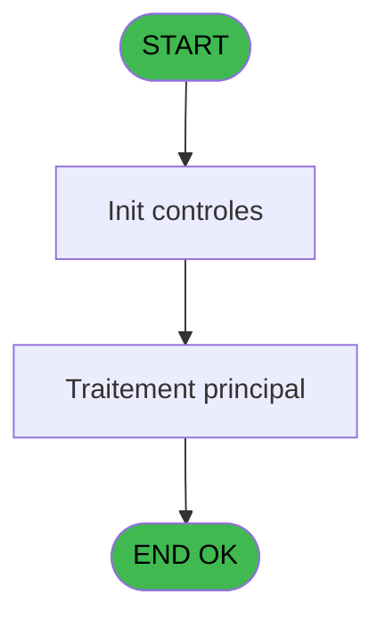

# Menu IDE 14 - Anonymisation Données

> **Analyse**: Phases 1-4 2026-02-03 15:12 -> 15:12 (14s) | Assemblage 15:12
> **Pipeline**: V7.2 Enrichi
> **Structure**: 4 onglets (Resume | Ecrans | Donnees | Connexions)

<!-- TAB:Resume -->

## 1. FICHE D'IDENTITE

| Attribut | Valeur |
|----------|--------|
| Projet | Menu |
| IDE Position | 14 |
| Nom Programme | Anonymisation Données |
| Fichier source | `Prg_14.xml` |
| Dossier IDE | Recup |
| Taches | 1 (0 ecrans visibles) |
| Tables modifiees | 0 |
| Programmes appeles | 0 |

## 2. DESCRIPTION FONCTIONNELLE

**Anonymisation Données** assure la gestion complete de ce processus, accessible depuis [Recup DataBase (IDE 8)](Menu-IDE-8.md).

Le flux de traitement s'organise en **1 blocs fonctionnels** :

- **Traitement** (1 tache) : traitements metier divers

## 3. BLOCS FONCTIONNELS

### 3.1 Traitement (1 tache)

Traitements internes.

---

#### 14 - Anonymisation Données [[ECRAN]](#ecran-t1)

**Role** : Traitement : Anonymisation Données.
**Ecran** : 540 x 0 DLU | [Voir mockup](#ecran-t1)

## 5. REGLES METIER

*(Aucune regle metier identifiee)*

## 6. CONTEXTE

- **Appele par**: [Recup DataBase (IDE 8)](Menu-IDE-8.md)
- **Appelle**: 0 programmes | **Tables**: 0 (W:0 R:0 L:0) | **Taches**: 1 | **Expressions**: 5

<!-- TAB:Ecrans -->

## 8. ECRANS

*(Programme sans ecran visible)*

## 9. NAVIGATION

### 9.3 Structure hierarchique (1 tache)

| Position | Tache | Type | Dimensions | Bloc |
|----------|-------|------|------------|------|
| **14.1** | [**Anonymisation Données** (14)](#t1) [mockup](#ecran-t1) | - | 540x0 | Traitement |

### 9.4 Algorigramme

> **Legende**: Vert = START/END OK | Rouge = END KO | Bleu = Decisions
> *Algorigramme auto-genere. Utiliser `/algorigramme` pour une synthese metier detaillee.*

<!-- TAB:Donnees -->

## 10. TABLES

### Tables utilisees (0)

| ID | Nom | Description | Type | R | W | L | Usages |
|----|-----|-------------|------|---|---|---|--------|

### Colonnes par table (0 / 0 tables avec colonnes identifiees)

## 11. VARIABLES

### 11.1 Parametres entrants (3)

Variables recues du programme appelant ([Recup DataBase (IDE 8)](Menu-IDE-8.md)).

| Lettre | Nom | Type | Usage dans |
|--------|-----|------|-----------|
| A | P.ServerName | Alpha | 1x parametre entrant |
| B | P.DataBaseName | Alpha | 1x parametre entrant |
| C | P.ARCHDataBaseName | Alpha | - |

### 11.2 Variables de session (4)

Variables persistantes pendant toute la session.

| Lettre | Nom | Type | Usage dans |
|--------|-----|------|-----------|
| D | V.DB UserName | Alpha | 1x session |
| E | V.DB Password | Alpha | 1x session |
| F | V.Query | Alpha | 1x session |
| G | V.SqlCmd | Alpha | 1x session |

## 12. EXPRESSIONS

**5 / 5 expressions decodees (100%)**

### 12.1 Repartition par type

| Type | Expressions | Regles |
|------|-------------|--------|
| CONCATENATION | 1 | 0 |
| CONSTANTE | 2 | 0 |
| CONDITION | 1 | 0 |
| STRING | 1 | 0 |

### 12.2 Expressions cles par type

#### CONCATENATION (1 expressions)

| Type | IDE | Expression | Regle |
|------|-----|------------|-------|
| CONCATENATION | 4 | `'sqlcmd -S' & Trim(P.ServerName [A]) & '\SQLEXPRESS -U ' & Trim(V.DB UserName [D]) & ' -P ' & Trim(V.DB Password [E]) & ' -d ' & Trim(P.DataBaseName [B]) & ' -Q "' & Trim(V.Query [F]) & '"'` | - |

#### CONSTANTE (2 expressions)

| Type | IDE | Expression | Regle |
|------|-----|------------|-------|
| CONSTANTE | 2 | `'trident45*'` | - |
| CONSTANTE | 1 | `'pmsadmin'` | - |

#### CONDITION (1 expressions)

| Type | IDE | Expression | Regle |
|------|-----|------------|-------|
| CONDITION | 3 | `'update cafil009_dat set gmc_piece_id = '''',gmc_numero_piece = '''',gmc_date_delivrance = ''00000000'',gmc_date_validite = ''00000000'',gmc_ville_delivrance = '''',gmc_pays_delivrance = '''',gmc_nom_commune = '''',gmc_code_postal = '''',gmc_ville_bureau_dis = '''',gmc_etat_province = '''',gmc_pays_residence = '''',gmc_num_dans_la_rue = '''',gmc_nom_de_la_rue = ''''update email set ema_email = '''',ema_telephone_portable = ''''update cafil017_dat set dga_num_dossier_pms = '''',dga_num_dossier_na = '''''` | - |

#### STRING (1 expressions)

| Type | IDE | Expression | Regle |
|------|-----|------------|-------|
| STRING | 5 | `Trim(V.SqlCmd [G])` | - |

<!-- TAB:Connexions -->

## 13. GRAPHE D'APPELS

### 13.1 Chaine depuis Main (Callers)

Main -> ... -> [Recup DataBase (IDE 8)](Menu-IDE-8.md) -> **Anonymisation Données (IDE 14)**

### 13.2 Callers

| IDE | Nom Programme | Nb Appels |
|-----|---------------|-----------|
| [8](Menu-IDE-8.md) | Recup DataBase | 1 |

### 13.3 Callees (programmes appeles)

### 13.4 Detail Callees avec contexte

| IDE | Nom Programme | Appels | Contexte |
|-----|---------------|--------|----------|
| - | (aucun) | - | - |

## 14. RECOMMANDATIONS MIGRATION

### 14.1 Profil du programme

| Metrique | Valeur | Impact migration |
|----------|--------|-----------------|
| Lignes de logique | 16 | Programme compact |
| Expressions | 5 | Peu de logique |
| Tables WRITE | 0 | Impact faible |
| Sous-programmes | 0 | Peu de dependances |
| Ecrans visibles | 0 | Ecran unique ou traitement batch |
| Code desactive | 0% (0 / 16) | Code sain |
| Regles metier | 0 | Pas de regle identifiee |

### 14.2 Plan de migration par bloc

#### Traitement (1 tache: 1 ecran, 0 traitement)

- **Strategie** : 1 composant(s) UI (Razor/React) avec formulaires et validation.
- Decomposer les taches en services unitaires testables.

### 14.3 Dependances critiques

| Dependance | Type | Appels | Impact |
|------------|------|--------|--------|

---
*Spec DETAILED generee par Pipeline V7.2 - 2026-02-03 15:13*
